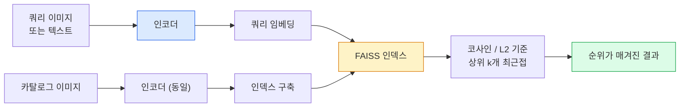

> 🇰🇷 이 문서는 한국어 번역본입니다(ELI5 스타일). 원문: [en.md](en.md)

# 이미지 검색과 메트릭 학습 (Image Retrieval & Metric Learning)

> 검색 시스템은 임베딩 공간 안의 거리로 후보의 순위를 매깁니다. 메트릭 학습(metric learning)은 그 공간을 다듬어서 거리가 우리가 원하는 의미를 갖게 만드는 분야입니다.

**유형:** Build
**언어:** Python
**선수 지식:** 페이즈 4 레슨 14(ViT), 페이즈 4 레슨 18(CLIP)
**시간:** 약 45분

## 학습 목표

- 트리플렛(triplet), 대조(contrastive), 프록시(proxy) 기반 메트릭 학습 손실이 무엇인지 설명하고, 주어진 데이터셋에 알맞은 손실을 고릅니다.
- L2 정규화(L2-normalisation)와 코사인 유사도를 올바르게 구현하고, "같은 아이템" 검색과 "같은 클래스" 검색의 차이를 점검합니다.
- FAISS 인덱스를 만들고, 텍스트와 이미지로 질의(query)하여 홀드아웃(held-out) 질의 집합에 대한 recall@K를 보고합니다.
- DINOv2, CLIP, SigLIP을 바로 쓸 수 있는 임베딩 백본으로 활용하고, 각각이 언제 유리한지 압니다.

## 문제 상황

검색(retrieval)은 프로덕션(운영 환경) 비전 곳곳에 있습니다: 중복 탐지, 역이미지 검색, 비주얼 검색("비슷한 상품 찾기"), 얼굴 재식별, 감시용 사람 재식별(person re-ID), 전자상거래의 인스턴스 수준 매칭. 제품 관점의 질문은 늘 같습니다: "이 질의 이미지가 주어졌을 때, 내 카탈로그의 순위를 매겨라."

두 가지 설계 결정이 시스템 전체를 좌우합니다. 하나는 임베딩 — 어떤 모델이 벡터를 만드느냐입니다. 다른 하나는 인덱스 — 대규모에서 최근접 이웃을 어떻게 찾느냐입니다. 2026년 기준 둘 다 상품화되어 있습니다(임베딩은 DINOv2, 인덱스는 FAISS). 그래서 기준이 더 높아집니다: 진짜 어려운 부분은 *무엇을 비슷하다고 볼 것인가*를 애플리케이션에 맞게 정의하고, 임베딩 공간을 그 정의에 맞게 다듬는 일입니다.

그 다듬는 작업이 바로 메트릭 학습입니다. 작지만 효과가 아주 큰 분야입니다.

## 개념

### 검색 한눈에 보기



### 네 가지 손실 계열

| 손실 | 필요한 것 | 장점 | 단점 |
|------|----------|------|------|
| **대조(Contrastive)** | (앵커, 긍정) 쌍 + 부정 샘플 | 단순, 어떤 쌍 레이블로도 동작 | 부정 샘플이 충분하지 않으면 수렴이 느림 |
| **트리플렛(Triplet)** | (앵커, 긍정, 부정) | 직관적, 마진을 직접 제어 | 하드 트리플렛 마이닝 비용이 큼 |
| **NT-Xent / InfoNCE** | 쌍 + 배치에서 뽑은 부정 샘플 | 큰 배치로 확장 가능 | 큰 배치나 모멘텀 큐가 필요 |
| **프록시 기반(ProxyNCA)** | 클래스 레이블만 필요 | 빠르고 안정적, 마이닝 불필요 | 작은 데이터셋에서 프록시에 과적합할 수 있음 |

대부분의 프로덕션 용도에서는 사전학습된 백본으로 시작하고, 기성 임베딩이 테스트셋에서 기대에 못 미칠 때만 메트릭 학습 파인튜닝을 추가하세요.

### 트리플렛 손실 공식

```
L = max(0, ||f(a) - f(p)||^2 - ||f(a) - f(n)||^2 + margin)
```

앵커 `a`를 긍정 `p`와 가까이 당기고, 부정 `n`으로부터 밀어냅니다. `margin`은 그 사이 간격을 보장합니다. 이 세 이미지 구조는 모든 유사도 순서 문제로 일반화됩니다.

마이닝(mining)이 중요합니다: 쉬운 트리플렛(`n`이 이미 `a`에서 멀리 있음)은 손실이 0이라 네트워크를 가르쳐주지 않고, 하드 트리플렛만이 가르칩니다. 세미하드 마이닝(`n`이 `p`보다 멀지만 마진 안에 있음)은 2016년 FaceNet 레시피로, 지금도 표준입니다.

### 코사인 유사도 vs L2

두 가지 지표, 두 가지 관례:

- **코사인**: 벡터 사이의 각도. L2 정규화된 임베딩이 필요합니다.
- **L2**: 유클리드 거리. 원시(raw) 임베딩이든 정규화된 임베딩이든 동작하지만, 보통 L2 정규화 + 제곱 L2와 함께 씁니다.

대부분의 현대 신경망에서 둘은 동치입니다: `||a|| = ||b|| = 1`이면 `||a - b||^2 = 2 - 2 cos(a, b)`. 임베딩 학습에 쓰인 관례에 맞춰 고르세요. 둘을 섞어 쓰면 "가장 가깝다"의 의미가 조용히 바뀝니다.

### Recall@K

표준 검색 지표:

```
recall@K = 상위 K개 결과 안에 올바른 매치가 하나라도 있는 질의의 비율
```

recall@1, @5, @10을 나란히 보고하세요. recall@10이 0.95를 넘는데 recall@1이 0.5 미만이면, 임베딩 공간의 구조는 맞지만 순위 매기기가 시끄럽다(noisy)는 뜻입니다 — 파인튜닝을 더 하거나 재순위(re-ranking) 단계를 넣어보세요.

중복 탐지에서는 정밀도(precision@K)가 더 중요합니다. 모든 거짓 양성(false positive)이 사용자 눈에 보이는 실수이기 때문입니다. 비주얼 검색에서는 recall@K가 제품 신호입니다.

### FAISS 한 단락 요약

Facebook AI Similarity Search. 최근접 이웃 검색의 사실상 표준 라이브러리입니다. 인덱스 선택지는 세 가지:

- `IndexFlatIP` / `IndexFlatL2` — 무차별 대입(brute force), 정확, 학습 불필요. 약 100만 벡터까지 사용.
- `IndexIVFFlat` — K개 셀로 분할하고 가장 가까운 몇 개 셀만 검색. 근사, 빠름, 학습 데이터 필요.
- `IndexHNSW` — 그래프 기반, 질의가 많을 때 가장 빠름, 인덱스 크기가 큼.

10만 벡터라면 코사인 유사도 기준 `IndexFlatIP`면 충분합니다. 1,000만이면 `IndexIVFFlat`. 1억 개 이상이면 곱 양자화(product quantisation)를 결합한 `IndexIVFPQ`를 씁니다.

### 인스턴스 수준 vs 카테고리 수준 검색

같은 이름을 쓰지만 전혀 다른 두 문제:

- **카테고리 수준** — "내 카탈로그에서 고양이를 찾아라." 클래스 조건부 유사도. 기성 CLIP / DINOv2 임베딩으로 잘 동작합니다.
- **인스턴스 수준** — "내 카탈로그에서 *바로 그 상품*을 찾아라." 같은 클래스 안에서 시각적으로 비슷한 객체를 구분하는 세밀한(fine-grained) 판별이 필요합니다. 기성 임베딩은 성능이 부족하고, 메트릭 학습을 곁들인 파인튜닝이 중요합니다.

모델을 고르기 전에 항상 어느 쪽 문제인지부터 물으세요.

```figure
metric-embedding
```

## 만들어 보기

### 단계 1: 트리플렛 손실

```python
import torch
import torch.nn.functional as F

def triplet_loss(anchor, positive, negative, margin=0.2):
    d_ap = F.pairwise_distance(anchor, positive, p=2)
    d_an = F.pairwise_distance(anchor, negative, p=2)
    return F.relu(d_ap - d_an + margin).mean()
```

한 줄입니다. L2 정규화된 임베딩이든 원시 임베딩이든 동작합니다.

### 단계 2: 세미하드 마이닝

임베딩과 레이블 배치가 주어지면, 각 앵커에 대해 가장 어려운 세미하드 부정 샘플을 찾습니다.

```python
def semi_hard_negatives(emb, labels, margin=0.2):
    dist = torch.cdist(emb, emb)
    same_class = labels[:, None] == labels[None, :]
    diff_class = ~same_class
    N = emb.size(0)

    positives = dist.clone()
    positives[~same_class] = float("-inf")
    positives.fill_diagonal_(float("-inf"))
    pos_idx = positives.argmax(dim=1)

    semi_hard = dist.clone()
    semi_hard[same_class] = float("inf")
    d_ap = dist[torch.arange(N), pos_idx].unsqueeze(1)
    semi_hard[dist <= d_ap] = float("inf")
    neg_idx = semi_hard.argmin(dim=1)

    fallback_mask = semi_hard[torch.arange(N), neg_idx] == float("inf")
    if fallback_mask.any():
        hardest = dist.clone()
        hardest[same_class] = float("inf")
        neg_idx = torch.where(fallback_mask, hardest.argmin(dim=1), neg_idx)
    return pos_idx, neg_idx
```

각 앵커는 같은 클래스 안에서 가장 어려운 긍정 샘플과, 긍정보다 멀지만 마진 안에 있는 세미하드 부정 샘플을 하나씩 얻습니다.

### 단계 3: Recall@K

```python
def recall_at_k(query_emb, gallery_emb, query_labels, gallery_labels, k=1):
    sim = query_emb @ gallery_emb.T
    _, top_k = sim.topk(k, dim=-1)
    matches = (gallery_labels[top_k] == query_labels[:, None]).any(dim=-1)
    return matches.float().mean().item()
```

L2 정규화된 임베딩에서 내적으로 정한 top-k는 코사인 기준 top-k와 같습니다. 올바른 이웃이 하나라도 있는 질의의 평균 비율을 보고하세요.

### 단계 4: 조립하기

```python
import torch
import torch.nn as nn
from torch.optim import Adam

class Encoder(nn.Module):
    def __init__(self, in_dim=128, emb_dim=64):
        super().__init__()
        self.net = nn.Sequential(
            nn.Linear(in_dim, 128), nn.ReLU(),
            nn.Linear(128, emb_dim),
        )

    def forward(self, x):
        return F.normalize(self.net(x), dim=-1)

torch.manual_seed(0)
num_classes = 6
protos = F.normalize(torch.randn(num_classes, 128), dim=-1)

def sample_batch(bs=32):
    labels = torch.randint(0, num_classes, (bs,))
    x = protos[labels] + 0.15 * torch.randn(bs, 128)
    return x, labels

enc = Encoder()
opt = Adam(enc.parameters(), lr=3e-3)

for step in range(200):
    x, y = sample_batch(32)
    emb = enc(x)
    pos_idx, neg_idx = semi_hard_negatives(emb, y)
    loss = triplet_loss(emb, emb[pos_idx], emb[neg_idx])
    opt.zero_grad(); loss.backward(); opt.step()
```

몇백 스텝이면 임베딩 클러스터가 클래스당 하나의 클러스터로 모입니다.

## 활용하기

2026년 프로덕션 스택:

- **DINOv2 + FAISS** — 범용 시각 검색. 기성품으로 동작.
- **CLIP + FAISS** — 질의가 텍스트일 때.
- **파인튜닝한 DINOv2 + FAISS** — 인스턴스 수준 검색, 얼굴 재식별, 패션, 전자상거래.
- **Milvus / Weaviate / Qdrant** — FAISS나 HNSW를 감싼 관리형 벡터 DB.

SOTA 인스턴스 검색의 레시피는: DINOv2 백본, 임베딩 헤드 추가, 인스턴스 레이블 쌍으로 트리플렛 또는 InfoNCE 손실로 파인튜닝, FAISS에 인덱싱.

## 출시하기

이 레슨이 만드는 산출물:

- `outputs/prompt-retrieval-loss-picker.md` — 주어진 검색 문제에 트리플렛 / InfoNCE / ProxyNCA 중 하나를 골라주는 프롬프트.
- `outputs/skill-recall-at-k-runner.md` — 학습/검증/갤러리 분할과 올바른 데이터 계약(data contract)으로 recall@K 평가 하네스를 깔끔하게 작성해주는 스킬.

## 연습 문제

1. **(쉬움)** 위의 장난감 예제를 실행하세요. 학습 전후의 임베딩을 PCA로 그려서 여섯 개 클러스터가 생기는 걸 확인하세요.
2. **(보통)** ProxyNCA 손실 구현을 추가하세요: 클래스당 하나의 학습된 "프록시", 코사인 유사도에 대한 표준 크로스 엔트로피. 장난감 데이터에서 트리플렛 손실과 수렴 속도를 비교하세요.
3. **(어려움)** ImageNet 검증 이미지 1,000장을 HuggingFace로 DINOv2 임베딩을 뽑고, FAISS flat 인덱스를 만들어, 같은 이미지를 질의로 쓸 때(1.0이 나와야 함)와 ImageNet 레이블을 정답으로 쓰는 홀드아웃 분할에 대해 recall@{1, 5, 10}을 보고하세요.

## 핵심 용어

| 용어 | 흔한 표현 | 실제 의미 |
|------|----------------|----------------------|
| 메트릭 학습 | "공간을 다듬는다" | 인코더를 학습시켜 출력 공간의 거리가 목표 유사도를 반영하게 만드는 것 |
| 트리플렛 손실 | "당기고 밀기" | L = max(0, d(a, p) - d(a, n) + margin); 메트릭 학습의 대표 손실 |
| 세미하드 마이닝 | "쓸모 있는 부정 샘플" | 긍정보다 멀지만 마진 안에 있는 부정 샘플; 경험적으로 가장 유익 |
| 프록시 기반 손실 | "클래스 원형(prototype)" | 클래스당 하나의 학습된 프록시; 프록시와의 유사도에 대한 크로스 엔트로피; 쌍 마이닝 없음 |
| Recall@K | "상위 K 적중률" | 상위 K 안에 올바른 결과가 하나라도 있는 질의의 비율 |
| 인스턴스 검색 | "바로 그 물건 찾기" | 세밀한 매칭; 기성 특징(feature)은 보통 성능이 부족 |
| FAISS | "NN 라이브러리" | Facebook의 최근접 이웃 라이브러리; 정확/근사 인덱스 모두 지원 |
| HNSW | "그래프 인덱스" | Hierarchical Navigable Small World; 메모리 오버헤드가 작은 빠른 근사 NN |

## 더 읽을거리

- [FaceNet: A Unified Embedding for Face Recognition (Schroff et al., 2015)](https://arxiv.org/abs/1503.03832) — 트리플렛 손실 / 세미하드 마이닝 원 논문
- [In Defense of the Triplet Loss for Person Re-Identification (Hermans et al., 2017)](https://arxiv.org/abs/1703.07737) — 트리플렛 파인튜닝 실전 가이드
- [FAISS 문서](https://github.com/facebookresearch/faiss/wiki) — 모든 인덱스, 모든 트레이드오프
- [SMoT: Metric Learning Taxonomy (Kim et al., 2021)](https://arxiv.org/abs/2010.06927) — 현대 손실들과 그 연결 관계에 대한 서베이
