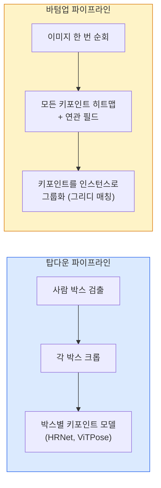

> 🇰🇷 이 문서는 한국어 번역본입니다(ELI5 스타일). 원문: [en.md](en.md)

# 키포인트 검출과 포즈 추정 (Keypoint Detection & Pose Estimation)

> 포즈는 순서가 정해진 키포인트의 집합입니다. 키포인트 검출기는 히트맵 회귀기입니다. 나머지는 모두 부기(bookkeeping) 작업입니다.

**유형:** Build
**언어:** Python
**선수 지식:** 페이즈 4 레슨 06(검출), 페이즈 4 레슨 07(U-Net)
**시간:** 약 45분

## 학습 목표

- 탑다운(top-down)과 바텀업(bottom-up) 포즈 추정을 구분하고, 각각 언제 쓰이는지 말합니다.
- K개 키포인트마다 가우시안 타깃 히트맵을 회귀하고, 추론 때 키포인트 좌표를 뽑아냅니다.
- Part Affinity Fields(PAF)가 무엇인지, 바텀업 파이프라인이 키포인트를 인스턴스로 묶는 방법을 설명합니다.
- 프로덕션(운영 환경) 키포인트 추정에 MediaPipe Pose나 MMPose를 사용하고, 그 출력 포맷을 이해합니다.

## 문제 상황

키포인트 작업은 여러 이름으로 숨어 있습니다: 사람 포즈(17개 신체 관절), 얼굴 랜드마크(68 또는 478개 점), 손(21개 점), 동물 포즈, 로봇 객체 포즈, 의학 해부학 랜드마크. 모두 같은 구조를 공유합니다: 객체 위의 K개 이산 점을 검출하고 그 (x, y) 좌표를 출력합니다.

포즈 추정은 모션 캡처, 피트니스 앱, 스포츠 분석, 제스처 컨트롤, 애니메이션, AR 피팅, 로봇 그리핑의 기반입니다. 2D 케이스는 성숙했고, 3D 포즈(카메라 한 대로 세계 좌표의 관절 위치를 추정)는 현재 연구 최전선입니다.

엔지니어링 질문은 규모입니다. 단일 이미지, 단일 인물 포즈는 20ms짜리 문제입니다. 군중 속 30fps 다인(multi-person) 포즈는 다른 아키텍처가 필요한 전혀 다른 문제입니다.

## 개념

### 탑다운 vs 바텀업



- **탑다운** — 사람을 먼저 검출하고, 각 크롭에 사람별 키포인트 모델을 실행합니다. 정확도 최고; 사람 수에 비례해 늘어납니다.
- **바텀업** — 한 번의 순전파로 모든 키포인트와 연관 필드를 예측한 뒤 묶습니다. 군중 크기와 무관하게 일정한 시간이 듭니다.

탑다운(HRNet, ViTPose)이 정확도 선두이고, 바텀업(OpenPose, HigherHRNet)이 붐비는 장면에서 처리량 선두입니다.

### 히트맵 회귀

`(x, y)`를 직접 회귀하는 대신, 키포인트마다 참 위치 중심에 가우시안 방울이 찍힌 `H x W` 히트맵을 예측합니다.

```
target[k, y, x] = exp(-((x - cx_k)^2 + (y - cy_k)^2) / (2 sigma^2))
```

추론 때는 각 히트맵의 argmax가 예측 키포인트 위치입니다.

히트맵이 직접 회귀보다 잘 동작하는 이유: 네트워크의 공간 구조(합성곱 특징 맵)가 공간 출력과 자연스럽게 정렬됩니다. 가우시안 타깃은 정규화(regularization) 효과도 있습니다 — 위치 오차가 작으면 손실도 작아지지, 0이 되지 않습니다.

### 서브픽셀 위치 찾기

argmax는 정수 좌표를 줍니다. 서브픽셀 정밀도를 위해서는 argmax와 그 이웃 픽셀에 포물선을 피팅하거나, 잘 알려진 오프셋 방향 `(dx, dy) = 0.25 * (heatmap[y, x+1] - heatmap[y, x-1], ...)`을 쓰세요.

### Part Affinity Fields(PAF)

바텀업 연관(association)을 위한 OpenPose의 트릭입니다. 연결된 키포인트 쌍(예: 왼쪽 어깨 → 왼쪽 팔꿈치)마다 한쪽에서 다른 쪽을 가리키는 단위 벡터를 담은 2채널 필드를 예측합니다. 어깨와 그 어깨의 팔꿈치를 이어주려면, 후보 쌍을 잇는 선을 따라 PAF를 적분합니다. 적분값이 가장 높은 쌍이 매칭됩니다.

```
각 연결(사지)마다:
  PAF 채널: 2개 (단위 벡터 x, y)
  선 적분: 샘플 점들에 대해 (PAF . 선 방향)의 합
  적분값이 높을수록 강한 매칭
```

우아하고, 사람별 크롭 없이 임의의 군중 크기로 확장됩니다.

### COCO 키포인트

표준 신체 포즈 데이터셋: 사람당 17개 키포인트, 지표는 PCK(Percentage of Correct Keypoints)와 OKS(Object Keypoint Similarity). OKS는 키포인트판 IoU이며, COCO mAP@OKS가 보고하는 바로 그것입니다.

### 2D vs 3D

- **2D 포즈** — 이미지 좌표; 프로덕션 수준으로 해결됨(MediaPipe, HRNet, ViTPose).
- **3D 포즈** — 세계 / 카메라 좌표; 여전히 활발한 연구 주제. 흔한 접근:
  - 작은 MLP로 2D 예측을 3D로 들어올리기(lift, VideoPose3D).
  - 이미지에서 직접 3D 회귀(PyMAF, MHFormer).
  - 정답(ground truth)을 얻기 위한 멀티뷰 셋업(CMU Panoptic).

```figure
cv3-pose-heatmap
```

## 만들어 보기

### 단계 1: 가우시안 히트맵 타깃

```python
import numpy as np
import torch

def gaussian_heatmap(size, cx, cy, sigma=2.0):
    yy, xx = np.meshgrid(np.arange(size), np.arange(size), indexing="ij")
    return np.exp(-((xx - cx) ** 2 + (yy - cy) ** 2) / (2 * sigma ** 2)).astype(np.float32)

hm = gaussian_heatmap(64, 32, 32, sigma=2.0)
print(f"peak: {hm.max():.3f} at ({hm.argmax() % 64}, {hm.argmax() // 64})")
```

키포인트별 히트맵을 채널 축으로 쌓으면 전체 타깃 텐서가 됩니다.

### 단계 2: 아주 작은 키포인트 헤드

K개 히트맵 채널을 출력하는 U-Net 스타일 모델입니다.

```python
import torch.nn as nn
import torch.nn.functional as F

class TinyKeypointNet(nn.Module):
    def __init__(self, num_keypoints=4, base=16):
        super().__init__()
        self.down1 = nn.Sequential(nn.Conv2d(3, base, 3, 2, 1), nn.ReLU(inplace=True))
        self.down2 = nn.Sequential(nn.Conv2d(base, base * 2, 3, 2, 1), nn.ReLU(inplace=True))
        self.mid = nn.Sequential(nn.Conv2d(base * 2, base * 2, 3, 1, 1), nn.ReLU(inplace=True))
        self.up1 = nn.ConvTranspose2d(base * 2, base, 2, 2)
        self.up2 = nn.ConvTranspose2d(base, num_keypoints, 2, 2)

    def forward(self, x):
        h1 = self.down1(x)
        h2 = self.down2(h1)
        h3 = self.mid(h2)
        u1 = self.up1(h3)
        return self.up2(u1)
```

입력 `(N, 3, H, W)`, 출력 `(N, K, H, W)`. 손실은 가우시안 타깃에 대한 픽셀별 MSE입니다.

### 단계 3: 추론 — 키포인트 좌표 뽑기

```python
def heatmap_to_coords(heatmaps):
    """
    heatmaps: (N, K, H, W)
    반환:    (N, K, 2) 이미지 픽셀 단위 float 좌표
    """
    N, K, H, W = heatmaps.shape
    hm = heatmaps.reshape(N, K, -1)
    idx = hm.argmax(dim=-1)
    ys = (idx // W).float()
    xs = (idx % W).float()
    return torch.stack([xs, ys], dim=-1)

coords = heatmap_to_coords(torch.randn(2, 4, 32, 32))
print(f"coords: {coords.shape}")  # (2, 4, 2)
```

추론은 한 줄입니다. 서브픽셀 정밀화가 필요하면 argmax 주변을 보간하세요.

### 단계 4: 합성 키포인트 데이터셋

간단합니다: 흰 캔버스에 점 네 개를 찍고 이를 예측하도록 학습합니다.

```python
def make_synthetic_sample(size=64):
    img = np.ones((3, size, size), dtype=np.float32)
    rng = np.random.default_rng()
    kps = rng.integers(8, size - 8, size=(4, 2))
    for cx, cy in kps:
        img[:, cy - 2:cy + 2, cx - 2:cx + 2] = 0.0
    hms = np.stack([gaussian_heatmap(size, cx, cy) for cx, cy in kps])
    return img, hms, kps
```

작은 모델도 1분 안에 배울 수 있을 만큼 쉽습니다.

### 단계 5: 학습

```python
model = TinyKeypointNet(num_keypoints=4)
opt = torch.optim.Adam(model.parameters(), lr=3e-3)

for step in range(200):
    batch = [make_synthetic_sample() for _ in range(16)]
    imgs = torch.from_numpy(np.stack([b[0] for b in batch]))
    hms = torch.from_numpy(np.stack([b[1] for b in batch]))
    pred = model(imgs)
    # 예측을 전체 해상도로 업샘플
    pred = F.interpolate(pred, size=hms.shape[-2:], mode="bilinear", align_corners=False)
    loss = F.mse_loss(pred, hms)
    opt.zero_grad(); loss.backward(); opt.step()
```

## 활용하기

- **MediaPipe Pose** — Google의 프로덕션 포즈 추정기; 10ms 미만 지연 시간으로 WebGL + 모바일 런타임에 제공.
- **MMPose** (OpenMMLab) — 포괄적인 연구 코드베이스; 사전학습 가중치가 있는 모든 SOTA 아키텍처.
- **YOLOv8-pose** — 한 번의 순전파로 가장 빠른 실시간 다인 포즈.
- **transformers HumanDPT / PoseAnything** — 오픈 어휘 포즈(어떤 객체든, 어떤 키포인트 집합이든)를 위한 최신 비전-언어 접근.

## 출시하기

이 레슨이 만드는 산출물:

- `outputs/prompt-pose-stack-picker.md` — 지연 시간, 군중 크기, 2D vs 3D 요구에 따라 MediaPipe / YOLOv8-pose / HRNet / ViTPose를 고르는 프롬프트.
- `outputs/skill-heatmap-to-coords.md` — 모든 프로덕션 포즈 모델이 쓰는 서브픽셀 히트맵→좌표 변환 루틴을 작성하는 스킬.

## 연습 문제

1. **(쉬움)** 합성 4점 데이터셋으로 작은 키포인트 모델을 학습하세요. 200 스텝 후 예측 키포인트와 참 키포인트 사이의 평균 L2 오차를 보고하세요.
2. **(보통)** 서브픽셀 정밀화를 추가하세요: argmax 위치가 주어지면 이웃 픽셀로 x, y축 방향 1D 포물선을 피팅합니다. 정수 argmax 대비 정확도 이득을 보고하세요.
3. **(어려움)** 한 이미지에 4키포인트 패턴의 인스턴스 두 개가 보이는 2인 합성 데이터셋을 만드세요. 어떤 키포인트가 어떤 인스턴스에 속하는지 예측하는 PAF 기반 바텀업 파이프라인을 학습시키고 OKS로 평가하세요.

## 핵심 용어

| 용어 | 흔한 표현 | 실제 의미 |
|------|----------------|----------------------|
| 키포인트 | "랜드마크" | 객체 위의 순서가 정해진 특정 점(관절, 모서리, 특징) |
| 포즈 | "스켈레톤" | 한 인스턴스에 속한 순서 있는 키포인트 집합 |
| 탑다운 | "검출 후 포즈" | 2단계 파이프라인: 사람 검출기 + 크롭별 키포인트 모델; 정확도 최고 |
| 바텀업 | "포즈부터, 그룹핑은 나중" | 한 번의 순전파로 모든 키포인트 예측 + 그룹핑; 군중 크기에 무관한 일정 시간 |
| 히트맵 | "가우시안 타깃" | 키포인트마다 참 위치에 봉우리가 있는 H x W 텐서; 선호되는 회귀 타깃 |
| PAF | "Part Affinity Field" | 사지 방향을 인코딩하는 2채널 단위 벡터 필드; 키포인트를 인스턴스로 묶는 데 사용 |
| OKS | "키포인트 IoU" | Object Keypoint Similarity; 포즈의 COCO 지표 |
| HRNet | "High-Resolution Net" | 지배적인 탑다운 키포인트 아키텍처; 높은 해상도 특징을 끝까지 유지 |

## 더 읽을거리

- [OpenPose (Cao et al., 2017)](https://arxiv.org/abs/1812.08008) — PAF를 쓰는 바텀업; 지금도 이 접근의 최고 해설
- [HRNet (Sun et al., 2019)](https://arxiv.org/abs/1902.09212) — 탑다운 레퍼런스 아키텍처
- [ViTPose (Xu et al., 2022)](https://arxiv.org/abs/2204.12484) — 순수 ViT를 포즈 백본으로; 다수 벤치마크의 현재 SOTA
- [MediaPipe Pose](https://developers.google.com/mediapipe/solutions/vision/pose_landmarker) — 프로덕션 실시간 포즈; 2026년 기준 가장 빨리 배포된 스택
