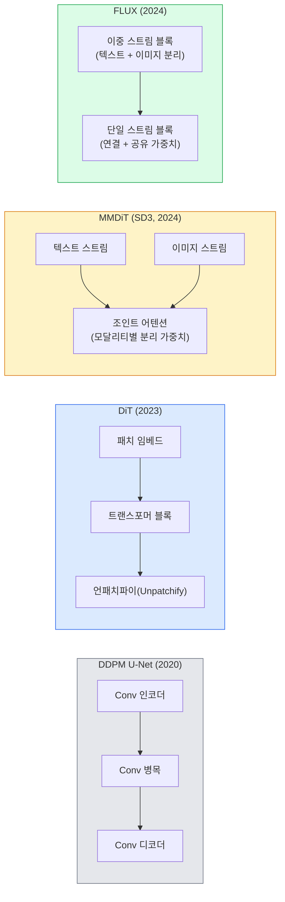

> 🇰🇷 이 문서는 한국어 번역본입니다(ELI5 스타일). 원문: [en.md](en.md)

# 확산 트랜스포머와 정류 흐름 (Diffusion Transformers & Rectified Flow)

> 확산의 비밀은 U-Net이 아닙니다. 그걸 트랜스포머로 바꾸고, 노이즈 스케줄을 직선 흐름으로 바꾸면, 갑자기 SD3와 FLUX, 그리고 2026년의 모든 텍스트→이미지 모델이 됩니다.

**유형:** Learn + Build
**언어:** Python
**선수 지식:** 페이즈 4 레슨 10(확산 DDPM), 페이즈 4 레슨 14(ViT), 페이즈 7 레슨 02(셀프 어텐션)
**시간:** 약 75분

## 학습 목표

- U-Net DDPM(레슨 10)에서 확산 트랜스포머(DiT), MMDiT(SD3), 단일+이중 스트림 DiT(FLUX)로 이어지는 진화를 추적합니다.
- 정류 흐름(rectified flow)을 설명합니다: 노이즈와 데이터 사이의 직선 궤적이 왜 1000 스텝 대신 20 스텝 샘플링을 가능하게 하는지.
- 100줄 미만으로 작은 DiT 블록과 정류 흐름 학습 루프를 구현합니다.
- 모델 변형(SD3, FLUX.1-dev, FLUX.1-schnell, Z-Image, Qwen-Image)을 아키텍처, 파라미터 수, 라이선스로 구분합니다.

## 문제 상황

레슨 10은 U-Net 디노이저로 DDPM을 만들었습니다. 그 레시피가 2020-2023을 지배했습니다: U-Net + 베타 스케줄 + 노이즈 예측 손실. Stable Diffusion 1.5와 2.1, DALL-E 2가 여기서 나왔습니다.

2026년의 모든 최고 수준 텍스트→이미지 모델은 그걸 지나쳤습니다. Stable Diffusion 3, FLUX, SD4, Z-Image, Qwen-Image, Hunyuan-Image — 어느 것도 U-Net을 쓰지 않습니다. 확산 트랜스포머(DiT)를 씁니다. SD3와 FLUX는 DDPM 노이즈 스케줄도 정류 흐름으로 바꿨고, 이는 노이즈→데이터 경로를 곧게 펴서 consistency나 증류 변형으로 1-4 스텝 추론을 가능하게 합니다.

이 전환이 중요한 이유는, 확산 기반 이미지 생성이 제어 가능해지고, 프롬프트를 정확하게 따르게 되고(SD3/SD4가 텍스트 렌더링을 해결), 프로덕션(운영 환경)에서 빨라진 바로 그 이유이기 때문입니다. DiT + 정류 흐름을 이해하는 것이 곧 2026 생성 이미지 스택을 이해하는 것입니다.

## 개념

### U-Net에서 트랜스포머로



- **DiT** (Peebles & Xie, 2023) — U-Net을 잠재 패치 위의 ViT형 트랜스포머로 교체합니다. 조건화는 적응형 레이어 노름(AdaLN)으로 합니다.
- **MMDiT** (SD3, Esser et al., 2024) — 텍스트와 이미지 토큰에 가중치가 분리된 두 스트림이 조인트 어텐션을 공유합니다.
- **FLUX** (Black Forest Labs, 2024) — 앞쪽 N개 블록은 SD3처럼 이중 스트림이고, 뒤쪽 블록은 더 깊은 곳에서의 효율을 위해 토큰을 연결하고 가중치를 공유합니다(단일 스트림).
- **Z-Image** (2025) — 6B 파라미터의 효율적인 단일 스트림 DiT로, "무조건 규모를 키우자"는 통념에 도전합니다.

### 정류 흐름 한 단락 요약

DDPM은 순방향 과정을 점점 망가지는 노이즈 SDE로 정의합니다. 학습된 역방향은 또 하나의 SDE이고, 1000개의 작은 스텝으로 풉니다.

정류 흐름은 깨끗한 데이터와 순수 노이즈 사이의 **직선** 보간을 정의합니다:

```
x_t = (1 - t) * x_0 + t * epsilon,     t in [0, 1]
```

네트워크가 속도(velocity) `v_theta(x_t, t) = epsilon - x_0` — 깨끗한 데이터에서 노이즈로 가는 직선 경로를 따라가는 방향(`dx_t/dt`) — 을 예측하도록 학습시킵니다. 샘플링 때는 이 속도를 거꾸로 적분해 노이즈에서 데이터 방향으로 나아갑니다. 결과 ODE는 직선에 훨씬 가까워서, 샘플링에 필요한 적분 스텝이 훨씬 적습니다.

SD3는 이것을 **Rectified Flow Matching**이라 부릅니다. FLUX, Z-Image, 대부분의 2026 모델이 같은 목적함수를 씁니다. 전형적 추론: 20-30 이 Euler 스텝(결정론적) vs 구 DDPM 체제의 50+ DDIM 스텝. 증류 / turbo / schnell / LCM 변형은 1-4 스텝까지 내려갑니다.

### AdaLN 조건화

DiT는 시간 스텝과 클래스/텍스트를 **적응형 레이어 노름**으로 조건화합니다: 조건 벡터에서 `scale`과 `shift`를 예측해 LayerNorm 뒤에 적용합니다. U-Net의 FiLM 스타일 변조보다 훨씬 깔끔하며, 모든 현대 DiT의 기본값입니다.

```
cond -> MLP -> (scale, shift, gate)
norm(x) * (1 + scale) + shift, then residual add * gate
```

### SD3와 FLUX의 텍스트 인코더

- **SD3**는 세 개의 텍스트 인코더를 씁니다: CLIP 모델 둘 + T5-XXL. 임베딩을 연결해 텍스트 조건으로 이미지 스트림에 먹입니다.
- **FLUX**는 CLIP-L 하나 + T5-XXL.
- **Qwen-Image / Z-Image** 변형은 자기 기반 LLM과 정렬된 자체 텍스트 인코더를 씁니다.

텍스트 인코더가 SD3/FLUX가 SD1.5보다 프롬프트를 훨씬 잘 이해하는 큰 이유입니다. T5-XXL 하나가 4.7B 파라미터입니다.

### CFG는 여전히 유효

정류 흐름은 샘플러를 바꾸는 것이지 조건화를 바꾸는 게 아닙니다. Classifier-free guidance(학습 중 10% 확률로 텍스트를 빼고, 추론 때 조건부/무조건부 예측을 섞음)는 정류 흐름과 똑같이 동작합니다. 대부분의 2026 모델은 guidance scale 3.5-5를 씁니다 — SD1.5의 7.5보다 낮은데, 정류 흐름 모델이 기본적으로 프롬프트를 더 꽉 붙어 따르기 때문입니다.

### Consistency, Turbo, Schnell, LCM

같은 아이디어의 네 가지 이름입니다: 느린 다중 스텝 모델을 빠른 소수 스텝 모델로 증류합니다.

- **LCM (Latent Consistency Model)** — 중간의 아무 `x_t`에서 최종 `x_0`를 한 스텝에 예측하는 학생 모델을 학습시킵니다.
- **SDXL Turbo / FLUX schnell** — 적대적 확산 증류로 학습한 1-4 스텝 모델.
- **SD Turbo** — OpenAI식 Consistency Models를 잠재 확산에 맞게 조정한 것.

새 모델의 프로덕션 서빙은 "최고 품질" 체크포인트와 "turbo / schnell" 변형을 둘 다 실어 나갑니다. Schnell(독일어로 "빠름", Black Forest Labs의 관례)은 1-4 스텝에 돌고 실시간 파이프라인에 맞습니다.

### 2026 모델 지형

| 모델 | 크기 | 아키텍처 | 라이선스 |
|-------|------|--------------|---------|
| Stable Diffusion 3 Medium | 2B | MMDiT | SAI Community |
| Stable Diffusion 3.5 Large | 8B | MMDiT | SAI Community |
| FLUX.1-dev | 12B | 이중 + 단일 스트림 DiT | 비상업 |
| FLUX.1-schnell | 12B | 동일, 증류 | Apache 2.0 |
| FLUX.2 | — | FLUX.1 반복 개선 | 혼합 |
| Z-Image | 6B | S3-DiT (Scalable Single-Stream) | 관대함 |
| Qwen-Image | ~20B | DiT + Qwen 텍스트 타워 | Apache 2.0 |
| Hunyuan-Image-3.0 | ~80B | DiT | 연구용 |
| SD4 Turbo | 3B | DiT + 증류 | SAI Commercial |

FLUX.1-schnell이 2026 오픈소스 기본값입니다. Z-Image가 효율 선두입니다. FLUX.2와 SD4가 현재 품질 정점입니다.

### 이 패러다임 전환이 중요한 이유

DDPM + U-Net도 동작했습니다. DiT + 정류 흐름은 **더 잘, 더 빠르게, 더 깔끔하게 확장됩니다**. 이 전환은 NLP의 RNN→트랜스포머 전환과 나란히 갑니다: 둘 다 같은 문제를 풀었지만, 트랜스포머가 확장 가능해서 이제 지배합니다. 2026년의 이미지·비디오·3D 생성 논문은 모두 DiT 모양의 디노이저를, 그리고 보통 정류 흐름 목적함수를 씁니다. U-Net DDPM은 이제 주로 교육용입니다(레슨 10).

```figure
cv3-rectified-flow
```

## 만들어 보기

### 단계 1: AdaLN을 곁들인 DiT 블록

```python
import torch
import torch.nn as nn


class AdaLNZero(nn.Module):
    """
    게이트가 붙은 적응형 LayerNorm. 조건으로부터 (scale, shift, gate)를 예측합니다.
    블록 전체가 항등 함수로 시작하도록 초기화합니다("zero init").
    """

    def __init__(self, dim, cond_dim):
        super().__init__()
        self.norm = nn.LayerNorm(dim, elementwise_affine=False)
        self.mlp = nn.Linear(cond_dim, dim * 3)
        nn.init.zeros_(self.mlp.weight)
        nn.init.zeros_(self.mlp.bias)

    def forward(self, x, cond):
        scale, shift, gate = self.mlp(cond).chunk(3, dim=-1)
        h = self.norm(x) * (1 + scale.unsqueeze(1)) + shift.unsqueeze(1)
        return h, gate.unsqueeze(1)


class DiTBlock(nn.Module):
    def __init__(self, dim=192, heads=3, mlp_ratio=4, cond_dim=192):
        super().__init__()
        self.adaln1 = AdaLNZero(dim, cond_dim)
        self.attn = nn.MultiheadAttention(dim, heads, batch_first=True)
        self.adaln2 = AdaLNZero(dim, cond_dim)
        self.mlp = nn.Sequential(
            nn.Linear(dim, dim * mlp_ratio),
            nn.GELU(),
            nn.Linear(dim * mlp_ratio, dim),
        )

    def forward(self, x, cond):
        h, gate1 = self.adaln1(x, cond)
        a, _ = self.attn(h, h, h, need_weights=False)
        x = x + gate1 * a
        h, gate2 = self.adaln2(x, cond)
        x = x + gate2 * self.mlp(h)
        return x
```

`AdaLNZero`는 MLP 가중치가 0으로 초기화되어 있어 항등 사상으로 시작합니다. 학습이 블록을 항등에서 조금씩 밀어냅니다. 이것이 깊은 트랜스포머 확산 모델을 극적으로 안정화합니다.

### 단계 2: 아주 작은 DiT

```python
def timestep_embedding(t, dim):
    import math
    half = dim // 2
    freqs = torch.exp(-math.log(10000) * torch.arange(half, device=t.device) / half)
    args = t[:, None].float() * freqs[None]
    return torch.cat([args.sin(), args.cos()], dim=-1)


class TinyDiT(nn.Module):
    def __init__(self, image_size=16, patch_size=2, in_channels=3, dim=96, depth=4, heads=3):
        super().__init__()
        self.patch_size = patch_size
        self.num_patches = (image_size // patch_size) ** 2
        self.patch = nn.Conv2d(in_channels, dim, kernel_size=patch_size, stride=patch_size)
        self.pos = nn.Parameter(torch.zeros(1, self.num_patches, dim))
        self.time_mlp = nn.Sequential(
            nn.Linear(dim, dim * 2),
            nn.SiLU(),
            nn.Linear(dim * 2, dim),
        )
        self.blocks = nn.ModuleList([DiTBlock(dim, heads, cond_dim=dim) for _ in range(depth)])
        self.norm_out = nn.LayerNorm(dim, elementwise_affine=False)
        self.head = nn.Linear(dim, patch_size * patch_size * in_channels)

    def forward(self, x, t):
        n = x.size(0)
        x = self.patch(x)
        x = x.flatten(2).transpose(1, 2) + self.pos
        t_emb = self.time_mlp(timestep_embedding(t, self.pos.size(-1)))
        for blk in self.blocks:
            x = blk(x, t_emb)
        x = self.norm_out(x)
        x = self.head(x)
        return self._unpatchify(x, n)

    def _unpatchify(self, x, n):
        p = self.patch_size
        h = w = int(self.num_patches ** 0.5)
        x = x.view(n, h, w, p, p, -1).permute(0, 5, 1, 3, 2, 4).reshape(n, -1, h * p, w * p)
        return x
```

### 단계 3: 정류 흐름 학습

```python
import torch.nn.functional as F

def rectified_flow_train_step(model, x0, optimizer, device):
    model.train()
    x0 = x0.to(device)
    n = x0.size(0)
    t = torch.rand(n, device=device)
    epsilon = torch.randn_like(x0)
    x_t = (1 - t[:, None, None, None]) * x0 + t[:, None, None, None] * epsilon

    target_velocity = epsilon - x0
    pred_velocity = model(x_t, t)

    loss = F.mse_loss(pred_velocity, target_velocity)
    optimizer.zero_grad()
    loss.backward()
    optimizer.step()
    return loss.item()
```

DDPM의 노이즈 예측 손실(레슨 10)과 비교해보세요: 구조는 같고 타깃이 다릅니다. 노이즈 `epsilon`을 예측하는 대신 **속도** `epsilon - x_0`를 예측하며, 이는 직선 보간을 따라 데이터에서 노이즈를 가리킵니다.

### 단계 4: Euler 샘플러

정류 흐름은 ODE입니다. Euler 방법이 가장 단순하고, 잘 학습된 정류 흐름 모델에서는 20+ 스텝에서 고차 솔버와 거의 맞먹는 정확도를 냅니다.

```python
@torch.no_grad()
def rectified_flow_sample(model, shape, steps=20, device="cpu"):
    model.eval()
    x = torch.randn(shape, device=device)
    dt = 1.0 / steps
    t = torch.ones(shape[0], device=device)
    for _ in range(steps):
        v = model(x, t)
        x = x - dt * v
        t = t - dt
    return x
```

20 스텝입니다. 학습된 모델에서 1000-스텝 DDPM에 필적하는 샘플을 냅니다.

### 단계 5: 엔드투엔드 스모크 테스트

```python
import numpy as np

def synthetic_blobs(num=200, size=16, seed=0):
    rng = np.random.default_rng(seed)
    out = np.zeros((num, 3, size, size), dtype=np.float32)
    yy, xx = np.meshgrid(np.arange(size), np.arange(size), indexing="ij")
    for i in range(num):
        cx, cy = rng.uniform(4, size - 4, size=2)
        r = rng.uniform(2, 4)
        mask = (xx - cx) ** 2 + (yy - cy) ** 2 < r ** 2
        colour = rng.uniform(-1, 1, size=3)
        for c in range(3):
            out[i, c][mask] = colour[c]
    return torch.from_numpy(out)
```

이 데이터로 `TinyDiT`를 정류 흐름으로 학습하세요. 500 스텝이면 샘플 결과가 흐릿한 색 얼룩처럼 보여야 합니다.

## 활용하기

FLUX / SD3 / Z-Image로 실제 이미지를 생성하려면, `diffusers`가 통합 API로 전부 제공합니다:

```python
from diffusers import FluxPipeline, StableDiffusion3Pipeline
import torch

pipe = FluxPipeline.from_pretrained(
    "black-forest-labs/FLUX.1-schnell",
    torch_dtype=torch.bfloat16,
).to("cuda")

out = pipe(
    prompt="a golden retriever surfing a tsunami, hyperrealistic, studio lighting",
    guidance_scale=0.0,           # schnell은 CFG 없이 학습됨
    num_inference_steps=4,
    max_sequence_length=256,
).images[0]
out.save("surf.png")
```

세 줄입니다. 4 스텝의 `FLUX.1-schnell`. 20-30 스텝에 CFG로 더 높은 품질을 원하면 모델 id를 `black-forest-labs/FLUX.1-dev`로 바꾸세요.

SD3의 경우:

```python
pipe = StableDiffusion3Pipeline.from_pretrained(
    "stabilityai/stable-diffusion-3.5-large",
    torch_dtype=torch.bfloat16,
).to("cuda")
out = pipe(prompt, guidance_scale=3.5, num_inference_steps=28).images[0]
```

## 출시하기

이 레슨이 만드는 산출물:

- `outputs/prompt-dit-model-picker.md` — 품질, 지연 시간, 라이선스 제약에 따라 SD3, FLUX.1-dev, FLUX.1-schnell, Z-Image, SD4 Turbo 중 고르는 프롬프트.
- `outputs/skill-rectified-flow-trainer.md` — AdaLN DiT와 Euler 샘플링으로 정류 흐름 학습 루프 전체를 작성하는 스킬.

## 연습 문제

1. **(쉬움)** 합성 얼룩 데이터셋에서 위의 TinyDiT를 500 스텝 학습하세요. 10, 20, 50 Euler 스텝으로 만든 샘플을 비교하세요.
2. **(보통)** 학습된 클래스 임베딩을 시간 임베딩에 연결해 텍스트 조건화를 추가하세요(색으로 구분하는 10개 얼룩 "클래스"). 클래스 0, 5, 9로 샘플링해 색이 맞는지 확인하세요.
3. **(어려움)** 같은 데이터로 같은 스텝 수만큼 학습한, 크기가 같은 네트워크의 정류 흐름 버전과 DDPM 버전이 만든 샘플 사이의 프레셰 거리(FID 근사)를 계산하세요. 어느 쪽이 빨리 수렴하는지 보고하세요.

## 핵심 용어

| 용어 | 흔한 표현 | 실제 의미 |
|------|----------------|----------------------|
| DiT | "확산 트랜스포머" | U-Net을 대체하는 확산 디노이저 트랜스포머; 패치화된 잠재 위에서 동작 |
| AdaLN | "적응형 레이어 노름" | LayerNorm 뒤에 적용하는 학습된 scale, shift, gate로 시간/텍스트를 조건화; 모든 현대 DiT의 표준 |
| MMDiT | "멀티모달 DiT (SD3)" | 텍스트와 이미지 토큰에 가중치가 분리된 스트림이 조인트 셀프 어텐션을 공유 |
| 단일 스트림 / 이중 스트림 | "FLUX 트릭" | 앞쪽 N개 블록은 이중 스트림(모달리티별 분리 가중치), 뒤쪽 블록은 효율을 위해 단일 스트림(연결 + 공유 가중치) |
| 정류 흐름 | "직선 노이즈→데이터" | 데이터와 노이즈 사이의 선형 보간; 네트워크가 속도를 예측; 추론에 더 적은 ODE 스텝 |
| 속도 타깃 | "epsilon - x_0" | 정류 흐름의 회귀 타깃; 깨끗한 데이터에서 노이즈를 가리킴 |
| CFG 가이던스 | "classifier-free guidance" | 조건부와 무조건부 예측을 섞음; 정류 흐름 모델에서도 여전히 사용 |
| Schnell / turbo / LCM | "1-4 스텝 증류" | 최고 품질 모델에서 증류한 소수 스텝 변형; 프로덕션 실시간용 |

## 더 읽을거리

- [Scalable Diffusion Models with Transformers (Peebles & Xie, 2023)](https://arxiv.org/abs/2212.09748) — DiT 원 논문
- [Scaling Rectified Flow Transformers (Esser et al., SD3 논문)](https://arxiv.org/abs/2403.03206) — 규모를 키운 MMDiT와 정류 흐름
- [FLUX.1 모델 카드와 기술 보고서 (Black Forest Labs)](https://huggingface.co/black-forest-labs/FLUX.1-dev) — 이중 + 단일 스트림 상세
- [Z-Image: Efficient Image Generation Foundation Model (2025)](https://arxiv.org/html/2511.22699v1) — 6B 단일 스트림 DiT
- [Elucidating the Design Space of Diffusion (Karras et al., 2022)](https://arxiv.org/abs/2206.00364) — 모든 확산 설계 트레이드오프의 레퍼런스
- [Latent Consistency Models (Luo et al., 2023)](https://arxiv.org/abs/2310.04378) — LCM-LoRA가 4-스텝 추론을 주는 방법
