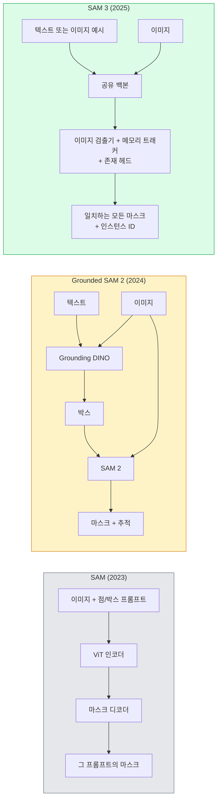

> 🇰🇷 이 문서는 한국어 번역본입니다(ELI5 스타일). 원문: [en.md](en.md)

# SAM 3와 오픈 어휘 세그멘테이션 (SAM 3 & Open-Vocabulary Segmentation)

> 모델에게 텍스트 프롬프트와 이미지를 주면 일치하는 모든 객체의 마스크를 돌려받습니다. SAM 3가 그것을 한 번의 순전파로 만들었습니다.

**유형:** Use + Build
**언어:** Python
**선수 지식:** 페이즈 4 레슨 07(U-Net), 페이즈 4 레슨 08(Mask R-CNN), 페이즈 4 레슨 18(CLIP)
**시간:** 약 60분

## 학습 목표

- SAM(시각 프롬프트만), Grounded SAM / SAM 2(검출기 + SAM), SAM 3(프롬프터블 컨셉 세그멘테이션으로 네이티브 텍스트 프롬프트 지원)을 구분합니다.
- SAM 3 아키텍처를 설명합니다: 공유 백본 + 이미지 검출기 + 메모리 기반 비디오 트래커 + 존재 헤드(presence head) + 검출기-트래커 분리 설계.
- Hugging Face `transformers`의 SAM 3 통합으로 텍스트 프롬프트 검출, 세그멘테이션, 비디오 추적을 수행합니다.
- 지연 시간, 컨셉 복잡도, 배포 타깃에 따라 SAM 3, Grounded SAM 2, YOLO-World, SAM-MI 중 고릅니다.

## 문제 상황

2023년 SAM은 시각 프롬프트 전용 모델이었습니다: 점을 클릭하거나 박스를 그리면 마스크를 돌려줍니다. "이 사진에서 귤을 전부 찾아줘" 같은 요청에는 검출기(Grounding DINO)가 박스를 만들고, SAM이 각각을 세그먼트하는 방식이 필요했습니다. Grounded SAM은 이것을 파이프라인으로 만들었지만, 두 개의 얼어 있는(frozen) 모델을 잇는 캐스케이드였고 오류가 필연적으로 쌓였습니다.

SAM 3(Meta, 2025년 11월, ICLR 2026)는 그 캐스케이드를 하나로 접었습니다. 짧은 명사구나 이미지 예시(exemplar)를 프롬프트로 받아, 일치하는 모든 마스크와 인스턴스 ID를 한 번의 순전파로 돌려줍니다. 그것이 바로 **프롬프터블 컨셉 세그멘테이션(Promptable Concept Segmentation, PCS)**입니다. 2026년 3월 Object Multiplex 업데이트(SAM 3.1)와 결합하면, 같은 컨셉의 여러 인스턴스를 비디오에서 효율적으로 추적합니다.

이 레슨의 주제는 이것이 나타내는 구조적 전환입니다. 2D 세그멘테이션, 검출, 텍스트-이미지 그라운딩이 하나의 모델로 합쳐졌습니다. 프로덕션(운영 환경) 질문은 더 이상 "어떤 파이프라인을 엮을까"가 아니라 "어떤 프롬프터블 모델이 내 용도를 엔드투엔드로 처리하나"입니다.

## 개념

### 세 세대



### 프롬프터블 컨셉 세그멘테이션

"컨셉 프롬프트"는 짧은 명사구(`"yellow school bus"`, `"striped red umbrella"`, `"hand holding a mug"`) 또는 이미지 예시입니다. 모델은 이미지에서 그 컨셉에 맞는 모든 인스턴스의 세그멘테이션 마스크와, 매치마다 고유한 인스턴스 ID를 돌려줍니다.

클래식 시각 프롬프트 SAM과의 차이는 세 가지입니다:

1. 인스턴스별 프롬프트가 필요 없습니다 — 텍스트 프롬프트 하나가 모든 매치를 돌려줍니다.
2. 오픈 어휘 — 컨셉은 자연어로 표현할 수 있는 무엇이든 됩니다.
3. 프롬프트당 마스크 하나가 아니라 여러 인스턴스를 한 번에 돌려줍니다.

### 핵심 아키텍처 부품

- **공유 백본** — 하나의 ViT가 이미지를 처리합니다. 검출기 헤드와 메모리 기반 트래커 둘 다 여기서 읽습니다.
- **존재 헤드(presence head)** — 컨셉이 이미지에 아예 존재하는지 예측합니다. "여기 있나?"를 "어디 있나?"와 분리합니다. 없는 컨셉에 대한 거짓 양성을 줄입니다.
- **검출기-트래커 분리** — 이미지 수준 검출과 비디오 수준 추적의 헤드가 각각 따로여서 서로 간섭하지 않습니다.
- **메모리 뱅크** — 비디오 추적을 위해 프레임에 걸친 인스턴스별 특징을 저장합니다(SAM 2가 쓰던 것과 같은 메커니즘).

### 대규모 학습

SAM 3는 AI + 사람 검토로 반복 주석하고 교정하는 데이터 엔진이 만든 **400만 개 고유 컨셉**으로 학습했습니다. 새 **SA-CO 벤치마크**는 고유 컨셉 27만 개로, 이전 벤치마크의 50배입니다. SAM 3는 SA-CO에서 인간 성능의 75-80%에 도달하고, 이미지 + 비디오 PCS에서 기존 시스템의 2배를 냅니다.

### SAM 3.1 Object Multiplex

2026년 3월 업데이트: **Object Multiplex**는 같은 컨셉의 많은 인스턴스를 한 번에 공동 추적하기 위한 공유 메모리 메커니즘을 도입합니다. 이전에는 N개 인스턴스 추적이 N개의 별도 메모리 뱅크를 의미했습니다. Multiplex는 그것을 인스턴스별 쿼리가 있는 하나의 공유 메모리로 접습니다. 결과: 정확도를 희생하지 않으면서 다중 객체 추적이 상당히 빨라졌습니다.

### 2026년에도 Grounded SAM이 중요한 곳

- 특정 오픈 어휘 검출기를 갈아끼워야 할 때(DINO-X, Florence-2).
- SAM 3 라이선스(HF 게이트)가 걸림돌일 때.
- SAM 3가 노출하는 것보다 검출기 임계값을 더 세밀히 제어해야 할 때.
- 검출기 컴포넌트의 연구 / 절제(ablation) 작업.

모듈형 파이프라인에도 여전히 자리가 있습니다. 하지만 대부분의 프로덕션 작업에는 SAM 3가 더 단순한 답입니다.

### YOLO-World vs SAM 3

- **YOLO-World** — 오픈 어휘 검출기 전용(마스크 없음). 실시간. 고 fps 박스가 필요할 때 최선.
- **SAM 3** — 완전한 세그멘테이션 + 추적. 느리지만 출력이 풍부합니다.

프로덕션 분업: 빠른 검출 전용 파이프라인(로봇 내비게이션, 빠른 대시보드)은 YOLO-World, 마스크나 추적이 필요한 모든 것은 SAM 3.

### SAM-MI 효율성

SAM-MI(2025-2026)는 SAM의 디코더 병목을 다룹니다. 핵심 아이디어:

- **희소 점 프롬프팅** — 조밀한 프롬프트 대신 잘 고른 몇 개의 점을 씁니다; 디코더 호출을 96% 줄입니다.
- **얕은 마스크 집계** — 대략적인 마스크 예측을 하나의 더 날카로운 마스크로 합칩니다.
- **분리된 마스크 주입** — 디코더가 다시 실행되는 대신 미리 계산된 마스크 특징을 받습니다.

결과: 오픈 어휘 벤치마크에서 Grounded-SAM 대비 약 1.6배 속도 향상.

### 세 모델의 출력 포맷

모두 같은 대체적인 구조(박스 + 레이블 + 점수 + 마스크 + ID)를 돌려줍니다. 덕분에 하위 파이프라인은 어떤 모델이 돌았는지에 따라 분기할 필요가 없습니다.

```figure
cv3-open-vocab
```

## 만들어 보기

### 단계 1: 프롬프트 구성

사용자 문장을 SAM 3 컨셉 프롬프트 목록으로 바꾸는 헬퍼를 만듭니다. "사용자가 타이핑한 것"과 "모델이 먹는 것"이 만나는 경계입니다.

```python
def split_concepts(sentence):
    """
    다중 컨셉 프롬프트용 휴리스틱 분할기.
    짧은 명사구 목록을 반환합니다.
    """
    for sep in [",", ";", "and", "or", "&"]:
        if sep in sentence:
            parts = [p.strip() for p in sentence.replace("and ", ",").split(",")]
            return [p for p in parts if p]
    return [sentence.strip()]

print(split_concepts("cats, dogs and balloons"))
```

SAM 3는 순전파 한 번에 컨셉 하나를 받습니다. 다중 컨셉 질의는 루프를 돌리거나 배치 처리하세요.

### 단계 2: 후처리 헬퍼

SAM 3의 원시 출력을 페이즈 4 레슨 16 파이프라인 계약에 맞는 깔끔한 검출 목록으로 바꿉니다.

```python
from dataclasses import dataclass
from typing import List

@dataclass
class ConceptDetection:
    concept: str
    instance_id: int
    box: tuple          # (x1, y1, x2, y2)
    score: float
    mask_rle: str       # 런렝스(run-length) 인코딩


def rle_encode(binary_mask):
    flat = binary_mask.flatten().astype("uint8")
    runs = []
    prev, count = flat[0], 0
    for v in flat:
        if v == prev:
            count += 1
        else:
            runs.append((int(prev), count))
            prev, count = v, 1
    runs.append((int(prev), count))
    return ";".join(f"{v}x{c}" for v, c in runs)
```

RLE는 고해상도 마스크가 많아도 응답 페이로드를 작게 유지합니다. 같은 포맷이 SAM 2, SAM 3, Grounded SAM 2에서 통합니다.

### 단계 3: 통합 오픈 어휘 세그멘테이션 인터페이스

가진 백엔드(SAM 3, Grounded SAM 2, YOLO-World + SAM 2)를 하나의 메서드 뒤에 감싸세요. 백엔드가 바뀌어도 하위 코드는 바뀌지 않습니다.

```python
from abc import ABC, abstractmethod
import numpy as np

class OpenVocabSeg(ABC):
    @abstractmethod
    def detect(self, image: np.ndarray, concept: str) -> List[ConceptDetection]:
        ...


class StubOpenVocabSeg(OpenVocabSeg):
    """
    실제 모델이 로드되지 않았을 때 파이프라인 테스트에 쓰는 결정론적 스텁.
    """
    def detect(self, image, concept):
        h, w = image.shape[:2]
        return [
            ConceptDetection(
                concept=concept,
                instance_id=0,
                box=(w * 0.2, h * 0.3, w * 0.5, h * 0.8),
                score=0.89,
                mask_rle="0x100;1x50;0x200",
            ),
            ConceptDetection(
                concept=concept,
                instance_id=1,
                box=(w * 0.55, h * 0.25, w * 0.85, h * 0.75),
                score=0.74,
                mask_rle="0x80;1x40;0x220",
            ),
        ]
```

실제 `SAM3OpenVocabSeg` 서브클래스는 `transformers.Sam3Model`과 `Sam3Processor`를 감쌉니다.

### 단계 4: Hugging Face SAM 3 사용법 (참고용)

실제 모델에는 `transformers` 통합을 씁니다:

```python
from transformers import Sam3Processor, Sam3Model
import torch

processor = Sam3Processor.from_pretrained("facebook/sam3")
model = Sam3Model.from_pretrained("facebook/sam3").eval()

inputs = processor(images=pil_image, return_tensors="pt")
inputs = processor.set_text_prompt(inputs, "yellow school bus")

with torch.no_grad():
    outputs = model(**inputs)

masks = processor.post_process_masks(
    outputs.masks, inputs.original_sizes, inputs.reshaped_input_sizes
)
boxes = outputs.boxes
scores = outputs.scores
```

프롬프트 하나, 모든 매치가 한 번의 호출로 돌아옵니다.

### 단계 5: Grounded SAM 2가 무료로 준 것을 측정하기

정직한 벤치마크: 실제 파이프라인에서 Grounded SAM 2를 SAM 3로 바꾸면 무슨 일이 벌어질까?

- 지연 시간: SAM 3는 순전파 하나를 아낍니다(별도 검출기 없음) 하지만 모델 자체가 더 무겁습니다; 보통 무승부이거나 약간 빠릅니다.
- 정확도: SAM 3가 희귀하거나 조합적인 컨셉("striped red umbrella")에서 상당히 낫습니다. 흔한 단어 컨셉에서는 비슷합니다.
- 유연성: Grounded SAM 2는 검출기를 갈아낄 수 있습니다(DINO-X, Florence-2, Grounding DINO 1.5); SAM 3는 단일 덩어리입니다.

결론: SAM 3가 2026 오픈 어휘 세그멘테이션의 기본값입니다. 검출기 유연성이나 다른 라이선스 조건이 필요하면 Grounded SAM 2가 여전히 정답입니다.

## 활용하기

프로덕션 배포 패턴:

- **실시간 주석** — SAM 3 + CVAT의 레이블-텍스트-프롬프트 기능. 주석자가 레이블 이름을 고르면 SAM 3가 일치하는 모든 인스턴스를 미리 레이블합니다. 검토하고 고치세요.
- **비디오 분석** — 다중 객체 추적에는 SAM 3.1 Object Multiplex; 프레임을 메모리 기반 트래커에 흘려보냅니다.
- **로봇공학** — 오픈 어휘 조작("빨간 컵 집어 줘")에는 SAM 3; 계획 프리미티브로 실행합니다.
- **의료 영상** — 의료 컨셉으로 파인튜닝한 SAM 3; HF에서 접근 요청이 필요합니다.

Ultralytics가 SAM 3를 파이썬 패키지로 감쌉니다:

```python
from ultralytics import SAM

model = SAM("sam3.pt")
results = model(image_path, prompts="yellow school bus")
```

YOLO와 SAM 2와 같은 인터페이스입니다.

## 출시하기

이 레슨이 만드는 산출물:

- `outputs/prompt-open-vocab-stack-picker.md` — 지연 시간, 컨셉 복잡도, 라이선스에 따라 SAM 3 / Grounded SAM 2 / YOLO-World / SAM-MI를 고르는 프롬프트.
- `outputs/skill-concept-prompt-designer.md` — 사용자 발화를 잘 만들어진 SAM 3 컨셉 프롬프트로 바꾸는(분할, 중의성 해소, 폴백) 스킬.

## 연습 문제

1. **(쉬움)** 고른 컨셉 프롬프트로 10장의 이미지에 SAM 3를 돌려보세요. 같은 이미지에서 SAM 2 + Grounding DINO 1.5와 비교하세요. 각 모델이 놓친 컨셉을 보고하세요.
2. **(보통)** SAM 3 위에 "클릭해서 포함 / 클릭해서 제외" UI를 만드세요: 텍스트 프롬프트가 후보 인스턴스를 돌려주고, 사용자가 클릭해서 긍정으로 셀 것을 남깁니다. 최종 컨셉 집합을 JSON으로 출력하세요.
3. **(어려움)** 이미지당 20장씩 주석 이미지를 준비해 커스텀 컨셉 집합(예: 전자 부품 5종)에 SAM 3를 파인튜닝하세요. 같은 테스트셋에서 제로샷 SAM 3와 비교하고 마스크 IoU 개선을 측정하세요.

## 핵심 용어

| 용어 | 흔한 표현 | 실제 의미 |
|------|----------------|----------------------|
| 오픈 어휘 세그멘테이션 | "텍스트로 세그먼트" | 고정 레이블 집합이 아니라 자연어로 기술된 객체의 마스크를 생성 |
| PCS | "프롬프터블 컨셉 세그멘테이션" | SAM 3의 핵심 과제 — 명사구나 이미지 예시가 주어지면 일치하는 모든 인스턴스를 세그먼트 |
| 컨셉 프롬프트 | "텍스트 입력" | 짧은 명사구 또는 이미지 예시; 완전한 문장이 아님 |
| 존재 헤드 | "여기 있나?" | 위치를 찾기 전에 컨셉이 이미지에 존재하는지 판단하는 SAM 3 모듈 |
| SA-CO | "SAM 3 벤치마크" | 27만 컨셉 오픈 어휘 세그멘테이션 벤치마크; 이전 오픈 어휘 벤치마크의 50배 |
| Object Multiplex | "SAM 3.1 업데이트" | 공유 메모리 다중 객체 추적; 많은 인스턴스의 빠른 공동 추적 |
| Grounded SAM 2 | "모듈형 파이프라인" | 검출기 + SAM 2 캐스케이드; 검출기 교체가 중요할 때 여전히 유효 |
| SAM-MI | "효율 SAM 변형" | Mask Injection으로 Grounded-SAM 대비 1.6배 속도 향상 |

## 더 읽을거리

- [SAM 3: Segment Anything with Concepts (arXiv 2511.16719)](https://arxiv.org/abs/2511.16719)
- [SAM 3.1 Object Multiplex (Meta AI, 2026년 3월)](https://ai.meta.com/blog/segment-anything-model-3/)
- [Hugging Face의 SAM 3 모델 페이지](https://huggingface.co/facebook/sam3)
- [Grounded SAM 2 튜토리얼 (PyImageSearch)](https://pyimagesearch.com/2026/01/19/grounded-sam-2-from-open-set-detection-to-segmentation-and-tracking/)
- [Ultralytics SAM 3 문서](https://docs.ultralytics.com/models/sam-3/)
- [SAM3-I: Instruction-aware SAM (arXiv 2512.04585)](https://arxiv.org/abs/2512.04585)
