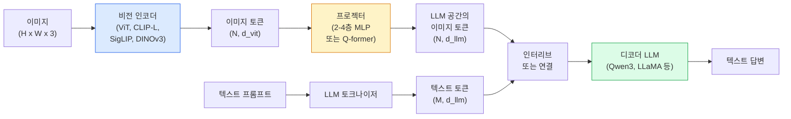

> 🇰🇷 이 문서는 한국어 번역본입니다(ELI5 스타일). 원문: [en.md](en.md)

# 비전-언어 모델 — ViT-MLP-LLM 패턴 (Vision-Language Models)

> 비전 인코더가 이미지를 토큰으로 바꿉니다. MLP 프로젝터가 그 토큰을 LLM 임베딩 공간으로 사상합니다. 나머지는 언어 모델이 합니다. 바로 그 패턴 — ViT-MLP-LLM — 이 2026년 모든 프로덕션(운영 환경) VLM입니다.

**유형:** Learn + Use
**언어:** Python
**선수 지식:** 페이즈 4 레슨 14(ViT), 페이즈 4 레슨 18(CLIP), 페이즈 7 레슨 02(셀프 어텐션)
**시간:** 약 75분

## 학습 목표

- ViT-MLP-LLM 아키텍처를 말하고, 세 컴포넌트가 각자 무엇을 기여하는지 설명합니다.
- Qwen3-VL, InternVL3.5, LLaVA-Next, GLM-4.6V를 파라미터 수, 컨텍스트 길이, 벤치마크 성능으로 비교합니다.
- DeepStack을 설명합니다: 다층 ViT 특징이 마지막 층 특징 하나보다 비전-언어 정렬을 왜 더 촘촘하게 만드는지.
- Cross-Modal Error Rate(CMER)로 프로덕션 VLM 환각을 측정하고 그 신호에 대응합니다.

## 문제 상황

CLIP(페이즈 4 레슨 18)은 이미지와 텍스트의 공유 임베딩 공간을 주는데, 제로샷 분류와 검색에는 충분합니다. 하지만 "이 이미지에 빨간 차가 몇 대 있나요?"에는 답할 수 없습니다. CLIP은 텍스트를 생성하지 않고 유사도만 매기기 때문입니다.

비전-언어 모델(VLM) — Qwen3-VL, InternVL3.5, LLaVA-Next, GLM-4.6V — 은 CLIP 계열 이미지 인코더를 완전한 언어 모델에 붙입니다. 모델은 이미지와 질문을 보고 답을 생성합니다. 2026년 오픈소스 VLM은 멀티모달 벤치마크(MMMU, MMBench, DocVQA, ChartQA, MathVista, OSWorld)에서 GPT-5와 Gemini-2.5-Pro에 필적하거나 이깁니다.

세 조각(ViT, 프로젝터, LLM)이 표준입니다. 모델 간 차이는 어떤 ViT, 어떤 프로젝터, 어떤 LLM, 어떤 학습 데이터, 어떤 정렬(alignment) 레시피인가에 있습니다. 패턴을 이해하면 컴포넌트를 바꾸는 일은 기계적인 작업이 됩니다.

## 개념

### ViT-MLP-LLM 아키텍처



1. **비전 인코더** — 사전학습된 ViT(CLIP-L/14, SigLIP, DINOv3 또는 파인튜닝 변형). 패치 토큰을 만듭니다.
2. **프로젝터** — 비전 토큰을 LLM 임베딩 차원으로 사상하는 작은 모듈(2-4층 MLP 또는 Q-former). 파인튜닝의 대부분은 여기서 일어납니다.
3. **LLM** — 디코더 전용 언어 모델(Qwen3, Llama, Mistral, GLM, InternLM). 비전 + 텍스트 토큰을 순서대로 읽고 텍스트를 생성합니다.

세 조각 모두 원리상 학습 가능합니다. 실제로는 비전 인코더와 LLM이 대부분 얼어 있고 프로젝터만 학습됩니다 — 싼 비용으로 수십억 파라미터의 신호를 얻는 셈입니다.

### DeepStack

바닐라 프로젝션은 ViT의 마지막 층만 씁니다. DeepStack(Qwen3-VL)은 여러 ViT 깊이에서 특징을 샘플해 쌓습니다. 깊은 층은 고수준 의미를, 얕은 층은 세밀한(fine-grained) 공간·질감 정보를 나릅니다. 둘 다 LLM에 먹이면 "이미지에 무엇이 있는가"(의미)와 "정확히 어디에 있는가"(공간 그라운딩) 사이의 간극이 좁아집니다.

### 세 단계 학습

현대 VLM은 단계별로 학습합니다:

1. **정렬(Alignment)** — ViT와 LLM을 얼립니다. 이미지-캡션 쌍으로 프로젝터만 학습합니다. 프로젝터가 비전 공간을 언어 공간으로 사상하는 법을 배웁니다.
2. **사전학습** — 전부 풀어줍니다. 대규모 인터리브 이미지-텍스트 데이터(5억 쌍 이상)로 학습합니다. 모델의 시각 지식을 쌓습니다.
3. **인스트럭션 튜닝** — 엄선된 (이미지, 질문, 답) 삼중집으로 파인튜닝합니다. 대화 행동과 과제 형식을 배웁니다. 이 단계가 "시각을 아는 LM"을 쓸 만한 어시스턴트로 바꿉니다.

대부분의 LoRA 파인튜닝은 작은 레이블 데이터셋으로 3단계를 겨냥합니다.

### 모델 패밀리 비교 (2026년 초)

| 모델 | 파라미터 | 비전 인코더 | LLM | 컨텍스트 | 강점 |
|-------|--------|----------------|-----|---------|-----------|
| Qwen3-VL-235B-A22B (MoE) | 235B (22B 활성) | 커스텀 ViT + DeepStack | Qwen3 | 256K | 범용 SOTA, GUI 에이전트 |
| Qwen3-VL-30B-A3B (MoE) | 30B (3B 활성) | 커스텀 ViT + DeepStack | Qwen3 | 256K | 더 작은 MoE 대안 |
| Qwen3-VL-8B (dense) | 8B | 커스텀 ViT | Qwen3 | 128K | 프로덕션 밀집 기본값 |
| InternVL3.5-38B | 38B | InternViT-6B | Qwen3 + GPT-OSS | 128K | 강한 MMBench / MMVet |
| InternVL3.5-241B-A28B | 241B (28B 활성) | InternViT-6B | Qwen3 | 128K | GPT-4o에 필적 |
| LLaVA-Next 72B | 72B | SigLIP | Llama-3 | 32K | 오픈, 파인튜닝 쉬움 |
| GLM-4.6V | ~70B | 커스텀 | GLM | 64K | 오픈소스, 강한 OCR |
| MiniCPM-V-2.6 | 8B | SigLIP | MiniCPM | 32K | 엣지 친화적 |

### 비주얼 에이전트

Qwen3-VL-235B는 OSWorld에서 세계 최고 성능을 냅니다. OSWorld는 GUI(데스크톱, 모바일, 웹)를 조작하는 **비주얼 에이전트**용 벤치마크입니다. 모델은 스크린샷을 보고 UI를 이해하고 행동(클릭, 타이핑, 스크롤)을 내보냅니다. 도구와 결합하면 흔한 데스크톱 과제의 루프를 닫습니다. 2026년 대부분의 "AI PC" 데모가 내부에서 돌리는 것이 바로 이것입니다.

### 에이전트 능력 + RoPE 변형

VLM은 프레임이 비디오에서 **언제**의 것인지 알아야 합니다. Qwen3-VL은 T-RoPE(시간 로터리 위치 임베딩)에서 **텍스트 기반 시간 정렬**로 진화했습니다 — 명시적 타임스탬프 텍스트 토큰을 비디오 프레임과 인터리브합니다. 모델은 "`<timestamp 00:32>` frame, prompt"를 보고 시간 관계를 추론할 수 있습니다.

### 정렬 문제

크롤링 데이터셋의 이미지-텍스트 쌍 중 12%는 이미지에 완전히 근거하지 않는 기술을 담고 있습니다. 이것으로 학습한 VLM은 조용히 환각을 배웁니다 — 객체를 지어내고, 숫자를 잘못 읽고, 관계를 발명합니다. 프로덕션에서 지배적인 실패 모드입니다.

Skywork.ai가 이것을 추적하는 **Cross-Modal Error Rate(CMER)**를 도입했습니다:

```
CMER = 텍스트 신뢰도는 높은데 이미지-텍스트 유사도(CLIP 계열 검사기 기준)가 낮은 출력의 비율
```

CMER가 높으면 모델이 이미지에 근거하지 않는 것을 자신 있게 말하고 있다는 뜻입니다. CMER를 모니터링하고 프로덕션 KPI로 다룬 것이 그들의 배포에서 환각률을 약 35% 줄였습니다. 트릭은 "모델을 고쳐라"가 아니라 "CMER 높은 출력을 사람 검토로 라우팅하라"입니다.

### LoRA / QLoRA 파인튜닝

70B VLM의 전체 파인튜닝은 대부분의 팀에게 손이 안 닿습니다. 어텐션 + 프로젝터 층에 LoRA(랭크 16-64)를, 또는 4비트 베이스 가중치로 QLoRA를 쓰면 A100 / H100 한 장에 들어갑니다. 비용: 예제 5,000-50,000개, 컴퓨트 $100-$5,000, 학습 2-10시간.

### 공간 추론은 여전히 약함

현재 VLM은 공간 추론 벤치마크(위-아래, 좌-우, 세기, 거리)에서 50-60%를 냅니다. 용도가 "어느 객체가 어느 위에 있는가"에 의존한다면 철저히 검증하세요 — 범용 VLM 성능은 인간보다 아래입니다. 순수 공간 과제에서 VLM보다 나은 대안: 전문 키포인트 / 포즈 추정기, 깊이 모델, 또는 박스 기하를 후처리한 검출 모델.

```figure
v4-vlm-projector
```

## 만들어 보기

### 단계 1: 프로젝터

가장 자주 학습하게 될 부분입니다. GELU가 있는 2-4층 MLP입니다.

```python
import torch
import torch.nn as nn


class Projector(nn.Module):
    def __init__(self, vit_dim=768, llm_dim=4096, hidden=4096):
        super().__init__()
        self.net = nn.Sequential(
            nn.Linear(vit_dim, hidden),
            nn.GELU(),
            nn.Linear(hidden, llm_dim),
        )

    def forward(self, x):
        return self.net(x)
```

입력은 `(N_patches, d_vit)` 토큰 텐서입니다. 출력은 `(N_patches, d_llm)`. LLM은 출력의 모든 행을 그저 또 다른 토큰으로 취급합니다.

### 단계 2: ViT-MLP-LLM 엔드투엔드 조립

최소 VLM의 순전파 골격입니다. 실제 코드는 `transformers`를 씁니다; 이것은 개념적 배치입니다.

```python
class MinimalVLM(nn.Module):
    def __init__(self, vit, projector, llm, image_token_id):
        super().__init__()
        self.vit = vit
        self.projector = projector
        self.llm = llm
        self.image_token_id = image_token_id  # 텍스트 프롬프트 안의 자리표시자 토큰

    def forward(self, image, input_ids, attention_mask):
        # 1. 비전 특징
        vision_tokens = self.vit(image)                     # (B, N_patches, d_vit)
        vision_embeds = self.projector(vision_tokens)       # (B, N_patches, d_llm)

        # 2. 텍스트 임베딩
        text_embeds = self.llm.get_input_embeddings()(input_ids)  # (B, M, d_llm)

        # 3. 이미지 자리표시자 토큰을 비전 임베딩으로 교체
        merged = self._merge(text_embeds, vision_embeds, input_ids)

        # 4. LLM 실행
        return self.llm(inputs_embeds=merged, attention_mask=attention_mask)

    def _merge(self, text_embeds, vision_embeds, input_ids):
        out = text_embeds.clone()
        expected = vision_embeds.size(1)
        for b in range(input_ids.size(0)):
            positions = (input_ids[b] == self.image_token_id).nonzero(as_tuple=True)[0]
            if len(positions) != expected:
                raise ValueError(
                    f"batch item {b} has {len(positions)} image tokens but vision_embeds has {expected} patches."
                    " Every sample in the batch must be pre-padded to the same number of image placeholder tokens.")
            out[b, positions] = vision_embeds[b]
        return out
```

텍스트 안의 `<image>` 자리표시자 토큰이 실제 이미지 임베딩으로 교체됩니다 — LLaVA, Qwen-VL, InternVL이 쓰는 것과 같은 패턴입니다.

### 단계 3: CMER 계산

가벼운 런타임 검사입니다.

```python
import torch.nn.functional as F


def cross_modal_error_rate(image_emb, text_emb, text_confidence, sim_threshold=0.25, conf_threshold=0.8):
    """
    image_emb, text_emb: 이미지와 생성 텍스트의 임베딩 (내부에서 정규화됨)
    text_confidence:     [0, 1] 범위의 토큰별 평균 확률
    반환:                이미지-텍스트 정렬이 낮은 고신뢰 출력의 비율
    """
    image_emb = F.normalize(image_emb, dim=-1)
    text_emb = F.normalize(text_emb, dim=-1)
    sim = (image_emb * text_emb).sum(dim=-1)        # 코사인 유사도
    high_conf_low_sim = (text_confidence > conf_threshold) & (sim < sim_threshold)
    return high_conf_low_sim.float().mean().item()
```

CMER를 프로덕션 KPI로 다루세요. 엔드포인트별, 프롬프트 유형별, 고객별로 모니터링합니다. CMER가 오르면 모델이 어떤 입력 분포에서 환각을 시작한 것입니다.

### 단계 4: 장난감 VLM 분류기 (실행 가능)

프로젝터가 학습됨을 보여줍니다. 가짜 "ViT 특징"이 들어가고, 작은 LLM식 토큰이 클래스를 예측합니다.

```python
class ToyVLM(nn.Module):
    def __init__(self, vit_dim=32, llm_dim=64, num_classes=5):
        super().__init__()
        self.projector = Projector(vit_dim, llm_dim, hidden=64)
        self.head = nn.Linear(llm_dim, num_classes)

    def forward(self, vision_tokens):
        projected = self.projector(vision_tokens)
        pooled = projected.mean(dim=1)
        return self.head(pooled)
```

합성 (특징, 클래스) 쌍으로 200 스텝 안에 피팅됩니다 — 프로젝터 패턴이 동작한다는 것을 보이기에 충분합니다.

## 활용하기

2026년 프로덕션 팀이 VLM을 쓰는 세 가지 방법:

- **호스티드 API** — OpenAI Vision, Anthropic Claude Vision, Google Gemini Vision. 인프라 제로, 벤더 리스크.
- **오픈소스 셀프호스트** — `transformers`와 `vllm`으로 Qwen3-VL 또는 InternVL3.5. 완전한 제어, 초기 노력은 더 필요.
- **도메인 파인튜닝** — Qwen2.5-VL-7B 또는 LLaVA-1.6-7B를 로드하고, 커스텀 예제 5k-50k로 LoRA, `vllm` 또는 `TGI`로 서빙.

```python
from transformers import AutoProcessor, AutoModelForVision2Seq
import torch
from PIL import Image

model_id = "Qwen/Qwen3-VL-8B-Instruct"
processor = AutoProcessor.from_pretrained(model_id)
model = AutoModelForVision2Seq.from_pretrained(model_id, torch_dtype=torch.bfloat16, device_map="auto")

messages = [{
    "role": "user",
    "content": [
        {"type": "image", "image": Image.open("plot.png")},
        {"type": "text", "text": "What does this chart show?"},
    ],
}]
inputs = processor.apply_chat_template(messages, add_generation_prompt=True, tokenize=True, return_dict=True, return_tensors="pt").to("cuda")
generated = model.generate(**inputs, max_new_tokens=256)
answer = processor.decode(generated[0][inputs["input_ids"].shape[1]:], skip_special_tokens=True)
```

`apply_chat_template`이 `<image>` 자리표시자 토큰화를 숨겨줍니다; 모델이 병합을 내부에서 처리합니다.

## 출시하기

이 레슨이 만드는 산출물:

- `outputs/prompt-vlm-selector.md` — 정확도, 지연 시간, 컨텍스트 길이, 예산에 따라 Qwen3-VL / InternVL3.5 / LLaVA-Next / API를 고르는 프롬프트.
- `outputs/skill-cmer-monitor.md` — 프로덕션 VLM 엔드포인트에 크로스 모달 오류율, 엔드포인트별 대시보드, 알림 임계값을 계측하는 코드를 내보내는 스킬.

## 연습 문제

1. **(쉬움)** 어떤 오픈 VLM으로든 5장의 이미지에 프롬프트 세 개("what is this?", "count the objects", "describe the scene")를 돌려보세요. 각 답을 정답 / 부분 정답 / 환각으로 직접 채점하세요. 1차적인 CMER 비슷한 비율을 계산하세요.
2. **(보통)** 대상 도메인 이미지 500장과 캡션으로 Qwen2.5-VL-3B 또는 LLaVA-1.6-7B를 LoRA(랭크 16)로 파인튜닝하세요. 제로샷 vs 파인튜닝 MMBench식 정확도를 비교하세요.
3. **(어려움)** VLM의 이미지 인코더를 기본 SigLIP/CLIP 대신 DINOv3로 교체하세요. 프로젝터만 다시 학습합니다(얼린 LLM + 얼린 DINOv3). 조밀 예측 과제(세기, 공간 추론)가 개선되는지 측정하세요.

## 핵심 용어

| 용어 | 흔한 표현 | 실제 의미 |
|------|----------------|----------------------|
| ViT-MLP-LLM | "VLM 패턴" | 비전 인코더 + 프로젝터 + 언어 모델; 2026년 모든 VLM |
| 프로젝터 | "다리" | 비전 토큰을 LLM 임베딩 공간으로 사상하는 2-4층 MLP(또는 Q-former) |
| DeepStack | "Qwen3-VL 특징 트릭" | 마지막 층만이 아니라 여러 층의 ViT 특징을 쌓음 |
| 이미지 토큰 | "<image> 자리표시자" | 투영된 비전 임베딩으로 교체되는 텍스트 스트림의 특수 토큰 |
| CMER | "환각 KPI" | Cross-Modal Error Rate; 텍스트 신뢰도는 높은데 이미지-텍스트 유사도가 낮을 때 높음 |
| 비주얼 에이전트 | "클릭하는 VLM" | 도구 호출로 GUI(OSWorld, 모바일, 웹)를 조작하는 VLM |
| Q-former | "고정 개수 토큰 다리" | 고정 개수의 시각 쿼리 토큰을 만드는 BLIP-2 스타일 프로젝터 |
| 정렬 / 사전학습 / 인스트럭션 튜닝 | "세 단계" | 표준 VLM 학습 파이프라인 |

## 더 읽을거리

- [Qwen3-VL 기술 보고서 (arXiv 2511.21631)](https://arxiv.org/abs/2511.21631)
- [InternVL3.5 Advancing Open-Source Multimodal Models (arXiv 2508.18265)](https://arxiv.org/html/2508.18265v1)
- [LLaVA-Next 시리즈](https://llava-vl.github.io/blog/2024-05-10-llava-next-stronger-llms/)
- [BentoML: Best Open-Source VLMs 2026](https://www.bentoml.com/blog/multimodal-ai-a-guide-to-open-source-vision-language-models)
- [MMMU: Multi-discipline Multimodal Understanding 벤치마크](https://mmmu-benchmark.github.io/)
- [제조업의 VLM (Robotics Tomorrow, 2026년 3월)](https://www.roboticstomorrow.com/story/2026/03/when-machines-learn-to-see-like-experts-the-rise-of-vision-language-models-in-manufacturing/26335/)
