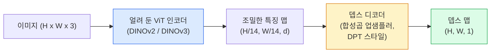

> 🇰🇷 이 문서는 한국어 번역본입니다(ELI5 스타일). 원문: [en.md](en.md)

# 모노큘러 뎁스(Monocular Depth)와 기하학 추정

> 뎁스 맵(depth map)은 픽셀 하나하나가 카메라로부터의 거리를 나타내는 1채널 이미지입니다. RGB 프레임 한 장으로 이걸 예측하는 일은 예전에는 스테레오 카메라나 라이다(LiDAR) 없이는 불가능하게 여겨졌습니다. 그런데 2026년에는 얼려 쓰는(frozen) ViT 인코더에 가벼운 헤드만 붙여도 정답(ground truth)과 몇 퍼센트 차이 안 되는 결과를 뽑아냅니다.

**유형:** 만들기 + 활용
**언어:** Python
**선수 지식:** 페이즈 4 레슨 14(ViT), 페이즈 4 레슨 17(자기지도 비전), 페이즈 4 레슨 07(U-Net)
**소요 시간:** 약 60분

## 학습 목표

- 상대 뎁스(relative depth)와 메트릭 뎁스(metric depth)를 구분하고, 각 프로덕션(운영 환경) 모델(MiDaS, Marigold, Depth Anything V3, ZoeDepth)이 어느 쪽 문제를 푸는지 말할 수 있다
- Depth Anything V3(DINOv2 백본)를 사용해 아무런 캘리브레이션 없이도 임의의 단일 이미지에 대해 뎁스를 예측할 수 있다
- 모노큘러 뎁스가 이미지 한 장만으로 왜 가능한지(원근 단서, 텍스처 그래디언트, 학습된 사전 지식) 설명하고, 무엇을 복원할 수 없는지(절대 스케일, 가려진 기하학) 말할 수 있다
- 뎁스 맵과 핀홀 카메라 내부 파라미터(intrinsics)를 이용해 2D 검출 결과를 3D 점으로 끌어올릴 수 있다

## 문제 상황

뎁스는 2D 컴퓨터 비전에서 빠져 있던 축입니다. RGB가 주어지면 물건이 이미지 평면의 어디에 보이는지는 알지만, 그게 얼마나 멀리 있는지는 모릅니다. 뎁스 센서(스테레오 리그, 라이다, 비행시간(time-of-flight) 센서)는 이 문제를 직접 풀어주지만 비싸고, 잘 망가지고, 측정 거리도 제한적입니다.

모노큘러 뎁스 추정 — RGB 프레임 한 장에서 뎁스를 예측하는 일 — 은 예전에는 흐릿하고 믿을 수 없는 결과만 냈습니다. 그러다 2026년까지 대규모 사전학습 인코더가 상황을 바꿔 놓았습니다. Depth Anything V3는 얼려 둔 DINOv2 백본을 써서 실내, 실외, 의료, 위성 도메인을 가리지 않고 잘 일반화되는 뎁스 맵을 만들어 냅니다. Marigold는 뎁스를 조건부 확산(diffusion) 문제로 다시 정의했고, ZoeDepth는 진짜 메트릭 거리를 회귀합니다.

뎁스는 2D 검출과 3D 이해를 잇는 다리이기도 합니다. 검출된 박스의 픽셀에 뎁스를 곱하면 2D 물체를 3D 포인트 클라우드로 끌어올릴 수 있습니다. 모든 AR 가림(occlusion) 시스템, 모든 장애물 회피 파이프라인, 모든 "컵을 집어라" 로봇의 핵심이 바로 이것입니다.

## 개념

### 상대 뎁스 vs 메트릭 뎁스

- **상대 뎁스(relative depth)** — 실세계 단위가 없는, 순서만 있는 `z` 값. "픽셀 A가 픽셀 B보다 가깝다는 건 알지만, 거리의 비율이 미터 단위에 고정되어 있지는 않다."
- **메트릭 뎁스(metric depth)** — 카메라로부터의 절대 거리(미터). 모델이 이미지 단서와 실제 거리 사이의 통계적 관계를 학습했어야 합니다.

MiDaS와 Depth Anything V3는 상대 뎁스를 냅니다. Marigold도 상대 뎁스입니다. ZoeDepth, UniDepth, Metric3D는 메트릭 뎁스를 냅니다. 메트릭 모델은 카메라 내부 파라미터에 민감하고, 상대 모델은 그렇지 않습니다.

### 인코더-디코더 패턴



Depth Anything V3는 인코더를 얼려 두고 DPT 스타일 디코더만 학습합니다. 인코더가 풍부한 특징을 제공하면, 디코더가 그 특징을 다시 이미지 해상도로 보간하며 뎁스를 회귀합니다.

### 이미지 한 장으로 뎁스가 나오는 이유

2D 이미지 안에는 뎁스와 상관관계가 있는 수많은 모노큘러(단안) 단서가 들어 있습니다.

- **원근(perspective)** — 3D에서 평행한 선은 2D에서 한 점으로 모여 보입니다.
- **텍스처 그래디언트** — 멀리 있는 표면일수록 텍스처가 더 작고 촘촘해 보입니다.
- **가림 순서(occlusion order)** — 가까운 물체가 먼 물체를 가립니다.
- **크기 항상성** — 크기를 아는 물체(자동차, 사람)가 대략적인 스케일을 알려 줍니다.
- **대기 원근** — 실외 장면에서는 멀리 있는 물체일수록 흐릿하고 푸르게 보입니다.

수십억 장의 이미지로 학습한 ViT는 이런 단서들을 몸에 깊이 새깁니다. 데이터가 충분하고 백본이 튼튼하면, 모노큘러 뎁스는 명시적인 3D 정답 데이터 없이도 그럴듯한 정확도에 도달합니다.

### 모노큘러 뎁스가 못 하는 것

- **절대 메트릭 스케일** — 내부 파라미터나 크기를 아는 물체가 장면에 없으면 불가능합니다. 신경망은 "컵이 숟가락의 두 배 멀리 있다"는 예측할 수 있어도, 컵이 1m인지 10m인지는 모릅니다.
- **가려진 기하학** — 의자의 뒷면은 보이지 않기 때문에 신뢰 있게 추론할 수 없습니다.
- **정말로 무늬가 없는/반사하는 표면** — 거울, 유리, 무늬 없는 벽. 신경망은 그럴듯하지만 틀린 뎁스를 내놓습니다.

### 2026년의 Depth Anything V3

- 순정 DINOv2 ViT-L/14를 인코더로 사용(얼려 둠).
- DPT 디코더.
- 다양한 출처의 포즈가 있는 이미지 쌍으로 학습(광학적 일관성(photometric consistency) 외에 명시적인 뎁스 정답 데이터가 필요 없음).
- **카메라 포즈를 아든 모르든, 임의 개수의 시각 입력**으로부터 공간적으로 일관된 기하학을 예측.
- 모노큘러 뎁스, 임의 시점 기하학, 시각 렌더링, 카메라 포즈 추정 전반에서 SOTA.

2026년에 뎁스가 필요하면 호출하면 되는 바로 그 모델입니다.

### Marigold — 확산 모델로 뎁스를

Marigold(Ke 등, CVPR 2024)는 뎁스 추정을 조건부 이미지-투-이미지 확산 문제로 다시 정의합니다. 조건: RGB. 목표: 뎁스 맵. 사전학습된 Stable Diffusion 2 U-Net을 백본으로 사용합니다. 출력 뎁스 맵은 물체 경계에서 유난히 선명합니다. 단점: 피드포워드 모델보다 추론이 느립니다(디노이징 10~50단계).

### 내부 파라미터와 핀홀 카메라

뎁스 `d`를 가진 픽셀 `(u, v)`를 카메라 좌표계의 3D 점 `(X, Y, Z)`로 끌어올리는 식은 다음과 같습니다.

```
fx, fy, cx, cy = camera intrinsics
X = (u - cx) * d / fx
Y = (v - cy) * d / fy
Z = d
```

내부 파라미터는 EXIF 메타데이터, 캘리브레이션 패턴, 또는 모노큘러 내부 파라미터 추정기(Perspective Fields, UniDepth)에서 얻습니다. 내부 파라미터가 없어도 시야각(FOV)을 60~70도로 가정하고 적당한 초점 거리 값을 잡아 포인트 클라우드를 렌더링할 수는 있습니다 — 시각화에는 쓸 만하지만, 측정 용도로는 안 됩니다.

### 평가

표준 지표 두 가지:

- **AbsRel**(절대 상대 오차): `mean(|d_pred - d_gt| / d_gt)`. 낮을수록 좋습니다. 프로덕션 모델 기준 0.05~0.1.
- **delta < 1.25**(임계값 정확도): `max(d_pred/d_gt, d_gt/d_pred) < 1.25`인 픽셀의 비율. 높을수록 좋습니다. SOTA 기준 0.9 이상.

상대 뎁스 모델(Depth Anything V3, MiDaS)의 평가는 두 지표의 스케일-시프트 불변(scale-and-shift invariant) 버전을 사용합니다.

```figure
depth-sweep
```

## 만들어 보기

### 단계 1: 뎁스 지표

```python
import torch

def abs_rel_error(pred, target, mask=None):
    if mask is not None:
        pred = pred[mask]
        target = target[mask]
    return (torch.abs(pred - target) / target.clamp(min=1e-6)).mean().item()


def delta_accuracy(pred, target, threshold=1.25, mask=None):
    if mask is not None:
        pred = pred[mask]
        target = target[mask]
    ratio = torch.maximum(pred / target.clamp(min=1e-6), target / pred.clamp(min=1e-6))
    return (ratio < threshold).float().mean().item()
```

평가하기 전에 유효하지 않은 뎁스 픽셀(0, NaN, 포화된 값)은 반드시 마스크로 걸러 내세요.

### 단계 2: 스케일-시프트 정렬

상대 뎁스 모델을 평가할 때는 지표를 계산하기 전에 예측값을 정답에 정렬해야 합니다. `a * pred + b = target`을 최소제곱으로 맞추는 코드입니다.

```python
def align_scale_shift(pred, target, mask=None):
    if mask is not None:
        p = pred[mask]
        t = target[mask]
    else:
        p = pred.flatten()
        t = target.flatten()
    A = torch.stack([p, torch.ones_like(p)], dim=1)
    coeffs, *_ = torch.linalg.lstsq(A, t.unsqueeze(-1))
    a, b = coeffs[:2, 0]
    return a * pred + b
```

MiDaS / Depth Anything을 평가할 때는 `abs_rel_error` 전에 `align_scale_shift`를 실행하세요.

### 단계 3: 뎁스를 포인트 클라우드로

```python
import numpy as np

def depth_to_point_cloud(depth, intrinsics):
    H, W = depth.shape
    fx, fy, cx, cy = intrinsics
    v, u = np.meshgrid(np.arange(H), np.arange(W), indexing="ij")
    z = depth
    x = (u - cx) * z / fx
    y = (v - cy) * z / fy
    return np.stack([x, y, z], axis=-1)


depth = np.random.uniform(0.5, 4.0, (240, 320))
intr = (320.0, 320.0, 160.0, 120.0)
pc = depth_to_point_cloud(depth, intr)
print(f"point cloud shape: {pc.shape}  (H, W, 3)")
```

함수 하나면 3D로 끌어올리는 모든 응용에 재사용할 수 있습니다. 포인트 클라우드를 `.ply`로 내보내 MeshLab이나 CloudCompare에서 열어 보세요.

### 단계 4: 합성 뎁스 장면으로 스모크 테스트

```python
def synthetic_depth(size=96):
    yy, xx = np.meshgrid(np.arange(size), np.arange(size), indexing="ij")
    # 바닥: 가까운 쪽(위)에서 먼 쪽(아래)으로 선형 그래디언트
    depth = 1.0 + (yy / size) * 4.0
    # 가운데 상자: 더 가까움
    mask = (np.abs(xx - size / 2) < size / 6) & (np.abs(yy - size * 0.6) < size / 6)
    depth[mask] = 2.0
    return depth.astype(np.float32)


gt = torch.from_numpy(synthetic_depth(96))
pred = gt + 0.3 * torch.randn_like(gt)  # 예측 결과를 시뮬레이션
aligned = align_scale_shift(pred, gt)
print(f"before align  absRel = {abs_rel_error(pred, gt):.3f}")
print(f"after align   absRel = {abs_rel_error(aligned, gt):.3f}")
```

### 단계 5: Depth Anything V3 사용법 (참고)

```python
import torch
from transformers import pipeline
from PIL import Image

pipe = pipeline(task="depth-estimation", model="LiheYoung/depth-anything-v2-large")

image = Image.open("street.jpg").convert("RGB")
out = pipe(image)
depth_np = np.array(out["depth"])
```

딱 세 줄입니다. `out["depth"]`는 PIL 그레이스케일 이미지이므로 수학 계산을 하려면 numpy로 바꿔야 합니다. Depth Anything V3가 정식 공개되면 모델 아이디만 바꾸면 되고, API는 그대로입니다.

## 활용하기

- **Depth Anything V3** (Meta AI / ByteDance, 2024-2026) — 상대 뎁스의 기본 선택지. 프로덕션에서 쓸 수 있는 ViT-large 백본 모델 중 가장 빠릅니다.
- **Marigold** (ETH, 2024) — 최고 수준의 시각 품질, 느린 추론.
- **UniDepth** (ETH, 2024) — 카메라 내부 파라미터까지 추정하는 메트릭 뎁스.
- **ZoeDepth** (Intel, 2023) — 메트릭 뎁스. 오래됐지만 여전히 믿을 만합니다.
- **MiDaS v3.1** — 구형이지만 안정적. 비교용 베이스라인으로 좋습니다.

전형적인 통합 패턴:

1. RGB 프레임이 들어온다.
2. 뎁스 모델이 뎁스 맵을 만든다.
3. 검출기가 박스를 만든다.
4. 박스 중심을 뎁스를 통과시켜 3D로 끌어올린다. 포인트 클라우드가 있으면 병합한다.
5. 후속 처리: AR 가림 처리, 경로 계획, 물체 크기 추정, 스테레오 대체.

실시간 용도라면 Depth Anything V2 Small(INT8 양자화)이 소비자용 GPU에서 518x518 해상도로 약 30fps를 냅니다.

## 출시하기

이 레슨에서 만드는 산출물:

- `outputs/prompt-depth-model-picker.md` — 지연 시간, 메트릭/상대 뎁스 필요 여부, 장면 유형을 고려해 Depth Anything V3, Marigold, UniDepth, MiDaS 중 하나를 골라 주는 프롬프트.
- `outputs/skill-depth-to-pointcloud.md` — 뎁스 맵에서 내부 파라미터를 올바르게 처리해 포인트 클라우드를 만들고 `.ply`로 내보내는 스킬.

## 연습 문제

1. **(쉬움)** 책상 사진 아무거나 10장으로 Depth Anything V2를 돌려 보세요. 뎁스를 그레이스케일 PNG로 저장하고 살펴봅니다. 예측 뎁스가 이상해 보이는 물체 하나를 찾고, 모노큘러 단서가 왜 실패했는지 설명해 보세요.
2. **(보통)** Depth Anything V2가 낸 RGB + 뎁스로 포인트 클라우드를 만들어 `open3d`로 렌더링해 보세요. 두 장면(실내/실외)을 비교하고 어느 쪽이 더 진짜 같은지 적어 봅니다.
3. **(어려움)** 아는 물체의 위치만 정해진 만큼 다른 이미지 쌍 다섯 쌍을 준비하세요(예: 병을 30cm 가까이 이동). UniDepth로 양쪽 모두 메트릭 뎁스를 예측하고, 예측된 거리 차이가 실제 30cm와 얼마나 맞는지 보고하세요.

## 핵심 용어

| 용어 | 사람들이 말하는 것 | 실제 의미 |
|------|----------------|----------------------|
| 모노큘러 뎁스 | "단일 이미지 뎁스" | RGB 프레임 한 장에서 뎁스를 추정. 스테레오도 라이다도 없음 |
| 상대 뎁스 | "순서가 있는 뎁스" | 실세계 단위 없이 순서만 있는 z 값 |
| 메트릭 뎁스 | "절대 거리" | 미터 단위 뎁스. 캘리브레이션 또는 메트릭 정답으로 학습된 모델이 필요 |
| AbsRel | "절대 상대 오차" | |d_pred - d_gt| / d_gt의 평균. 표준 뎁스 지표 |
| 델타 정확도 | "delta < 1.25" | 예측이 정답의 25% 이내인 픽셀의 비율 |
| 핀홀 카메라 | "fx, fy, cx, cy" | (u, v, d)를 (X, Y, Z)로 끌어올릴 때 쓰는 카메라 모델 |
| DPT | "Dense Prediction Transformer" | 얼려 둔 ViT 인코더 위에 얹는 합성곱 기반 뎁스 디코더 |
| DINOv2 백본 | "잘 되는 이유" | 뎁스 레이블 없이도 도메인을 가리지 않고 일반화되는 자기지도 특징 |

## 더 읽을거리

- [Depth Anything V3 논문 페이지](https://depth-anything.github.io/) — DINOv2 인코더를 쓰는 SOTA 모노큘러 뎁스
- [Marigold (Ke 등, CVPR 2024)](https://marigoldmonodepth.github.io/) — 확산 기반 뎁스 추정
- [UniDepth (Piccinelli 등, 2024)](https://arxiv.org/abs/2403.18913) — 내부 파라미터까지 추정하는 메트릭 뎁스
- [MiDaS v3.1 (Intel ISL)](https://github.com/isl-org/MiDaS) — 정통 상대 뎁스 베이스라인
- [DINOv3 블로그 포스트 (Meta)](https://ai.meta.com/blog/dinov3-self-supervised-vision-model/) — 뎁스 정확도를 끌어올리는 인코더 계열
