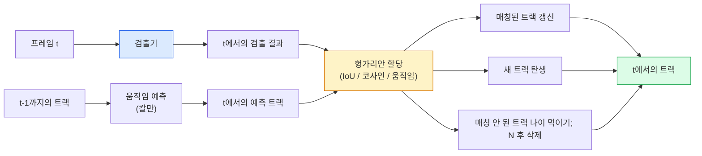

> 🇰🇷 이 문서는 한국어 번역본입니다(ELI5 스타일). 원문: [en.md](en.md)

# 다중 물체 추적(Multi-Object Tracking)과 비디오 메모리

> 추적은 검출에 연결(association)을 더한 것입니다. 매 프레임마다 검출하고, 이번 프레임의 검출 결과를 지난 프레임의 트랙과 ID 기준으로 맞추면 됩니다.

**유형:** 만들기
**언어:** Python
**선수 지식:** 페이즈 4 레슨 06(YOLO 검출), 페이즈 4 레슨 08(Mask R-CNN), 페이즈 4 레슨 24(SAM 3)
**소요 시간:** 약 60분

## 학습 목표

- 검출 기반 추적(tracking-by-detection)과 쿼리 기반 추적을 구분하고, 알고리즘 계열(SORT, DeepSORT, ByteTrack, BoT-SORT, SAM 2 메모리 트래커, SAM 3.1 Object Multiplex)을 이름으로 말할 수 있다
- 고전적인 검출 기반 추적을 위해 IoU + 헝가리안 할당을 처음부터 직접 구현할 수 있다
- SAM 2의 메모리 뱅크가 무엇인지, 그리고 IoU 기반 연결보다 가림(occlusion)을 더 잘 다루는 이유를 설명할 수 있다
- 세 가지 추적 지표(MOTA, IDF1, HOTA)를 읽고, 주어진 용도에 어떤 지표가 중요한지 고를 수 있다

## 문제 상황

검출기는 한 프레임 안에서 물체가 어디 있는지 알려 줍니다. 트래커는 프레임 `t`의 어떤 검출이 프레임 `t-1`의 어떤 검출과 같은 물체인지 알려 줍니다. 이게 없으면 선을 넘는 물체 수를 세거나, 가림 사이에서 공을 계속 따라가거나, "4번 차가 이 차선에 8초째 있다"는 것을 알 수 없습니다.

추적은 비디오를 다루는 모든 제품에 필수입니다: 스포츠 분석, 감시(cctv), 자율주행, 의료 영상 분석, 야생동물 관찰, 워터마크(로고) 카운팅까지. 핵심 구성 요소는 모두 공유됩니다. 프레임별 검출기, 움직임 모델(칼만 필터 또는 더 풍부한 무언가), 연결 단계(IoU / 코사인 / 학습된 특징에 대한 헝가리안 알고리즘), 그리고 트랙 수명 주기(탄생, 갱신, 소멸)입니다.

2026년에는 두 가지 새로운 패턴이 등장했습니다. **SAM 2 메모리 기반 추적**(움직임 모델 연결 대신 특징 메모리 사용)과 **SAM 3.1 Object Multiplex**(같은 개념의 많은 인스턴스가 하나의 메모리를 공유)입니다. 이 레슨에서는 고전 스택을 먼저 다루고, 그다음 메모리 기반 접근을 살펴봅니다.

## 개념

### 검출 기반 추적(tracking-by-detection)



2026년에 만나게 될 모든 트래커는 이 루프의 변형입니다. 차이는 다음과 같습니다.

- **SORT** (2016): 칼만 필터 + IoU 헝가리안. 단순하고 빠르며, 외형(appearance) 모델이 없습니다.
- **DeepSORT** (2017): SORT + 트랙별 CNN 기반 외형 특징(ReID 임베딩). 경로가 교차하는 상황을 더 잘 처리합니다.
- **ByteTrack** (2021): 저신뢰도 검출을 2단계 후보로 붙여 연결합니다. 외형 특징이 필요 없는데도 MOT17 최상위 성적을 냈습니다.
- **BoT-SORT** (2022): ByteTrack + 카메라 움직임 보정 + ReID.
- **StrongSORT / OC-SORT** — 움직임과 외형 처리를 개선한 ByteTrack 후속 작품들.

### 한 단락으로 보는 칼만 필터

칼만 필터는 트랙별 상태 `(x, y, w, h, dx, dy, dw, dh)`를 공분산과 함께 유지합니다. 매 프레임 등속 운동 모델로 상태를 **예측**하고, 그다음 매칭된 검출로 **갱신**합니다. 예측의 불확실성이 클수록 갱신 단계는 검출을 더 많이 믿습니다. 이 덕분에 부드러운 궤적이 나오고, 짧은 가림(1~5프레임) 사이에서도 트랙을 이어 갈 수 있습니다.

모든 고전 트래커가 움직임 예측 단계에서 칼만 필터를 사용합니다.

### 헝가리안 알고리즘

`M x N` 비용 행렬(트랙 x 검출)이 주어지면 총비용을 최소화하는 일대일 배정을 찾습니다. 비용은 보통 `1 - IoU(track_bbox, detection_bbox)`이거나 외형 특징의 음의 코사인 유사도입니다. 실행 시간은 O((M+N)^3)이고, M, N이 ~1000까지라면 `scipy.optimize.linear_sum_assignment`로 파이썬에서도 충분히 빠릅니다.

### ByteTrack의 핵심 아이디어

표준 트래커는 저신뢰도 검출(< 0.5)을 버립니다. ByteTrack은 그것들을 **2단계 후보**로 남겨 둡니다. 트랙을 고신뢰도 검출과 먼저 매칭한 뒤, 매칭되지 못한 트랙이 약간 느슨한 IoU 임계값으로 저신뢰도 검출과 다시 매칭을 시도합니다. 짧은 가림을 복구하고, 군중 속 ID 전환(switch)을 줄여 줍니다.

### SAM 2 메모리 기반 추적

SAM 2는 인스턴스별 시공간(spatio-temporal) 특징의 **메모리 뱅크**를 유지하는 방식으로 비디오를 처리합니다. 한 프레임에 프롬프트(클릭, 박스, 텍스트)를 주면 해당 인스턴스를 메모리에 인코딩합니다. 이후 프레임에서는 메모리가 새 프레임의 특징과 크로스 어텐션(cross-attention)을 하고, 디코더가 새 프레임에서 같은 인스턴스의 마스크를 만들어 냅니다.

칼만 필터도, 헝가리안 할당도 없습니다. 연결은 메모리 어텐션 연산 안에 암묵적으로 들어 있습니다.

장점:
- 큰 가림에도 강합니다(메모리가 여러 프레임에 걸쳐 인스턴스의 정체성을 유지).
- SAM 3의 텍스트 프롬프트와 결합하면 오픈 보캐뷸러리(임의 클래스)로 동작.
- 별도의 움직임 모델 없이 동작.

단점:
- 물체가 많은 추적에서는 ByteTrack보다 느립니다.
- 메모리 뱅크가 커지므로 컨텍스트 윈도우에 한계가 생깁니다.

### SAM 3.1 Object Multiplex

기존 SAM 2 / SAM 3 추적은 인스턴스마다 별도의 메모리 뱅크를 유지했습니다. 물체 50개면 메모리 뱅크 50개. Object Multiplex(2026년 3월)는 이것을 **인스턴스별 쿼리 토큰**을 가진 하나의 공유 메모리로 합쳤습니다. 비용이 인스턴스 수에 대해 준선형(sub-linear)으로 늘어납니다.

2026년 군중 추적의 새 기본값은 Multiplex입니다: 콘서트 관객, 창고 작업자, 교차로 차량 흐름.

### 알아야 할 세 가지 지표

- **MOTA (Multi-Object Tracking Accuracy)** — 1 - (FN + FP + ID 전환) / GT. 오류 유형별로 가중치가 섞여 있어, 검출 실패와 연결 실패가 뒤섞인 단일 지표입니다.
- **IDF1 (ID F1)** — ID 정밀도와 재현율의 조화평균. 각 정답 트랙이 시간이 지나도 ID를 얼마나 잘 지키는지에 초점을 맞춥니다. ID 전환에 민감한 작업에서는 MOTA보다 낫습니다.
- **HOTA (Higher Order Tracking Accuracy)** — 검출 정확도(DetA)와 연결 정확도(AssA)로 분해됩니다. 2020년 이후 커뮤니티 표준이며 가장 포괄적입니다.

감시(누가 누구인지)라면 IDF1을 보고합니다. 스포츠 분석(패스 횟수 세기)이라면 HOTA. 일반적인 학술 비교도 HOTA입니다.

```figure
cv3-track-assoc
```

## 만들어 보기

### 단계 1: IoU 기반 비용 행렬

```python
import numpy as np


def bbox_iou(a, b):
    """
    a, b: [x1, y1, x2, y2] 형태의 (N, 4) 배열.
    (N_a, N_b) 크기의 IoU 행렬을 반환.
    """
    ax1, ay1, ax2, ay2 = a[:, 0], a[:, 1], a[:, 2], a[:, 3]
    bx1, by1, bx2, by2 = b[:, 0], b[:, 1], b[:, 2], b[:, 3]
    inter_x1 = np.maximum(ax1[:, None], bx1[None, :])
    inter_y1 = np.maximum(ay1[:, None], by1[None, :])
    inter_x2 = np.minimum(ax2[:, None], bx2[None, :])
    inter_y2 = np.minimum(ay2[:, None], by2[None, :])
    inter = np.clip(inter_x2 - inter_x1, 0, None) * np.clip(inter_y2 - inter_y1, 0, None)
    area_a = (ax2 - ax1) * (ay2 - ay1)
    area_b = (bx2 - bx1) * (by2 - by1)
    union = area_a[:, None] + area_b[None, :] - inter
    return inter / np.clip(union, 1e-8, None)
```

### 단계 2: 최소한의 SORT 스타일 트래커

분량을 위해 등속 칼만 예측은 생략했습니다 — 여기서는 단순 IoU 연결을 사용하며, 프로덕션에서는 칼만 예측이 필수입니다. 완전한 버전은 `sort` 파이썬 패키지가 제공합니다.

```python
from scipy.optimize import linear_sum_assignment


class Track:
    def __init__(self, tid, bbox, frame):
        self.id = tid
        self.bbox = bbox
        self.last_frame = frame
        self.hits = 1

    def update(self, bbox, frame):
        self.bbox = bbox
        self.last_frame = frame
        self.hits += 1


class SimpleTracker:
    def __init__(self, iou_threshold=0.3, max_age=5):
        self.tracks = []
        self.next_id = 1
        self.iou_threshold = iou_threshold
        self.max_age = max_age

    def step(self, detections, frame):
        if not self.tracks:
            for d in detections:
                self.tracks.append(Track(self.next_id, d, frame))
                self.next_id += 1
            return [(t.id, t.bbox) for t in self.tracks]

        track_boxes = np.array([t.bbox for t in self.tracks])
        det_boxes = np.array(detections) if len(detections) else np.empty((0, 4))

        iou = bbox_iou(track_boxes, det_boxes) if len(det_boxes) else np.zeros((len(track_boxes), 0))
        cost = 1 - iou
        cost[iou < self.iou_threshold] = 1e6

        matched_track = set()
        matched_det = set()
        if cost.size > 0:
            row, col = linear_sum_assignment(cost)
            for r, c in zip(row, col):
                if cost[r, c] < 1.0:
                    self.tracks[r].update(det_boxes[c], frame)
                    matched_track.add(r); matched_det.add(c)

        for i, d in enumerate(det_boxes):
            if i not in matched_det:
                self.tracks.append(Track(self.next_id, d, frame))
                self.next_id += 1

        self.tracks = [t for t in self.tracks if frame - t.last_frame <= self.max_age]
        return [(t.id, t.bbox) for t in self.tracks]
```

60줄입니다. 프레임별 검출을 받아 프레임별 트랙 ID를 돌려 줍니다. 실제 시스템은 여기에 칼만 예측, ByteTrack의 2단계 재매칭, 외형 특징을 추가합니다.

### 단계 3: 합성 궤적 테스트

```python
def synthetic_frames(num_frames=20, num_objects=3, H=240, W=320, seed=0):
    rng = np.random.default_rng(seed)
    starts = rng.uniform(20, 200, size=(num_objects, 2))
    velocities = rng.uniform(-5, 5, size=(num_objects, 2))
    frames = []
    for f in range(num_frames):
        dets = []
        for i in range(num_objects):
            cx, cy = starts[i] + f * velocities[i]
            dets.append([cx - 10, cy - 10, cx + 10, cy + 10])
        frames.append(dets)
    return frames


tracker = SimpleTracker()
for f, dets in enumerate(synthetic_frames()):
    tracks = tracker.step(dets, f)
```

직선으로 움직이는 물체 3개는 20프레임 내내 ID를 유지해야 합니다.

### 단계 4: ID 전환 지표

```python
def count_id_switches(tracks_per_frame, gt_per_frame):
    """
    tracks_per_frame:  (track_id, bbox) 목록의 목록
    gt_per_frame:      (gt_id, bbox) 목록의 목록
    ID 전환 횟수를 반환.
    """
    prev_assignment = {}
    switches = 0
    for tracks, gts in zip(tracks_per_frame, gt_per_frame):
        if not tracks or not gts:
            continue
        t_boxes = np.array([b for _, b in tracks])
        g_boxes = np.array([b for _, b in gts])
        iou = bbox_iou(g_boxes, t_boxes)
        for g_idx, (gt_id, _) in enumerate(gts):
            j = iou[g_idx].argmax()
            if iou[g_idx, j] > 0.5:
                t_id = tracks[j][0]
                if gt_id in prev_assignment and prev_assignment[gt_id] != t_id:
                    switches += 1
                prev_assignment[gt_id] = t_id
    return switches
```

IDF1과 비슷한 개념의 단순화 지표입니다. 정답 물체가 배정받은 예측 트랙 ID를 몇 번 바꾸는지 세는 방식입니다. 진짜 MOTA / IDF1 / HOTA 도구는 `py-motmetrics`와 `TrackEval`에 있습니다.

## 활용하기

2026년의 프로덕션 트래커:

- `ultralytics` — YOLOv8 + ByteTrack / BoT-SORT 내장. `results = model.track(source, tracker="bytetrack.yaml")`. 기본 선택지입니다.
- `supervision` (Roboflow) — ByteTrack 래퍼에 어노테이션 유틸리티까지 제공.
- SAM 2 / SAM 3.1 — `processor.track()`로 메모리 기반 추적.
- 커스텀 스택: 검출기(YOLOv8 / RT-DETR) + `sort-tracker` / `OC-SORT` / `StrongSORT`.

고르는 기준:

- 30fps 이상으로 보행자/자동차/박스 추적: **ultralytics와 함께 ByteTrack**.
- 군중 속 한 클래스의 많은 인스턴스: **SAM 3.1 Object Multiplex**.
- 외형으로 구분 가능한 심한 가림: **DeepSORT / StrongSORT** (ReID 특징).
- 스포츠 / 복잡한 상호작용: **BoT-SORT** 또는 학습형 트래커(MOTRv3).

## 출시하기

이 레슨에서 만드는 산출물:

- `outputs/prompt-tracker-picker.md` — 장면 유형, 가림 패턴, 지연 시간 예산을 고려해 SORT / ByteTrack / BoT-SORT / SAM 2 / SAM 3.1 중 하나를 골라 주는 프롬프트.
- `outputs/skill-mot-evaluator.md` — 정답 트랙 대비 MOTA / IDF1 / HOTA 평가 하네스 전체를 작성하는 스킬.

## 연습 문제

1. **(쉬움)** 위의 합성 트래커를 물체 3개, 10개, 30개로 돌려 보세요. 각 경우의 ID 전환 횟수를 보고하고, IoU만 쓰는 단순 연결이 어디서부터 실패하기 시작하는지 찾아 보세요.
2. **(보통)** 연결 단계 전에 등속 칼만 예측 단계를 추가해 보세요. 짧은(2~3프레임) 가림이 더 이상 ID 전환을 일으키지 않음을 보이세요.
3. **(어려움)** SAM 2의 메모리 기반 트래커(`transformers` 경유)를 대체 트래커 백엔드로 통합해 보세요. 30초짜리 군중 클립에서 SimpleTracker와 SAM 2를 모두 돌리고 ID 전환 횟수를 비교하세요. 눈에 띄는 사람 5명의 정답 ID는 직접 라벨링합니다.

## 핵심 용어

| 용어 | 사람들이 말하는 것 | 실제 의미 |
|------|----------------|----------------------|
| 검출 기반 추적 | "검출하고 나서 연결" | 프레임별 검출기 + IoU/외형 기반 헝가리안 할당 |
| 칼만 필터 | "움직임 예측" | 선형 동역학 + 공분산으로 부드러운 트랙 예측과 가림 처리 |
| 헝가리안 알고리즘 | "최적 배정" | 최소 비용 이분 매칭 문제를 푼다. `scipy.optimize.linear_sum_assignment` |
| ByteTrack | "저신뢰도 2차 매칭" | 매칭 안 된 트랙을 저신뢰도 검출과 재매칭해 짧은 가림을 복구 |
| DeepSORT | "SORT + 외형" | 프레임 간 매칭용 ReID 특징을 추가. ID 유지에 더 강함 |
| 메모리 뱅크 | "SAM 2의 비결" | 프레임에 걸쳐 저장되는 인스턴스별 시공간 특징. 크로스 어텐션이 명시적 연결을 대체 |
| Object Multiplex | "SAM 3.1 공유 메모리" | 인스턴스별 쿼리를 가진 단일 공유 메모리로 많은 물체를 빠르게 추적 |
| HOTA | "현대적 추적 지표" | 검출 정확도와 연결 정확도로 분해. 커뮤니티 표준 |

## 더 읽을거리

- [SORT (Bewley 등, 2016)](https://arxiv.org/abs/1602.00763) — 가장 기본적인 검출 기반 추적 논문
- [DeepSORT (Wojke 등, 2017)](https://arxiv.org/abs/1703.07402) — 외형 특징 추가
- [ByteTrack (Zhang 등, 2022)](https://arxiv.org/abs/2110.06864) — 저신뢰도 2차 매칭
- [BoT-SORT (Aharon 등, 2022)](https://arxiv.org/abs/2206.14651) — 카메라 움직임 보정
- [HOTA (Luiten 등, 2020)](https://arxiv.org/abs/2009.07736) — 분해형 추적 지표
- [SAM 2 비디오 세그멘테이션 (Meta, 2024)](https://ai.meta.com/sam2/) — 메모리 기반 트래커
- [SAM 3.1 Object Multiplex (Meta, 2026년 3월)](https://ai.meta.com/blog/segment-anything-model-3/)
