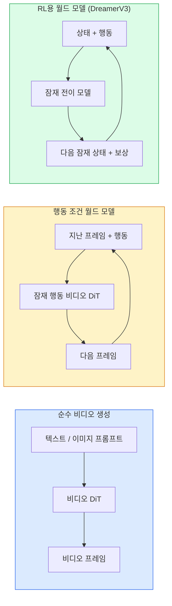

> 🇰🇷 이 문서는 한국어 번역본입니다(ELI5 스타일). 원문: [en.md](en.md)

# 월드 모델(World Models)과 비디오 확산

> 장면의 다음 몇 초를 예측하는 비디오 모델은 세계 시뮬레이터입니다. 그 예측을 행동(action)으로 조건을 걸면, 학습된 게임 엔진이 됩니다.

**유형:** 배우기 + 만들기
**언어:** Python
**선수 지식:** 페이즈 4 레슨 10(확산), 페이즈 4 레슨 12(비디오 이해), 페이즈 4 레슨 23(DiT + Rectified Flow)
**소요 시간:** 약 75분

## 학습 목표

- 순수 비디오 생성 모델(Sora 2)과 행동 조건 월드 모델(Genie 3, DreamerV3)의 차이를 설명할 수 있다
- 비디오 DiT를 기술할 수 있다: 시공간 패치, 3D 위치 인코딩, (T, H, W) 토큰 전체에 걸친 조인트 어텐션
- 월드 모델이 로보틱스에 어떻게 연결되는지 추적할 수 있다: VLM이 계획 → 비디오 모델이 시뮬레이션 → 역동학(inverse dynamics)이 행동을 출력
- 주어진 용도(크리에이티브 비디오, 인터랙티브 시뮬레이션, 자율주행 합성)에 따라 Sora 2, Genie 3, Runway GWM-1 Worlds, Wan-Video, HunyuanVideo 중 하나를 고를 수 있다

## 문제 상황

2026년 비디오 생성과 월드 모델링은 한 지점에서 만났습니다. 일관성 있는 1분짜리 비디오를 만들어 낼 수 있는 모델은 어떤 의미로 세계가 움직이는 법을 배운 셈입니다: 물체의 지속성(object permanence), 중력, 인과성, 스타일까지. 여기에 행동(왼쪽으로 걷기, 문 열기)을 조건으로 걸면, 비디오 모델은 게임 엔진, 운전 시뮬레이터, 로보틱스 환경을 대체할 수 있는 학습 가능한 시뮬레이터가 됩니다.

판돈은 구체적입니다. Genie 3는 이미지 한 장으로 플레이 가능한 환경을 만들어 냅니다. Runway GWM-1 Worlds는 끝없이 탐험할 수 있는 장면을 합성합니다. Sora 2는 동기화된 오디오와 모델링된 물리 법칙을 갖춘 1분짜리 비디오를 만듭니다. NVIDIA Cosmos-Drive, Wayve Gaia-2, Tesla DrivingWorld는 자율주행 학습 데이터용으로 사실적인 운전 영상을 생성합니다. 월드 모델 패러다임은 로보틱스의 sim-to-real(시뮬레이션에서 실세계로)을 조용히 장악해 가고 있습니다.

이 레슨은 페이즈 4의 "큰 그림" 레슨입니다. 이미지 생성, 비디오 이해, 에이전틱 추론을 연결해, 주류 연구가 향하고 있는 아키텍처 패턴을 조망합니다.

## 개념

### 월드 모델링의 세 계열



- **Sora 2**는 프롬프트로 조건이 걸리는 순수 비디오 생성입니다. 행동 인터페이스가 없습니다. 굴리는 중간에 "조종"할 수 없습니다.
- **Genie 3**, **GWM-1 Worlds**, **Mirage / Magica**는 행동 조건 월드 모델입니다. 관찰된 비디오에서 잠재 행동을 추론하고, 이후 프레임 예측에 행동을 조건으로 겁니다. 인터랙티브합니다 — 키를 누르거나 카메라를 움직이면 장면이 반응합니다.
- **DreamerV3**와 고전적인 RL 월드 모델 계열은 명시적인 행동 조건으로 잠재 공간 안에서 예측하며, 보상 신호로 학습됩니다. 시각적으로는 덜 화려하지만, 샘플 효율이 좋은 RL에는 더 유용합니다.

### 비디오 DiT 아키텍처

```
Video latent:          (C, T, H, W)
Patchify (spatial):    grid of P_h x P_w patches per frame
Patchify (temporal):   group P_t frames into a temporal patch
Resulting tokens:      (T / P_t) * (H / P_h) * (W / P_w) tokens
```

위치 인코딩은 3D입니다. (t, h, w) 좌표마다 회전(rotary) 또는 학습된 임베딩이 붙습니다. 어텐션은 다음 중 하나입니다.

- **풀 조인트(full joint)** — 모든 토큰이 모든 토큰을 봅니다. 토큰 N개 기준 O(N^2). 긴 비디오에는 감당이 안 됩니다.
- **분할(divided)** — 시간 어텐션(같은 공간 위치, 시간 축 방향: `(H*W) * T^2`)과 공간 어텐션(같은 시각, 공간 축 방향: `T * (H*W)^2`)을 번갈아 수행합니다. TimeSformer와 대부분의 비디오 DiT가 사용합니다.
- **윈도우(window)** — (t, h, w) 안의 지역 윈도우. Video Swin이 사용합니다.

2026년의 모든 비디오 확산 모델은 이 세 패턴 중 하나에 AdaLN 조건화(레슨 23)와 rectified flow를 얹은 형태입니다.

### 행동으로 조건 걸기: 잠재 행동 모델

Genie는 연속된 두 프레임 사이의 행동을 판별적으로 예측하는 방식으로 프레임별 **잠재 행동(latent action)**을 학습합니다. 그런 다음 모델의 디코더는 명시적인 키보드 입력이 아니라 추론된 잠재 행동을 조건으로 삼습니다. 추론 시점에는 사용자가 잠재 행동을 지정하거나(또는 새 사전분포에서 샘플링하면) 모델이 그 행동에 부합하는 다음 프레임을 생성합니다.

Sora는 행동 인터페이스를 아예 생략합니다. 디코더가 과거의 시공간 토큰으로부터 다음 시공간 토큰을 예측합니다. 프롬프트는 시작점을 정할 뿐, 생성 도중에 조종하는 장치는 없습니다.

### 물리적 타당성(physical plausibility)

Sora 2의 2026년 출시는 **물리적 타당성**을 명시적으로 내세웠습니다: 무게, 균형, 물체의 지속성, 인과관계. 팀이 사람이 직접 매긴 타당성 점수로 측정했고, Sora 1에 비해 떨어뜨린 물체, 부딪히는 캐릭터, 일부러 실패하는 동작(뛰어넘기 실패)에서 눈에 띄게 개선됐습니다.

그래도 타당성이 여전히 최대 실패 지점입니다. 2024~2025년의 스파게티를 먹거나 유리컵으로 물을 마시는 사람 영상들은 모델이 물체를 지속적으로 표현하지 못한다는 사실을 드러냈습니다. 2026년 모델(Sora 2, Runway Gen-5, HunyuanVideo)은 이런 문제를 줄이지만 없애지는 못합니다.

### 자율주행 월드 모델

주행 월드 모델은 궤적, 바운딩 박스, 내비게이션 맵을 조건으로 사실적인 도로 장면을 생성합니다. 사용 예:

- **Cosmos-Drive-Dreams** (NVIDIA) — RL 학습용으로 수 분짜리 운전 영상을 생성.
- **Gaia-2** (Wayve) — 정책 평가를 위한 궤적 조건 장면 합성.
- **DrivingWorld** (Tesla) — 다양한 날씨, 시간대, 교통 상황을 시뮬레이션.
- **Vista** (ByteDance) — 반응형 주행 장면 합성.

이 모델들은 특수한 코너 케이스 — 밤에 무단횡단하는 보행자, 결빙된 교차로, 별난 차종 — 를 얻기 위해 수백만 마일을 실제로 달리며 데이터를 모으는 일을 대체합니다.

### 로보틱스 스택: VLM + 비디오 모델 + 역동학

떠오르는 3구성 요소 로보틱스 루프:

1. **VLM**이 목표를 해석하고("빨간 컵을 집어 줘") 상위 수준의 행동 시퀀스를 계획합니다.
2. **비디오 생성 모델**이 각 행동을 실행하면 어떻게 보일지 시뮬레이션합니다 — N프레임 앞의 관측을 예측합니다.
3. **역동학 모델**이 그 관측을 만들어 낼 구체적인 모터 명령을 뽑아 냅니다.

이 구조는 보상 설계(reward shaping)와 샘플을 많이 먹는 RL을 대체합니다. 월드 모델이 상상을 하고, 역동학이 실제 구동의 루프를 닫습니다. Genie Envisioner가 그 한 사례이며, 많은 연구 그룹이 이 구조로 수렴하고 있습니다.

### 평가

- **시각 품질** — FVD(Fréchet Video Distance), 사용자 연구.
- **프롬프트 부합도** — 프레임별 CLIPScore, VQA 방식 평가.
- **물리적 타당성** — 벤치마크 모음에서 사람이 직접 채점(Sora 2의 내부 벤치마크, VBench).
- **제어 가능성**(인터랙티브 월드 모델의 경우) — 행동 → 관측 일관성. 이전 상태로 되돌아갈 수 있는가?

### 2026년 모델 지형

| 모델 | 용도 | 파라미터 | 출력 | 라이선스 |
|-------|-----|------------|--------|---------|
| Sora 2 | text-to-video, 오디오 | — | 1분 1080p + 오디오 | API 전용 |
| Runway Gen-5 | text/image-to-video | — | 10초 클립 | API |
| Runway GWM-1 Worlds | 인터랙티브 월드 | — | 무한 3D 롤아웃 | API |
| Genie 3 | 이미지에서 인터랙티브 월드 | 11B+ | 플레이 가능한 프레임 | 연구 프리뷰 |
| Wan-Video 2.1 | 오픈 text-to-video | 14B | 고품질 클립 | 비상업 |
| HunyuanVideo | 오픈 text-to-video | 13B | 10초 클립 | 관대함(permissive) |
| Cosmos / Cosmos-Drive | 자율주행 시뮬레이션 | 7-14B | 주행 장면 | NVIDIA 오픈 |
| Magica / Mirage 2 | AI 네이티브 게임 엔진 | — | 수정 가능한 월드 | 제품 |

```figure
v4-world-rollout
```

## 만들어 보기

### 단계 1: 비디오용 3D 패치화

```python
import torch
import torch.nn as nn


class VideoPatch3D(nn.Module):
    def __init__(self, in_channels=4, dim=64, patch_t=2, patch_h=2, patch_w=2):
        super().__init__()
        self.proj = nn.Conv3d(
            in_channels, dim,
            kernel_size=(patch_t, patch_h, patch_w),
            stride=(patch_t, patch_h, patch_w),
        )
        self.patch_t = patch_t
        self.patch_h = patch_h
        self.patch_w = patch_w

    def forward(self, x):
        # x: (N, C, T, H, W)
        x = self.proj(x)
        n, c, t, h, w = x.shape
        tokens = x.reshape(n, c, t * h * w).transpose(1, 2)
        return tokens, (t, h, w)
```

커널 크기와 스트라이드가 같은 3D 합성곱이 시공간 패치화기 역할을 합니다. `(T, H, W) -> (T/2, H/2, W/2)` 토큰 그리드가 됩니다.

### 단계 2: 3D 회전 위치 인코딩

Rotary Position Embeddings(RoPE)를 `t`, `h`, `w` 축에 각각 적용합니다:

```python
def rope_3d(tokens, t_dim, h_dim, w_dim, grid):
    """
    tokens: (N, T*H*W, D)
    grid: (T, H, W) 크기
    t_dim + h_dim + w_dim == D
    """
    T, H, W = grid
    n, seq, d = tokens.shape
    if t_dim + h_dim + w_dim != d:
        raise ValueError(f"t_dim+h_dim+w_dim ({t_dim}+{h_dim}+{w_dim}) must equal D={d}")
    assert seq == T * H * W
    t_idx = torch.arange(T, device=tokens.device).repeat_interleave(H * W)
    h_idx = torch.arange(H, device=tokens.device).repeat_interleave(W).repeat(T)
    w_idx = torch.arange(W, device=tokens.device).repeat(T * H)
    # 단순화: 채널을 주파수로 스케일만 한다. 실제 RoPE는 채널 쌍을 회전시킨다.
    freqs_t = torch.exp(-torch.log(torch.tensor(10000.0)) * torch.arange(t_dim // 2, device=tokens.device) / (t_dim // 2))
    freqs_h = torch.exp(-torch.log(torch.tensor(10000.0)) * torch.arange(h_dim // 2, device=tokens.device) / (h_dim // 2))
    freqs_w = torch.exp(-torch.log(torch.tensor(10000.0)) * torch.arange(w_dim // 2, device=tokens.device) / (w_dim // 2))
    emb_t = torch.cat([torch.sin(t_idx[:, None] * freqs_t), torch.cos(t_idx[:, None] * freqs_t)], dim=-1)
    emb_h = torch.cat([torch.sin(h_idx[:, None] * freqs_h), torch.cos(h_idx[:, None] * freqs_h)], dim=-1)
    emb_w = torch.cat([torch.sin(w_idx[:, None] * freqs_w), torch.cos(w_idx[:, None] * freqs_w)], dim=-1)
    return tokens + torch.cat([emb_t, emb_h, emb_w], dim=-1)
```

단순화된 덧셈 형태입니다. 실제 RoPE는 채널 쌍을 주파수별로 회전시키지만, 담고 있는 위치 정보는 같습니다.

### 단계 3: 분할 어텐션 블록

```python
class DividedAttentionBlock(nn.Module):
    def __init__(self, dim=64, heads=2):
        super().__init__()
        self.time_attn = nn.MultiheadAttention(dim, heads, batch_first=True)
        self.space_attn = nn.MultiheadAttention(dim, heads, batch_first=True)
        self.ln1 = nn.LayerNorm(dim)
        self.ln2 = nn.LayerNorm(dim)
        self.ln3 = nn.LayerNorm(dim)
        self.mlp = nn.Sequential(nn.Linear(dim, 4 * dim), nn.GELU(), nn.Linear(4 * dim, dim))

    def forward(self, x, grid):
        T, H, W = grid
        n, seq, d = x.shape
        # 시간 어텐션: 같은 (h, w), t 방향
        xt = x.view(n, T, H * W, d).permute(0, 2, 1, 3).reshape(n * H * W, T, d)
        a, _ = self.time_attn(self.ln1(xt), self.ln1(xt), self.ln1(xt), need_weights=False)
        xt = (xt + a).reshape(n, H * W, T, d).permute(0, 2, 1, 3).reshape(n, seq, d)
        # 공간 어텐션: 같은 t, (h, w) 방향
        xs = xt.view(n, T, H * W, d).reshape(n * T, H * W, d)
        a, _ = self.space_attn(self.ln2(xs), self.ln2(xs), self.ln2(xs), need_weights=False)
        xs = (xs + a).reshape(n, T, H * W, d).reshape(n, seq, d)
        xs = xs + self.mlp(self.ln3(xs))
        return xs
```

시간 어텐션은 공간 위치마다 시간 축을 따라 어텐션을 하고, 공간 어텐션은 프레임마다 위치들을 따라 어텐션을 합니다. O((THW)^2) 한 번 대신 O(T^2 + (HW)^2) 두 번으로 나눠 계산합니다. TimeSformer와 모든 현대 비디오 DiT의 핵심입니다.

### 단계 4: 아주 작은 비디오 DiT 조립

```python
class TinyVideoDiT(nn.Module):
    def __init__(self, in_channels=4, dim=64, depth=2, heads=2):
        super().__init__()
        self.patch = VideoPatch3D(in_channels=in_channels, dim=dim, patch_t=2, patch_h=2, patch_w=2)
        self.blocks = nn.ModuleList([DividedAttentionBlock(dim, heads) for _ in range(depth)])
        self.out = nn.Linear(dim, in_channels * 2 * 2 * 2)

    def forward(self, x):
        tokens, grid = self.patch(x)
        for blk in self.blocks:
            tokens = blk(tokens, grid)
        return self.out(tokens), grid
```

동작하는 비디오 생성기는 아니고, 모든 부품이 올바른 모양으로 맞물리는지 보여 주는 구조 데모입니다.

### 단계 5: 모양 확인

```python
vid = torch.randn(1, 4, 8, 16, 16)  # (N, C, T, H, W)
model = TinyVideoDiT()
out, grid = model(vid)
print(f"input  {tuple(vid.shape)}")
print(f"tokens grid {grid}")
print(f"output {tuple(out.shape)}")
```

패치화 후 `grid = (4, 8, 8)`, `out = (1, 256, 32)`이 나올 것입니다. 헤드가 토큰별 시공간 패치로 투영하면, 이후 언패치(un-patchify)해서 다시 비디오로 되돌릴 준비가 된 상태입니다.

## 활용하기

2026년의 프로덕션 접근 경로:

- **Sora 2 API** (OpenAI) — text-to-video, 동기화된 오디오. 프리미엄 가격.
- **Runway Gen-5 / GWM-1** (Runway) — image-to-video, 인터랙티브 월드.
- **Wan-Video 2.1 / HunyuanVideo** — 오픈소스 셀프 호스팅.
- **Cosmos / Cosmos-Drive** (NVIDIA) — 주행 시뮬레이션 오픈 웨이트.
- **Genie 3** — 연구 프리뷰, 접근 요청 필요.

인터랙티브 월드 모델 데모를 만든다면: 품질은 Wan-Video로 시작하고, 인터랙티브성은 잠재 행동 어댑터를 얹어 확보합니다. 자율주행 시뮬레이션이라면: Cosmos-Drive가 2026년의 오픈 레퍼런스입니다.

로보틱스의 실전 스택:

1. 언어 목표 -> VLM(Qwen3-VL) -> 상위 수준 계획.
2. 계획 -> 잠재 행동 비디오 모델 -> 상상 속 롤아웃.
3. 롤아웃 -> 역동학 모델 -> 하위 수준 행동.
4. 행동 실행 -> 관측이 1단계로 되먹임.

## 출시하기

이 레슨에서 만드는 산출물:

- `outputs/prompt-video-model-picker.md` — 작업, 라이선스, 지연 시간을 고려해 Sora 2 / Runway / Wan / HunyuanVideo / Cosmos 중 하나를 골라 주는 프롬프트.
- `outputs/skill-physical-plausibility-checks.md` — 출시 전 생성 비디오에 돌릴 자동화 검사(물체 지속성, 중력, 연속성)를 정의하는 스킬.

## 연습 문제

1. **(쉬움)** 5초 360p 비디오에서 patch-t=2, patch-h=8, patch-w=8일 때 토큰 수를 계산해 보세요. 이 크기에서 어텐션 메모리가 얼마나 드는지 추론해 보세요.
2. **(보통)** 위의 분할 어텐션 블록을 풀 조인트 어텐션 블록으로 바꾸고 모양과 파라미터 수를 측정해 보세요. 실제 비디오 모델에 분할 어텐션이 왜 필요한지 설명하세요.
3. **(어려움)** 최소한의 잠재 행동 비디오 모델을 만들어 보세요. (frame_t, action_t, frame_{t+1}) 삼중항 데이터셋(아무 간단한 2D 게임)을 준비하고, 행동 임베딩을 조건으로 받는 작은 비디오 DiT를 학습시킨 뒤, 서로 다른 행동이 서로 다른 다음 프레임을 만들어 냄을 보이세요.

## 핵심 용어

| 용어 | 사람들이 말하는 것 | 실제 의미 |
|------|----------------|----------------------|
| 월드 모델 | "학습된 시뮬레이터" | 상태와 행동이 주어지면 미래의 관측을 예측하는 모델 |
| 비디오 DiT | "시공간 트랜스포머" | 3D 패치화와 분할 어텐션을 갖춘 확산 트랜스포머 |
| 잠재 행동 | "추론된 조종 신호" | 프레임 쌍에서 추론한 이산/연속 행동 잠재값. 다음 프레임 생성의 조건으로 사용 |
| 분할 어텐션 | "시간 다음 공간" | 블록당 어텐션 두 번 — 시간 방향 후 공간 방향 — 으로 O(N^2)을 감당 가능한 수준으로 유지 |
| 물체 지속성 | "물건이 그대로 있다" | 비디오 모델이 반드시 배워야 할 장면 속성. 음식, 유리잔에서 나오는 고전적 실패 사례 |
| FVD | "Fréchet Video Distance" | 비디오판 FID. 주요 시각 품질 지표 |
| 역동학 모델 | "관측에서 행동으로" | (상태, 다음 상태)가 주어지면 그 둘을 잇는 행동을 출력. 로보틱스 루프를 닫는 부품 |
| Cosmos-Drive | "NVIDIA 주행 시뮬레이터" | RL과 평가를 위한 오픈 웨이트 자율주행 월드 모델 |

## 더 읽을거리

- [Sora 기술 보고서 (OpenAI)](https://openai.com/index/video-generation-models-as-world-simulators/)
- [Genie: Generative Interactive Environments (Bruce 등, 2024)](https://arxiv.org/abs/2402.15391) — 잠재 행동 월드 모델
- [TimeSformer (Bertasius 등, 2021)](https://arxiv.org/abs/2102.05095) — 비디오 트랜스포머용 분할 어텐션
- [DreamerV3 (Hafner 등, 2023)](https://arxiv.org/abs/2301.04104) — RL을 위한 월드 모델
- [Cosmos-Drive-Dreams (NVIDIA, 2025)](https://research.nvidia.com/labs/toronto-ai/cosmos-drive-dreams/) — 주행 월드 모델
- [Top 10 Video Generation Models 2026 (DataCamp)](https://www.datacamp.com/blog/top-video-generation-models)
- [From Video Generation to World Model — 서베이 저장소](https://github.com/ziqihuangg/Awesome-From-Video-Generation-to-World-Model/)
