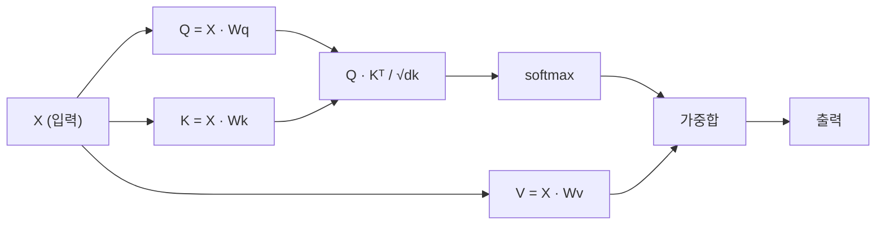

# 스크래치로 만드는 셀프 어텐션

> 🇰🇷 이 문서는 한국어 번역본입니다(ELI5 스타일). 원문: [en.md](en.md)

> 어텐션은 모든 단어가 "나한테 중요한 건 누구지?"라고 묻고, 그 답을 학습하는 룩업(lookup) 테이블입니다.

**유형:** 빌드
**언어:** Python
**선수 지식:** 페이즈 3 (딥러닝 핵심), 페이즈 5 레슨 10 (시퀀스-투-시퀀스)
**시간:** 약 90분

## 학습 목표

- NumPy만으로 스케일드 닷프로덕트(scaled dot-product) 셀프 어텐션을 처음부터 구현한다. 쿼리/키/값 프로젝션과 소프트맥스 가중합까지 포함
- 헤드를 분리하고 병렬로 어텐션을 계산한 뒤 결과를 이어 붙이는 멀티 헤드 어텐션 층을 만든다
- 어텐션 행렬이 토큰 관계를 어떻게 담는지 추적하고, sqrt(d_k)로 나누면 소프트맥스 포화를 왜 막을 수 있는지 설명한다
- 인과 마스킹(causal masking)을 적용해 양방향 어텐션을 자기회귀(디코더 스타일) 어텐션으로 바꾼다

## 문제 상황

RNN은 시퀀스를 토큰 하나씩 처리합니다. 토큰 50에 도착할 무렵에는 토큰 1의 정보가 이미 50번의 압축 단계를 통과한 뒤입니다. 장거리 의존성은 고정 크기 은닉 상태 안에 뭉개져 들어가고, 이 병목은 LSTM 게이트를 아무리 쌓아도 완전히 해결되지 않습니다.

2014년 Bahdanau의 어텐션 논문은 해법을 보여 주었습니다: 디코더가 인코더의 모든 위치를 돌아보고, 지금 단계에 중요한 곳이 어디인지 스스로 판단하게 하자는 것입니다. 하지만 여전히 RNN 위에 얹힌 덧붙임이었습니다. 2017년 "Attention Is All You Need" 논문은 더 날카로운 질문을 던졌습니다: 어텐션이 *유일한* 메커니즘이라면 어떨까? 순환 구조도 없고, 합성곱도 없습니다. 어텐션만 있으면 됩니다.

셀프 어텐션은 시퀀스의 모든 위치가 병렬 처리 한 단계 안에서 다른 모든 위치를 주시하게 합니다. 트랜스포머가 빠르고, 확장 가능하며, 모든 것을 지배하게 된 이유가 바로 이것입니다.

## 핵심 개념

### 데이터베이스 룩업 비유

어텐션을 부드러운(soft) 데이터베이스 룩업이라고 생각해 봅시다:

```
Traditional database:
  Query: "capital of France"  -->  exact match  -->  "Paris"

Attention:
  Query: "capital of France"  -->  similarity to ALL keys  -->  weighted blend of ALL values
```

모든 토큰은 벡터 세 개를 만들어 냅니다:
- **쿼리(Query, Q)**: "내가 찾고 있는 건 뭘까?"
- **키(Key, K)**: "나는 어떤 정보를 담고 있지?"
- **값(Value, V)**: "고르면 어떤 정보를 줄 수 있지?"

쿼리와 모든 키 사이의 닷프로덕트(내적)가 어텐션 점수가 됩니다. 점수가 높다는 건 "이 키가 내 쿼리와 맞는다"는 뜻입니다. 그 점수가 값들에 붙는 가중치가 되고, 출력은 값들의 가중합입니다.

### Q, K, V 계산

각 토큰 임베딩은 학습된 가중치 행렬 세 개를 통과하며 프로젝션됩니다:

```
Input embeddings (sequence of n tokens, each d-dimensional):

  X = [x1, x2, x3, ..., xn]       shape: (n, d)

Three weight matrices:

  Wq  shape: (d, dk)
  Wk  shape: (d, dk)
  Wv  shape: (d, dv)

Projections:

  Q = X @ Wq    shape: (n, dk)      each token's query
  K = X @ Wk    shape: (n, dk)      each token's key
  V = X @ Wv    shape: (n, dv)      each token's value
```

토큰 하나를 눈으로 그려 보면:

```
             Wq
  x_i ------[*]------> q_i    "What am I looking for?"
       |
       |     Wk
       +----[*]------> k_i    "What do I contain?"
       |
       |     Wv
       +----[*]------> v_i    "What do I offer?"
```

### 어텐션 행렬

모든 토큰의 Q, K, V가 준비되면 어텐션 점수가 하나의 행렬로 모입니다:

```
Scores = Q @ K^T    shape: (n, n)

              k1    k2    k3    k4    k5
        +-----+-----+-----+-----+-----+
   q1   | 2.1 | 0.3 | 0.1 | 0.8 | 0.2 |   <- how much q1 attends to each key
        +-----+-----+-----+-----+-----+
   q2   | 0.4 | 1.9 | 0.7 | 0.1 | 0.3 |
        +-----+-----+-----+-----+-----+
   q3   | 0.2 | 0.6 | 2.3 | 0.5 | 0.1 |
        +-----+-----+-----+-----+-----+
   q4   | 0.9 | 0.1 | 0.4 | 1.7 | 0.6 |
        +-----+-----+-----+-----+-----+
   q5   | 0.1 | 0.3 | 0.2 | 0.5 | 2.0 |
        +-----+-----+-----+-----+-----+

Each row: one token's attention over the entire sequence
```

한 번에 쿼리 하나씩 키를 쓸어 보세요: 각 행이 모든 토큰에 점수를 매기고, 소프트맥스가 점수를 가중치로 바꾸고, 컨텍스트 벡터는 값들의 가중 블렌드가 됩니다.

```figure
attention-matrix
```

### 왜 스케일을 조정할까?

닷프로덕트 값은 차원 dk에 비례해 커집니다. dk = 64라면 닷프로덕트가 수십 단위까지 커져 소프트맥스가 기울기가 사라지는 영역으로 밀려 들어갑니다. 해법은 sqrt(dk)로 나누는 것입니다.

```
Scaled scores = (Q @ K^T) / sqrt(dk)
```

그러면 값들이 소프트맥스가 쓸모 있는 기울기를 내놓는 범위 안에 머뭅니다.

### 소프트맥스가 점수를 가중치로 바꾼다

소프트맥스는 날점수(raw score)를 각 행의 확률 분포로 바꿉니다:

```
Raw scores for q1:   [2.1, 0.3, 0.1, 0.8, 0.2]
                            |
                         softmax
                            |
Attention weights:   [0.52, 0.09, 0.07, 0.14, 0.08]   (sums to ~1.0)
```

이제 각 토큰은 다른 모든 토큰에 얼마나 주목할지를 말해 주는 가중치 세트를 갖게 됩니다.

### 값들의 가중합

각 토큰의 최종 출력은 모든 값 벡터의 가중합입니다:

```
output_i = sum( attention_weight[i][j] * v_j  for all j )

For token 1:
  output_1 = 0.52 * v1 + 0.09 * v2 + 0.07 * v3 + 0.14 * v4 + 0.08 * v5
```

### 전체 파이프라인



한 줄 공식:

```
Attention(Q, K, V) = softmax( Q @ K^T / sqrt(dk) ) @ V
```

```figure
softmax-attention-scaling
```

## 만들어 보기

### 단계 1: 스크래치로 만드는 소프트맥스

소프트맥스는 날 로짓(logits)을 확률로 바꿉니다. 수치 안정성을 위해 최댓값을 빼 줍니다.

```python
import numpy as np

def softmax(x):
    shifted = x - np.max(x, axis=-1, keepdims=True)
    exp_x = np.exp(shifted)
    return exp_x / np.sum(exp_x, axis=-1, keepdims=True)

logits = np.array([2.0, 1.0, 0.1])
print(f"logits:  {logits}")
print(f"softmax: {softmax(logits)}")
print(f"sum:     {softmax(logits).sum():.4f}")
```

### 단계 2: 스케일드 닷프로덕트 어텐션

핵심 함수입니다. Q, K, V 행렬을 받아 어텐션 출력과 가중치 행렬을 돌려줍니다.

```python
def scaled_dot_product_attention(Q, K, V):
    dk = Q.shape[-1]
    scores = Q @ K.T / np.sqrt(dk)
    weights = softmax(scores)
    output = weights @ V
    return output, weights
```

### 단계 3: 학습되는 프로젝션이 있는 셀프 어텐션 클래스

Wq, Wk, Wv 가중치 행렬을 Xavier 비슷한 스케일로 초기화한 완전한 셀프 어텐션 모듈입니다.

```python
class SelfAttention:
    def __init__(self, d_model, dk, dv, seed=42):
        rng = np.random.default_rng(seed)
        scale = np.sqrt(2.0 / (d_model + dk))
        self.Wq = rng.normal(0, scale, (d_model, dk))
        self.Wk = rng.normal(0, scale, (d_model, dk))
        scale_v = np.sqrt(2.0 / (d_model + dv))
        self.Wv = rng.normal(0, scale_v, (d_model, dv))
        self.dk = dk

    def forward(self, X):
        Q = X @ self.Wq
        K = X @ self.Wk
        V = X @ self.Wv
        output, weights = scaled_dot_product_attention(Q, K, V)
        return output, weights
```

### 단계 4: 문장에 돌려 보기

문장용 가짜 임베딩을 만들고 어텐션 가중치를 관찰합니다.

```python
sentence = ["The", "cat", "sat", "on", "the", "mat"]
n_tokens = len(sentence)
d_model = 8
dk = 4
dv = 4

rng = np.random.default_rng(42)
X = rng.normal(0, 1, (n_tokens, d_model))

attn = SelfAttention(d_model, dk, dv, seed=42)
output, weights = attn.forward(X)

print("Attention weights (each row: where that token looks):\n")
print(f"{'':>6}", end="")
for token in sentence:
    print(f"{token:>6}", end="")
print()

for i, token in enumerate(sentence):
    print(f"{token:>6}", end="")
    for j in range(n_tokens):
        w = weights[i][j]
        print(f"{w:6.3f}", end="")
    print()
```

### 단계 5: ASCII 히트맵으로 어텐션 시각화하기

어텐션 가중치를 문자로 바꿔 눈으로 빠르게 확인합니다.

```python
def ascii_heatmap(weights, tokens, chars=" ░▒▓█"):
    n = len(tokens)
    print(f"\n{'':>6}", end="")
    for t in tokens:
        print(f"{t:>6}", end="")
    print()

    for i in range(n):
        print(f"{tokens[i]:>6}", end="")
        for j in range(n):
            level = int(weights[i][j] * (len(chars) - 1) / weights.max())
            level = min(level, len(chars) - 1)
            print(f"{'  ' + chars[level] + '   '}", end="")
        print()

ascii_heatmap(weights, sentence)
```

## 활용하기

PyTorch의 `nn.MultiheadAttention`은 우리가 만든 것에 멀티 헤드 분할과 출력 프로젝션을 더해 정확히 같은 일을 합니다:

```python
import torch
import torch.nn as nn

d_model = 8
n_heads = 2
seq_len = 6

mha = nn.MultiheadAttention(embed_dim=d_model, num_heads=n_heads, batch_first=True)

X_torch = torch.randn(1, seq_len, d_model)

output, attn_weights = mha(X_torch, X_torch, X_torch)

print(f"Input shape:            {X_torch.shape}")
print(f"Output shape:           {output.shape}")
print(f"Attention weight shape: {attn_weights.shape}")
print(f"\nAttn weights (averaged over heads):")
print(attn_weights[0].detach().numpy().round(3))
```

핵심 차이: 멀티 헤드 어텐션은 여러 개의 어텐션 함수를 병렬로 돌립니다. 각각 크기 dk = d_model / n_heads인 자체 Q, K, V 프로젝션을 갖고, 결과를 이어 붙입니다. 덕분에 모델이 서로 다른 종류의 관계를 동시에 주시할 수 있습니다.

## 출시하기

이 레슨이 만드는 산출물:
- `outputs/prompt-attention-explainer.md` - 데이터베이스 룩업 비유로 어텐션을 설명하는 프롬프트

## 연습 문제

1. `scaled_dot_product_attention`이 선택적 마스크 행렬을 받도록 고치세요. 마스크는 소프트맥스 전에 특정 위치를 음의 무한대로 만듭니다(인과/디코더 마스킹이 동작하는 방식입니다)
2. 멀티 헤드 어텐션을 스크래치로 구현하세요: Q, K, V를 `n_heads`개 청크로 나누고, 각각 어텐션을 계산하고, 이어 붙인 다음, 최종 가중치 행렬 Wo를 통과시킵니다
3. 길이가 같은 서로 다른 두 문장을 같은 SelfAttention 인스턴스에 넣고 어텐션 패턴을 비교해 보세요. 뭐가 바뀌나요? 뭐가 그대로인가요?

## 핵심 용어

| 용어 | 사람들이 말하는 것 | 실제 의미 |
|------|----------------|----------------------|
| 쿼리 (Q) | "질문 벡터" | 이 토큰이 어떤 정보를 찾고 있는지 나타내는, 학습된 입력 프로젝션 |
| 키 (K) | "레이블 벡터" | 이 토큰이 어떤 정보를 담고 있는지 나타내는, 학습된 프로젝션. 쿼리와 대조됨 |
| 값 (V) | "내용 벡터" | 어텐션 점수에 따라 집계되는 실제 정보를 운반하는, 학습된 프로젝션 |
| 스케일드 닷프로덕트 어텐션 | "어텐션 공식" | softmax(QK^T / sqrt(dk)) @ V - 스케일 조정이 고차원에서의 소프트맥스 포화를 막는다 |
| 셀프 어텐션 | "토큰이 자기 자신과 남을 본다" | Q, K, V가 모두 같은 시퀀스에서 나오는 어텐션. 모든 위치가 모든 위치를 주시할 수 있다 |
| 어텐션 가중치 | "집중 정도" | 스케일된 닷프로덕트에 소프트맥스를 적용해 만든, 위치에 대한 확률 분포 |
| 멀티 헤드 어텐션 | "병렬 어텐션" | 서로 다른 프로젝션으로 여러 어텐션 함수를 돌린 뒤 결과를 이어 붙여 풍부한 표현을 만든다 |

## 더 읽을거리

- [Attention Is All You Need (Vaswani et al., 2017)](https://arxiv.org/abs/1706.03762) - 원조 트랜스포머 논문
- [The Illustrated Transformer (Jay Alammar)](https://jalammar.github.io/illustrated-transformer/) - 전체 아키텍처를 가장 잘 그려 준 시각 자료
- [The Annotated Transformer (Harvard NLP)](https://nlp.seas.harvard.edu/annotated-transformer/) - 한 줄씩 설명하는 PyTorch 구현
