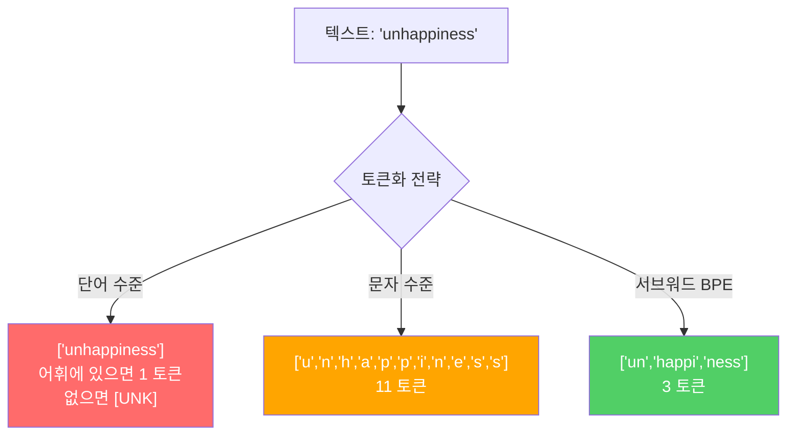
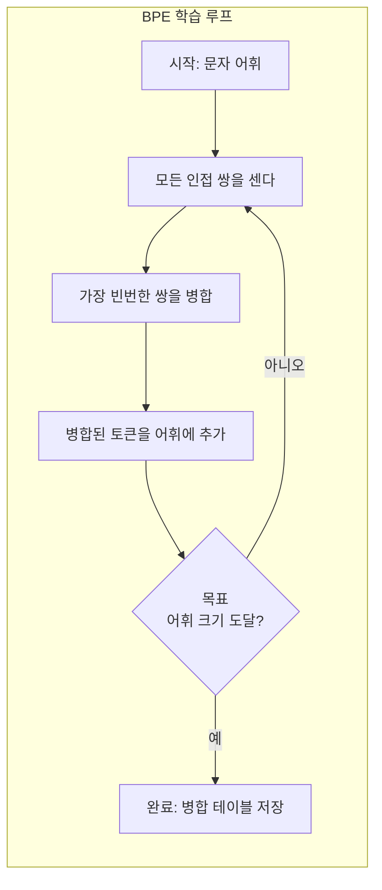
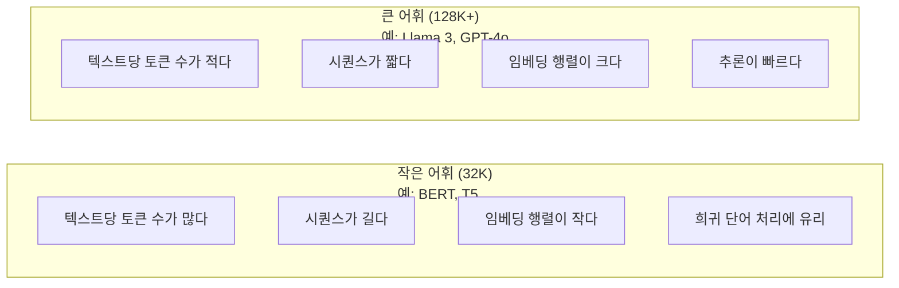

# 토크나이저: BPE, WordPiece, SentencePiece

> 🇰🇷 이 문서는 한국어 번역본입니다(ELI5 스타일). 원문: [en.md](en.md)

> 당신의 LLM은 영어를 읽지 않습니다. 정수를 읽을 뿐입니다. 토크나이저가 그 정수들이 의미를 담게 할지, 낭비하게 할지 결정합니다.

**유형:** Build
**언어:** Python
**선수 지식:** 페이즈 05 (NLP 기초)
**소요 시간:** 약 90분

## 학습 목표

- BPE, WordPiece, Unigram 토큰화 알고리즘을 처음부터 직접 구현하고 병합 전략을 비교하기
- 어휘 크기가 모델 효율에 미치는 영향 설명하기: 너무 작으면 시퀀스가 길어지고, 너무 크면 임베딩 파라미터가 낭비된다
- 언어와 코드에서 나타나는 토큰화 아티팩트를 분석하고, 특정 토크나이저가 어디서 무너지는지 찾아내기
- tiktoken과 sentencepiece 라이브러리로 텍스트를 토큰화하고 결과 토큰 ID를 들여다보기

## 문제 상황

당신의 LLM은 영어를 읽지 않습니다. 어떤 언어도 읽지 않습니다. 숫자를 읽을 뿐입니다.

"Hello, world!"와 [15496, 11, 995, 0] 사이의 간극이 바로 토크나이저입니다. 모든 단어, 모든 공백, 모든 구두점이 모델이 처리하기 전에 정수로 바뀌어야 합니다. 이 변환은 중립적이지 않습니다. 나중에 되돌릴 수 없는 가정을 모델에 구워 넣습니다.

이걸 잘못 만들면 모델은 흔한 단어를 여러 토큰으로 인코딩하면서 용량을 낭비합니다. "unfortunately"가 토큰 하나가 아니라 네 개가 됩니다. 다음절어가 많은 텍스트에서는 128K 컨텍스트 윈도우가 사실상 75%나 줄어든 셈입니다. 반대로 잘 만들면 같은 컨텍스트 윈도우가 두 배의 의미를 담습니다. "이 모델은 코드를 잘 다룬다"와 "이 모델은 Python에 질식한다"의 차이는 종종 토크나이저를 어떻게 학습시켰는지로 갈립니다.

GPT-4나 Claude로 보내는 모든 API 호출은 토큰 단위로 과금됩니다. 모델이 생성하는 모든 토큰은 컴퓨트 비용입니다. 출력을 표현하는 데 필요한 토큰이 적을수록 엔드투엔드 추론이 빨라집니다. 토큰화는 전처리가 아니라 아키텍처입니다.

## 핵심 개념

### 실패한 세 가지 방법 (그리고 승리한 하나)

텍스트를 숫자로 바꾸는 자명한 방법이 세 가지 있습니다. 그중 두 개는 큰 규모에서 통하지 않습니다.

**단어 수준 토큰화**는 공백과 구두점으로 자릅니다. "The cat sat"가 ["The", "cat", "sat"]이 됩니다. 단순하죠. 하지만 "tokenization"은요? "GPT-4o"는요? "Geschwindigkeitsbegrenzung" 같은 독일어 합성어는요? 단어 수준은 모든 언어의 모든 단어를 커버하려면 어휘가 어마어마해집니다. 단어를 하나 놓치면 그 유명한 `[UNK]` 토큰이 나옵니다 — 모델이 "이게 뭔지 전혀 모르겠다"고 말하는 방식이죠. 영어만 해도 백만 개가 넘는 단어형태가 있습니다. 코드, URL, 과학 표기법, 그리고 100개의 다른 언어를 더하면 무한한 어휘가 필요해집니다.

**문자 수준 토큰화**는 반대 방향으로 갑니다. "hello"가 ["h", "e", "l", "l", "o"]가 됩니다. 어휘는 아주 작고(몇백 개 문자) 미지 토큰도 절대 없습니다. 하지만 시퀀스가 극단적으로 길어집니다. 단어 수준으로 토큰 10개짜리 문장이 문자 수준에서는 50개가 됩니다. 모델은 "t", "h", "e"가 모이면 "the"라는 것을 배워야 합니다 — 인간이라면 세 살 때 배우는 것에 어텐션 용량을 태우는 셈이죠.

**서브워드 토큰화**가 스윗스팟을 찾아냅니다. 자주 쓰는 단어는 통째로 유지됩니다: "the"는 토큰 하나. 희귀 단어는 의미 있는 조각으로 분해됩니다: "unhappiness"가 ["un", "happi", "ness"]가 됩니다. 어휘는 관리 가능한 수준(30K~128K 토큰)을 유지하고, 시퀀스도 짧게 유지됩니다. 어떤 단어든 서브워드 조각으로 조립할 수 있으므로 미지 토큰은 사실상 사라집니다.

모든 현대 LLM이 서브워드 토큰화를 씁니다. GPT-2, GPT-4, BERT, Llama 3, Claude — 전부입니다. 남은 질문은 어떤 알고리즘이냐입니다.



### BPE: 바이트 페어 인코딩

BPE는 토큰화에 전용된 탐욕적(greedy) 압축 알고리즘입니다. 아이디어는 인덱스 카드 한 장에 담길 만큼 단순합니다.

개별 문자에서 시작합니다. 학습 말뭉치에서 인접한 모든 쌍을 셉니다. 가장 빈번한 쌍을 새 토큰으로 병합합니다. 목표 어휘 크기에 도달할 때까지 반복합니다.

```figure
tokenizer-bpe
```

"lower", "lowest", "newest"라는 단어로 이루어진 아주 작은 말뭉치에서 도는 BPE입니다:

```
말뭉치 (단어 빈도 포함):
  "lower"  x5
  "lowest" x2
  "newest" x6

단계 0 -- 문자에서 시작:
  l o w e r       (x5)
  l o w e s t     (x2)
  n e w e s t     (x6)

단계 1 -- 인접 쌍을 센다:
  (e,s): 8    (s,t): 8    (l,o): 7    (o,w): 7
  (w,e): 13   (e,r): 5    (n,e): 6    ...

단계 2 -- 가장 빈번한 쌍 (w,e) -> "we" 병합:
  l o we r        (x5)
  l o we s t      (x2)
  n e we s t      (x6)

단계 3 -- 다시 세고 (e,s) -> "es" 병합:
  l o we r        (x5)
  l o we s t      (x2)    <- 'es'는 'e'+'s'에서만 만들어지지 'we'+'s'에서는 안 만들어진다
  n e we s t      (x6)    <- 잠깐, 'we' 앞의 'e'와 'we' 뒤의 's'

정확히 추적해 보면:
  "we" 병합 후 남은 쌍:
  (l,o): 7   (o,we): 7   (we,r): 5   (we,s): 8
  (s,t): 8   (n,e): 6    (e,we): 6

단계 3 -- (we,s) -> "wes" 또는 (s,t) -> "st" 병합 (8으로 동률, 먼저 나온 것 선택):
  (we,s) -> "wes" 병합:
  l o we r        (x5)
  l o wes t       (x2)
  n e wes t       (x6)

단계 4 -- (wes,t) -> "west" 병합:
  l o we r        (x5)
  l o west        (x2)
  n e west        (x6)

...목표 어휘 크기에 도달할 때까지 계속한다.
```

병합 테이블이 곧 토크나이저입니다. 새 텍스트를 인코딩하려면 학습된 순서대로 병합을 적용합니다. 학습 말뭉치가 어떤 병합이 존재할지를 결정하고, 그 선택이 모델이 보게 될 것을 영구히 규정합니다.



### 바이트 수준 BPE (GPT-2, GPT-3, GPT-4)

표준 BPE는 유니코드 문자 위에서 동작합니다. 바이트 수준 BPE는 날것 바이트(0-255) 위에서 동작합니다. 이러면 기본 어휘가 정확히 256이 되고, 어떤 언어나 인코딩도 처리하며, 미지 토큰을 절대 만들지 않습니다.

GPT-2가 이 접근법을 도입했습니다. 기본 어휘는 가능한 모든 바이트를 커버하고, BPE 병합이 그 위에 쌓입니다. OpenAI의 tiktoken 라이브러리는 다음 어휘 크기로 바이트 수준 BPE를 구현합니다:

- GPT-2: 50,257 토큰
- GPT-3.5/GPT-4: 약 100,256 토큰 (cl100k_base 인코딩)
- GPT-4o: 200,019 토큰 (o200k_base 인코딩)

### WordPiece (BERT)

WordPiece는 BPE와 비슷해 보이지만 병합을 고르는 방식이 다릅니다. 날빈도 대신 학습 데이터의 우도(likelihood)를 최대화합니다:

```
BPE 병합 기준:      count(A, B)
WordPiece 병합 기준: count(AB) / (count(A) * count(B))
```

BPE는 "어떤 쌍이 가장 자주 나오나?"라고 묻습니다. WordPiece는 "어떤 쌍이 우연히 기대되는 것보다 더 자주 함께 나오나?"라고 묻습니다. 이 미묘한 차이가 다른 어휘를 만들어 냅니다. WordPiece는 단순히 빈번한 게 아니라 동시 출현이 놀라운 병합을 선호합니다.

WordPiece는 연속 서브워드에 "##" 접두사도 씁니다:

```
"unhappiness" -> ["un", "##happi", "##ness"]
"embedding"   -> ["em", "##bed", "##ding"]
```

"##" 접두사는 이 조각이 앞 토큰의 연속이라는 뜻입니다. BERT는 30,522 토큰 어휘로 WordPiece를 씁니다. 모든 BERT 변형이 그렇습니다 — DistilBERT, RoBERTa의 토크나이저는 사실 BPE지만, BERT 자체는 WordPiece입니다.

### SentencePiece (Llama, T5)

SentencePiece는 공백을 포함해 입력을 날것 유니코드 문자 스트림으로 취급합니다. 사전 토큰화(pre-tokenization) 단계가 없습니다. 단어 경계에 대한 언어별 규칙도 없습니다. 덕분에 진짜로 언어 중립적입니다 — 중국어, 일본어, 태국어처럼 공백이 단어를 나누지 않는 언어에서도 동작합니다.

SentencePiece는 두 알고리즘을 지원합니다:
- **BPE 모드**: 표준 BPE와 같은 병합 로직을 날것 문자 시퀀스에 적용
- **Unigram 모드**: 큰 어휘에서 시작해 전체 우도에 가장 덜 영향을 주는 토큰부터 반복적으로 제거합니다. BPE의 정반대 — 병합 대신 가지치기입니다.

Llama 2는 32,000 토큰 어휘의 SentencePiece BPE를 씁니다. T5는 32,000 토큰의 SentencePiece Unigram을 씁니다. 참고: Llama 3는 128,256 토큰의 tiktoken 기반 바이트 수준 BPE 토크나이저로 갈아탔습니다.

### 어휘 크기의 트레이드오프

측정 가능한 결과가 따라오는 진짜 엔지니어링 결정입니다.



구체적인 숫자로 보면. 4,096차원 임베딩에 128K 어휘를 쓰면 임베딩 행렬만 128,000 x 4,096 = 5억 2,400만 파라미터입니다. 32K 어휘면 1억 3,100만 파라미터입니다. 토크나이저 선택 하나로 4억 파라미터가 갈립니다.

하지만 큰 어휘는 텍스트를 더 공격적으로 압축합니다. 32K 어휘로 토큰 100개가 드는 영어 문단이 128K 어휘에서는 70토큰에 담길 수 있습니다. 생성 시 순전파 횟수가 30% 줄어든다는 뜻입니다. 수백만 건의 요청을 처리하는 모델이라면 컴퓨트 비용의 직접적인 절감입니다.

추세는 분명합니다: 어휘 크기는 커지고 있습니다. GPT-2는 50,257. GPT-4는 약 100K. Llama 3는 128K. GPT-4o는 200K.

| 모델 | 어휘 크기 | 토크나이저 유형 | 영어 단어당 평균 토큰 수 |
|-------|-----------|----------------|---------------------------|
| BERT | 30,522 | WordPiece | 약 1.4 |
| GPT-2 | 50,257 | 바이트 수준 BPE | 약 1.3 |
| Llama 2 | 32,000 | SentencePiece BPE | 약 1.4 |
| GPT-4 | 약 100,256 | 바이트 수준 BPE | 약 1.2 |
| Llama 3 | 128,256 | 바이트 수준 BPE (tiktoken) | 약 1.1 |
| GPT-4o | 200,019 | 바이트 수준 BPE | 약 1.0 |

### 다국어 세금

영어 위주로 학습된 토크나이저는 다른 언어에게 가혹합니다. GPT-2 토크나이저에서 한국어 텍스트는 단어당 평균 2~3토큰입니다. 중국어는 더 심할 수 있습니다. 한국어 사용자는 사실상 영어 사용자의 절반 크기 컨텍스트 윈도우를 갖는 셈입니다 — 더 적은 정보 밀도에 같은 값을 지불하면서요.

Llama 3가 어휘를 32K에서 128K로 네 배 늘린 이유가 바로 이것입니다. 비영어 문자 체계에 더 많은 토큰을 배정하면 언어 간 압축이 더 공평해집니다.

```figure
tokenizer-tradeoff
```

## 직접 만들기

### 단계 1: 문자 수준 토크나이저

기초부터 시작합니다. 문자 수준 토크나이저는 각 문자를 유니코드 코드 포인트로 대응시킵니다. 학습이 필요 없습니다. 미지 토큰도 없습니다. 그저 직접 대응일 뿐입니다.

```python
class CharTokenizer:
    def encode(self, text):
        return [ord(c) for c in text]

    def decode(self, tokens):
        return "".join(chr(t) for t in tokens)
```

"hello"는 [104, 101, 108, 108, 111]이 됩니다. 모든 문자가 각자의 토큰입니다. 우리가 개선해 나갈 베이스라인입니다.

### 단계 2: 처음부터 만드는 BPE 토크나이저

진짜 구현입니다. 날것 바이트로 학습하고(GPT-2처럼) 쌍을 세고, 가장 빈번한 것을 병합하고, 모든 병합을 순서대로 기록합니다. 병합 테이블이 곧 토크나이저입니다.

```python
from collections import Counter

class BPETokenizer:
    def __init__(self):
        self.merges = {}
        self.vocab = {}

    def _get_pairs(self, tokens):
        pairs = Counter()
        for i in range(len(tokens) - 1):
            pairs[(tokens[i], tokens[i + 1])] += 1
        return pairs

    def _merge_pair(self, tokens, pair, new_token):
        merged = []
        i = 0
        while i < len(tokens):
            if i < len(tokens) - 1 and tokens[i] == pair[0] and tokens[i + 1] == pair[1]:
                merged.append(new_token)
                i += 2
            else:
                merged.append(tokens[i])
                i += 1
        return merged

    def train(self, text, num_merges):
        tokens = list(text.encode("utf-8"))
        self.vocab = {i: bytes([i]) for i in range(256)}

        for i in range(num_merges):
            pairs = self._get_pairs(tokens)
            if not pairs:
                break
            best_pair = max(pairs, key=pairs.get)
            new_token = 256 + i
            tokens = self._merge_pair(tokens, best_pair, new_token)
            self.merges[best_pair] = new_token
            self.vocab[new_token] = self.vocab[best_pair[0]] + self.vocab[best_pair[1]]

        return self

    def encode(self, text):
        tokens = list(text.encode("utf-8"))
        for pair, new_token in self.merges.items():
            tokens = self._merge_pair(tokens, pair, new_token)
        return tokens

    def decode(self, tokens):
        byte_sequence = b"".join(self.vocab[t] for t in tokens)
        return byte_sequence.decode("utf-8", errors="replace")
```

학습 루프가 BPE의 핵심입니다: 쌍을 세고, 승자를 병합하고, 반복합니다. 병합 한 번마다 총 토큰 수가 줄어듭니다. `num_merges`번의 라운드 후 어휘는 256(기본 바이트)에서 256 + num_merges로 자랍니다.

인코딩은 병합이 학습된 정확한 순서대로 적용합니다. 이게 중요합니다. 병합 1번이 "th"를 만들고 병합 5번이 "the"를 만들었다면, 인코딩은 반드시 병합 1번을 먼저 적용해야 병합 5번에서 "th" + "e"로 "the"가 만들어질 수 있습니다.

디코딩은 그 역입니다: 어휘에서 각 토큰 ID를 찾아 바이트를 이어 붙이고 UTF-8로 디코딩합니다.

### 단계 3: 인코딩-디코딩 왕복

```python
corpus = (
    "The cat sat on the mat. The cat ate the rat. "
    "The dog sat on the log. The dog ate the frog. "
    "Natural language processing is the study of how computers "
    "understand and generate human language. "
    "Tokenization is the first step in any NLP pipeline."
)

tokenizer = BPETokenizer()
tokenizer.train(corpus, num_merges=40)

test_sentences = [
    "The cat sat on the mat.",
    "Natural language processing",
    "tokenization pipeline",
    "unhappiness",
]

for sentence in test_sentences:
    encoded = tokenizer.encode(sentence)
    decoded = tokenizer.decode(encoded)
    raw_bytes = len(sentence.encode("utf-8"))
    ratio = len(encoded) / raw_bytes
    print(f"'{sentence}'")
    print(f"  Tokens: {len(encoded)} (from {raw_bytes} bytes) -- ratio: {ratio:.2f}")
    print(f"  Roundtrip: {'PASS' if decoded == sentence else 'FAIL'}")
```

압축률이 토크나이저의 효율을 알려 줍니다. 0.50이라는 비율은 토크나이저가 텍스트를 날것 바이트의 절반 토큰 수로 압축했다는 뜻입니다. 낮을수록 좋습니다. 학습 말뭉치에서는 비율이 좋게 나옵니다. "unhappiness"(말뭉치에 없는 단어) 같은 분포 밖 텍스트에서는 비율이 나빠집니다 — 본 적 없는 패턴에는 문자 수준 인코딩으로 폴백(fallback)하기 때문입니다.

### 단계 4: tiktoken과 비교

```python
import tiktoken

enc = tiktoken.get_encoding("cl100k_base")

texts = [
    "The cat sat on the mat.",
    "unhappiness",
    "Hello, world!",
    "def fibonacci(n): return n if n < 2 else fibonacci(n-1) + fibonacci(n-2)",
    "Geschwindigkeitsbegrenzung",
]

for text in texts:
    our_tokens = tokenizer.encode(text)
    tiktoken_tokens = enc.encode(text)
    tiktoken_pieces = [enc.decode([t]) for t in tiktoken_tokens]
    print(f"'{text}'")
    print(f"  Our BPE:   {len(our_tokens)} tokens")
    print(f"  tiktoken:  {len(tiktoken_tokens)} tokens -> {tiktoken_pieces}")
```

tiktoken은 정확히 같은 알고리즘을 수백 기가바이트의 텍스트에 100,000번의 병합으로 학습한 것입니다. 알고리즘은 동일합니다. 다른 것은 학습 데이터와 병합 수입니다. 문단 하나에 40번 병합으로 학습한 당신의 토크나이저는 거대 말뭉치에 10만 병합을 쓰는 tiktoken과 경쟁할 수 없습니다. 하지만 메커니즘은 같습니다.

### 단계 5: 어휘 분석

```python
def analyze_vocabulary(tokenizer, test_texts):
    total_tokens = 0
    total_chars = 0
    token_usage = Counter()

    for text in test_texts:
        encoded = tokenizer.encode(text)
        total_tokens += len(encoded)
        total_chars += len(text)
        for t in encoded:
            token_usage[t] += 1

    print(f"Vocabulary size: {len(tokenizer.vocab)}")
    print(f"Total tokens across all texts: {total_tokens}")
    print(f"Total characters: {total_chars}")
    print(f"Avg tokens per character: {total_tokens / total_chars:.2f}")

    print(f"\nMost used tokens:")
    for token_id, count in token_usage.most_common(10):
        token_bytes = tokenizer.vocab[token_id]
        display = token_bytes.decode("utf-8", errors="replace")
        print(f"  Token {token_id:4d}: '{display}' (used {count} times)")

    unused = [t for t in tokenizer.vocab if t not in token_usage]
    print(f"\nUnused tokens: {len(unused)} out of {len(tokenizer.vocab)}")
```

어휘 안에서 지프(Zipf) 분포가 드러납니다. 몇몇 토큰이 대부분을 차지합니다(공백, "the", "e"). 나머지 토큰은 거의 안 쓰입니다. 프로덕션 토크나이저는 이 분포에 맞춰 최적화됩니다 — 흔한 패턴에는 짧은 토큰 ID를, 드문 패턴에는 더 긴 표현을 줍니다.

## 실전에서 활용하기

직접 만든 BPE가 동작합니다. 이제 프로덕션 도구들은 어떤 모습인지 보세요.

### tiktoken (OpenAI)

```python
import tiktoken

enc = tiktoken.get_encoding("cl100k_base")

text = "Tokenizers convert text to integers"
tokens = enc.encode(text)
print(f"Tokens: {tokens}")
print(f"Pieces: {[enc.decode([t]) for t in tokens]}")
print(f"Roundtrip: {enc.decode(tokens)}")
```

tiktoken은 Rust로 쓰이고 Python 바인딩을 제공합니다. 초당 수백만 토큰을 인코딩합니다. 같은 BPE 알고리즘의 산업용 구현입니다.

### Hugging Face tokenizers

```python
from tokenizers import Tokenizer
from tokenizers.models import BPE
from tokenizers.trainers import BpeTrainer
from tokenizers.pre_tokenizers import ByteLevel

tokenizer = Tokenizer(BPE())
tokenizer.pre_tokenizer = ByteLevel()

trainer = BpeTrainer(vocab_size=1000, special_tokens=["<pad>", "<eos>", "<unk>"])
tokenizer.train(["corpus.txt"], trainer)

output = tokenizer.encode("The cat sat on the mat.")
print(f"Tokens: {output.tokens}")
print(f"IDs: {output.ids}")
```

Hugging Face tokenizers 라이브러리도 내부는 Rust입니다. 기가바이트급 말뭉치를 몇 초 만에 BPE 학습시킵니다. 자기 모델을 학습시킬 때 쓰는 도구입니다.

### Llama 토크나이저 불러오기

```python
from transformers import AutoTokenizer

tokenizer = AutoTokenizer.from_pretrained("meta-llama/Llama-3.1-8B")

text = "Tokenizers are the unsung heroes of LLMs"
tokens = tokenizer.encode(text)
print(f"Token IDs: {tokens}")
print(f"Tokens: {tokenizer.convert_ids_to_tokens(tokens)}")
print(f"Vocab size: {tokenizer.vocab_size}")

multilingual = ["Hello world", "Hola mundo", "Bonjour le monde"]
for text in multilingual:
    ids = tokenizer.encode(text)
    print(f"'{text}' -> {len(ids)} tokens")
```

Llama 3의 128K 어휘는 GPT-2의 50K 어휘보다 비영어 텍스트를 훨씬 잘 압축합니다. 직접 확인할 수 있습니다 — 같은 문장을 여러 언어로 인코딩하고 토큰 수를 세 보세요.

## 출시하기

이 레슨은 `outputs/prompt-tokenizer-analyzer.md`를 산출합니다 — 임의의 텍스트와 모델 조합에 대한 토큰화 효율을 분석하는 재사용 가능한 프롬프트입니다. 텍스트 샘플을 넣으면 어떤 모델의 토크나이저가 그 텍스트를 가장 잘 다루는지 알려 줍니다.

## 연습 문제

1. BPE 토크나이저를 고쳐 병합 단계마다 어휘를 출력하게 만들어 보세요. "t" + "h"가 "th"가 되고, 이어서 "th" + "e"가 "the"가 되는 과정을 지켜 보세요. 흔한 영어 단어가 조각조각 조립되는 모습을 추적하세요.

2. BPE 토크나이저에 특수 토큰(`<pad>`, `<eos>`, `<unk>`)을 추가하세요. ID 0, 1, 2를 배정하고 나머지 토큰 ID를 그에 맞게 밀어 내세요. BPE를 돌리기 전에 공백으로 나누는 사전 토큰화 단계를 구현하세요.

3. WordPiece 병합 기준(빈도 대신 우도 비)을 구현하세요. 같은 말뭉치에 같은 병합 수로 BPE와 WordPiece를 각각 학습시키고, 결과 어휘를 비교하세요 — 어느 쪽이 언어학적으로 더 의미 있는 서브워드를 만드나요?

4. 다국어 토크나이저 효율 벤치마크를 만들어 보세요. 영어, 스페인어, 중국어, 한국어, 아랍어 문장을 각 10개씩 준비해 tiktoken(cl100k_base)으로 토큰화하고 문자당 평균 토큰 수를 측정하세요. 언어별 "다국어 세금"을 수치화하세요.

5. 더 큰 말뭉치(위키백과 문서 하나를 다운로드)로 BPE 토크나이저를 학습시키세요. 같은 텍스트에서 tiktoken과 10% 이내의 압축률 차이가 나도록 병합 수를 튜닝하세요. 이 과정은 말뭉치 크기, 병합 수, 압축 품질 사이의 관계를 이해하도록 만듭니다.

## 핵심 용어

| 용어 | 사람들이 말하는 것 | 실제 의미 |
|------|----------------|----------------------|
| 토큰 | "단어" | 모델 어휘의 단위 — 문자, 서브워드, 단어, 또는 여러 단어 덩어리일 수 있다 |
| BPE | "뭔가 압축하는 거" | Byte Pair Encoding — 목표 어휘 크기에 도달할 때까지 가장 빈번한 인접 토큰 쌍을 반복 병합 |
| WordPiece | "BERT 토크나이저" | BPE와 비슷하지만 날빈도 대신 우도 비 count(AB)/(count(A)*count(B))를 최대화하도록 병합 |
| SentencePiece | "토크나이저 라이브러리" | 사전 토큰화 없이 날것 유니코드 위에서 동작하는 언어 중립 토크나이저; BPE와 Unigram 알고리즘 지원 |
| 어휘 크기 | "아는 단어 수" | 고유 토큰의 총 개수: GPT-2는 50,257, BERT는 30,522, Llama 3는 128,256 |
| 다산성(Fertility) | "토크나이저 용어 아님" | 단어당 평균 토큰 수 — 언어별 토크나이저 효율을 측정 (1.0이 이상적, 3.0이면 모델이 세 배 더 고생) |
| 바이트 수준 BPE | "GPT 토크나이저" | 유니코드 문자가 아니라 날것 바이트(0-255) 위에서 도는 BPE; 어떤 입력에도 미지 토큰이 없음을 보장 |
| 병합 테이블 | "토크나이저 파일" | 학습 중 배운 쌍 병합의 순서 목록 — 이것이 곧 토크나이저이며 순서가 중요하다 |
| 사전 토큰화 | "공백으로 자르기" | 서브워드 토큰화 전에 적용하는 규칙: 공백 분리, 숫자 분리, 구두점 처리 |
| 압축률 | "토크나이저 효율" | 입력 바이트 수 대비 생성된 토큰 수 — 낮을수록 압축이 좋고 추론이 빠르다 |

## 더 읽을거리

- [Sennrich et al., 2016 -- "Neural Machine Translation of Rare Words with Subword Units"](https://arxiv.org/abs/1508.07909) -- NLP에 BPE를 도입해 1994년 압축 알고리즘을 현대 토큰화의 기초로 만든 논문
- [Kudo & Richardson, 2018 -- "SentencePiece: A simple and language independent subword tokenizer"](https://arxiv.org/abs/1808.06226) -- 다국어 모델을 실용적으로 만든 언어 중립 토큰화
- [OpenAI tiktoken repository](https://github.com/openai/tiktoken) -- GPT-3.5/4/4o가 쓰는, Python 바인딩을 갖춘 Rust 프로덕션 BPE 구현
- [Hugging Face Tokenizers documentation](https://huggingface.co/docs/tokenizers) -- Rust 성능으로 하는 프로덕션급 토크나이저 학습
