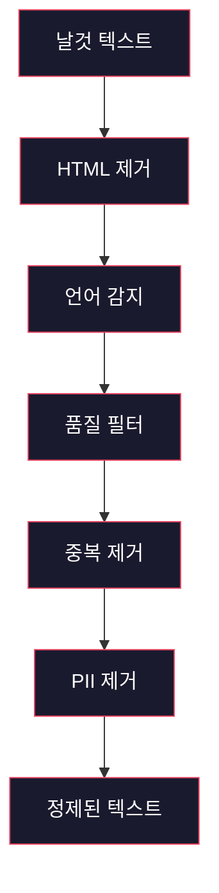
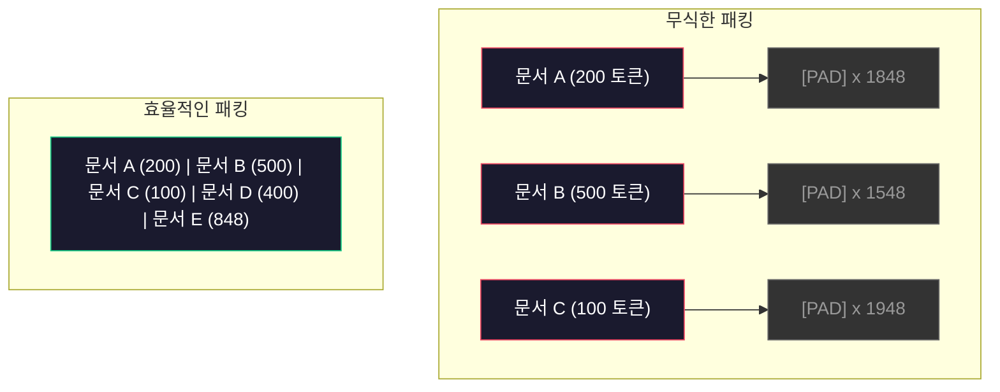

# 사전학습을 위한 데이터 파이프라인

> 🇰🇷 이 문서는 한국어 번역본입니다(ELI5 스타일). 원문: [en.md](en.md)

> 모델은 거울입니다. 무엇을 먹이든 그대로 비춥니다. 쓰레기를 먹이면, 완벽하게 유창한 쓰레기를 비춥니다.

**유형:** Build
**언어:** Python
**선수 지식:** 페이즈 10, 레슨 01-02 (토크나이저, 토크나이저 처음부터 만들기)
**소요 시간:** 약 90분

## 학습 목표

- 텍스트를 전부 메모리에 올리지 않고도 테라바이트급 텍스트를 토큰화, 청킹, 셔플, 배치 처리하는 스트리밍 데이터 파이프라인 만들기
- 실제 사전학습 파이프라인에서 쓰이는 데이터 품질 필터(중복 제거, 언어 감지, 콘텐츠 필터링) 구현하기
- 적절한 어텐션 마스크와 문서 경계 처리로 고정 길이 학습 시퀀스 만들기
- 파이프라인 처리량을 프로파일링해 데이터로더가 GPU 학습 속도를 따라잡는지 확인하기

## 문제 상황

토크나이저는 있습니다. 이제 데이터가 필요합니다.

데이터셋이 아닙니다. CSV 파일도 아닙니다. 테라바이트급 텍스트 — 정제되고, 중복이 제거되고, 품질로 걸러지고, 고정 길이 시퀀스로 토큰화되고, 8-GPU 클러스터가 다음 배치를 기다리는 일이 없을 만큼 빠르게 무작위 배치로 공급되는 텍스트 말입니다.

많은 사람이 LLM 학습을 모델 아키텍처 문제로 생각합니다. 아닙니다. Llama 3는 15.6조 토큰을 썼습니다. GPT-3는 3,000억 개. DeepSeek-V2는 8.1조 개. 셋의 아키텍처는 대략 같습니다: 어텐션과 피드포워드 층을 쌓은 트랜스포머 블록입니다. 출력 품질의 차이는 압도적으로 데이터에서 나옵니다.

DeepMind의 Chinchilla 논문이 이를 정확히 만들었습니다. 주어진 컴퓨트 예산에는 모델 파라미터 수와 학습 토큰 수 사이에 최적 비율이 있습니다. Chinchilla는 2022년의 대부분 모델이 극적으로 학습 부족(undertrained)이었음을 보였습니다 — 가진 데이터 양에 비해 파라미터가 너무 많았던 것이죠. 1.4조 토큰으로 학습한 70B 파라미터 모델(Chinchilla 최적)이 3,000억 토큰으로 학습한 280B 모델(Gopher)을 이겼습니다.

데이터 파이프라인이 당신 모델이 언어를 배울지, 노이즈를 배울지를 결정합니다.

## 핵심 개념

### 데이터는 어디서 오는가

모든 대규모 언어 모델은 여러 소스의 혼합물로 학습됩니다. 정확한 조성은 대부분의 연구소에서 극비이지만, 카테고리를 이해할 만큼은 알려져 있습니다.

| 소스 | 크기 | 품질 | 사용처 |
|--------|------|---------|---------|
| Common Crawl | 로우 데이터 약 250 TB | 낮음 (무거운 필터링 필요) | GPT-3, Llama, 대부분의 오픈 모델 |
| Wikipedia | 약 20 GB | 높음 | 모든 주요 LLM |
| GitHub 코드 | 1 TB 이상 | 중간 (중복과 죽은 코드가 많음) | StarCoder, CodeLlama, DeepSeek-Coder |
| 책 (BookCorpus, Pile) | 약 100 GB | 높음 | GPT-2, GPT-3, 초기 모델 |
| 학술 논문 (arXiv, S2ORC) | 약 100 GB | STEM 분야에서 높음 | Llama, Galactica |
| StackOverflow, Reddit | 약 100 GB | 중간 | Llama, Falcon |
| 큐레이션 웹 (C4, RefinedWeb) | 약 5 TB | 중상 (사전 필터링됨) | T5, Falcon |

Llama 3는 자신의 데이터 배합을 공개했습니다: 대략 웹 데이터 50%, 코드 25%, 책과 학술 논문 13%, 수학 데이터 8%, 다국어 웹 데이터 4%. 총 5TB가 넘는 로우 텍스트에서 나온 15.6조 토큰이었습니다.

총량만큼 비율도 중요합니다. 웹 데이터가 너무 많으면 모델이 앵무새가 됩니다. 코드가 너무 적으면 프로그래밍을 못 하고, 수학이 너무 적으면 추론에 실패합니다. 이 배합을 맞추는 일은 LLM 학습에서 가장 어려운 부분 중 하나이며, 공식은 없습니다 — 실험과 평가가 필요합니다.

### 데이터 정제

날것 웹 데이터는 더럽습니다. 전형적인 Common Crawl 덤프에는 다음이 들어 있습니다:

- HTML 태그와 JavaScript
- 상투적 머리글, 바닥글, 내비게이션 메뉴
- 중복 페이지 (완전 중복과 근사 중복)
- 기계가 만든 스팸
- 개인 식별 정보(PII)
- 저품질 텍스트 (키워드 나열, SEO 스팸)
- 텍스트로 인코딩된 비텍스트 콘텐츠

이걸 정제하는 건 선택 사항이 아닙니다. 일관된 문단을 생성하는 모델과 HTML 태그에 상품 목록이 섞인 출력을 내는 모델의 차이입니다.



각 단계는 한 부류의 노이즈를 제거합니다:

**HTML 제거:** 모든 마크업을 지웁니다. 화면에 보이는 텍스트 콘텐츠만 남깁니다. `trafilatura`나 `readability` 같은 라이브러리는 내비게이션, 광고, 상투적 텍스트를 버리면서 본문 콘텐츠를 추출합니다.

**언어 감지:** fastText의 언어 식별 모델(lid.176.bin)로 문서마다 분류합니다. 대상 언어로 필터링합니다. 0.8 미만의 신뢰도로 영어로 분류된 문서는 아마 깨끗한 영어가 아닐 겁니다.

**품질 필터링:** 여기서부터 재미있어집니다. RefinedWeb(Falcon 뒤에 있는 데이터셋)은 퍼플렉시티 기반 필터를 씁니다: 위키피디아로 작은 언어 모델을 학습시킨 뒤 문서마다 점수를 매기는 것입니다. 높은 퍼플렉시티는 그 문서가 위키피디아와 닮지 않았다는 뜻입니다 — 스팸이거나, 키워드 나열이거나, 기계 생성 콘텐츠일 가능성이 높죠. 임계값을 넘는 퍼플렉시티의 문서는 제거됩니다.

**중복 제거:** 단일 단계 중 가장 효과가 큰 정제 작업입니다. Common Crawl에는 방대한 양의 중복 페이지가 있습니다 — 법적 고지, 쿠키 안내, 서비스 약관. 중복으로 학습하면 컴퓨트가 낭비되고, 모델이 특정 문구를 그대로 외워 토해 내는 원인이 되기도 합니다.

**PII 제거:** 이름, 이메일 주소, 전화번호, 주민등록번호. 구조화된 PII는 정규식 기반 탐지로, 문맥 속 이름은 NER 모델로 처리합니다.

### MinHash로 중복 제거하기

완전 중복 제거는 쉽습니다: 문서마다 해시를 만들고 중복을 지우면 됩니다. 하지만 진짜 문제는 근사 중복입니다. 주변 광고만 살짝 다른 같은 뉴스 기사 두 벌은 근사 중복입니다. 내용은 95% 같은데 바이트 단위로는 다르죠.

MinHash + 지역 민감 해싱(Locality-Sensitive Hashing, LSH)이 이것을 효율적으로 풉니다.

```mermaid
graph LR
    A[문서] --> B[샤들링(Shingling)]
    B --> C[MinHash 시그니처]
    C --> D[LSH 버킷]
    D --> E[후보 쌍]
    E --> F[자카드 유사도]
    F --> G[중복 제거된 집합]

    style A fill:#1a1a2e,stroke:#e94560,color:#fff
    style B fill:#1a1a2e,stroke:#e94560,color:#fff
    style C fill:#1a1a2e,stroke:#e94560,color:#fff
    style D fill:#1a1a2e,stroke:#e94560,color:#fff
    style E fill:#1a1a2e,stroke:#e94560,color:#fff
    style F fill:#1a1a2e,stroke:#e94560,color:#fff
    style G fill:#1a1a2e,stroke:#e94560,color:#fff
```

아이디어는 이렇습니다:

1. **샤들링(Shingling):** 각 문서를 n-그램 집합으로 바꿉니다(예: 단어나 문자의 5-그램). "the quick brown fox"를 3단어 샤들로 만들면 {"the quick brown", "quick brown fox"}가 됩니다.

2. **MinHash:** 각 문서의 샤들 집합에 대해 k개의 해시 값을 계산합니다. 각 해시 값은 서로 다른 해시 함수 아래 모든 샤들 중 최솟값입니다. 이렇게 만든 고정 크기 "시그니처"는 두 문서 사이의 자카드(Jaccard) 유사도를 근사합니다.

3. **LSH:** MinHash 시그니처의 밴드(band)를 기준으로 문서를 버킷에 묶습니다. 같은 버킷에 든 문서들은 근사 중복 후보입니다. 모든 쌍을 비교하는 것을 피하고 후보만 비교합니다.

4. **검증:** 후보 쌍마다 정확한 자카드 유사도를 계산합니다. 유사도가 임계값(보통 0.8)을 넘으면 한 벌을 제거합니다.

Llama 팀은 중복 제거로 웹 데이터의 약 38%를 걸러 냈다고 밝혔습니다. 작은 숫자가 아닙니다. Common Crawl의 3분의 1 이상이 중복이거나 근사 중복 콘텐츠입니다.

### 시퀀스 패킹

모델은 고정 길이 입력 시퀀스를 기대합니다. 그런데 문서는 길이가 제각각입니다. 50토큰짜리도 있고 50,000토큰짜리도 있습니다.

무식한 방법: 모든 문서를 최대 시퀀스 길이로 패딩합니다. 학습에 아무 기여도 하지 않는 패딩 토큰에 엄청난 컴퓨트를 낭비합니다.

더 나은 방법: 여러 문서를 시퀀스 끝 토큰으로 구분해 하나의 시퀀스에 담습니다. 2048토큰 시퀀스 하나에 짧은 문서 셋이 [EOS] 토큰을 사이에 두고 이어져 있을 수 있습니다.



어텐션 마스크는 올바르게 설정해야 합니다. 패킹된 같은 시퀀스 안에서 문서 A의 토큰이 문서 B의 토큰을 어텐션하지 않도록 해야 합니다. 이를 위해 블록 대각선(block-diagonal) 어텐션 마스크가 필요합니다.

긴 문서는 잘리거나 시퀀스 경계에서 청크로 나뉩니다. 나누는 지점이 중요합니다: 문장 중간에서 자르면 모델이 불완전한 생각을 보게 됩니다. 일부 파이프라인은 가능하면 문단이나 문장 경계에 맞춰 나눕니다.

### Chinchilla 스케일링 법칙

고정된 컴퓨트 예산 C(FLOP 단위)에 대해 최적 모델 크기 N과 데이터셋 크기 D는 다음을 따릅니다:

```
N_opt ~ C^0.5
D_opt ~ C^0.5
```

실전에서는 모델 크기와 데이터셋 크기를 대략 같은 비율로 키워야 한다는 뜻입니다. 파라미터가 10배 많은 모델은 같은 손실에 도달하려면 대략 10배 많은 학습 토큰이 필요합니다.

| 모델 | 파라미터 | 학습 토큰 | Chinchilla 최적인가? |
|-------|-----------|----------------|-------------------|
| GPT-3 | 175B | 300B | 아니오 (3-4배 학습 부족) |
| Chinchilla | 70B | 1.4T | 예 (설계상) |
| Llama 2 | 70B | 2T | 과잉 학습 (의도적) |
| Llama 3 | 70B | 15T | 대폭 과잉 학습 |

Llama 3는 Chinchilla 법칙을 의도적으로 어겼습니다. Meta는 컴퓨트 최적 비율을 훨씬 넘는 더 많은 데이터로 과잉 학습하면 추론에 더 좋은 모델이 나온다는 것을 발견했습니다. 추가 학습 비용은 한 번 내면 되지만, 더 작은 모델은 영원히 더 싸게 운영됩니다. 이를 가끔 "추론 최적(inference-optimal)" 스케일링이라고 부르며, 2024년 이후 업계 표준이 되었습니다.

```figure
l5-data-pipeline
```

## 직접 만들기

### 단계 1: 텍스트 정제

HTML을 벗기고, 공백을 정규화하고, 비텍스트 콘텐츠를 제거합니다. 작은 말뭉치로 퍼블릭 도메인 텍스트(Project Gutenberg)를 씁니다.

```python
import re

def clean_text(text):
    text = re.sub(r"<[^>]+>", "", text)
    text = re.sub(r"http\S+", "", text)
    text = re.sub(r"[^\x20-\x7E\n]", "", text)
    text = re.sub(r"\n{3,}", "\n\n", text)
    text = re.sub(r" {2,}", " ", text)
    return text.strip()

def quality_filter(text, min_words=50, max_ratio_caps=0.3, max_ratio_special=0.1):
    words = text.split()
    if len(words) < min_words:
        return False
    caps_ratio = sum(1 for w in words if w.isupper()) / len(words)
    if caps_ratio > max_ratio_caps:
        return False
    special_chars = sum(1 for c in text if not c.isalnum() and not c.isspace())
    if special_chars / max(len(text), 1) > max_ratio_special:
        return False
    return True
```

품질 필터는 SEO 스팸(전부 대문자), 기계 생성 노이즈(특수 문자 비율 과다), 텅 빈 스텁 페이지(너무 짧음)를 잡아 냅니다. 이 세 가지 검사만으로도 웹 크롤 데이터에서 놀라울 만큼 많은 쓰레기가 걸러집니다.

### 단계 2: MinHash 중복 제거

MinHash를 처음부터 구현합니다. 외부 라이브러리가 필요 없습니다 — `hashlib`만 있으면 됩니다.

```python
import hashlib
from collections import defaultdict

def get_shingles(text, k=5):
    words = text.lower().split()
    if len(words) < k:
        return set()
    return {" ".join(words[i:i+k]) for i in range(len(words) - k + 1)}

def minhash_signature(shingles, num_hashes=128):
    signature = []
    for i in range(num_hashes):
        min_hash = float("inf")
        for shingle in shingles:
            h = int(hashlib.sha256(f"{i}:{shingle}".encode()).hexdigest(), 16)
            min_hash = min(min_hash, h)
        signature.append(min_hash)
    return signature

def lsh_buckets(signature, bands=16):
    rows_per_band = len(signature) // bands
    buckets = []
    for b in range(bands):
        start = b * rows_per_band
        band_data = tuple(signature[start:start + rows_per_band])
        bucket_hash = hashlib.md5(str(band_data).encode()).hexdigest()
        buckets.append((b, bucket_hash))
    return buckets

def deduplicate(documents, threshold=0.8, num_hashes=128, bands=16):
    signatures = []
    shingle_sets = []
    for doc in documents:
        shingles = get_shingles(doc)
        shingle_sets.append(shingles)
        signatures.append(minhash_signature(shingles, num_hashes))

    bucket_map = defaultdict(list)
    for doc_idx, sig in enumerate(signatures):
        for band_id, bucket_hash in lsh_buckets(sig, bands):
            bucket_map[(band_id, bucket_hash)].append(doc_idx)

    duplicate_pairs = set()
    for bucket_docs in bucket_map.values():
        if len(bucket_docs) < 2:
            continue
        for i in range(len(bucket_docs)):
            for j in range(i + 1, len(bucket_docs)):
                duplicate_pairs.add((bucket_docs[i], bucket_docs[j]))

    removed = set()
    for i, j in duplicate_pairs:
        if i in removed or j in removed:
            continue
        s1, s2 = shingle_sets[i], shingle_sets[j]
        if not s1 or not s2:
            continue
        jaccard = len(s1 & s2) / len(s1 | s2)
        if jaccard >= threshold:
            removed.add(j)

    return [doc for idx, doc in enumerate(documents) if idx not in removed], len(removed)
```

`num_hashes=128`과 `bands=16` 파라미터가 정밀도-재현율 트레이드오프를 조절합니다. 해시가 많을수록 유사도 추정이 정확해집니다. 밴드가 많을수록 재현율이 올라가고(더 많은 중복을 잡음) 거짓 양성도 늘어납니다. 이 값들은 전형적인 웹 텍스트에 잘 맞습니다.

### 단계 3: 토큰화하고 시퀀스 패킹하기

정제되고 중복 제거된 텍스트를 토큰화하고 학습용 고정 길이 시퀀스로 패킹합니다.

```python
def tokenize_corpus(documents, tokenizer):
    all_tokens = []
    for doc in documents:
        tokens = tokenizer.encode(doc)
        all_tokens.extend(tokens)
        all_tokens.append(tokenizer.eos_id)
    return all_tokens

def pack_sequences(token_ids, seq_length, pad_id=0):
    sequences = []
    attention_masks = []
    for i in range(0, len(token_ids), seq_length):
        seq = token_ids[i:i + seq_length]
        mask = [1] * len(seq)
        if len(seq) < seq_length:
            pad_count = seq_length - len(seq)
            seq = seq + [pad_id] * pad_count
            mask = mask + [0] * pad_count
        sequences.append(seq)
        attention_masks.append(mask)
    return sequences, attention_masks
```

### 단계 4: 학습용 DataLoader

패킹된 시퀀스의 무작위 배치를 공급합니다(yield). 학습 루프가 소비하는 것이 바로 이것입니다.

```python
import random

class PreTrainingDataLoader:
    def __init__(self, sequences, attention_masks, batch_size, shuffle=True):
        self.sequences = sequences
        self.attention_masks = attention_masks
        self.batch_size = batch_size
        self.shuffle = shuffle

    def __len__(self):
        return (len(self.sequences) + self.batch_size - 1) // self.batch_size

    def __iter__(self):
        indices = list(range(len(self.sequences)))
        if self.shuffle:
            random.shuffle(indices)
        for start in range(0, len(indices), self.batch_size):
            batch_idx = indices[start:start + self.batch_size]
            batch_seqs = [self.sequences[i] for i in batch_idx]
            batch_masks = [self.attention_masks[i] for i in batch_idx]
            yield batch_seqs, batch_masks
```

### 단계 5: 데이터셋 통계

중요한 숫자를 계산합니다: 총 토큰 수, 고유 토큰 수, 압축률, 문서 길이 분포.

```python
from collections import Counter

def compute_statistics(documents, token_ids, sequences, tokenizer_vocab_size):
    total_chars = sum(len(d) for d in documents)
    total_tokens = len(token_ids)
    unique_tokens = len(set(token_ids))
    compression_ratio = total_chars / total_tokens

    doc_lengths = [len(d.split()) for d in documents]
    avg_doc_length = sum(doc_lengths) / max(len(doc_lengths), 1)
    max_doc_length = max(doc_lengths) if doc_lengths else 0
    min_doc_length = min(doc_lengths) if doc_lengths else 0

    token_counts = Counter(token_ids)
    top_tokens = token_counts.most_common(10)

    non_pad_tokens = sum(sum(1 for t in seq if t != 0) for seq in sequences)
    total_positions = sum(len(seq) for seq in sequences)
    utilization = non_pad_tokens / max(total_positions, 1)

    stats = {
        "total_documents": len(documents),
        "total_characters": total_chars,
        "total_tokens": total_tokens,
        "unique_tokens": unique_tokens,
        "vocab_utilization": unique_tokens / tokenizer_vocab_size,
        "compression_ratio": compression_ratio,
        "avg_doc_length_words": avg_doc_length,
        "max_doc_length_words": max_doc_length,
        "min_doc_length_words": min_doc_length,
        "num_sequences": len(sequences),
        "sequence_utilization": utilization,
        "top_10_tokens": top_tokens,
    }
    return stats
```

압축률은 이 말뭉치에서 토크나이저가 얼마나 효율적인지 알려 줍니다. 영어 텍스트는 보통 토큰당 약 3~4자로 압축됩니다. 토큰당 1.5자가 나온다면 토크나이저가 너무 공격적으로 쪼개는 것이고, 8 이상이면 아주 도메인 특화적인 병합을 배운 것입니다.

시퀀스 활용률은 패킹된 시퀀스 중 실제 데이터가 차지하는 비율을 알려 줍니다. 90% 미만이면 패킹이 비효율적이라는 뜻입니다 — 패딩 토큰에 컴퓨트를 낭비하고 있는 겁니다.

## 실전에서 활용하기

### HuggingFace Datasets와 비교

같은 말뭉치를 HuggingFace의 datasets 라이브러리로 불러와 파이프라인 속도를 비교해 보세요.

```python
from datasets import load_dataset
from transformers import AutoTokenizer

ds = load_dataset("wikitext", "wikitext-2-raw-v1", split="train")
tokenizer = AutoTokenizer.from_pretrained("meta-llama/Meta-Llama-3-8B")

import time

start = time.time()
tokenized = ds.map(
    lambda x: tokenizer(x["text"], truncation=True, max_length=2048),
    batched=True,
    num_proc=4,
)
hf_time = time.time() - start
total_tokens = sum(len(t) for t in tokenized["input_ids"])
print(f"HuggingFace: {total_tokens:,} tokens in {hf_time:.2f}s ({total_tokens/hf_time:,.0f} tokens/sec)")
```

HuggingFace 파이프라인은 내부적으로 Rust 토크나이저를 쓰고 4코어에 걸쳐 병렬 처리합니다. 순수 Python 파이프라인은 10~50배 느릴 겁니다. 프로덕션 팀이 컴파일된 토크나이저를 쓰는 이유가 바로 이 격차입니다. 알고리즘은 같습니다. 구현 언어가 차이를 만듭니다.

## 출시하기

이 레슨은 LLM 학습 파이프라인의 데이터 품질을 검증하고 디버깅하기 위한 프롬프트를 산출합니다. `outputs/prompt-data-quality-checker.md`를 보세요.

## 연습 문제

1. **쉬움:** 간단한 휴리스틱(문자 집합 분석)으로 정제 파이프라인에 언어 감지를 추가하세요. 영어 문서만 남기고 몇 개의 문서가 제거되는지 측정하세요.
2. **보통:** MinHash 근사 중복 제거와 함께 SHA-256 해시를 이용한 완전 중복 제거를 구현하세요. 웹에서 긁어 온 말뭉치에서 각 방법이 잡아 낸 중복 수를 비교하세요.
3. **어려움:** 퍼플렉시티 기반 품질 필터를 만드세요. 위키피디아 텍스트로 작은 바이그램 언어 모델을 학습시키고, 문서마다 퍼플렉시티로 점수를 매겨 하위 20%를 제거하세요. 필터링한 데이터와 그렇지 않은 데이터로 학습했을 때 모델 출력 품질을 비교하세요.

## 핵심 용어

| 용어 | 사람들이 말하는 것 | 실제 의미 |
|------|----------------|----------------------|
| Common Crawl | "인터넷" | 매달 웹을 크롤링하는 비영리 단체 — 로우 데이터 약 250TB, 대부분 LLM 학습 데이터의 출발점 |
| MinHash | "뭔가 해싱 트릭" | 고정 크기 시그니처로 집합 간 자카드 유사도를 추정하는 기법 — 대규모 근사 중복 탐지를 가능하게 함 |
| LSH | "Locality-Sensitive Hashing" | 비슷한 항목을 같은 버킷에 모으는 방법 — 쌍별 비교를 O(n^2)에서 거의 선형으로 줄임 |
| 시퀀스 패킹 | "문서 이어 붙이기" | 적절한 어텐션 마스크와 함께 여러 문서를 고정 길이 시퀀스에 담기 — 패딩 낭비 제거 |
| Chinchilla 스케일링 | "데이터를 더 많이" | 고정 컴퓨트 예산에서 최적 성능을 내려면 모델 크기와 학습 토큰을 대략 같은 비율로 키워야 함 |
| 다산성(Fertility) | "단어당 토큰 수" | 단어당 평균 토큰 수 — GPT-4의 영어는 1.3, 비라틴 문자 체계는 더 높음 |
| 데이터 배합 | "학습 데이터 고르기" | 코드 vs 텍스트 vs 수학 vs 다국어 데이터의 비율 — 공식은 없고 실험이 필요 |
| 퍼플렉시티 필터 | "품질 점수 매기기" | 작은 언어 모델로 문서에 점수를 매김 — 높은 퍼플렉시티는 깨끗한 참조 데이터와 다른 텍스트라는 뜻 |
| 중복 제거 | "사본 지우기" | 완전 중복과 근사 중복 문서 제거 — 보통 날것 웹 데이터의 30-40%를 제거 |
| 어텐션 마스크 | "어떤 토큰을 볼지" | 패킹된 시퀀스에서 문서 경계를 넘는 어텐션을 막는 이진 마스크 |

## 더 읽을거리

- [Hoffmann et al., 2022 -- Training Compute-Optimal Large Language Models (Chinchilla)](https://arxiv.org/abs/2203.15556) -- 데이터 규모를 보는 우리의 생각을 바꾼 논문
- [Penedo et al., 2023 -- The RefinedWeb Dataset for Falcon LLM](https://arxiv.org/abs/2306.01116) -- Common Crawl을 고품질로 걸러 내는 방법
- [Touvron et al., 2023 -- Llama 2: Open Foundation and Fine-Tuned Chat Models](https://arxiv.org/abs/2307.09288) -- Llama 2의 데이터 파이프라인 세부 사항
- [Lee et al., 2022 -- Deduplicating Training Data Makes Language Models Better](https://arxiv.org/abs/2107.06499) -- 중복 제거가 생각보다 훨씬 중요한 이유
- [Broder, 1997 -- On the Resemblance and Containment of Documents](https://ieeexplore.ieee.org/document/666900) -- 원조 MinHash 논문
- [Meta, 2024 -- Llama 3 Technical Report](https://arxiv.org/abs/2407.21783) -- 15.6조 토큰, 데이터 배합 비율, 필터링 파이프라인
