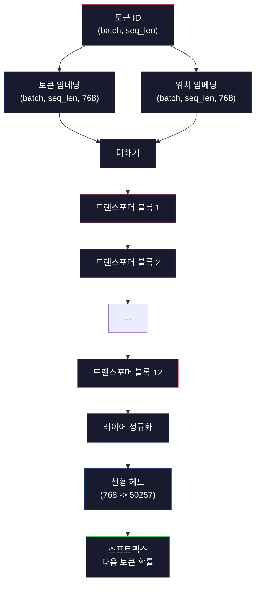
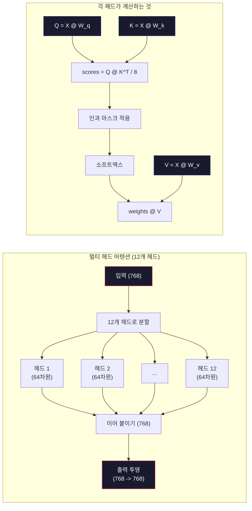
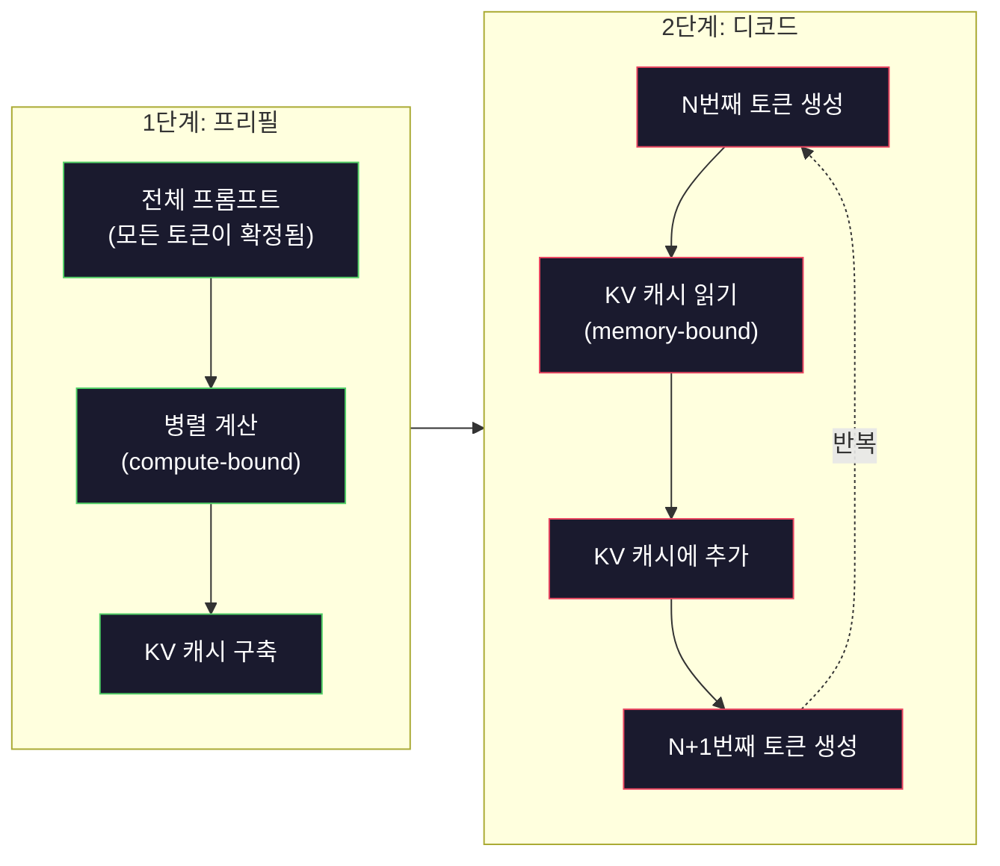

> 🇰🇷 이 문서는 한국어 번역본입니다(ELI5 스타일). 원문: [en.md](en.md)

# 미니 GPT 사전 학습하기(124M 파라미터)

> GPT-2 Small에는 1억 2,400만 개(124M)의 파라미터가 있습니다. 트랜스포머 레이어 12개, 어텐션 헤드 12개, 768차원 임베딩으로 이루어져 있죠. GPU 한 장으로 몇 시간이면 처음부터 학습시킬 수 있습니다. 그런데 대부분의 사람들은 한 번도 직접 해 보지 않습니다. 미리 학습된 체크포인트를 그냥 가져다 쓰죠. 하지만 직접 학습시켜 보지 않으면, 여러분이 그 위에 제품을 만들고 있는 그 모델 안에서 무슨 일이 일어나는지 사실상 이해하고 있다고 말할 수 없습니다.

**유형:** 빌드(Build)
**사용 언어:** Python(numpy 사용)
**선수 지식:** 페이즈 10, 레슨 01-03(토크나이저, 토크나이저 만들기, 데이터 파이프라인)
**시간:** 약 120분

## 학습 목표

- GPT-2 아키텍처 전체(1억 2,400만 파라미터)를 처음부터 직접 구현하기: 토큰 임베딩, 위치 임베딩, 트랜스포머 블록, 언어 모델 헤드
- 다음 토큰 예측(next-token prediction)과 교차 엔트로피 손실로 텍스트 말뭉치에서 GPT 모델 학습시키기
- 온도 샘플링(temperature sampling)과 top-k/top-p 필터링을 적용한 자기회귀(autoregressive) 텍스트 생성 구현하기
- 학습 손실 곡선을 관찰하면서 모델이 일관된 언어 패턴을 배우는지 검증하기

## 문제 상황

트랜스포머가 뭔지는 알고 있습니다. 다이어그램도 읽어 봤고요. "attention is all you need"를 암송할 수 있고, 화이트보드에 "Multi-Head Attention"이라고 적힌 상자를 그릴 수도 있습니다.

하지만 그 모든 것이, 모델이 텍스트를 생성할 때 내부에서 실제로 무슨 일이 일어나는지 이해하고 있다는 뜻은 아닙니다.

GPT-2 Small에는(웨이트 타이잉을 적용한 기준) 124,438,272개의 파라미터가 있습니다. 이 파라미터 하나하나는 학습 루프를 돌려서 정해진 값입니다: 순전파, 손실 계산, 역전파, 가중치 업데이트. 트랜스포머 블록 12개. 블록당 어텐션 헤드 12개. 768차원 임베딩 공간. 50,257개 토큰으로 이루어진 어휘 집합(vocabulary). 모델이 토큰 하나를 생성할 때마다 1억 2,400만 개의 파라미터 전부가, 토큰 ID 시퀀스를 받아 다음 토큰에 대한 확률 분포를 내놓는 하나의 행렬 곱셈 사슬에 참여합니다.

직접 만들어 본 적이 없다면, 여러분은 블랙박스를 다루고 있는 겁니다. API를 쓸 수 있고, 파인튜닝도 할 수 있습니다. 하지만 무언가 잘못됐을 때 — 모델이 환각을 일으킬 때, 같은 말을 반복할 때, 지시를 따르기를 거부할 때 — 그 이유(why)를 설명해 줄 멘탈 모델이 없는 겁니다.

이 레슨에서는 GPT-2 Small을 처음부터 만듭니다. PyTorch가 아니라 numpy로요. 행렬 곱셈 하나하나가 눈에 보이고, 그래디언트 하나하나가 여러분이 짠 코드로 계산됩니다. 1억 2,400만 개의 숫자가 어떻게 힘을 합쳐 다음 단어를 예측하는지 정확히 보게 될 겁니다.

## 개념

### GPT 아키텍처

GPT는 자기회귀(autoregressive) 언어 모델입니다. "자기회귀"라는 말은, 토큰을 한 번에 하나씩 만들어 내며 그때마다 앞에 나온 모든 토큰을 조건으로 삼는다는 뜻입니다. 아키텍처는 트랜스포머 디코더 블록을 여러 겹 쌓은 구조입니다.

토큰 ID에서 다음 토큰 확률까지의 전체 계산 그래프는 이렇습니다:

1. 토큰 ID가 들어옵니다. 크기: (batch_size, seq_len).
2. 토큰 임베딩 조회. 각 ID가 768차원 벡터에 대응합니다. 크기: (batch_size, seq_len, 768).
3. 위치 임베딩 조회. 각 위치(0, 1, 2, ...)가 768차원 벡터에 대응합니다. 크기는 같습니다.
4. 토큰 임베딩 + 위치 임베딩을 더합니다.
5. 12개의 트랜스포머 블록을 통과시킵니다.
6. 마지막 레이어 정규화.
7. 어휘 크기(vocab_size)로 선형 투영합니다. 크기: (batch_size, seq_len, vocab_size).
8. 소프트맥스로 확률을 만듭니다.

이게 모델의 전부입니다. 합성곱도 없고, 순환 구조도 없습니다. 임베딩, 어텐션, 피드포워드 네트워크, 레이어 정규화를 12겹 쌓은 것뿐입니다.



### 트랜스포머 블록

12개 블록은 모두 같은 패턴을 따릅니다. 사전 정규화(pre-norm) 아키텍처입니다(GPT-2는 원조 트랜스포머의 post-norm이 아니라 pre-norm을 씁니다):

1. LayerNorm(레이어 정규화)
2. 멀티 헤드 셀프 어텐션
3. 잔차 연결(residual connection, 입력을 다시 더함)
4. LayerNorm(레이어 정규화)
5. 피드포워드 네트워크(MLP)
6. 잔차 연결(입력을 다시 더함)

잔차 연결이 결정적입니다. 이게 없으면 역전파 도중 그래디언트가 1번 블록에 도달하기 전에 사라져 버립니다. 있으면 그래디언트가 "지름길(skip)" 경로를 통해 손실에서 어느 층으로든 바로 흘러갈 수 있습니다. 그래서 12개, 32개, 심지어 96개 블록을 쌓을 수 있는 겁니다(GPT-4는 120개를 쓴다는 소문이 있습니다).

### 어텐션: 핵심 메커니즘

셀프 어텐션은 모든 토큰이 앞의 모든 토큰을 들여다보고, 각 토큰에 얼마나 집중할지 스스로 정하게 해 줍니다. 수식은 이렇습니다.

각 토큰 위치마다 입력으로부터 세 개의 벡터를 계산합니다:
- **쿼리(Q, Query)**: "내가 찾고 있는 게 뭐지?"
- **키(K, Key)**: "나는 무엇을 담고 있지?"
- **값(V, Value)**: "나는 어떤 정보를 가지고 있지?"

```
Q = input @ W_q    (768 -> 768)
K = input @ W_k    (768 -> 768)
V = input @ W_v    (768 -> 768)

attention_scores = Q @ K^T / sqrt(d_k)
attention_scores = mask(attention_scores)   # 인과 마스크: 미래 위치는 -inf
attention_weights = softmax(attention_scores)
output = attention_weights @ V
```

인과 마스크(causal mask)가 GPT를 자기회귀로 만드는 장치입니다. 위치 5는 위치 0~5를 볼 수 있지만 6, 7, 8 등은 볼 수 없습니다. 덕분에 학습 중에 모델이 미래 토큰을 훔쳐보며 "부정행위"를 하는 것을 막을 수 있습니다.

**멀티 헤드 어텐션**은 768차원 공간을 64차원짜리 12개의 헤드로 쪼갭니다. 각 헤드는 서로 다른 어텐션 패턴을 학습합니다. 어떤 헤드는 통사적 관계(주어-동사 일치)를 추적하고, 어떤 헤드는 의미적 유사성(동의어)을, 또 어떤 헤드는 위치적 근접성(가까운 단어)을 추적할 수 있습니다. 12개 헤드의 출력을 모두 이어 붙인 뒤 다시 768차원으로 투영합니다.



sqrt(d_k), 즉 sqrt(64) = 8로 나누는 것은 스케일링입니다. 이게 없으면 고차원 벡터에서 내적 값이 너무 커져서, 소프트맥스가 그래디언트가 거의 0에 가까운 영역으로 밀려 들어갑니다. 원조 논문 "Attention Is All You Need"의 핵심 통찰 중 하나가 바로 이것입니다.

### KV 캐시: 추론이 빠른 이유

학습할 때는 시퀀스 전체를 한 번에 처리합니다. 추론할 때는 토큰을 한 번에 하나씩 생성합니다. 최적화가 없다면 N번째 토큰을 생성할 때마다 앞의 N-1개 토큰에 대한 어텐션을 다시 계산해야 합니다. 이러면 토큰 하나당 O(N^2), 길이 N 시퀀스 전체로는 O(N^3)이 듭니다.

KV 캐시가 이 문제를 해결합니다. 토큰마다 K와 V를 계산한 뒤 저장해 두는 겁니다. N+1번째 토큰을 생성할 때는 새 토큰의 Q만 계산하면 되고, 앞의 모든 토큰에 대한 K와 V는 캐시에서 꺼내 쓰면 됩니다. 덕분에 K, V 계산의 토큰당 비용이 O(N)에서 O(1)로 줄어듭니다. 어텐션 점수 계산은 모든 이전 위치를 참조해야 하므로 여전히 O(N)이지만, 입력에 대한 중복 행렬 곱셈은 피할 수 있습니다.

12개 레이어, 12개 헤드를 쓰는 GPT-2의 경우 KV 캐시는 토큰당 2(K + V) x 12레이어 x 12헤드 x 64차원 = 18,432개의 값을 저장합니다. 1,024토큰 시퀀스면 FP32 기준 약 75MB입니다. 128개 레이어를 쓰는 Llama 3 405B는 시퀀스 하나의 KV 캐시가 10GB를 넘을 수 있습니다. 긴 컨텍스트 추론이 메모리 병목인 이유가 바로 이것입니다.

### 프리필(Prefill) vs 디코드(Decode): 추론의 두 단계

LLM에 프롬프트를 보내면 추론은 서로 다른 두 단계로 진행됩니다.

**프리필(prefill)**은 프롬프트 전체를 병렬로 처리합니다. 모든 토큰이 이미 확정되어 있으므로, 모델은 모든 위치의 어텐션을 동시에 계산할 수 있습니다. 이 단계는 연산 병목(compute-bound)입니다 — GPU가 행렬 곱셈을 최대 처리량으로 돌리는 단계죠. A100에서 1,000토큰짜리 프롬프트의 프리필은 대략 20~50ms 걸립니다.

**디코드(decode)**는 토큰을 한 번에 하나씩 생성합니다. 새 토큰은 앞의 모든 토큰에 의존합니다. 이 단계는 메모리 병목(memory-bound)입니다 — 병목은 행렬 연산 자체가 아니라 GPU 메모리에서 모델 가중치와 KV 캐시를 읽어 오는 부분입니다. GPU의 연산 코어는 대부분 메모리 읽기를 기다리며 놀고 있죠. GPT-2의 경우 각 디코드 스텝은 행렬 곱셈에 필요한 FLOPs와 거의 무관하게 비슷한 시간이 걸립니다. 메모리 대역폭이 제약이기 때문입니다.

이 구분은 프로덕션(운영 환경) 시스템에서 중요합니다. 프리필 처리량은 GPU 연산 능력에 비례해 늘어나고(FLOPS가 높을수록 프리필이 빨라짐), 디코드 처리량은 메모리 대역폭에 비례합니다(메모리가 빠를수록 디코드가 빨라짐). NVIDIA의 H100이 A100 대비 메모리 대역폭 개선에 집중한 이유도 바로 이것입니다 — 토큰 생성 속도를 직접 끌어올리기 때문입니다.



### 학습 루프

LLM 학습은 곧 다음 토큰 예측입니다. 토큰 [0, 1, 2, ..., N-1]이 주어지면 토큰 [1, 2, 3, ..., N]을 맞히는 겁니다. 손실 함수는 모델이 예측한 확률 분포와 실제 다음 토큰 사이의 교차 엔트로피입니다.

학습 스텝 하나:

1. **순전파**: 배치를 12개 블록 모두에 통과시킵니다. 각 위치의 로짓(softmax 직전 점수)을 얻습니다.
2. **손실 계산**: 로짓과 타깃 토큰(입력을 한 칸 밀어 놓은 것) 사이의 교차 엔트로피를 계산합니다.
3. **역전파**: 역전파로 1억 2,400만 개 파라미터 전부의 그래디언트를 계산합니다.
4. **옵티마이저 스텝**: 가중치를 갱신합니다. GPT-2는 학습률 워밍업과 코사인 감쇠를 곁들인 Adam을 사용합니다.

학습률 스케줄이 생각보다 훨씬 중요합니다. GPT-2는 처음 2,000 스텝 동안 학습률을 0에서 최댓값까지 끌어올린(워밍업) 뒤, 코사인 곡선을 따라 낮춥니다. 처음부터 학습률이 높으면 모델이 발산해 버립니다. 끝까지 높은 학습률을 유지하면 학습 후반에 손실이 진동합니다. "워밍업 후 감쇠" 패턴은 모든 주요 LLM이 쓰는 방식입니다.

### GPT-2 Small: 숫자로 보기

| 구성 요소 | 크기 | 파라미터 수 |
|-----------|-------|------------|
| 토큰 임베딩 | (50257, 768) | 38,597,376 |
| 위치 임베딩 | (1024, 768) | 786,432 |
| 블록당 어텐션 (W_q, W_k, W_v, W_out) | 4 x (768, 768) | 2,359,296 |
| 블록당 FFN (확장 + 축소) | (768, 3072) + (3072, 768) | 4,718,592 |
| 블록당 LayerNorm (2개) | 2 x 768 x 2 | 3,072 |
| 최종 LayerNorm | 768 x 2 | 1,536 |
| **블록당 합계** | | **7,080,960** |
| **전체 합계 (12블록)** | | **85,054,464 + 39,383,808 = 124,438,272** |

출력 투영(로짓 헤드)은 토큰 임베딩 행렬과 가중치를 공유합니다. 이를 웨이트 타이잉(weight tying)이라고 부릅니다 — 파라미터 수를 3,800만 개 줄여 주고, 입력과 출력에 같은 표현 공간을 쓰도록 강제하기 때문에 성능도 좋아집니다.

## 만들어 보기

### 단계 1: 임베딩 레이어

토큰 임베딩은 50,257개 토큰 각각을 768차원 벡터에 대응시킵니다. 위치 임베딩은 각 토큰이 시퀀스에서 어디에 놓였는지에 대한 정보를 더해 줍니다. 둘을 합합니다.

```python
import numpy as np

class Embedding:
    def __init__(self, vocab_size, embed_dim, max_seq_len):
        self.token_embed = np.random.randn(vocab_size, embed_dim) * 0.02
        self.pos_embed = np.random.randn(max_seq_len, embed_dim) * 0.02

    def forward(self, token_ids):
        seq_len = token_ids.shape[-1]
        tok_emb = self.token_embed[token_ids]
        pos_emb = self.pos_embed[:seq_len]
        return tok_emb + pos_emb
```

초기화에 쓰는 표준편차 0.02는 GPT-2 논문에서 온 값입니다. 너무 크면 초기 순전파가 극단적인 값을 내놓아 학습이 불안정해지고, 너무 작으면 초기 출력이 입력과 거의 무관하게 비슷비슷해져서 초기 그래디언트 신호가 쓸모없어집니다.

### 단계 2: 인과 마스크가 있는 셀프 어텐션

먼저 단일 헤드 어텐션부터. 인과 마스크는 소프트맥스 전에 미래 위치를 음의 무한대로 만들어, 각 위치가 자기 자신과 그 이전 위치만 볼 수 있도록 보장합니다.

```python
def attention(Q, K, V, mask=None):
    d_k = Q.shape[-1]
    scores = Q @ K.transpose(0, -1, -2 if Q.ndim == 4 else 1) / np.sqrt(d_k)
    if mask is not None:
        scores = scores + mask
    weights = np.exp(scores - scores.max(axis=-1, keepdims=True))
    weights = weights / weights.sum(axis=-1, keepdims=True)
    return weights @ V
```

이 소프트맥스 구현은 지수 함수를 적용하기 전에 최댓값을 빼 줍니다. 이게 없으면 exp(큰 수)가 무한대로 넘쳐 버립니다. 임의의 상수 c에 대해 softmax(x - c) = softmax(x)가 성립하므로 출력은 그대로인, 수치 안정성 트릭입니다.

### 단계 3: 멀티 헤드 어텐션

768차원 입력을 64차원짜리 12개 헤드로 쪼갭니다. 각 헤드는 독립적으로 어텐션을 계산합니다. 결과를 이어 붙이고 다시 768차원으로 투영합니다.

```python
class MultiHeadAttention:
    def __init__(self, embed_dim, num_heads):
        self.num_heads = num_heads
        self.head_dim = embed_dim // num_heads
        self.W_q = np.random.randn(embed_dim, embed_dim) * 0.02
        self.W_k = np.random.randn(embed_dim, embed_dim) * 0.02
        self.W_v = np.random.randn(embed_dim, embed_dim) * 0.02
        self.W_out = np.random.randn(embed_dim, embed_dim) * 0.02

    def forward(self, x, mask=None):
        batch, seq_len, d = x.shape
        Q = (x @ self.W_q).reshape(batch, seq_len, self.num_heads, self.head_dim).transpose(0, 2, 1, 3)
        K = (x @ self.W_k).reshape(batch, seq_len, self.num_heads, self.head_dim).transpose(0, 2, 1, 3)
        V = (x @ self.W_v).reshape(batch, seq_len, self.num_heads, self.head_dim).transpose(0, 2, 1, 3)

        scores = Q @ K.transpose(0, 1, 3, 2) / np.sqrt(self.head_dim)
        if mask is not None:
            scores = scores + mask
        weights = np.exp(scores - scores.max(axis=-1, keepdims=True))
        weights = weights / weights.sum(axis=-1, keepdims=True)
        attn_out = weights @ V

        attn_out = attn_out.transpose(0, 2, 1, 3).reshape(batch, seq_len, d)
        return attn_out @ self.W_out
```

reshape-transpose-reshape 연쇄가 멀티 헤드 어텐션에서 가장 헷갈리는 부분입니다. 실제로 일어나는 일은 이렇습니다: (batch, seq_len, 768) 텐서가 (batch, seq_len, 12, 64)가 되고, 다시 (batch, 12, seq_len, 64)가 됩니다. 이제 12개 헤드 각각이 자기만의 (seq_len, 64) 행렬을 가지고 어텐션을 돌립니다. 어텐션 후에는 과정을 거꾸로 돌립니다: (batch, 12, seq_len, 64)가 (batch, seq_len, 12, 64)로, 다시 (batch, seq_len, 768)으로 변합니다.

### 단계 4: 트랜스포머 블록

완전한 트랜스포머 블록 하나: LayerNorm, 잔차 연결이 있는 멀티 헤드 어텐션, LayerNorm, 잔차 연결이 있는 피드포워드.

```python
class LayerNorm:
    def __init__(self, dim, eps=1e-5):
        self.gamma = np.ones(dim)
        self.beta = np.zeros(dim)
        self.eps = eps

    def forward(self, x):
        mean = x.mean(axis=-1, keepdims=True)
        var = x.var(axis=-1, keepdims=True)
        return self.gamma * (x - mean) / np.sqrt(var + self.eps) + self.beta


class FeedForward:
    def __init__(self, embed_dim, ff_dim):
        self.W1 = np.random.randn(embed_dim, ff_dim) * 0.02
        self.b1 = np.zeros(ff_dim)
        self.W2 = np.random.randn(ff_dim, embed_dim) * 0.02
        self.b2 = np.zeros(embed_dim)

    def forward(self, x):
        h = x @ self.W1 + self.b1
        h = np.maximum(0, h)  # GELU 근사: 간단함을 위해 ReLU 사용
        return h @ self.W2 + self.b2


class TransformerBlock:
    def __init__(self, embed_dim, num_heads, ff_dim):
        self.ln1 = LayerNorm(embed_dim)
        self.attn = MultiHeadAttention(embed_dim, num_heads)
        self.ln2 = LayerNorm(embed_dim)
        self.ffn = FeedForward(embed_dim, ff_dim)

    def forward(self, x, mask=None):
        x = x + self.attn.forward(self.ln1.forward(x), mask)
        x = x + self.ffn.forward(self.ln2.forward(x))
        return x
```

피드포워드 네트워크는 768차원 입력을 3,072차원(4배)으로 확장한 뒤 비선형성을 적용하고, 다시 768로 되돌립니다. 이 확장-수축 패턴 덕분에 모델은 각 위치에서 더 "넓은" 내부 표현을 활용할 수 있습니다. GPT-2는 GELU 활성화 함수를 쓰지만, 여기서는 이해를 돕기 위해 간단히 ReLU를 씁니다 — 아키텍처를 이해하는 데는 차이가 미미합니다.

### 단계 5: 전체 GPT 모델

트랜스포머 블록 12개를 쌓습니다. 앞에는 임베딩 레이어를, 뒤에는 출력 투영을 붙입니다.

```python
class MiniGPT:
    def __init__(self, vocab_size=50257, embed_dim=768, num_heads=12,
                 num_layers=12, max_seq_len=1024, ff_dim=3072):
        self.embedding = Embedding(vocab_size, embed_dim, max_seq_len)
        self.blocks = [
            TransformerBlock(embed_dim, num_heads, ff_dim)
            for _ in range(num_layers)
        ]
        self.ln_f = LayerNorm(embed_dim)
        self.vocab_size = vocab_size
        self.embed_dim = embed_dim

    def forward(self, token_ids):
        seq_len = token_ids.shape[-1]
        mask = np.triu(np.full((seq_len, seq_len), -1e9), k=1)

        x = self.embedding.forward(token_ids)
        for block in self.blocks:
            x = block.forward(x, mask)
        x = self.ln_f.forward(x)

        logits = x @ self.embedding.token_embed.T
        return logits

    def count_parameters(self):
        total = 0
        total += self.embedding.token_embed.size
        total += self.embedding.pos_embed.size
        for block in self.blocks:
            total += block.attn.W_q.size + block.attn.W_k.size
            total += block.attn.W_v.size + block.attn.W_out.size
            total += block.ffn.W1.size + block.ffn.b1.size
            total += block.ffn.W2.size + block.ffn.b2.size
            total += block.ln1.gamma.size + block.ln1.beta.size
            total += block.ln2.gamma.size + block.ln2.beta.size
        total += self.ln_f.gamma.size + self.ln_f.beta.size
        return total
```

웨이트 타이잉에 주목하세요: `logits = x @ self.embedding.token_embed.T`. 출력 투영이 (전치된) 토큰 임베딩 행렬을 재사용합니다. 이건 단순히 파라미터를 아끼는 트릭이 아닙니다. 모델이 토큰을 이해할 때(임베딩)와 토큰을 예측할 때(출력) 같은 벡터 공간을 쓴다는 뜻입니다.

### 단계 6: 학습 루프

1억 2,400만 파라미터를 실제로 학습시키려면 GPU와 PyTorch가 필요합니다. 이 학습 루프는 순수 numpy로 돌아가는 작은 모델로 그 원리를 보여 줍니다. 다룰 수 있도록 아주 작은 모델(4 레이어, 4 헤드, 128차원)을 씁니다.

```python
def cross_entropy_loss(logits, targets):
    batch, seq_len, vocab_size = logits.shape
    logits_flat = logits.reshape(-1, vocab_size)
    targets_flat = targets.reshape(-1)

    max_logits = logits_flat.max(axis=-1, keepdims=True)
    log_softmax = logits_flat - max_logits - np.log(
        np.exp(logits_flat - max_logits).sum(axis=-1, keepdims=True)
    )

    loss = -log_softmax[np.arange(len(targets_flat)), targets_flat].mean()
    return loss


def train_mini_gpt(text, vocab_size=256, embed_dim=128, num_heads=4,
                   num_layers=4, seq_len=64, num_steps=200, lr=3e-4):
    tokens = np.array(list(text.encode("utf-8")[:2048]))
    model = MiniGPT(
        vocab_size=vocab_size, embed_dim=embed_dim, num_heads=num_heads,
        num_layers=num_layers, max_seq_len=seq_len, ff_dim=embed_dim * 4
    )

    print(f"Model parameters: {model.count_parameters():,}")
    print(f"Training tokens: {len(tokens):,}")
    print(f"Config: {num_layers} layers, {num_heads} heads, {embed_dim} dims")
    print()

    for step in range(num_steps):
        start_idx = np.random.randint(0, max(1, len(tokens) - seq_len - 1))
        batch_tokens = tokens[start_idx:start_idx + seq_len + 1]

        input_ids = batch_tokens[:-1].reshape(1, -1)
        target_ids = batch_tokens[1:].reshape(1, -1)

        logits = model.forward(input_ids)
        loss = cross_entropy_loss(logits, target_ids)

        if step % 20 == 0:
            print(f"Step {step:4d} | Loss: {loss:.4f}")

    return model
```

손실은 ln(vocab_size) 근처에서 시작됩니다. 256개 토큰짜리 바이트 수준 어휘라면 ln(256) = 5.55죠. 무작위 모델은 모든 토큰에 똑같은 확률을 줍니다. 학습이 진행되면 모델이 흔한 패턴을 예측하는 법을 배우면서 손실이 떨어집니다: "t" 뒤에 오는 "h", 마침표 뒤의 공백 같은 것들이요.

프로덕션(운영 환경)에서는 그래디언트 누적, 학습률 워밍업, 그래디언트 클리핑을 곁들인 Adam 옵티마이저를 씁니다. 순전파-손실-역전파-갱신 루프 자체는 동일합니다. 옵티마이저만 더 정교할 뿐입니다.

### 단계 7: 텍스트 생성

생성은 학습된 모델로 토큰을 한 번에 하나씩 예측합니다. 각 예측은 출력 분포에서 샘플링하거나, argmax를 그리디하게 고르기도 합니다.

```python
def generate(model, prompt_tokens, max_new_tokens=100, temperature=0.8):
    tokens = list(prompt_tokens)
    seq_len = model.embedding.pos_embed.shape[0]

    for _ in range(max_new_tokens):
        context = np.array(tokens[-seq_len:]).reshape(1, -1)
        logits = model.forward(context)
        next_logits = logits[0, -1, :]

        next_logits = next_logits / temperature
        probs = np.exp(next_logits - next_logits.max())
        probs = probs / probs.sum()

        next_token = np.random.choice(len(probs), p=probs)
        tokens.append(next_token)

    return tokens
```

온도(temperature)는 무작위성을 조절합니다. 온도 1.0은 원래 분포를 그대로 씁니다. 온도 0.5는 분포를 뾰족하게 만듭니다(더 결정론적 — 모델이 최상위 후보를 더 자주 고릅니다). 온도 1.5는 분포를 평평하게 만듭니다(더 무작위 — 확률 낮은 토큰도 더 큰 기회를 얻습니다). 온도 0.0은 그리디 디코딩입니다(항상 확률이 가장 높은 토큰을 고름).

`tokens[-seq_len:]` 윈도우가 필요한 이유는 모델에 최대 컨텍스트 길이가 있기 때문입니다(GPT-2는 1024). 한도를 넘으면 가장 오래된 토큰을 버려야 하죠. 모두가 입에 담는 "컨텍스트 윈도우"가 바로 이것입니다.

```figure
sampling-decoder
```

## 활용해 보기

### 전체 학습 및 생성 데모

```python
corpus = """The transformer architecture has revolutionized natural language processing.
Attention mechanisms allow the model to focus on relevant parts of the input.
Self-attention computes relationships between all pairs of positions in a sequence.
Multi-head attention splits the representation into multiple subspaces.
Each attention head can learn different types of relationships.
The feedforward network provides nonlinear transformations at each position.
Residual connections enable gradient flow through deep networks.
Layer normalization stabilizes training by normalizing activations.
Position embeddings give the model information about token ordering.
The causal mask ensures autoregressive generation during training.
Pre-training on large text corpora teaches the model general language understanding.
Fine-tuning adapts the pre-trained model to specific downstream tasks."""

model = train_mini_gpt(corpus, num_steps=200)

prompt = list("The transformer".encode("utf-8"))
output_tokens = generate(model, prompt, max_new_tokens=100, temperature=0.8)
generated_text = bytes(output_tokens).decode("utf-8", errors="replace")
print(f"\nGenerated: {generated_text}")
```

작은 말뭉치에 작은 모델이면, 생성되는 텍스트는 기껏해야 반쯤 말이 됩니다. 학습 텍스트에서 몇 가지 바이트 수준 패턴은 배우지만, 40GB의 학습 데이터와 완전한 1억 2,400만 파라미터 아키텍처를 쓰는 GPT-2처럼 일반화하지는 못합니다. 요점은 출력 품질이 아닙니다. 요점은 모든 단계를 추적할 수 있다는 겁니다: 임베딩 조회, 어텐션 계산, 피드포워드 변환, 로짓 투영, 소프트맥스, 샘플링. 모든 연산이 눈에 보입니다.

## 출시하기

이 레슨은 `outputs/prompt-gpt-architecture-analyzer.md`를 산출물로 남깁니다 — GPT 계열 모델의 아키텍처 선택을 분석하는 프롬프트입니다. 모델 카드나 기술 보고서를 넣어 주면 파라미터 배분, 어텐션 설계, 스케일링 결정을 하나씩 뜯어 보여 줍니다.

## 연습 문제

1. 모델을 12/12 대신 24 레이어, 16 헤드로 바꿔 보세요. 파라미터 수를 세어 보고, 깊이를 두 배로 하는 것과 너비(임베딩 차원)를 두 배로 하는 것은 어떻게 다른지 비교해 보세요.

2. GELU 활성화 함수(GELU(x) = x * 0.5 * (1 + erf(x / sqrt(2))))를 구현하고 피드포워드 네트워크의 ReLU를 바꿔 보세요. 각 활성화 함수로 500 스텝씩 학습을 돌리고 최종 손실을 비교해 보세요.

3. 생성 함수에 KV 캐시를 추가해 보세요. 첫 순전파 후 각 레이어의 K, V 텐서를 저장해 두고, 이후 토큰에는 재사용합니다. 속도 향상을 측정해 보세요: 캐시를 쓸 때와 안 쓸 때 각각 200개 토큰을 생성해 실제 걸린 시간을 비교합니다.

4. top-k 샘플링(확률 상위 k개 토큰만 고려)과 top-p 샘플링(누클리어스 샘플링: 누적 확률이 p를 넘는 가장 작은 토큰 집합만 고려)을 구현해 보세요. 온도 0.8에서 top-k=50과 top-p=0.95의 출력 품질을 비교해 보세요.

5. 학습 손실 곡선 플로터를 만들어 보세요. 모델을 1,000 스텝 학습시키고 손실-스텝 그래프를 그립니다. 세 가지 국면을 찾아 보세요: 급격한 초기 하강(흔한 바이트 학습), 더딘 중반부(바이트 패턴 학습), 정체 구간(작은 말뭉치에 과적합). 128차원 모델을 학습시키든 GPT-4를 학습시키든 이 곡선의 모양은 같습니다.

## 핵심 용어

| 용어 | 사람들이 말하는 방식 | 실제 의미 |
|------|----------------|----------------------|
| Autoregressive(자기회귀) | "한 번에 한 단어씩 생성한다" | 각 출력 토큰이 앞의 모든 토큰을 조건으로 삼는 것 — 모델은 P(token_n \| token_0, ..., token_{n-1})을 예측합니다 |
| Causal mask(인과 마스크) | "미래를 볼 수 없다" | 학습 중 미래 위치에 대한 어텐션을 막는, -inf 값으로 채워진 상삼각 행렬 |
| Multi-head attention(멀티 헤드 어텐션) | "여러 어텐션 패턴" | Q, K, V를 병렬 헤드로 나누는 것(예: GPT-2는 64차원 헤드 12개) — 각 헤드가 서로 다른 관계 유형을 학습할 수 있음 |
| KV Cache(KV 캐시) | "속도를 위한 캐싱" | 자기회귀 생성 중 중복 계산을 피하려고 이전 토큰의 Key, Value 텐서를 저장해 두는 것 |
| Prefill(프리필) | "프롬프트 처리" | 프롬프트 토큰 전체를 병렬로 처리하는 첫 번째 추론 단계 — GPU FLOPS 기준 연산 병목(compute-bound) |
| Decode(디코드) | "토큰 생성" | 토큰을 한 번에 하나씩 생성하는 두 번째 추론 단계 — GPU 메모리 대역폭 기준 메모리 병목(memory-bound) |
| Weight tying(웨이트 타이잉) | "임베딩 공유" | 입력 토큰 임베딩과 출력 투영 헤드에 같은 행렬을 쓰는 것 — GPT-2에서는 3,800만 파라미터 절약 |
| Residual connection(잔차 연결) | "스킵 연결(skip connection)" | 서브레이어 출력에 입력을 바로 더하는 것(x + sublayer(x)) — 깊은 네트워크에서 그래디언트가 흐르게 해 줌 |
| Layer normalization(레이어 정규화) | "활성값 정규화" | 특성(feature) 차원을 따라 평균 0, 분산 1로 정규화하고, 학습 가능한 스케일·편향 파라미터를 곁들이는 것 |
| Cross-entropy loss(교차 엔트로피 손실) | "예측이 얼마나 틀렸는지" | 올바른 다음 토큰에 부여된 확률의 -log 값, 모든 위치에서 평균 — 표준적인 LLM 학습 목표 |

## 더 읽을거리

- [Radford 외, 2019 -- "Language Models are Unsupervised Multitask Learners" (GPT-2)](https://cdn.openai.com/better-language-models/language_models_are_unsupervised_multitask_learners.pdf) -- 1억 2,400만~15억 파라미터 계열을 선보인 GPT-2 논문
- [Vaswani 외, 2017 -- "Attention Is All You Need"](https://arxiv.org/abs/1706.03762) -- scaled dot-product 어텐션과 멀티 헤드 어텐션을 담은 원조 트랜스포머 논문
- [Llama 3 Technical Report](https://arxiv.org/abs/2407.21783) -- Meta가 GPU 16,000장으로 GPT 아키텍처를 4,050억 파라미터까지 확장한 방법
- [Pope 외, 2022 -- "Efficiently Scaling Transformer Inference"](https://arxiv.org/abs/2211.05102) -- 프리필 vs 디코드와 KV 캐시 분석을 정식화한 논문
