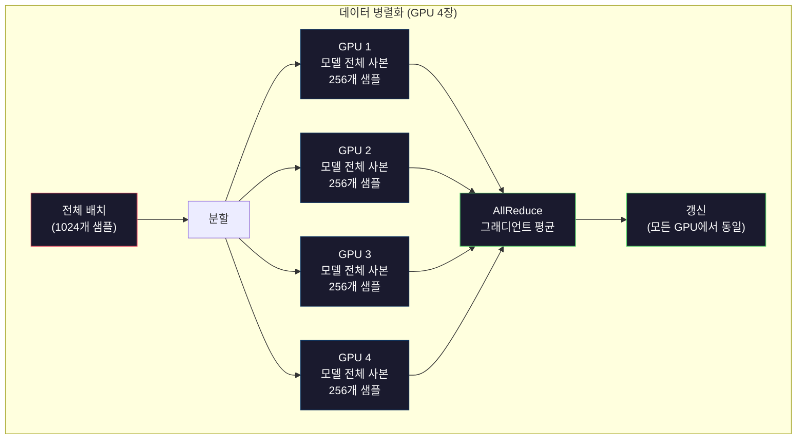
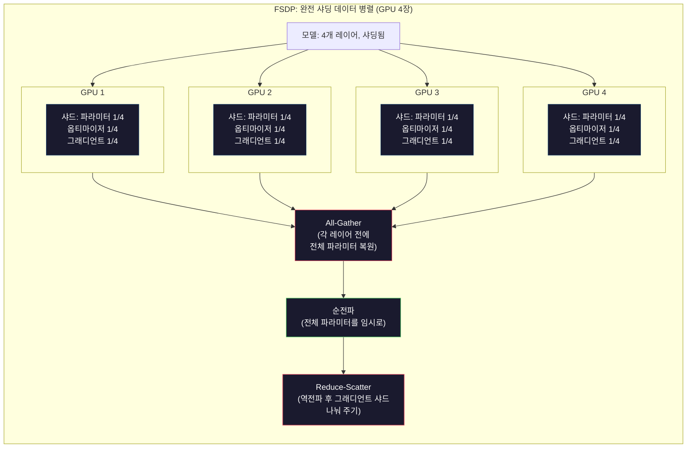
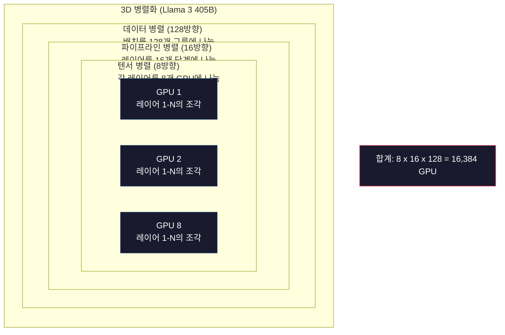

> 🇰🇷 이 문서는 한국어 번역본입니다(ELI5 스타일). 원문: [en.md](en.md)

# 확장: 분산 학습, FSDP, DeepSpeed

> 여러분의 1억 2,400만 모델은 GPU 한 장에서 학습됐습니다. 이번엔 70억 파라미터를 해 보세요. 모델이 메모리에 안 들어갑니다. 데이터를 한 대의 머신으로는 몇 주씩 걸립니다. 규모가 커지면 분산 학습은 선택 사항이 아닙니다. 유일하게 앞으로 나아갈 길입니다.

**유형:** 빌드(Build)
**사용 언어:** Python
**선수 지식:** 페이즈 10, 레슨 04(미니 GPT 사전 학습하기)
**시간:** 약 120분

## 학습 목표

- 데이터 병렬화, 텐서 병렬화, 파이프라인 병렬화의 세 가지 병렬화 유형을 설명하고, 모델·클러스터 크기에 따라 각각이 언제 필요한지 판단하기
- PyTorch DDP로 여러 GPU에 걸쳐 그래디언트를 동기화하는 데이터 병렬 학습 구현하기
- 주어진 모델 크기의 메모리 예산(가중치 + 옵티마이저 상태 + 그래디언트 + 활성값)을 계산해서 최소 하드웨어 사양 구하기
- FSDP나 DeepSpeed ZeRO 단계를 설정해 모델 상태를 GPU들에 샤딩하고, 단일 GPU 메모리를 초과하는 모델까지 담기

## 문제 상황

FP16 기준 70억(7B) 파라미터 모델은 가중치만으로 14GB가 필요합니다. Adam 옵티마이저는 모든 파라미터의 복사본을 두 개 더 저장합니다(1차·2차 모멘트 추정치). 여기에 28GB가 더 붙죠. 역전파 동안의 그래디언트가 14GB를 더합니다. 활성값을 하나도 저장하기 전에 이미 56GB입니다.

NVIDIA A100의 메모리는 80GB입니다.

80GB 중 56GB 소진. 활성값 — 순전파에서 계산되어 역전파 때까지 살아 있어야 하는 중간값 — 에는 24GB가 남습니다. 2,048토큰 시퀀스에 4,096차원 모델이면 레이어 하나의 활성값이 약 64MB입니다. 레이어가 32개이면 샘플 하나에 2GB가 필요합니다. 배치 크기 8이면 16GB죠. 남은 건 24GB입니다. 배치 크기 12면 터집니다.

이번엔 700억(70B) 파라미터를 해 보세요. 가중치만 FP16으로 140GB입니다. GPU 한 장에는 안 들어갑니다. 가중치를 담기만 하는 데도 A100 최소 2장(2 x 80GB = 160GB)이 필요합니다. 옵티마이저 상태와 그래디언트까지 더하면 훨씬 더 필요합니다: 최소 3장 이상, 현실적으로는 샤딩 전략에 따라 8~16장입니다.

Llama 3 405B는 NVIDIA H100 GPU 16,384장에서 학습됐습니다. 이 학습 실행에는 연산 비용만 약 1억 달러가 들었습니다. DeepSeek V3는 아키텍처를 영리하게 설계하고(Mixture of Experts는 토큰 하나당 파라미터의 일부만 활성화) 학습 효율을 높여서 비슷한 모델을 약 560만 달러에 학습했습니다.

이 레슨에서는 대규모 학습을 가능하게 만드는 네 가지 전략을 다룹니다: 데이터 병렬화, 텐서 병렬화, 파이프라인 병렬화, 완전 샤딩 데이터 병렬화. 분산 학습 프레임워크를 만지기 전에, 순수 Python으로 각 전략을 시뮬레이션하며 원리를 먼저 익힙니다.

## 개념

### 분산이 왜 필요한가

실제 모델들의 메모리 계산입니다. 모든 숫자는 계산된 값이지 추정이 아닙니다.

| 모델 | 파라미터 | 가중치 (FP16) | Adam 상태 | 그래디언트 (FP16) | 합계 (활성값 제외) |
|-------|--------|----------------|-------------|------------------|----------------------|
| GPT-2 Small | 124M | 248 MB | 992 MB | 248 MB | 1.5 GB |
| Llama 3 8B | 8B | 16 GB | 64 GB | 16 GB | 96 GB |
| Llama 3 70B | 70B | 140 GB | 560 GB | 140 GB | 840 GB |
| Llama 3 405B | 405B | 810 GB | 3,240 GB | 810 GB | 4,860 GB |

"Adam 상태" 열이 진범입니다. Adam은 모든 파라미터에 대해 이동 평균(m)과 이동 분산(v)을 각각 FP32로 저장합니다. 70B 모델이면 70B x 4바이트 x 2 = 560GB입니다. 옵티마이저만으로 A100 일곱 장이 필요합니다.

H100 한 장은 80GB입니다. Llama 3 405B는 가중치, 옵티마이저, 그래디언트를 담기만 해도 H100 최소 61장이 필요합니다. 활성값까지 더하면 숫자는 더 커집니다. Meta가 GPU 16,384장을 쓴 이유는 하고 싶어서가 아니라 어쩔 수 없었기 때문입니다.

### 데이터 병렬화

가장 단순한 분산 전략입니다. 모델 전체를 N개 GPU에 복사합니다. 학습 배치마다 N등분합니다. 각 GPU는 자기 몫의 데이터로 순전파와 역전파를 돌립니다. 역전파 후에는 모든 GPU에 걸쳐 그래디언트를 평균 냅니다. 모든 GPU는 같은 평균 그래디언트로 자기 가중치 사본을 갱신해서, 사본들이 동기화 상태를 유지합니다.

**장점:** 처리량이 선형으로 늘어납니다. GPU N장이 스텝당 N배의 데이터를 처리합니다. 통신은 그래디언트 평균 내기로 한정되며, 이는 계산과 겹쳐서(오버랩되어) 진행됩니다.

**단점:** 모든 GPU가 모델, 옵티마이저 상태, 그래디언트의 완전한 사본을 들고 있습니다. 70B 모델이면 GPU 하나당 840GB입니다. 데이터 병렬화는 GPU당 메모리를 줄여 주지 못합니다. 학습 시간만 줄여 줍니다.

**수식:** 실효 배치 크기 = per_gpu_batch_size x N. GPU 64장에 GPU당 배치 16이면 실효 배치는 1,024입니다. Llama 3는 스텝당 실효 배치 1,600만 토큰을 사용했습니다.



### 텐서 병렬화

개별 레이어를 GPU들에 나눕니다. 행렬 곱셈 하나를 여러 GPU가 나눠서, 각 GPU가 결과의 일부를 계산합니다.

피드포워드 레이어의 (8192, 8192) 크기 가중치 행렬을 생각해 봅시다. 4방향 텐서 병렬화에서는 각 GPU가 (8192, 2048) 샤드를 들고 있습니다. 각 GPU는 입력에 자기 샤드를 곱해 부분 결과를 만들고, 부분 결과들을 합쳐서(all-reduce 또는 all-gather로) 전체 출력을 만듭니다.

**장점:** 모델 가중치의 GPU당 메모리를 줄입니다. 70B 모델을 8장으로 나누면 GPU 하나가 약 8.75B 파라미터 분량의 가중치를 들고 있습니다.

**단점:** 매 레이어마다 빠른 GPU 간 통신이 필요합니다. 행렬 곱셈 뒤에 붙는 all-reduce가 지연 시간을 더합니다. NVLink(같은 노드 안 GPU 간 900GB/s)에서는 잘 동작하지만, InfiniBand(400 Gb/s, 약 50GB/s)로 연결된 노드 사이에서는 형편없습니다. 그래서 텐서 병렬화는 거의 항상 한 노드 안(GPU 8장)으로 제한됩니다.

**실제 사용:** Megatron-LM이 텐서 병렬화의 선구자입니다. Llama 3 405B는 노드 안에서 8방향 텐서 병렬화를 씁니다.

### 파이프라인 병렬화

모델을 레이어 단위로 나눕니다. GPU 1은 레이어 1~8을, GPU 2는 레이어 9~16을, GPU 3은 레이어 17~24를, GPU 4는 레이어 25~32를 맡습니다. 데이터는 파이프라인을 따라 흐릅니다: GPU 1이 자기 레이어를 계산해 활성값을 GPU 2로 보내고, GPU 2가 자기 레이어를 계산해 GPU 3으로 보내는 식입니다.

**장점:** GPU 간 통신이 최소입니다 — 레이어 경계의 활성값뿐이고, 이는 그래디언트나 가중치에 비하면 아주 작습니다. 대역폭 요구량이 낮아서 노드를 넘어서도 동작합니다.

**단점:** 파이프라인 버블입니다. GPU 4가 마이크로배치 1의 순전파를 계산하는 동안 GPU 1, 2, 3은 놀고 있습니다(자기 몫은 이미 앞으로 넘겼으니까요). 역전파에서는 패턴이 거꾸로 됩니다. 순진한 파이프라이닝에서는 GPU 활용률이 N개 단계 기준 1/N에 그칩니다.

**GPipe와 PipeDream**은 배치를 마이크로배치로 쪼개서 버블 문제를 해결합니다. GPU 1은 마이크로배치 1의 순전파를 끝내자마자 마이크로배치 2를 시작합니다. 이렇게 파이프라인 단계들 사이에서 계산이 겹칩니다. 마이크로배치 M개, 단계 N개면 버블 비율이 (N-1)/M으로 떨어집니다. N=4 단계에 M=16 마이크로배치를 쓰면 버블은 3/16 = 18.75%, 즉 유휴 시간이 18.75%입니다.

### FSDP: 완전 샤딩 데이터 병렬

FSDP는 데이터 병렬화의 확장성과 샤딩의 메모리 효율을 결합합니다. 각 GPU가 모델의 완전한 사본을 들고 있는 대신, 파라미터·그래디언트·옵티마이저 상태의 1/N만 들고 있습니다.

어떤 레이어의 순전파 전에 FSDP는 **all-gather**를 돌려 모든 GPU의 전체 파라미터를 각 GPU 메모리로 모읍니다. 순전파 후에는 각 GPU가 자기 것이 아닌 파라미터를 버립니다. 역전파 동안에는 그래디언트 계산에 필요한 파라미터를 복원하려고 all-gather가 다시 돕니다. 역전파 후에는 **reduce-scatter**가 그래디언트 샤드를 나눠 주어 각 GPU가 그래디언트의 1/N만 저장합니다.

**70B 모델을 GPU 8장에서 돌릴 때의 계산:**

| 구성 요소 | FSDP 없이 | FSDP 적용 시 |
|-----------|-------------|-----------|
| 가중치 (FP16) | GPU당 140 GB | GPU당 17.5 GB |
| Adam 상태 (FP32) | GPU당 560 GB | GPU당 70 GB |
| 그래디언트 (FP16) | GPU당 140 GB | GPU당 17.5 GB |
| **합계** | **GPU당 840 GB** | **GPU당 105 GB** |

FSDP가 없으면 70B 모델은 80GB GPU 한 장에 절대 안 들어갑니다. GPU 8장에 FSDP를 적용하면 GPU당 105GB — 잠깐, 그래도 안 들어가죠. GPU당 80GB 미만으로 내리려면 GPU 최소 16장이 필요하거나, FSDP를 활성값 체크포인팅(활성값을 저장하지 않고 역전파 때 다시 계산)과 조합해야 합니다.

통신 비용은 각 레이어 전에 all-gather를 돌려야 해서 순수 데이터 병렬화보다 높습니다. 하지만 메모리 절감 덕분에 이전에는 불가능하던 학습 실행이 가능해집니다.



### DeepSpeed ZeRO

DeepSpeed의 ZeRO(Zero Redundancy Optimizer)는 개념상 FSDP와 동일하지만 마이크로소프트가 독자적으로 개발했습니다. 단계를 세 개 정의하며, 단계가 올라갈수록 더 공격적으로 샤딩합니다:

| 단계 | 샤딩 대상 | 메모리 절감 | 통신 |
|-------|--------|---------------|---------------|
| ZeRO-1 | 옵티마이저 상태만 | 약 4배 절감 | 데이터 병렬과 동일 |
| ZeRO-2 | + 그래디언트 | 약 8배 절감 | 약간 더 많음 |
| ZeRO-3 | + 파라미터 | 약 N배 절감 (GPU N장) | 레이어마다 all-gather |

ZeRO-3가 FSDP와 동등합니다. 이름만 다를 뿐 메커니즘은 같습니다. PyTorch는 DeepSpeed가 개념을 증명한 뒤 FSDP를 네이티브 구현으로 추가했습니다.

DeepSpeed는 또한 ZeRO-Offload(옵티마이저 상태를 더 싸고 큰 CPU RAM으로 옮김)와 ZeRO-Infinity(NVMe SSD로 옮김)도 선보였습니다. 이들은 연산 속도를 메모리 용량과 맞바꾸는 거래입니다 — 오프로드된 연산은 느리지만 GPU 메모리를 비워 줍니다.

### 혼합 정밀도(Mixed Precision) 학습

현대의 학습은 여러 부동소수점 형식을 동시에 씁니다:

- **순전파**: FP16 또는 BF16(16비트). FP32의 절반 메모리. 행렬 곱셈은 텐서 코어에서 2배 빠릅니다.
- **마스터 가중치**: FP32(32비트). 가중치 갱신 중 수치 정밀도를 유지하려고 옵티마이저가 관리합니다.
- **손실 스케일링**: 역전파 전에 손실에 큰 상수를 곱해 FP16 그래디언트가 0으로 언더플로되는 것을 막습니다. 옵티마이저 스텝 전에 같은 상수로 다시 나눕니다.

BF16(Brain Float 16)은 FP32와 같은 지수 범위(지수 8비트)를 가지지만 정밀도는 낮습니다(가수 7비트, FP32는 23비트). 같은 범위의 값을 표현할 수 있어서 손실 스케일링이 거의 필요 없습니다. FP16은 지수 5비트, 가수 10비트 — 세밀한 값은 표현할 수 있지만 극단적인 크기에서는 오버플로/언더플로가 납니다.

구글의 TPU는 BF16을 네이티브로 씁니다. NVIDIA의 A100과 H100은 FP16과 BF16을 모두 지원합니다. 손실 스케일링 골칫거리를 없애 준다는 이유로 업계는 대체로 BF16으로 넘어왔습니다.

**7B 모델의 메모리 비교:**

| 정밀도 | 가중치 | 옵티마이저 | 그래디언트 | 합계 |
|-----------|---------|-----------|-----------|-------|
| 전체 FP32 | 28 GB | 56 GB | 28 GB | 112 GB |
| 혼합 (BF16 + FP32 마스터) | 14 GB | 56 GB | 14 GB | 84 GB |

혼합 정밀도는 이 모델에서 28GB를 아낍니다. 옵티마이저 상태는 정밀도와 무관하게 FP32로 유지됩니다 — 메모리의 대부분이 여기로 흘러갑니다.

### Megatron-LM과 3D 병렬화

실제 대규모 학습은 세 가지 병렬화를 모두 조합합니다:

- **데이터 병렬화** — 노드 그룹들 사이(배치 크기 확장)
- **텐서 병렬화** — 노드 안에서(레이어를 8개 GPU에 나눔)
- **파이프라인 병렬화** — 노드들 사이(레이어 그룹을 여러 머신에 나눔)

GPU 16,384장으로 돌아가는 Llama 3 405B:
- 노드 안 8방향 텐서 병렬화(노드당 GPU 8장)
- 노드들 사이 16방향 파이프라인 병렬화(파이프라인 단계 16개)
- 나머지 차원의 128방향 데이터 병렬화(16,384 / 8 / 16 = 128)

이 3D 분해(8 x 16 x 128 = 16,384)가 수천 장의 GPU로 확장하는 방법입니다. 각 GPU는 서로 다른 데이터 샤드를 담당하고(데이터 병렬), 각 레이어의 한 조각을 들고 있으며(텐서 병렬), 서로 다른 레이어 집합을 계산합니다(파이프라인 병렬).

DeepSeek V3는 다른 길을 택했습니다. 이들의 Mixture of Experts 아키텍처는 6,710억 파라미터 중 토큰 하나당 370억(37B)만 활성화합니다. 즉 각 GPU는 활성화되는 파라미터만 계산하고(활성값도 그만큼만 저장하면 됩니다) H800 GPU 2,048장 — Meta의 GPU 수의 1/8도 안 됨 — 으로 학습했고, 비용은 560만 달러 vs Meta의 추정 1억 달러였습니다.



```figure
paged-kv-cache
```

## 만들어 보기

### 단계 1: 데이터 병렬화 시뮬레이션

배치를 시뮬레이션된 GPU들에 나눕니다. 각 GPU는 자기 샤드로 순전파를 계산합니다. "그래디언트"(여기서는 손실 값으로 시뮬레이션)를 평균 냅니다.

```python
import numpy as np

def simulate_data_parallelism(data, num_gpus, model_fn):
    batch_size = len(data)
    shard_size = batch_size // num_gpus
    remainder = batch_size % num_gpus

    gpu_losses = []
    gpu_gradients = []

    offset = 0
    for gpu_id in range(num_gpus):
        extra = 1 if gpu_id < remainder else 0
        shard = data[offset:offset + shard_size + extra]
        offset += shard_size + extra

        loss, grad = model_fn(shard)
        gpu_losses.append(loss)
        gpu_gradients.append(grad)

    avg_loss = np.mean(gpu_losses)
    avg_gradient = np.mean(gpu_gradients, axis=0)

    return avg_loss, avg_gradient
```

all-reduce 연산(그래디언트 평균 내기)이 데이터 병렬화의 유일한 통신입니다. 실무에서는 NVIDIA GPU에서 링 올리듀스(ring all-reduce)를 구현하는 NCCL 라이브러리를 씁니다: 각 GPU가 그래디언트의 1/N을 이웃에 보내고 반대편 이웃에서 1/N을 받아, N-1 스텝 후에는 모든 GPU가 완전한 평균을 갖게 됩니다. 총 통신량은 2 x 그래디언트 크기 x (N-1)/N으로, N이 크면 그래디언트 크기의 2배에 수렴합니다.

### 단계 2: 텐서 병렬화 시뮬레이션

가중치 행렬을 GPU들에 나눕니다. 각 GPU가 부분 행렬 곱셈을 계산합니다. 결과를 합칩니다.

```python
def simulate_tensor_parallelism(input_data, weight_matrix, num_gpus):
    d_in, d_out = weight_matrix.shape
    assert d_out % num_gpus == 0, f"d_out {d_out} not divisible by num_gpus {num_gpus}"
    shard_size = d_out // num_gpus

    partial_results = []
    for gpu_id in range(num_gpus):
        start = gpu_id * shard_size
        end = start + shard_size
        weight_shard = weight_matrix[:, start:end]

        partial = input_data @ weight_shard
        partial_results.append(partial)

    full_output = np.concatenate(partial_results, axis=-1)

    direct_output = input_data @ weight_matrix
    error = np.abs(full_output - direct_output).max()

    return full_output, error
```

오차는 정확히 0(또는 머신 엡실론)이어야 합니다. 텐서 병렬화는 수학적으로 정확합니다 — GPU 한 장에서 전체 행렬 곱셈을 한 것과 같은 결과를 냅니다. 출력 차원을 따라 쪼개므로 각 GPU가 서로 다른 열 묶음을 만들고, 이어 붙이면 전체 결과가 복원됩니다.

열 병렬(column-parallel) 선형 레이어(출력 차원 분할)는 결과를 이어 붙이고(concatenate), 행 병렬(row-parallel, 입력 차원 분할)은 더합니다(sum). 트랜스포머 FFN에서는 첫 번째 선형(확장)이 열 병렬, 두 번째 선형(수축)이 행 병렬입니다. 이렇게 하면 두 레이어 사이의 all-reduce를 피할 수 있습니다.

### 단계 3: 파이프라인 병렬화 시뮬레이션

모델의 레이어를 가상 GPU들에 나눕니다. 앞 단계들이 뒷 단계가 계산하는 동안 노는 버블 문제를 보여 줍니다.

```python
def simulate_pipeline_parallelism(num_layers, num_stages, num_microbatches):
    layers_per_stage = num_layers // num_stages

    timeline = {}
    clock = 0

    for mb in range(num_microbatches):
        for stage in range(num_stages):
            start_time = max(
                timeline.get((stage, mb - 1, "fwd"), (0, 0))[1] if mb > 0 else 0,
                timeline.get((stage - 1, mb, "fwd"), (0, 0))[1] if stage > 0 else 0,
            )
            end_time = start_time + layers_per_stage
            timeline[(stage, mb, "fwd")] = (start_time, end_time)

    last_fwd_end = max(v[1] for v in timeline.values())

    for mb in range(num_microbatches - 1, -1, -1):
        for stage in range(num_stages - 1, -1, -1):
            deps = [last_fwd_end]
            if mb < num_microbatches - 1 and (stage, mb + 1, "bwd") in timeline:
                deps.append(timeline[(stage, mb + 1, "bwd")][1])
            if stage < num_stages - 1 and (stage + 1, mb, "bwd") in timeline:
                deps.append(timeline[(stage + 1, mb, "bwd")][1])
            start_time = max(deps)
            end_time = start_time + layers_per_stage
            timeline[(stage, mb, "bwd")] = (start_time, end_time)

    total_time = max(v[1] for v in timeline.values())
    compute_time = num_microbatches * num_stages * layers_per_stage * 2
    bubble_fraction = 1.0 - compute_time / (total_time * num_stages)

    return timeline, total_time, bubble_fraction
```

단계 4개에 마이크로배치 1개면 버블 비율은 75%입니다 — 넷 중 셋의 GPU가 항상 놀고 있습니다. 마이크로배치 16개면 약 19%로 떨어집니다. 버블을 없애는 대가는 메모리입니다: 진행 중인 모든 마이크로배치의 활성값을 동시에 저장해야 하니까요.

### 단계 4: 메모리 계산기

모든 모델 크기의 학습에 필요한 정확한 메모리를 계산합니다.

```python
def memory_calculator(
    params_billions,
    precision_bytes=2,
    optimizer="adam",
    num_gpus=1,
    sharding="none",
    sequence_length=2048,
    batch_size_per_gpu=1,
    hidden_dim=None,
    num_layers=None,
):
    params = params_billions * 1e9

    weight_memory = params * precision_bytes

    if optimizer == "adam":
        optimizer_memory = params * 4 * 2
    elif optimizer == "sgd":
        optimizer_memory = params * 4
    else:
        optimizer_memory = 0

    gradient_memory = params * precision_bytes

    total_no_activation = weight_memory + optimizer_memory + gradient_memory

    if hidden_dim and num_layers:
        activation_per_layer = (
            sequence_length * batch_size_per_gpu * hidden_dim * precision_bytes * 4
        )
        activation_memory = activation_per_layer * num_layers
    else:
        activation_memory = params * precision_bytes * 0.5

    if sharding == "fsdp" or sharding == "zero3":
        weight_memory /= num_gpus
        optimizer_memory /= num_gpus
        gradient_memory /= num_gpus
    elif sharding == "zero2":
        optimizer_memory /= num_gpus
        gradient_memory /= num_gpus
    elif sharding == "zero1":
        optimizer_memory /= num_gpus

    per_gpu_total = weight_memory + optimizer_memory + gradient_memory + activation_memory

    return {
        "params_billions": params_billions,
        "weights_gb": weight_memory / 1e9,
        "optimizer_gb": optimizer_memory / 1e9,
        "gradients_gb": gradient_memory / 1e9,
        "activations_gb": activation_memory / 1e9,
        "per_gpu_total_gb": per_gpu_total / 1e9,
        "total_across_gpus_gb": per_gpu_total * num_gpus / 1e9,
        "fits_on_80gb": per_gpu_total / 1e9 <= 80,
        "num_gpus": num_gpus,
        "sharding": sharding,
    }
```

이 계산기는 모든 ML 엔지니어가 던지는 질문에 답합니다: "GPU가 몇 장 필요하지?" 모델 크기를 넣고 들어가는지 확인해 보세요. GPU당 총량이 80GB 아래로 떨어질 때까지 샤딩 전략을 조정하면 됩니다.

### 단계 5: 혼합 정밀도 시뮬레이션

FP32, FP16, 혼합 정밀도 학습의 메모리 사용량을 비교합니다.

```python
def mixed_precision_comparison(params_billions):
    params = params_billions * 1e9

    fp32_weights = params * 4
    fp32_optimizer = params * 4 * 2
    fp32_gradients = params * 4
    fp32_total = fp32_weights + fp32_optimizer + fp32_gradients

    fp16_weights = params * 2
    fp16_master = params * 4
    fp16_optimizer = params * 4 * 2
    fp16_gradients = params * 2
    fp16_total = fp16_weights + fp16_master + fp16_optimizer + fp16_gradients

    mixed_weights = params * 2
    mixed_optimizer = params * 4 * 2
    mixed_gradients = params * 2
    mixed_total = mixed_weights + mixed_optimizer + mixed_gradients

    return {
        "fp32_total_gb": fp32_total / 1e9,
        "fp16_with_master_gb": fp16_total / 1e9,
        "mixed_bf16_gb": mixed_total / 1e9,
        "savings_vs_fp32": 1 - mixed_total / fp32_total,
    }
```

대부분의 사람에게 가장 놀라운 사실: 혼합 정밀도는 메모리를 절반으로 줄이지 않습니다. 옵티마이저 상태(Adam의 m과 v)는 정밀도와 무관하게 FP32로 유지됩니다. 7B 모델은 FP32 학습에 112GB, 혼합 정밀도로는 84GB입니다. 50%가 아니라 25% 절감입니다. 옵티마이저가 지배하기 때문입니다.

## 활용해 보기

### 전체 시뮬레이션 실행

```python
def run_all_demos():
    print("=" * 70)
    print("DATA PARALLELISM SIMULATION")
    print("=" * 70)

    np.random.seed(42)
    data = np.random.randn(64, 32)
    weight = np.random.randn(32, 16)

    def model_fn(batch):
        output = batch @ weight
        loss = np.mean(output ** 2)
        grad = 2 * batch.T @ (batch @ weight) / len(batch)
        return loss, grad

    for n_gpus in [1, 2, 4, 8]:
        loss, grad = simulate_data_parallelism(data, n_gpus, model_fn)
        print(f"  {n_gpus} GPUs: loss={loss:.4f}, grad_norm={np.linalg.norm(grad):.4f}")

    print()
    print("=" * 70)
    print("TENSOR PARALLELISM SIMULATION")
    print("=" * 70)

    x = np.random.randn(4, 8192)
    W = np.random.randn(8192, 8192)

    for n_gpus in [1, 2, 4, 8]:
        output, error = simulate_tensor_parallelism(x, W, n_gpus)
        print(f"  {n_gpus} GPUs: output_shape={output.shape}, max_error={error:.2e}")

    print()
    print("=" * 70)
    print("PIPELINE PARALLELISM SIMULATION")
    print("=" * 70)

    for n_mb in [1, 4, 8, 16, 32]:
        _, total_t, bubble = simulate_pipeline_parallelism(32, 4, n_mb)
        print(f"  {n_mb:2d} micro-batches: total_time={total_t:4d}, bubble={bubble:.1%}")

    print()
    print("=" * 70)
    print("MEMORY CALCULATOR")
    print("=" * 70)

    configs = [
        (7, "none", 1),
        (7, "fsdp", 8),
        (70, "none", 1),
        (70, "fsdp", 8),
        (70, "fsdp", 16),
        (405, "fsdp", 64),
        (405, "fsdp", 128),
    ]

    print(f"  {'Model':>8} {'Sharding':>8} {'GPUs':>5} {'Per-GPU':>10} {'Fits 80GB':>10}")
    print("  " + "-" * 50)
    for params, shard, gpus in configs:
        result = memory_calculator(params, num_gpus=gpus, sharding=shard)
        fits = "Yes" if result["fits_on_80gb"] else "No"
        print(f"  {params:>6}B {shard:>8} {gpus:>5} {result['per_gpu_total_gb']:>8.1f}GB {fits:>10}")

    print()
    print("=" * 70)
    print("MIXED PRECISION COMPARISON")
    print("=" * 70)

    for params_b in [7, 13, 70, 405]:
        result = mixed_precision_comparison(params_b)
        print(f"  {params_b}B: FP32={result['fp32_total_gb']:.0f}GB, "
              f"Mixed BF16={result['mixed_bf16_gb']:.0f}GB, "
              f"Savings={result['savings_vs_fp32']:.0%}")
```

## 출시하기

이 레슨은 `outputs/prompt-distributed-training-planner.md`를 산출물로 남깁니다 — 모델 크기와 사용 가능한 하드웨어를 받아 완전한 분산 학습 계획을 만들어 주는 프롬프트입니다: 병렬화 전략, 메모리 예산, 통신 오버헤드, 예상 처리량.

## 연습 문제

1. 메모리 계산기에 활성값 체크포인팅을 추가해 보세요. 체크포인팅을 쓰면 K번째 레이어마다만 활성값을 저장합니다(전체 재계산이 전형적이며 이때 K=1). 메모리-연산 트레이드오프를 보여 주세요: 체크포인팅은 메모리를 얼마나 아끼고, 학습을 얼마나 느리게 만들까요(전체 체크포인팅 기준 연산량이 약 33% 증가)?

2. 파이프라인 병렬화 시뮬레이션을 확장해 PipeDream이 쓰는 1F1B(one forward, one backward) 스케줄을 구현해 보세요. 단계 4개, 마이크로배치 8개 조건에서 순진한 스케줄과 버블 비율을 비교하세요. 1F1B 스케줄은 역전파를 더 일찍 시작하기 때문에 피크 메모리가 더 작아야 합니다.

3. 그래디언트 누적(gradient accumulation) 시뮬레이터를 구현해 보세요. 마이크로배치마다 all-reduce하는 대신, K 스텝 동안 그래디언트를 로컬로 누적한 뒤 all-reduce합니다. 이렇게 하면 통신량이 K분의 1로 줄어들지만 최종 그래디언트(그리고 학습 결과도)가 완전히 같음을 보여 주세요.

4. 비용 추정기를 만들어 보세요. 모델 크기, 목표 토큰 수, GPU 유형(A100 시간당 $2, H100 시간당 $3.50), 병렬화 전략이 주어지면 총 학습 비용을 달러로 추정합니다. 알려진 비용과 비교해 검증하세요: Llama 3 405B는 약 1억 달러, DeepSeek V3는 약 560만 달러로 알려져 있습니다.

5. 메모리 계산기에 ZeRO-Offload를 추가해 보세요. 노드당 CPU RAM 512GB, NVMe 2TB라고 가정합니다. 옵티마이저 상태를 CPU로 오프로드하면 70B 모델을 GPU 16장 대신 4장으로 학습할 수 있음을 보여 주세요(옵티마이저 스텝이 30~50% 느려지는 대가를 치럿습니다).

## 핵심 용어

| 용어 | 사람들이 말하는 방식 | 실제 의미 |
|------|----------------|----------------------|
| Data parallelism(데이터 병렬화) | "모델을 모든 GPU에 복사한다" | 각 GPU가 서로 다른 데이터 샤드를 처리하고, 매 스텝 후 all-reduce로 그래디언트를 평균냄 |
| Tensor parallelism(텐서 병렬화) | "레이어 하나를 GPU들에 나눈다" | 가중치 행렬을 분할해 각 GPU가 행렬 곱셈의 일부를 계산 — 빠른 NVLink 상호연결이 필요 |
| Pipeline parallelism(파이프라인 병렬화) | "레이어들을 GPU별로 나눈다" | 각 GPU가 서로 다른 레이어 그룹을 담당 — 버블을 줄이려고 마이크로배치가 파이프라인을 따라 흐름 |
| FSDP | "전부 샤딩한다" | Fully Sharded Data Parallel — 각 GPU가 가중치·그래디언트·옵티마이저 상태의 1/N만 들고, 계산 전에 all-gather |
| ZeRO | "DeepSpeed판 FSDP" | Zero Redundancy Optimizer, 3단계: 옵티마이저 샤딩(1단계), + 그래디언트(2단계), + 파라미터(3단계) |
| All-reduce | "GPU 전체에서 평균 낸다" | 모든 GPU가 모든 GPU 입력의 합(또는 평균)을 갖고 끝나는 집단 연산 — 보통 링 올리듀스로 구현 |
| All-gather | "모든 GPU에서 모은다" | 모든 GPU가 모든 GPU 데이터의 이어 붙이기를 갖고 끝나는 집단 연산 — FSDP가 전체 파라미터 복원에 사용 |
| Reduce-scatter | "더해서 나눠준다" | 데이터를 환원(합)한 뒤 서로 다른 묶음을 서로 다른 GPU에 흩뿌리는 집단 연산 — FSDP가 그래디언트 샤딩에 사용 |
| Mixed precision(혼합 정밀도) | "반정밀도로 학습한다" | 순전파/역전파는 FP16/BF16, 옵티마이저 상태는 FP32 — 메모리는 50%가 아니라 약 25% 절감, 옵티마이저가 지배적이라서 |
| Pipeline bubble(파이프라인 버블) | "파이프라인의 유휴 시간" | GPU가 이전 단계의 데이터를 기다리며 노는 시간 비율 — 마이크로배치를 늘리면 줄어듦 |

## 더 읽을거리

- [Rajbhandari 외, 2020 -- "ZeRO: Memory Optimizations Toward Training Trillion Parameter Models"](https://arxiv.org/abs/1910.02054) -- 세 가지 샤딩 단계를 정의한 DeepSpeed ZeRO 논문
- [Shoeybi 외, 2020 -- "Megatron-LM: Training Multi-Billion Parameter Language Models Using Model Parallelism"](https://arxiv.org/abs/1909.08053) -- NVIDIA의 트랜스포머용 텐서 병렬화
- [Narayanan 외, 2021 -- "Efficient Large-Scale Language Model Training on GPU Clusters Using Megatron-LM"](https://arxiv.org/abs/2104.04473) -- 데이터·텐서·파이프라인을 결합한 3D 병렬화
- [Zhao 외, 2023 -- "PyTorch FSDP: Experiences on Scaling Fully Sharded Data Parallel"](https://arxiv.org/abs/2304.11277) -- PyTorch의 네이티브 FSDP 구현
- [Llama 3 Technical Report](https://arxiv.org/abs/2407.21783) -- 16,384 GPU 학습의 3D 병렬화 상세
- [DeepSeek-V3 Technical Report](https://arxiv.org/abs/2412.19437) -- MoE 아키텍처가 학습 비용을 10분의 1 수준으로 줄이는 방법
