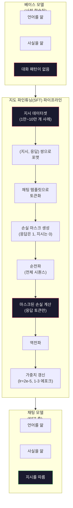

> 🇰🇷 이 문서는 한국어 번역본입니다(ELI5 스타일). 원문: [en.md](en.md)

# 인스트럭션 튜닝(SFT)

> 베이스 모델은 다음 토큰을 예측할 뿐입니다. 그게 전부죠. 지시를 따르지도, 질문에 답하지도, 유해한 요청을 거절하지도 않습니다. SFT는 토큰 예측기와 유용한 어시스턴트 사이의 다리입니다. 여러분이 말을 걸어 본 모든 모델 — Claude, GPT, Llama Chat — 은 이 단계를 거쳤습니다.

**유형:** 빌드(Build)
**사용 언어:** Python(numpy 사용)
**선수 지식:** 페이즈 10, 레슨 04(미니 GPT 사전 학습하기)
**시간:** 약 90분

## 학습 목표

- 베이스 언어 모델을 지시를 따르는 어시스턴트로 바꾸는 지도 파인튜닝(SFT) 구현하기
- 시스템·사용자·어시스턴트 역할이 있는 채팅 템플릿으로 학습 데이터를 포맷하고, 어시스턴트가 아닌 토큰에는 손실을 마스킹하기
- SFT가 왜 필요한지 설명하기: 베이스 모델은 질문에 답하는 게 아니라 텍스트를 이어 씁니다
- 홀드아웃 지시 세트에서 베이스 모델과 파인튜닝 모델의 응답을 비교해 SFT 품질 평가하기

## 문제 상황

레슨 04에서 모델을 학습시켰습니다. 시퀀스가 주어지면 다음 토큰을 예측할 수 있죠. "The transformer architecture"를 넣으면 "has revolutionized natural language processing."으로 이어 쓸 겁니다. 다음 토큰 예측기치고는 인상적입니다.

이번엔 이걸 넣어 보세요: "What is the capital of France?" 베이스 모델은 "Paris"라고 답하지 않습니다. 패턴을 이어 갑니다. "What is the capital of Germany? What is the capital of Spain?" 같은 걸 내놓을 수도 있습니다. 질문 목록이 담긴 문서들로 학습했으니까요. 아니면 "is a question that many people ask"처럼 그럴듯한 다음 토큰 이어쓰기를 내놓을 수도 있습니다. 모델에게는 대답하기(answering)라는 개념이 없습니다. 이어 쓰기(continuing)만 알 뿐이죠.

이것이 GPT-3(베이스 모델, 2020년 6월 출시)와 ChatGPT(인스트럭션 튜닝, 2022년 11월 출시) 사이의 간극입니다. 같은 아키텍처, 같은 사전 학습. 차이는 2만~10만 개의 정성껏 만든 (지시, 응답) 쌍입니다 — 모델에게 대화 패턴을 따르도록 가르친 데이터죠.

Stanford Alpaca는 수백만 개 사례가 필요 없음을 증명했습니다. 2023년 3월, GPT-3.5가 만든 겨우 52,000개의 지시-응답 쌍만으로 Llama 7B를 파인튜닝했죠. 총 비용: 600달러. 결과물은 지시를 따르고, 질문에 답하고, 대화를 이어가는 챗봇이었습니다. ChatGPT만 못하지만, 600달러와 몇 시간 학습으로는 놀랄 만큼 근접한 수준이었습니다.

Meta의 Llama 2 Chat은 초기 SFT 단계에 겨우 약 27,000개의 고품질 사례만 썼습니다. 핵심 통찰: 양보다 품질입니다. 숙련된 어노테이터가 쓴 27,000개 사례가 인터넷에서 긁어 모은 100만 개의 잡음 섞인 사례를 이깁니다.

## 개념

### SFT가 실제로 하는 일

지도 파인튜닝(Supervised Fine-Tuning)은 사전 학습과 같은 학습 루프를 이어 갑니다 — 순전파, 손실 계산, 역전파, 가중치 갱신 — 하지만 다른 종류의 데이터로요. 날것의 텍스트 대신 구조화된 대화로 학습합니다:

```json
{
  "system": "You are a helpful assistant.",
  "user": "What is the capital of France?",
  "assistant": "The capital of France is Paris."
}
```

모델은 이미 파리가 프랑스의 수도라는 걸 압니다. 사전 학습에서 Wikipedia, 교과서, 웹페이지로 배웠으니까요. SFT는 모델에게 새로운 사실을 가르치지 않습니다. 새로운 행동(behavior)을 가르칩니다: 질문을 보면 답을 내놓는다. 지시를 보면 완성문을 내놓는다. 유해한 요청을 보면 거절을 내놓는다.

이렇게 생각해 보세요. 사전 학습은 모델에게 지식을 줍니다. SFT는 모델에게 예절을 줍니다.

### 데이터 형식

업계를 지배하는 형식은 세 가지입니다. 셋 다 같은 정보 — 누가 무엇을 말했는가 — 를 서로 다른 구분자로 담습니다.

**Alpaca 형식** (Stanford, 2023년 3월):

```json
{
  "instruction": "Summarize the following article in 3 sentences.",
  "input": "The European Central Bank raised interest rates...",
  "output": "The ECB increased rates by 25 basis points..."
}
```

단순하고 널리 쓰입니다. `input` 필드는 선택 사항입니다 — 추가 컨텍스트가 필요 없는 지시도 많으니까요. Stanford는 이 형식으로 52,000개 사례를 공개했는데, GPT-3.5로 만들어 비용은 600달러였습니다. 이것이 오픈소스 인스트럭션 튜닝 운동의 불씨가 됐습니다.

**ShareGPT 형식** (커뮤니티, 2023):

```json
{
  "conversations": [
    {"from": "system", "value": "You are a helpful assistant."},
    {"from": "human", "value": "What causes tides?"},
    {"from": "gpt", "value": "Tides are caused by the gravitational pull of the Moon..."},
    {"from": "human", "value": "How often do they occur?"},
    {"from": "gpt", "value": "Most coastal areas experience two high tides and two low tides per day..."}
  ]
}
```

멀티턴 대화를 지원합니다. "from" 필드는 실제 모델이 무엇이든 관계없이 관례상 "human"과 "gpt"를 씁니다. Vicuna는 사용자가 공유한 ChatGPT 대화 기록에서 긁어 모은 70,000개의 ShareGPT 대화로 학습됐습니다.

**ChatML 형식** (OpenAI, 많은 오픈소스 모델이 사용):

```
<|im_start|>system
You are a helpful assistant.<|im_end|>
<|im_start|>user
What is the capital of France?<|im_end|>
<|im_start|>assistant
The capital of France is Paris.<|im_end|>
```

특수 토큰(`<|im_start|>`, `<|im_end|>`)으로 역할을 구분합니다. 이 토큰들은 파인튜닝 중에 토크나이저 어휘에 추가됩니다. Qwen, Yi 등 많은 모델이 ChatML을 씁니다.

세 형식 모두 같은 일을 합니다: 모델에게 "이게 지시고, 이게 응답이다. 이 패턴을 배워라"라고 알려 주는 겁니다.

### 왜 통하는가

모델은 사전 학습으로 이미 언어를 알고 있습니다. 질문 뒤에 답이 오는 사례, 지시 뒤에 완성문이 오는 사례, 사람들 사이의 대화를 수십억 건 봤죠. 그 패턴들은 이미 가중치 안에 새겨져 있습니다.

SFT는 이 잠재 능력을 응집시킵니다. 모델이 컨텍스트만 보고 스스로 판단해 질문에 답할지 문서를 이어 쓸지 정하게 두는 대신, SFT는 대화 패턴을 명시적으로 학습시킵니다. 몇 천 개 사례만 지나면 모델은 이렇게 배웁니다: 어시스턴트 역할 표식이 보이면 도움이 되는 응답을 내놓는다.

그래서 27,000개면 충분한 겁니다. 모델에게 영어를 가르치는 게 아닙니다. 세상 지식을 가르치는 것도 아닙니다. 단순한 행동 하나를 가르치는 겁니다: 지시에 응답하라. 지식은 이미 그 안에 있었습니다.

### 마스크된 손실

SFT에서 가장 중요한 기술적 디테일이지만, 대부분의 튜토리얼이 건너뜁니다.

사전 학습 중에는 모든 토큰에 대해 손실을 계산합니다. 모델이 시퀀스의 모든 다음 토큰을 예측하며 배우는 거죠. SFT에서는 응답 토큰에만 손실을 계산합니다. 지시 토큰은 컨텍스트로 존재할 뿐, 모델이 그걸 "예측"하지 못한다고 벌받지는 않습니다.

왜냐하면? 모델이 지시를 생성(generate)하도록 배우길 원하는 게 아니라, 지시에 응답(respond)하도록 배우길 원하기 때문입니다. 지시 토큰에 손실을 계산하면, 질문을 던지는 쪽인 양 "What is the capital of France?"를 예측하도록 모델을 학습시키는 겁니다. 그래디언트 신호만 낭비하고, 모델이 자기 역할을 혼란스러워할 수 있습니다.

실무에서는 손실 마스크를 만듭니다: 응답 토큰은 1, 지시 토큰은 0. 평균 내기 전에 토큰별 손실에 이 마스크를 곱합니다.

```
Tokens:    [SYS] You are helpful [USER] What is the capital? [ASST] Paris is the capital [EOS]
Loss mask:   0    0    0     0      0     0   0  0     0       1     1    1   1     1      1
```

`[ASST]` 뒤의 토큰만 손실에 기여합니다. 모델은 순전파 동안 대화 전체를 봅니다(올바른 응답을 내려면 지시가 필요하니까요). 하지만 가중치는 응답을 얼마나 잘 예측했는지에 따라서만 갱신됩니다.

### 학습 하이퍼파라미터

SFT는 사전 학습과는 극적으로 다른 하이퍼파라미터를 씁니다. 처음부터 학습하는 게 아닙니다. 이미 동작하는 모델을 조정하는 겁니다.

| 파라미터 | 사전 학습 (Llama 2 7B) | SFT (Llama 2 Chat) |
|-----------|---------------------------|---------------------|
| 학습률 | 3e-4 (최대) | 2e-5 |
| 에포크 | 1 (데이터를 한 번 훑음) | 2 |
| 배치 크기 | 400만 토큰 | 64개 사례 |
| 워밍업 스텝 | 2,000 | 0-100 |
| 가중치 감쇠 | 0.1 | 0.0-0.1 |
| 데이터 크기 | 2조 토큰 | 27,000개 사례 |

SFT의 학습률은 15배 낮습니다. 이게 결정적입니다. 파인튜닝 중 학습률이 높으면 사전 학습 지식이 파괴됩니다. 모델이 배운 것을 "잊어버리고" 작은 파인튜닝 데이터셋에 과적합됩니다. 이것이 재앙적 망각(catastrophic forgetting)입니다.

에포크 2는 모델이 각 학습 사례를 두 번 본다는 뜻입니다. 작은 데이터셋에서 에포크 3을 넘기면 암기가 시작됩니다 — 일반화 대신 학습 사례를 그대로 재현하기 시작하는 거죠.

### 재앙적 망각

파인튜닝은 일반 능력을 파괴할 수 있습니다. 지시 따르기 데이터로 너무 오래 학습하면, 모델은 코드를 쓰고, 수학을 하고, 창의적인 텍스트를 만드는 능력을 잃습니다. 학습 데이터의 특정 형식에만 매우 능하고 나머지 모든 것에는 끔찍해집니다.

완화책 세 가지:

1. **낮은 학습률.** 1e-5에서 5e-5. 갱신 폭이 작을수록 사전 학습된 특성을 덜 부숩니다.

2. **짧은 학습.** 1~3 에포크. 모델이 과적합되기 전에 멈춥니다.

3. **사전 학습 데이터 섞기.** Llama 2 Chat은 SFT 데이터셋에 원본 사전 학습 데이터를 약간(2~5%) 섞었습니다. 이는 새로운 지시 따르기 행동을 배우는 동안 모델에게 일반 능력을 "상기"시켜 줍니다.

### 실제 숫자

7B 모델을 고품질 지시 쌍 10,000개로 파인튜닝하는 데는 NVIDIA A100 80GB GPU 한 장 기준 약 1시간이 걸립니다. 계산은 이렇습니다:

- 10,000개 사례 x 평균 512 토큰 = 512만 토큰
- 에포크 2 = 총 1,024만 토큰
- 7B 모델 파인튜닝 기준 A100 처리량: 초당 약 3,000 토큰
- 1,024만 / 3,000 = 약 3,400초 = 약 57분

우리 미니 GPT(4 레이어, 128차원)는 학습이 거의 순간입니다. 요점은 규모가 아니라 원리를 이해하는 겁니다.



```figure
loss-masking
```

## 만들어 보기

### 단계 1: 지시 데이터셋

합성 지시 데이터셋을 만듭니다. 프로덕션(운영 환경)에서는 Scale AI, Anthropic 같은 회사가 사람 어노테이터를 고용해 이런 데이터를 작성합니다. 여기서는 형식을 보여 주려고 프로그램으로 만듭니다.

```python
import numpy as np

INSTRUCTION_DATA = [
    {
        "instruction": "What is the capital of France?",
        "response": "The capital of France is Paris."
    },
    {
        "instruction": "Explain gravity in one sentence.",
        "response": "Gravity is the force that attracts objects with mass toward each other."
    },
    {
        "instruction": "Write a haiku about the ocean.",
        "response": "Waves crash on the shore, salt and foam beneath the sun, endless blue expanse."
    },
    {
        "instruction": "What is 15 multiplied by 7?",
        "response": "15 multiplied by 7 is 105."
    },
    {
        "instruction": "Name three programming languages.",
        "response": "Three programming languages are Python, Rust, and TypeScript."
    },
    {
        "instruction": "Summarize photosynthesis.",
        "response": "Photosynthesis converts sunlight, water, and carbon dioxide into glucose and oxygen."
    },
    {
        "instruction": "What year did World War II end?",
        "response": "World War II ended in 1945."
    },
    {
        "instruction": "Define machine learning.",
        "response": "Machine learning is a field where algorithms learn patterns from data to make predictions."
    },
]
```

여덟 개 사례는 아주 작은 규모입니다. Stanford Alpaca는 52,000개를 썼죠. 하지만 8개든 52,000개든 원리는 동일합니다: 토큰화하고, 마스킹하고, 응답에만 손실을 계산합니다.

### 단계 2: 채팅 템플릿으로 토큰화

지시-응답 쌍을 특수 역할 표식이 있는 토큰 시퀀스로 바꿉니다. 표식은 지시가 어디서 끝나고 응답이 어디서 시작하는지 모델에게 알려 줍니다.

```python
SPECIAL_TOKENS = {
    "INST_START": 253,
    "INST_END": 254,
    "RESP_START": 255,
}


def tokenize_instruction_pair(instruction, response, vocab_size=256):
    inst_tokens = list(instruction.encode("utf-8"))
    resp_tokens = list(response.encode("utf-8"))

    inst_tokens = [min(t, vocab_size - 4) for t in inst_tokens]
    resp_tokens = [min(t, vocab_size - 4) for t in resp_tokens]

    tokens = (
        [SPECIAL_TOKENS["INST_START"]]
        + inst_tokens
        + [SPECIAL_TOKENS["INST_END"]]
        + [SPECIAL_TOKENS["RESP_START"]]
        + resp_tokens
    )

    return tokens


def create_loss_mask(tokens):
    mask = np.zeros(len(tokens), dtype=np.float32)
    in_response = False

    for i, token in enumerate(tokens):
        if token == SPECIAL_TOKENS["RESP_START"]:
            in_response = True
            continue
        if in_response:
            mask[i] = 1.0

    return mask
```

손실 마스크는 지시 토큰에서는 모두 0, 응답 토큰에서는 모두 1입니다. `RESP_START` 토큰 자체의 마스크는 0입니다 — 응답 내용이 아니라 구분자이기 때문입니다.

### 단계 3: 마스크된 교차 엔트로피 손실

표준 교차 엔트로피에 손실 마스크를 곱한 것입니다. 응답 토큰만 그래디언트에 기여합니다.

```python
def masked_cross_entropy_loss(logits, targets, loss_mask):
    batch, seq_len, vocab_size = logits.shape
    logits_flat = logits.reshape(-1, vocab_size)
    targets_flat = targets.reshape(-1)
    mask_flat = loss_mask.reshape(-1)

    max_logits = logits_flat.max(axis=-1, keepdims=True)
    log_softmax = logits_flat - max_logits - np.log(
        np.exp(logits_flat - max_logits).sum(axis=-1, keepdims=True)
    )

    per_token_loss = -log_softmax[np.arange(len(targets_flat)), targets_flat]

    masked_loss = per_token_loss * mask_flat
    num_response_tokens = mask_flat.sum()
    if num_response_tokens == 0:
        return 0.0
    loss = masked_loss.sum() / num_response_tokens

    return loss
```

분모는 `seq_len`이 아니라 `num_response_tokens`입니다. 전체 시퀀스 길이로 나누면 긴 지시가 그래디언트 신호를 희석합니다. 응답 토큰 수로 나눠야 지시 길이와 무관하게 응답 토큰 하나하나가 같은 비중을 갖습니다.

### 단계 4: SFT 학습 루프

레슨 04의 MiniGPT를 재사용합니다. 학습 루프는 사전 학습과 거의 같지만, 지시 포맷팅과 마스크된 손실이 붙습니다.

```python
import sys
import os
sys.path.insert(0, os.path.join(os.path.dirname(__file__), "..", "..", "04-pre-training-mini-gpt", "code"))
from main import MiniGPT, LayerNorm, FeedForward, MultiHeadAttention, TransformerBlock, Embedding


def sft_train(model, dataset, num_epochs=2, lr=2e-5, seq_len=64):
    formatted_data = []
    for example in dataset:
        tokens = tokenize_instruction_pair(example["instruction"], example["response"])
        mask = create_loss_mask(tokens)
        formatted_data.append((tokens, mask))

    print(f"SFT Training: {len(formatted_data)} examples, {num_epochs} epochs, lr={lr}")
    print(f"Total tokens: {sum(len(t) for t, _ in formatted_data):,}")
    print()

    losses = []

    for epoch in range(num_epochs):
        epoch_loss = 0.0
        num_batches = 0

        indices = np.random.permutation(len(formatted_data))

        for idx in indices:
            tokens, mask = formatted_data[idx]

            if len(tokens) < 3:
                continue
            if len(tokens) > seq_len:
                tokens = tokens[:seq_len]
                mask = mask[:seq_len]

            input_ids = np.array(tokens[:-1]).reshape(1, -1)
            target_ids = np.array(tokens[1:]).reshape(1, -1)
            loss_mask = np.array(mask[1:]).reshape(1, -1)

            logits = model.forward(input_ids)
            loss = masked_cross_entropy_loss(logits, target_ids, loss_mask)

            batch_size, s_len, v_size = logits.shape
            probs = np.exp(logits - logits.max(axis=-1, keepdims=True))
            probs = probs / probs.sum(axis=-1, keepdims=True)
            dlogits = probs.copy()
            dlogits[np.arange(batch_size)[:, None], np.arange(s_len), target_ids] -= 1.0

            mask_expanded = loss_mask[:, :, np.newaxis]
            num_resp = loss_mask.sum()
            if num_resp > 0:
                dlogits = dlogits * mask_expanded / num_resp

            for block in model.blocks:
                block.ffn.W1 -= lr * np.random.randn(*block.ffn.W1.shape) * 0.01
                block.ffn.W2 -= lr * np.random.randn(*block.ffn.W2.shape) * 0.01
                block.ffn.b1 -= lr * np.random.randn(*block.ffn.b1.shape) * 0.01
                block.ffn.b2 -= lr * np.random.randn(*block.ffn.b2.shape) * 0.01

            epoch_loss += loss
            num_batches += 1
            losses.append(loss)

        avg_loss = epoch_loss / max(num_batches, 1)
        print(f"Epoch {epoch + 1}/{num_epochs} | Avg Loss: {avg_loss:.4f}")

    return model, losses
```

학습률은 2e-5로, Llama 2 Chat과 같습니다. 사전 학습에서 쓴 3e-4와 비교해 보세요 — 15배 작습니다. 그래디언트는 마스크됩니다: 지시 토큰은 0의 그래디언트를 만들고, 응답 토큰만 가중치를 밀어냅니다.

### 단계 5: 베이스 모델 vs SFT 모델 비교

SFT의 요점은 행동 변화입니다. 지시 형식 입력과 날것 텍스트 이어쓰기에 모델이 어떻게 반응하는지 확인하며 측정해 봅시다.

```python
def generate_response(model, prompt_tokens, max_new_tokens=50, temperature=0.8):
    tokens = list(prompt_tokens)
    seq_len = model.embedding.pos_embed.shape[0]

    for _ in range(max_new_tokens):
        context = np.array(tokens[-seq_len:]).reshape(1, -1)
        logits = model.forward(context)
        next_logits = logits[0, -1, :]

        next_logits = next_logits / max(temperature, 1e-8)
        probs = np.exp(next_logits - next_logits.max())
        probs = probs / probs.sum()
        probs = np.clip(probs, 1e-10, 1.0)
        probs = probs / probs.sum()

        next_token = np.random.choice(len(probs), p=probs)
        tokens.append(int(next_token))

    return tokens


def evaluate_instruction_following(model, instructions):
    print("Evaluating instruction following:")
    print("-" * 50)

    for instruction in instructions:
        tokens = (
            [SPECIAL_TOKENS["INST_START"]]
            + [min(t, 252) for t in list(instruction.encode("utf-8"))]
            + [SPECIAL_TOKENS["INST_END"]]
            + [SPECIAL_TOKENS["RESP_START"]]
        )

        output = generate_response(model, tokens, max_new_tokens=30, temperature=0.6)
        response_start = len(tokens)
        response_tokens = output[response_start:]
        response_bytes = bytes([t for t in response_tokens if t < 128])
        response_text = response_bytes.decode("utf-8", errors="replace")

        print(f"  Q: {instruction}")
        print(f"  A: {response_text[:80]}")
        print()
```

8개 사례의 아주 작은 모델이라면 응답이 의미 있지는 않을 겁니다. 예상된 일입니다. 중요한 것은 구조입니다: 모델이 더 많은 지시를 이어 생성하는 대신 응답 표식 뒤에 출력을 내놓도록 배운다는 것.

### 단계 6: 재앙적 망각 측정

SFT 전후의 다음 토큰 예측 능력을 비교합니다. SFT가 일반 능력을 해쳤다면 날것 텍스트에 대한 손실이 올라갑니다.

```python
def measure_forgetting(model, test_text, seq_len=64):
    tokens = np.array(list(test_text.encode("utf-8")[:512]))

    total_loss = 0.0
    num_windows = 0

    for start in range(0, len(tokens) - seq_len - 1, seq_len):
        input_ids = tokens[start:start + seq_len].reshape(1, -1)
        target_ids = tokens[start + 1:start + seq_len + 1].reshape(1, -1)

        logits = model.forward(input_ids)

        batch, s_len, vocab_size = logits.shape
        logits_flat = logits.reshape(-1, vocab_size)
        targets_flat = target_ids.reshape(-1)

        max_logits = logits_flat.max(axis=-1, keepdims=True)
        log_softmax = logits_flat - max_logits - np.log(
            np.exp(logits_flat - max_logits).sum(axis=-1, keepdims=True)
        )

        loss = -log_softmax[np.arange(len(targets_flat)), targets_flat].mean()
        total_loss += loss
        num_windows += 1

    return total_loss / max(num_windows, 1)
```

실제 파인튜닝에서는 이 지표를 학습 내내 추적합니다. 날것 텍스트 손실이 10~15% 이상 오르면 SFT가 너무 공격적인 겁니다. 학습률을 낮추거나 에포크 수를 줄이세요.

## 활용해 보기

### 전체 SFT 파이프라인 데모

```python
if __name__ == "__main__":
    np.random.seed(42)

    test_text = """The transformer architecture processes sequences through self-attention.
Each layer applies multi-head attention followed by a feedforward network.
Residual connections and layer normalization stabilize deep networks.
The model learns to predict the next token given all previous tokens."""

    print("=" * 70)
    print("INSTRUCTION TUNING (SFT) DEMO")
    print("=" * 70)
    print()

    model = MiniGPT(
        vocab_size=256, embed_dim=128, num_heads=4,
        num_layers=4, max_seq_len=128, ff_dim=512
    )
    print(f"Model: {model.count_parameters():,} parameters")
    print(f"Config: 4 layers, 4 heads, 128 dims (mini GPT from Lesson 04)")
    print()

    print("PRE-SFT: Measuring base model loss on raw text")
    base_loss = measure_forgetting(model, test_text)
    print(f"  Base model loss: {base_loss:.4f}")
    print()

    print("=" * 70)
    print("SFT TRAINING")
    print("=" * 70)

    model, losses = sft_train(
        model, INSTRUCTION_DATA, num_epochs=3, lr=2e-5, seq_len=128
    )

    print()
    print("POST-SFT: Measuring fine-tuned model loss on raw text")
    sft_loss = measure_forgetting(model, test_text)
    print(f"  SFT model loss: {sft_loss:.4f}")
    print(f"  Change: {((sft_loss - base_loss) / base_loss * 100):+.1f}%")
    if abs(sft_loss - base_loss) / base_loss < 0.15:
        print("  Minimal forgetting (< 15% change)")
    else:
        print("  Significant forgetting detected")
    print()

    print("=" * 70)
    print("INSTRUCTION FOLLOWING EVALUATION")
    print("=" * 70)
    print()

    test_instructions = [
        "What is the capital of France?",
        "Name a programming language.",
        "Define gravity.",
    ]
    evaluate_instruction_following(model, test_instructions)

    print("=" * 70)
    print("DATA FORMAT EXAMPLES")
    print("=" * 70)
    print()

    for i, example in enumerate(INSTRUCTION_DATA[:3]):
        tokens = tokenize_instruction_pair(example["instruction"], example["response"])
        mask = create_loss_mask(tokens)
        resp_count = int(mask.sum())
        total_count = len(tokens)
        print(f"  Example {i + 1}: {total_count} tokens, {resp_count} response tokens ({resp_count/total_count:.0%} of sequence)")
        print(f"    Instruction: {example['instruction']}")
        print(f"    Response: {example['response']}")
        print()

    print("=" * 70)
    print("TRAINING LOSS CURVE")
    print("=" * 70)
    print()

    if losses:
        window = max(1, len(losses) // 5)
        for i in range(0, len(losses), window):
            chunk = losses[i:i + window]
            avg = sum(chunk) / len(chunk)
            print(f"  Steps {i:3d}-{i + len(chunk) - 1:3d}: avg loss = {avg:.4f}")
```

## 출시하기

이 레슨은 `outputs/prompt-sft-data-curator.md`를 산출물로 남깁니다 — SFT용 지시 데이터셋을 설계하고 관리하는 데 도움을 주는 프롬프트입니다. 목표 능력(코드 생성, 수학, 대화)을 주면, 형식 사양, 품질 기준, 다양성 요건이 담긴 데이터 수집 계획을 만들어 줍니다.

## 연습 문제

1. 시스템 프롬프트 지원을 추가해 보세요. `tokenize_instruction_pair`가 시스템 메시지를 받아 지시 앞에 붙이도록 수정합니다. 서로 다른 시스템 프롬프트("You are a poet", "You are a math tutor")로 5개 사례를 만들고, 모델이 학습 중 서로 다른 시스템 프롬프트를 보는지 확인하세요.

2. 데이터 믹싱을 구현해 보세요. SFT 데이터셋과 날것 텍스트 말뭉치를 받아, 사례의 5%는 날것 텍스트(마스킹 없음), 95%는 지시 쌍(마스킹)인 학습 배치를 만드는 함수를 작성합니다. 에포크 3을 돌리고 순수 SFT 학습과 망각 지표를 비교하세요.

3. 데이터 품질 점수기를 만들어 보세요. 각 지시-응답 쌍에 대해 (a) 토큰 기준 응답 길이, (b) 지시 대비 응답 비율, (c) 어휘 다양성(고유 토큰 수 / 전체 토큰 수)을 계산합니다. 응답 길이가 10토큰 미만이거나 다양성이 0.3 미만인 사례는 걸러 냅니다. 필터링이 최종 손실에 어떤 영향을 주는지 보여 주세요.

4. 멀티턴 대화 학습을 구현해 보세요. 3턴 대화(사용자-어시스턴트-사용자-어시스턴트-사용자-어시스턴트)를 처리하도록 토큰화를 확장합니다. 손실 마스크는 세 어시스턴트 턴을 모두 덮어야 합니다. 한 사례의 토큰-마스크 정렬을 출력해서 마스크가 올바른지 확인하세요.

5. 학습률 비교. 같은 모델을 lr=1e-4, lr=2e-5, lr=1e-6으로 세 번 학습시킵니다. 손실 곡선을 그려 보세요. 1e-4 실행은 초기에 급격히 내려가지만 최종 손실은 더 높아야 합니다(과적합). 1e-6 실행은 거의 움직이지 않아야 합니다. 2e-5 실행이 스윗스팟이어야 하죠.

## 핵심 용어

| 용어 | 사람들이 말하는 방식 | 실제 의미 |
|------|----------------|----------------------|
| SFT | "대화로 파인튜닝한다" | Supervised Fine-Tuning: (지시, 응답) 쌍으로 학습을 이어 가되, 손실은 응답 토큰에만 계산 |
| Instruction tuning(인스트럭션 튜닝) | "모델에게 지시 따르기를 가르친다" | 명시적인 지시-응답 쌍으로 학습시켜 베이스 모델이 새 지식이 아니라 대화 패턴을 배우게 함 |
| Loss masking(손실 마스킹) | "프롬프트를 무시한다" | 지시 토큰의 손실을 0으로 만들어 그래디언트가 응답 토큰 예측에서만 흐르게 함 |
| ChatML | "Chat Markup Language" | `<\|im_start\|>`와 `<\|im_end\|>` 구분자로 대화 데이터의 화자 역할을 표시하는 토큰 형식 |
| Alpaca format(Alpaca 형식) | "Stanford 형식" | instruction/input/output 필드를 가진 JSON 형식 — 600달러로 만든 52K개의 GPT-3.5 생성 사례에 쓰임 |
| Catastrophic forgetting(재앙적 망각) | "모델이 멍청해진다" | 그래디언트 갱신이 일반 지식을 과제 특화 패턴으로 덮어써서, 파인튜닝이 사전 학습 능력을 파괴하는 현상 |
| Weight tying(웨이트 타이잉) | "임베딩 공유" | 입력 토큰 임베딩과 출력 예측 헤드에 같은 행렬을 써서 파라미터를 아끼고 일관성을 높이는 것 |
| Chat template(채팅 템플릿) | "프롬프트 포맷 방식" | 대화를 모델에 맞게 구조화하는 구체적 토큰 시퀀스(역할 표식, 구분자) |

## 더 읽을거리

- [Ouyang 외, 2022 -- "Training language models to follow instructions with human feedback" (InstructGPT)](https://arxiv.org/abs/2203.02155) -- OpenAI에서 인스트럭션 튜닝 + RLHF를 선보인 논문
- [Taori 외, 2023 -- "Stanford Alpaca: An Instruction-following LLaMA Model"](https://github.com/tatsu-lab/stanford_alpaca) -- 600달러로 만든 52K개 지시 사례, 작은 데이터셋에서도 SFT가 통함을 증명
- [Touvron 외, 2023 -- "Llama 2: Open Foundation and Fine-Tuned Chat Models"](https://arxiv.org/abs/2307.09288) -- Meta의 SFT + RLHF 파이프라인, 27K개 고품질 사례
- [Chiang 외, 2023 -- "Vicuna: An Open-Source Chatbot Impressing GPT-4"](https://lmsys.org/blog/2023-03-30-vicuna/) -- 70K개 ShareGPT 대화로 학습
- [Zhou 외, 2023 -- "LIMA: Less Is More for Alignment"](https://arxiv.org/abs/2305.11206) -- 정성껏 선별한 1,000개 사례가 훨씬 큰 데이터셋의 SFT에 필적할 수 있음을 증명
