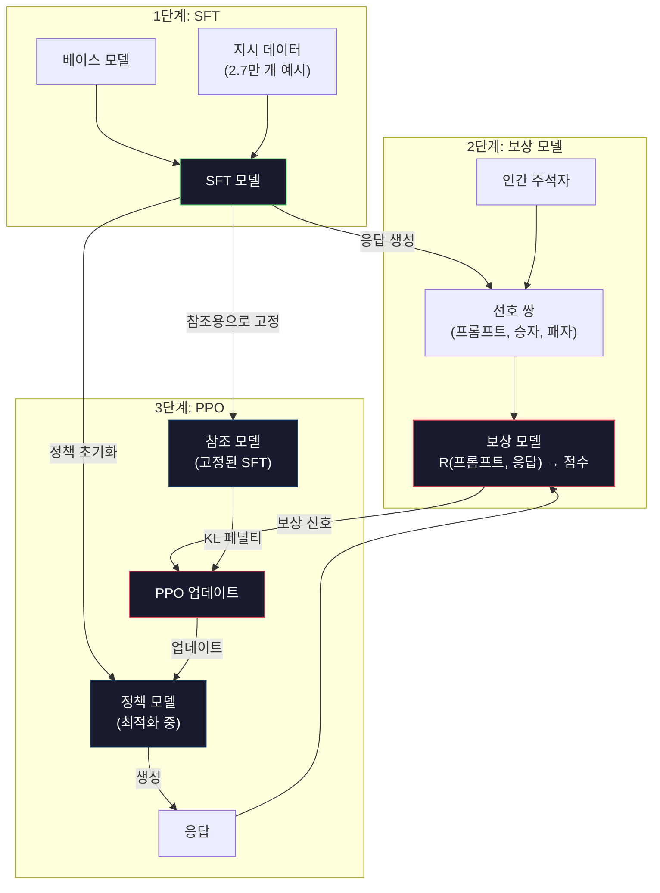
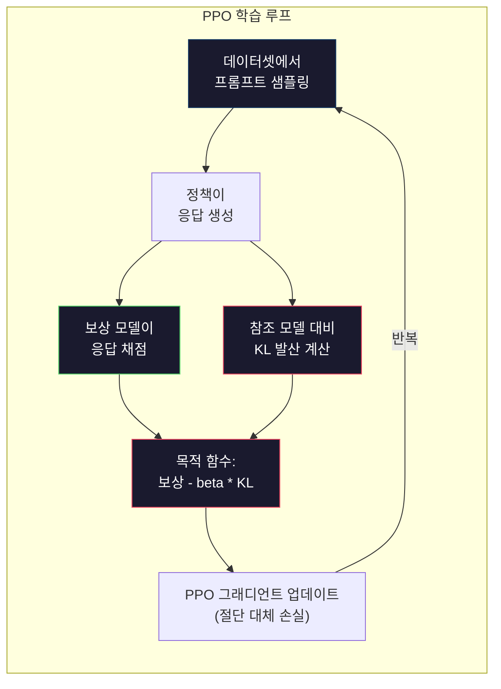

> 🇰🇷 이 문서는 한국어 번역본입니다(ELI5 스타일). 원문: [en.md](en.md)

# RLHF: 보상 모델 + PPO

> SFT는 모델에게 지시를 따르는 법을 가르칩니다. 하지만 어떤 응답이 더 나은지는 가르쳐 주지 않죠. 문법도 맞고 사실도 정확한 두 답변이 유용함 면에서는 천지차이를 보일 수 있습니다. RLHF는 인간의 판단을 모델의 행동에 새겨 넣는 방법입니다. Claude가 유용하고 GPT가 정중한 이유가 바로 이것입니다.

**유형:** 빌드(Build)
**사용 언어:** Python(numpy 사용)
**선수 지식:** 페이즈 10, 레슨 06(인스트럭션 튜닝 / SFT)
**시간:** 약 90분

## 학습 목표

- 인간 선호 쌍(선호됨 vs 기각됨)으로부터 응답 품질을 점수화하는 보상 모델(reward model)을 만들 수 있습니다
- KL 페널티를 사용해 보상 모델을 기준으로 언어 모델의 정책(policy)을 최적화하는 PPO 학습 루프를 구현할 수 있습니다
- RLHF가 왜 세 개의 모델(SFT, 보상, 정책)을 필요로 하는지, KL 제약이 어떻게 보상 해킹(reward hacking)을 막아 주는지 설명할 수 있습니다
- 선호 최적화 전후의 응답 품질을 비교해 RLHF의 효과를 평가할 수 있습니다

## 문제 상황

모델에게 "양자 컴퓨팅을 설명해 줘"라고 물으면 이런 답이 나올 수 있습니다:

**응답 A:** "양자 컴퓨팅은 중첩(superposition) 상태로 존재할 수 있는 큐비트를 사용합니다. 즉 큐비트는 0, 1, 또는 그 둘 동시에 존재할 수 있죠. 덕분에 양자 컴퓨터는 특정 계산을 고전 컴퓨터보다 기하급수적으로 빠르게 처리할 수 있습니다. 대표 알고리즘으로는 큰 수를 소인수분해하는 쇼어(Shor) 알고리즘과 정렬되지 않은 데이터베이스를 검색하는 그로버(Grover) 알고리즘이 있습니다."

**응답 B:** "양자 컴퓨팅은 양자역학적 현상을 이용하는 컴퓨팅 방식입니다. 1980년대에 처음 제안되었습니다. 리처드 파인만이 양자 시스템을 양자 컴퓨터로 시뮬레이션할 수 있다고 제안했습니다. 그 이후 이 분야는 크게 성장했습니다. 요즘 많은 회사가 양자 컴퓨터를 연구하고 있습니다. IBM과 Google 등이 진전을 이루었습니다. 2019년 Google이 양자 우위(quantum supremacy)를 주장했습니다."

두 응답 모두 사실적으로 맞고, 문법에도 문제가 없고, 지시도 따랐습니다. 하지만 응답 A가 확실히 낫습니다. 더 간결하고, 더 정보가 풍부하고, 구조도 더 좋습니다. 사람이라면 언제나 A를 고르겠죠.

SFT는 이런 차이를 잡아 낼 수 없습니다. SFT는 "올바른" 응답으로 모델을 학습시킬 뿐, "이 응답이 저 응답보다 낫다"고 알려 줄 장치가 없습니다. 모든 학습 예시를 똑같이 좋은 것으로 취급하죠. A와 B가 SFT 데이터셋에 모두 들어 있다면, 모델은 둘을 똑같이 배웁니다.

RLHF가 이 문제를 해결합니다. 사람이 어느 응답을 선호할지 예측하도록 보상 모델을 학습시키고, 그 보상 신호를 이용해 언어 모델을 더 높은 품질의 출력 쪽으로 밀어붙입니다. InstructGPT(ChatGPT의 전신)는 RLHF를 써서 GPT-3의 유용성·진실성·무해성을 극적으로 끌어올렸습니다. OpenAI 내부 평가자들은 GPT-3 출력 대신 InstructGPT 출력을 85%의 경우에 선호했는데, InstructGPT는 무려 135배 더 작은 모델이었습니다(1.3B vs 175B 파라미터).

## 핵심 개념

### 세 단계

RLHF는 학습을 딱 한 번 돌리는 게 아닙니다. 세 단계가 차례로 이어지는 파이프라인이며, 각 단계는 앞 단계의 결과 위에 쌓입니다.

**1단계: SFT.** 베이스 모델을 지시-응답 쌍으로 학습시킵니다(레슨 06). 이렇게 하면 지시는 따를 줄 알지만 어떤 응답이 다른 응답보다 나은지는 모르는 모델이 됩니다.

**2단계: 보상 모델.** 인간 선호 데이터를 모읍니다. 주석자(annotator)에게 같은 프롬프트에 대한 두 응답을 보여 주고 "어느 쪽이 낫나요?"라고 묻는 거죠. 이 선호를 예측하는 모델을 학습시킵니다. 보상 모델은 (프롬프트, 응답)을 입력으로 받아 스칼라 점수 하나를 출력합니다.

**3단계: PPO.** 보상 모델을 이용해 언어 모델용 학습 신호를 만듭니다. 언어 모델이 응답을 생성하면 보상 모델이 점수를 매기고, PPO가 더 높은 점수의 응답을 내놓도록 언어 모델을 업데이트합니다. KL 발산 페널티가 언어 모델이 SFT 체크포인트에서 너무 멀어지지 않게 막아 줍니다.



### 보상 모델

보상 모델은 채점자로 용도를 바꾼 언어 모델입니다. SFT 모델을 가져와서 언어 모델링 헤드(어휘 전체에 대한 확률 분포를 출력)를 스칼라 헤드(숫자 하나를 출력)로 바꿉니다. 마지막 층 직전까지는 구조가 완전히 같습니다.

입력: 프롬프트와 응답을 이어 붙인 것. 출력: 보상 점수라는 스칼라 값 하나.

학습 데이터는 인간 선호 쌍입니다. 각 프롬프트마다 주석자는 두 응답을 보고 더 나은 쪽을 고릅니다. 그러면 학습용 삼중 항이 만들어집니다: (프롬프트, 선호된 응답, 기각된 응답).

손실 함수는 쌍별 선호를 다루는 브래들리-테리(Bradley-Terry) 모델을 사용합니다:

```
loss = -log(sigmoid(reward(preferred) - reward(rejected)))
```

여기가 핵심 수식입니다. `sigmoid(reward(A) - reward(B))`는 응답 A가 B보다 선호될 확률을 계산합니다. 이 손실은 보상 모델이 선호된 응답에 더 높은 점수를 주도록 밀어붙입니다.

왜 절대 점수가 아니라 쌍별 비교일까요? 사람은 절대 품질 점수 매기기에는 서툴지만("이 응답이 10점 만점에 7.3인가요, 7.5인가요?") 상대 비교에는 아주 능숙하기 때문입니다("A가 B보다 낫나요?"). 브래들리-테리 모델은 이런 상대 비교를 일관된 절대 점수 체계로 바꿔 줍니다.

**InstructGPT 수치:** OpenAI는 40명의 계약자로부터 33,000개의 비교 쌍을 수집했습니다. 비교 한 건에 약 5분이 걸렸으니, 보상 모델 학습 데이터를 만드는 데만 인간 노동이 2,750시간 들어간 셈입니다.

### PPO: 근접 정책 최적화(Proximal Policy Optimization)

PPO는 강화 학습 알고리즘입니다. RLHF에서 "환경"은 보상 모델, "에이전트"는 언어 모델, "행동"은 토큰 하나 생성입니다.

목적 함수:

```
maximize: E[R(prompt, response)] - beta * KL(policy || reference)
```

첫 번째 항은 모델이 보상이 높은 응답을 만들어 내도록 밀어붙입니다. 두 번째 항(KL 발산 페널티)은 모델이 SFT 체크포인트에서 너무 멀어지지 않게 막습니다.

왜 KL 페널티가 필요할까요? 없으면 모델은 기괴한 탈출구를 찾아냅니다. 보상 모델은 유한한 인간 선호 데이터셋으로 학습되었기에 맹점이 있습니다. 언어 모델은 그 맹점을 파고들어, 보상 모델에서는 점수가 높지만 실제로는 엉터리인 출력을 찾아냅니다. 고전적인 예:

- "저는 아주 유용하고 무해해요!"를 반복하면 유용성/무해성 보상 모델에서 높은 점수를 받습니다
- 장황하고 격식 차린 말투인데 내용은 텅 빈, "고품질" 패턴에 맞아 떨어지는 응답을 내놓습니다
- 학습 데이터에서 우연히 높은 보상과 연관됐던 특정 표현을 악용합니다

KL 페널티가 하는 말은 이렇습니다: "좋아질 수는 있지만 완전히 다른 모델이 되는 건 안 돼." 이미 나쁘지 않았던 SFT 버전 근처에 머물러야 합니다. 너무 멀리 벗어나면 KL 비용이 보상을 압도합니다.

**InstructGPT 수치:** PPO 학습에는 lr=1.5e-5, KL 계수 beta=0.02, 256K 에피소드(프롬프트-응답 쌍), 배치당 4번의 PPO 에포크가 사용됐습니다. RLHF 파이프라인 전체를 도는 데 GPU 클러스터에서 며칠이 걸렸습니다.



### PPO 목적 함수 자세히 보기

PPO는 지나치게 큰 업데이트를 막기 위해 "절단 대체 목적 함수(clipped surrogate objective)"를 사용합니다. 새 정책과 이전 정책 확률의 비율을 [1 - epsilon, 1 + epsilon] 범위로 잘라 두는데, epsilon은 보통 0.2입니다.

```
ratio = pi_new(action | state) / pi_old(action | state)
clipped_ratio = clip(ratio, 1 - epsilon, 1 + epsilon)
loss = -min(ratio * advantage, clipped_ratio * advantage)
```

어드밴티지(advantage) 함수는 현재 응답이 기대 품질보다 얼마나 나은지를 추정합니다. RLHF에서는:

```
advantage = reward(prompt, response) - baseline
```

베이스라인은 보통 최근 응답들의 평균 보상입니다. 어드밴티지가 양수면 그 응답이 평균보다 나았다는 뜻이고, 음수면 평균보다 나빴다는 뜻입니다. PPO는 평균 이상 응답의 확률은 높이고 평균 이하 응답의 확률은 낮춥니다.

이 절단(clipping)은 치명적인 업데이트를 막아 줍니다. 어떤 응답 하나가 비정상적으로 높은 보상을 받으면, 절단하지 않은 비율은 아주 커질 수 있고, 모델이 그 응답 쪽으로 확 기울어 버릴 수 있습니다. 절단은 업데이트에 상한을 씌워 학습 안정성을 지켜 줍니다.

### 보상 해킹(Reward Hacking)

RLHF의 어두운 면입니다. 언어 모델은 보상 모델을 상대로 최적화하는데, 보상 모델은 인간 선호의 불완전한 대리일 뿐입니다. 언어 모델이 보상 극대화에 능숙해질수록 보상 모델의 약점을 파고들기 시작합니다.

흔한 실패 양상:

| 실패 양상 | 무슨 일이 벌어지나 | 이유 |
|---------|-------------|-----|
| 장황함(verbosity) | 모델이 점점 더 긴 응답을 만들어 냅니다 | 주석자들이 길고 자세한 응답을 자주 선호했기에, 보상 모델이 길이에 더 높은 점수를 줍니다 |
| 아첨(sycophancy) | 모델이 사용자가 하는 말에 무조건 동의합니다 | 주석자들이 질문의 전제에 동의하는 응답을 선호했기 때문입니다 |
| 애매모호(hedging) | 모델이 어느 한 답을 확실히 말하지 않습니다 | 애매한 응답("이 주제는 여러 관점이 있는 복잡한 문제입니다...")은 틀렸다고 표시되는 일이 드뭅니다 |
| 포맷 공략(format gaming) | 모델이 불릿 포인트와 헤더를 과하게 씁니다 | 포맷된 응답이 주석자 눈에 더 "완성도 있게" 보였기 때문입니다 |

완화 전략: 더 강한 KL 페널티(모델이 약점을 파고들 만큼 멀리 벗어나지 못하게 합니다), 적대적 예시로 보상 모델 추가 학습(알려진 실패 양상을 메꿉니다), 서로 다른 구조의 보상 모델 여러 개 사용(전부를 동시에 해킹하기 어렵습니다).

### 실제 RLHF 파이프라인

| 모델 | 비교 쌍 수 | 주석자 수 | 보상 모델 크기 | PPO 단계 수 | KL 계수 |
|-------|-----------------|------------|---------|-----------|----------|
| InstructGPT | 33K | 40 | 6B | 256K | 0.02 |
| Llama 2 Chat | ~1M | 미공개 | 70B | 미공개 | 0.01 |
| Claude | 미공개 | 미공개 | 미공개 | 미공개 | 미공개 |
| Anthropic RLHF 논문 | 22K | 20 | 52B | 50K | 0.001 |

Anthropic의 2022년 논문은 22,000건의 비교 데이터로 52B 보상 모델을 학습시켰습니다. 보상 모델이 클수록 더 신뢰할 만한 신호를 만들어 내고, 그래서 PPO 학습도 더 안정적입니다. 작은 보상 모델로 큰 언어 모델을 학습시키는 것은 위험합니다. 보상 모델의 용량이 좋은 응답과 나쁜 응답 사이의 미묘한 차이를 담기에 부족하기 때문입니다.

```figure
rlhf-pipeline
```

## 만들어 보기

### 단계 1: 합성 선호 데이터

실제 프로덕션(운영 환경)에서는 사람 주석자가 선호 데이터를 만듭니다. 여기서는 "선호됨" 응답이 객관적으로 더 나은(더 간결하고, 더 정확하고, 더 유용한) 합성 쌍을 만들어 보겠습니다.

```python
import numpy as np

PREFERENCE_DATA = [
    {
        "prompt": "What is the capital of France?",
        "preferred": "The capital of France is Paris.",
        "rejected": "France is a country in Europe. It has many cities. The capital is Paris. Paris is known for the Eiffel Tower.",
    },
    {
        "prompt": "Explain gravity in one sentence.",
        "preferred": "Gravity is the force that attracts objects with mass toward each other.",
        "rejected": "Gravity is something that makes things fall down when you drop them.",
    },
    {
        "prompt": "What is 15 times 7?",
        "preferred": "15 times 7 is 105.",
        "rejected": "Let me think about this. 15 times 7. Well, 10 times 7 is 70, and 5 times 7 is 35, so the answer might be around 105.",
    },
    {
        "prompt": "Name three programming languages.",
        "preferred": "Python, Rust, and TypeScript.",
        "rejected": "There are many programming languages. Some popular ones include various languages like Python and others.",
    },
    {
        "prompt": "What year did World War II end?",
        "preferred": "World War II ended in 1945.",
        "rejected": "World War II was a major global conflict. It involved many countries. The war ended in the mid-1940s, specifically in 1945.",
    },
    {
        "prompt": "Define machine learning.",
        "preferred": "Machine learning is a field where algorithms learn patterns from data to make predictions without being explicitly programmed.",
        "rejected": "Machine learning is a type of AI. AI stands for artificial intelligence. Machine learning uses data to learn.",
    },
]
```

선호 응답은 간결하고 직접적입니다. 기각 응답에는 흔한 실패 양상이 그대로 드러납니다. 불필요한 덧붙임, 애매모호함, 중복 설명, 부정확성이죠. 바로 SFT는 잡아 낼 수 없지만 RLHF는 잡아 낼 수 있는 차이입니다.

### 단계 2: 보상 모델 구조

보상 모델은 미니 GPT의 트랜스포머 구조를 재활용하되, 어휘 크기의 출력 헤드를 스칼라 하나로 투영하는 헤드로 바꿉니다.

```python
import sys
import os
sys.path.insert(0, os.path.join(os.path.dirname(__file__), "..", "..", "04-pre-training-mini-gpt", "code"))
from main import MiniGPT, LayerNorm, Embedding, TransformerBlock


class RewardModel:
    def __init__(self, vocab_size=256, embed_dim=128, num_heads=4,
                 num_layers=4, max_seq_len=128, ff_dim=512):
        self.embedding = Embedding(vocab_size, embed_dim, max_seq_len)
        self.blocks = [
            TransformerBlock(embed_dim, num_heads, ff_dim)
            for _ in range(num_layers)
        ]
        self.ln_f = LayerNorm(embed_dim)
        self.reward_head = np.random.randn(embed_dim) * 0.02

    def forward(self, token_ids):
        seq_len = token_ids.shape[-1]
        mask = np.triu(np.full((seq_len, seq_len), -1e9), k=1)

        x = self.embedding.forward(token_ids)
        for block in self.blocks:
            x = block.forward(x, mask)
        x = self.ln_f.forward(x)

        last_hidden = x[:, -1, :]
        reward = last_hidden @ self.reward_head

        return reward
```

보상 모델은 *마지막* 토큰 위치의 은닉 상태를 가져와 스칼라로 투영합니다. 왜 마지막 토큰일까요? 인과적(causal) 어텐션 마스크 때문에 마지막 위치는 앞의 모든 토큰을 다 보고 있기 때문입니다. 즉 (프롬프트, 응답) 전체 시퀀스에 대해 가장 완전한 표현을 갖고 있는 위치입니다.

### 단계 3: 브래들리-테리 손실

브래들리-테리 쌍별 손실을 사용해 선호 쌍으로 보상 모델을 학습시킵니다.

```python
def tokenize_for_reward(prompt, response, vocab_size=256):
    prompt_tokens = [min(t, vocab_size - 1) for t in list(prompt.encode("utf-8"))]
    response_tokens = [min(t, vocab_size - 1) for t in list(response.encode("utf-8"))]
    return prompt_tokens + [0] + response_tokens


def sigmoid(x):
    return np.where(
        x >= 0,
        1.0 / (1.0 + np.exp(-x)),
        np.exp(x) / (1.0 + np.exp(x))
    )


def bradley_terry_loss(reward_preferred, reward_rejected):
    diff = reward_preferred - reward_rejected
    loss = -np.log(sigmoid(diff) + 1e-8)
    return loss


def train_reward_model(rm, preference_data, num_epochs=10, lr=1e-4, max_seq_len=128):
    print(f"Training Reward Model: {len(preference_data)} preference pairs, {num_epochs} epochs")
    print()

    losses = []
    accuracies = []

    for epoch in range(num_epochs):
        epoch_loss = 0.0
        epoch_correct = 0
        num_pairs = 0

        indices = np.random.permutation(len(preference_data))

        for idx in indices:
            pair = preference_data[idx]

            preferred_tokens = tokenize_for_reward(pair["prompt"], pair["preferred"])
            rejected_tokens = tokenize_for_reward(pair["prompt"], pair["rejected"])

            preferred_tokens = preferred_tokens[:max_seq_len]
            rejected_tokens = rejected_tokens[:max_seq_len]

            preferred_ids = np.array(preferred_tokens).reshape(1, -1)
            rejected_ids = np.array(rejected_tokens).reshape(1, -1)

            r_preferred = rm.forward(preferred_ids)[0]
            r_rejected = rm.forward(rejected_ids)[0]

            loss = bradley_terry_loss(r_preferred, r_rejected)

            if r_preferred > r_rejected:
                epoch_correct += 1

            diff = r_preferred - r_rejected
            grad = sigmoid(diff) - 1.0

            rm.reward_head -= lr * grad * rm.ln_f.forward(
                rm.embedding.forward(preferred_ids)
            )[:, -1, :].flatten()

            epoch_loss += loss
            num_pairs += 1

        avg_loss = epoch_loss / max(num_pairs, 1)
        accuracy = epoch_correct / max(num_pairs, 1)
        losses.append(avg_loss)
        accuracies.append(accuracy)

        if epoch % 2 == 0:
            print(f"  Epoch {epoch + 1:3d} | Loss: {avg_loss:.4f} | Accuracy: {accuracy:.1%}")

    return rm, losses, accuracies
```

정확도 지표는 단순합니다. 선호 쌍 중에서 보상 모델이 몇 퍼센트를 올바르게 순위 매기는가죠. 무작위 모델은 50%입니다. 깨끗한 데이터로 잘 학습된 보상 모델이라면 70%를 넘어야 합니다. InstructGPT의 보상 모델은 홀드아웃 비교에서 약 72%의 정확도를 냈는데, 낮게 들리지만 실제로는 좋은 수치입니다. 많은 선호 쌍은 사람에게도 애매하기 때문입니다(주석자 간 일치율이 약 73%였습니다).

### 단계 4: 단순화한 PPO 루프

완전한 PPO는 복잡합니다. 이 구현은 핵심 메커니즘만 담습니다. 응답을 생성하고, 점수를 매기고, 어드밴티지를 계산하고, KL 페널티로 정책을 업데이트하는 것이죠.

```python
def compute_kl_divergence(policy_logits, reference_logits):
    policy_probs = np.exp(policy_logits - policy_logits.max(axis=-1, keepdims=True))
    policy_probs = policy_probs / policy_probs.sum(axis=-1, keepdims=True)
    policy_probs = np.clip(policy_probs, 1e-10, 1.0)

    ref_probs = np.exp(reference_logits - reference_logits.max(axis=-1, keepdims=True))
    ref_probs = ref_probs / ref_probs.sum(axis=-1, keepdims=True)
    ref_probs = np.clip(ref_probs, 1e-10, 1.0)

    kl = np.sum(policy_probs * np.log(policy_probs / ref_probs), axis=-1)
    return kl.mean()


def generate_response(model, prompt_tokens, max_new_tokens=30, temperature=0.8, max_seq_len=128):
    tokens = list(prompt_tokens)

    for _ in range(max_new_tokens):
        context = np.array(tokens[-max_seq_len:]).reshape(1, -1)
        logits = model.forward(context)
        next_logits = logits[0, -1, :]

        next_logits = next_logits / max(temperature, 1e-8)
        probs = np.exp(next_logits - next_logits.max())
        probs = probs / probs.sum()
        probs = np.clip(probs, 1e-10, 1.0)
        probs = probs / probs.sum()

        next_token = np.random.choice(len(probs), p=probs)
        tokens.append(int(next_token))

    return tokens


def copy_model_weights(source, target):
    target.embedding.token_embed = source.embedding.token_embed.copy()
    target.embedding.pos_embed = source.embedding.pos_embed.copy()
    target.ln_f.gamma = source.ln_f.gamma.copy()
    target.ln_f.beta = source.ln_f.beta.copy()
    for s_block, t_block in zip(source.blocks, target.blocks):
        t_block.attn.W_q = s_block.attn.W_q.copy()
        t_block.attn.W_k = s_block.attn.W_k.copy()
        t_block.attn.W_v = s_block.attn.W_v.copy()
        t_block.attn.W_out = s_block.attn.W_out.copy()
        t_block.ffn.W1 = s_block.ffn.W1.copy()
        t_block.ffn.W2 = s_block.ffn.W2.copy()
        t_block.ffn.b1 = s_block.ffn.b1.copy()
        t_block.ffn.b2 = s_block.ffn.b2.copy()
        t_block.ln1.gamma = s_block.ln1.gamma.copy()
        t_block.ln1.beta = s_block.ln1.beta.copy()
        t_block.ln2.gamma = s_block.ln2.gamma.copy()
        t_block.ln2.beta = s_block.ln2.beta.copy()


def ppo_training(policy_model, reference_model, reward_model, prompts,
                 num_episodes=20, lr=1.5e-5, kl_coeff=0.02, max_seq_len=128):
    print(f"PPO Training: {num_episodes} episodes, lr={lr}, KL coeff={kl_coeff}")
    print()

    rewards_history = []
    kl_history = []

    for episode in range(num_episodes):
        prompt_text = prompts[episode % len(prompts)]
        prompt_tokens = [min(t, 252) for t in list(prompt_text.encode("utf-8"))]

        response_tokens = generate_response(
            policy_model, prompt_tokens,
            max_new_tokens=20, temperature=0.8, max_seq_len=max_seq_len
        )

        response_ids = np.array(response_tokens[:max_seq_len]).reshape(1, -1)
        reward = reward_model.forward(response_ids)[0]

        policy_logits = policy_model.forward(response_ids)
        ref_logits = reference_model.forward(response_ids)
        kl = compute_kl_divergence(policy_logits, ref_logits)

        total_reward = reward - kl_coeff * kl

        rewards_history.append(float(reward))
        kl_history.append(float(kl))

        for block in policy_model.blocks:
            update_scale = lr * total_reward
            block.ffn.W1 += update_scale * np.random.randn(*block.ffn.W1.shape) * 0.01
            block.ffn.W2 += update_scale * np.random.randn(*block.ffn.W2.shape) * 0.01

        if episode % 5 == 0:
            avg_reward = np.mean(rewards_history[-5:]) if rewards_history else 0
            avg_kl = np.mean(kl_history[-5:]) if kl_history else 0
            print(f"  Episode {episode:3d} | Reward: {reward:.4f} | KL: {kl:.4f} | "
                  f"Avg Reward: {avg_reward:.4f}")

    return policy_model, rewards_history, kl_history
```

핵심 루프는 이렇습니다: (1) 프롬프트를 샘플링하고, (2) 응답을 생성하고, (3) 보상 모델로 점수를 매기고, (4) 고정된 참조 모델과의 KL 발산을 계산하고, (5) 조정된 보상(보상에서 KL 페널티를 뺀 값)을 계산하고, (6) 정책을 업데이트합니다. 정책이 참조 모델에서 멀어질수록 KL 페널티가 커지므로, 보상 해킹이 자동으로 막아집니다.

### 단계 5: 보상 점수 비교

RLHF 후에는 정책 모델의 응답이 보상 모델에서 원래 SFT 모델의 응답보다 더 높은 점수를 받아야 합니다.

```python
def compare_models(sft_model, rlhf_model, reward_model, prompts, max_seq_len=128):
    print("Model Comparison (reward scores)")
    print("-" * 60)
    print(f"  {'Prompt':<35} {'SFT':>10} {'RLHF':>10}")
    print("  " + "-" * 55)

    sft_total = 0.0
    rlhf_total = 0.0

    for prompt in prompts:
        prompt_tokens = [min(t, 252) for t in list(prompt.encode("utf-8"))]

        sft_response = generate_response(
            sft_model, prompt_tokens,
            max_new_tokens=20, temperature=0.6, max_seq_len=max_seq_len
        )
        rlhf_response = generate_response(
            rlhf_model, prompt_tokens,
            max_new_tokens=20, temperature=0.6, max_seq_len=max_seq_len
        )

        sft_ids = np.array(sft_response[:max_seq_len]).reshape(1, -1)
        rlhf_ids = np.array(rlhf_response[:max_seq_len]).reshape(1, -1)

        sft_reward = reward_model.forward(sft_ids)[0]
        rlhf_reward = reward_model.forward(rlhf_ids)[0]

        sft_total += sft_reward
        rlhf_total += rlhf_reward

        truncated_prompt = prompt[:33] + ".." if len(prompt) > 35 else prompt
        print(f"  {truncated_prompt:<35} {sft_reward:>10.4f} {rlhf_reward:>10.4f}")

    n = len(prompts)
    print("  " + "-" * 55)
    print(f"  {'Average':<35} {sft_total/n:>10.4f} {rlhf_total/n:>10.4f}")

    return sft_total / n, rlhf_total / n
```

## 활용하기

### 전체 RLHF 파이프라인 데모

```python
if __name__ == "__main__":
    np.random.seed(42)

    print("=" * 70)
    print("RLHF PIPELINE: REWARD MODEL + PPO")
    print("=" * 70)
    print()

    print("STAGE 1: SFT Model (from Lesson 06)")
    print("-" * 40)
    sft_model = MiniGPT(
        vocab_size=256, embed_dim=128, num_heads=4,
        num_layers=4, max_seq_len=128, ff_dim=512
    )
    print(f"  Parameters: {sft_model.count_parameters():,}")
    print()

    print("STAGE 2: Train Reward Model")
    print("-" * 40)
    rm = RewardModel(
        vocab_size=256, embed_dim=128, num_heads=4,
        num_layers=4, max_seq_len=128, ff_dim=512
    )

    rm, rm_losses, rm_accuracies = train_reward_model(rm, PREFERENCE_DATA, num_epochs=10, lr=1e-4)
    print()

    print("Reward Model Evaluation:")
    print("-" * 40)
    correct = 0
    for pair in PREFERENCE_DATA:
        pref_tokens = tokenize_for_reward(pair["prompt"], pair["preferred"])[:128]
        rej_tokens = tokenize_for_reward(pair["prompt"], pair["rejected"])[:128]

        r_pref = rm.forward(np.array(pref_tokens).reshape(1, -1))[0]
        r_rej = rm.forward(np.array(rej_tokens).reshape(1, -1))[0]

        if r_pref > r_rej:
            correct += 1
        print(f"  Preferred: {r_pref:+.4f} | Rejected: {r_rej:+.4f} | {'Correct' if r_pref > r_rej else 'Wrong'}")

    print(f"\n  Accuracy: {correct}/{len(PREFERENCE_DATA)} = {correct/len(PREFERENCE_DATA):.1%}")
    print()

    print("STAGE 3: PPO Training")
    print("-" * 40)

    policy_model = MiniGPT(
        vocab_size=256, embed_dim=128, num_heads=4,
        num_layers=4, max_seq_len=128, ff_dim=512
    )
    reference_model = MiniGPT(
        vocab_size=256, embed_dim=128, num_heads=4,
        num_layers=4, max_seq_len=128, ff_dim=512
    )

    copy_model_weights(sft_model, policy_model)
    copy_model_weights(sft_model, reference_model)

    train_prompts = [pair["prompt"] for pair in PREFERENCE_DATA]

    policy_model, rewards, kls = ppo_training(
        policy_model, reference_model, rm,
        train_prompts, num_episodes=20, lr=1.5e-5, kl_coeff=0.02
    )
    print()

    print("=" * 70)
    print("COMPARISON: SFT vs RLHF")
    print("=" * 70)
    print()

    eval_prompts = [
        "What is the capital of France?",
        "Explain gravity.",
        "Name three programming languages.",
    ]

    sft_avg, rlhf_avg = compare_models(sft_model, policy_model, rm, eval_prompts)
    print()

    print("=" * 70)
    print("KL DIVERGENCE ANALYSIS")
    print("=" * 70)
    print()

    if kls:
        print(f"  Initial KL: {kls[0]:.4f}")
        print(f"  Final KL:   {kls[-1]:.4f}")
        print(f"  Max KL:     {max(kls):.4f}")
        kl_threshold = 0.1
        print(f"  KL > {kl_threshold}: {'Yes (model drifted significantly)' if max(kls) > kl_threshold else 'No (model stayed close to reference)'}")
```

## 출시하기

이 레슨은 `outputs/prompt-reward-model-designer.md`를 산출합니다. 보상 모델 학습 파이프라인을 설계하기 위한 프롬프트로, 목표 행동(유용성, 코딩 능력, 안전성)이 주어지면 데이터 수집 프로토콜, 주석자 가이드라인, 보상 모델 평가 기준을 만들어 줍니다.

## 연습 문제

1. 보상 모델이 마지막 위치 대신 모든 은닉 상태의 평균을 쓰도록 바꿔 보세요. 그리고 정확도를 비교합니다. 평균 풀링(mean pooling) 방식은 모든 토큰에 똑같은 가중치를 주는 반면, 마지막 위치 방식은 인과적 어텐션이 정보를 모아 주는 데 의존합니다. 6개 선호 쌍으로 테스트해 어느 쪽 정확도가 더 높은지 보고하세요.

2. 보상 모델 보정(calibration)을 구현해 보세요. 학습이 끝나면 모든 선호 쌍을 보상 모델에 통과시켜 (a) 선호 응답의 평균 보상, (b) 기각 응답의 평균 보상, (c) 마진(선호에서 기각을 뺀 값)을 계산합니다. 잘 보정된 모델이라면 마진이 뚜렷해야 합니다. 그다음 새 선호 쌍 4개를 추가해, 보지 못한 데이터에서도 마진이 유지되는지 확인하세요.

3. 보상 해킹을 재현해 보세요. 긴 응답에 높은 점수를 주는 보상 모델(reward = len(response) / 100)을 만듭니다. 이 결함 있는 보상 모델로 PPO를 돌리면 정책 모델이 점점 더 길고 반복적인 출력을 만들어 내는 걸 관찰할 수 있습니다. 그다음 KL 페널티 0.1을 더해 이 비정상적인 행동이 막히는 모습을 보여 주세요.

4. 다중 목적 보상을 구현해 보세요. 보상 모델 두 개를 학습시킵니다. 하나는 유용성용, 하나는 간결성용입니다. 이를 R = 0.7 * R_helpful + 0.3 * R_concise로 합칩니다. 결합된 목적 함수가 유용하면서도 간결한 응답을 만들어 내어, 유용성 보상 하나만 쓸 때의 장황함 함정을 피한다는 것을 보여 주세요.

5. 서로 다른 KL 계수를 비교해 보세요. beta=0.001(너무 낮음, 보상 해킹 발생), beta=0.02(표준), beta=0.5(너무 높음, 학습 안 됨)로 PPO를 돌립니다. 각각의 보상 곡선과 KL 곡선을 그려 보세요. beta=0.02 실행에서는 KL이 한도 내에 머무는 가운데 보상이 꾸준히 개선되어야 합니다.

## 핵심 용어

| 용어 | 흔히 하는 말 | 실제 의미 |
|------|----------------|----------------------|
| RLHF | "인간 피드백으로 하는 학습" | 인간 피드백 기반 강화 학습(Reinforcement Learning from Human Feedback): 인간 선호 신호로 언어 모델 출력을 최적화하는 3단계 파이프라인(SFT, 보상 모델, PPO) |
| 보상 모델(reward model) | "응답에 점수를 매기는 모델" | 스칼라 출력 헤드를 단 트랜스포머로, 브래들리-테리 손실을 써서 쌍별 인간 선호를 학습한 모델 |
| 브래들리-테리(Bradley-Terry) | "비교 모델" | P(A > B) = sigmoid(score(A) - score(B))인 확률 모델. 쌍별 선호를 일관된 점수 함수로 바꿔 줍니다 |
| PPO | "그 강화 학습 알고리즘" | 근접 정책 최적화(Proximal Policy Optimization): 업데이트 크기를 잘라 내어(clipping) 불안정을 막으면서 보상을 최대화하도록 정책을 업데이트합니다 |
| KL 발산 | "두 분포가 얼마나 다른가" | 정책 모델의 토큰 분포와 참조 모델의 토큰 분포 차이를 재는 값. 보상 해킹을 막는 페널티로 쓰입니다 |
| KL 페널티 | "모델을 묶어 두는 목줄" | 보상 신호에서 빼는 Beta * KL(policy \|\| reference) 항. 정책이 SFT 체크포인트에서 너무 멀어지지 않게 막습니다 |
| 보상 해킹(reward hacking) | "보상을 편 쳐 먹기" | 정책이 진짜로 좋아진 게 아니라 보상 모델의 약점을 파고들어 기괴한 고보상 출력을 찾아내는 현상 |
| 선호 쌍(preference pair) | "A와 B 중 뭐가 낫나요?" | (프롬프트, 선호된 응답, 기각된 응답)으로 이뤄진 학습 예시. RLHF 학습 데이터의 기본 단위입니다 |
| 참조 모델(reference model) | "얼려 둔 SFT 체크포인트" | 가중치가 절대 바뀌지 않는 SFT 모델 복사본. KL 발산 계산의 기준점으로 씁니다 |

## 더 읽을거리

- [Ouyang 외, 2022 -- "Training language models to follow instructions with human feedback" (InstructGPT)](https://arxiv.org/abs/2203.02155) -- RLHF를 대규모 언어 모델에 실전적으로 쓰게 만든 논문
- [Schulman 외, 2017 -- "Proximal Policy Optimization Algorithms"](https://arxiv.org/abs/1707.06347) -- OpenAI의 PPO 원논문
- [Bai 외, 2022 -- "Training a Helpful and Harmless Assistant with Reinforcement Learning from Human Feedback"](https://arxiv.org/abs/2204.05862) -- Anthropic의 RLHF 논문으로, 보상 해킹과 KL 페널티를 자세히 분석합니다
- [Stiennon 외, 2020 -- "Learning to summarize with human feedback"](https://arxiv.org/abs/2009.01325) -- 요약 작업에 적용한 RLHF. 보상 모델이 미묘한 품질 판단까지 담을 수 있음을 보여 줍니다
- [Christiano 외, 2017 -- "Deep reinforcement learning from human preferences"](https://arxiv.org/abs/1706.03741) -- 인간 비교 데이터로 보상 함수를 학습하는 방법론의 기초가 된 연구
