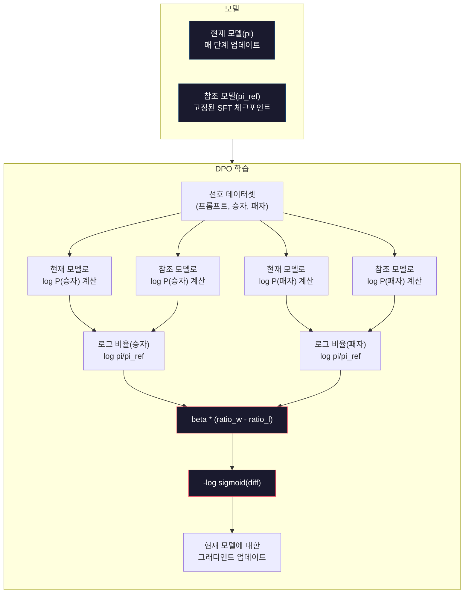

> 🇰🇷 이 문서는 한국어 번역본입니다(ELI5 스타일). 원문: [en.md](en.md)

# DPO: 직접 선호 최적화(Direct Preference Optimization)

> RLHF는 잘 동작합니다. 하지만 모델 세 개(SFT, 보상 모델, 정책)를 학습시키고, PPO의 불안정함을 다스리고, KL 페널티까지 조정해야 하죠. DPO는 이렇게 묻습니다. "그걸 전부 건너뛰면 안 될까?" DPO는 선호 쌍으로 언어 모델을 직접 최적화합니다. 보상 모델 없이. PPO 없이. 학습 루프 하나로. 결과는 같습니다.

**유형:** 빌드(Build)
**사용 언어:** Python(numpy 사용)
**선수 지식:** 페이즈 10, 레슨 07(RLHF)
**시간:** 약 90분

## 학습 목표

- 별도의 보상 모델 없이 선호 쌍으로 언어 모델을 직접 최적화하는 DPO 학습을 구현할 수 있습니다
- DPO 손실 함수를 유도하고, 정책의 로그 확률을 통해 보상 모델이 어떻게 암시적으로 표현되는지 설명할 수 있습니다
- 학습 안정성, 컴퓨팅 비용, 필요한 모델 수 측면에서 DPO와 RLHF를 비교할 수 있습니다
- beta 파라미터를 조정해 학습된 정책이 참조 모델에서 얼마나 벗어날 수 있는지 제어할 수 있습니다

## 문제 상황

레슨 07에서 RLHF 파이프라인을 만들어 봤습니다. 세 단계. 세 모델. SFT 모델, 보상 모델, 그리고 PPO로 최적화한 정책 모델이죠. 보상 모델 하나를 만드는 데만 수천 개의 인간 선호 쌍과 별도의 학습 루프가 필요했습니다. PPO는 KL 계수, 학습률, 클립 비율, 에포크 수를 정성껏 조정해야 했습니다.

실전에서 PPO 학습은 불안정하기로 악명 높습니다. 하이퍼파라미터를 조금만 바꿔도 학습이 발산하곤 하죠. 보상 모델은 인간 선호의 불완전한 대리라서, 정책은 그 약점을 파고들 방법을 찾아냅니다. KL 페널티가 도움은 되지만 이것도 조정이 필요합니다. 너무 낮으면 보상 해킹이 일어나고, 너무 높으면 모델이 거의 배우지 못합니다.

이런 복잡성 때문에 InstructGPT가 발표된 뒤로도 수년간 대부분의 오픈소스 모델은 RLHF에 고전했습니다. 3단계 파이프라인은 깨지기 쉽습니다. 각 단계마다 자체적인 실패 양상이 있고, 오류는 누적됩니다.

2023년 5월, 스탠퍼드의 Rafael Rafailov, Archit Sharma와 동료들이 "Direct Preference Optimization: Your Language Model is Secretly a Reward Model"을 발표합니다. 핵심 통찰은 이것입니다. 별도의 보상 모델이 필요 없다. 최적 보상 함수는 수학적으로 언어 모델 자신의 토큰 확률로 결정된다. 보상 모델을 완전히 생략하고 선호 쌍으로 언어 모델을 직접 최적화할 수 있습니다.

DPO는 RLHF를 지도 학습 한 단계로 줄여 버립니다. 모델 하나. 손실 함수 하나. 학습 루프 하나. 강화 학습은 없습니다. 대규모로 DPO를 처음 쓴 모델 중 하나인 Zephyr-7B는 여러 벤치마크에서 완전한 RLHF로 학습된 모델과 동등하거나 더 좋은 성적을 냈습니다. Meta는 Llama 3의 정렬 파이프라인에 DPO를 활용했고, Anthropic도 정렬 연구에서 DPO 계열 방법을 인용했습니다.

## 핵심 개념

### 핵심 통찰

RLHF는 이 목적 함수를 최적화합니다:

```
maximize: E[R(x, y)] - beta * KL(pi || pi_ref)
```

여기서 R은 보상 모델, pi는 정책, pi_ref는 참조 모델, beta는 KL 계수입니다.

DPO 논문은 이 목적 함수에 닫힌 형태(closed-form)의 최적해가 존재함을 보였습니다. 임의의 보상 함수 R에 대해 최적 정책은:

```
pi*(y | x) = pi_ref(y | x) * exp(R(x, y) / beta) / Z(x)
```

여기서 Z(x)는 정규화 상수입니다. 식을 정리하면:

```
R(x, y) = beta * log(pi*(y | x) / pi_ref(y | x)) + beta * log Z(x)
```

여기가 돌파구입니다. 보상이 정책 모델의 확률과 참조 모델의 확률만으로 완전히 표현됩니다. 별도의 보상 모델을 학습시킬 필요가 없죠. 보상은 확률 비율 안에 *암시적으로* 들어 있습니다.

이 식을 브래들리-테리 선호 모델에 대입하면:

```
P(y_w > y_l | x) = sigmoid(R(x, y_w) - R(x, y_l))
                  = sigmoid(beta * (log pi(y_w|x)/pi_ref(y_w|x) - log pi(y_l|x)/pi_ref(y_l|x)))
```

두 응답이 같은 프롬프트 x를 조건으로 하기 때문에 Z(x) 항은 서로 소거됩니다. 남는 것은 선호/기각 응답에 대한 정책 모델의 로그 확률과 참조 모델의 로그 확률만으로 이뤄진 함수입니다.

### DPO 손실

```
L_DPO = -log(sigmoid(beta * (log pi(y_w|x)/pi_ref(y_w|x) - log pi(y_l|x)/pi_ref(y_l|x))))
```

항목별로 뜯어 보겠습니다:

- **y_w** = 선호된(이긴) 응답
- **y_l** = 기각된(진) 응답
- **x** = 프롬프트
- **pi** = 현재 모델(학습 중)
- **pi_ref** = 참조 모델(고정된 SFT 체크포인트)
- **beta** = 참조 모델에서의 이탈 정도를 조절하는 온도 파라미터(보통 0.1~0.5)

`log pi(y|x) / pi_ref(y|x)` 비율이 바로 로그 확률 비율입니다. 이 값이 양수면 현재 모델이 참조 모델보다 응답 y에 더 높은 확률을 준다는 뜻이고, 음수면 더 낮은 확률을 준다는 뜻입니다.

DPO 손실은 선호 응답의 로그 확률 비율은 올리고 기각 응답의 비율은 내리도록 모델을 밀어붙입니다. beta 파라미터는 모델이 참조 모델에서 얼마나 과감하게 벗어날 수 있는지 조절합니다. beta가 작으면 큰 이탈이 허용되고, beta가 크면 모델이 참조 모델 근처에 묶여 있습니다.



### DPO가 더 단순한 이유

| 항목 | RLHF (PPO) | DPO |
|--------|-----------|-----|
| 학습할 모델 | 3개 (SFT + 보상 + 정책) | 1개 (정책만) |
| 학습 루프 | 3개 (SFT, 보상 모델 학습, PPO) | 2개 (SFT, DPO) |
| 하이퍼파라미터 | lr, KL 계수, 클립 비율, 보상 모델 lr, 에포크 x3 | lr, beta, 에포크 |
| 보상 모델 | 필요 (별도 학습) | 모델 확률 안에 암시적으로 존재 |
| 강화 학습 알고리즘 | PPO (복잡, 불안정) | 지도 학습 (안정) |
| GPU 메모리 | PPO 중 모델 3-4개 상주 | 2개 (현재 + 참조) |
| 학습 안정성 | 하이퍼파라미터에 민감 | 견고함, SFT와 비슷 |

DPO는 학습 중 메모리에 모델 두 개만 올리면 됩니다. 현재 모델과 고정된 참조 모델이죠. RLHF는 세 개나 네 개가 필요합니다. 정책, 참조, 보상 모델, 그리고 (선택적으로) 가치 함수 베이스라인까지요. 70B 모델이라면 복사본 하나당 FP16 기준 140GB입니다. 보상 모델을 없애서 얻는 메모리 절감은 상당합니다.

### DPO가 RLHF를 이기는 경우

**작은 데이터셋.** 선호 쌍이 5,000~20,000개 수준이면 DPO가 RLHF와 동등하거나 더 나은 경우가 많습니다. RLHF의 보상 모델은 일반화할 만큼 데이터가 필요한데, 데이터가 부족하면 과적합되어 신뢰할 수 없는 보상 신호를 냅니다. DPO는 애초에 보상 모델이 필요 없으니 이 문제를 우회합니다.

**컴퓨팅이 부족할 때.** DPO는 완전한 RLHF의 약 3분의 1 컴퓨팅만 필요합니다(학습 루프가 셋이 아니라 하나). 큰 GPU 클러스터가 없는 팀에게는 이게 실용적인 선택입니다.

**빠른 반복 실험.** 어떤 선호 데이터셋이 최고의 모델을 만드는지 10가지를 시도해 보고 싶다면? DPO는 각 실험을 몇 시간 안에 돌릴 수 있습니다. RLHF는 데이터셋마다 보상 모델을 다시 학습시켜야 하죠.

### RLHF가 DPO를 이기는 경우

**대규모 학습.** GPT-4나 Claude급 규모에서는 RLHF의 별도 보상 모델이 더 미묘한 선호 신호를 담을 수 있습니다. 보상 모델은 복잡한 품질 기준에 맞춰 적응하는, 학습된 손실 함수 역할을 하죠.

**복잡한 보상 신호.** "더 낫다"가 여러 차원(유용성, 무해성, 정직함)으로 나뉠 때, 보상 모델은 이 다목적 트레이드오프를 학습할 수 있습니다. DPO는 각 선호 쌍을 이진 신호(하나는 더 낫고 하나는 더 나쁘다)로만 다룰 뿐, 그 이유까지는 모델링하지 않습니다.

**반복 정렬.** RLHF 파이프라인은 현재 정책으로 새 응답을 만들고, 사람에게 평가받고, 보상 모델을 다시 학습시키는 온라인 루프를 돌릴 수 있습니다. DPO는 고정된 선호 쌍 데이터셋 위에서 동작합니다. Constitutional AI(Anthropic의 접근법)는 RLHF의 이런 반복 속성을 아주 적극적으로 활용합니다.

### DPO 너머: KTO, ORPO, SimPO

DPO는 간소화된 정렬 방법들의 한 가족을 낳았습니다.

**KTO(Kahneman-Tversky Optimization, 2024):** 쌍조차 필요 없습니다. KTO는 짝이 없는(unpaired) 피드백으로 동작합니다. 다른 응답과 비교할 필요 없이 각 응답에 "좋음" 또는 "나쁨" 레이블만 붙이면 되죠. 데이터 수집이 획기적으로 단순해집니다. 주석자에게 두 응답을 보여 주고 "어느 쪽이 낫나요?"라고 묻는 대신, 응답 하나를 보여 주고 "이거 좋은가요?"라고만 물으면 됩니다. 손실 함수는 전망 이론(prospect theory)의 손실 회피(loss aversion)를 적용합니다. 나쁜 응답에 주는 벌칙이 좋은 응답에 주는 보상보다 큽니다.

**ORPO(Odds Ratio Preference Optimization, 2024):** SFT와 정렬을 학습 한 단계로 합칩니다. SFT를 먼저 하고 DPO를 하는 대신, ORPO는 SFT 손실에 선호 신호를 섞어 넣습니다. 손실은 두 항으로 이뤄집니다. 선호 응답에 대한 표준 다음 토큰 예측 손실에, 선호 응답과 기각 응답 확률 사이 간격을 벌리는 오즈비(odds ratio) 항이 더해지죠. 학습 루프가 둘이 아니라 하나입니다.

**SimPO(Simple Preference Optimization, 2024):** 참조 모델을 완전히 없앱니다. 고정된 참조 모델에 대한 로그 확률 비율을 계산하는 대신, SimPO는 응답의 평균 로그 확률(길이로 정규화)을 암시적 보상으로 씁니다. 메모리가 절약되고(참조 모델 불필요) 학습도 단순해집니다. 길이 정규화는 모델이 짧은 응답만 선호하는 것을 막아 줍니다.

| 방법 | 연도 | 메모리 상주 모델 수 | 쌍 필요? | 참조 모델 필요? | 학습 루프 |
|--------|------|-----------------|-------------|-----------------|----------------|
| RLHF | 2022 | 3-4 | 예 (보상 모델용) | 예 | 3 |
| DPO | 2023 | 2 | 예 | 예 | 2 |
| KTO | 2024 | 2 | 아니요 (비쌍) | 예 | 2 |
| ORPO | 2024 | 1 | 예 | 아니요 | 1 |
| SimPO | 2024 | 1 | 예 | 아니요 | 1 |

흐름은 분명합니다. 방법이 하나 나올 때마다 복잡성이 한 조각씩 없어집니다. RLHF는 보상 모델과 PPO가 필요했습니다. DPO는 둘 다 없앴습니다. KTO는 쌍 데이터를 없앴고, ORPO는 별도 SFT 단계를 없앴고, SimPO는 참조 모델을 없앴습니다. 정렬 세금(alignment tax), 즉 베이스 모델을 정렬된 모델로 바꾸는 데 드는 컴퓨팅과 복잡성 비용은 계속 떨어지고 있습니다.

### 실제 DPO 도입 사례

**Zephyr-7B (HuggingFace, 2023년 10월):** Mistral 7B 베이스 모델을 UltraChat(20만 개 예시)으로 SFT한 뒤 UltraFeedback(6만 개 선호 쌍)으로 DPO했습니다. MT-Bench에서 6.47점을 받아 당시 7B 모델 중 최고 기록을 세웠습니다. 참고로 Llama 2 Chat 70B는 6.86점이었으니, Zephyr는 DPO 정렬만으로 자기보다 10배 큰 모델의 6% 이내 성적을 낸 셈입니다.

**Llama 3 (Meta, 2024년 4월):** 초기 RLHF 단계 이후 DPO를 사용했습니다. 이 조합은 DPO와 RLHF가 상호 보완적일 수 있음을 보여 줍니다. 넓은 정렬은 RLHF로, 정밀한 다듬기는 DPO로 맡기는 거죠.

**Neural Magic / nm-chat (2024):** 여러 오픈소스 모델에 DPO를 적용해, SFT만 한 베이스라인보다 정렬 벤치마크에서 5-15% 향상을 꾸준히 보여 줬습니다.

```figure
dpo-loss
```

## 만들어 보기

### 단계 1: 선호 데이터셋

RLHF와 같은 형식입니다. (프롬프트, 선호됨, 기각됨) 삼중 항이죠. DPO는 중간 보상 모델 없이 이 데이터를 바로 소비합니다.

```python
import numpy as np
import sys
import os
sys.path.insert(0, os.path.join(os.path.dirname(__file__), "..", "..", "04-pre-training-mini-gpt", "code"))
from main import MiniGPT, LayerNorm, Embedding, TransformerBlock

PREFERENCE_DATA = [
    {
        "prompt": "What is the capital of France?",
        "preferred": "The capital of France is Paris.",
        "rejected": "France is a country in Europe. It has many cities. The capital is Paris. Paris is known for the Eiffel Tower.",
    },
    {
        "prompt": "Explain gravity in one sentence.",
        "preferred": "Gravity is the force that attracts objects with mass toward each other.",
        "rejected": "Gravity is something that makes things fall down when you drop them.",
    },
    {
        "prompt": "What is 15 times 7?",
        "preferred": "15 times 7 is 105.",
        "rejected": "Let me think about this. 15 times 7. Well, 10 times 7 is 70, and 5 times 7 is 35, so the answer might be around 105.",
    },
    {
        "prompt": "Name three programming languages.",
        "preferred": "Python, Rust, and TypeScript.",
        "rejected": "There are many programming languages. Some popular ones include various languages like Python and others.",
    },
    {
        "prompt": "What year did World War II end?",
        "preferred": "World War II ended in 1945.",
        "rejected": "World War II was a major global conflict. It involved many countries. The war ended in the mid-1940s, specifically in 1945.",
    },
    {
        "prompt": "Define machine learning.",
        "preferred": "Machine learning is a field where algorithms learn patterns from data to make predictions without being explicitly programmed.",
        "rejected": "Machine learning is a type of AI. AI stands for artificial intelligence. Machine learning uses data to learn.",
    },
]
```

### 단계 2: 시퀀스 로그 확률

DPO 손실은 프롬프트가 주어졌을 때 응답의 전체 로그 확률을 계산해야 합니다. 즉 (프롬프트 + 응답) 전체 시퀀스로 모델을 돌리고, 각 응답 토큰의 로그 확률을 더하면 됩니다.

```python
def tokenize_sequence(text, vocab_size=256):
    return [min(t, vocab_size - 1) for t in list(text.encode("utf-8"))]


def compute_sequence_log_prob(model, prompt_tokens, response_tokens, max_seq_len=128):
    full_sequence = prompt_tokens + response_tokens
    if len(full_sequence) > max_seq_len:
        full_sequence = full_sequence[:max_seq_len]

    if len(full_sequence) < 2:
        return 0.0

    input_ids = np.array(full_sequence[:-1]).reshape(1, -1)
    target_ids = np.array(full_sequence[1:])

    logits = model.forward(input_ids)
    logits = logits[0]

    max_logits = logits.max(axis=-1, keepdims=True)
    log_probs = logits - max_logits - np.log(
        np.exp(logits - max_logits).sum(axis=-1, keepdims=True)
    )

    prompt_len = len(prompt_tokens)
    response_start = max(0, prompt_len - 1)
    response_end = len(target_ids)

    if response_start >= response_end:
        return 0.0

    response_log_probs = log_probs[response_start:response_end, :]
    response_targets = target_ids[response_start:response_end]

    total_log_prob = 0.0
    for i, target in enumerate(response_targets):
        total_log_prob += response_log_probs[i, target]

    return total_log_prob
```

이 함수가 DPO의 일꾼입니다. 선호 쌍 하나마다 네 번 돕니다. 모델 × 선호 응답, 모델 × 기각 응답, 참조 × 선호 응답, 참조 × 기각 응답이죠. 학습 예시 하나에 순전파 4번입니다. RLHF의 생성 + 보상 채점 + 가치 추정 + PPO 업데이트와 비교하면 더 단순하고, 더 빠르고, 더 안정적입니다.

### 단계 3: DPO 손실

논문의 핵심이 코드 한 조각으로 담깁니다. 함수 하나. 손실 하나. 보상 모델 없이요.

```python
def sigmoid(x):
    return np.where(
        x >= 0,
        1.0 / (1.0 + np.exp(-x)),
        np.exp(x) / (1.0 + np.exp(x))
    )


def dpo_loss(policy_logprob_preferred, policy_logprob_rejected,
             ref_logprob_preferred, ref_logprob_rejected, beta=0.1):
    preferred_ratio = policy_logprob_preferred - ref_logprob_preferred
    rejected_ratio = policy_logprob_rejected - ref_logprob_rejected

    logit = beta * (preferred_ratio - rejected_ratio)

    loss = -np.log(sigmoid(logit) + 1e-8)

    preferred_reward = beta * preferred_ratio
    rejected_reward = beta * rejected_ratio

    return loss, {
        "preferred_ratio": float(preferred_ratio),
        "rejected_ratio": float(rejected_ratio),
        "logit": float(logit),
        "implicit_preferred_reward": float(preferred_reward),
        "implicit_rejected_reward": float(rejected_reward),
        "reward_margin": float(preferred_reward - rejected_reward),
    }
```

`preferred_ratio`와 `rejected_ratio`는 DPO 유도 과정에서 나온 로그 확률 비율입니다. 현재 모델이 선호 응답에는 (참조 모델 대비) 더 높은 확률을, 기각 응답에는 더 낮은 확률을 주면 logit이 양수가 되고 손실이 낮아집니다. 학습 신호는 정확히 이 방향으로 모델을 밀어붙입니다.

`implicit_preferred_reward`와 `implicit_rejected_reward`는 DPO 손실이 암시적으로 부여하는 보상입니다. 이 값을 꺼내 학습이 제대로 되고 있는지 확인할 수 있습니다. 선호 보상과 기각 보상 사이 마진이 학습이 진행되며 커져야 합니다.

### 단계 4: DPO 학습 루프

표준적인 지도 학습 루프입니다. PPO 없음. 보상 모델 없음. 순전파와 그래디언트 업데이트만 있으면 됩니다.

```python
def copy_model_weights(source, target):
    target.embedding.token_embed = source.embedding.token_embed.copy()
    target.embedding.pos_embed = source.embedding.pos_embed.copy()
    target.ln_f.gamma = source.ln_f.gamma.copy()
    target.ln_f.beta = source.ln_f.beta.copy()
    for s_block, t_block in zip(source.blocks, target.blocks):
        t_block.attn.W_q = s_block.attn.W_q.copy()
        t_block.attn.W_k = s_block.attn.W_k.copy()
        t_block.attn.W_v = s_block.attn.W_v.copy()
        t_block.attn.W_out = s_block.attn.W_out.copy()
        t_block.ffn.W1 = s_block.ffn.W1.copy()
        t_block.ffn.W2 = s_block.ffn.W2.copy()
        t_block.ffn.b1 = s_block.ffn.b1.copy()
        t_block.ffn.b2 = s_block.ffn.b2.copy()
        t_block.ln1.gamma = s_block.ln1.gamma.copy()
        t_block.ln1.beta = s_block.ln1.beta.copy()
        t_block.ln2.gamma = s_block.ln2.gamma.copy()
        t_block.ln2.beta = s_block.ln2.beta.copy()


def dpo_train(policy_model, reference_model, preference_data,
              num_epochs=5, lr=5e-6, beta=0.1, max_seq_len=128):
    print(f"DPO Training: {len(preference_data)} pairs, {num_epochs} epochs, "
          f"lr={lr}, beta={beta}")
    print()

    losses = []
    margins = []

    for epoch in range(num_epochs):
        epoch_loss = 0.0
        epoch_margin = 0.0
        num_examples = 0

        indices = np.random.permutation(len(preference_data))

        for idx in indices:
            pair = preference_data[idx]

            prompt_tokens = tokenize_sequence(pair["prompt"])
            preferred_tokens = tokenize_sequence(pair["preferred"])
            rejected_tokens = tokenize_sequence(pair["rejected"])

            pi_logprob_w = compute_sequence_log_prob(
                policy_model, prompt_tokens, preferred_tokens, max_seq_len
            )
            pi_logprob_l = compute_sequence_log_prob(
                policy_model, prompt_tokens, rejected_tokens, max_seq_len
            )
            ref_logprob_w = compute_sequence_log_prob(
                reference_model, prompt_tokens, preferred_tokens, max_seq_len
            )
            ref_logprob_l = compute_sequence_log_prob(
                reference_model, prompt_tokens, rejected_tokens, max_seq_len
            )

            loss, metrics = dpo_loss(
                pi_logprob_w, pi_logprob_l,
                ref_logprob_w, ref_logprob_l, beta
            )

            update_direction = 1.0 if metrics["logit"] < 0 else -0.1
            for block in policy_model.blocks:
                block.ffn.W1 += lr * update_direction * np.random.randn(*block.ffn.W1.shape) * 0.01
                block.ffn.W2 += lr * update_direction * np.random.randn(*block.ffn.W2.shape) * 0.01

            epoch_loss += loss
            epoch_margin += metrics["reward_margin"]
            num_examples += 1
            losses.append(float(loss))
            margins.append(metrics["reward_margin"])

        avg_loss = epoch_loss / max(num_examples, 1)
        avg_margin = epoch_margin / max(num_examples, 1)

        print(f"  Epoch {epoch + 1}/{num_epochs} | Loss: {avg_loss:.4f} | "
              f"Avg Margin: {avg_margin:.4f}")

    return policy_model, losses, margins
```

학습 루프는 RLHF와 비하면 상쾌할 만큼 단순합니다. 선호 쌍 하나마다 로그 확률 네 개를 계산하고(모델 둘, 응답 둘), DPO 손실에 넣고, 그래디언트를 계산하고, 정책을 업데이트합니다. 생성 단계 없음. 보상 모델 추론 없음. 어드밴티지 추정 없음. 클리핑 없음.

### 단계 5: DPO vs RLHF 비교

암시적 보상 마진과 로그 확률 변화를 측정해 DPO를 레슨 07의 RLHF 모델과 비교합니다.

```python
def evaluate_preference_accuracy(model, reference_model, preference_data, beta=0.1, max_seq_len=128):
    correct = 0
    total = 0

    for pair in preference_data:
        prompt_tokens = tokenize_sequence(pair["prompt"])
        preferred_tokens = tokenize_sequence(pair["preferred"])
        rejected_tokens = tokenize_sequence(pair["rejected"])

        pi_w = compute_sequence_log_prob(model, prompt_tokens, preferred_tokens, max_seq_len)
        pi_l = compute_sequence_log_prob(model, prompt_tokens, rejected_tokens, max_seq_len)
        ref_w = compute_sequence_log_prob(reference_model, prompt_tokens, preferred_tokens, max_seq_len)
        ref_l = compute_sequence_log_prob(reference_model, prompt_tokens, rejected_tokens, max_seq_len)

        preferred_reward = beta * (pi_w - ref_w)
        rejected_reward = beta * (pi_l - ref_l)

        if preferred_reward > rejected_reward:
            correct += 1
        total += 1

    return correct / max(total, 1)


def analyze_implicit_rewards(model, reference_model, preference_data, beta=0.1, max_seq_len=128):
    print("Implicit Reward Analysis:")
    print("-" * 65)
    print(f"  {'Prompt':<30} {'Pref Reward':>12} {'Rej Reward':>12} {'Margin':>10}")
    print("  " + "-" * 60)

    for pair in preference_data:
        prompt_tokens = tokenize_sequence(pair["prompt"])
        preferred_tokens = tokenize_sequence(pair["preferred"])
        rejected_tokens = tokenize_sequence(pair["rejected"])

        pi_w = compute_sequence_log_prob(model, prompt_tokens, preferred_tokens, max_seq_len)
        pi_l = compute_sequence_log_prob(model, prompt_tokens, rejected_tokens, max_seq_len)
        ref_w = compute_sequence_log_prob(reference_model, prompt_tokens, preferred_tokens, max_seq_len)
        ref_l = compute_sequence_log_prob(reference_model, prompt_tokens, rejected_tokens, max_seq_len)

        pref_reward = beta * (pi_w - ref_w)
        rej_reward = beta * (pi_l - ref_l)
        margin = pref_reward - rej_reward

        truncated = pair["prompt"][:28] + ".." if len(pair["prompt"]) > 30 else pair["prompt"]
        print(f"  {truncated:<30} {pref_reward:>12.4f} {rej_reward:>12.4f} {margin:>10.4f}")

    print()
```

### 단계 6: beta 민감도 분석

beta 파라미터는 RLHF의 KL 계수에 해당하는 DPO의 장치입니다. 모델이 참조 모델에서 얼마나 벗어날 수 있는지 조절하죠. 이 실험은 그 효과를 보여 줍니다.

```python
def beta_sensitivity_analysis(sft_model, preference_data, betas, max_seq_len=128):
    print("Beta Sensitivity Analysis")
    print("-" * 60)
    print(f"  {'Beta':>8} {'Final Loss':>12} {'Final Margin':>14} {'Accuracy':>10}")
    print("  " + "-" * 55)

    results = []

    for beta in betas:
        policy = MiniGPT(
            vocab_size=256, embed_dim=128, num_heads=4,
            num_layers=4, max_seq_len=max_seq_len, ff_dim=512
        )
        reference = MiniGPT(
            vocab_size=256, embed_dim=128, num_heads=4,
            num_layers=4, max_seq_len=max_seq_len, ff_dim=512
        )
        copy_model_weights(sft_model, policy)
        copy_model_weights(sft_model, reference)

        policy, losses, margins_list = dpo_train(
            policy, reference, preference_data,
            num_epochs=3, lr=5e-6, beta=beta, max_seq_len=max_seq_len
        )

        accuracy = evaluate_preference_accuracy(
            policy, reference, preference_data, beta, max_seq_len
        )

        final_loss = losses[-1] if losses else 0
        final_margin = margins_list[-1] if margins_list else 0

        print(f"  {beta:>8.3f} {final_loss:>12.4f} {final_margin:>14.4f} {accuracy:>10.1%}")
        results.append({
            "beta": beta,
            "final_loss": final_loss,
            "final_margin": final_margin,
            "accuracy": accuracy,
        })

        print()

    return results
```

beta가 작으면(0.01) 모델이 참조 모델에서 자유롭게 벗어납니다. 학습은 빠르지만 기괴한 해가 나올 위험이 있습니다. beta가 크면(1.0) 모델이 참조 모델 근처에 묶입니다. 안정적이지만 학습이 느리죠. 대부분의 용도에서 적정선은 0.1~0.3입니다.

## 활용하기

### 전체 DPO 파이프라인 데모

```python
if __name__ == "__main__":
    np.random.seed(42)

    print("=" * 70)
    print("DPO: DIRECT PREFERENCE OPTIMIZATION")
    print("=" * 70)
    print()

    print("STEP 1: Initialize SFT Model (from Lesson 06)")
    print("-" * 50)
    sft_model = MiniGPT(
        vocab_size=256, embed_dim=128, num_heads=4,
        num_layers=4, max_seq_len=128, ff_dim=512
    )
    print(f"  Parameters: {sft_model.count_parameters():,}")
    print()

    print("STEP 2: DPO Training")
    print("-" * 50)

    policy_model = MiniGPT(
        vocab_size=256, embed_dim=128, num_heads=4,
        num_layers=4, max_seq_len=128, ff_dim=512
    )
    reference_model = MiniGPT(
        vocab_size=256, embed_dim=128, num_heads=4,
        num_layers=4, max_seq_len=128, ff_dim=512
    )
    copy_model_weights(sft_model, policy_model)
    copy_model_weights(sft_model, reference_model)

    policy_model, losses, margins = dpo_train(
        policy_model, reference_model, PREFERENCE_DATA,
        num_epochs=5, lr=5e-6, beta=0.1
    )
    print()

    print("=" * 70)
    print("STEP 3: Evaluate")
    print("=" * 70)
    print()

    pre_accuracy = evaluate_preference_accuracy(
        sft_model, reference_model, PREFERENCE_DATA, beta=0.1
    )
    post_accuracy = evaluate_preference_accuracy(
        policy_model, reference_model, PREFERENCE_DATA, beta=0.1
    )

    print(f"  Preference accuracy (pre-DPO):  {pre_accuracy:.1%}")
    print(f"  Preference accuracy (post-DPO): {post_accuracy:.1%}")
    print()

    analyze_implicit_rewards(policy_model, reference_model, PREFERENCE_DATA, beta=0.1)

    print("=" * 70)
    print("STEP 4: Training Dynamics")
    print("=" * 70)
    print()

    if losses:
        print("  Loss curve:")
        window = max(1, len(losses) // 5)
        for i in range(0, len(losses), window):
            chunk = losses[i:i + window]
            avg = sum(chunk) / len(chunk)
            print(f"    Steps {i:3d}-{i + len(chunk) - 1:3d}: loss = {avg:.4f}")
        print()

    if margins:
        print("  Reward margin curve:")
        window = max(1, len(margins) // 5)
        for i in range(0, len(margins), window):
            chunk = margins[i:i + window]
            avg = sum(chunk) / len(chunk)
            print(f"    Steps {i:3d}-{i + len(chunk) - 1:3d}: margin = {avg:.4f}")
        print()

    print("=" * 70)
    print("STEP 5: Beta Sensitivity")
    print("=" * 70)
    print()

    beta_results = beta_sensitivity_analysis(
        sft_model, PREFERENCE_DATA, betas=[0.01, 0.1, 0.3, 1.0]
    )

    print("=" * 70)
    print("DPO vs RLHF COMPARISON")
    print("=" * 70)
    print()
    print("  DPO advantages:")
    print("    - 1 training loop (vs 3 for RLHF)")
    print("    - 2 models in memory (vs 3-4 for RLHF)")
    print("    - Supervised learning (vs RL, more stable)")
    print("    - No reward model to train or maintain")
    print()
    print("  RLHF advantages:")
    print("    - Separate reward model captures complex preferences")
    print("    - Online learning: generate, rate, retrain")
    print("    - Better for multi-objective alignment")
    print("    - Proven at largest scales (GPT-4, Claude)")
    print()
    print("  Practical guidance:")
    print("    - Start with DPO. It's simpler and often sufficient.")
    print("    - Switch to RLHF if DPO plateaus on your eval metrics.")
    print("    - Many production systems use both: RLHF first, DPO to refine.")
```

## 출시하기

이 레슨은 `outputs/prompt-alignment-method-selector.md`를 산출합니다. 용도에 맞는 정렬 방법(SFT, RLHF, DPO, KTO, ORPO, SimPO)을 고르도록 돕는 프롬프트로, 데이터 확보 상황, 컴퓨팅 예산, 정렬 목표가 주어지면 방법과 학습 계획을 추천해 줍니다.

## 연습 문제

1. KTO(Kahneman-Tversky Optimization)를 구현해 보세요. KTO는 쌍이 필요 없습니다. 각 응답에 "좋음" 또는 "나쁨" 레이블만 붙이면 됩니다. 좋은 응답의 손실은 `-log(sigmoid(beta * log_ratio))`, 나쁜 응답의 손실은 `-log(1 - sigmoid(beta * log_ratio))`이며, 나쁜 응답 손실에는 손실 회피 배율(보통 1.5배)을 곱합니다. 같은 데이터로 학습시키되(선호는 독립적으로 "좋음", 기각은 독립적으로 "나쁨"으로 취급) 정확도를 DPO와 비교해 보세요.

2. 길이 정규화 DPO를 구현해 보세요. 로그 확률 원본 대신 응답 토큰 수로 나눕니다: `normalized_logprob = total_logprob / num_tokens`. 이렇게 하면 모델이 짧은 응답(전체 로그 확률이 높음)만 선호하는 것을 막을 수 있습니다. 정규화 유무에 따라 암시적 보상 마진을 비교해 보세요.

3. ORPO 스타일의 결합 손실을 만들어 보세요. DPO 손실에 선호 응답에 대한 표준 다음 토큰 예측 손실을 더합니다: `L = L_sft(preferred) + alpha * L_dpo`. alpha 값 0.1, 0.5, 1.0을 시도해 보세요. 결합 손실은 지시를 따르면서도(SFT 항 덕분에) 더 나은 응답을 선호하는(DPO 항 덕분에) 모델을 만들어, 별도 SFT 단계의 필요를 없애 줍니다.

4. 반복 DPO를 구현해 보세요. DPO를 3 에포크 돌린 뒤, 학습된 모델로 새 응답을 생성하고, 원래의 선호 응답과 짝지어 새 선호 쌍을 만들고, DPO를 다시 돌립니다. 이 "셀프 플레이" 과정을 두 라운드 진행해 보세요. 라운드 1과 라운드 2 후의 선호 정확도를 비교해 반복 다듬기가 도움이 되는지 확인합니다.

5. 서로 다른 참조 모델로 DPO를 비교해 보세요. SFT 체크포인트 대신 (a) 베이스 모델(SFT 이전), (b) DPO 1 에포크 시점의 체크포인트, (c) 정책 모델의 지수 이동 평균을 참조로 사용해 보세요. 어느 참조가 가장 높은 선호 정확도와 가장 안정적인 학습 곡선을 내는지 보고하세요.

## 핵심 용어

| 용어 | 흔히 하는 말 | 실제 의미 |
|------|----------------|----------------------|
| DPO | "강화 학습 빼고 남은 RLHF" | 직접 선호 최적화(Direct Preference Optimization): 보상 모델과 PPO를 건너뛰고 선호 쌍으로 언어 모델을 직접 최적화하는 지도 학습 알고리즘 |
| 암시적 보상(implicit reward) | "보상이 모델 안에 있다" | 보상 함수가 정책 모델과 참조 모델 사이의 로그 확률 비율로 결정됩니다. 별도 보상 모델이 필요 없습니다 |
| Beta (DPO) | "그 온도 값" | 정책이 참조 모델에서 얼마나 벗어날 수 있는지 조절합니다. beta가 작으면 큰 이탈이 허용되고, 크면 참조 모델 근처에 묶입니다 |
| 로그 확률 비율 | "모델이 얼마나 바뀌었나" | log pi(y\|x) - log pi_ref(y\|x). 양수면 현재 모델이 참조 모델보다 높은 확률을 준다는 뜻입니다 |
| 참조 모델(reference model) | "얼려 둔 체크포인트" | 가중치가 절대 바뀌지 않는 SFT 모델 복사본. 확률 비율 계산의 기준점 역할을 합니다 |
| KTO | "쌍 없는 DPO" | Kahneman-Tversky Optimization: 선호 쌍 대신 짝 없는 "좋음"/"나쁨" 레이블로 동작합니다 |
| ORPO | "한 방 정렬" | Odds Ratio Preference Optimization: SFT 손실에 선호 항을 더해 SFT와 정렬을 학습 루프 하나로 합칩니다 |
| SimPO | "참조 모델 불필요" | Simple Preference Optimization: 길이로 정규화한 평균 로그 확률을 암시적 보상으로 써서 참조 모델을 없앱니다 |
| 정렬 세금(alignment tax) | "모델을 안전하게 만드는 비용" | 베이스 모델을 정렬된 모델로 바꾸는 데 필요한 추가 컴퓨팅, 데이터, 복잡성. DPO는 이를 크게 줄여 줍니다 |

## 더 읽을거리

- [Rafailov 외, 2023 -- "Direct Preference Optimization: Your Language Model is Secretly a Reward Model"](https://arxiv.org/abs/2305.18290) -- 정렬을 RLHF에서 지도 학습으로 단순화한 DPO 논문
- [Tunstall 외, 2023 -- "Zephyr: Direct Distillation of LM Alignment"](https://arxiv.org/abs/2310.16944) -- Zephyr-7B. UltraFeedback에서의 DPO가 벤치마크에서 RLHF에 필적함을 보여 줍니다
- [Ethayarajh 외, 2024 -- "KTO: Model Alignment as Prospect Theoretic Optimization"](https://arxiv.org/abs/2402.01306) -- 쌍으로 된 선호 데이터의 필요성을 없앤 연구
- [Hong 외, 2024 -- "ORPO: Monolithic Preference Optimization without Reference Model"](https://arxiv.org/abs/2403.07691) -- SFT와 정렬을 한 단계로 합친 연구
- [Meng 외, 2024 -- "SimPO: Simple Preference Optimization with a Reference-Free Reward"](https://arxiv.org/abs/2405.14734) -- 참조 모델을 완전히 없앤 연구
- [Llama 3 Technical Report](https://arxiv.org/abs/2407.21783) -- RLHF와 DPO를 결합한 Meta의 정렬 파이프라인
