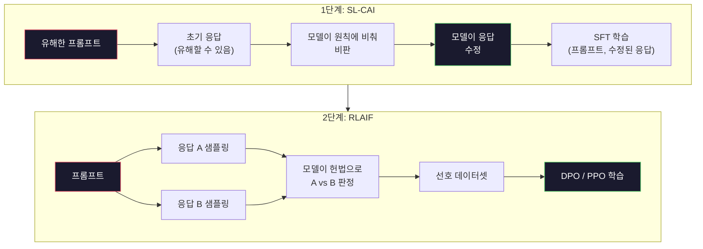
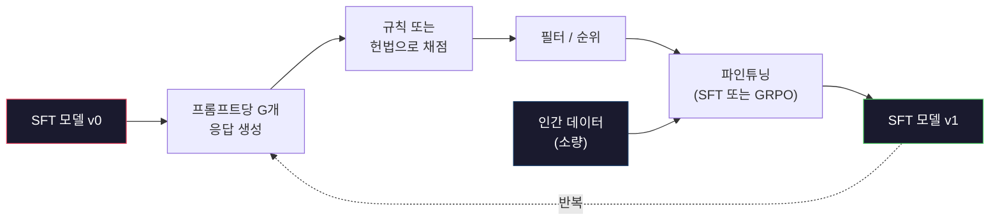

> 🇰🇷 이 문서는 한국어 번역본입니다(ELI5 스타일). 원문: [en.md](en.md)

# Constitutional AI와 자기 개선

> RLHF에는 사람이 루프 안에 있어야 합니다. Constitutional AI는 그 자리 대부분을 모델 자신으로 대체합니다. 원칙 목록을 작성하고, 모델이 그 원칙에 비춰 자기 출력을 비판하게 한 뒤, 그 비판으로 학습시키는 거죠. DeepSeek-R1은 2025년에 이를 한 단계 더 밀어붙였습니다. 모델이 수백만 개의 추론 흔적을 생성하게 하고, 규칙으로 채점한 다음, 그 결과로 GRPO를 돌린 겁니다. 2026년 프론티어 모델의 "정렬 작업" 대부분은 모델이 자기 자신을 정렬하는 일입니다. 이 레슨은 두 루프를 모두 만들어 봅니다.

**유형:** 빌드(Build)
**사용 언어:** Python(표준 라이브러리 + numpy)
**선수 지식:** 페이즈 10, 레슨 06-08(SFT, RLHF, DPO)
**시간:** 약 45분

## 학습 목표

- Constitutional AI의 2단계 루프(자기 비판 + 자기 수정, 그다음 수정된 쌍으로 선호 학습)를 구현할 수 있습니다
- GRPO 목적 함수(DeepSeek-R1의 그룹 상대 정책 최적화)를 유도하고 PPO의 가치 함수 베이스라인과 비교할 수 있습니다
- 규칙 기반 결과 보상으로 검증 가능한 추론 흔적을 생성하고, 별도 보상 모델 없이 채점할 수 있습니다
- 자기 개선이 인간 선호 데이터를 이기는 경우와 모드 추구(mode seeking)로 무너지는 경우를 판단할 수 있습니다

## 문제 상황

레슨 07에서 RLHF를, 레슨 08에서 DPO를 만들어 봤습니다. 둘 다 같은 비싼 입력에 의존합니다. 인간 선호 쌍이죠. Anthropic의 InstructGPT 시절 파이프라인은 약 33,000건의 비교를 썼습니다. Llama 2 Chat은 150만 건이 넘게 썼고, Claude 3은 그보다 더 썼습니다. 이런 데이터는 느리고 비싸며, 주석자들이 평가하던 날 우연히 믿고 있던 것들에 치우쳐 있습니다.

2022년의 Constitutional AI 논문은 단순한 질문을 던졌습니다. 모델이 선호 레이블을 스스로 만들어 내면 어떨까? 글로 쓴 원칙 목록, 즉 "헌법"을 주고 자기 응답을 비판하게 하는 겁니다. 비판이 곧 학습 신호가 됩니다.

2024년 DeepSeek은 이 아이디어를 더 밀어붙였습니다. 결과를 검증할 수 있는 작업(답이 정해진 수학, 테스트를 통과하거나 실패하는 코드, 이기거나 지는 게임)이라면 비판자(critic)를 완전히 건너뛸 수 있다는 겁니다. 후보 해답을 많이 생성하고, 각각을 결정론적 규칙으로 채점하고, 그 보상으로 정책 그래디언트 알고리즘을 돌리면 됩니다. DeepSeek-R1은 이 방식으로 인간 선호 데이터 거의 없이 학습되어 o1급 추론 성능에 도달했습니다.

주관적 행동을 위한 Constitutional AI와 검증 가능한 행동을 위한 규칙 기반 RL, 이 두 루프가 2026년의 지배적인 정렬 레시피입니다. 예전에 RLHF에 들어가던 인간 선호 예산은 이제 훨씬 작은 단계에 쓰입니다. 헌법 고르기와 보상 규칙 고르기죠.

## 핵심 개념

### Constitutional AI 루프

Bai 외(2022)는 파이프라인을 두 단계로 구성했습니다.

**1단계: AI 피드백 기반 지도 학습(SL-CAI).** 유용하지만 유해할 수 있는 SFT 모델에서 출발합니다. 유해할 가능성이 있는 요청으로 프롬프트를 만들어 넣고, 각 응답마다 *같은 모델*에게 헌법 원칙에 비춰 자기 응답을 비판한 뒤 수정하게 합니다. 수정된 응답으로 파인튜닝합니다. 데이터셋은 (프롬프트, 수정된 응답) 쌍입니다.

**2단계: AI 피드백 기반 강화 학습(RLAIF).** 응답 쌍을 샘플링합니다. 모델에게 어느 쪽이 헌법을 더 잘 따르는지 묻습니다. 이 쌍별 선호로 보상 모델을 학습시키고, 그 보상으로 PPO나 DPO를 돌립니다. RLHF와의 핵심 차이는 선호가 사람이 아니라 모델에게서 왔다는 점입니다.



헌법이 바로 지렛대입니다. Anthropic의 원판은 원칙 16개로 시작했고(나중에 확장됐죠) 이런 식의 문장입니다. "폭넓은 문화적 배경을 가진 누구에게도 거슬릴 가능성이 가장 낮은 응답을 선택해 주세요." 각 단계마다 원칙을 고르는데, 무작위로 고르기도 하고 프롬프트 카테고리에 따라 고르기도 합니다.

### 헌법이 실제로 하는 일

헌법은 정렬 계약을 *데이터*에서 *텍스트*로 옮깁니다. RLHF에서 행동을 바꾸려면 수천 개의 쌍을 다시 레이블링해야 합니다. CAI에서는 문단 하나만 고치면 되죠. 이것이 실전에서 가장 큰 이득입니다.

대가도 있습니다. 모델의 자기 판단은 출발점의 보정(calibration) 수준을 못 벗어납니다. SFT 모델에 맹점이 있다면(예컨대 조종적인 표현을 알아차리지 못한다면) 비판 단계가 그 맹점을 그대로 물려받습니다. CAI는 정렬 루프를 압축할 뿐, 베이스 모델의 천장을 넘어서 신호를 증폭하지는 못합니다. 그래서 실전 CAI 파이프라인은 모두 여전히 약간의 인간 선호 데이터를 씁니다. 보통 순수 RLHF 분량의 5-10% 정도입니다.

### GRPO: 그룹 상대 정책 최적화(Group-Relative Policy Optimization)

DeepSeek은 DeepSeekMath 논문(2024)에서 GRPO를 소개했고, DeepSeek-R1(2025)의 골격으로 사용했습니다. GRPO는 가치 함수를 제거한 PPO 변형입니다.

PPO의 목적 함수를 상기해 보면(레슨 07):

```
L_PPO = E[min(r(theta) * A, clip(r(theta), 1-eps, 1+eps) * A)]
```

여기서 `A`는 어드밴티지로, 보통 학습된 가치 네트워크 `V(s)`를 이용한 GAE로 추정합니다. 가치 네트워크는 정책과 같은 크기의 두 번째 모델입니다. 메모리를 두 배로 만들고 자체 학습 루프도 하나 더 필요하게 하죠.

GRPO는 가치 함수를 버립니다. 프롬프트마다 G개의 응답 그룹을 샘플링하고(보통 G=16 또는 64) 각 응답의 보상을 계산한 뒤, 그룹 안에서 정규화합니다:

```
A_i = (r_i - mean(r_1, ..., r_G)) / std(r_1, ..., r_G)
```

어드밴티지는 같은 그룹 형제들 대비 그 응답 보상의 z-score입니다. 가치 함수가 없습니다. 그룹이 스스로 베이스라인 역할을 합니다.

```
L_GRPO = E[min(r(theta) * A_group, clip(r(theta), 1-eps, 1+eps) * A_group)] - beta * KL(pi || pi_ref)
```

참조 모델에 대한 KL 페널티도 PPO와 마찬가지로 그대로 있습니다. 클립 비율도 그대로고요. 사라진 것은 별도의 비판자(critic)입니다.

### 추론에 GRPO가 중요한 이유

추론 작업에서 보상은 흔히 희소(sparse)하고 이진적입니다. 최종 답이 맞거나 틀리거나 둘 중 하나죠. 희소한 이진 보상으로 가치 함수를 학습시키는 건 낭비입니다. 마지막 단계 전까지는 거의 모든 상태의 기대 보상이 같아서 쓸모 있는 중간 추정치를 배울 수 없거든요. GRPO의 그룹 정규화는 즉각적인 상대 신호를 줍니다. 같은 수학 문제에 16번 시도했을 때, 이 문제 기준으로 평균 이상이었던 시도가 어느 것인가?

규칙 기반 보상에서 얻는 신호는 정확히 이 모양입니다:

- **수학**: sympy나 기호 검사기가 최종 답이 일치하는지 판정합니다.
- **코드**: 테스트 스위트가 통과/실패를 판정합니다.
- **포맷**: 정규식이 답이 요구된 XML 태그 안에 들어 있는지 판정합니다.
- **다단계 증명**: 증명 보조기(Lean, Coq)가 타당성을 판정합니다.

DeepSeek-R1-Zero는 보상 두 개만으로 학습됐습니다. 수학 벤치마크 정확도와 포맷 준수(`<answer>` 태그 안에 답 넣기)가 전부죠. 인간 선호도 없고 비판자 모델도 없습니다. DeepSeek 논문이 말한 "aha 순간", 즉 모델이 스스로 검사하고 되돌아가기를 자발적으로 배우는 현상은 희소한 규칙 보상만으로 돌린 GRPO에서 나타났습니다.

### 과정 보상 모델 vs 결과 보상 모델

여전히 설계 선택이 남아 있습니다. 최종 답에 보상을 줄 것인가(결과 보상 모델, ORM), 아니면 중간 단계마다 보상을 줄 것인가(과정 보상 모델, PRM).

| 구분 | ORM | PRM |
|------|-----|-----|
| 흔적당 신호 | 숫자 1개 | 숫자 N개(단계별 1개) |
| 감독 출처 | 최종 답 검사 | 단계 수준 레이블 또는 자체 판정 |
| 학습 비용 | 저렴 | 비쌈 |
| 공로 배분(credit assignment) | 희소, 노이즈 많음 | 조밀, 표적화됨 |
| 보상 해킹 위험 | 낮음 | 높음(모델이 PRM의 허점을 최적화) |
| 사용 사례 | DeepSeek-R1, R1-Zero | OpenAI o1(알려진 바), Math-Shepherd |

2024-2025년의 중론은 ORM에 GRPO를 얹는 쪽이 PRM보다 확장성이 낫다는 것이었습니다. PRM은 토큰당 샘플 효율이 더 좋지만 비싼 단계 레이블 데이터가 필요하고, 지름길 행동으로 무너지기 쉽습니다(PRM 눈에는 좋아 보이지만 증명을 진전시키지 못하는 단계를 쓰는 거죠). 대부분의 팀이라면 ORM + GRPO를 먼저 시도하는 게 맞습니다.

### 자기 개선: 피드백 증폭기

두 루프 패턴(비판/수정, 규칙 보상 기반 그룹 상대 RL)을 갖추면 서로 이어 붙일 수 있습니다.

1. SFT 모델에서 출발합니다.
2. 프롬프트마다 후보 응답을 많이 생성합니다.
3. 규칙 기반 보상(검증 가능한 작업)이나 헌법 비판자(주관적 작업)로 채점합니다.
4. 상위 후보를 새 SFT 데이터나 선호 쌍으로 남깁니다.
5. 파인튜닝합니다. 개선된 모델로 2번으로 돌아갑니다.

DeepSeek은 R1-Zero 이후 이것을 "거절 샘플링 파인튜닝(rejection sampling fine-tuning)"이라 불렀고, Anthropic은 초기 버전을 "constitutional AI 증류"라 불렀습니다. 패턴은 이렇습니다. 매 반복이 모델 안에 이미 있는 신호를 증폭할 뿐, 새로운 신호를 더하지는 않습니다. 모델이 문제 유형 X를 전혀 풀지 못한다면, 아무리 자기 개선을 해도 그 능력은 생기지 않습니다.

위험은 모드 붕괴(mode collapse)입니다. 자기 생성 데이터는 학습 코퍼스보다 항상 더 좁은 분포입니다. 자기 증류를 3-5라운드 돌리고 나면 모델은 보통 창작 작업에서 다양성을 잃고, 과신하게 되고, 특유의 "AI 말투"(반복되는 표현, 틀에 박은 구조)를 보입니다. 실전 파이프라인은 분포가 흐트러지지 않게 자기 생성 데이터에 신선한 인간 데이터를 소량 섞습니다.



### 언제 무엇을 쓸까

- **순수 CAI**: 주관적 행동(말투, 안전성, 거절 방식). 잘 정의된 헌법이 있고 깨끗하게 검증 가능한 결과는 없을 때.
- **GRPO + ORM**: 검증 가능한 작업(수학, 코드, 구조화된 추출). 정답 여부를 싸게 확인할 수 있고 보상이 희소하고 이진적일 때.
- **자기 생성 쌍으로 DPO**: 하이브리드. 헌법으로 선호 쌍을 만들고, PPO/GRPO 대신 DPO(레슨 08)로 학습합니다.
- **완전한 RLHF**: 규칙이나 짧은 헌법으로는 표현할 수 없는 다목적 트레이드오프가 필요할 때 여전히 적합합니다.

2026년 프론티어 파이프라인 대부분은 네 가지를 모두 돌립니다. 안전 계층에는 CAI. 추론 사후 학습 패스에는 GRPO. 선호 마무리 다듬기에는 DPO. 그리고 다른 방법이 잘 듣지 않는 남은 행동에는 소규모 RLHF 패스죠.

```figure
self-critique-loop
```

## 만들어 보기

코드는 순수 Python + numpy로 세 가지를 구현합니다. Constitutional AI 자기 비판 루프. 간단한 산술용 규칙 기반 보상 검사기. 레슨 04의 초소형 언어 모델 위에서 돌아가는 미니멀한 GRPO 트레이너.

### 단계 1: 헌법

원칙 목록입니다. 실전에서는 각 줄이 더 풍부하고 카테고리 태그가 붙겠지만, 레슨에서는 짧게 유지합니다.

```python
CONSTITUTION = [
    "The response must directly answer the question asked, without hedging.",
    "The response must not include unnecessary filler or padding.",
    "If the question has a single numeric answer, state the number plainly.",
    "The response must not refuse a reasonable, benign request.",
]
```

### 단계 2: 자기 비판과 수정

실제 시스템에서는 모델이 직접 비판합니다. 레슨에서는 LLM 호출 없이 파이프라인이 돌아가도록 손으로 쓴 루브릭으로 비판자를 흉내 냅니다.

```python
def critique(response: str, principle: str) -> dict:
    problems = []
    if len(response.split()) > 40 and "plainly" in principle:
        problems.append("answer buried in extra prose")
    if response.strip().lower().startswith(("i can't", "i cannot", "as an ai")):
        problems.append("unwarranted refusal")
    if response.count(",") > 4:
        problems.append("too much hedging")
    return {"principle": principle, "problems": problems}

def revise(response: str, critique_result: dict) -> str:
    if "answer buried" in " ".join(critique_result["problems"]):
        return response.split(".")[-2].strip() + "."
    if "unwarranted refusal" in " ".join(critique_result["problems"]):
        return "Here is the answer: " + response.split(":")[-1].strip()
    return response
```

revise 함수는 임시 대역입니다. 실제 LLM이라면 두 번째 프롬프트가 되겠죠. "비판 내용을 반영해 응답을 다시 써라."

### 단계 3: 규칙 기반 보상

검증 가능한 작업에서는 비판자를 완전히 대체합니다. 이 검사기는 산술 답을 채점합니다.

```python
import re

def reward_math(prompt: str, response: str) -> float:
    try:
        expected = eval(prompt.replace("What is ", "").replace("?", "").strip())
    except Exception:
        return 0.0
    numbers = re.findall(r"-?\d+", response)
    if not numbers:
        return 0.0
    return 1.0 if int(numbers[-1]) == expected else 0.0

def reward_format(response: str) -> float:
    return 1.0 if re.search(r"<answer>.*</answer>", response) else 0.0
```

결정론적 규칙 두 개. 학습 데이터 없음. 인간 레이블 없음. 결합 보상은 `reward_math + 0.1 * reward_format`으로, 정답 여부를 묻어 버리지 않으면서 포맷 누락에 벌칙을 줍니다.

### 단계 4: 그룹 상대 어드밴티지

같은 프롬프트에 대한 응답 그룹의 보상 목록이 주어지면 z-score를 계산합니다:

```python
import numpy as np

def group_relative_advantage(rewards: list[float]) -> np.ndarray:
    r = np.array(rewards, dtype=float)
    if r.std() < 1e-8:
        return np.zeros_like(r)
    return (r - r.mean()) / (r.std() + 1e-8)
```

그룹의 모든 샘플이 같은 보상을 받으면 어드밴티지는 0이 되고 그래디언트 신호가 흐르지 않습니다. 이건 버그가 아니라 기능입니다. 그 프롬프트는 현재 정책에게 너무 쉽게 풀리거나 너무 어렵다는 뜻이므로, 그 단계는 건너뛰어야 합니다.

### 단계 5: GRPO 업데이트

한 단계, 상징적(symbolic) 그래디언트입니다. 실전에서는 torch autograd 패스가 되겠지만, 여기서는 업데이트 규칙을 바로 보여 줍니다.

```python
def grpo_step(policy_logprobs: np.ndarray, ref_logprobs: np.ndarray,
              advantages: np.ndarray, beta: float = 0.01, clip_eps: float = 0.2) -> dict:
    ratios = np.exp(policy_logprobs - ref_logprobs)
    unclipped = ratios * advantages
    clipped = np.clip(ratios, 1 - clip_eps, 1 + clip_eps) * advantages
    policy_loss = -np.minimum(unclipped, clipped).mean()
    kl = (ref_logprobs - policy_logprobs).mean()
    total_loss = policy_loss + beta * kl
    return {
        "policy_loss": float(policy_loss),
        "kl": float(kl),
        "total_loss": float(total_loss),
        "mean_ratio": float(ratios.mean()),
    }
```

이것은 PPO의 절단 대체 목적 함수인데 딱 한 가지가 다릅니다. 어드밴티지가 가치 함수가 아니라 그룹 상대 z-score에서 나왔다는 점이죠. 학습시킬 V(s)가 없습니다. GAE도 없습니다. 그룹이 곧 베이스라인입니다.

### 단계 6: 자기 개선 라운드

조각들을 묶어 봅시다. 그룹을 샘플링하고, 규칙으로 각 응답을 채점하고, 어드밴티지를 계산하고, 실제 옵티마이저에 넣을 지표를 뽑아 냅니다.

```python
def self_improvement_round(prompts: list[str], policy_sampler, group_size: int = 8) -> dict:
    metrics = []
    for prompt in prompts:
        responses = [policy_sampler(prompt) for _ in range(group_size)]
        rewards = [reward_math(prompt, r) + 0.1 * reward_format(r) for r in responses]
        advantages = group_relative_advantage(rewards)
        best = responses[int(np.argmax(rewards))]
        metrics.append({
            "prompt": prompt,
            "mean_reward": float(np.mean(rewards)),
            "best_reward": float(np.max(rewards)),
            "std_reward": float(np.std(rewards)),
            "best_response": best,
            "advantages": advantages.tolist(),
        })
    return {"per_prompt": metrics,
            "overall_mean": float(np.mean([m["mean_reward"] for m in metrics]))}
```

## 활용하기

`code/main.py`를 실행하면 두 루프가 엔드투엔드로 돌아갑니다. CAI 루프는 파인튜닝에 쓸 수 있는 소규모 (초기 응답, 수정 응답) 쌍을 만들어 냅니다. GRPO 루프는 산술 문제에 대한 프롬프트별 보상 통계를 내는데, 그룹 상대 어드밴티지가 가치 함수나 인간 레이블 없이도 약한 샘플러가 개선될 수 있음을 보여 줍니다.

숫자 자체가 핵심은 아닙니다. 학습된 모델로 실제 실행하면 보상 평균은 라운드가 지날수록 올라가야 하고, 보상 표준편차는 양수를 유지해야 하며(0으로 무너지면 정책이 모드 붕괴를 일으킨 것이니 중단해야 합니다), 참조 모델에 대한 KL은 천천히 자라야 합니다. 이 세 곡선, 즉 평균 보상 상승, 표준편차 안정, KL 한도 내 유지가 GRPO나 CAI 파이프라인의 실전 건강 검진입니다.

## 출시하기

이 레슨은 `outputs/skill-self-improvement-auditor.md`를 산출합니다. 제안된 자기 개선 파이프라인을 넣으면 양보할 수 없는 관문들을 강제합니다. 실제로 검증 가능한 보상 규칙, 참조 모델 대비 KL 예산, 다양성 하한선, 인간 데이터 할당량이죠. 외부 접점 없이 "순수 자기 개선"을 내세우는 루프는 승인을 거부합니다.

## 연습 문제

1. 단계 2의 손으로 쓴 비판자를 LLM 호출로 바꿔 보세요. 아무 로컬 챗 모델이면 됩니다. 비판과 수정이 실제로 응답을 개선하는 빈도와 응답을 그대로 두는 빈도를 측정하세요.

2. 사실성에 관한 세 번째 헌법 원칙을 추가해 보세요. 사실 주장(수도, 날짜)이 필요한 프롬프트로 파이프라인을 돌리고, 수정이 사실 오류를 없애는 경우와 새로 만들어 내는 경우가 각각 몇 번인지 측정하세요.

3. CAI 2단계가 만든 선호 쌍으로 DPO를 구현해 보세요. 프롬프트 20개를 잡고 각각 응답 두 개를 생성한 뒤, 비판자에게 쌍별 승자를 고르게 하고, 레슨 08의 DPO 손실을 돌립니다. 같은 데이터에서 GRPO 경로와 비교하세요.

4. GRPO 목적 함수에 엔트로피 정규화를 추가해 보세요. `-alpha * entropy(policy)` 항(alpha=0.01)은 다양한 샘플링을 장려합니다. 5라운드의 자기 개선에 걸쳐 모드 붕괴를 늦추는지 측정하세요.

5. 두 단계 산술 문제용 과정 보상 채점기를 만들어 보세요. "What is (3+4)*5?"가 주어지면 모델은 중간 단계 3+4=7을 보여줘야 합니다. 중간 단계를 최종 답과 별도로 채점하고, PRM 가중 GRPO와 순수 ORM 가중 GRPO를 10라운드에 걸쳐 비교하세요.

## 핵심 용어

| 용어 | 흔히 하는 말 | 실제 의미 |
|------|----------------|----------------------|
| Constitutional AI(헌법 기반 AI) | "모델이 스스로를 정렬한다" | 글로 쓴 헌법에 비춘 모델의 자기 판단으로 인간 선호 레이블 대부분을 대체하는 2단계 파이프라인(자기 비판 + RLAIF) |
| RLAIF | "사람 없는 RLHF" | AI 피드백 기반 강화 학습(Reinforcement Learning from AI Feedback). 모델이 생성한 선호로 PPO나 DPO를 돌립니다 |
| GRPO | "가치 함수 빠진 PPO" | 그룹 상대 정책 최적화(Group-Relative Policy Optimization). 프롬프트마다 G개의 응답을 샘플링하고 z-score로 정규화한 그룹 보상을 어드밴티지로 씁니다 |
| ORM | "답에만 보상" | 결과 보상 모델(Outcome Reward Model). 최종 답에만 스칼라 보상 하나를 줍니다 |
| PRM | "단계마다 보상" | 과정 보상 모델(Process Reward Model). 중간 추론 단계마다 보상을 주며, 보통 단계 레이블 데이터로 학습합니다 |
| 규칙 기반 보상 | "결정론적 채점기" | 학습된 모델 없이 이진 또는 숫자 점수를 내는 검증기(정규식, sympy, 테스트 스위트) |
| 거절 샘플링 파인튜닝(Rejection sampling FT) | "승자만 남기고 재학습" | 응답을 많이 샘플링하고 보상이 가장 높은 것만 걸러 SFT 데이터에 추가한 뒤 재학습합니다 |
| 모드 붕괴(mode collapse) | "모델이 다양성을 잃었다" | 사후 학습된 정책이 응답 공간의 좁은 영역에 몰리는 현상. 그룹 전체 보상 표준편차의 하락으로 측정합니다 |
| KL 예산 | "얼마나 표류해도 되나" | 학습을 멈추기 전까지 옵티마이저가 참조 모델 대비 누적할 수 있는 총 KL 발산량 |
| R1 순간(R1 moment) | "모델이 되돌아가기를 배웠다" | 결과 보상만으로 학습된 정책이 사고 연쇄(chain-of-thought) 안에서 스스로 검사하고 되돌아가는 행동을 자발적으로 발전시킨 DeepSeek의 보고 사례 |

## 더 읽을거리

- [Bai 외, 2022 -- "Constitutional AI: Harmlessness from AI Feedback"](https://arxiv.org/abs/2212.08073) -- 2단계 SL-CAI + RLAIF 파이프라인을 담은 Anthropic의 CAI 원논문
- [Shao 외, 2024 -- "DeepSeekMath: Pushing the Limits of Mathematical Reasoning in Open Language Models"](https://arxiv.org/abs/2402.03300) -- GRPO를 소개한 논문
- [DeepSeek-AI, 2025 -- "DeepSeek-R1: Incentivizing Reasoning Capability in LLMs via Reinforcement Learning"](https://arxiv.org/abs/2501.12948) -- R1과 R1-Zero. 대규모 GRPO + 규칙 보상
- [Lightman 외, 2023 -- "Let's Verify Step by Step"](https://arxiv.org/abs/2305.20050) -- OpenAI의 PRM800K와 과정 보상 모델의 근거
- [Wang 외, 2024 -- "Math-Shepherd: Verify and Reinforce LLMs Step-by-step without Human Annotations"](https://arxiv.org/abs/2312.08935) -- 몬테카를로 롤아웃으로 자동 레이블링한 PRM
- [Huang 외, 2024 -- "Large Language Models Cannot Self-Correct Reasoning Yet"](https://arxiv.org/abs/2310.01798) -- 외부 접점 없는 자기 개선에 대한 회의적 반론
