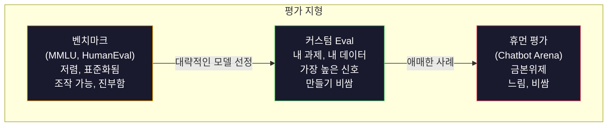
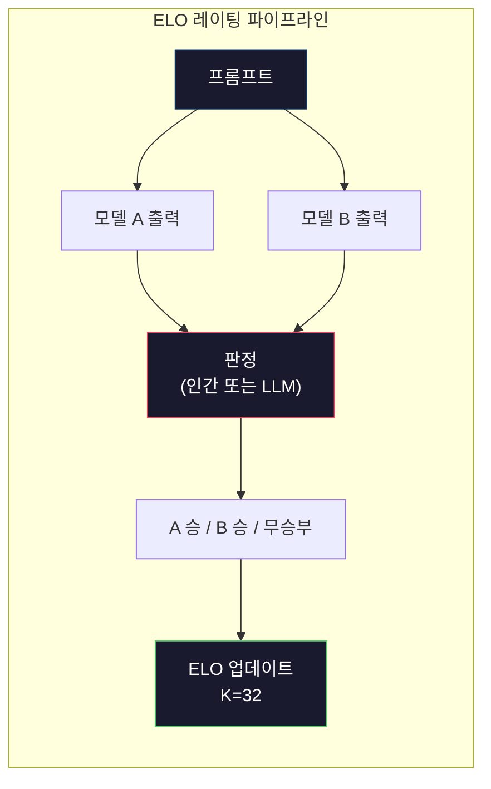

> 🇰🇷 이 문서는 한국어 번역본입니다(ELI5 스타일). 원문: [en.md](en.md)

# 평가: 벤치마크, Eval, LM Harness

> 굿하트의 법칙(Goodhart's Law): 어떤 측정치가 목표가 되는 순간, 그것은 더 이상 좋은 측정치가 아닙니다. 모든 최상위 연구소는 벤치마크를 속입니다(게이밍). MMLU 점수는 오르는데도 모델은 여전히 "strawberry" 안에 r이 몇 개인지 믿을 수 있게 세지 못합니다. 정말 의미 있는 평가는 오직 여러분만의 평가, 즉 여러분의 과제에 여러분의 데이터로 돌리는 평가입니다.

**유형:** 빌드
**언어:** Python
**선수 지식:** 페이즈 10, 레슨 01-05 (LLMs from Scratch)
**시간:** 약 90분

## 학습 목표

- 객관식 문제와 자유 응답형 벤치마크를 언어 모델에 대해 실행하는 커스텀 평가 하네스를 직접 만들어 봅니다
- 표준 벤치마크(MMLU, HumanEval)가 왜 포화 상태에 도달해 최상위 모델들을 구분하지 못하는지 설명할 수 있습니다
- 정확 일치(exact match), F1, BLEU, LLM-as-judge 채점 같은 적절한 지표로 과제별(eval) 평가를 구현합니다
- 공개 리더보드에만 의존하지 않고, 여러분의 구체적인 사용 사례를 겨냥한 커스텀 평가 스위트를 설계합니다

## 문제 상황

MMLU는 2020년에 57개 과목, 총 15,908문항으로 발표되었습니다. 불과 3년 만에 최상위 모델들이 이 벤치마크를 포화시켰습니다. GPT-4는 86.4%, Claude 3 Opus는 86.8%, Llama 3 405B는 88.6%를 기록했습니다. 리더보드는 3점 폭 안으로 압축되었고, 이 차이는 통계적 노이즈일 뿐 실제 능력 차이가 아닙니다.

한편 바로 그 모델들이 10살 아이도 아무렇지 않게 해내는 과제에서 실패합니다. MMLU에서 88.7%를 기록한 Claude 3.5 Sonnet은 처음에 "strawberry"의 글자 수를 세지 못했습니다 — 세계 지식도 추론 능력도 전혀 필요 없는, 그냥 글자를 하나씩 세기만 하면 되는 과제였는데요. HumanEval은 164개 문제로 코드 생성을 평가합니다. 모델들은 90% 이상을 받지만, 주니어 개발자라면 바로 잡아낼 엣지 케이스에서 크래시 나는 코드를 여전히 만들어 냅니다.

벤치마크 성능과 실제 환경에서의 신뢰성 사이의 이 간극이야말로 LLM 평가의 핵심 문제입니다. 벤치마크는 모델이 벤치마크에서 어떻게 수행하는지 알려줄 뿐입니다. 여러분의 구체적인 과제에서, 여러분의 구체적인 데이터로, 여러분의 구체적인 실패 모드 상황에서 그 모델이 어떻게 동작할지는 거의 아무것도 말해주지 않습니다. 고객 지원 봇을 만든다면 MMLU는 무관합니다. 코드 어시스턴트를 만든다면 HumanEval은 함수 단위 생성만 다룰 뿐, 여러 파일에 걸친 디버깅이나 리팩토링, 코드 설명에 대해서는 아무것도 말해주지 않습니다.

여러분에게 커스텀 eval이 필요합니다. 벤치마크가 쓸모없어서가 아닙니다 — 대략적인 모델 선정에는 유용하니까요. 하지만 최종 평가는 배포 조건과 정확히 일치해야 하기 때문입니다.

## 개념

### 평가의 지형

평가에는 세 가지 범주가 있고, 각각 비용과 신호 품질이 다릅니다.

**벤치마크**는 표준화된 테스트 스위트입니다. MMLU, HumanEval, SWE-bench, MATH, ARC, HellaSwag 같은 것들이죠. 모델을 벤치마크에 돌려서 점수를 얻습니다. 장점: 모두가 같은 시험을 치르므로 모델끼리 비교할 수 있습니다. 단점: 모델과 학습 데이터가 이 벤치마크들을 점점 오염시킵니다. 연구소들은 벤치마크 문제가 섞인 데이터로 학습하기도 합니다. 점수는 오르는데 능력은 오르지 않을 수 있습니다.

**커스텀 eval**은 여러분의 구체적인 사용 사례를 위해 직접 만드는 테스트 스위트입니다. 입력, 기대 출력, 채점 함수를 직접 정의합니다. 법률 문서 요약기라면 법률 문서로 평가받고, SQL 생성기라면 여러분의 데이터베이스 스키마로 평가받습니다. 만드는 비용이 비싸지만, 프로덕션(운영 환경) 성능을 예측할 수 있는 유일한 평가입니다.

**휴먼 평가**는 유료 어노테이터를 고용해 모델 출력을 유용성, 정확성, 유창성, 안전성 같은 기준으로 판단하게 합니다. 자동 채점이 실패하는 자유 응답형 과제에서는 금본위제(골드 스탠다드)입니다. Chatbot Arena는 100개 이상의 모델에 걸쳐 200만 건이 넘는 인간 선호 투표를 수집했습니다. 단점은 비용(건당 $0.10~$2.00)과 속도(몇 시간에서 며칠)입니다.



### 벤치마크가 무너지는 이유

벤치마크 점수가 실제 능력을 반영하지 못하게 되는 메커니즘은 세 가지입니다.

**데이터 오염.** 학습 코퍼스는 인터넷을 긁어옵니다. 벤치마크 문제는 인터넷에 살아 있죠. 그래서 모델은 학습 중에 정답을 보게 됩니다. 이건 전통적인 의미의 부정행위가 아닙니다 — 연구소들이 일부러 벤치마크 데이터를 넣는 게 아닙니다. 하지만 웹 규모의 스크래핑에서는 배제하는 게 거의 불가능합니다.

**시험에 맞춘 학습.** 연구소들은 벤치마크 성능을 기준으로 학습 데이터 배합(믹스처)을 최적화합니다. 학습 믹스의 5%가 MMLU식 객관식이라면, 모델은 그 형식과 정답 분포를 배웁니다. MMLU는 4지선다형입니다. 모델은 A/B/C/D에 정답 분포가 거의 균등하다는 것을 배우고, 이는 정답을 모를 때도 도움이 됩니다.

**포화.** 모든 최상위 모델이 어떤 벤치마크에서 85~90%를 받는다면, 그 벤치마크는 더 이상 모델을 구분하지 못합니다. 남은 10~15% 문제는 모호하거나, 레이블이 잘못되었거나, 생소한 도메인 지식을 요구할 수 있습니다. MMLU에서 87%에서 89%로 올랐다는 것은 모델이 똑똑해졌다는 게 아니라, 생소한 문제 두 개를 더 외웠다는 뜻일 수 있습니다.

### 퍼플렉시티: 빠른 건강 검진

퍼플렉시티(perplexity)는 모델이 토큰 시퀀스를 보고 얼마나 놀라는지를 측정합니다. 형식적으로는 지수화된 평균 음의 로그 가능도입니다:

```
PPL = exp(-1/N * sum(log P(token_i | context)))
```

퍼플렉시티가 10이라는 건, 모델이 매 토큰 위치에서 10개 선택지 중 균등하게 고르는 것과 비슷한 수준의 불확실성을 갖는다는 뜻입니다. 낮을수록 좋습니다. GPT-2는 WikiText-103에서 퍼플렉시티 약 30, GPT-3는 약 20, Llama 3 8B는 약 7을 기록합니다.

퍼플렉시티는 같은 테스트셋에서 모델끼리 비교할 때 유용하지만 사각지대가 있습니다. 흔한 패턴 예측을 잘해서 퍼플렉시티는 낮으면서, 드물지만 중요한 패턴은 끔찍하게 못 맞출 수도 있습니다. 또한 지시 따르기, 추론, 사실 정확성에 대해서는 아무것도 말해주지 않습니다. 최종 판정이 아니라 건강 검진(sanity check) 정도로 사용하세요.

### LLM-as-Judge

강한 모델로 약한 모델의 출력을 평가하는 방법입니다. 아이디어는 간단합니다. GPT-4o나 Claude Sonnet에게 어떤 응답을 정확성, 유용성, 안전성 기준으로 1~5점으로 평가해 달라고 요청하는 것이죠. GPT-4o-mini 기준 건당 약 $0.01이 들고, 인간 판단과 놀랍도록 잘 일치합니다 — 대부분의 과제에서 약 80% 일치율입니다.

채점 프롬프트가 모델보다 더 중요합니다. 막연한 프롬프트("이 응답을 평가하세요")는 노이즈 섞인 점수를 냅니다. 루브릭(rubric, 채점 기준표)이 담긴 구조화된 프롬프트("사실적으로 정확하고 출처를 인용하면 5점, 정확하지만 출처가 없으면 4점, 부분적으로 정확하면 3점...")는 일관되고 재현 가능한 점수를 냅니다.

실패 모드: 판정 모델(judge)은 위치 편향(쌍대 비교에서 첫 번째 응답 선호), 장황함 편향(더 긴 응답 선호), 자기 선호(GPT-4가 동급의 Claude 출력보다 GPT-4 출력을 더 높게 평가)를 보입니다. 완화책: 순서 무작위화, 길이 정규화, 평가 대상 모델과 다른 판정 모델 사용.

### 쌍대 비교를 통한 ELO 레이팅

Chatbot Arena의 방식입니다. 같은 프롬프트에 대한 서로 다른 모델의 두 응답을 보여주고, 인간(또는 LLM 판정 모델)이 더 나은 쪽을 고릅니다. 수천 건의 이런 비교로부터 각 모델의 ELO 레이팅을 계산합니다 — 체스에서 쓰이는 것과 같은 시스템이죠.

ELO의 장점: 상대적 순위가 절대 점수보다 신뢰할 만하고, 무승부를 자연스럽게 처리하며, 모든 출력을 독립적으로 채점하는 것보다 적은 비교 횟수로 수렴합니다. 2026년 초 기준으로 Chatbot Arena 순위에서는 GPT-4o, Claude 3.5 Sonnet, Gemini 1.5 Pro가 상위권에서 서로 20 ELO점 이내에 있습니다.



### Eval 프레임워크

**lm-evaluation-harness**(EleutherAI): 사실상 표준 오픈소스 평가 프레임워크입니다. 200개 이상의 벤치마크를 지원합니다. Hugging Face 모델이면 무엇이든 한 명령으로 MMLU, HellaSwag, ARC 등에 돌릴 수 있습니다. Open LLM Leaderboard에서 사용합니다.

**RAGAS**: RAG(검색 증강 생성) 파이프라인 전용 평가 프레임워크입니다. 충실도(faithfulness, 답이 검색된 컨텍스트와 일치하는가?), 관련성(relevance, 검색된 컨텍스트가 질문과 관련 있는가?), 답변 정확성을 측정합니다.

**promptfoo**: 프롬프트 엔지니어링을 위한 설정 기반(eval) 프레임워크입니다. YAML로 테스트 케이스를 정의하고, 여러 모델에 돌리고, 통과/실패 보고서를 받습니다. 프롬프트 회귀 테스트에 유용합니다 — 프롬프트를 바꿨을 때 기존 테스트 케이스가 깨지지 않는지 확인하는 거죠.

### 커스텀 Eval 만들기

프로덕션(운영 환경)에서 정말 의미 있는 유일한 평가입니다. 절차:

1. **과제를 정의합니다.** 모델이 정확히 무엇을 해야 하나요? 구체적으로 쓰세요. "질문에 답한다"는 너무 막연합니다. "고객 불만 이메일이 주어지면 제품명, 문제 카테고리, 감성을 추출한다"는 평가할 수 있는 과제입니다.

2. **테스트 케이스를 만듭니다.** 프로토타입 평가에는 최소 50개, 프로덕션에는 200개 이상. 각 테스트 케이스는 (입력, 기대_출력) 쌍입니다. 엣지 케이스도 넣으세요: 빈 입력, 적대적 입력, 모호한 입력, 다른 언어 입력.

3. **채점을 정의합니다.** 구조화된 출력에는 정확 일치. 텍스트 유사도에는 BLEU/ROUGE. 자유 응답형 품질에는 LLM-as-judge. 추출 과제에는 F1. 여러 지표를 가중치로 조합합니다.

4. **자동화합니다.** 모든 평가는 명령 한 줄로 실행되어야 합니다. 수동 단계 없이요. 결과는 시간에 따른 비교가 가능한 형식으로 저장합니다.

5. **시간에 따라 추적합니다.** 평가 점수는 그 자체만으로는 무의미합니다. 추세선이 필요합니다. 마지막 프롬프트 변경 후 점수가 좋아졌나요? 모델을 바꾼 후 나빠졌나요? 프롬프트와 함께 평가도 버전 관리하세요.

| Eval 유형 | 건당 비용 | 인간과의 일치율 | 가장 적합한 용도 |
|-----------|------------------|----------------------|----------|
| 정확 일치 | ~$0 | 100% (적용 가능한 경우) | 구조화된 출력, 분류 |
| BLEU/ROUGE | ~$0 | ~60% | 번역, 요약 |
| LLM-as-judge | ~$0.01 | ~80% | 자유 응답형 생성 |
| 휴먼 평가 | $0.10-$2.00 | 해당 없음(정답 기준 그 자체) | 모호하고 고위험인 과제 |

```figure
perplexity-loss
```

## 만들어 보기

### 단계 1: 최소한의 Eval 프레임워크

핵심 추상화를 정의합니다. eval 케이스는 입력, 기대 출력, 선택적 메타데이터 딕셔너리를 가집니다. 채점기(scorer)는 예측값과 참조값을 받아 0과 1 사이의 점수를 반환합니다.

```python
import json
from collections import Counter

class EvalCase:
    def __init__(self, input_text, expected, metadata=None):
        self.input_text = input_text
        self.expected = expected
        self.metadata = metadata or {}

class EvalSuite:
    def __init__(self, name, cases, scorers):
        self.name = name
        self.cases = cases
        self.scorers = scorers

    def run(self, model_fn):
        results = []
        for case in self.cases:
            prediction = model_fn(case.input_text)
            scores = {}
            for scorer_name, scorer_fn in self.scorers.items():
                scores[scorer_name] = scorer_fn(prediction, case.expected)
            results.append({
                "input": case.input_text,
                "expected": case.expected,
                "prediction": prediction,
                "scores": scores,
            })
        return results
```

### 단계 2: 채점 함수

정확 일치, 토큰 F1, 시뮬레이션된 LLM-as-judge 채점기를 만듭니다.

```python
def exact_match(prediction, expected):
    return 1.0 if prediction.strip().lower() == expected.strip().lower() else 0.0

def token_f1(prediction, expected):
    pred_tokens = set(prediction.lower().split())
    exp_tokens = set(expected.lower().split())
    if not pred_tokens or not exp_tokens:
        return 0.0
    common = pred_tokens & exp_tokens
    precision = len(common) / len(pred_tokens)
    recall = len(common) / len(exp_tokens)
    if precision + recall == 0:
        return 0.0
    return 2 * (precision * recall) / (precision + recall)

def llm_judge_simulated(prediction, expected):
    pred_words = set(prediction.lower().split())
    exp_words = set(expected.lower().split())
    if not exp_words:
        return 0.0
    overlap = len(pred_words & exp_words) / len(exp_words)
    length_penalty = min(1.0, len(prediction) / max(len(expected), 1))
    return round(overlap * 0.7 + length_penalty * 0.3, 3)
```

### 단계 3: ELO 레이팅 시스템

ELO 업데이트가 들어간 쌍대 비교를 구현합니다. Chatbot Arena가 모델 순위를 매길 때 쓰는 것과 정확히 같은 시스템입니다.

```python
class ELOTracker:
    def __init__(self, k=32, initial_rating=1500):
        self.ratings = {}
        self.k = k
        self.initial_rating = initial_rating
        self.history = []

    def _ensure_player(self, name):
        if name not in self.ratings:
            self.ratings[name] = self.initial_rating

    def expected_score(self, rating_a, rating_b):
        return 1 / (1 + 10 ** ((rating_b - rating_a) / 400))

    def record_match(self, player_a, player_b, outcome):
        self._ensure_player(player_a)
        self._ensure_player(player_b)

        ea = self.expected_score(self.ratings[player_a], self.ratings[player_b])
        eb = 1 - ea

        if outcome == "a":
            sa, sb = 1.0, 0.0
        elif outcome == "b":
            sa, sb = 0.0, 1.0
        else:
            sa, sb = 0.5, 0.5

        self.ratings[player_a] += self.k * (sa - ea)
        self.ratings[player_b] += self.k * (sb - eb)

        self.history.append({
            "a": player_a, "b": player_b,
            "outcome": outcome,
            "rating_a": round(self.ratings[player_a], 1),
            "rating_b": round(self.ratings[player_b], 1),
        })

    def leaderboard(self):
        return sorted(self.ratings.items(), key=lambda x: -x[1])
```

### 단계 4: 퍼플렉시티 계산

토큰 확률로 퍼플렉시티를 계산합니다. 실전에서는 이 값들을 모델의 로짓(logits)에서 얻겠지만, 여기서는 확률 분포로 시뮬레이션합니다.

```python
import numpy as np

def perplexity(log_probs):
    if not log_probs:
        return float("inf")
    avg_neg_log_prob = -np.mean(log_probs)
    return float(np.exp(avg_neg_log_prob))

def token_log_probs_simulated(text, model_quality=0.8):
    np.random.seed(hash(text) % 2**31)
    tokens = text.split()
    log_probs = []
    for i, token in enumerate(tokens):
        base_prob = model_quality
        if len(token) > 8:
            base_prob *= 0.6
        if i == 0:
            base_prob *= 0.7
        prob = np.clip(base_prob + np.random.normal(0, 0.1), 0.01, 0.99)
        log_probs.append(float(np.log(prob)))
    return log_probs
```

### 단계 5: 결과 집계

eval 실행 전체에 대한 요약 통계를 계산합니다: 평균, 중앙값, 임계값 기준 통과율, 지표별 세부 내역.

```python
def summarize_results(results, threshold=0.8):
    all_scores = {}
    for r in results:
        for metric, score in r["scores"].items():
            all_scores.setdefault(metric, []).append(score)

    summary = {}
    for metric, scores in all_scores.items():
        arr = np.array(scores)
        summary[metric] = {
            "mean": round(float(np.mean(arr)), 3),
            "median": round(float(np.median(arr)), 3),
            "std": round(float(np.std(arr)), 3),
            "min": round(float(np.min(arr)), 3),
            "max": round(float(np.max(arr)), 3),
            "pass_rate": round(float(np.mean(arr >= threshold)), 3),
            "n": len(scores),
        }
    return summary

def print_summary(summary, suite_name="Eval"):
    print(f"\n{'=' * 60}")
    print(f"  {suite_name} Summary")
    print(f"{'=' * 60}")
    for metric, stats in summary.items():
        print(f"\n  {metric}:")
        print(f"    Mean:      {stats['mean']:.3f}")
        print(f"    Median:    {stats['median']:.3f}")
        print(f"    Std:       {stats['std']:.3f}")
        print(f"    Range:     [{stats['min']:.3f}, {stats['max']:.3f}]")
        print(f"    Pass rate: {stats['pass_rate']:.1%} (threshold >= 0.8)")
        print(f"    N:         {stats['n']}")
```

### 단계 6: 전체 파이프라인 실행

모든 것을 하나로 연결합니다. 과제를 정의하고, 테스트 케이스를 만들고, 두 모델을 시뮬레이션하고, eval을 돌리고, 쌍대 비교로 ELO를 계산하고, 리더보드를 출력합니다.

```python
def demo_model_good(prompt):
    responses = {
        "What is the capital of France?": "Paris",
        "What is 2 + 2?": "4",
        "Who wrote Hamlet?": "William Shakespeare",
        "What language is PyTorch written in?": "Python and C++",
        "What is the boiling point of water?": "100 degrees Celsius",
    }
    return responses.get(prompt, "I don't know")

def demo_model_bad(prompt):
    responses = {
        "What is the capital of France?": "Paris is the capital city of France",
        "What is 2 + 2?": "The answer is four",
        "Who wrote Hamlet?": "Shakespeare",
        "What language is PyTorch written in?": "Python",
        "What is the boiling point of water?": "212 Fahrenheit",
    }
    return responses.get(prompt, "Unknown")

cases = [
    EvalCase("What is the capital of France?", "Paris"),
    EvalCase("What is 2 + 2?", "4"),
    EvalCase("Who wrote Hamlet?", "William Shakespeare"),
    EvalCase("What language is PyTorch written in?", "Python and C++"),
    EvalCase("What is the boiling point of water?", "100 degrees Celsius"),
]

suite = EvalSuite(
    name="General Knowledge",
    cases=cases,
    scorers={
        "exact_match": exact_match,
        "token_f1": token_f1,
        "llm_judge": llm_judge_simulated,
    },
)

results_good = suite.run(demo_model_good)
results_bad = suite.run(demo_model_bad)

print_summary(summarize_results(results_good), "Model A (concise)")
print_summary(summarize_results(results_bad), "Model B (verbose)")
```

"좋은" 모델은 정확한 답을 내고, "나쁜" 모델은 장황하게 바꿔 말합니다. 정확 일치는 장황한 모델을 무자비하게 벌줍니다. 토큰 F1과 LLM-as-judge는 더 관대하죠. 지표 선택이 왜 중요한지 보여주는 대표적인 사례입니다: 같은 모델이라도 어떻게 채점하느냐에 따라 훌륭해 보이기도 하고 형편없어 보이기도 합니다.

### 단계 7: ELO 토너먼트

여러 라운드에 걸쳐 모델 간 쌍대 비교를 실행합니다.

```python
elo = ELOTracker(k=32)

for case in cases:
    pred_a = demo_model_good(case.input_text)
    pred_b = demo_model_bad(case.input_text)

    score_a = token_f1(pred_a, case.expected)
    score_b = token_f1(pred_b, case.expected)

    if score_a > score_b:
        outcome = "a"
    elif score_b > score_a:
        outcome = "b"
    else:
        outcome = "tie"

    elo.record_match("model_a_concise", "model_b_verbose", outcome)

print("\nELO Leaderboard:")
for name, rating in elo.leaderboard():
    print(f"  {name}: {rating:.0f}")
```

### 단계 8: 퍼플렉시티 비교

품질 수준이 다른 "모델"들의 퍼플렉시티를 비교합니다.

```python
test_text = "The quick brown fox jumps over the lazy dog in the garden"

for quality, label in [(0.9, "Strong model"), (0.7, "Medium model"), (0.4, "Weak model")]:
    log_probs = token_log_probs_simulated(test_text, model_quality=quality)
    ppl = perplexity(log_probs)
    print(f"  {label} (quality={quality}): perplexity = {ppl:.2f}")
```

## 사용해 보기

### lm-evaluation-harness (EleutherAI)

어떤 모델이든 벤치마크에 돌려보는 표준 도구입니다.

```python
# pip install lm-eval
# 명령줄:
# lm_eval --model hf --model_args pretrained=meta-llama/Llama-3.1-8B --tasks mmlu --batch_size 8

# Python API:
# import lm_eval
# results = lm_eval.simple_evaluate(
#     model="hf",
#     model_args="pretrained=meta-llama/Llama-3.1-8B",
#     tasks=["mmlu", "hellaswag", "arc_easy"],
#     batch_size=8,
# )
# print(results["results"])
```

### promptfoo

프롬프트 엔지니어링을 위한 설정 기반 평가 도구입니다. YAML로 테스트를 정의하고 여러 프로바이더에 대해 실행합니다.

```yaml
# promptfoo.yaml
providers:
  - openai:gpt-4o-mini
  - anthropic:claude-3-haiku

prompts:
  - "Answer in one word: {{question}}"

tests:
  - vars:
      question: "What is the capital of France?"
    assert:
      - type: contains
        value: "Paris"
  - vars:
      question: "What is 2 + 2?"
    assert:
      - type: equals
        value: "4"
```

### RAG 평가를 위한 RAGAS

```python
# pip install ragas
# from ragas import evaluate
# from ragas.metrics import faithfulness, answer_relevancy, context_precision
#
# result = evaluate(
#     dataset,
#     metrics=[faithfulness, answer_relevancy, context_precision],
# )
# print(result)
```

RAGAS는 일반적인 평가가 놓치는 것을 측정합니다: 답이 추상적으로 "올바른지"가 아니라, 모델의 답이 검색된 컨텍스트에 근거하는지를 보는 것이죠.

## 출시하기

이 레슨은 `outputs/prompt-eval-designer.md`를 산출합니다 — 어떤 과제든 커스텀 eval 스위트를 설계해 주는 재사용 가능한 프롬프트입니다. 과제 설명을 주면 테스트 케이스, 채점 함수, 통과/실패 임계값 추천을 생성합니다.

또한 `outputs/skill-llm-evaluation.md`도 산출합니다 — 과제 유형, 예산, 지연 시간 요구 사항에 따라 올바른 평가 전략을 고르기 위한 의사결정 프레임워크입니다.

## 연습 문제

1. "일관성" 채점기를 추가해 보세요. 같은 입력을 모델에 5번 통과시키고, 출력이 얼마나 자주 일치하는지 측정합니다. 결정적인 입력에 대해 일관성 없는 답이 나온다면 프롬프트가 불안정하거나 temperature 설정이 높다는 신호입니다.

2. ELO 트래커를 확장해 여러 판정 함수(정확 일치, F1, LLM-as-judge)를 지원하고 가중치를 부여해 보세요. 정확 일치에 무게를 실을 때와 F1에 무게를 실 때 리더보드가 어떻게 달라지는지 비교해 보세요.

3. 구체적인 과제에 대한 eval 스위트를 만들어 보세요: 5개 카테고리로 이메일 분류하기. 엣지 케이스를 포함한 다양한 예시 100개로 테스트 케이스를 만드세요(여러 카테고리에 속할 수 있는 이메일, 빈 이메일, 다른 언어의 이메일). 서로 다른 "모델"(규칙 기반, 키워드 매칭, 시뮬레이션된 LLM)이 어떻게 수행하는지 측정해 보세요.

4. 오염 탐지를 구현해 보세요: eval 문제 집합과 학습 코퍼스가 주어지면, eval 문제(또는 유사한 바꿔 쓰기)가 학습 데이터에 얼마나 많이 등장하는지 확인합니다. 연구자들이 벤치마크 타당성을 감사(audit)하는 방식이 바로 이것입니다.

5. "모델 diff" 도구를 만들어 보세요. 두 모델 버전의 eval 결과가 주어지면, 어떤 테스트 케이스가 개선되고, 어떤 것이 나빠지고, 어떤 것이 그대로인지 강조해서 보여줍니다. 코드 diff의 eval 버전으로, 변경이 도움이 됐는지 해가 됐는지 파악하는 데 필수적입니다.

## 핵심 용어

| 용어 | 사람들이 말하는 것 | 실제 의미 |
|------|----------------|----------------------|
| MMLU | "그 벤치마크" | Massive Multitask Language Understanding — 57개 과목 15,908개 객관식 문항, 2025년까지 88%를 넘으며 포화됨 |
| HumanEval | "코드 평가" | OpenAI의 164개 Python 함수 완성 문제, 고립된 함수 생성만 테스트 |
| SWE-bench | "진짜 코딩 평가" | 12개 Python 저장소의 2,294개 GitHub 이슈, 테스트 생성을 포함한 엔드투엔드 버그 수정 측정 |
| Perplexity | "모델이 얼마나 헷갈리는가" | exp(-avg(log P(컨텍스트가 주어진 token_i))) — 낮을수록 모델이 실제 토큰에 더 높은 확률을 부여한다는 뜻 |
| ELO 레이팅 | "모델의 체스 랭킹" | 쌍대 승/패 기록으로 계산한 상대적 실력 지수, Chatbot Arena가 100개 이상 모델의 순위를 매길 때 사용 |
| LLM-as-judge | "AI로 AI 채점하기" | 강한 모델이 루브릭에 따라 약한 모델의 출력에 점수를 매김, 인간 판정자와 약 80% 일치, 건당 약 $0.01 |
| 데이터 오염 | "모델이 시험지를 봤다" | 학습 데이터에 벤치마크 문제가 포함되어 실제 능력은 오르지 않은 채 점수만 부풀려지는 현상 |
| Eval 스위트 | "테스트 뭉치" | 특정 능력을 측정하는 (입력, 기대_출력, 채점기) 삼중 항목의 버전 관리된 모음 |
| 통과율 | "몇 퍼센트를 맞히는가" | 임계값을 넘는 eval 케이스의 비율 — 신뢰성을 측정하기 때문에 평균 점수보다 실용적 |
| Chatbot Arena | "모델 랭킹 사이트" | 200만 건 이상의 인간 선호 투표를 모은 LMSYS 플랫폼, ELO 레이팅으로 가장 신뢰받는 LLM 리더보드를 만듦 |

## 더 읽을거리

- [Hendrycks et al., 2021 -- "Measuring Massive Multitask Language Understanding"](https://arxiv.org/abs/2009.03300) -- MMLU 논문. 포화에도 불구하고 여전히 가장 많이 인용되는 LLM 벤치마크
- [Chen et al., 2021 -- "Evaluating Large Language Models Trained on Code"](https://arxiv.org/abs/2107.03374) -- OpenAI의 HumanEval 논문, 코드 생성 평가 방법론을 정립
- [Zheng et al., 2023 -- "Judging LLM-as-a-Judge"](https://arxiv.org/abs/2306.05685) -- LLM으로 LLM을 평가하는 방법에 대한 체계적 분석, 위치 편향과 장황함 편향 연구 결과 포함
- [LMSYS Chatbot Arena](https://chat.lmsys.org/) -- 200만 건 이상의 투표를 모은 크라우드소싱 모델 비교 플랫폼, 가장 신뢰받는 실전 LLM 랭킹
