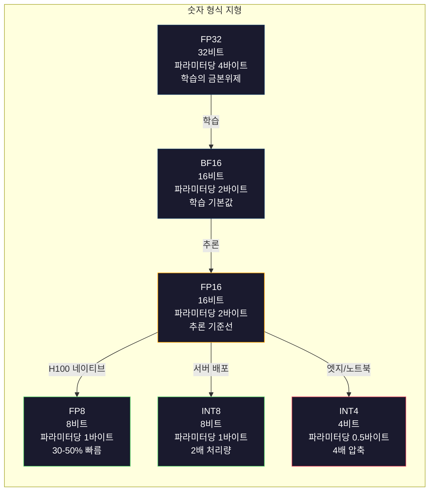
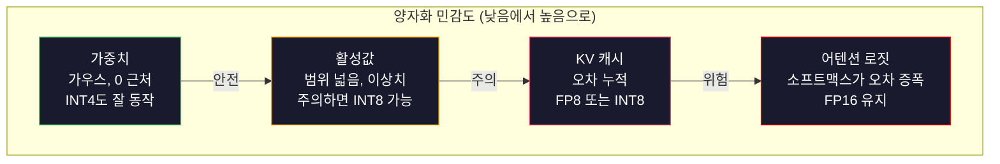
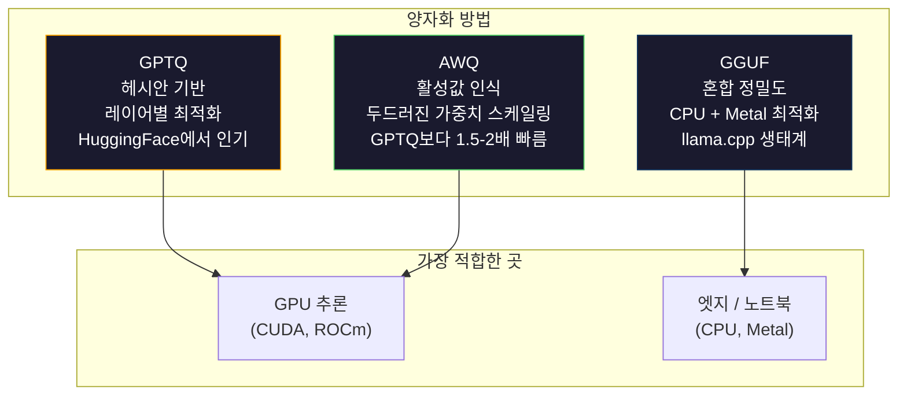

> 🇰🇷 이 문서는 한국어 번역본입니다(ELI5 스타일). 원문: [en.md](en.md)

# 양자화: 모델을 크기에 맞추기

> FP16의 70B 모델은 140GB가 필요합니다. 가중치만으로 A100 두 개 몫이죠. FP8로 양자화하면 80GB GPU 한 개. INT4로는 맥북에서도 돌아갑니다.

**유형:** 빌드
**언어:** Python (numpy 사용)
**선수 지식:** 페이즈 10, 레슨 01-10 (LLMs from Scratch)
**시간:** 약 120분

## 학습 목표

- 텐서별(per-tensor), 채널별(per-channel) 스케일링을 포함해 FP16에서 INT8과 INT4로 가는 대칭/비대칭 양자화를 구현합니다
- 양자화로 절약되는 메모리를 계산하고, 주어진 GPU의 VRAM에 맞는 정밀도를 결정합니다
- 학습 후 양자화(PTQ)와 양자화 인식 학습(QAT)의 차이를 설명합니다
- GPTQ나 AWQ를 실제 모델에 적용해 벤치마크에서 정확도-메모리 트레이드오프를 측정합니다

## 문제 상황

Llama 3 70B는 700억 개의 파라미터를 가집니다. 각 파라미터는 16비트 부동소수점 수입니다. 1,400억 바이트, 즉 140GB죠. A100 한 장은 VRAM이 80GB입니다. 가중치를 올리는 것조차 불가능하니, 추론은 말할 것도 없습니다. 모델 하나를 서빙하려고 시간당 $2씩 드는 A100 두 장이 필요합니다.

그런데 파라미터당 16비트는 낭비입니다. 신경망의 대부분 가중치는 0 근처에 몰려 있습니다. FP16의 온전한 동적 범위(0.000000059부터 65,504까지)는 거의 쓰이지 않죠. Llama 3 70B의 실제 가중치 분포를 측정해 보면 95%가 -0.1과 +0.1 사이에 있습니다. 4비트에도 들어갈 값을 표현하려고 16비트를 태우고 있는 겁니다.

양자화는 고정밀 숫자를 저정밀 숫자로 바꿉니다. FP16에서 FP8로 가면 메모리가 절반으로 줄고, FP16에서 INT4로 가면 1/4로 줄어듭니다. 140GB 모델이 35GB가 되어 소비자용 GPU 한 장에 들어갑니다. 2비트 양자화까지 밀면(공격적이고 손실이 있지만 일부 과제에서는 쓸 만합니다) 같은 모델이 16GB 노트북에서 돌아갑니다.

대가는 정확도입니다. 비트를 하나 지울 때마다 정보가 파괴됩니다. 중요한 질문은 정확도를 얼마나, 어디서 잃는가입니다. 잘 만든 INT4 양자화 모델은 대부분의 벤치마크에서 원본 품질의 95~99%를 유지합니다. 반면 순진한 INT4 양자화는 모델 전체를 망가뜨릴 수 있습니다. 차이를 만드는 것은 기법입니다.

Llama 3를 GPTQ로 INT4 양자화한 커뮤니티 버전들은 WikiText에서 대략 1~2 퍼플렉시티 포인트를 잃는 수준입니다. Mistral은 Mixtral 8x22B의 FP8 체크포인트를 MMLU에서 측정 가능한 품질 손실 없이 공개했습니다. GGUF 형식은 llama.cpp를 뒷받침하며, M 시리즈 칩 맥북에서 70B 모델을 돌려 줍니다. 양자화는 잔재주가 아닙니다. 7B를 넘는 모든 모델의 표준 배포 경로입니다.

## 개념

### 숫자 형식: 각 비트가 하는 일

모든 부동소수점 수는 세 부분으로 이루어집니다: 부호, 지수(exponent), 가수(mantissa, 유효숫자라고도 합니다). 부호는 1비트입니다. 지수는 범위(숫자가 얼마나 크고 작아질 수 있는지)를 결정하고, 가수는 정밀도(몇 자리까지 정확한지)를 결정합니다.

```
FP32:  [1 sign] [8 exponent] [23 mantissa]  = 32 bits
FP16:  [1 sign] [5 exponent] [10 mantissa]  = 16 bits
BF16:  [1 sign] [8 exponent] [7  mantissa]  = 16 bits
FP8:   [1 sign] [4 exponent] [3  mantissa]  = 8  bits (E4M3)
FP8:   [1 sign] [5 exponent] [2  mantissa]  = 8  bits (E5M2)
INT8:  [1 sign] [7 value]                   = 8  bits (uniform steps)
INT4:  [1 sign] [3 value]                   = 4  bits (16 levels total)
```

**FP32**는 완전 정밀도입니다. 23비트 가수가 소수점 약 7자리의 정밀도를 줍니다. 범위는 대략 1.2 x 10^-38부터 3.4 x 10^38까지. 과거 학습은 오로지 FP32로 이뤄졌습니다. 누적용(행렬 곱셈 중 더해지는 합계)으로는 지금도 FP32를 씁니다.

**FP16**은 비트를 절반으로 줄입니다. 10비트 가수가 소수점 약 3.3자리를 줍니다. 지수는 5비트로 줄어 범위가 극적으로 좁아집니다(최댓값 약 65,504). 0 근처에 몰려 있는 가중치에는 괜찮지만, 학습 중 급등할 수 있는 활성값(activation)과 그래디언트에는 위험합니다. FP16 학습은 언더플로를 막으려면 손실 스케일링(loss scaling)이 필요합니다.

**BF16**(Brain Float 16)은 FP32의 8비트 지수를 유지하되 가수를 7비트로 줄입니다. 범위는 FP32와 같고 정밀도는 FP16보다 낮습니다. Google이 딥러닝을 위해 특별히 설계했죠. 직관은 이렇습니다: 신경망에는 정밀도보다 범위가 더 중요하다. FP16에서 0으로 언더플로되는 10^-20 크기의 그래디언트도 BF16에서는 살아남습니다. 0.07342라는 가중치가 BF16에서 0.0734로 반올림되어도 충분히 가깝습니다. 요즘의 모든 학습은 BF16 또는 BF16/FP32 혼합으로 돌아갑니다.

**FP8**은 두 가지 맛이 있습니다. E4M3(지수 4, 가수 3)는 추론 시 가중치와 활성값에 쓰입니다. E5M2(지수 5, 가수 2)는 학습 중 그래디언트에 쓰이는데, 정밀도보다 범위가 중요한 자리죠. H100 GPU에서 FP8 추론은 FP16 대비 30~50% 속도 향상을 거의 무손실로 얻습니다.

**INT8**은 정수 형식입니다. 지수도 가수도 없습니다. -128부터 127까지 균등한 간격의 256개 값만 있을 뿐이죠. 부동소수점 가중치를 이 범위로 매핑하려면 스케일 팩터가 필요합니다. 장점: 정수 연산은 부동소수점보다 빠르고 전력 효율이 좋습니다. A100에서 INT8 행렬 곱셈은 624 TOPS인 반면 FP16은 312 TFLOPS입니다.

**INT4**는 더 밀어붙입니다. 가능한 값이 겨우 16개. 스케일 팩터가 무거운 일을 떠맡습니다. 품질은 전적으로 스케일을 어떻게 고르고 어떤 가중치를 양자화하는지에 달려 있습니다. 최첨단 INT4 방법(GPTQ, AWQ)은 원본 모델 품질의 95% 이상을 유지합니다.



### 양자화는 어떻게 동작하는가

핵심 연산은 간단합니다. 부동소수점 값의 텐서를 받아 스케일 팩터를 찾고, 곱하고, 가장 가까운 정수로 반올림한 뒤, 정수들과 스케일 팩터를 저장하는 것입니다.

**양자화:**
```
scale = max(abs(tensor)) / max_int_value
quantized = round(tensor / scale)
```

**역양자화:**
```
reconstructed = quantized * scale
```

대칭 범위(-127부터 127)의 INT8이라면:
```
scale = max(abs(tensor)) / 127
quantized = clamp(round(tensor / scale), -128, 127)
```

오차는 반올림 오차입니다. 각 값은 최대 `scale / 2`만큼 벗어날 수 있습니다. 한 레이어 전체의 총 오차는 가중치가 얼마나 많은지, 그리고 모델이 그 가중치의 교란에 얼마나 민감한지에 따라 달라집니다.

**텐서별(per-tensor) vs 채널별(per-channel) 양자화.** 텐서별 양자화는 가중치 행렬 전체에 스케일 팩터 하나를 씁니다. 간단하지만 손실이 큽니다: 한 열은 값이 크고 다른 열은 작다면, 작은 값들은 정밀도를 대부분 잃습니다. 채널별 양자화는 출력 채널마다(가중치 행렬의 행 또는 열마다) 스케일 팩터 하나를 씁니다. 오버헤드가 더 크지만(1개 대신 N개의 스케일 팩터를 저장) 품질은 극적으로 좋아집니다. 프로덕션(운영 환경) 양자화 방법은 모두 채널별 또는 더 세밀한 단위를 사용합니다.

**비대칭 양자화**는 영점(zero-point) 오프셋을 추가합니다: `quantized = round(tensor / scale) + zero_point`. 0을 중심으로 하지 않는 분포를 다룰 수 있습니다. 예컨대 ReLU 활성값은 항상 0 이상입니다. 대칭 양자화는 절대 등장하지 않는 음수 값에 정수 범위의 절반을 낭비합니다. 비대칭 양자화는 실제 범위 [min, max]를 정수 범위 전체로 매핑합니다.

### 민감도 위계

모델 안의 모든 것이 양자화를 똑같이 견디는 것은 아닙니다. 분명한 위계가 있습니다.

**가중치(가장 튼튼함).** 모델 가중치는 학습 중 천천히 변하고 0 근처를 중심으로 대략 가우스 분포를 이룹니다. 양자화에 잘 견딥니다. 채널별 스케일을 쓴 INT8 가중치는 거의 무손실에 가깝습니다. INT4는 더 정교한 방법이 필요하지만 동작합니다.

**활성값(중간 민감도).** 활성값(activation)은 추론 중 네트워크를 흐르는 중간 값들입니다. 가중치보다 동적 범위가 넓고 이상치(outlier)를 포함합니다. 어떤 어텐션 헤드는 평균보다 100배 큰 활성값을 만들어 내기도 합니다. 이런 이상치는 모델 품질에 결정적입니다. 순진하게 양자화하면 정보가 파괴됩니다. 해결책: 이상치 채널은 더 높은 정밀도로 유지하기(LLM.int8()), 토큰별 또는 채널별 활성 스케일 사용하기.

**KV 캐시(높은 민감도).** 키-값 캐시는 이전 토큰 전부의 어텐션 상태를 저장합니다. 컨텍스트 길이가 길어지면 KV 캐시가 메모리를 지배합니다. 32K 컨텍스트의 70B 모델에서 KV 캐시만 FP16으로 40GB입니다. KV 캐시를 FP8이나 INT8로 양자화하면 메모리를 크게 아끼지만, 조금의 오차도 이후의 모든 어텐션 계산에 누적됩니다. 품질 영향은 시퀀스 길이에 비례해 커집니다.

**어텐션 로짓(가장 민감함).** 어텐션의 소프트맥스는 입력의 작은 변화에 극도로 민감합니다. 소프트맥스 직전 로짓의 0.01 양자화 오차만으로도 어텐션 분포가 의미 있게 흔들릴 수 있습니다. 대부분의 양자화 방식은 나머지가 모두 양자화되어도 어텐션 계산은 더 높은 정밀도(FP16 또는 BF16)로 유지합니다.



### PTQ vs QAT

**학습 후 양자화(PTQ, Post-Training Quantization)**는 이미 학습된 모델을 양자화합니다. 재학습 없이요. FP16 가중치를 가져와 스케일 팩터를 계산하고, 반올림하고, 배포합니다. 빠르고(몇 분에서 몇 시간) 저렴합니다. INT8과 FP8에서는 잘 동작합니다. INT4에서는 반올림 오차가 누적되기 때문에 순진한 PTQ는 자주 크게 실패합니다. 고급 PTQ 방법(GPTQ, AWQ)은 캘리브레이션 데이터로 양자화 오차를 최소화합니다.

**양자화 인식 학습(QAT, Quantization-Aware Training)**은 학습 중 포워드 패스에 가짜 양자화 연산을 심습니다. 모델은 반올림 오차가 작아지는 위치에 가중치를 두도록 배웁니다. 그래디언트는 직통 추정기(straight-through estimator, STE)로 가짜 양자화를 통과합니다: 반올림 연산의 그래디언트가 1인 것처럼 가정하는 거죠. QAT는 PTQ보다 더 나은 INT4 및 INT2 모델을 만들지만 완전한 학습 실행이 필요합니다. Google은 Gemini의 효율적인 서빙에 QAT를 썼고, Meta도 일부 Llama 배포 대상에 QAT를 사용했습니다.

| 항목 | PTQ | QAT |
|--------|-----|-----|
| 비용 | 몇 분~몇 시간 | 완전한 학습 실행 |
| INT8 품질 | 훌륭함 (0.1% 미만 손실) | 훌륭함 |
| INT4 품질 | GPTQ/AWQ로 양호 (1-3% 손실) | 더 좋음 (1% 미만 손실) |
| INT2 품질 | 나쁨 | 일부 과제에서 사용 가능 |
| 캘리브레이션 데이터 | 128-1024개 예시 | 전체 학습 데이터셋 |
| 사용 시점 | 배포, 반복 실험 | 낮은 비트 폭에서 최대 품질 |

### GPTQ, AWQ, GGUF

**GPTQ(GPT Quantization)**는 원샷(one-shot) PTQ 방법입니다. 가중치를 한 번에 한 레이어씩 양자화하면서, 작은 캘리브레이션 데이터셋(보통 128개 예시)으로 헤시안(각 가중치에 출력이 얼마나 민감한지에 대한 2차 정보)을 측정합니다. 헤시안이 중요하다고 말하는 가중치는 더 신중하게 양자화됩니다. GPTQ는 LLM에 INT4 양자화를 실용적으로 만든 최초의 방법입니다. Hugging Face의 TheBloke가 수백 개 모델의 양자화 버전을 공개하며 GPTQ를 대중화했습니다.

**AWQ(Activation-Aware Weight Quantization)**는 소수의 가중치(약 1%)가 큰 활성값과 곱해지기 때문에 불균형적으로 중요하다는 사실에서 출발합니다. AWQ는 캘리브레이션 데이터로 이런 두드러진(salient) 가중치를 찾아내고, 양자화 전에 크기를 키웁니다(그리고 해당 활성값은 줄입니다). 이렇게 하면 중요한 가중치가 INT4 양자화가 정확한 범위 안에 머물게 됩니다. AWQ는 보통 GPTQ와 같거나 약간 더 나은 품질을 내면서 적용 속도는 1.5~2배 빠릅니다.

**GGUF(GPT-Generated Unified Format)**는 llama.cpp와 그 생태계가 쓰는 파일 형식입니다. 혼합 양자화를 지원합니다: 레이어마다 다른 비트 폭을 쓸 수 있죠. 첫 레이어와 마지막 레이어(임베딩과 출력 헤드)는 보통 더 높은 정밀도로 유지합니다. 중간 레이어는 INT4나 INT3를 쓰고요. GGUF 파일은 자기 완결적입니다: 가중치, 토크나이저, 메타데이터가 한 파일에 다 들어 있습니다. 이 형식은 CPU 추론과 Apple Silicon을 위해 설계되었으며, 모델 전체를 메모리에 올려 CPU나 Metal GPU로 행렬 곱셈을 돌리는 것이 표준 경로입니다. Q4_K_M은 품질과 크기의 균형이 좋아 가장 인기 있는 GGUF 양자화 변형입니다.



### 품질 측정

양자화한 모델이 여전히 좋은지 어떻게 알 수 있을까요?

**퍼플렉시티.** 가장 흔한 지표입니다. 낮을수록 좋습니다. 원본 모델과 양자화 모델 둘 다에 대해 홀드아웃 데이터셋(WikiText-2가 표준)에서 퍼플렉시티를 계산하세요. 그 차이(delta)가 양자화가 파괴한 정보의 양을 알려 줍니다. 경험칙: 차이 0.5 미만이면 훌륭함, 0.5~1.0이면 양호, 1.0~2.0이면 대부분의 과제에서 수용 가능, 2.0 초과면 뭔가 잘못된 것입니다.

**과제별 벤치마크.** 양자화 모델을 MMLU, HumanEval, GSM8K 또는 여러분의 커스텀 eval 스위트에 돌려 보세요. 원본과 비교합니다. 양자화는 능력마다 다르게 영향을 미칩니다. 수학과 코드 과제는 일반 지식보다 정밀도 손실에 더 민감합니다.

**출력 비교.** 같은 프롬프트로 두 모델의 응답을 생성해 비교합니다. LLM-as-judge(레슨 10)가 여기서 잘 맞습니다. 승률을 계산해 보세요: 프롬프트 중 얼마나 많은 비율에서 양자화 모델이 원본과 같거나 더 나은가?

**지연 시간과 처리량.** 양자화는 모델을 더 빠르고 저렴하게 만들기 위해 존재합니다. 초당 토큰 수, 첫 토큰까지의 시간, 메모리 사용량을 측정하세요. 원본보다 느린 양자화 모델은 쓸모없는 것 이상으로 나쁩니다.

| 모델 | 형식 | 크기 | 퍼플렉시티 (WikiText-2) | MMLU | 초당 토큰 (A100) |
|-------|--------|------|------------------------|------|-------------------|
| Llama 3 70B | FP16 | 140GB | 3.12 | 79.5% | 38 |
| Llama 3 70B | FP8 | 70GB | 3.14 | 79.3% | 55 |
| Llama 3 70B | GPTQ INT4 | 35GB | 4.32 | 77.8% | 72 |
| Llama 3 70B | AWQ INT4 | 35GB | 4.18 | 78.1% | 75 |
| Llama 3 70B | GGUF Q4_K_M | 40GB | 4.25 | 77.9% | 28 (CPU) |

패턴: FP8은 거의 공짜입니다. INT4는 MMLU 1~2점을 내주지만 처리량을 두 배로, 메모리를 1/4로 만듭니다. 거의 모든 배포에서 이 트레이드오프는 할 만한 값입니다.

### 실제 수치들

H100에서 FP16을 FP8로: 추론 30~50% 가속, 품질 손실 0.1% 미만. 고민할 필요 없는 양자화입니다. 모든 H100 배포가 이걸 써야 합니다.

FP16을 INT8로(LLM.int8()): 메모리 2배 절감, 품질 손실 0.5% 미만. 혼합 정밀도 접근법은 이상치 특성을 FP16으로 유지하면서 나머지를 모두 INT8로 양자화합니다.

FP16을 INT4로(GPTQ/AWQ): 메모리 4배 절감, 모델과 방법에 따라 1~3% 품질 손실. 70B 모델을 48GB GPU 한 장에 올릴 수 있게 해 줍니다.

FP16을 INT4로(GGUF Q4_K_M): 메모리 3.5배 절감, 품질 손실 1~2%. CPU 추론에 최적화. Q4_K_M의 70B 모델은 약 40GB이며 64GB M3 Max에서 초당 10~15 토큰으로 돌아갑니다.

FP16을 INT2로: 메모리 8배 절감, 품질 손실 5~15%. 열화를 감수할 수 있는 좁고 특정한 과제에서만 쓸 만합니다. 연구 프론티어이지 일반 용도의 프로덕션 레디가 아닙니다.

```figure
quantization
```

## 만들어 보기

### 단계 1: 숫자 형식 표현

각 형식의 비트 수준 표현을 만들어 부호, 지수, 가수가 정확히 무엇을 하는지 봅니다.

```python
import numpy as np


def float_to_fp32_bits(value):
    bits = np.float32(value).view(np.uint32)
    sign = (bits >> 31) & 1
    exponent = (bits >> 23) & 0xFF
    mantissa = bits & 0x7FFFFF
    return {"sign": int(sign), "exponent": int(exponent), "mantissa": int(mantissa),
            "exponent_bits": format(int(exponent), '08b'),
            "mantissa_bits": format(int(mantissa), '023b'),
            "value": float(value),
            "actual_exponent": int(exponent) - 127}


def float_to_fp16_bits(value):
    fp16 = np.float16(value)
    bits = fp16.view(np.uint16)
    sign = (bits >> 15) & 1
    exponent = (bits >> 10) & 0x1F
    mantissa = bits & 0x3FF
    return {"sign": int(sign), "exponent": int(exponent), "mantissa": int(mantissa),
            "exponent_bits": format(int(exponent), '05b'),
            "mantissa_bits": format(int(mantissa), '010b'),
            "value": float(fp16),
            "actual_exponent": int(exponent) - 15}


def float_to_bf16_bits(value):
    fp32_bits = np.float32(value).view(np.uint32)
    bf16_bits = (fp32_bits >> 16).astype(np.uint16)
    sign = (bf16_bits >> 15) & 1
    exponent = (bf16_bits >> 7) & 0xFF
    mantissa = bf16_bits & 0x7F
    reconstructed = np.uint32(bf16_bits.astype(np.uint32) << 16).view(np.float32)
    return {"sign": int(sign), "exponent": int(exponent), "mantissa": int(mantissa),
            "exponent_bits": format(int(exponent), '08b'),
            "mantissa_bits": format(int(mantissa), '07b'),
            "value": float(reconstructed),
            "actual_exponent": int(exponent) - 127}


def simulate_fp8_e4m3(value):
    sign = 1 if value < 0 else 0
    abs_val = abs(value)
    max_val = 448.0
    abs_val = min(abs_val, max_val)
    if abs_val == 0:
        return {"sign": sign, "exponent": 0, "mantissa": 0, "value": 0.0,
                "exponent_bits": "0000", "mantissa_bits": "000"}
    exp = int(np.floor(np.log2(abs_val)))
    exp = max(-6, min(8, exp))
    mantissa_val = abs_val / (2.0 ** exp) - 1.0
    mantissa_quant = round(mantissa_val * 8) / 8
    mantissa_quant = max(0, min(0.875, mantissa_quant))
    reconstructed = (1.0 + mantissa_quant) * (2.0 ** exp)
    if sign:
        reconstructed = -reconstructed
    mantissa_int = int(round(mantissa_quant * 8))
    return {"sign": sign, "exponent": exp + 7, "mantissa": mantissa_int,
            "exponent_bits": format(exp + 7, '04b'),
            "mantissa_bits": format(mantissa_int, '03b'),
            "value": float(reconstructed),
            "actual_exponent": exp}


def display_format_comparison(value):
    fp32 = float_to_fp32_bits(value)
    fp16 = float_to_fp16_bits(value)
    bf16 = float_to_bf16_bits(value)
    fp8 = simulate_fp8_e4m3(value)

    print(f"\n  Value: {value}")
    print(f"  {'Format':<8} {'Stored Value':>14} {'Error':>12} {'Sign':>5} {'Exp Bits':>10} {'Man Bits':>25}")
    print(f"  {'-'*76}")
    print(f"  {'FP32':<8} {fp32['value']:>14.6f} {abs(fp32['value'] - value):>12.8f} {fp32['sign']:>5} {fp32['exponent_bits']:>10} {fp32['mantissa_bits']:>25}")
    print(f"  {'FP16':<8} {fp16['value']:>14.6f} {abs(fp16['value'] - value):>12.8f} {fp16['sign']:>5} {fp16['exponent_bits']:>10} {fp16['mantissa_bits']:>25}")
    print(f"  {'BF16':<8} {bf16['value']:>14.6f} {abs(bf16['value'] - value):>12.8f} {bf16['sign']:>5} {bf16['exponent_bits']:>10} {bf16['mantissa_bits']:>25}")
    print(f"  {'FP8e4m3':<8} {fp8['value']:>14.6f} {abs(fp8['value'] - value):>12.8f} {fp8['sign']:>5} {fp8['exponent_bits']:>10} {fp8['mantissa_bits']:>25}")
```

### 단계 2: 대칭 양자화 (텐서별과 채널별)

기본이 되는 양자화 연산들입니다. 텐서별은 행렬 전체에 스케일 하나를 쓰고, 채널별은 행 또는 열마다 스케일 하나를 씁니다.

```python
def quantize_symmetric(tensor, num_bits=8):
    qmin = -(2 ** (num_bits - 1))
    qmax = 2 ** (num_bits - 1) - 1
    abs_max = np.max(np.abs(tensor))
    if abs_max == 0:
        return np.zeros_like(tensor, dtype=np.int32), 1.0
    scale = abs_max / qmax
    quantized = np.clip(np.round(tensor / scale), qmin, qmax).astype(np.int32)
    return quantized, float(scale)


def dequantize_symmetric(quantized, scale):
    return quantized.astype(np.float64) * scale


def quantize_per_channel(tensor, num_bits=8, axis=0):
    qmin = -(2 ** (num_bits - 1))
    qmax = 2 ** (num_bits - 1) - 1

    if axis == 0:
        abs_max = np.max(np.abs(tensor), axis=1, keepdims=True)
    else:
        abs_max = np.max(np.abs(tensor), axis=0, keepdims=True)

    abs_max = np.where(abs_max == 0, 1.0, abs_max)
    scales = abs_max / qmax
    quantized = np.clip(np.round(tensor / scales), qmin, qmax).astype(np.int32)
    return quantized, scales.squeeze()


def dequantize_per_channel(quantized, scales, axis=0):
    if axis == 0:
        return quantized.astype(np.float64) * scales.reshape(-1, 1)
    else:
        return quantized.astype(np.float64) * scales.reshape(1, -1)


def quantize_asymmetric(tensor, num_bits=8):
    qmin = 0
    qmax = 2 ** num_bits - 1
    t_min = np.min(tensor)
    t_max = np.max(tensor)
    if t_max == t_min:
        return np.zeros_like(tensor, dtype=np.int32), 1.0, 0
    scale = (t_max - t_min) / (qmax - qmin)
    zero_point = int(np.round(qmin - t_min / scale))
    zero_point = max(qmin, min(qmax, zero_point))
    quantized = np.clip(np.round(tensor / scale + zero_point), qmin, qmax).astype(np.int32)
    return quantized, float(scale), int(zero_point)


def dequantize_asymmetric(quantized, scale, zero_point):
    return (quantized.astype(np.float64) - zero_point) * scale
```

### 단계 3: 품질 측정

양자화가 정보를 얼마나 파괴하는지 측정합니다. 원본 텐서와 재구성된 텐서 사이의 평균 제곱 오차, 신호 대 잡음비, 코사인 유사도입니다.

```python
def quantization_error(original, reconstructed):
    diff = original - reconstructed
    mse = float(np.mean(diff ** 2))
    rmse = float(np.sqrt(mse))
    max_error = float(np.max(np.abs(diff)))
    signal_power = float(np.mean(original ** 2))
    snr_db = 10 * np.log10(signal_power / max(mse, 1e-20))

    orig_flat = original.flatten()
    recon_flat = reconstructed.flatten()
    norm_orig = np.linalg.norm(orig_flat)
    norm_recon = np.linalg.norm(recon_flat)
    if norm_orig == 0 or norm_recon == 0:
        cosine_sim = 0.0
    else:
        cosine_sim = float(np.dot(orig_flat, recon_flat) / (norm_orig * norm_recon))

    return {"mse": mse, "rmse": rmse, "max_error": max_error,
            "snr_db": float(snr_db), "cosine_similarity": cosine_sim}


def compare_quantization_methods(tensor, num_bits=8):
    q_pt, s_pt = quantize_symmetric(tensor, num_bits)
    recon_pt = dequantize_symmetric(q_pt, s_pt)
    err_pt = quantization_error(tensor, recon_pt)

    q_pc, s_pc = quantize_per_channel(tensor, num_bits, axis=0)
    recon_pc = dequantize_per_channel(q_pc, s_pc, axis=0)
    err_pc = quantization_error(tensor, recon_pc)

    q_asym, s_asym, zp = quantize_asymmetric(tensor, num_bits)
    recon_asym = dequantize_asymmetric(q_asym, s_asym, zp)
    err_asym = quantization_error(tensor, recon_asym)

    print(f"\n  Quantization Comparison ({num_bits}-bit, tensor shape {tensor.shape}):")
    print(f"  {'Method':<20} {'MSE':>12} {'SNR (dB)':>10} {'Cosine Sim':>12} {'Max Error':>12}")
    print(f"  {'-'*68}")
    print(f"  {'Per-tensor sym':<20} {err_pt['mse']:>12.8f} {err_pt['snr_db']:>10.2f} {err_pt['cosine_similarity']:>12.8f} {err_pt['max_error']:>12.8f}")
    print(f"  {'Per-channel sym':<20} {err_pc['mse']:>12.8f} {err_pc['snr_db']:>10.2f} {err_pc['cosine_similarity']:>12.8f} {err_pc['max_error']:>12.8f}")
    print(f"  {'Asymmetric':<20} {err_asym['mse']:>12.8f} {err_asym['snr_db']:>10.2f} {err_asym['cosine_similarity']:>12.8f} {err_asym['max_error']:>12.8f}")

    return {"per_tensor": err_pt, "per_channel": err_pc, "asymmetric": err_asym}
```

### 단계 4: 비트 폭 스윕

같은 텐서를 서로 다른 비트 폭(2, 3, 4, 8, 16)으로 양자화하고 각 수준에서 품질을 측정합니다. 품질 절벽이 정확히 어디인지 보여 줍니다.

```python
def bit_width_sweep(tensor):
    print(f"\n  Bit-Width Sweep (tensor shape {tensor.shape}):")
    print(f"  {'Bits':>6} {'Levels':>8} {'MSE':>14} {'SNR (dB)':>10} {'Cosine Sim':>12} {'Compression':>12}")
    print(f"  {'-'*64}")

    results = []
    for bits in [2, 3, 4, 8, 16]:
        q, s = quantize_per_channel(tensor, bits, axis=0)
        recon = dequantize_per_channel(q, s, axis=0)
        err = quantization_error(tensor, recon)
        levels = 2 ** bits
        compression = 32.0 / bits

        print(f"  {bits:>6} {levels:>8} {err['mse']:>14.8f} {err['snr_db']:>10.2f} {err['cosine_similarity']:>12.8f} {compression:>11.1f}x")
        results.append({"bits": bits, "levels": levels, "error": err, "compression": compression})

    return results
```

### 단계 5: 민감도 실험

트랜스포머의 서로 다른 부분을 양자화하는 것을 시뮬레이션하고 어느 구성 요소가 가장 민감한지 측정합니다. 가중치 < 활성값 < KV 캐시 < 어텐션의 민감도 위계를 보여 줍니다.

```python
def simulate_transformer_layer(input_data, weights, kv_scale=1.0):
    hidden = input_data @ weights["qkv"]
    seq_len = hidden.shape[1]
    d_model = weights["qkv"].shape[1] // 3
    q, k, v = hidden[:, :, :d_model], hidden[:, :, d_model:2*d_model], hidden[:, :, 2*d_model:]

    attn_scores = (q @ k.transpose(0, 2, 1)) / np.sqrt(d_model) * kv_scale
    attn_max = np.max(attn_scores, axis=-1, keepdims=True)
    attn_exp = np.exp(attn_scores - attn_max)
    attn_weights = attn_exp / np.sum(attn_exp, axis=-1, keepdims=True)

    attn_output = attn_weights @ v
    output = attn_output @ weights["out"]
    return output, {"q": q, "k": k, "v": v, "attn_scores": attn_scores,
                    "attn_weights": attn_weights, "attn_output": attn_output}


def sensitivity_experiment(batch_size=2, seq_len=16, d_model=64, num_bits=8):
    np.random.seed(42)
    input_data = np.random.randn(batch_size, seq_len, d_model) * 0.1

    weights = {
        "qkv": np.random.randn(d_model, 3 * d_model) * (2.0 / d_model) ** 0.5,
        "out": np.random.randn(d_model, d_model) * (2.0 / d_model) ** 0.5,
    }

    baseline_output, baseline_internals = simulate_transformer_layer(input_data, weights)

    experiments = {}

    q_qkv, s_qkv = quantize_per_channel(weights["qkv"], num_bits, axis=0)
    q_out, s_out = quantize_per_channel(weights["out"], num_bits, axis=0)
    quantized_weights = {
        "qkv": dequantize_per_channel(q_qkv, s_qkv, axis=0),
        "out": dequantize_per_channel(q_out, s_out, axis=0),
    }
    weight_quant_output, _ = simulate_transformer_layer(input_data, quantized_weights)
    experiments["Weights only"] = quantization_error(baseline_output, weight_quant_output)

    _, fresh_internals = simulate_transformer_layer(input_data, weights)
    q_act, s_act = quantize_per_channel(
        fresh_internals["attn_output"].reshape(-1, d_model), num_bits, axis=0
    )
    quant_attn_out = dequantize_per_channel(q_act, s_act, axis=0).reshape(batch_size, seq_len, d_model)
    act_quant_output = quant_attn_out @ weights["out"]
    experiments["Activations only"] = quantization_error(baseline_output, act_quant_output)

    q_k, s_k = quantize_per_channel(fresh_internals["k"].reshape(-1, d_model), num_bits, axis=0)
    q_v, s_v = quantize_per_channel(fresh_internals["v"].reshape(-1, d_model), num_bits, axis=0)
    quant_k = dequantize_per_channel(q_k, s_k, axis=0).reshape(batch_size, seq_len, d_model)
    quant_v = dequantize_per_channel(q_v, s_v, axis=0).reshape(batch_size, seq_len, d_model)
    attn_scores_kv = (fresh_internals["q"] @ quant_k.transpose(0, 2, 1)) / np.sqrt(d_model)
    attn_max_kv = np.max(attn_scores_kv, axis=-1, keepdims=True)
    attn_exp_kv = np.exp(attn_scores_kv - attn_max_kv)
    attn_weights_kv = attn_exp_kv / np.sum(attn_exp_kv, axis=-1, keepdims=True)
    kv_quant_output = (attn_weights_kv @ quant_v) @ weights["out"]
    experiments["KV cache only"] = quantization_error(baseline_output, kv_quant_output)

    noise_scale = np.std(fresh_internals["attn_scores"]) * 0.05
    noisy_scores = fresh_internals["attn_scores"] + np.random.randn(*fresh_internals["attn_scores"].shape) * noise_scale
    noisy_max = np.max(noisy_scores, axis=-1, keepdims=True)
    noisy_exp = np.exp(noisy_scores - noisy_max)
    noisy_weights = noisy_exp / np.sum(noisy_exp, axis=-1, keepdims=True)
    attn_quant_output = (noisy_weights @ fresh_internals["v"]) @ weights["out"]
    experiments["Attention logits (5% noise)"] = quantization_error(baseline_output, attn_quant_output)

    print(f"\n  Sensitivity Experiment ({num_bits}-bit quantization):")
    print(f"  {'Component':<30} {'MSE':>14} {'SNR (dB)':>10} {'Cosine Sim':>12}")
    print(f"  {'-'*68}")
    for name, err in sorted(experiments.items(), key=lambda x: x[1]["mse"]):
        print(f"  {name:<30} {err['mse']:>14.8f} {err['snr_db']:>10.2f} {err['cosine_similarity']:>12.8f}")

    return experiments
```

### 단계 6: 시뮬레이션된 GPTQ

GPTQ는 헤시안을 이용해 반올림 오차를 어떻게 분배할지 결정하면서 한 번에 한 열씩 양자화합니다. 여기서는 핵심 아이디어만 담은 단순화 버전을 만듭니다: 캘리브레이션 데이터로 가중치 중요도를 측정한 뒤, 덜 중요한 가중치를 더 공격적으로 양자화하는 것이죠.

```python
def simulated_gptq(weight_matrix, calibration_inputs, num_bits=4):
    n_in, n_out = weight_matrix.shape
    qmin = -(2 ** (num_bits - 1))
    qmax = 2 ** (num_bits - 1) - 1

    H = np.zeros((n_in, n_in))
    for x in calibration_inputs:
        x = x.reshape(-1, 1) if x.ndim == 1 else x
        for row in range(x.shape[0]):
            xi = x[row].reshape(-1, 1)
            H += xi @ xi.T
    H /= len(calibration_inputs)
    H += np.eye(n_in) * 1e-4

    weight_importance = np.diag(H)

    quantized = np.zeros_like(weight_matrix, dtype=np.int32)
    scales = np.zeros(n_out)
    errors = np.zeros(n_out)

    W = weight_matrix.copy()

    for col in range(n_out):
        w_col = W[:, col]
        abs_max = np.max(np.abs(w_col))
        if abs_max == 0:
            scales[col] = 1.0
            continue
        scale = abs_max / qmax
        scales[col] = scale

        q_col = np.clip(np.round(w_col / scale), qmin, qmax).astype(np.int32)
        quantized[:, col] = q_col

        quant_error = w_col - q_col * scale
        errors[col] = np.sqrt(np.mean(quant_error ** 2))

        if col < n_out - 1:
            importance_weights = weight_importance / (np.max(weight_importance) + 1e-10)
            for next_col in range(col + 1, min(col + 4, n_out)):
                compensation = quant_error * importance_weights * 0.1
                W[:, next_col] += compensation

    return quantized, scales, {"column_errors": errors,
                               "mean_error": float(np.mean(errors)),
                               "max_error": float(np.max(errors))}


def dequantize_gptq(quantized, scales):
    result = np.zeros_like(quantized, dtype=np.float64)
    for col in range(quantized.shape[1]):
        result[:, col] = quantized[:, col] * scales[col]
    return result
```

### 단계 7: AWQ 시뮬레이션

AWQ는 두드러진 가중치(큰 활성값과 곱해지는 것들)를 찾아내고, 양자화 전에 스케일링해서 보호합니다.

```python
def simulated_awq(weight_matrix, calibration_inputs, num_bits=4, salient_fraction=0.01):
    n_in, n_out = weight_matrix.shape
    qmin = -(2 ** (num_bits - 1))
    qmax = 2 ** (num_bits - 1) - 1

    activation_magnitudes = np.zeros(n_in)
    for x in calibration_inputs:
        if x.ndim == 1:
            activation_magnitudes += np.abs(x)
        else:
            activation_magnitudes += np.mean(np.abs(x), axis=0)
    activation_magnitudes /= len(calibration_inputs)

    n_salient = max(1, int(n_in * salient_fraction))
    salient_indices = np.argsort(activation_magnitudes)[-n_salient:]

    scale_factors = np.ones(n_in)
    for idx in salient_indices:
        col_max = np.max(np.abs(weight_matrix[idx, :]))
        if col_max > 0:
            scale_factors[idx] = min(4.0, 1.0 / (col_max + 1e-8) * np.mean(np.abs(weight_matrix)))

    scaled_weights = weight_matrix * scale_factors.reshape(-1, 1)

    quantized, scales = quantize_per_channel(scaled_weights, num_bits, axis=0)
    dequantized = dequantize_per_channel(quantized, scales, axis=0)

    result = dequantized / scale_factors.reshape(-1, 1)

    err = quantization_error(weight_matrix, result)

    return result, {"salient_indices": salient_indices,
                    "scale_factors": scale_factors[salient_indices],
                    "error": err,
                    "n_salient": n_salient}
```

### 단계 8: 전체 파이프라인

모든 것을 하나로 연결합니다. 같은 가중치 행렬에서 순진한 양자화, 채널별, GPTQ, AWQ를 비교합니다.

```python
def full_quantization_comparison(d_in=256, d_out=512, num_bits=4, n_calibration=32):
    np.random.seed(42)

    weight = np.random.randn(d_in, d_out) * 0.02
    outlier_rows = np.random.choice(d_in, size=5, replace=False)
    weight[outlier_rows] *= 10

    calibration = [np.random.randn(8, d_in) * 0.1 for _ in range(n_calibration)]

    q_naive, s_naive = quantize_symmetric(weight, num_bits)
    recon_naive = dequantize_symmetric(q_naive, s_naive)
    err_naive = quantization_error(weight, recon_naive)

    q_pc, s_pc = quantize_per_channel(weight, num_bits, axis=0)
    recon_pc = dequantize_per_channel(q_pc, s_pc, axis=0)
    err_pc = quantization_error(weight, recon_pc)

    q_gptq, s_gptq, gptq_info = simulated_gptq(weight, calibration, num_bits)
    recon_gptq = dequantize_gptq(q_gptq, s_gptq)
    err_gptq = quantization_error(weight, recon_gptq)

    recon_awq, awq_info = simulated_awq(weight, calibration, num_bits)
    err_awq = awq_info["error"]

    print(f"\n  Full Quantization Comparison ({num_bits}-bit, {d_in}x{d_out} matrix)")
    print(f"  Matrix has {len(outlier_rows)} outlier rows (10x scale)")
    print()
    print(f"  {'Method':<20} {'MSE':>14} {'SNR (dB)':>10} {'Cosine Sim':>12}")
    print(f"  {'-'*58}")
    print(f"  {'Naive per-tensor':<20} {err_naive['mse']:>14.8f} {err_naive['snr_db']:>10.2f} {err_naive['cosine_similarity']:>12.8f}")
    print(f"  {'Per-channel':<20} {err_pc['mse']:>14.8f} {err_pc['snr_db']:>10.2f} {err_pc['cosine_similarity']:>12.8f}")
    print(f"  {'Simulated GPTQ':<20} {err_gptq['mse']:>14.8f} {err_gptq['snr_db']:>10.2f} {err_gptq['cosine_similarity']:>12.8f}")
    print(f"  {'Simulated AWQ':<20} {err_awq['mse']:>14.8f} {err_awq['snr_db']:>10.2f} {err_awq['cosine_similarity']:>12.8f}")

    test_input = np.random.randn(4, d_in) * 0.1
    baseline = test_input @ weight
    output_naive = test_input @ recon_naive
    output_pc = test_input @ recon_pc
    output_gptq = test_input @ recon_gptq
    output_awq = test_input @ recon_awq

    print(f"\n  End-to-End Output Error (matmul with test input):")
    print(f"  {'Method':<20} {'Output MSE':>14} {'Output Cosine':>14}")
    print(f"  {'-'*50}")
    for name, output in [("Naive", output_naive), ("Per-channel", output_pc),
                          ("GPTQ", output_gptq), ("AWQ", output_awq)]:
        out_err = quantization_error(baseline, output)
        print(f"  {name:<20} {out_err['mse']:>14.8f} {out_err['cosine_similarity']:>14.8f}")

    return {"naive": err_naive, "per_channel": err_pc, "gptq": err_gptq, "awq": err_awq}


def memory_calculator(num_params_billions, bits_per_param):
    bytes_per_param = bits_per_param / 8
    total_bytes = num_params_billions * 1e9 * bytes_per_param
    total_gb = total_bytes / (1024 ** 3)
    return total_gb


def print_memory_table():
    print("\n  Memory Requirements by Model and Precision:")
    print(f"  {'Model':<15} {'FP32':>8} {'FP16':>8} {'FP8':>8} {'INT8':>8} {'INT4':>8} {'INT2':>8}")
    print(f"  {'-'*64}")
    for name, params in [("7B", 7), ("13B", 13), ("34B", 34), ("70B", 70), ("405B", 405)]:
        fp32 = memory_calculator(params, 32)
        fp16 = memory_calculator(params, 16)
        fp8 = memory_calculator(params, 8)
        int8 = memory_calculator(params, 8)
        int4 = memory_calculator(params, 4)
        int2 = memory_calculator(params, 2)
        print(f"  {name:<15} {fp32:>7.1f}G {fp16:>7.1f}G {fp8:>7.1f}G {int8:>7.1f}G {int4:>7.1f}G {int2:>7.1f}G")


if __name__ == "__main__":
    np.random.seed(42)

    print("=" * 70)
    print("QUANTIZATION: MAKING MODELS FIT")
    print("=" * 70)

    print("\nSTEP 1: Number Format Comparison")
    print("-" * 50)
    for val in [0.1, 3.14159, -0.00073, 42.5, 0.0000012]:
        display_format_comparison(val)

    print("\n\nSTEP 2: Memory Requirements")
    print("-" * 50)
    print_memory_table()

    print("\n\nSTEP 3: Quantization Methods Comparison")
    print("-" * 50)
    weight_matrix = np.random.randn(128, 256) * 0.02
    weight_matrix[0] *= 15
    weight_matrix[42] *= 8
    compare_quantization_methods(weight_matrix, num_bits=8)
    compare_quantization_methods(weight_matrix, num_bits=4)

    print("\n\nSTEP 4: Bit-Width Sweep")
    print("-" * 50)
    sweep_tensor = np.random.randn(64, 128) * 0.05
    bit_width_sweep(sweep_tensor)

    print("\n\nSTEP 5: Sensitivity Experiment")
    print("-" * 50)
    print("\n  INT8:")
    sensitivity_experiment(num_bits=8)
    print("\n  INT4:")
    sensitivity_experiment(num_bits=4)

    print("\n\nSTEP 6: GPTQ vs AWQ vs Naive (INT4)")
    print("-" * 50)
    full_quantization_comparison(d_in=256, d_out=512, num_bits=4)

    print("\n\nSTEP 7: Distribution Analysis")
    print("-" * 50)
    np.random.seed(0)
    simulated_weights = np.random.randn(1000) * 0.02
    abs_vals = np.abs(simulated_weights)
    pct_in_range = np.mean(abs_vals < 0.1) * 100
    print(f"\n  Simulated weight distribution (1000 params, std=0.02):")
    print(f"  Weights in [-0.1, 0.1]: {pct_in_range:.1f}%")
    print(f"  Weights in [-0.05, 0.05]: {np.mean(abs_vals < 0.05) * 100:.1f}%")
    print(f"  Weights in [-0.01, 0.01]: {np.mean(abs_vals < 0.01) * 100:.1f}%")
    print(f"  Max absolute value: {np.max(abs_vals):.6f}")
    print(f"  Mean absolute value: {np.mean(abs_vals):.6f}")

    histogram = np.histogram(simulated_weights, bins=20)
    print(f"\n  Weight histogram:")
    max_count = max(histogram[0])
    for i in range(len(histogram[0])):
        bar_len = int(histogram[0][i] / max_count * 40)
        lo = histogram[1][i]
        hi = histogram[1][i + 1]
        print(f"  [{lo:>7.4f}, {hi:>7.4f}] {'#' * bar_len} ({histogram[0][i]})")

    print("\n\n" + "=" * 70)
    print("DONE")
    print("=" * 70)
```

## 사용해 보기

### AutoGPTQ로 양자화하기

```python
# pip install auto-gptq transformers
# from auto_gptq import AutoGPTQForCausalLM, BaseQuantizeConfig
# from transformers import AutoTokenizer
#
# model_id = "meta-llama/Llama-3.1-8B"
# quantize_config = BaseQuantizeConfig(
#     bits=4,
#     group_size=128,
#     desc_act=False,
# )
#
# tokenizer = AutoTokenizer.from_pretrained(model_id)
# model = AutoGPTQForCausalLM.from_pretrained(model_id, quantize_config)
#
# calibration = [tokenizer(t, return_tensors="pt") for t in calibration_texts[:128]]
# model.quantize(calibration)
# model.save_quantized("llama-8b-gptq-int4")
```

### AutoAWQ로 양자화하기

```python
# pip install autoawq
# from awq import AutoAWQForCausalLM
# from transformers import AutoTokenizer
#
# model_id = "meta-llama/Llama-3.1-8B"
# model = AutoAWQForCausalLM.from_pretrained(model_id)
# tokenizer = AutoTokenizer.from_pretrained(model_id)
#
# model.quantize(tokenizer, quant_config={"zero_point": True, "q_group_size": 128, "w_bit": 4})
# model.save_quantized("llama-8b-awq-int4")
```

### GGUF로 변환하기

```bash
# pip install llama-cpp-python
# python convert_hf_to_gguf.py meta-llama/Llama-3.1-8B --outtype q4_k_m --outfile llama-8b-q4km.gguf
# llama-server -m llama-8b-q4km.gguf -c 4096 -ngl 99
```

### 양자화된 모델 서빙하기

```python
# pip install vllm
# vllm serve model-awq --quantization awq --dtype half --max-model-len 8192
```

vLLM은 AWQ와 GPTQ 모델을 네이티브로 지원합니다. 행렬 곱셈 중 역양자화를 처리하고 KV 캐시에는 paged attention을 사용합니다. H100에서 FP8을 쓰려면 `--dtype float8_e4m3fn`을 추가하세요.

## 출시하기

이 레슨은 `outputs/skill-quantization.md`를 산출합니다. 올바른 양자화 전략을 고르기 위한 의사결정 프레임워크로, 모델 크기, 대상 하드웨어, 품질 요구 사항이 주어지면 어떤 형식과 방법, 검증 단계를 써야 하는지 알려 줍니다. 메모리 예산 계산, 구성 요소별 정밀도 추천, vLLM/llama.cpp/TensorRT-LLM 배포 레시피가 포함되어 있습니다.

## 연습 문제

1. 그룹 양자화를 구현해 보세요. 채널당 스케일 하나 대신, 채널 안의 128개 가중치 그룹마다 스케일 하나를 쓰는 것입니다. 실제 GPTQ와 AWQ가 쓰는 방식이죠. 같은 가중치 행렬에서 그룹 크기 32, 64, 128, 256을 비교해 보세요. 그룹이 작을수록 품질은 좋아지지만 스케일 팩터 저장 오버헤드가 커집니다.

2. 혼합 정밀도 양자화기를 만들어 보세요. 여러 레이어로 된 네트워크의 첫 레이어와 마지막 레이어는 INT8로, 중간 레이어는 INT4로 양자화합니다. 균일 INT4 및 균일 INT8과 엔드투엔드 출력 품질을 비교해 보세요. 전체 INT8 대비 메모리 절감분도 측정하세요.

3. 양자화 인식 학습을 위한 직통 추정기(STE)를 구현해 보세요. 회귀 과제로 학습하는 간단한 2층 네트워크의 포워드 패스에 가짜 양자화/역양자화 연산을 넣습니다. 평범하게 학습한 뒤 INT4로 PTQ한 모델과, 처음부터 QAT로 학습한 모델의 최종 손실을 비교해 보세요.

4. LLM.int8()에서 영감을 받은 이상치 인식 양자화기를 만들어 보세요. 활성 크기가 평균의 6배를 넘는 채널을 탐지하고, 그 채널은 FP16으로 유지하며 나머지는 INT8로 양자화합니다. 단계 5의 트랜스포머 레이어에서 이상치 임계값(3배, 6배, 10배)을 바꿔 가며 엔드투엔드 품질을 측정해 보세요.

5. 양자화 품질 대시보드를 구현해 보세요. 가중치 행렬이 주어지면 다음을 계산해 표시합니다: 가중치 분포 히스토그램, 양자화 오차 분포, 채널별 스케일 팩터, 가장 심하게 양자화된 채널(재구성 오차가 가장 큰), 100개의 무작위 입력에서 원본 출력과 양자화 출력 사이의 코사인 유사도. 어느 채널을 더 높은 정밀도로 유지해야 하는지 찾아 보세요.

## 핵심 용어

| 용어 | 사람들이 말하는 것 | 실제 의미 |
|------|----------------|----------------------|
| FP16 | "하프 정밀도" | 지수 5비트, 가수 10비트의 16비트 부동소수점, 최댓값 65,504, 표준 추론 형식 |
| BF16 | "브레인 플로트" | 지수 8비트(FP32와 같은 범위), 가수 7비트의 16비트 부동소수점, Google이 학습용으로 설계 |
| FP8 | "8비트 부동소수점" | 두 변형: E4M3(추론용, 더 정밀)와 E5M2(학습용, 더 넓은 범위), H100 네이티브 |
| INT8 | "8비트 정수" | -128부터 127까지 균등하게 배치된 256개 값, 부동소수점 매핑에 스케일 팩터 필요 |
| INT4 | "4비트 정수" | 총 16단계, 품질 유지에 정교한 방법(GPTQ, AWQ) 필요 |
| 채널별 양자화 | "행마다 스케일 하나" | 텐서 전체에 하나 대신 출력 채널마다 별도의 스케일 팩터를 사용해 오차를 극적으로 줄임 |
| GPTQ | "헤시안 방법" | 2차 정보로 출력 오차를 최소화하며 한 번에 한 레이어씩 양자화하는 학습 후 양자화 |
| AWQ | "활성값 인식" | 양자화 전에 두드러진 가중치(큰 활성값과 곱해지는 것들)를 스케일링해 보호 |
| GGUF | "llama.cpp 형식" | 혼합 정밀도 레이어를 담은 자기 완결형 모델 파일, CPU와 Apple Silicon 추론에 최적화 |
| PTQ | "학습 후 양자화" | 학습된 모델의 가중치를 재학습 없이 낮은 정밀도로 변환, 빠르지만 극단적 압축에서는 한계 |
| QAT | "학습 중 양자화" | 포워드 패스에 가짜 양자화를 넣어 모델이 반올림을 견디도록 학습, INT4/INT2에서 더 유리 |
| 캘리브레이션 데이터 | "그 128개 예시" | 스케일 팩터를 정하는 활성 통계를 계산하려고 모델에 돌려 보는 작은 데이터셋 |
| 스케일 팩터 | "그 곱수" | 부동소수점 범위와 정수 범위 사이를 변환: `float_val = int_val * scale` |
| 퍼플렉시티 차이 | "얼마나 나빠졌나" | 원본과 양자화 모델 사이의 퍼플렉시티 차이, 0.5 미만이면 훌륭, 2.0 초과면 문제 |

## 더 읽을거리

- [Frantar et al., 2022 -- "GPTQ: Accurate Post-Training Quantization for Generative Pre-trained Transformers"](https://arxiv.org/abs/2210.17323) -- 헤시안 기반 가중치 반올림으로 LLM에 INT4 양자화를 실용적으로 만든 논문
- [Lin et al., 2023 -- "AWQ: Activation-aware Weight Quantization for LLM Compression and Acceleration"](https://arxiv.org/abs/2306.00978) -- 양자화 전 스케일링으로 두드러진 가중치를 보호, GPTQ와 같거나 더 나은 성능
- [Dettmers et al., 2022 -- "LLM.int8(): 8-bit Matrix Multiplication for Transformers at Scale"](https://arxiv.org/abs/2208.07339) -- 이상치 특성을 FP16으로 유지하는 혼합 정밀도 INT8, 품질 손실 없는 INT8 추론을 가능하게 함
- [Xiao et al., 2023 -- "SmoothQuant: Accurate and Efficient Post-Training Quantization for Large Language Models"](https://arxiv.org/abs/2211.10438) -- W8A8 배포를 위해 양자화 난이도를 활성값에서 가중치로 옮기는 방법
- [Micikevicius et al., 2022 -- "FP8 Formats for Deep Learning"](https://arxiv.org/abs/2209.05433) -- 현재 H100의 네이티브 형식인 E4M3와 E5M2를 정의한 NVIDIA/ARM/Intel 논문
