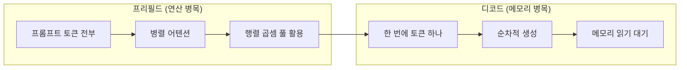
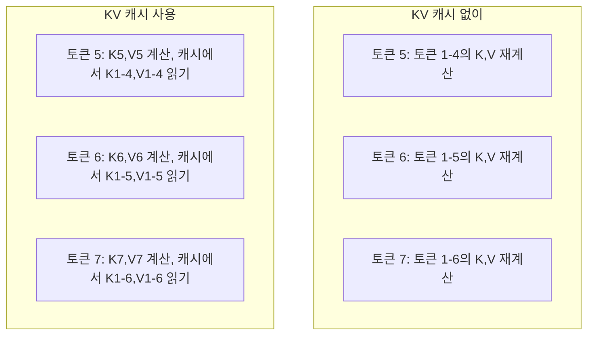
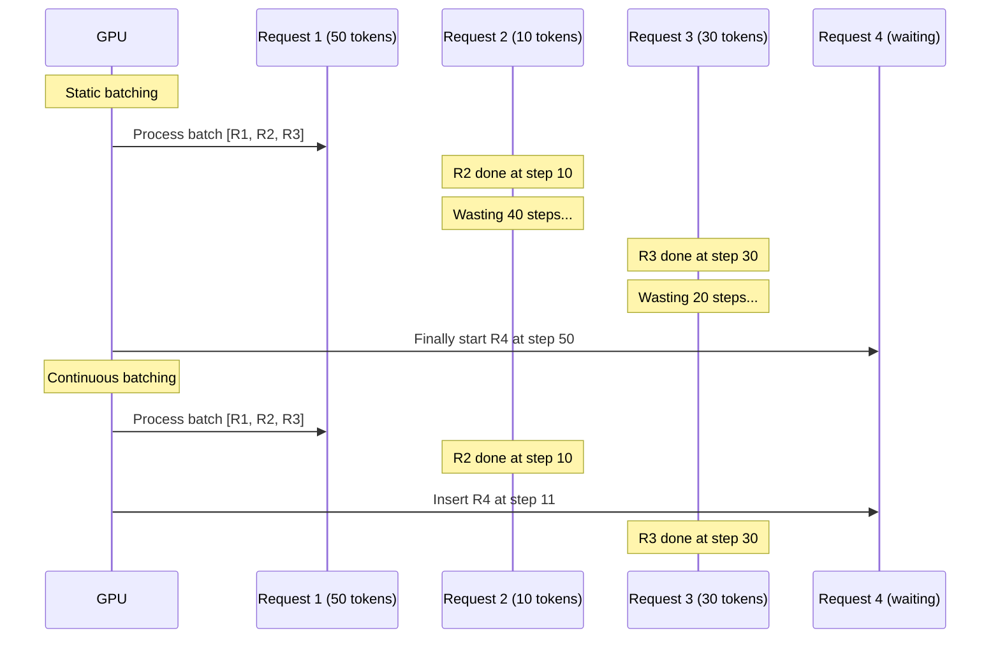
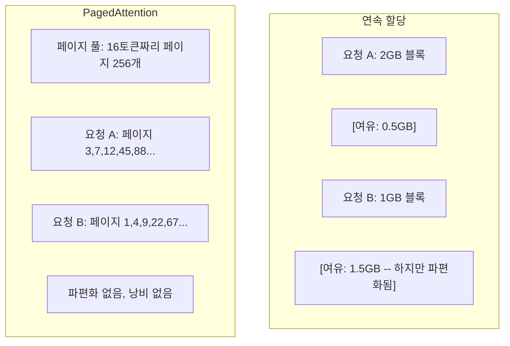
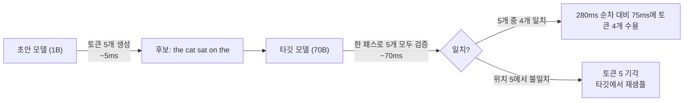

> 🇰🇷 이 문서는 한국어 번역본입니다(ELI5 스타일). 원문: [en.md](en.md)

# 추론 최적화

> LLM 추론을 정의하는 두 페이즈가 있습니다. 프리필드(prefill)는 프롬프트를 병렬로 처리합니다 — 연산 병목입니다. 디코드(decode)는 토큰을 하나씩 생성합니다 — 메모리 병목입니다. 모든 최적화는 이 둘 중 하나 또는 둘 다를 겨냥합니다.

**유형:** 빌드
**언어:** Python
**선수 지식:** 페이즈 10, 레슨 01-08 (트랜스포머 아키텍처, 어텐션)
**시간:** 약 120분

## 학습 목표

- 자기회귀적(autoregressive) 토큰 생성 중 불필요한 계산을 없애는 KV 캐시를 구현합니다
- LLM 추론의 프리필드 vs 디코드 페이즈와, 각각이 왜 다른 병목(연산 병목 vs 메모리 병목)을 갖는지 설명합니다
- 동시 요청 상황에서 GPU 활용도를 극대화하는 연속 배칭(continuous batching)과 PagedAttention 개념을 구현합니다
- 추론 최적화 기법들(KV 캐시, 스페큘레이티브 디코딩, 플래시 어텐션)과 그 처리량/지연 시간 트레이드오프를 비교합니다

## 문제 상황

여러분이 4xA100 GPU에 Llama 3 70B를 배포했습니다. 한 명의 사용자는 초당 약 50 토큰을 받습니다. 빠르다고 느껴지죠. 그런데 100명의 사용자가 동시에 엔드포인트를 두드립니다. 처리량이 사용자당 초당 3 토큰으로 떨어집니다. 월 $25,000짜리 GPU 청구서로 사람이 타이핑하는 것보다 느린 응답을 서빙하고 있는 겁니다.

1명일 때와 100명일 때 모델 자체는 달라지지 않습니다. 같은 가중치, 같은 아키텍처, 같은 수학입니다. 달라지는 것은 작업을 어떻게 스케줄링하느냐입니다. 순진한 추론은 가용 GPU 연산의 90% 이상을 낭비합니다. 47번째 토큰을 기다리는 사용자가 배치 슬롯 하나를 온전히 잡아 두는 동안, GPU 메모리 버스는 행렬 곱셈 사이사이에서 놀고 있습니다. 한편 새 사용자의 2,000토큰 프롬프트는 그 죽은 시간을 유용한 연산으로 채울 수 있었을 텐데요.

이건 확장성(scalability) 문제가 아닙니다. 스케줄링 문제입니다. 이 레슨의 기법들 — KV 캐싱, 연속 배칭, PagedAttention, 스페큘레이티브 디코딩, 프리픽스 캐싱 — 이 같은 트래픽을 월 $25k짜리 추론 청구서와 월 $5k짜리 청구서로 가르는 차이입니다.

4xA100-80GB에서 Llama 3 70B를 서빙하는 vLLM은 낮은 동시성에서 사용자당 약 50 토큰/초를 내고, 연속 배칭과 PagedAttention 덕분에 동시 요청 100개에서도 사용자당 15-25 TPS를 유지합니다. 이 최적화들이 없으면 같은 하드웨어가 그 동시성에서 사용자당 5 TPS밖에 서빙하지 못합니다. 같은 GPU, 같은 모델, 4배의 처리량.

## 개념

### 프리필드 vs 디코드

모든 LLM 추론 요청은 뚜렷이 다른 두 페이즈를 거칩니다.

**프리필드(prefill)**는 입력 프롬프트 전체를 처리합니다. 모든 토큰이 이미 알려져 있으므로, 어텐션은 전체 시퀀스에 걸쳐 병렬로 계산될 수 있습니다. 커다란 행렬 곱셈이죠 — GPU 코어가 계속 바쁩니다. 병목은 연산입니다: 하드웨어가 초당 얼마나 많은 FLOPS를 내는지. A100은 312 TFLOPS(BF16)입니다. 70B 모델에서 4,096토큰 프롬프트의 프리필드는 A100 한 장에서 약 400ms 걸립니다.

**디코드(decode)**는 출력 토큰을 한 번에 하나씩 생성합니다. 각 새 토큰은 이전 토큰 전부에 어텐션하지만, 포워드 패스당 토큰은 하나만 만들어 집니다. 가중치 행렬은 프리필드 때와 같은 크기인데, 행렬이 아니라 단일 벡터를 곱하는 것뿐입니다. GPU 코어는 몇 마이크로초 만에 끝나고, 다음 가중치 배치가 메모리에서 도착하길 기다립니다. 병목은 메모리 대역폭입니다: HBM에서 연산 장치로 모델 가중치를 얼마나 빨리 흘려보낼 수 있는지. A100의 대역폭은 2 TB/s입니다. FP16의 70B 모델은 140GB입니다. 모델 전체를 한 번 읽는 데 70ms — 이것이 디코드 한 스텝의 하한선입니다.



**ops:byte 비율**(산술 강도(arithmetic intensity)라고도 합니다)이 이 트레이드오프를 포착합니다. 메모리에서 바이트 1개를 읽을 때 몇 개의 연산을 수행하는지 측정하는 것이죠.

```
ops:byte ratio = FLOPs per token / bytes read from memory
```

4,096토큰 배치의 프리필드에서는 가중치 1개를 읽을 때 약 4,096번의 곱셈-누적 연산을 수행합니다. 비율이 높습니다 — 연산 병목입니다. 배치 크기 1의 디코드에서는 가중치 1개당 약 1개의 연산을 합니다. 비율이 낮습니다 — 메모리 병목입니다.

근본적인 통찰: *디코드가 메모리 병목인 이유는 토큰 하나를 만들려고 모델 전체를 읽기 때문입니다*. 아래의 모든 최적화는 읽는 양을 줄이거나, 읽기당 처리하는 토큰 배치를 늘리거나, 아예 읽기를 피합니다.

### KV 캐시

어텐션에서 각 토큰의 쿼리는 이전 토큰 전부의 키(key)와 값(value) 벡터에 어텐션합니다. 캐시가 없다면 N번째 토큰을 생성하려면 앞선 N-1개 토큰 전부의 키와 값 투영(projection)을 다시 계산해야 합니다. 토큰 1은 2번째 토큰 생성 때 투영되고, 3번째 때 또, 4번째 때 또. 1,000번째 토큰에 이르면 토큰 1은 총 999번 투영된 셈입니다.

KV 캐시는 이전 토큰 전부의 키와 값 투영을 저장합니다. N번째 토큰을 생성할 때는 토큰 N의 키와 값만 계산하고, 캐시된 1~N-1번 토큰의 K/V와 이어 붙입니다.



**KV 캐시의 메모리 공식:**

```
KV cache size = 2 * num_layers * num_kv_heads * head_dim * seq_len * bytes_per_param
```

Llama 3 70B의 경우(80 레이어, GQA로 KV 헤드 8개, head_dim=128, BF16):

```
토큰당: 2 * 80 * 8 * 128 * 2 bytes = 327,680 bytes = 320 KB
4,096 토큰: 320 KB * 4,096 = 1.28 GB
128K 토큰: 320 KB * 131,072 = 40 GB
```

Llama 3 70B의 128K 컨텍스트 대화 하나가 KV 캐시 40GB를 먹습니다 — A100 메모리의 절반이죠. 4K 토큰씩 쓰는 동시 사용자 100명이면 KV 캐시만으로 128GB가 필요합니다. 이것이 KV 캐시 관리가 추론 최적화의 중심 과제인 이유입니다.

### 연속 배칭 (Continuous Batching)

정적 배칭(static batching)은 N개 요청의 배치가 도착하길 기다렸다가 함께 처리하고, *전부* 끝나길 기다린 후에야 새 요청을 받습니다. 어떤 요청은 500토큰이 필요하고 다른 요청은 10토큰만 필요하다면, 짧은 요청은 끝난 뒤에도 490번의 디코드 스텝 동안 놀게 됩니다.

연속 배칭(continuous batching, 반복 수준 배칭이라고도 합니다)은 어떤 요청이 끝나는 즉시 새 요청을 배치에 끼워 넣습니다. 배치는 매 디코드 스텝마다 재평가됩니다. 10토큰 후 끝난 요청은 대기 중인 요청으로 즉시 교체되죠.



처리량 개선 폭은 출력 길이가 얼마나 들쭉날쭉한지에 달려 있습니다. 길이가 균등하면 연속 배칭은 정적 배칭과 같습니다. 길이가 제각각이면(흔한 경우) 연속 배칭은 GPU 슬롯이 절대 비지 않기 때문에 2-5배 높은 처리량을 낼 수 있습니다.

### PagedAttention

요청별 KV 캐시는 메모리의 연속된 블록입니다. 요청이 오가면 메모리가 파편화됩니다 — 운영체제의 RAM 파편화와 똑같이요. 4K 토큰 요청에는 1.28GB가 연속으로 필요합니다. 여유 메모리가 총 2GB 있어도 1.28GB가 *연속으로* 있지는 않을 수 있습니다. 메모리를 낭비하거나 요청을 거절해야 하죠.

PagedAttention(vLLM이 만듦)은 OS 방식의 가상 메모리를 KV 캐시에 적용합니다. 요청마다 연속 블록 하나를 할당하는 대신, 고정 크기의 "페이지"(보통 16토큰씩)를 할당합니다. 페이지는 물리적 GPU 메모리 어디에나 있을 수 있습니다. 페이지 테이블이 각 요청의 논리적 시퀀스 위치를 물리적 페이지 위치로 매핑합니다.



PagedAttention은 공유 프리픽스를 위한 **쓰기 시 복사(copy-on-write)**도 가능하게 합니다. 50개 요청이 같은 시스템 프롬프트를 공유한다면, 그 시스템 프롬프트의 KV 캐시 페이지는 한 번만 저장되고 50개 요청이 모두 참조합니다. 요청이 갈라져 나갈 때(서로 다른 사용자 메시지)에만 자기 페이지를 갖게 됩니다. 공유 시스템 프롬프트가 있는 애플리케이션에서는 메모리 사용량이 극적으로 줄어듭니다.

vLLM은 PagedAttention 덕분에 메모리 낭비가 거의 0이라고 보고합니다(순진한 할당의 약 60-80% 대비 약 4%).

### 스페큘레이티브 디코딩 (Speculative Decoding)

디코드가 느린 이유는 순차적이기 때문입니다 — 토큰을 하나 만들고, 다시 넣고, 다음 토큰을 만듭니다. 하지만 다음 5개 토큰을 싸게 추측한 뒤 한꺼번에 검증할 수 있다면 어떨까요?

스페큘레이티브 디코딩은 작고 빠른 **초안 모델(draft model)**로 K개 후보 토큰을 생성합니다. 그러면 큰 **타깃 모델(target model)**이 K개 후보 전부를 단일 포워드 패스로 처리합니다(프리필드처럼 보이죠 — 병렬이고, 연산 병목이고, 효율적입니다). 타깃 모델이 초안 모델의 예측에 동의하면, 타깃 포워드 패스 한 번의 시간에 K개 토큰 전부를 수용합니다. 위치 j에서 동의하지 않으면 토큰 1~j-1을 수용하고 나머지는 버립니다.



가속 폭은 **수용률(acceptance rate)** — 초안 모델의 예측이 타깃과 일치하는 빈도 — 에 달려 있습니다. Llama 3 8B가 Llama 3 70B의 초안을 잡을 때 자연어에서 수용률 70-85%가 전형적입니다. 이는 2-3배의 디코드 가속으로 이어집니다.

스페큘레이티브 디코딩의 세 가지 접근법:

| 방법 | 초안 출처 | 수용률 | 오버헤드 |
|--------|-------------|-----------------|----------|
| Draft-target (Leviathan et al.) | 별도의 작은 모델 | 70-85% | 초안 모델 메모리 |
| EAGLE (Li et al.) | 타깃 위의 가벼운 헤드 | 75-90% | 파라미터 약 1% 추가 |
| N-gram 조회 | 토큰 n-gram 테이블 | 40-60% | 무시할 수준 |

**EAGLE**은 타깃 모델의 히든 스테이트 위에 작은 자기회귀 헤드를 학습시킵니다. 타깃 모델의 끝에서 두 번째 레이어 특성을 사용해 다음 토큰의 임베딩을 예측하죠. 별도 모델의 표현이 아니라 타깃 모델 자신의 표현 위에서 동작하기 때문에, 최소한의 추가 메모리로 더 높은 수용률을 달성합니다. EAGLE-2는 컨텍스트에 따라 후보 수를 조절하는 동적 초안 트리를 추가합니다.

**N-gram 스페큘레이티브 디코딩**은 현재 컨텍스트나 미리 만든 코퍼스에서 n-gram 연속을 테이블로 유지합니다. 초안이 같은 대화에서 전에 나왔던 것과 일치하면(반복 패턴, 코드, 구조화된 출력) 신경망 오버헤드 0으로 발동합니다. 평균 수용률은 낮지만 추측 한 번의 비용이 사실상 공짜입니다.

스페큘레이티브 디코딩은 *수학적으로 정확합니다* — 출력 분포가 타깃 모델의 분포와 동일합니다. 근사가 아닙니다. 검증 단계가 수용된 모든 토큰이 타깃 모델이 부여했을 정확한 확률을 갖도록 보장합니다.

### 프리픽스 캐싱 (Prefix Caching)

많은 요청이 같은 프리픽스를 공유합니다. 챗봇 시스템 프롬프트, RAG 컨텍스트 블록, 퓨샷(few-shot) 예시 세트 같은 것들이요. 프리픽스 캐싱이 없으면 모든 요청이 이 공유 토큰들의 KV 캐시를 처음부터 다시 계산합니다.

프리픽스 캐싱은 공통 프리픽스의 KV 캐시를 저장해 요청들 사이에서 재사용합니다. 알려진 프리픽스를 가진 새 요청이 오면, 시스템은 캐시된 KV 항목을 복사(또는 참조)하고 고유한 접미사에 대해서만 KV를 계산합니다.

모든 요청이 공유하는 2,000토큰 시스템 프롬프트라면, 프리픽스 캐싱은 요청당 프리필드 약 400ms를 없앱니다. 초당 100개 요청이라면 초당 40초분의 GPU 연산을 아낀다는 뜻입니다 — GPU 한 장 몫보다 많은 일이죠.

SGLang의 RadixAttention은 프리픽스를 토큰 내용으로 색인하는 래딕스 트리(radix tree, 트라이)로 프리픽스 캐싱을 구현합니다. 저장된 프리픽스와 일치하는 요청은 KV 캐시를 공짜로 얻습니다. 트리는 부분 프리픽스 일치도 지원합니다 — 캐시된 항목과 2,000개 프리픽스 토큰 중 1,500개를 공유한다면, 그 1,500개를 재사용하고 500개만 다시 계산합니다.

### 추론 엔진

프로덕션(운영 환경) LLM 서빙을 지배하는 세 엔진:

| 엔진 | 핵심 혁신 | 가장 적합한 용도 |
|--------|---------------|----------|
| vLLM | PagedAttention, 연속 배칭 | 범용 서빙, 최고 호환성 |
| SGLang | RadixAttention (프리픽스 캐싱), 구조화된 생성 | 멀티턴 챗봇, 제약 디코딩 |
| TensorRT-LLM | NVIDIA 커널 퓨전, FP8 양자화 | NVIDIA 하드웨어에서 최대 단일 GPU 처리량 |

**vLLM**은 기본 시작점입니다. 가장 넓은 범위의 모델을 지원하고, 어떤 GPU 벤더(NVIDIA, AMD, Intel)에서든 돌아가며, PagedAttention + 연속 배칭으로 강력한 처리량을 냅니다. OpenAI 호환 API라서 OpenAI API 호출을 대체품으로 바로 끼워 넣을 수 있습니다.

**SGLang**은 vLLM과 같은 기반 위에 프리픽스 캐싱용 RadixAttention과 구조화된 LLM 프로그램용 도메인 특화 언어를 더합니다. 워크로드가 멀티턴 대화, 도구 사용, 제약 디코딩(JSON 출력, 정규식 유도 생성)을 포함한다면, SGLang이 프리픽스 재사용으로 vLLM을 2-5배 앞서는 경우가 많습니다.

**TensorRT-LLM**은 모델을 최적화된 NVIDIA GPU 커널로 컴파일합니다. 연산을 퓨전하고(어텐션 + 선형 + 활성화를 한 커널로), H100 GPU에서 FP8을 쓰며, 프로덕션 배포를 위해 NVIDIA Triton Inference Server와 통합됩니다. NVIDIA 하드웨어에서 최고의 단일 GPU 처리량을 내지만 설정이 더 필요하고 NVIDIA GPU에서만 동작합니다.

Llama 3 70B의 실제 수치(4xA100-80GB, BF16):

| 지표 | vLLM | SGLang | TensorRT-LLM |
|--------|------|--------|---------------|
| 처리량 (1명) | ~50 TPS | ~55 TPS | ~65 TPS |
| 처리량 (100명) | 총 ~2,500 TPS | 총 ~3,200 TPS | 총 ~3,000 TPS |
| 첫 토큰까지 시간 | ~400ms | ~300ms (프리픽스 히트) | ~350ms |
| 최대 컨텍스트 | 128K | 128K | 128K |

### Ops:Byte 프레임워크

측정하지 않는 것은 최적화할 수 없습니다. ops:byte 비율이 연산 병목인지 메모리 병목인지 알려 주고, 그것이 어떤 최적화가 중요한지를 결정합니다.

```
Compute roof: peak FLOPS of the GPU
Memory roof:  peak bandwidth * ops:byte ratio
```

ops:byte가 낮으면(디코드, 작은 배치) 메모리 대역폭 천장에 부딪힙니다. 연산을 더해도(높은 클럭, 더 많은 코어) 소용없습니다. 메모리 읽기를 줄이거나(양자화, KV 캐시 압축) 배치 크기를 늘려 읽기를 더 많은 유용한 작업에 분산해야 합니다.

ops:byte가 높으면(프리필드, 큰 배치) 연산 천장에 부딪힙니다. 메모리 대역폭 최적화는 도움이 안 됩니다. 더 빠른 GPU, 커널 퓨전, 낮은 정밀도로 FLOPS를 더 짜내야 합니다.

| 시나리오 | ops:byte | 병목 | 최적화 수단 |
|----------|----------|-------|---------------|
| 프리필드, 배치=1 | ~4,096 | 연산 | 커널 퓨전, FP8 |
| 디코드, 배치=1 | ~1 | 메모리 | 양자화, KV 압축 |
| 디코드, 배치=32 | ~32 | 메모리 | 더 큰 배치, 연속 배칭 |
| 디코드, 배치=256 | ~256 | 전환점 | 둘 다 중요 |
| 디코드, 배치=1024 | ~1,024 | 연산 | 커널 퓨전, 텐서 병렬화 |

A100의 교차점은 ops:byte = 156(312 TFLOPS / 2 TB/s) 근처입니다. 156 미만이면 메모리 병목, 156 초과면 연산 병목입니다. 연속 배칭은 반복당 더 많은 토큰을 담아 디코드를 이 교차점 쪽으로 밀어 넣습니다.

```figure
context-window-slide
```

## 만들어 보기

### 단계 1: KV 캐시를 처음부터 만들기

레이어별, 헤드별로 키와 값 투영을 저장하는 멀티헤드 KV 캐시를 만들고 메모리 증가 패턴을 확인합니다.

```python
import numpy as np

class KVCache:
    def __init__(self, num_layers, num_heads, head_dim, max_seq_len, dtype=np.float16):
        self.num_layers = num_layers
        self.num_heads = num_heads
        self.head_dim = head_dim
        self.max_seq_len = max_seq_len
        self.dtype = dtype

        self.k_cache = np.zeros(
            (num_layers, num_heads, max_seq_len, head_dim), dtype=dtype
        )
        self.v_cache = np.zeros(
            (num_layers, num_heads, max_seq_len, head_dim), dtype=dtype
        )
        self.seq_len = 0

    def update(self, layer_idx, new_keys, new_values):
        num_new = new_keys.shape[1]
        end = self.seq_len + num_new
        self.k_cache[layer_idx, :, self.seq_len:end, :] = new_keys
        self.v_cache[layer_idx, :, self.seq_len:end, :] = new_values
        return (
            self.k_cache[layer_idx, :, :end, :],
            self.v_cache[layer_idx, :, :end, :]
        )

    def advance(self, num_tokens):
        self.seq_len += num_tokens

    def memory_bytes(self):
        return self.k_cache.nbytes + self.v_cache.nbytes

    def used_bytes(self):
        per_token = 2 * self.num_layers * self.num_heads * self.head_dim * np.dtype(self.dtype).itemsize
        return per_token * self.seq_len
```

### 단계 2: KV 캐시를 쓰는 어텐션

디코드 스텝에서 KV 캐시를 사용하는 단순화된 멀티헤드 어텐션입니다.

```python
def scaled_dot_product_attention(query, keys, values):
    head_dim = query.shape[-1]
    scores = np.matmul(query, keys.transpose(0, 1, 3, 2)) / np.sqrt(head_dim)
    seq_len_q = scores.shape[-2]
    seq_len_k = scores.shape[-1]
    if seq_len_q > 1:
        mask = np.triu(np.ones((seq_len_q, seq_len_k), dtype=np.float32), k=seq_len_k - seq_len_q + 1)
        scores = scores + mask * (-1e9)
    max_scores = np.max(scores, axis=-1, keepdims=True)
    exp_scores = np.exp(scores - max_scores)
    attn_weights = exp_scores / np.sum(exp_scores, axis=-1, keepdims=True)
    return np.matmul(attn_weights, values)


class MultiHeadAttention:
    def __init__(self, d_model, num_heads):
        self.num_heads = num_heads
        self.head_dim = d_model // num_heads
        scale = np.sqrt(2.0 / d_model)
        self.W_q = np.random.randn(d_model, d_model).astype(np.float32) * scale
        self.W_k = np.random.randn(d_model, d_model).astype(np.float32) * scale
        self.W_v = np.random.randn(d_model, d_model).astype(np.float32) * scale
        self.W_o = np.random.randn(d_model, d_model).astype(np.float32) * scale

    def forward(self, x, kv_cache=None, layer_idx=0):
        batch, seq_len, d_model = x.shape
        Q = np.matmul(x, self.W_q).reshape(batch, seq_len, self.num_heads, self.head_dim).transpose(0, 2, 1, 3)
        K = np.matmul(x, self.W_k).reshape(batch, seq_len, self.num_heads, self.head_dim).transpose(0, 2, 1, 3)
        V = np.matmul(x, self.W_v).reshape(batch, seq_len, self.num_heads, self.head_dim).transpose(0, 2, 1, 3)

        if kv_cache is not None:
            K_full, V_full = kv_cache.update(layer_idx, K[0], V[0])
            K = K_full[np.newaxis, :, :, :]
            V = V_full[np.newaxis, :, :, :]
            if seq_len == 1:
                kv_cache.advance(1)

        attn_out = scaled_dot_product_attention(Q, K, V)
        attn_out = attn_out.transpose(0, 2, 1, 3).reshape(batch, -1, d_model)
        return np.matmul(attn_out, self.W_o)
```

### 단계 3: 연속 배칭 시뮬레이터

정적 배칭과 연속 배칭의 스케줄링 차이를 시뮬레이션합니다.

```python
import heapq

class Request:
    def __init__(self, request_id, prompt_tokens, output_tokens, arrival_step):
        self.request_id = request_id
        self.prompt_tokens = prompt_tokens
        self.output_tokens = output_tokens
        self.arrival_step = arrival_step
        self.tokens_generated = 0
        self.start_step = None
        self.end_step = None

    def is_done(self):
        return self.tokens_generated >= self.output_tokens


def simulate_static_batching(requests, batch_size):
    step = 0
    completed = []
    queue = list(requests)
    queue.sort(key=lambda r: r.arrival_step)

    while queue:
        batch = []
        while queue and len(batch) < batch_size:
            r = queue.pop(0)
            r.start_step = max(step, r.arrival_step)
            batch.append(r)

        if batch:
            step = max(step, max(r.start_step for r in batch))
            max_output = max(r.output_tokens for r in batch)
            for r in batch:
                r.tokens_generated = r.output_tokens
                r.end_step = step + max_output
            step += max_output
            completed.extend(batch)

    return completed


def simulate_continuous_batching(requests, batch_size):
    step = 0
    completed = []
    queue = sorted(requests, key=lambda r: r.arrival_step)
    queue_idx = 0
    active = []
    waiting = []

    while queue_idx < len(queue) or active or waiting:
        while queue_idx < len(queue) and queue[queue_idx].arrival_step <= step:
            waiting.append(queue[queue_idx])
            queue_idx += 1

        while waiting and len(active) < batch_size:
            r = waiting.pop(0)
            r.start_step = step
            active.append(r)

        if not active:
            if waiting:
                step += 1
                continue
            elif queue_idx < len(queue):
                step = queue[queue_idx].arrival_step
                continue
            else:
                break

        for r in active:
            r.tokens_generated += 1

        done = [r for r in active if r.is_done()]
        for r in done:
            r.end_step = step + 1
            completed.append(r)
        active = [r for r in active if not r.is_done()]

        step += 1

    return completed


def batching_stats(completed):
    latencies = [r.end_step - r.arrival_step for r in completed]
    total_time = max(r.end_step for r in completed) - min(r.arrival_step for r in completed)
    total_tokens = sum(r.output_tokens for r in completed)
    return {
        "avg_latency": np.mean(latencies),
        "p50_latency": np.median(latencies),
        "p99_latency": np.percentile(latencies, 99),
        "total_time": total_time,
        "throughput": total_tokens / total_time if total_time > 0 else 0,
    }
```

### 단계 4: 프리픽스 캐시

공유 프리픽스의 KV 항목을 저장하는 트라이(trie) 기반 프리픽스 캐시입니다.

```python
class TrieNode:
    def __init__(self):
        self.children = {}
        self.kv_data = None
        self.hit_count = 0


class PrefixCache:
    def __init__(self, max_entries=1000):
        self.root = TrieNode()
        self.max_entries = max_entries
        self.total_entries = 0
        self.hits = 0
        self.misses = 0

    def _walk(self, token_ids):
        node = self.root
        depth = 0
        for tid in token_ids:
            if tid not in node.children:
                break
            node = node.children[tid]
            depth += 1
        return node, depth

    def lookup(self, token_ids):
        node, depth = self._walk(token_ids)
        if depth > 0:
            self.hits += 1
            current = self.root
            for tid in token_ids[:depth]:
                current = current.children[tid]
                current.hit_count += 1
            kv_entries = []
            current = self.root
            for tid in token_ids[:depth]:
                current = current.children[tid]
                if current.kv_data is not None:
                    kv_entries.append(current.kv_data)
            return depth, kv_entries
        self.misses += 1
        return 0, []

    def insert(self, token_ids, kv_per_token):
        node = self.root
        for i, tid in enumerate(token_ids):
            if tid not in node.children:
                if self.total_entries >= self.max_entries:
                    return i
                node.children[tid] = TrieNode()
                self.total_entries += 1
            node = node.children[tid]
            if i < len(kv_per_token):
                node.kv_data = kv_per_token[i]
        return len(token_ids)

    def hit_rate(self):
        total = self.hits + self.misses
        return self.hits / total if total > 0 else 0.0
```

### 단계 5: 스페큘레이티브 디코딩 시뮬레이터

수용률을 조절할 수 있는 초안-타깃 스페큘레이티브 디코딩을 시뮬레이션합니다.

```python
class DraftModel:
    def __init__(self, vocab_size, acceptance_rate=0.8):
        self.vocab_size = vocab_size
        self.acceptance_rate = acceptance_rate

    def generate(self, context, num_tokens):
        tokens = np.random.randint(0, self.vocab_size, size=num_tokens)
        return tokens

    def get_probs(self, context, token):
        probs = np.random.dirichlet(np.ones(self.vocab_size))
        return probs


class TargetModel:
    def __init__(self, vocab_size):
        self.vocab_size = vocab_size

    def get_probs(self, context, tokens=None):
        if tokens is not None:
            return [np.random.dirichlet(np.ones(self.vocab_size)) for _ in tokens]
        return np.random.dirichlet(np.ones(self.vocab_size))


def speculative_decode(draft_model, target_model, context, num_speculative=5,
                       draft_cost=1.0, target_cost=10.0, verify_cost=12.0):
    total_tokens = 0
    total_cost = 0.0
    accepted_counts = []
    context = list(context)

    max_tokens = 100

    while total_tokens < max_tokens:
        draft_tokens = draft_model.generate(context, num_speculative)
        total_cost += draft_cost * num_speculative

        target_probs = target_model.get_probs(context, draft_tokens)
        total_cost += verify_cost

        accepted = 0
        for i, token in enumerate(draft_tokens):
            draft_p = draft_model.get_probs(context + list(draft_tokens[:i]), token)
            target_p = target_probs[i]

            r = np.random.random()
            acceptance_prob = min(1.0, target_p[token] / (draft_p[token] + 1e-10))

            if r < draft_model.acceptance_rate:
                accepted += 1
                context.append(token)
                total_tokens += 1
            else:
                new_token = np.random.choice(draft_model.vocab_size, p=target_p)
                context.append(new_token)
                total_tokens += 1
                break

        accepted_counts.append(accepted)

        if accepted == num_speculative:
            bonus_probs = target_model.get_probs(context)
            bonus_token = np.random.choice(draft_model.vocab_size, p=bonus_probs)
            context.append(bonus_token)
            total_tokens += 1

    sequential_cost = total_tokens * target_cost
    return {
        "total_tokens": total_tokens,
        "speculative_cost": total_cost,
        "sequential_cost": sequential_cost,
        "speedup": sequential_cost / total_cost if total_cost > 0 else 1.0,
        "avg_accepted": np.mean(accepted_counts),
        "acceptance_rate": np.mean(accepted_counts) / num_speculative,
    }


def compare_speculation_strategies(vocab_size=1000, num_trials=20):
    results = {}

    for name, acceptance_rate, spec_tokens in [
        ("Draft-target (8B->70B)", 0.78, 5),
        ("EAGLE", 0.85, 6),
        ("N-gram", 0.50, 4),
        ("No speculation", 0.0, 0),
    ]:
        if spec_tokens == 0:
            results[name] = {
                "speedup": 1.0,
                "acceptance_rate": 0.0,
                "avg_accepted": 0.0,
            }
            continue

        trial_results = []
        for _ in range(num_trials):
            draft = DraftModel(vocab_size, acceptance_rate=acceptance_rate)
            target = TargetModel(vocab_size)
            context = list(np.random.randint(0, vocab_size, size=10))
            result = speculative_decode(draft, target, context, num_speculative=spec_tokens)
            trial_results.append(result)

        results[name] = {
            "speedup": np.mean([r["speedup"] for r in trial_results]),
            "acceptance_rate": np.mean([r["acceptance_rate"] for r in trial_results]),
            "avg_accepted": np.mean([r["avg_accepted"] for r in trial_results]),
        }

    return results
```

### 단계 6: KV 캐시 메모리 프로파일러

실제 모델 설정에 대한 KV 캐시 메모리 요구량을 계산합니다.

```python
MODEL_CONFIGS = {
    "Llama-3-8B": {
        "num_layers": 32, "num_kv_heads": 8, "head_dim": 128,
        "model_params_b": 8, "gqa": True,
    },
    "Llama-3-70B": {
        "num_layers": 80, "num_kv_heads": 8, "head_dim": 128,
        "model_params_b": 70, "gqa": True,
    },
    "Llama-3-405B": {
        "num_layers": 126, "num_kv_heads": 8, "head_dim": 128,
        "model_params_b": 405, "gqa": True,
    },
    "Mistral-7B": {
        "num_layers": 32, "num_kv_heads": 8, "head_dim": 128,
        "model_params_b": 7, "gqa": True,
    },
    "GPT-4-est": {
        "num_layers": 120, "num_kv_heads": 96, "head_dim": 128,
        "model_params_b": 1800, "gqa": False,
    },
}


def kv_cache_memory(config, seq_len, dtype_bytes=2):
    per_token = 2 * config["num_layers"] * config["num_kv_heads"] * config["head_dim"] * dtype_bytes
    total = per_token * seq_len
    return {
        "per_token_bytes": per_token,
        "per_token_kb": per_token / 1024,
        "total_bytes": total,
        "total_mb": total / (1024 ** 2),
        "total_gb": total / (1024 ** 3),
    }


def memory_budget(config, gpu_memory_gb, model_dtype_bytes=2, kv_dtype_bytes=2):
    model_memory_gb = config["model_params_b"] * 1e9 * model_dtype_bytes / (1024 ** 3)
    overhead_gb = gpu_memory_gb * 0.1
    available_for_kv = gpu_memory_gb - model_memory_gb - overhead_gb

    if available_for_kv <= 0:
        return {"error": "Model does not fit in GPU memory", "model_memory_gb": model_memory_gb}

    per_token = 2 * config["num_layers"] * config["num_kv_heads"] * config["head_dim"] * kv_dtype_bytes
    max_tokens = int(available_for_kv * (1024 ** 3) / per_token)

    return {
        "gpu_memory_gb": gpu_memory_gb,
        "model_memory_gb": round(model_memory_gb, 1),
        "overhead_gb": round(overhead_gb, 1),
        "available_for_kv_gb": round(available_for_kv, 1),
        "max_total_tokens": max_tokens,
        "max_users_at_2k": max_tokens // 2048,
        "max_users_at_4k": max_tokens // 4096,
        "max_users_at_32k": max_tokens // 32768,
    }
```

## 사용해 보기

vLLM으로:

```python
from vllm import LLM, SamplingParams

llm = LLM(
    model="meta-llama/Llama-3-70B-Instruct",
    tensor_parallel_size=4,
    enable_prefix_caching=True,
    max_model_len=8192,
    gpu_memory_utilization=0.9,
)

params = SamplingParams(temperature=0.7, max_tokens=256)
outputs = llm.generate(["Explain inference optimization in one paragraph."], params)
```

프리픽스 캐싱 + 구조화된 출력에는 SGLang으로:

```python
import sglang as sgl

@sgl.function
def classify(s, text):
    s += sgl.system("You are a classifier. Output JSON only.")
    s += sgl.user(f"Classify this text: {text}")
    s += sgl.assistant(sgl.gen("result", regex=r'\{"label": "(positive|negative|neutral)"\}'))

runtime = sgl.Runtime(model_path="meta-llama/Llama-3-70B-Instruct", tp_size=4)
sgl.set_default_backend(runtime)

results = classify.run_batch([
    {"text": "This product is amazing!"},
    {"text": "Terrible experience."},
    {"text": "It was okay I guess."},
])
```

TensorRT-LLM으로:

```python
import tensorrt_llm
from tensorrt_llm.runtime import ModelRunner

runner = ModelRunner.from_dir("./llama-70b-trt-engine/", rank=0)

outputs = runner.generate(
    batch_input_ids=[tokenizer.encode("Explain KV caching.")],
    max_new_tokens=256,
    temperature=0.7,
)
```

## 출시하기

이 레슨은 다음을 산출합니다:
- `outputs/skill-inference-optimization.md` -- LLM 추론 서빙을 진단하고 최적화하기 위한 스킬

## 연습 문제

1. KV 캐시 프로파일러를 수정해 FP16 vs FP8 vs INT4 KV 캐시 양자화를 비교해 보세요. 4K 컨텍스트의 Llama 3 70B에 대해 4xA100-80GB에서 각각의 최대 동시 사용자 수를 계산합니다. INT4로의 KV 양자화는 사용자 수용량을 대략 4배로 늘려야 합니다.

2. 연속 배칭 시뮬레이터를 확장해 GPU 활용도(스텝당 채워진 배치 슬롯 비율)를 추적해 보세요. 출력 길이가 파레토 분포(shape=1.5, scale=20)를 따르는 50개 요청에 대해 정적/연속 배칭의 활용도를 시간에 따라 그려 보세요. 연속 배칭은 80%를 넘는 활용도를 유지해야 합니다.

3. `num_kv_heads < num_query_heads`인 그룹 쿼리 어텐션(GQA) 버전의 KV 캐시를 구현해 보세요. Llama 3 70B는 쿼리 헤드 64개를 쓰지만 KV 헤드는 8개뿐입니다. 완전 멀티헤드 어텐션 대비 메모리 절감을 계산해 보세요(KV 캐시 크기 8배 절감).

4. LRU 축출을 쓰는 프리픽스 캐시를 만들어 보세요. max_entries를 500으로 놓고, 60%가 5개의 공통 프리픽스 중 하나를 공유하는 1,000개 요청을 생성합니다. 히트율을 측정하고 무제한 캐시와 비교해 보세요. 축출이 잘 되면 히트율이 55%를 넘어야 합니다.

5. 스페큘레이티브 디코딩 시뮬레이터를 확장해 트리 기반 추측(EAGLE-2 스타일)을 구현해 보세요. K개 초안 토큰의 단일 사슬 대신 후보 트리를 생성합니다(예: 3단계 각각에서 2갈래 = 잎 후보 8개). 선형 추측과 검증 라운드당 수용된 총 토큰 수를 비교해 보세요.

## 핵심 용어

| 용어 | 사람들이 말하는 것 | 실제 의미 |
|------|----------------|----------------------|
| 프리필드 | "프롬프트 처리" | 모든 입력 토큰에 대해 어텐션을 병렬로 계산 — 행렬 곱셈 전체가 GPU 코어를 바쁘게 유지하므로 연산 병목 |
| 디코드 | "토큰 생성" | 포워드 패스당 토큰 하나를 만들며 매번 모델 가중치 전체를 읽음 — 다음 가중치가 도착하기 전에 연산이 끝나버리므로 메모리 병목 |
| KV 캐시 | "어텐션 상태 캐싱" | 이전 토큰 전부의 키·값 투영을 저장해 디코드 스텝마다 재계산하지 않게 함 — 메모리를 연산과 맞바꾸는 거래 |
| 연속 배칭 | "동적 배칭" | 어떤 요청이 끝나는 즉시 실행 중인 배치에 새 요청을 끼워 넣음, 배치 전체를 기다리지 않고 매 디코드 반복마다 재평가 |
| PagedAttention | "KV 캐시용 가상 메모리" | 연속 블록 대신 고정 크기 페이지로 KV 캐시를 할당해 메모리 파편화를 없애고 공유 프리픽스의 쓰기 시 복사를 가능하게 함 |
| 스페큘레이티브 디코딩 | "초안 잡고 검증하기" | 빠른 초안 모델이 여러 토큰을 제안하면 타깃 모델 포워드 패스 한 번으로 전부 검증 — 수학적으로 정확, 2-3배 가속 |
| EAGLE | "자기 초안 스페큘레이티브 디코딩" | 별도 초안 모델 대신 타깃 모델 자신의 히든 스테이트 위에 가벼운 헤드를 학습시키는 변형, 더 높은 수용률 달성 |
| 프리픽스 캐싱 | "시스템 프롬프트 KV 재사용" | 공통 프리픽스(시스템 프롬프트, 퓨샷 예시)의 KV 캐시 항목을 저장해 요청들 사이에서 재사용, 불필요한 프리필드를 건너뜀 |
| Ops:byte 비율 | "산술 강도" | 연산 횟수와 읽은 메모리 바이트의 비율 — 워크로드가 연산 병목(높은 비율)인지 메모리 병목(낮은 비율)인지 결정 |
| 첫 토큰까지 시간 | "TTFT" | 요청을 받은 시점부터 첫 출력 토큰이 나오기까지의 지연 시간 — 긴 프롬프트에서는 프리필드 시간이 지배 |

## 더 읽을거리

- Kwon et al., "Efficient Memory Management for Large Language Model Serving with PagedAttention" (2023) -- 페이지형 KV 캐시 관리를 도입한 vLLM 논문, 현재 추론 서빙의 업계 표준
- Leviathan et al., "Fast Inference from Transformers via Speculative Decoding" (2023) -- 초안-검증 추측이 정확한 타깃 모델 분포를 내면서 2-3배 가속을 이룬다는 것을 증명한 기초 논문
- Li et al., "EAGLE: Speculative Sampling Requires Rethinking Feature Uncertainty" (2024) -- 별도 초안 모델 대신 타깃 모델 자신의 특성 위에 헤드를 학습시켜 더 높은 수용률을 달성
- Zheng et al., "SGLang: Efficient Execution of Structured Language Model Programs" (2024) -- 프리픽스 캐싱용 RadixAttention과 여러 번 호출되는 LLM 프로그램용 프로그래밍 모델을 소개
- Williams et al., "Roofline: An Insightful Visual Performance Model for Multicore Architectures" (2009) -- 연산 vs 메모리 병목을 추론하는 ops:byte 프레임워크를 형식화한 원조 roofline 논문
