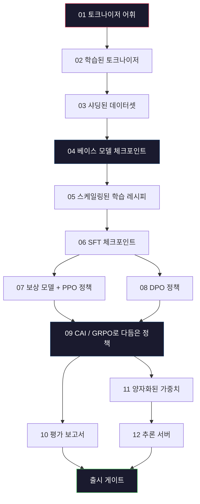
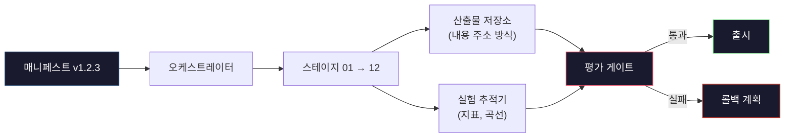

> 🇰🇷 이 문서는 한국어 번역본입니다(ELI5 스타일). 원문: [en.md](en.md)

# 완전한 LLM 파이프라인 만들기

> 레슨 01부터 12까지의 모든 내용은 하나의 파이프라인을 이루는 한 스테이지(stage)일 뿐입니다. 이 레슨은 그 스테이지들을 토큰화 → 사전 학습 → 스케일링 → SFT → 정렬(alignment) → 평가 → 양자화 → 서빙으로 이어지는 단 하나의 엔드투엔드 실행으로 묶어 주는 뼈대입니다. 노트북으로 70B 모델을 학습시키지는 않습니다. 대신 2026년 최전선(frontier) 팀이 무엇을 출시할지 판단할 때 쓰는 오케스트레이션 레이어, 매니페스트(manifest), 평가 게이트, 롤백 계획을 직접 만듭니다. 이것이 바로 종합 프로젝트(캡스톤)입니다.

**유형:** 빌드
**언어:** Python (표준 라이브러리)
**선수 지식:** 페이즈 10의 레슨 01-12 전부
**시간:** 약 120분

## 학습 목표

- 토크나이저, 데이터, 사전 학습, 스케일링, SFT, RLHF, DPO, CAI, 평가, 양자화, 추론에 이르는 앞선 열한 개의 레슨을 재현 가능한 파이프라인 명세 하나로 엮습니다
- 스테이지 간 산출물 계약을 정의합니다. 각 스테이지가 무엇을 소비하고 무엇을 생산하는지, 다음 스테이지가 그 입력을 어떻게 검증하는지입니다
- 실험을 추적하고 산출물에 해시를 붙이며, 평가 임계값을 기준으로 출시 결정을 가로막는 오케스트레이터(orchestrator)를 만듭니다
- 롤백 계획을 설계합니다. 어떤 산출물은 재실행이 저렴하고 어떤 것은 비싼지, 손상된 체크포인트는 얼마의 비용을 부르는지입니다

## 문제

앞선 레슨들은 각각 따로 놓고 보면 잘 동작합니다. 토크나이저를 학습시켰고, 작은 GPT를 사전 학습시켰고, SFT 데이터셋을 모았고, 보상 모델을 학습시켰고, DPO를 돌렸고, 평가를 측정했고, 양자화된 가중치를 내보냈고, 추론 서버를 띄웠습니다. 그러나 각각은 노트북 하나일 뿐입니다. 저마다 고유의 관례, 고유의 출력 경로, 고유의 시드(seed)를 갖고 있습니다.

최전선 수준의 학습 실행은 노트북이 아닙니다. Llama 3 405B는 약 54일에 걸쳐 H100 3,000만 시간을 소모했습니다. DeepSeek-V3는 약 280만 H800 시간을 사용했습니다. 그 시간 동안 체크포인트 하나가 손상되거나, 데이터 오염이 한 번 생기거나, 평가 점수가 한 번 후퇴하는 것만으로도 팀은 시간으로는 일주일, GPU 예산으로는 한 달을 잃을 수 있습니다. 팀들이 이런 재앙 속에서도 살아남는 방법은 파이프라인 위생(pipeline hygiene)입니다. 모든 스테이지가 결정론적 입력, 결정론적 출력, 매니페스트, 해시, 게이트를 갖추는 것이죠.

이것이 캡스톤입니다. 노트북에서 파이프라인을 엔드투엔드로 돌리지는 않습니다. 대신 스테이지들을 조율하는 오케스트레이터, 실행 전체를 기술하는 매니페스트, 출시 결정을 가르는 검증기, 그리고 파일 하나만으로 제삼자가 여러분의 작업을 재실행(리플레이)할 수 있게 해 주는 리플레이 계획을 작성합니다. 코드는 작지만, 규율은 큽니다.

이 패턴은 1억(100M) 파라미터에서 1조(1T) 파라미터까지 모양 그대로 확장됩니다. 매니페스트, 오케스트레이터, 평가 게이트, 산출물 저장소라는 같은 네 가지 구성 요소가 Llama 3를 돌리고, 여러분의 취미용 GPT도 돌립니다. 달라지는 것은 각 스테이지 설정 안의 숫자 크기이지, 파이프라인의 모양이 아닙니다.

## 개념

### 열두 개의 스테이지

페이즈 10의 모든 레슨이 하나의 스테이지입니다. 전체 의존성 그래프는 다음과 같습니다.



스테이지 07과 08은 병렬로 실행할 수 있습니다. 나머지는 모두 하드 의존성입니다. 스테이지 02(토크나이저)가 바뀌면 다운스트림 산출물 전부가 무효화됩니다. 스테이지 10(평가)이 바뀌면 출시 결정만 무효화됩니다.

### 매니페스트

매니페스트는 하나의 실행을 리플레이할 수 있을 만큼 충분히 완전하게 기술하는 파일 하나입니다. 파이프라인이 만들어내는 무엇도 매니페스트에 없는 상태에 의존해서는 안 됩니다. 필드들은 지루하지만 필수입니다.

```
pipeline_version: 1.2.3
seed: 42
git_commit: a1b2c3d4
stages:
  01_tokenizer:
    recipe: bpe_32k
    input_hash: sha256:...
    output_hash: sha256:...
    wall_clock_sec: 3600
    cost_usd: 12
```

스테이지 N의 출력 해시가 스테이지 N+1의 입력 해시입니다. 조금이라도 어긋나면 파이프라인은 멈춥니다. 데이터 손상을 초기에 잡아내는 방법이 바로 이것입니다. 동시에, 다른 대륙에 있는 팀원이 자신의 리플레이가 여러분과 같은 산출물을 만들었는지 검증하는 방법이기도 합니다.

실전에서 팀들은 작은 YAML 스키마에, 이전 성공 실행과 차이를 비교하는 매니페스트 검사기를 더해 사용합니다. 예상 필드(비용, 소요 시간) 밖에서 차이가 발견되면 그것은 위험 신호입니다.

### 산출물 타입 지정

각 스테이지의 출력은 타입이 지정된 산출물(artifact)입니다. 디렉터리 덩어리도, 피클(pickle) 파일도 아니고, 알려진 스키마를 가진 이름 붙은 타입입니다.

| 스테이지 | 산출물 타입 | 핵심 필드 |
|-------|--------------|-----------|
| 01-02 | 토크나이저 | vocab.json, merges.txt, config.json, 해시 |
| 03 | 데이터셋 | shards[], 행 수, 토큰 수, 중복 제거 통계 |
| 04-05 | 체크포인트 | weights.safetensors, config.json, 옵티마이저 상태, 스텝 수 |
| 06 | SFT 모델 | 체크포인트 + SFT 레시피 + 데이터 믹스 |
| 07 | 보상 모델 | RM 체크포인트 + 선호 데이터 해시 |
| 08-09 | 정책 | 체크포인트 + 참조 해시 + 베타 + 소비된 KL 예산 |
| 10 | 평가 보고서 | 벤치마크 점수 + 회귀 diff + 평가 데이터 해시 |
| 11 | 양자화 모델 | 양자화 가중치 + 캘리브레이션 데이터 + FP16 대비 정확도 변화 |
| 12 | 서버 명세 | 엔드포인트 + 모델 해시 + 설정 + 관측 가능성(옵저버빌리티) 훅 |

이 타입 지정은 가장 흔한 실패 모드를 막아 줍니다. 스테이지 08의 출력을 스테이지 06의 입력으로 쓰는 것, 즉 DPO로 학습한 모델을 SFT 경로로 출시하는 실수 말입니다. 타입이 지정된 산출물과 스테이지 시그니처는 이런 오류를 "5일째에 터지는 문제"가 아니라 "컴파일 타임에 잡히는 실패"로 바꿔 줍니다.

### 평가 게이트

출시는 "학습 끝"이 아닙니다. 출시는 "학습 끝, 그리고 평가 게이트 통과"입니다. 게이트는 실행이 시작되기 전에 정의해 둡니다.

```
gates:
  mmlu:      >= baseline + 0.5   # 회귀 없음
  humaneval: >= baseline + 1.0
  truthfulqa: >= baseline         # 하락 없음
  safety_refusal_rate: <= 0.05
  kl_from_reference: <= 25.0
  cost_total_usd: <= 50000
```

모든 게이트는 숫자 임계값입니다. "그럴듯해 보임" 같은 게이트는 없습니다. 주관적인 사인오프도 없습니다. 모든 게이트를 통과하면 산출물에 출시 가능 표시가 붙습니다. 게이트 하나라도 실패하면 실행은 보류(HOLD) 상태가 되고, 이름이 밝혀진 리뷰어가 명시적으로 재정의하기 전까지는 넘어가지 않습니다. 이 재정의 자체도 매니페스트에 기록됩니다.

두 개의 게이트가 대부분의 재앙을 잡아냅니다. *회귀* 게이트(새 모델이 핵심 벤치마크에서 최소한 이전 모델만큼은 좋아야 한다)는 학습 버그를 잡습니다. *KL 예산* 게이트(정렬된 정책이 참조 모델에서 X 이상 멀어지면 안 된다)는 정렬 과잉을 잡습니다. 프로덕션(운영 환경) 파이프라인이라면 둘 다 갖추고 있습니다.

### 오케스트레이터

매니페스트를 읽고, 스테이지를 dispatch하고, 산출물을 추적하며, 계약 위반이 생기면 멈추는 작은 코드 조각입니다. Airflow도 아니고 Kubeflow도 아닙니다. 파이프라인 위생을 위해서는 직접 작성한, 지루할 정도로 단순한 도구가 좋습니다.

오케스트레이터의 역할은 좁습니다:

1. 매니페스트에서 DAG(방향 비순환 그래프)를 해석합니다.
2. 각 스테이지마다 기대한 출력이 올바른 해시로 이미 존재하는지 확인합니다(존재하면 건너뜁니다).
3. 스테이지를 실행하고 stdout/stderr를 포착하며, 소요 시간과 비용을 측정합니다.
4. 출력 해시가 다운스트림 스테이지가 기대하는 입력 해시와 맞는지 검증합니다.
5. 실패 시 어느 스테이지가 실패했는지 정확히 적은 부분 매니페스트를 남기고 0이 아닌 종료 코드로 끝냅니다.

단 200줄짜리 Python입니다. 이 레슨의 `code/main.py` 파일이 그 모습입니다. 실제 파이프라인은 내부적으로 `torchrun`이나 `ray`로 클러스터 위에서 개별 스테이지를 실행하지만, 오케스트레이터 자체는 한 대의 머신에서 돕니다.

### 실험 추적과 산출물 저장

두 개의 외부 시스템이 파이프라인의 닻 역할을 합니다.

**실험 추적기(wandb, neptune, mlflow).** 스테이지별 손실 곡선, 평가 지표, 시스템 텔레메트리를 기록합니다. 3주 뒤에 실행 A와 실행 B를 비교해야 할 때 찾게 되는 곳이 바로 추적기입니다. 팀들은 거의 항상 호스팅형 추적기를 씁니다. 직접 만들면 학습에 써야 할 시간을 뺏기기 때문입니다.

**산출물 저장소(S3, R2, GCS).** 체크포인트, 데이터셋, 토크나이저, 평가 보고서를 보관하는 불변(immutable) 객체 저장소입니다. 산출물은 파일명이 아니라 해시로 주소 지정됩니다. `latest.pt` 같은 파일명은 스스로 발을 쏘는 격이고, `ckpt-7b-step-20000-sha256:abc123.safetensors`는 계약입니다.

오케스트레이터는 양쪽 모두에 기록합니다. 추적기는 차트를 보는 사람을 위한 것이고, 산출물 저장소는 입력을 찾는 다음 스테이지를 위한 것입니다.

### 비용 산정

최전선 수준의 실행에는 달러 숫자가 붙습니다. 예산 규율은 두 곳에서 작동합니다.

**실행 전 추정.** 매니페스트에서 예상 FLOPs(사전 학습의 경우 6 x 파라미터 수 x 토큰 수), 예상 GPU 시간(FLOPs / 피크 처리량 / 이용률), 현재 임대 요금 기준의 달러 비용을 계산합니다. 추정치가 예산 게이트를 넘으면 파이프라인은 시작을 거부합니다.

**실행 중 추적.** 스테이지별 소요 시간과 비용이 매니페스트에 기록됩니다. 스테이지가 끝날 때마다 남은 예산을 확인합니다. 한 스테이지가 초과했다면 다음 스테이지의 게이트는 갱신된 남은 예산으로 평가됩니다. VC에서 전화가 왔을 때야 비로소 돈이 떨어졌음을 알게 되어서는 안 됩니다.

Llama 3의 공표된 비용은 6,100만 달러였습니다. DeepSeek-V3는 본 사전 학습 실행에 560만 달러를 보고했습니다. 이 비율은 대부분 하드웨어 효율과 전문가 혼합(MoE, Mixture-of-Experts) 덕분입니다. 그런데 정확한 비용이 보이는 이유는 두 팀 모두 실행 단위가 아니라 스테이지 단위로 추적했기 때문입니다.

### 재현성 대 결정론성

이 둘은 같지 않습니다. *재현 가능*은 같은 매니페스트 + 같은 코드 + 같은 인프라가 downstream 지표가 동등한 체크포인트를 만들어 낸다는 뜻입니다. *결정론적*은 비트 단위로 동일한 출력이라는 뜻입니다.

현대 LLM 학습은 재현 가능하지만 결정론적이지 않습니다. 분산 학습의 리듀스 순서(reduce order), GPU 커널의 비결정론성(cuBLAS, flash-attn), 혼합 정밀도의 반올림이 겹쳐서 실행마다 1e-5 수준으로 다른 부동소수점 값이 나옵니다. 최종 지표는 움직이지 않으므로 문제되지 않습니다. 그러나 비트 수준 diff로 디버깅하려 들면 치명적입니다. 해결책은 모든 스테이지의 입력 해시, 출력 해시, 핵심 지표를 기록하는 것입니다. 이것들이 일치하면 가중치가 비트 단위로 같지 않더라도 그 실행은 "재현된" 것으로 봅니다.



### 롤백 계획

실행이 시작되기 전에, 각 스테이지가 실패했을 때 무엇을 할지 적어 둡니다. 세 범주입니다.

- **재실행이 저렴함**(시간 단위): 토크나이저, 평가, 양자화, 추론 서버. 그냥 다시 실행하면 됩니다.
- **중간**(며칠): SFT, DPO, CAI. 베이스 모델은 유지하고 정렬 스테이지만 다시 실행합니다.
- **비쌈**(수 주, 수백만 달러): 사전 학습. 여기서 롤백 계획은 "재실행"이 아닙니다. "마지막 정상 체크포인트를 쓰고, 수정된 데이터로 더 저렴한 다운스트림 스테이지들을 다시 실행한다"입니다.

스테이지 의존성이 타입 지정되고 해시화되어 있기 때문에, 오케스트레이터는 롤백 대상을 자동으로 계산할 수 있습니다. 실패한 스테이지와 그 모든 후손을 무효화하는 식입니다. 스테이지 06(SFT) 실패는 06, 07, 08, 09, 10, 11, 12를 무효화합니다. 스테이지 11(양자화) 실패는 11과 12만 무효화합니다. 이것을 미리 정해 두면 새벽 4시에 지쳐 있는 팀이 즉흥적으로 대응하는 일을 막을 수 있습니다.

### 2026년에 관찰된 프로덕션 레시피

대부분의 최전선 팀들은 같은 뼈대로 수렴했습니다.

- 토크나이저: 바이트 폴백을 갖춘 128k BPE. 작고 균형 잡힌 다국어 조각으로 학습.
- 사전 학습: 10-20조 토큰, 대부분 웹 + 코드 + 합성 데이터. Muon 또는 AdamW 옵티마이저. FSDP2 또는 DeepSpeed ZeRO-3. 그레이디언트 체크포인팅. BF16 가중치, FP32 마스터.
- SFT: 50만-200만 개의 지시문 쌍. 사람이 만든 것과 합성 데이터를 섞되, 평가 세트와는 철저히 중복 제거.
- 정렬: DPO 또는 CAI + GRPO. 선호 신호가 너무 다차원적이라 DPO로 부족한 곳에만 RLHF.
- 평가: MMLU-Pro, MATH, HumanEval+, GPQA, SWE-Bench Verified, LiveBench, 그리고 대중은 결코 보지 못하는 비공개 홀드아웃 세트.
- 양자화: 서빙에는 4비트 GPTQ 또는 AWQ, 정확도 변화가 중요한 안전 평가에는 8비트.
- 서빙: vLLM, TensorRT-LLM 또는 자체 개발. 연속 배칭. 추측 디코딩(speculative decoding). KV 캐시 축출(eviction).

숫자는 여섯 달마다 바뀝니다. 뼈대는 바뀌지 않습니다.

```figure
beam-search
```

## 만들어 보기

이 레슨의 코드는 열두 개의 학습 스크립트가 아니라 오케스트레이터와 매니페스트 검사기입니다. 각 스테이지는 올바른 모양과 해시를 가진 출력 산출물을 만드는 플레이스홀더(자리표시자)로 시뮬레이션됩니다. 오케스트레이터를 엔드투엔드로 돌려 보면, 실제 스테이지에 GPU 비용을 쓰기 전에 파이프라인의 배관이 제대로 작동함을 확인할 수 있습니다.

전체 구현은 `code/main.py`에 있습니다. 핵심 조각들은 다음과 같습니다:

- `Manifest` 데이터클래스: 파이프라인 버전, 시드, git 커밋, 스테이지, 게이트.
- `Stage` 데이터클래스: 이름, 타입, 입력(해시), 출력(해시), 소요 시간, 비용.
- `Orchestrator.run()`: DAG 해석, 스테이지 dispatch, 해시 검증, 매니페스트 갱신.
- `EvalGate.check()`: 임계값을 읽어 최신 평가 보고서와 비교하고 통과/실패를 반환합니다.
- `ArtifactStore`(인메모리 스텁): 해시로 put/get, S3를 시뮬레이션합니다.
- `CostTracker`: 스테이지별 및 누적 비용, 한도 초과 시 정지.

`main.py`의 파이프라인은 열두 개의 플레이스홀더 스테이지를 실행하고 매니페스트를 만들며, 일부러 실패하는 평가 게이트를 시험해 보류된 실행이 어떤 모습인지 보여 줍니다. 각 플레이스홀더를 해당 레슨의 실제 학습 스크립트로 바꾸면 실제 최전선 파이프라인이 쓰는 뼈대가 완성됩니다.

## 사용해 보기

표준 워크플로는 세 개의 명령어입니다.

```
python code/main.py plan    # 매니페스트 검증, 비용 추정 계산, DAG 출력
python code/main.py run     # 스테이지를 실행하며 manifest.out.yaml에 기록
python code/main.py gate    # manifest.out.yaml을 읽고 평가 게이트를 적용, 출시 또는 보류 판정
```

항상 `plan`을 먼저 실행하십시오. 대부분의 파이프라인 버그는 plan 단계에서 드러납니다. 빠진 게이트 임계값, 오래된 해시, 예산 초과 같은 것들이요. `plan`은 공짜이고 `run`은 비쌉니다. 싼 쪽에서 버그를 잡아 돈을 아끼십시오.

`gate`의 출력은 `SHIP` 또는 `HOLD: <이유>`입니다. 보류된 실행은 실패가 아니라 의사 결정 지점입니다. 이름이 밝혀진 리뷰어가 재정의하거나(재정의는 기록됩니다) 롤백을 승인합니다.

## 출시하기

이 레슨은 `outputs/skill-llm-pipeline-reviewer.md`를 만듭니다. 제안된 파이프라인 매니페스트를 넣으면 스테이지 타입 지정, 해시 체인, 게이트, 롤백 계획, 비용 추정 등 모든 계약을 검사합니다. 평가 게이트가 빠졌거나, KL 예산이 무제한이거나, 평가 데이터와 학습 데이터가 섞인 실행을 담은 매니페스트는 승인을 거부합니다.

## 연습 문제

1. 스테이지 07과 08을 병렬 실행하도록 오케스트레이터를 확장해 보세요. 표준 라이브러리의 `concurrent.futures` 모듈을 사용합니다. 최종 매니페스트에 두 스테이지의 출력이 모두 기록되는지, 그리고 스테이지 09의 입력 해시가 둘의 결정론적 조합이 되는지 확인해 보세요.

2. "오염 검사" 게이트를 추가해 보세요. 평가 데이터셋 해시와 학습 데이터셋 샤드가 주어지면 겹침을 계산합니다(정확한 문자열 일치 또는 13-그램 일치). 겹침이 0.1%를 넘으면 게이트가 실패합니다. 오염된 학습 세트를 넣어 게이트가 실행을 보류하는지 확인해 보세요.

3. 첫 원리부터 비용 추정기를 구현해 보세요. 스테이지 04(사전 학습)에 대해 FLOPs를 6 x 파라미터 수 x 토큰 수로 추정하고, BF16 기준 989 TFLOPs인 H100에서 MFU(모델 FLOPs 이용률)를 40%로 가정하며, 비용은 GPU시간당 2.50달러로 계산합니다. 2조 토큰으로 학습하는 7B 모델의 추정치를 보고하고, 공개된 Llama 2 수치와 비교해 보세요.

4. 부분 롤백을 만들어 보세요. 스테이지 09(CAI)에서 실패를 시뮬레이션한 뒤, 01-08은 캐시에 둔 채 스테이지 09부터 12까지 다시 실행합니다. 오케스트레이터는 해시로 캐시된 산출물을 감지해 건너뛰어야 합니다. 전체 재실행 대비 절약된 시간을 측정해 보세요.

5. 관측 가능성을 추가해 보세요. 각 스테이지마다 파라미터 수, 본 토큰 수, 손실, 비용 속성을 담은 OpenTelemetry 스팬(span)을 내보내고, 그 스팬을 로컬 수집기로 흘려 보냅니다. 요점은 대시보드가 아니라, 하나의 trace ID만으로 모든 스테이지의 건강 상태를 추적할 수 있게 하는 것입니다.

## 핵심 용어

| 용어 | 사람들이 말하는 방식 | 실제 의미 |
|------|----------------|----------------------|
| 매니페스트(Manifest) | "레시피 파일" | 파이프라인 버전, 시드, 스테이지별 설정, 게이트 임계값을 기술한 YAML 또는 JSON — 실행을 재현하기에 충분한 정보 |
| 내용 주소 방식(Content-addressed) | "이름이 아니라 해시로" | 산출물을 내용의 SHA-256으로 저장하기 때문에 버전 A와 버전 B를 절대 혼동할 수 없음 |
| 평가 게이트(Eval gate) | "출시 기준" | 산출물에 출시 가능 표시가 붙기 전에 통과해야 하는, 벤치마크 지표와 안전 점수에 대한 숫자 임계값 |
| KL 예산(KL budget) | "정렬이 얼마나 흘렀나" | 정렬 스테이지 전반에 걸친 누적 KL(policy || reference)의 상한. 게이트로 강제됨 |
| MFU | "GPU를 얼마나 썼나" | Model FLOPs Utilization(모델 FLOPs 이용률) — 달성한 FLOPs를 이론적 피크로 나눈 값. 70B 규모에서 40%, 7B에서 55%가 전형적 |
| 롤백 계획(Rollback plan) | "깨졌을 때 하는 일" | 스테이지별 실패 시 행동을 미리 적어 둔 집합: 재실행, 이전 산출물로 폴백, 수정된 입력으로 재학습 |
| 오케스트레이터(Orchestrator) | "지휘자" | 매니페스트를 읽고 스테이지를 dispatch하며 해시를 검증하고, 계약 위반이 있으면 멈추는 프로세스 |
| 산출물 저장소(Artifact store) | "가중치용 버전 관리 S3" | 불변이며 내용 주소 방식인 객체 저장소 — 체크포인트, 데이터셋, 평가 보고서의 단일 진실 공급원 |
| 재현 가능(Reproducible) | "리플레이하면 같은 지표" | 비트 수준 가중치는 달라도 downstream 지표는 동등함 — 분산 LLM 학습의 현실적인 목표 |
| 비용 게이트(Cost gate) | "X를 넘길 수 없다" | 실행 전 비용 추정 + 실행 중 추적기 — 추정치가 예산을 넘으면 파이프라인은 시작을 거부 |

## 더 읽을거리

- [Dubey et al., 2024 -- "The Llama 3 Herd of Models"](https://arxiv.org/abs/2407.21783) -- 데이터, 학습, 정렬, 평가를 아우르는 최전선 파이프라인의 가장 상세한 공개 기술
- [DeepSeek-AI, 2024 -- "DeepSeek-V3 Technical Report"](https://arxiv.org/abs/2412.19437) -- Llama 3급 학습의 약 1/10 비용을 달성한 효율 우선 파이프라인
- [Kaplan et al., 2020 -- "Scaling Laws for Neural Language Models"](https://arxiv.org/abs/2001.08361) -- 컴퓨트-데이터-파라미터 스케일링 관계의 원조
- [Hoffmann et al., 2022 -- "Training Compute-Optimal Large Language Models (Chinchilla)"](https://arxiv.org/abs/2203.15556) -- Kaplan을 수정해 현대의 데이터 예산을 다시 잡아 준 논문
- [PyTorch FSDP2 문서](https://pytorch.org/docs/stable/fsdp.html) -- PyTorch 2.4+에서 FSDP1을 대체하는 분산 학습 프리미티브
- [Weights & Biases LLM Reports](https://wandb.ai/site/llms) -- 오픈소스 LLM 실행의 실제 매니페스트와 실험 추적기 출력. 베껴 쓸 만한 템플릿으로 유용
