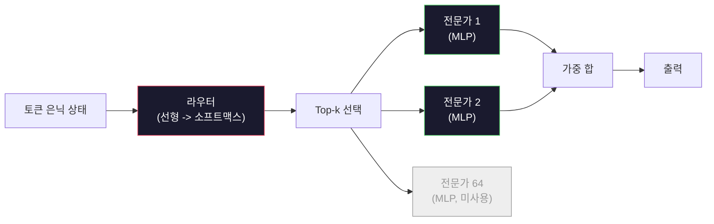

> 🇰🇷 이 문서는 한국어 번역본입니다(ELI5 스타일). 원문: [en.md](en.md)

# 오픈 모델: 아키텍처 둘러보기

> 레슨 04에서 여러분은 GPT-2 Small을 직접 만들었습니다. 2026년의 최전선(frontier) 오픈 모델들은 구체적인 변경 다섯~여섯 개만 더한 같은 가족입니다. LayerNorm 대신 RMSNorm. GELU 대신 SwiGLU. 학습된 위치 임베딩 대신 RoPE. 완전한 MHA 대신 GQA 또는 MLA. 그리고 규모를 키운 전문가 혼합(MoE, Mixture-of-Experts). 여러분이 이미 아는 수학이 이 중 95%를 커버합니다. 이 레슨은 Llama 3, DeepSeek-V3, Mixtral, Qwen, Gemma를 나란히 놓고 읽으며 각 아키텍처가 정확히 어디에서 갈라지는지 짚어 줍니다.

**유형:** 학습
**언어:** Python (표준 라이브러리)
**선수 지식:** 페이즈 10, 레슨 04, 05, 12 (사전 학습, 스케일링, 추론)
**시간:** 약 45분

## 학습 목표

- Llama 3, Mistral, Mixtral, Gemma 2, Qwen 2.5, DeepSeek-V3의 config.json을 읽고 모든 필드를 설명합니다
- 각 모델이 GPT-2 Small 대비 만든 구체적인 아키텍처 변경을 이름 붙이고, 첫 원리부터 그 이유를 정당화합니다
- 어떤 오픈 모델이든 설정(config)만으로 파라미터 수, KV 캐시 크기, 활성화 메모리를 계산합니다
- 지연 시간, 메모리, 능력 제약이 주어졌을 때 배포 대상에 맞는 오픈 모델을 고릅니다

## 문제

레슨 04에서 여러분은 numpy 350줄로 GPT-2 모양의 모델을 만들었습니다. Llama 3 405B에는 200쪽짜리 기술 보고서가 있습니다. 직감적으로는 이 둘이 전혀 다른 짐승으로 느껴집니다. 그러나 다릅니다. 그 200쪽은 타당한 이유가 있는 수정 다섯~여섯 개를 더한 같은 객체에, 스케일링에 관한 천 가지 구현 세부를 얹어 설명할 뿐입니다. 뼈대, 즉 임베딩, 트랜스포머 블록, 어텐션, MLP, 정규화, 헤드는 변하지 않았습니다.

이 레슨은 diff입니다. 주요 오픈 모델 계열마다 GPT-2에서 정확히 무엇이 바뀌었는지, 왜 바뀌었는지, 무엇을 치렀는지를 나열합니다. 다 읽고 나면 새 모델 카드를 읽고 머릿속에서 GPT-2 베이스라인으로 역번역할 수 있게 됩니다.

실용적인 보상은 이것입니다. Meta가 Llama 5를, DeepSeek가 V4를 내놓아도 새로운 멘탈 모델이 필요 없습니다. 설정을 보고 잘 알려진 손잡이(노브) 중 무엇이 움직였는지 확인하면 그 결과로 무슨 일이 벌어질지 알 수 있습니다. 2026년의 아키텍처들은 유한한 도구 상자입니다. 새 모델마다 다른 부분집합을 고를 뿐이죠.

## 개념

### 불변의 핵심

모든 자기회귀(autoregressive) 오픈 모델이 공유하는 것:

- 토큰 임베딩 행렬(vocab_size x hidden_dim).
- N개의 디코더 블록 스택: 정규화, 셀프 어텐션, 잔차 연결, 정규화, MLP, 잔차 연결.
- 마지막 정규화와 vocab_size로 투영하는 선형 헤드(흔히 임베딩과 가중치를 묶는 weight tying 적용).
- 인과 마스크(causal mask), 다음 토큰 교차 엔트로피 손실.

이것이 모양입니다. 나머지는 손잡이(노브)입니다.

### 실제로 움직이는 여섯 개의 노브

2024-2026년의 모든 최전선 오픈 모델에서 같은 여섯 가지 설계 선택이 거듭 채택됩니다:

1. **정규화.** LayerNorm -> RMSNorm.
2. **위치 인코딩.** 학습된 절대 위치 -> RoPE (변형: YaRN, NTK).
3. **활성화 함수.** GELU -> SwiGLU (또는 GeGLU).
4. **어텐션 헤드 공유.** MHA -> GQA -> MQA -> MLA.
5. **밀집 대 희소 MLP.** 밀집(dense) -> 전문가 혼합(MoE).
6. **Pre-norm 배치.** Pre-norm은 남았고, post-norm은 사라졌습니다.

나머지(학습률 스케줄, 데이터 믹스, 배치 크기, 컨텍스트 길이)는 아키텍처가 아니라 학습 설정에 속합니다. 노브는 여섯 개입니다.

### 노브 1: RMSNorm

LayerNorm은 평균을 빼고, 표준편차로 나누고, 스케일하고, 이동합니다. RMSNorm은 스케일만 남깁니다:

```
RMSNorm(x) = x / sqrt(mean(x^2) + eps) * gamma
```

평균 뺄셈도 없고, 편향(bias)도 없습니다. 토큰당 행렬 곱이 하나 줄어듭니다. Zhang과 Sennrich(2019)는 기계 번역에서 LayerNorm과 성능이 같으면서 10% 더 빠르다고 주장했습니다. 모든 현대 오픈 모델이 이것을 사용합니다.

비용: 없음. 이득: 작은 처리량 향상, 더 단순한 코드.

### 노브 2: RoPE

학습된 위치 임베딩은 GPT-2에서 1024칸짜리 조회 테이블이었습니다. 컨텍스트 1025는 테이블 끝을 넘어선 셈입니다. 모델은 학습 길이를 벗어나 외삽할 수 없습니다.

회전 위치 임베딩(RoPE, Su et al. 2021)은 어텐션 내적 전에 Q와 K 벡터를 2차원 쌍씩 회전시켜 위치를 주입합니다. 회전 각도는 위치의 결정론적 함수이므로, 학습되는 것도 없고 바닥날 것도 없습니다. 스케일링 트릭(NTK 인식 보간, YaRN)을 쓰면 8k 컨텍스트로 학습한 모델을 추론 시 128k까지 늘릴 수 있고, 정확도 손실은 적당한 수준입니다.

```
q_rotated = rotate(q, angle(pos))
k_rotated = rotate(k, angle(pos))
score = q_rotated . k_rotated
```

모든 Llama, Mistral, Qwen, DeepSeek, Gemma가 RoPE를 씁니다. Gemma 2는 하이브리드를 씁니다(대부분의 레이어에 RoPE, 나머지에 로컬 슬라이딩 윈도우 어텐션).

### 노브 3: SwiGLU

GPT-2의 MLP는 `x -> gelu(xW1 + b1) -> (...)W2 + b2`입니다. SwiGLU(Shazeer 2020)는 활성화를 게이트 곱으로 바꿉니다:

```
SwiGLU(x) = (xW1) * sigmoid(xW1) * xV
```

투영을 하나가 아니라 두 개 병렬로 두고, Swish 활성화로 게이트를 칩니다. 경험적으로 파라미터당 퍼플렉시티가 더 좋습니다. Llama 2가 채택했고 모두가 따라왔습니다. MLP의 은닉 크기는 보통 전체 파라미터 수가 원래 밀집 MLP와 같아지도록 정합니다. GPT-2가 `ff_dim = 4 * hidden`을 썼다면 SwiGLU는 `ff_dim = (2/3) * 4 * hidden = 8/3 * hidden`을 씁니다.

### 노브 4: 어텐션 헤드 공유

GPT-2는 **멀티 헤드 어텐션(MHA)**을 썼습니다. 모든 헤드가 자기만의 Q, K, V 투영을 갖습니다.

**멀티 쿼리 어텐션(MQA, Shazeer 2019)**은 하나의 K와 하나의 V를 모든 헤드가 공유합니다. KV 캐시가 num_heads만큼 줄어들며, 전형적인 모델에서 12배~32배 감소입니다. 어려운 벤치마크에서는 정확도가 약간 떨어집니다.

**그룹 쿼리 어텐션(GQA, Ainslie et al. 2023)**은 그 중간 지점입니다. Q 헤드 G개의 그룹이 하나의 K와 하나의 V를 공유합니다. Llama 3 8B는 Q 헤드 32개, KV 헤드 8개(G=8)인 GQA를 써서, KV 캐시가 완전한 MHA 대비 4분의 1로 줄어듭니다.

**멀티 헤드 잠재 어텐션(MLA, DeepSeek 2024)**은 K와 V를 공유 저랭크 잠재(latent) 공간으로 압축한 뒤 헤드별로 다시 위로 투영합니다. 헤드별 표현력을 지키면서 KV 캐시를 더 줄입니다. DeepSeek-V2와 V3가 긴 컨텍스트 성능을 이것에 의존합니다.

| 방식 | KV 헤드 | KV 캐시 | 정확도 |
|--------|----------|----------|----------|
| MHA    | num_heads | 전체 | 최고 |
| GQA    | num_groups (G < num_heads) | num_heads / G 감소 | MHA에 근접 |
| MQA    | 1 | num_heads 감소 | 약간 하락 |
| MLA    | 잠재, 헤드별 압축 해제 | MQA보다 작음 | MHA에 근접 |

약 13B 파라미터를 넘는 모델이라면 GQA나 MLA가 사실상 필수입니다. 큰 규모에서 완전한 MHA는 KV 캐시 재앙입니다.

### 노브 5: 전문가 혼합(MoE)

밀집 MLP는 모든 토큰에 대해 자신의 모든 파라미터를 활성화합니다. MoE MLP는 블록마다 K명의 전문가(expert)를 두고, 토큰마다 라우터(router)가 상위 k개 전문가를 고릅니다(보통 top-2). 그 전문가들의 가중치만 해당 토큰의 순전파를 거칩니다.

```
router_logits = xW_r
indices, weights = top_k(router_logits, k=2)
output = sum_i weights[i] * expert[indices[i]](x)
```

매력은 이것입니다. 7B짜리 전문가 64명을 둘 수 있고(전체 파라미터 수는 어마어마해집니다) 토큰마다 그중 2명만 실행하므로(토큰당 연산량은 밀집 7B 모델과 같아집니다). Mixtral 8x7B는 전체 파라미터가 47B이지만 토큰당 13B만 활성화합니다. DeepSeek-V3는 전체 671B이지만 토큰당 37B만 활성화합니다.



장점: 같은 연산량으로 더 많은 파라미터, 더 큰 용량. 단점: 전문가 메모리는 어딘가에 상주해야 하고(그래서 서빙에는 동급 밀집 모델보다 VRAM이 더 필요합니다), 라우터의 부하 분산이 어렵고, 정렬 단계에서 라우터를 파인튜닝하는 것은 그 자체로 하나의 연구 분야입니다.

### 노브 6: Pre-norm은 유지

원조 트랜스포머는 각 하위 레이어 뒤에 레이어 정규화를 적용했습니다. GPT-2 이후의 모든 오픈 모델은 각 하위 레이어 *앞에* 둡니다. Pre-norm은 깊은 네트워크에서 학습이 확실히 더 쉽습니다. 논쟁의 여지가 없습니다.

### 모델별 diff

이 모든 것을 구체적으로 보여 주는 표입니다.

| 모델 | 연도 | 전체 파라미터 | 활성 파라미터 | 정규화 | 활성화 | 위치 | 어텐션 | MoE | 컨텍스트 |
|-------|------|-------------|---------------|------|-----------|----------|-----------|-----|---------|
| GPT-2 Small | 2019 | 124M | 124M | LayerNorm | GELU | 학습됨 | MHA (12헤드) | 없음 | 1k |
| Llama 3 8B | 2024 | 8B | 8B | RMSNorm | SwiGLU | RoPE | GQA (32/8) | 없음 | 128k |
| Llama 3 70B | 2024 | 70B | 70B | RMSNorm | SwiGLU | RoPE | GQA (64/8) | 없음 | 128k |
| Llama 3 405B | 2024 | 405B | 405B | RMSNorm | SwiGLU | RoPE | GQA (128/16) | 없음 | 128k |
| Mistral 7B | 2023 | 7.2B | 7.2B | RMSNorm | SwiGLU | RoPE | GQA | 없음 | 32k |
| Mixtral 8x7B | 2023 | 47B | 13B | RMSNorm | SwiGLU | RoPE | GQA | 있음 (전문가 8개, top-2) | 32k |
| Gemma 2 9B | 2024 | 9B | 9B | RMSNorm (pre+post) | GeGLU | RoPE + 슬라이딩 | GQA | 없음 | 8k |
| Qwen 2.5 72B | 2024 | 72B | 72B | RMSNorm | SwiGLU | RoPE (YaRN) | GQA (64/8) | 없음 | 128k |
| DeepSeek V2 236B | 2024 | 236B | 21B | RMSNorm | SwiGLU | RoPE | MLA | 있음 (전문가 160개, top-6) | 128k |
| DeepSeek V3 | 2024 | 671B | 37B | RMSNorm | SwiGLU | RoPE | MLA | 있음 (전문가 256개, top-8) | 128k |

열을 훑어 보십시오. RMSNorm은 보편입니다. SwiGLU와 그 사촌 GeGLU도 보편입니다. RoPE도 보편입니다. GQA는 MLA로 대체되는 경우를 빼면 7B를 넘는 모델에서 보편입니다. MoE는 최상위권의 차별화 포인트입니다.

### config.json 읽기

Llama 3 8B의 설정:

```
{
  "hidden_size": 4096,
  "intermediate_size": 14336,
  "num_hidden_layers": 32,
  "num_attention_heads": 32,
  "num_key_value_heads": 8,
  "max_position_embeddings": 131072,
  "rope_theta": 500000.0,
  "rms_norm_eps": 1e-5,
  "vocab_size": 128256
}
```

모든 필드가 여러분이 이미 구현한 것에 대응합니다.

- `hidden_size`: 임베딩 차원.
- `intermediate_size`: MLP 은닉 크기(hidden의 3.5배 — SwiGLU 수학).
- `num_hidden_layers`: 스택 깊이.
- `num_attention_heads`: Q 헤드 수.
- `num_key_value_heads`: KV 헤드 수(GQA).
- `max_position_embeddings`: 학습 컨텍스트 길이.
- `rope_theta`: RoPE 기본 주파수. Meta는 긴 컨텍스트 외삽을 위해 기본값 10k를 500k로 키웠습니다.
- `rms_norm_eps`: 수치 안정성.
- `vocab_size`: 토큰 수.

이것들만으로 전체 파라미터, KV 캐시, 피크 활성화 메모리를 계산할 수 있습니다. 정확한 공식은 `code/main.py`를 보십시오.

### 활성화 메모리 예산

수십억 파라미터를 넘으면 학습 메모리는 활성화(activation)가 지배합니다. 사전 학습에서의 경험칙(그레이디언트 체크포인팅 사용):

```
activation_mem ~ batch_size * seq_len * hidden_size * num_layers * bytes_per_element
```

Llama 3 8B에서 배치 1, 시퀀스 8192, BF16, 32개 레이어, hidden 4096이면: 체크포인팅을 써도 활성화만 약 8 GB, 없으면 40 GB입니다. flash-attention과 ring-attention이 중요한 이유가 바로 이것입니다. 어텐션 계산을 다시 써서 활성화가 메모리에 맞도록 만들기 때문이죠.

### KV 캐시 예산

최대 컨텍스트에서의 추론 기준:

```
kv_cache = 2 * num_layers * num_kv_heads * head_dim * max_seq_len * bytes_per_element
```

128k 컨텍스트, BF16, head_dim = hidden / num_heads = 128인 Llama 3 8B는
시퀀스 하나당 `2 * 32 * 8 * 128 * 131072 * 2 = 17.2 GB`입니다.

8B 가중치는 BF16에서 16 GB입니다. 128k 시퀀스 하나의 KV 캐시가 가중치보다 큽니다. GQA, MLA, KV 캐시 양자화 연구를 몰고 가는 메모리 압박이 바로 이것입니다.

### 각 모델이 유리한 경우

- **80GB GPU 한 장, MoE 없음**: Llama 3 8B, Mistral 7B, Gemma 2 9B. 서빙이 쉽고 도구 생태계가 넓습니다.
- **단일 노드(8x80GB), 큰 용량**: Llama 3 70B, Qwen 2.5 72B. 밀집 오픈 모델 중 최고 능력.
- **최고 수준의 오픈 능력, MoE 복잡성 감수**: DeepSeek V3, Mixtral 8x22B. 활성 FLOP당 능력이 최고.
- **긴 컨텍스트 필요**: Llama 3 (RoPE 스케일링으로 128k), DeepSeek (MLA 이점).
- **저지연 서빙**: Gemma 2 9B (슬라이딩 윈도우가 긴 컨텍스트 연산을 줄입니다).

```figure
rmsnorm-vs-layernorm
```

## 만들어 보기

이 레슨의 코드는 계산기입니다. 어떤 config.json이든 주면 구성 요소별 파라미터 수, 최대 컨텍스트에서의 KV 캐시, SwiGLU MLP 비율, 그리고 아키텍처에 대한 짧은 판정(밀집 / GQA / MLA / MoE)을 출력합니다.

```python
config = {
    "hidden_size": 4096, "intermediate_size": 14336,
    "num_hidden_layers": 32, "num_attention_heads": 32,
    "num_key_value_heads": 8, "vocab_size": 128256,
    "max_position_embeddings": 131072,
}
```

스크립트는 아키텍처를 필드별로 훑으며 임베딩, 어텐션(GQA 감소 반영), MLP(SwiGLU 확장 반영), 레이어 정규화, 헤드의 파라미터 수를 계산합니다. 그다음 명시된 컨텍스트 길이에서의 KV 캐시를 계산해 요약을 출력합니다.

구현은 `code/main.py`를 보십시오.

## 사용해 보기

스크립트에 포함된 Llama 3 8B, Mistral 7B, Mixtral 8x7B, DeepSeek V3 설정으로 계산기를 돌려 보십시오. 파라미터 분해를 비교해 봅니다. MoE 모델은 전체 파라미터 수가 밀집 모델을 압도하면서도 활성 파라미터 수는 오히려 더 작은 경우가 많다는 점에 주목하세요. 그리고 DeepSeek V3는 전체 파라미터가 더 많은데도 KV 캐시가 Llama 3 405B보다 작다는 점에도 주목하세요. MLA가 작동하는 모습입니다.

그런 다음 로컬에 있는 어떤 모델의 설정이든 넣어 요약을 읽고, 여러분의 GPU에 맞는지 판단해 보십시오.

## 출시하기

이 레슨은 `outputs/skill-open-model-picker.md`를 만듭니다. 배포 대상(GPU 종류, VRAM, 컨텍스트 길이, 지연 시간 예산)과 작업 프로필(채팅, 코드, 추론, 긴 컨텍스트)이 주어지면, 여섯 개의 아키텍처 노브에 대한 명시적 근거와 함께 오픈 모델, 레슨 11의 양자화 방식, 레슨 12의 추론 스택을 추천합니다.

## 연습 문제

1. HuggingFace에서 Qwen 2.5 72B 설정을 읽어 보세요. 전체 파라미터를 직접 계산합니다. HF가 보고한 값과 비교하고, 차이가 있다면 어디에서 오는지 찾아 보세요(헤드 차원 반올림, KV 공유 배수 등).

2. DeepSeek V3는 256개 전문가에 top-8 라우팅을 씁니다. 활성 전문가 대 전체 전문가 비율을 계산하고, Mixtral 8x7B의 8개 중 top-2와 비교해 보세요. 희소(25%)에서 더 촘촘한 희소(3%)로의 이동은 FLOP당 용량 면에서 무엇을 시사할까요?

3. Llama 3 405B의 128k 컨텍스트에서 FP8과 BF16의 KV 캐시를 계산해 보세요. FP8은 BF16 값의 절반입니다. 8xH100 노드 한 대(각 80GB = 총 640GB, 가중치 메모리 제외)에서 몇 개의 병렬 시퀀스를 서빙할 수 있을까요?

4. Gemma 2는 완전 어텐션 레이어와 슬라이딩 윈도우 어텐션 레이어를 번갈아 씁니다. 절반의 레이어가 전체 컨텍스트 대신 4096토큰 슬라이딩 윈도우를 쓸 때의 KV 캐시 수식을 세워 보세요. 전체 컨텍스트 8k에서 메모리가 얼마나 절약될까요?

5. 이 레슨이 작성된 이후에 출시된 최신 최전선 오픈 모델을 찾아 보세요. 여섯 노브 중 무엇을 골랐는지, 그리고 일곱 번째 노브를 새로 도입했는지 확인합니다. 새 아키텍처가 나오는 순간 커리큘럼은 낡게 느껴질 것입니다. 목표는 멘탈 모델을 다시 세우지 않고 표만 갱신하는 것입니다.

## 핵심 용어

| 용어 | 사람들이 말하는 방식 | 실제 의미 |
|------|----------------|----------------------|
| RMSNorm | "평균을 뺀 LayerNorm" | 제곱평균제곱근으로만 정규화하고 학습된 스케일을 곱함 — 더 저렴하고 LayerNorm에 필적함 |
| RoPE | "회전 위치" | 각 Q와 K 벡터를 위치에 의존하는 각도로 2D 쌍씩 회전 — 스케일링 트릭으로 학습 길이를 넘어 외삽 가능 |
| SwiGLU | "새로운 MLP 활성화" | Swish를 곱한 게이트 선형 유닛: `(xW1) * sigmoid(xW1) * xV` — 2024년 이후 모든 오픈 모델의 표준 |
| GQA | "절충안 어텐션" | Grouped-Query Attention: Q 헤드 G개 그룹이 K, V 헤드 하나를 공유 — MQA의 정확도 하락 없이 KV 캐시를 줄임 |
| MLA | "DeepSeek의 어텐션" | Multi-Head Latent Attention: K/V를 공유 저랭크 잠재로 압축 후 헤드별로 압축 해제 — 대형 모델에서 가장 작은 KV 캐시 |
| MoE | "희소 전문가" | Mixture of Experts: 블록마다 N개 MLP, 라우터가 토큰마다 top-k 선택 — 전체 파라미터는 크고 활성 파라미터는 작음 |
| Top-k 라우팅 | "토큰마다 k명의 전문가 선택" | 라우터가 전문가마다 점수를 계산해 가장 높은 k개를 활성화 — k는 보통 2(Mixtral)에서 8(DeepSeek) |
| YaRN | "RoPE 늘리기" | 또 하나의 RoPE 확장 — 회전 각도를 보간해 추론 시점에 컨텍스트를 8k에서 128k+로 확장 |
| 슬라이딩 윈도우 어텐션 | "모든 것을 볼 필요는 없다" | 각 토큰이 최근 W개 토큰만 보게 함 — 토큰당 어텐션 비용을 O(W)로 제한. Gemma 2와 초기 Mistral에서 사용 |
| 활성 파라미터(Active params) | "토큰당 실제로 도는 것" | MoE 모델에서 토큰 하나의 순전파를 거치는 파라미터 수(전체보다 훨씬 작음) — 토큰당 FLOPs를 결정 |

## 더 읽을거리

- [Dubey et al., 2024 -- "The Llama 3 Herd of Models"](https://arxiv.org/abs/2407.21783) -- 밀집 Llama 3 계열의 아키텍처·학습 참조 문서
- [DeepSeek-AI, 2024 -- "DeepSeek-V3 Technical Report"](https://arxiv.org/abs/2412.19437) -- MLA + 보조 손실 없는 부하 분산 + 671B MoE
- [Jiang et al., 2024 -- "Mixtral of Experts"](https://arxiv.org/abs/2401.04088) -- MoE 오픈 모델의 정석 논문
- [Su et al., 2021 -- "RoFormer: Enhanced Transformer with Rotary Position Embedding"](https://arxiv.org/abs/2104.09864) -- RoPE 원논문
- [Shazeer, 2020 -- "GLU Variants Improve Transformer"](https://arxiv.org/abs/2002.05202) -- SwiGLU, GeGLU와 그 친구들
- [Ainslie et al., 2023 -- "GQA: Training Generalized Multi-Query Transformer Models"](https://arxiv.org/abs/2305.13245) -- GQA 논문
- [Gemma 2 Team, 2024 -- "Gemma 2: Improving Open Language Models at a Practical Size"](https://arxiv.org/abs/2408.00118) -- 하이브리드 완전+슬라이딩 어텐션, pre+post 정규화
- [Qwen Team, 2024 -- "Qwen 2.5 Technical Report"](https://arxiv.org/abs/2412.15115) -- YaRN 컨텍스트 확장과 긴 컨텍스트 학습 레시피
