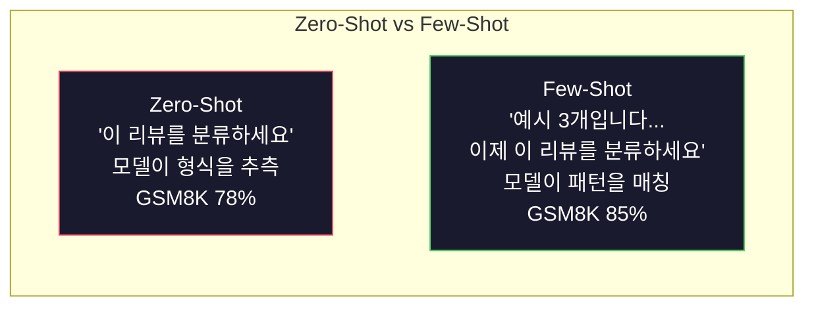
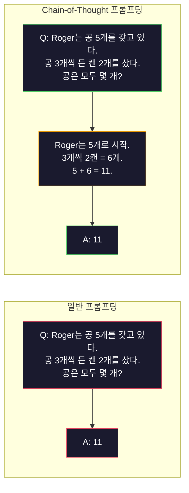
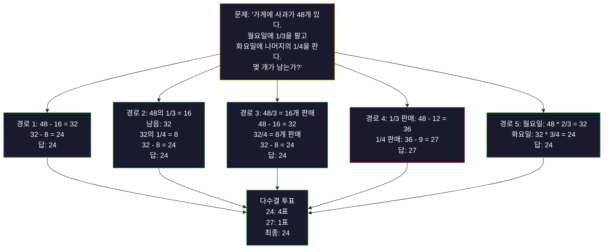
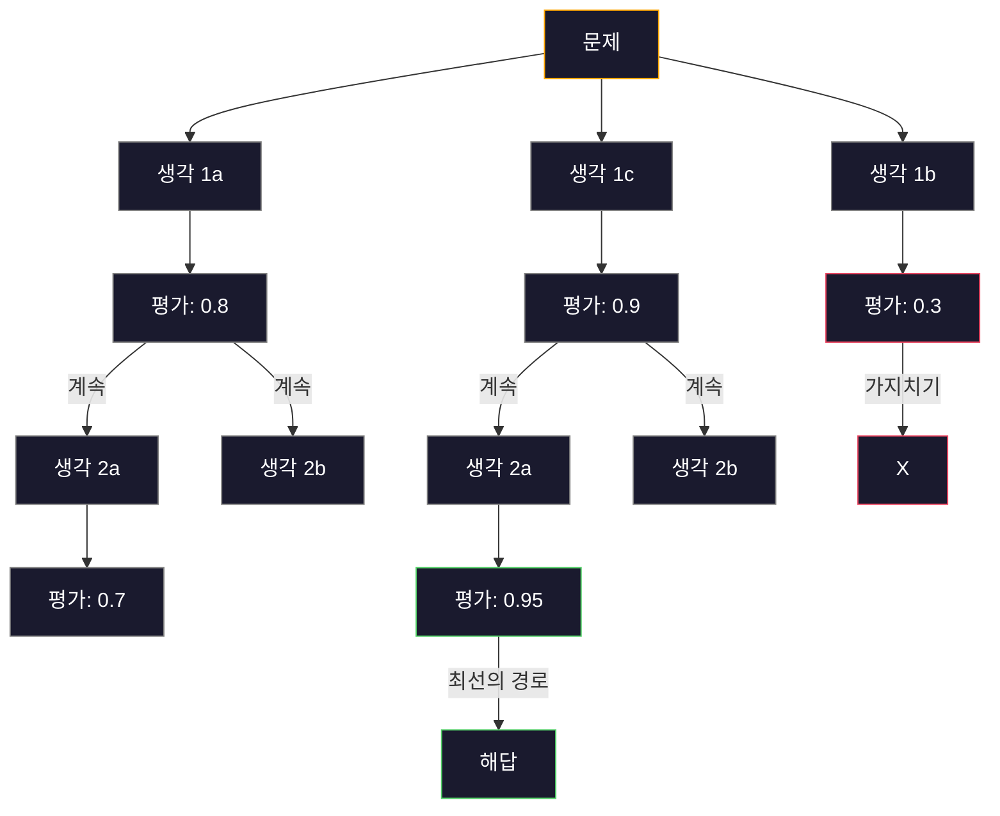

> 🇰🇷 이 문서는 한국어 번역본입니다(ELI5 스타일). 원문: [en.md](en.md)

# Few-Shot, Chain-of-Thought, Tree-of-Thought

> 모델에게 무엇을 하라고 말하는 것이 프롬프팅이라면, 어떻게 생각해야 하는지 보여 주는 것은 엔지니어링입니다. 같은 모델, 같은 작업, 같은 데이터에서 78%와 91% 정확도 사이의 차이는 더 좋은 모델이 아닙니다. 더 좋은 추론 전략입니다.

**유형:** Build
**언어:** Python
**선수 지식:** 레슨 11.01 (Prompt Engineering)
**소요 시간:** 약 45분

## 학습 목표

- 작업 정확도를 최대화하는 예시 데모를 골라 형식에 맞게 구성해 few-shot 프롬프팅 구현하기
- Chain-of-thought(CoT) 추론을 적용해 수학 단어 문제 같은 다단계 문제의 정확도 높이기
- 여러 추론 경로를 탐색하고 최선의 경로를 고르는 tree-of-thought 프롬프트 만들기
- 표준 벤치마크에서 zero-shot vs few-shot vs CoT의 정확도 향상 측정하기

## 문제 상황

수학 과외 앱을 만든다고 해 보죠. 프롬프트에는 "이 단어 문제를 풀어라"라고 적었습니다. GPT-5는 초등학교 수준 수학 표준 벤치마크인 GSM8K에서 94%를 맞힙니다. 이미 한계에 도달했다고 생각하겠죠. 아닙니다 — chain-of-thought를 쓰면 아직 3-4포인트가 더 올라갑니다.

다섯 단어를 추가해 보세요. "Let's think step by step". 그러면 정확도가 91%로 뛰어오릅니다. 풀이 과정이 담긴 예시 몇 개를 더하면 95%에 도달합니다. 같은 모델, 같은 온도, 같은 API 비용입니다. 달라진 것은 모델에게 계산용 종이를 쥐여 줬다는 것 하나뿐입니다.

이건 편법이 아닙니다. 추론이 작동하는 방식 그 자체입니다. 인간도 다단계 문제를 머릿속 한 번의 도약으로 풀지 않습니다. 트랜스포머도 마찬가지입니다. 모델에게 중간 토큰을 생성하게 강제하면, 그 토큰들이 다음 토큰을 위한 컨텍스트의 일부가 됩니다. 추론 단계 하나하나가 다음 단계를 먹여 주는 것이죠. 모델은 문자 그대로 계산을 해 나가며 답에 도달합니다.

하지만 "think step by step"는 끝이 아니라 시작입니다. 추론 경로를 다섯 개 샘플링해서 다수결 투표를 하면 어떨까요? 모델이 가능성의 트리를 탐색하며 가지를 평가하고 가지치기하게 하면 어떨까요? 추론과 도구 사용을 엮어 놓으면 어떨까요? 이것들은 가정이 아닙니다. 측정된 개선 효과가 발표된 기법들이고, 이 레슨에서 전부 직접 만들어 보게 됩니다.

## 개념

### Zero-Shot vs Few-Shot: 예시가 지시문을 이길 때

Zero-shot 프롬프팅은 모델에게 작업만 주고 아무것도 더 주지 않습니다. Few-shot 프롬프팅은 먼저 예시를 보여 줍니다.

Wei 등(2022)이 8개 벤치마크에서 이를 측정했습니다. 감성 분류 같은 간단한 작업에서는 zero-shot과 few-shot이 2% 이내의 차이를 보였습니다. 반면 다단계 산술과 기호 추론 같은 복잡한 작업에서는 few-shot이 정확도를 10-25% 끌어올렸습니다.

직관적인 설명: 예시는 압축된 지시문입니다. 출력 형식을 설명하는 대신 보여 주는 것이고, 추론 과정을 설명하는 대신 시연하는 것입니다. 모델은 추상적인 지시를 해석하는 것보다 예시에서 패턴을 매칭하는 쪽이 더 신뢰할 수 있습니다.



**few-shot이 이기는 경우:** 형식에 민감한 작업, 분류, 구조화된 추출, 도메인 전문 용어, 모델이 특정 패턴에 맞춰야 하는 모든 작업.

**zero-shot이 이기는 경우:** 단순 사실 질문, 예시가 창의성을 묶어 버리는 창작 작업, 좋은 예시를 찾는 일이 좋은 지시문을 쓰는 일보다 더 어려운 작업.

### 예시 선택: 비슷한 것이 무작위를 이긴다

모든 예시가 똑같이 만들어진 것은 아닙니다. 대상 입력과 비슷한 예시를 고르는 것이 분류 작업에서 무작위 선택보다 5-15% 더 좋은 성능을 냅니다(Liu et al., 2022). 세 가지 원칙:

1. **의미적 유사성**: 임베딩 공간에서 입력과 가장 가까운 예시를 고른다
2. **레이블 다양성**: 예시가 모든 출력 범주를 커버하게 한다
3. **난이도 매칭**: 대상 문제의 복잡도 수준과 맞춘다

대부분의 작업에서 최적의 예시 개수는 3-5개입니다. 3개 미만이면 패턴을 뽑아 낼 신호가 부족하고, 5개를 넘기면 효과가 점점 줄면서 컨텍스트 윈도우 토큰만 낭비합니다. 레이블이 많은 분류라면 레이블당 예시 하나를 쓰세요.

### Chain-of-Thought: 모델에게 계산용 종이 주기

Chain-of-Thought(CoT) 프롬프팅은 Google Brain의 Wei 등(2022)이 소개했습니다. 아이디어는 간단합니다. 모델에게 답만 달라고 하지 말고, 먼저 추론 단계를 보여 달라고 하는 것입니다.



기계적으로 왜 이게 작동할까요? 트랜스포머가 생성하는 각 토큰은 다음 토큰의 컨텍스트가 됩니다. CoT가 없으면 모델은 모든 추론을 단 한 번의 순전파(forward pass) 히든 상태에 압축해야 합니다. CoT가 있으면 모델은 중간 계산을 토큰으로 꺼내 놓습니다. 추론 토큰 하나하나가 실효 계산 깊이를 늘려 주는 것이죠.

**GSM8K 벤치마크 (초등학교 수준 수학, 8.5K 문제):**

| 모델 | Zero-Shot | Zero-Shot CoT | Few-Shot CoT |
|-------|-----------|---------------|--------------|
| GPT-4o | 78% | 91% | 95% |
| GPT-5 | 94% | 97% | 98% |
| o4-mini (추론) | 97% | — | — |
| Claude Opus 4.7 | 93% | 97% | 98% |
| Gemini 3 Pro | 92% | 96% | 98% |
| Llama 4 70B | 80% | 89% | 94% |
| DeepSeek-V3.1 | 89% | 94% | 96% |

**추론 모델에 대한 참고 사항.** OpenAI의 o 시리즈(o3, o4-mini)와 DeepSeek-R1 같은 모델은 답을 내기 전에 내부적으로 chain-of-thought를 실행합니다. 추론 모델에 "Let's think step by step"을 추가하는 것은 불필요하고, 때로는 역효과를 냅니다 — 이미 그 일을 하고 있기 때문입니다.

CoT의 두 가지 맛:

**Zero-shot CoT**: 프롬프트에 "Let's think step by step"을 덧붙입니다. 예시가 필요 없습니다. Kojima 등(2022)은 이 한 문장이 산술, 상식, 기호 추론 작업 전반에서 정확도를 높인다는 것을 보였습니다.

**Few-shot CoT**: 추론 단계가 포함된 예시를 제공합니다. 모델이 여러분이 기대하는 추론 형식을 그대로 볼 수 있기 때문에 zero-shot CoT보다 효과적입니다.

**CoT가 독이 되는 경우**: 단순 사실 회상("프랑스의 수도는 어디인가요?"), 한 단계짜리 분류, 속도가 정확도보다 중요한 작업. CoT는 쿼리당 50-200토큰의 추론 오버헤드를 더합니다. 처리량은 높고 복잡도는 낮은 작업이라면 그건 그냥 낭비되는 비용입니다.

### Self-Consistency: 많이 샘플링하고, 한 번 투표하라

Wang 등(2023)이 self-consistency를 소개했습니다. 핵심 통찰: CoT 경로 하나에는 추론 오류가 섞여 있을 수 있습니다. 하지만 독립적인 추론 경로 N개를 샘플링하고(온도 > 0 사용) 최종 답에 다수결 투표를 하면 오류가 상쇄됩니다.



Self-consistency는 원래 PaLM 540B 실험에서 GSM8K 정확도를 56.5%(단일 CoT)에서 74.4%(N=40)로 끌어올렸습니다. GPT-5에서는 개선 폭이 작습니다(97%에서 98%). 기본 정확도가 이미 포화 상태이기 때문입니다. 이 기법이 가장 빛을 발하는 곳은 기본 CoT 정확도가 60-85%인 모델입니다. 단일 경로 오류가 잦지만 체계적이지는 않은, 바로 그 스위트 스팟이니까요. 추론 모델(o 시리즈, R1)에서는 self-consistency가 내장된 내부 샘플링에 흡수됩니다.

트레이드오프: N개 샘플은 API 비용과 지연 시간이 N배가 된다는 뜻입니다. 실전에서는 N=5면 대부분의 이점을 잡습니다. 의미 있는 투표를 하려면 N=3이 최소입니다. N > 10은 대부분의 작업에서 효과가 점점 줄어듭니다.

### Tree-of-Thought: 가지치는 탐색

Yao 등(2023)이 Tree-of-Thought(ToT)를 소개했습니다. CoT가 하나의 선형 추론 경로를 따른다면, ToT는 여러 갈래를 탐색하면서 계속 진행하기 전에 어느 쪽이 가장 유망한지 평가합니다.



ToT의 구성 요소는 세 가지입니다:

1. **생각 생성**: 다음 단계 후보를 여러 개 만든다
2. **상태 평가**: 각 후보에 점수를 매긴다 (LLM 자신을 평가자로 쓸 수 있다)
3. **탐색 알고리즘**: 트리를 BFS나 DFS로 탐색하며 점수 낮은 가지를 가지치기한다

Game of 24 과제(4개의 숫자를 사칙연산으로 조합해 24를 만들기)에서, 표준 프롬프팅을 쓴 GPT-4는 문제의 7.3%를 풉니다. CoT로는 4.0%입니다(탐색 공간이 넓어서 CoT가 오히려 해가 됩니다). ToT로는 74%입니다.

ToT는 비쌉니다. 트리의 노드 하나하나가 LLM 호출을 필요로 합니다. 분기 계수 3, 깊이 3짜리 트리는 최대 39번의 LLM 호출을 요구합니다. 탐색 공간이 크면서도 평가 가능한 문제 — 계획 수립, 퍼즐 풀기, 제약이 있는 창의적 문제 해결 — 에만 쓰세요.

### ReAct: 생각하기 + 실행하기

Yao 등(2022)이 추론 흔적(reasoning trace)과 행동을 결합했습니다. 모델은 생각하기(추론 생성)와 행동하기(도구 호출, 검색, 계산)를 번갈아 수행합니다.

```mermaid
graph LR
    Q["질문:\n에펠탑이 있는\n나라의 인구는\n얼마인가?"]
    T1["생각: 에펠탑이\n어느 나라에 있는지\n찾아야 한다"]
    A1["행동: search\n'에펠탑 위치'"]
    O1["관찰:\n프랑스 파리"]
    T2["생각: 이제\n프랑스 인구가\n필요하다"]
    A2["행동: search\n'프랑스 인구 2024'"]
    O2["관찰:\n6,840만 명"]
    T3["생각: 답을\n찾았다"]
    F["답:\n6,840만 명"]

    Q --> T1 --> A1 --> O1 --> T2 --> A2 --> O2 --> T3 --> F

    style Q fill:#1a1a2e,stroke:#ffa500,color:#fff
    style T1 fill:#1a1a2e,stroke:#51cf66,color:#fff
    style A1 fill:#1a1a2e,stroke:#e94560,color:#fff
    style O1 fill:#1a1a2e,stroke:#808080,color:#fff
    style T2 fill:#1a1a2e,stroke:#51cf66,color:#fff
    style A2 fill:#1a1a2e,stroke:#e94560,color:#fff
    style O2 fill:#1a1a2e,stroke:#808080,color:#fff
    style T3 fill:#1a1a2e,stroke:#51cf66,color:#fff
    style F fill:#1a1a2e,stroke:#51cf66,color:#fff
```



ReAct는 지식 집약적인 작업에서 순수 CoT보다 성능이 좋습니다. 추론을 실제 데이터에 기반시킬 수 있기 때문입니다. HotpotQA(멀티홉 질의응답)에서 GPT-4를 쓴 ReAct는 정확 일치 35.1%를 달성한 반면 CoT만 쓰면 29.4%에 그칩니다. 진짜 힘은 추론 오류가 관찰(observation)로 교정된다는 점입니다 — 모델이 실행 도중에 계획을 수정할 수 있죠.

ReAct는 현대 AI 에이전트의 기초입니다. 모든 에이전트 프레임워크(LangChain, CrewAI, AutoGen)는 생각-행동-관찰 루프의 변형을 구현하고 있습니다. Phase 14에서 완전한 에이전트를 만들게 됩니다. 이 레슨은 프롬프팅 패턴만 다룹니다.

### 구조화된 프롬프팅: XML 태그, 구분자, 헤더

프롬프트가 복잡해지면 구조가 섹션끼리 섞이는 것을 막아 줍니다. 세 가지 접근법:

**XML 태그** (Claude에서 가장 잘 작동, 어디서든 준수한 성능):
```
<context>
You are reviewing a pull request.
The codebase uses TypeScript and React.
</context>

<task>
Review the following diff for bugs, security issues, and style violations.
</task>

<diff>
{diff_content}
</diff>

<output_format>
List each issue with: file, line, severity (critical/warning/info), description.
</output_format>
```

**마크다운 헤더** (보편적):
```
## Role
Senior security engineer at a fintech company.

## Task
Analyze this API endpoint for vulnerabilities.

## Input
{api_code}

## Rules
- Focus on OWASP Top 10
- Rate each finding: critical, high, medium, low
- Include remediation steps
```

**구분자** (최소주의지만 효과적):
```
---INPUT---
{user_text}
---END INPUT---

---INSTRUCTIONS---
Summarize the above in 3 bullet points.
---END INSTRUCTIONS---
```

### 프롬프트 체이닝: 순차적 분해

어떤 작업은 프롬프트 하나로는 너무 복잡합니다. 프롬프트 체이닝은 작업을 단계로 쪼개서, 한 프롬프트의 출력이 다음 프롬프트의 입력이 되게 합니다.


체이닝이 단일 프롬프트를 이기는 이유는 세 가지입니다:

1. **각 단계가 더 단순하다**: 모델이 모든 것을 뒤치다광하는 대신 하나에 집중된 작업을 처리한다
2. **중간 출력을 검사할 수 있다**: 단계 사이에서 검증하고 수정할 수 있다
3. **단계마다 다른 모델을 쓸 수 있다**: 추출에는 싼 모델, 추론에는 비싼 모델을 쓴다

### 기법 성능 비교

| 기법 | 가장 알맞은 용도 | GSM8K 정확도 (GPT-5) | API 호출 | 토큰 오버헤드 | 복잡도 |
|-----------|----------|------------------------|-----------|----------------|------------|
| Zero-Shot | 간단한 작업 | 94% | 1 | 없음 | 아주 낮음 |
| Few-Shot | 형식 매칭 | 96% | 1 | 200-500 토큰 | 낮음 |
| Zero-Shot CoT | 빠른 추론 부스트 | 97% | 1 | 50-200 토큰 | 아주 낮음 |
| Few-Shot CoT | 단일 호출 최대 정확도 | 98% | 1 | 300-600 토큰 | 낮음 |
| Self-Consistency (N=5) | 중요한 추론 | 98.5% | 5 | 토큰 비용 5배 | 중간 |
| 추론 모델 (o4-mini) | CoT 대체품 | 97% | 1 | 숨겨짐 (내부적으로 2-10배) | 아주 낮음 |
| Tree-of-Thought | 탐색/계획 문제 | N/A (Game of 24에서 74%) | 10-40+ | 토큰 비용 10-40배 | 높음 |
| ReAct | 지식 기반 추론 | N/A (HotpotQA에서 35.1%) | 3-10+ | 가변 | 높음 |
| 프롬프트 체이닝 | 복잡한 다단계 작업 | 96% (파이프라인) | 2-5 | 토큰 비용 2-5배 | 중간 |

어떤 기법이 맞는지는 세 가지 요소에 달려 있습니다. 정확도 요구 사항, 지연 시간 예산, 비용 허용치입니다. 대부분의 프로덕션(운영 환경) 시스템에서는 few-shot CoT에 3샘플 self-consistency를 폴백으로 두는 조합이 사용 사례의 90%를 커버합니다.

```figure
few-shot-curve
```

## 직접 만들어 보기

few-shot 프롬프팅, chain-of-thought 추론, self-consistency 투표를 하나의 파이프라인으로 묶은 수학 문제 풀이기를 만들 것입니다. 그다음 어려운 문제를 위해 tree-of-thought를 추가하겠습니다.

전체 구현은 `code/advanced_prompting.py`에 있습니다. 핵심 구성 요소들입니다.

### 단계 1: Few-Shot 예시 저장소

첫 번째 구성 요소는 few-shot 예시를 관리하고 주어진 문제에 가장 관련 있는 예시를 고릅니다.

```python
GSM8K_EXAMPLES = [
    {
        "question": "Janet's ducks lay 16 eggs per day. She eats three for breakfast every morning and bakes muffins for her friends every day with four. She sells every egg at the farmers' market for $2. How much does she make every day at the farmers' market?",
        "reasoning": "Janet's ducks lay 16 eggs per day. She eats 3 and bakes 4, using 3 + 4 = 7 eggs. So she has 16 - 7 = 9 eggs left. She sells each for $2, so she makes 9 * 2 = $18 per day.",
        "answer": "18"
    },
    ...
]
```

각 예시는 세 부분으로 이루어집니다. 질문, 추론 체인, 최종 답입니다. 추론 체인이 평범한 few-shot 예시를 CoT few-shot 예시로 바꿔 주는 요소입니다.

### 단계 2: Chain-of-Thought 프롬프트 빌더

프롬프트 빌더는 시스템 메시지, 추론 체인이 포함된 few-shot 예시, 대상 질문을 하나의 프롬프트로 조립합니다.

```python
def build_cot_prompt(question, examples, num_examples=3):
    system = (
        "You are a math problem solver. "
        "For each problem, show your step-by-step reasoning, "
        "then give the final numerical answer on the last line "
        "in the format: 'The answer is [number]'."
    )

    example_text = ""
    for ex in examples[:num_examples]:
        example_text += f"Q: {ex['question']}\n"
        example_text += f"A: {ex['reasoning']} The answer is {ex['answer']}.\n\n"

    user = f"{example_text}Q: {question}\nA:"
    return system, user
```

형식 제약("The answer is [number]")이 결정적입니다. 이것이 없으면 self-consistency가 샘플들 사이에서 답을 추출해 비교할 수 없습니다.

### 단계 3: Self-Consistency 투표

추론 경로 N개를 샘플링하고 다수 득표 답을 취합니다.

```python
def self_consistency_solve(question, examples, client, model, n_samples=5):
    system, user = build_cot_prompt(question, examples)

    answers = []
    reasonings = []
    for _ in range(n_samples):
        response = client.chat.completions.create(
            model=model,
            messages=[
                {"role": "system", "content": system},
                {"role": "user", "content": user}
            ],
            temperature=0.7
        )
        text = response.choices[0].message.content
        reasonings.append(text)
        answer = extract_answer(text)
        if answer is not None:
            answers.append(answer)

    vote_counts = Counter(answers)
    best_answer = vote_counts.most_common(1)[0][0] if vote_counts else None
    confidence = vote_counts[best_answer] / len(answers) if best_answer else 0

    return best_answer, confidence, reasonings, vote_counts
```

온도 0.7이 중요합니다. 온도 0.0에서는 N개 샘플이 모두 동일해져서 취지가 사라집니다. 다양한 추론 경로가 나올 만큼의 무작위성은 필요하지만, 모델이 헛소리를 할 정도여서는 안 됩니다.

### 단계 4: Tree-of-Thought 풀이기

선형 추론이 실패하는 문제를 위해 ToT는 여러 접근법을 탐색하고 어느 방향이 가장 유망한지 평가합니다.

```python
def tree_of_thought_solve(question, client, model, breadth=3, depth=3):
    thoughts = generate_initial_thoughts(question, client, model, breadth)
    scored = [(t, evaluate_thought(t, question, client, model)) for t in thoughts]
    scored.sort(key=lambda x: x[1], reverse=True)

    for current_depth in range(1, depth):
        next_thoughts = []
        for thought, score in scored[:2]:
            extensions = extend_thought(thought, question, client, model, breadth)
            for ext in extensions:
                ext_score = evaluate_thought(ext, question, client, model)
                next_thoughts.append((ext, ext_score))
        scored = sorted(next_thoughts, key=lambda x: x[1], reverse=True)

    best_thought = scored[0][0] if scored else ""
    return extract_answer(best_thought), best_thought
```

평가자 자체가 LLM 호출입니다. 모델에게 이렇게 묻습니다. "0.0부터 1.0까지의 척도에서, 이 추론 경로가 문제를 풀기에 얼마나 유망한가?" 이것이 ToT의 핵심 통찰입니다 — 모델이 자기 부분해를 스스로 평가하는 것입니다.

### 단계 5: 전체 파이프라인

파이프라인은 모든 기법을 단계적 격상(escalation) 전략과 함께 결합합니다.

```python
def solve_with_escalation(question, examples, client, model):
    single_answer, _ = few_shot_cot_solve(question, examples, client, model)

    sc_answer, confidence, _, _ = self_consistency_solve(
        question, examples, client, model, n_samples=5
    )

    if confidence >= 0.8 and single_answer == sc_answer:
        return sc_answer, "self_consistency", confidence

    tot_answer, _ = tree_of_thought_solve(question, client, model)
    return tot_answer, "tree_of_thought", None
```

격상 로직은 이렇습니다. 먼저 싼 방법(단일 CoT)을 시도합니다. 단일 결정론적 경로는 투표 표가 될 수 없으므로, 품질 검사는 "일치 여부"로 합니다. 즉 온도 0의 답이 샘플링된 경로들의 다수 답과 일치해야 합니다. 일치하지 않거나 self-consistency 확신도가 0.8 미만이면(5개 샘플 중 4개 미만이 일치) ToT로 격상합니다. 이렇게 하면 비용과 정확도의 균형이 잡힙니다 — 대부분의 문제는 싸게 풀리고, 어려운 문제만 더 많은 컴퓨팅을 씁니다.

## 사용해 보기

### 템플릿 기반 Few-Shot 프롬프트

LangChain은 few-shot과 CoT 패턴을 단순화하는 프롬프트 템플릿과 출력 파싱 기능을 내장하고 있습니다:

```python
from langchain_core.prompts import FewShotPromptTemplate, PromptTemplate
from langchain_openai import ChatOpenAI

example_prompt = PromptTemplate(
    input_variables=["question", "reasoning", "answer"],
    template="Q: {question}\nA: {reasoning} The answer is {answer}."
)

few_shot_prompt = FewShotPromptTemplate(
    examples=examples,
    example_prompt=example_prompt,
    suffix="Q: {input}\nA: Let's think step by step.",
    input_variables=["input"]
)

llm = ChatOpenAI(model="gpt-4o", temperature=0.7)
chain = few_shot_prompt | llm
result = chain.invoke({"input": "If a train travels 120 km in 2 hours..."})
```

LangChain에는 의미 유사도 기반 선택을 위한 `ExampleSelector` 클래스도 있습니다:

```python
from langchain_core.example_selectors import SemanticSimilarityExampleSelector
from langchain_openai import OpenAIEmbeddings

selector = SemanticSimilarityExampleSelector.from_examples(
    examples,
    OpenAIEmbeddings(),
    k=3
)
```

### 컴파일된 프롬프트

DSPy는 프롬프팅 전략을 최적화 가능한 모듈로 취급합니다. CoT 프롬프트를 손으로 만드는 대신 시그니처를 정의하면 DSPy가 프롬프트를 최적화해 줍니다:

```python
import dspy

dspy.configure(lm=dspy.LM("openai/gpt-4o", temperature=0.7))

class MathSolver(dspy.Module):
    def __init__(self):
        self.solve = dspy.ChainOfThought("question -> answer")

    def forward(self, question):
        return self.solve(question=question)

solver = MathSolver()
result = solver(question="Janet's ducks lay 16 eggs per day...")
```

DSPy의 `ChainOfThought`는 추론 흔적을 자동으로 추가합니다. `dspy.majority`는 self-consistency를 구현합니다:

```python
result = dspy.majority(
    [solver(question=q) for _ in range(5)],
    field="answer"
)
```

### 비교: 직접 구현 vs 프레임워크

| 기능 | 직접 구현 (이 레슨) | LangChain | DSPy |
|---------|--------------------------|-----------|------|
| 프롬프트 형식 제어 | 완전한 제어 | 템플릿 기반 | 자동 |
| Self-consistency | 수동 투표 | 수동 | 내장 (`dspy.majority`) |
| 예시 선택 | 커스텀 로직 | `ExampleSelector` | `dspy.BootstrapFewShot` |
| Tree-of-Thought | 커스텀 트리 탐색 | 커뮤니티 체인 | 내장 없음 |
| 프롬프트 최적화 | 수동 반복 | 수동 | 자동 컴파일 |
| 가장 알맞은 용도 | 학습, 커스텀 파이프라인 | 표준 워크플로 | 연구, 최적화 |

## 출시해 보기

이 레슨은 산출물 두 개를 만듭니다.

**1. 추론 체인 프롬프트** (`outputs/prompt-reasoning-chain.md`): self-consistency를 갖춘 few-shot CoT용 프로덕션(운영 환경) 준비가 끝난 프롬프트 템플릿입니다. 여러분의 예시와 문제 도메인을 끼워 넣으면 됩니다.

**2. CoT 패턴 선택 스킬** (`outputs/skill-cot-patterns.md`): 작업 유형, 정확도 요구 사항, 비용 제약을 기준으로 알맞은 추론 기법을 고르는 의사 결정 프레임워크입니다.

## 연습 문제

1. **격차 측정하기**: GSM8K 문제 10개를 고르세요. 각각을 zero-shot, few-shot, zero-shot CoT, few-shot CoT로 풀고 정확도를 기록하세요. 어떤 기법이 여러분의 모델에서 가장 큰 향상을 주나요?

2. **예시 선택 실험**: 같은 10문제로 무작위 예시 선택과 직접 고른 유사 예시 선택을 비교하세요. 정확도 차이를 측정하세요. 예시의 양보다 질이 더 중요해지는 지점은 어디인가요?

3. **Self-consistency 비용 곡선**: GSM8K 문제 20개에서 N=1, 3, 5, 7, 10으로 self-consistency를 실행하세요. 정확도 대비 비용(총 토큰)을 그래프로 그리세요. 여러분의 모델에서 곡선의 무릎(knee) 지점은 어디인가요?

4. **ReAct 루프 만들기**: 파이프라인에 계산기 도구를 추가하세요. 모델이 수학식을 생성하면 Python의 `eval()`로 (샌드박스 안에서) 실행하고 결과를 다시 먹이세요. 도구에 기반한 추론이 순수 CoT보다 나은지 측정하세요.

5. **창작 과제용 ToT**: Tree-of-Thought 풀이기를 창작 과제에 맞게 바꿔 보세요. "웃기면서도 슬픈 6단어 이야기를 써라." LLM을 평가자로 쓰세요. 가지치는 탐색이 단발성 생성보다 나은 창작물을 만들어 낼까요?

## 핵심 용어

| 용어 | 사람들이 말하는 것 | 실제 의미 |
|------|----------------|----------------------|
| Few-shot 프롬프팅 | "예시 몇 개를 줘" | 프롬프트에 입력-출력 데모를 넣어 모델의 출력 형식과 행동을 고정하는 것 |
| Chain-of-Thought | "한 단계씩 생각하게 해" | 최종 답을 내기 전에 모델의 실효 계산을 확장하는 중간 추론 토큰을 끌어내는 것 |
| Self-Consistency | "여러 번 돌려 봐" | 온도 > 0에서 서로 다른 추론 경로 N개를 샘플링하고 다수결 투표로 가장 흔한 최종 답을 고르는 것 |
| Tree-of-Thought | "여러 선택지를 탐색하게 해" | 추론 가지들에 대한 구조화된 탐색. 각 부분해를 평가하고 유망한 경로만 확장한다 |
| ReAct | "생각 + 도구 사용" | 생각-행동-관찰 루프에서 추론 흔적과 외부 행동(검색, 계산, API 호출)을 번갈아 수행하는 것 |
| 프롬프트 체이닝 | "단계로 쪼개" | 복잡한 작업을 순차적인 프롬프트로 분해해서 각 출력이 다음 입력이 되게 하는 것 |
| Zero-shot CoT | "'think step by step'만 붙여" | 예시 없이 추론 유발 문구를 프롬프트에 덧붙여, 모델의 잠재적 추론 능력에 기대는 것 |

## 더 읽을거리

- [Chain-of-Thought Prompting Elicits Reasoning in Large Language Models](https://arxiv.org/abs/2201.11903) -- Wei et al. 2022. Google Brain의 최초 CoT 논문. 핵심 결과는 2-3절에서.
- [Self-Consistency Improves Chain of Thought Reasoning in Language Models](https://arxiv.org/abs/2203.11171) -- Wang et al. 2023. Self-consistency 논문. 필요한 숫자는 모두 표 1에 있습니다.
- [Tree of Thoughts: Deliberate Problem Solving with Large Language Models](https://arxiv.org/abs/2305.10601) -- Yao et al. 2023. ToT 논문. 4절의 Game of 24 결과가 백미입니다.
- [ReAct: Synergizing Reasoning and Acting in Language Models](https://arxiv.org/abs/2210.03629) -- Yao et al. 2022. 현대 AI 에이전트의 기초. 3절이 생각-행동-관찰 루프를 설명합니다.
- [Large Language Models are Zero-Shot Reasoners](https://arxiv.org/abs/2205.11916) -- Kojima et al. 2022. 바로 그 "Let's think step by step" 논문. 이렇게 단순한데 이렇게 효과적이라니 놀랍습니다.
- [DSPy: Compiling Declarative Language Model Calls into Self-Improving Pipelines](https://arxiv.org/abs/2310.03714) -- Khattab et al. 2023. 프롬프팅을 컴파일 문제로 취급합니다. 수동 프롬프트 엔지니어링을 넘어서고 싶다면 읽어 보세요.
- [OpenAI — Reasoning models guide](https://platform.openai.com/docs/guides/reasoning) -- chain-of-thought가 프롬프트 수준의 요령이 아니라 내부에서 돌아가며 토큰당 과금되는 "추론" 모드가 될 때에 대한 제공사 가이드.
- [Lightman et al., "Let's Verify Step by Step" (2023)](https://arxiv.org/abs/2305.20050) -- 체인의 각 단계를 채점하는 프로세스 보상 모델(PRM). 결과만 보는 보상보다 나은 추론 감독 신호입니다.
- [Snell et al., "Scaling LLM Test-Time Compute Optimally" (2024)](https://arxiv.org/abs/2408.03314) -- CoT 길이, self-consistency 샘플링, MCTS에 대한 체계적 연구. 정확도가 지연 시간보다 중요할 때 "think step by step"이 어디로 가야 하는지를 보여 줍니다.
