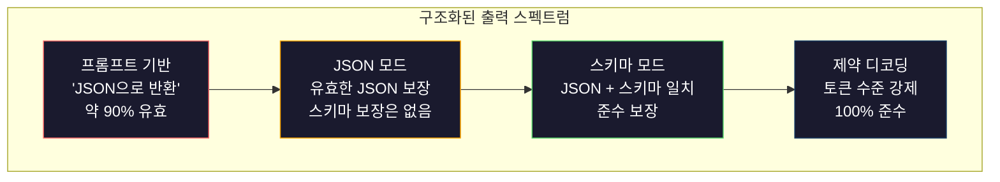
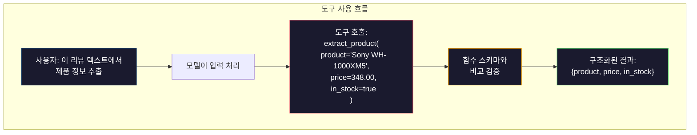

> 🇰🇷 이 문서는 한국어 번역본입니다(ELI5 스타일). 원문: [en.md](en.md)

# 구조화된 출력: JSON, 스키마 검증, 제약 디코딩

> LLM은 문자열을 돌려줍니다. 애플리케이션에는 JSON이 필요하죠. 이 간극은 그 어떤 모델 환각보다 많은 프로덕션(운영 환경) 시스템을 박살 냈습니다. 구조화된 출력은 자연어와 타입이 있는 데이터 사이의 다리입니다. 제대로 하면 LLM이 믿을 수 있는 API가 되고, 잘못하면 새벽 3시에 정규식으로 자유 텍스트를 파싱하는 신세가 됩니다.

**유형:** Build
**언어:** Python
**선수 지식:** Phase 10, 레슨 01-05 (LLMs from Scratch)
**소요 시간:** 약 90분
**관련 내용:** Phase 5 · 20 (Structured Outputs & Constrained Decoding)은 디코더 수준의 이론(FSM/CFG 로짓 프로세서, Outlines, XGrammar)을 다룹니다. 이 레슨은 프로덕션(운영 환경) SDK 표면(OpenAI `response_format`, Anthropic 도구 사용, Instructor)에 초점을 맞춥니다 — API 아래에서 무슨 일이 일어나는지 이해하고 싶다면 Phase 5 · 20을 먼저 읽으세요.

## 학습 목표

- OpenAI와 Anthropic API 파라미터로 JSON 모드와 스키마 제약 출력 구현하기
- 잘못된 형식의 LLM 출력을 거부하고 오류 피드백과 함께 재시도하는 Pydantic 검증 레이어 만들기
- 제약 디코딩이 후처리 없이 토큰 수준에서 유효한 JSON을 강제하는 원리 설명하기
- 비구조화된 텍스트를 안정적으로 타입이 있는 데이터 구조로 바꾸는 견고한 추출 프롬프트 설계하기

## 문제 상황

LLM에게 이렇게 물었습니다. "이 텍스트에서 제품명, 가격, 재고 여부를 추출해." 응답은 이렇습니다:

```
The product is the Sony WH-1000XM5 headphones, which cost $348.00 and are currently in stock.
```

완벽하게 정확한 답입니다. 동시에 애플리케이션에는 완전히 쓸모없는 답이기도 하죠. 재고 시스템에 필요한 것은 `{"product": "Sony WH-1000XM5", "price": 348.00, "in_stock": true}`입니다. 특정 키, 특정 타입, 특정 값 제약을 가진 JSON 객체가 필요한 것이지, 문장이 필요한 게 아닙니다.

소박한 해법: 프롬프트에 "JSON으로 답해"를 추가하기. 90%의 경우에는 이것으로 충분합니다. 나머지 10%에서 모델은 JSON을 마크다운 코드 펜스로 감싸거나, "여기 JSON이 있습니다:" 같은 머리말을 붙이거나, 괄호를 일찍 닫아 문법적으로 잘못된 JSON을 만들어 냅니다. JSON 파서가 터지고 파이프라인이 깨집니다. try/except와 재시도 루프를 추가하죠. 그런데 재시도가 다른 데이터를 내놓기도 합니다. 이제 파싱 문제 위에 일관성 문제까지 얹히게 됩니다.

이건 프롬프트 엔지니어링 문제가 아닙니다. 디코딩 문제입니다. 모델은 토큰을 왼쪽에서 오른쪽으로 생성합니다. 각 위치에서 10만 개가 넘는 어휘 중 가장 가능성 높은 다음 토큰을 고르죠. 그 옵션 대부분은 그 위치에서 잘못된 JSON을 만들어 냅니다. 모델이 `{"price":`까지 출력했다면, 다음 토큰은 반드시 숫자, 따옴표(문자열의 경우), `null`, `true`, `false`, 음수 부호 중 하나여야 합니다. 그 외의 것은 모두 잘못된 JSON을 낳습니다. 제약이 없으면 모델은 문법적으로는 재앙이지만 그럴듯한 영어 단어를 골라 버릴 수 있습니다.

## 개념

### 구조화된 출력의 스펙트럼

구조화된 출력 제어에는 네 단계가 있고, 뒤로 갈수록 더 신뢰할 수 있습니다.



**프롬프트 기반** ("유효한 JSON으로 답하라"): 강제 장치가 없습니다. 모델은 대개 따르지만 가끔 따르지 않습니다. 신뢰성: 약 90%. 실패 양상: 마크다운 펜스, 머리말 텍스트, 잘린 출력, 잘못된 구조.

**JSON 모드**: API가 출력이 유효한 JSON임을 보장합니다. OpenAI의 `response_format: { type: "json_object" }`가 이를 켭니다. 출력은 오류 없이 파싱됩니다. 하지만 여러분이 기대한 스키마와 일치한다는 보장은 없습니다 — 키가 더 있거나, 타입이 틀리거나, 필드가 빠질 수 있죠.

**스키마 모드**: API가 JSON Schema를 받아 출력이 그것과 일치함을 보장합니다. 2026년 현재 모든 주요 제공사가 네이티브로 지원합니다: OpenAI의 `response_format: { type: "json_schema", json_schema: {...} }` (`tool_choice="required"`로도 가능), Anthropic의 `input_schema`를 갖춘 도구 사용, 그리고 Gemini의 `response_schema` + `response_mime_type: "application/json"`. 출력에는 여러분이 지정한 정확한 키, 타입, 제약이 담깁니다.

**제약 디코딩**: 생성 중 각 토큰 위치에서 잘못된 출력을 낳는 모든 토큰을 디코더가 가려 버립니다. 스키마가 숫자를 요구하는데 모델이 문자를 내려 하는 순간, 그 토큰의 확률은 0이 됩니다. 모델은 유효한 출력으로 이어지는 토큰만 만들 수 있죠. OpenAI의 구조화된 출력 모드와 Outlines, Guidance 같은 라이브러리가 내부에서 구현하는 것이 바로 이것입니다.

### JSON Schema: 계약 언어

JSON Schema는 모델(또는 검증 레이어)에게 출력이 어떤 모양이어야 하는지 알려 주는 방법입니다. 모든 주요 구조화 출력 시스템이 이것을 씁니다.

```json
{
  "type": "object",
  "properties": {
    "product": { "type": "string" },
    "price": { "type": "number", "minimum": 0 },
    "in_stock": { "type": "boolean" },
    "categories": {
      "type": "array",
      "items": { "type": "string" }
    }
  },
  "required": ["product", "price", "in_stock"]
}
```

이 스키마가 말하는 것: 출력은 반드시 문자열 `product`, 0 이상의 숫자 `price`, 불리언 `in_stock`, 그리고 선택적인 문자열 배열 `categories`를 가진 객체여야 한다. 일치하지 않는 출력은 거부된다.

스키마는 어려운 케이스도 처리합니다. 중첩 객체, 타입이 지정된 항목의 배열, enum(문자열을 특정 값들로 제한), 패턴 매칭(문자열에 대한 정규식), 그리고 컴비네이터(다형적 출력을 위한 oneOf, anyOf, allOf).

### Pydantic 패턴

Python에서는 JSON Schema를 손으로 쓰지 않습니다. Pydantic 모델을 정의하면 스키마가 자동으로 만들어집니다.

```python
from pydantic import BaseModel

class Product(BaseModel):
    product: str
    price: float
    in_stock: bool
    categories: list[str] = []
```

이것은 위와 동일한 JSON Schema를 만들어 냅니다. Instructor 라이브러리(그리고 OpenAI SDK)는 Pydantic 모델을 직접 받습니다. 모델 클래스를 넘기면 검증된 인스턴스가 돌아옵니다. LLM 출력이 일치하지 않으면 Instructor가 자동으로 재시도합니다.

### 함수 호출 / 도구 사용

같은 문제의 또 다른 인터페이스입니다. 모델에게 JSON을 직접 만들라고 하지 않고, 타입이 지정된 파라미터를 가진 "도구"(함수)를 정의합니다. 모델은 구조화된 인자를 담은 함수 호출을 출력하죠. OpenAI는 이것을 "function calling"이라 부르고, Anthropic은 "tool use"라고 부릅니다. 결과는 같습니다. 구조화된 데이터입니다.



모델이 파라미터만 채우는 게 아니라 어떤 함수를 호출할지 골라야 한다면 도구 사용이 더 낫습니다. 추출 스키마가 10종류 있고 모델이 입력을 보고 알맞은 것을 골라야 한다면, 도구 사용은 스키마 선택과 구조화된 출력을 한 번에 제공합니다.

### 흔한 실패 양상

스키마 강제가 있어도 구조화된 출력은 미묘하게 실패할 수 있습니다.

**환각된 값**: 출력은 스키마와 일치하지만 지어낸 데이터가 들어 있습니다. 텍스트에는 $348이라고 적혀 있는데 모델이 `{"price": 299.99}`를 만들어 내는 식이죠. 스키마 검증은 이것을 잡지 못합니다. 타입은 맞고 값이 틀린 것이니까요.

**enum 혼동**: 필드를 `["in_stock", "out_of_stock", "preorder"]`로 제한했는데, 모델이 `"available"`을 출력합니다. 의미는 맞지만 허용 집합에는 없는 값이죠. 제대로 된 제약 디코딩은 이것을 막습니다. 프롬프트 기반 접근법은 못 막습니다.

**중첩 객체 깊이**: 깊게 중첩된 스키마(4단계 이상)는 오류가 더 많습니다. 중첩 단계 하나하나가 모델이 구조를 놓칠 수 있는 자리입니다.

**배열 길이**: 모델이 배열에 너무 많거나 너무 적은 항목을 넣을 수 있습니다. 스키마는 `minItems`와 `maxItems`를 지원하지만, 모든 제공사가 이를 디코딩 수준에서 강제하지는 않습니다.

**선택적 필드 생략**: 기술적으로는 선택 사항이지만 사용 사례에 중요한 필드를 모델이 빼먹습니다. 데이터가 가끔 없더라도 스키마에서 필수로 지정하세요 — 모델이 `null`을 명시적으로 만들도록 강제하는 것입니다.

```figure
mx-schema-funnel
```

## 직접 만들어 보기

### 단계 1: JSON Schema 검증기

Python 객체가 JSON Schema와 일치하는지 검사하는 검증기를 처음부터 만듭니다. 출력이 규격을 준수했는지 확인하는 출력 쪽 장치입니다.

```python
import json

def validate_schema(data, schema):
    errors = []
    _validate(data, schema, "", errors)
    return errors

def _validate(data, schema, path, errors):
    schema_type = schema.get("type")

    if schema_type == "object":
        if not isinstance(data, dict):
            errors.append(f"{path}: expected object, got {type(data).__name__}")
            return
        for key in schema.get("required", []):
            if key not in data:
                errors.append(f"{path}.{key}: required field missing")
        properties = schema.get("properties", {})
        for key, value in data.items():
            if key in properties:
                _validate(value, properties[key], f"{path}.{key}", errors)

    elif schema_type == "array":
        if not isinstance(data, list):
            errors.append(f"{path}: expected array, got {type(data).__name__}")
            return
        min_items = schema.get("minItems", 0)
        max_items = schema.get("maxItems", float("inf"))
        if len(data) < min_items:
            errors.append(f"{path}: array has {len(data)} items, minimum is {min_items}")
        if len(data) > max_items:
            errors.append(f"{path}: array has {len(data)} items, maximum is {max_items}")
        items_schema = schema.get("items", {})
        for i, item in enumerate(data):
            _validate(item, items_schema, f"{path}[{i}]", errors)

    elif schema_type == "string":
        if not isinstance(data, str):
            errors.append(f"{path}: expected string, got {type(data).__name__}")
            return
        enum_values = schema.get("enum")
        if enum_values and data not in enum_values:
            errors.append(f"{path}: '{data}' not in allowed values {enum_values}")

    elif schema_type == "number":
        if not isinstance(data, (int, float)):
            errors.append(f"{path}: expected number, got {type(data).__name__}")
            return
        minimum = schema.get("minimum")
        maximum = schema.get("maximum")
        if minimum is not None and data < minimum:
            errors.append(f"{path}: {data} is less than minimum {minimum}")
        if maximum is not None and data > maximum:
            errors.append(f"{path}: {data} is greater than maximum {maximum}")

    elif schema_type == "boolean":
        if not isinstance(data, bool):
            errors.append(f"{path}: expected boolean, got {type(data).__name__}")

    elif schema_type == "integer":
        if not isinstance(data, int) or isinstance(data, bool):
            errors.append(f"{path}: expected integer, got {type(data).__name__}")
```

### 단계 2: Pydantic 스타일 모델 → 스키마

최소한의 클래스→스키마 변환기를 만듭니다. Python 클래스를 정의하면 JSON Schema가 자동으로 생성됩니다.

```python
class SchemaField:
    def __init__(self, field_type, required=True, default=None, enum=None, minimum=None, maximum=None):
        self.field_type = field_type
        self.required = required
        self.default = default
        self.enum = enum
        self.minimum = minimum
        self.maximum = maximum

def python_type_to_schema(field):
    type_map = {
        str: "string",
        int: "integer",
        float: "number",
        bool: "boolean",
    }

    schema = {}

    if field.field_type in type_map:
        schema["type"] = type_map[field.field_type]
    elif field.field_type == list:
        schema["type"] = "array"
        schema["items"] = {"type": "string"}
    elif isinstance(field.field_type, dict):
        schema = field.field_type

    if field.enum:
        schema["enum"] = field.enum
    if field.minimum is not None:
        schema["minimum"] = field.minimum
    if field.maximum is not None:
        schema["maximum"] = field.maximum

    return schema

def model_to_schema(name, fields):
    properties = {}
    required = []

    for field_name, field in fields.items():
        properties[field_name] = python_type_to_schema(field)
        if field.required:
            required.append(field_name)

    return {
        "type": "object",
        "properties": properties,
        "required": required,
    }
```

### 단계 3: 제약 토큰 필터

제약 디코딩을 시뮬레이션합니다. 부분적인 JSON 문자열과 스키마가 주어지면, 현재 위치에서 유효한 토큰 범주가 무엇인지 판단합니다.

```python
def next_valid_tokens(partial_json, schema):
    stripped = partial_json.strip()

    if not stripped:
        return ["{"]

    try:
        json.loads(stripped)
        return ["<EOS>"]
    except json.JSONDecodeError:
        pass

    last_char = stripped[-1] if stripped else ""

    if last_char == "{":
        return ['"', "}"]
    elif last_char == '"':
        if stripped.endswith('":'):
            return ['"', "0-9", "true", "false", "null", "[", "{"]
        return ["a-z", '"']
    elif last_char == ":":
        return [" ", '"', "0-9", "true", "false", "null", "[", "{"]
    elif last_char == ",":
        return [" ", '"', "{", "["]
    elif last_char in "0123456789":
        return ["0-9", ".", ",", "}", "]"]
    elif last_char == "}":
        return [",", "}", "]", "<EOS>"]
    elif last_char == "]":
        return [",", "}", "<EOS>"]
    elif last_char == "[":
        return ['"', "0-9", "true", "false", "null", "{", "[", "]"]
    else:
        return ["any"]

def demonstrate_constrained_decoding():
    partial_states = [
        '',
        '{',
        '{"product"',
        '{"product":',
        '{"product": "Sony"',
        '{"product": "Sony",',
        '{"product": "Sony", "price":',
        '{"product": "Sony", "price": 348',
        '{"product": "Sony", "price": 348}',
    ]

    print(f"{'Partial JSON':<45} {'Valid Next Tokens'}")
    print("-" * 80)
    for state in partial_states:
        valid = next_valid_tokens(state, {})
        display = state if state else "(empty)"
        print(f"{display:<45} {valid}")
```

### 단계 4: 추출 파이프라인

모든 것을 추출 파이프라인으로 묶습니다. 스키마를 정의하고, LLM이 구조화된 출력을 만드는 것을 시뮬레이션하고, 출력을 검증하고, 재시도를 처리합니다.

```python
def simulate_llm_extraction(text, schema, attempt=0):
    if "headphones" in text.lower() or "sony" in text.lower():
        if attempt == 0:
            return '{"product": "Sony WH-1000XM5", "price": 348.00, "in_stock": true, "categories": ["audio", "headphones"]}'
        return '{"product": "Sony WH-1000XM5", "price": 348.00, "in_stock": true}'

    if "laptop" in text.lower():
        return '{"product": "MacBook Pro 16", "price": 2499.00, "in_stock": false, "categories": ["computers"]}'

    return '{"product": "Unknown", "price": 0, "in_stock": false}'

def extract_with_retry(text, schema, max_retries=3):
    for attempt in range(max_retries):
        raw = simulate_llm_extraction(text, schema, attempt)

        try:
            data = json.loads(raw)
        except json.JSONDecodeError as e:
            print(f"  Attempt {attempt + 1}: JSON parse error -- {e}")
            continue

        errors = validate_schema(data, schema)
        if not errors:
            return data

        print(f"  Attempt {attempt + 1}: Schema validation errors -- {errors}")

    return None

product_schema = {
    "type": "object",
    "properties": {
        "product": {"type": "string"},
        "price": {"type": "number", "minimum": 0},
        "in_stock": {"type": "boolean"},
        "categories": {"type": "array", "items": {"type": "string"}},
    },
    "required": ["product", "price", "in_stock"],
}
```

### 단계 5: 전체 파이프라인 실행

```python
def run_demo():
    print("=" * 60)
    print("  Structured Output Pipeline Demo")
    print("=" * 60)

    print("\n--- Schema Definition ---")
    product_fields = {
        "product": SchemaField(str),
        "price": SchemaField(float, minimum=0),
        "in_stock": SchemaField(bool),
        "categories": SchemaField(list, required=False),
    }
    generated_schema = model_to_schema("Product", product_fields)
    print(json.dumps(generated_schema, indent=2))

    print("\n--- Schema Validation ---")
    test_cases = [
        ({"product": "Test", "price": 10.0, "in_stock": True}, "Valid object"),
        ({"product": "Test", "price": -5.0, "in_stock": True}, "Negative price"),
        ({"product": "Test", "in_stock": True}, "Missing price"),
        ({"product": "Test", "price": "ten", "in_stock": True}, "String as price"),
        ("not an object", "String instead of object"),
    ]

    for data, label in test_cases:
        errors = validate_schema(data, product_schema)
        status = "PASS" if not errors else f"FAIL: {errors}"
        print(f"  {label}: {status}")

    print("\n--- Constrained Decoding Simulation ---")
    demonstrate_constrained_decoding()

    print("\n--- Extraction Pipeline ---")
    texts = [
        "The Sony WH-1000XM5 headphones are priced at $348 and currently available.",
        "The new MacBook Pro 16-inch laptop costs $2499 but is sold out.",
        "This is a random sentence with no product info.",
    ]

    for text in texts:
        print(f"\n  Input: {text[:60]}...")
        result = extract_with_retry(text, product_schema)
        if result:
            print(f"  Output: {json.dumps(result)}")
        else:
            print(f"  Output: FAILED after retries")
```

## 사용해 보기

### OpenAI 구조화된 출력

```python
# from openai import OpenAI
# from pydantic import BaseModel
#
# client = OpenAI()
#
# class Product(BaseModel):
#     product: str
#     price: float
#     in_stock: bool
#
# response = client.beta.chat.completions.parse(
#     model="gpt-5-mini",
#     messages=[
#         {"role": "system", "content": "Extract product information."},
#         {"role": "user", "content": "Sony WH-1000XM5, $348, in stock"},
#     ],
#     response_format=Product,
# )
#
# product = response.choices[0].message.parsed
# print(product.product, product.price, product.in_stock)
```

OpenAI의 구조화된 출력 모드는 내부적으로 제약 디코딩을 사용합니다. 모델이 생성하는 모든 토큰은 Pydantic 스키마와 일치하는 출력을 만지도록 보장됩니다. 재시도도, 검증도 필요 없습니다. 제약이 디코딩 과정에 그대로 구워져 있기 때문입니다.

### Anthropic 도구 사용

```python
# import anthropic
#
# client = anthropic.Anthropic()
#
# response = client.messages.create(
#     model="claude-opus-4-7",
#     max_tokens=1024,
#     tools=[{
#         "name": "extract_product",
#         "description": "Extract product information from text",
#         "input_schema": {
#             "type": "object",
#             "properties": {
#                 "product": {"type": "string"},
#                 "price": {"type": "number"},
#                 "in_stock": {"type": "boolean"},
#             },
#             "required": ["product", "price", "in_stock"],
#         },
#     }],
#     messages=[{"role": "user", "content": "Extract: Sony WH-1000XM5, $348, in stock"}],
# )
```

Anthropic은 도구 사용으로 구조화된 출력을 구현합니다. 모델이 input_schema와 일치하는 구조화된 인자를 담은 도구 호출을 내보냅니다. 같은 결과, 다른 API 표면입니다.

### Instructor 라이브러리

```python
# pip install instructor
# import instructor
# from openai import OpenAI
# from pydantic import BaseModel
#
# client = instructor.from_openai(OpenAI())
#
# class Product(BaseModel):
#     product: str
#     price: float
#     in_stock: bool
#
# product = client.chat.completions.create(
#     model="gpt-5-mini",
#     response_model=Product,
#     messages=[{"role": "user", "content": "Sony WH-1000XM5, $348, in stock"}],
# )
```

Instructor는 어떤 LLM 클라이언트든 감싸서 검증 기반 자동 재시도를 더해 줍니다. 첫 시도가 검증에 실패하면 오류를 컨텍스트로 모델에 되돌려 보내고 출력을 고치라고 요청합니다. OpenAI뿐 아니라 어떤 제공사와도 작동합니다.

## 출시해 보기

이 레슨은 `outputs/prompt-structured-extractor.md`를 만듭니다 — 스키마 정의가 주어지면 어떤 텍스트에서든 구조화된 데이터를 추출하는 재사용 가능한 프롬프트 템플릿입니다. JSON Schema와 비구조화 텍스트를 넣으면 검증된 JSON이 돌아옵니다.

또한 `outputs/skill-structured-outputs.md`도 만듭니다 — 제공사, 신뢰성 요구 사항, 스키마 복잡도를 기준으로 알맞은 구조화 출력 전략을 고르는 의사 결정 프레임워크입니다.

## 연습 문제

1. 스키마 검증기가 `oneOf`(데이터가 여러 스키마 중 정확히 하나와 일치해야 함)를 지원하도록 확장하세요. 이것은 다형적 출력을 처리합니다 — 예를 들어 어떤 필드가 서로 다른 모양을 가진 `Product` 객체이거나 `Service` 객체일 수 있는 경우죠.

2. 두 스키마를 비교해 깨지는 변경(필수 필드 제거, 타입 변경)과 깨지지 않는 변경(선택 필드 추가, 제약 완화)을 식별하는 "스키마 diff" 도구를 만드세요. 프로덕션(운영 환경)에서 추출 스키마의 버전을 관리하려면 필수입니다.

3. 더 현실적인 제약 디코딩 시뮬레이터를 구현하세요. JSON Schema와 100개 토큰짜리 어휘(문자, 숫자, 구두점, 키워드)가 주어지면, 생성을 단계별로 진행하면서 각 위치에서 유효하지 않은 토큰을 가립니다. 각 단계에서 어휘의 몇 퍼센트가 유효한지 측정하세요.

4. 추출 평가 스위트를 만드세요. 손으로 레이블을 단 JSON 출력과 함께 제품 설명 50개를 작성하세요. 추출 파이프라인을 50개 전부에 실행하고 정확 일치, 필드 수준 정확도, 타입 준수를 측정하세요. 어떤 필드가 가장 바르게 추출하기 어려운지 찾으세요.

5. 추출 파이프라인에 "확신도 점수"를 추가하세요. 추출된 각 필드에 대해 모델의 확신도를 추정합니다(토큰 확률 기반, 또는 추출을 3번 실행해 일관성을 측정). 낮은 확신도의 필드는 사람의 검토 대상으로 표시하세요.

## 핵심 용어

| 용어 | 사람들이 말하는 것 | 실제 의미 |
|------|----------------|----------------------|
| JSON 모드 | "JSON으로 돌려준다" | 문법적으로 유효한 JSON 출력을 보장하는 API 플래그. 단, 특정 스키마는 강제하지 않음 |
| 구조화된 출력 | "타입 있는 JSON" | 정확한 키, 타입, 제약을 갖추고 특정 JSON Schema와 일치하는 출력 |
| 제약 디코딩 | "유도 생성" | 각 토큰 위치에서 잘못된 출력을 낳는 토큰을 가려 내는 것 — 100% 스키마 준수를 보장 |
| JSON Schema | "JSON 템플릿" | JSON 데이터의 구조, 타입, 제약을 기술하는 선언적 언어 (OpenAPI, JSON Forms 등이 사용) |
| Pydantic | "Python dataclasses 플러스" | 타입 검증이 있는 데이터 모델을 정의하는 Python 라이브러리. FastAPI와 Instructor가 JSON Schema 생성에 사용 |
| 함수 호출 | "도구 사용" | LLM이 자유 텍스트 대신 구조화된 함수 호출(이름 + 타입 있는 인자)을 출력하는 것 — OpenAI와 Anthropic 모두 지원 |
| Instructor | "LLM용 Pydantic" | LLM 클라이언트를 감싸 검증된 Pydantic 인스턴스를 반환하게 하는 Python 라이브러리. 검증 실패 시 자동 재시도 |
| 토큰 마스킹 | "어휘 걸러내기" | 생성 중 특정 토큰의 확률을 0으로 만들어 모델이 그 토큰을 만들지 못하게 하는 것 |
| 스키마 준수 | "모양이 맞다" | 출력이 모든 필수 필드를 갖추고, 타입이 올바르고, 값이 제약 안에 있고, 허용되지 않는 추가 필드가 없는 상태 |
| 재시도 루프 | "될 때까지 다시" | 검증 오류를 모델에 되돌려 보내고 출력을 고치게 하는 것 — Instructor가 설정 가능한 최대 횟수까지 자동으로 수행 |

## 더 읽을거리

- [OpenAI Structured Outputs Guide](https://platform.openai.com/docs/guides/structured-outputs) — OpenAI API의 JSON Schema 기반 제약 디코딩 공식 문서
- [Willard & Louf, 2023 -- "Efficient Guided Generation for Large Language Models"](https://arxiv.org/abs/2307.09702) — Outlines 논문. JSON Schema를 유한 상태 머신으로 컴파일해 토큰 수준 제약을 거는 방법을 설명합니다.
- [Instructor documentation](https://python.useinstructor.com/) — Pydantic 검증과 재시도로 어떤 LLM에서든 구조화된 출력을 얻는 표준 라이브러리
- [Anthropic Tool Use Guide](https://docs.anthropic.com/en/docs/tool-use) — Claude가 JSON Schema input_schema를 갖춘 도구 사용으로 구조화된 출력을 구현하는 방법
- [JSON Schema specification](https://json-schema.org/) — 모든 주요 구조화 출력 시스템이 쓰는 스키마 언어의 전체 명세
- [Outlines library](https://github.com/outlines-dev/outlines) — 정규식과 JSON Schema를 유한 상태 머신으로 컴파일하는 오픈소스 제약 생성 라이브러리
- [Dong et al., "XGrammar: Flexible and Efficient Structured Generation Engine for Large Language Models" (MLSys 2025)](https://arxiv.org/abs/2411.15100) — 현재 최고 수준의 문법 엔진. 푸시다운 오토마타 컴파일로 토큰당 약 100 ns에 토큰을 가립니다.
- [Beurer-Kellner et al., "Prompting Is Programming: A Query Language for Large Language Models" (LMQL)](https://arxiv.org/abs/2212.06094) — 제약 디코딩을 타입 및 값 제약이 있는 쿼리 언어로 다루는 LMQL 논문.
- [Microsoft Guidance (framework docs)](https://github.com/guidance-ai/guidance) — 템플릿 기반 제약 생성. Outlines와 XGrammar의 제공사 중립적 보완재입니다.
