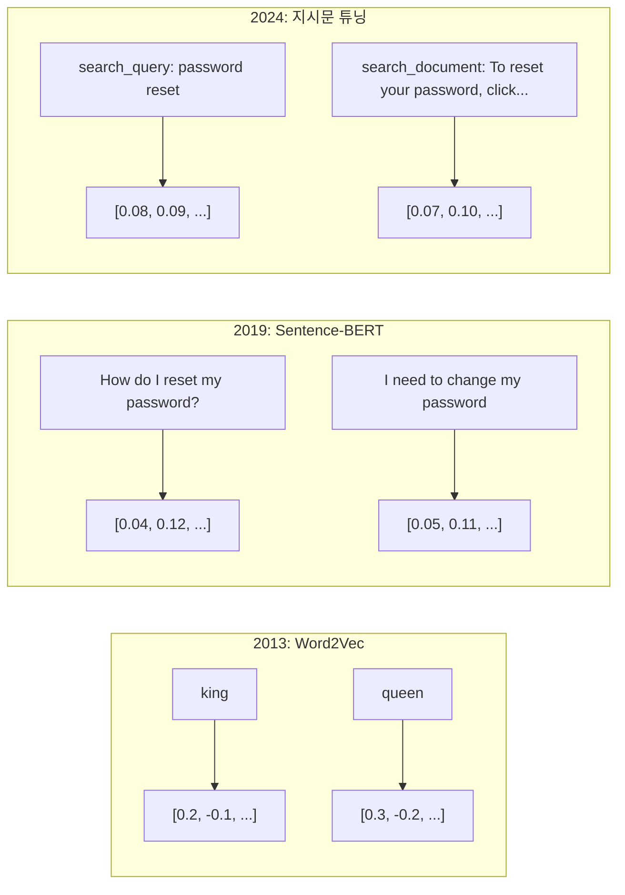
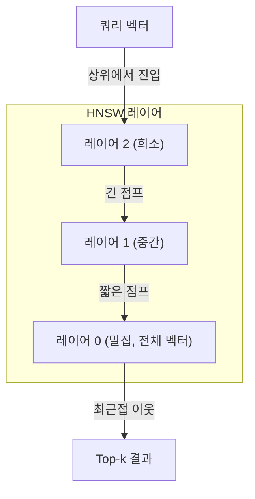

# 임베딩과 벡터 표현

> 🇰🇷 이 문서는 한국어 번역본입니다(ELI5 스타일). 원문: [en.md](en.md)

> 텍스트는 이산적이고, 수학은 연속적입니다. LLM에게 "비슷한" 문서를 찾거나, 의미를 비교하거나, 키워드를 넘어 검색해 달라고 부탁할 때마다 여러분은 이 두 세계를 잇는 다리에 의존하고 있습니다. 그 다리가 바로 임베딩입니다. 임베딩을 이해하지 못하면 현대 AI를 이해하는 것이 아니라, 그냥 쓰고만 있는 것입니다.

**유형:** Build
**언어:** Python
**선수 지식:** 페이즈 11, 레슨 01(프롬프트 엔지니어링)
**시간:** 약 75분
**관련:** 페이즈 5 · 22(임베딩 모델 심층 탐구)는 dense vs sparse vs 멀티 벡터, 마트료시카(Matryoshka) 절단, 축별 모델 선택을 다룹니다. 이 레슨은 프로덕션(운영 환경) 파이프라인(벡터 DB, HNSW, 유사도 수학)에 초점을 맞춥니다. 모델을 고르기 전에 페이즈 5 · 22를 먼저 읽으세요.

## 학습 목표

- API 제공사와 오픈소스 모델을 사용해 텍스트 임베딩을 생성하고, 임베딩 간의 코사인 유사도를 계산할 수 있습니다
- 임베딩이 키워드 검색이 처리하지 못하는 어휘 불일치(vocabulary mismatch) 문제를 해결하는 이유를 설명할 수 있습니다
- 정확한 키워드 일치가 아니라 의미로 문서를 찾아내는 시맨틱 검색 인덱스를 만들 수 있습니다
- 검색 벤치마크(precision@k, 재현율(recall))로 임베딩 품질을 평가하고, 작업에 맞는 임베딩 모델을 선택할 수 있습니다

## 문제 상황

고객 지원 티켓이 10,000건 있습니다. 한 고객이 "my payment didn't go through(결제가 안 됐어요)"라고 씁니다. 비슷한 과거 티켓을 찾아야 합니다. 키워드 검색은 "payment"와 "didn't go through"라는 단어가 들어간 티켓은 찾지만, "transaction failed", "charge was declined", "billing error" 같은 티켓은 놓칩니다. 이 티켓들은 전혀 다른 단어로 완전히 똑같은 문제를 묘사합니다.

이것이 어휘 불일치(vocabulary mismatch) 문제입니다. 인간의 언어에는 같은 말을 하는 방식이 수십 가지나 있습니다. 키워드 검색은 각 단어를 의미 없는 독립된 기호로 취급합니다. 그래서 "declined"와 "didn't go through"가 같은 개념을 가리킨다는 것을 알 방법이 없습니다.

이제는 철자가 아니라 의미가 유사성을 결정하는 텍스트 표현이 필요합니다. "my payment didn't go through"와 "transaction was declined"를 어떤 수학적 공간 안에서 가까이 두고, 같은 단어 "payment"를 공유함에도 불구하고 "my payment arrived on time"은 멀리 밀어내는 방법이 필요합니다.

그 표현이 바로 임베딩입니다.

## 개념

### 임베딩이란?

임베딩은 텍스트의 의미를 나타내는, 부동소수점 숫자로 이루어진 밀집(dense) 벡터입니다. "밀집"이라는 말이 중요합니다. 모든 차원이 정보를 담고 있다는 뜻이기 때문입니다. 대부분의 차원이 0인 희소(sparse) 표현(단어 가방(bag-of-words), TF-IDF)과는 정반대입니다.

"The cat sat on the mat"이라는 문장은 `[0.023, -0.041, 0.087, ..., 0.012]` 같은 형태로 바뀝니다. 모델에 따라 768개에서 3072개 숫자의 목록입니다. 이 숫자들은 의미를 부호화합니다. 숫자를 직접 들여다볼 일은 없고, 비교만 하면 됩니다.

### Word2Vec의 돌파구

2013년 토마스 미콜로프(Tomas Mikolov)와 구글 동료들이 Word2Vec을 발표했습니다. 핵심 아이디어는 이렇습니다. 신경망을 훈련해 주변 단어로부터 한 단어를 예측하게 하면(또는 한 단어로부터 주변 단어를 예측하게 하면) 은닉층 가중치가 의미 있는 벡터 표현으로 바뀐다는 것입니다.

유명한 결과가 이것입니다:

```
king - man + woman = queen
```

단어 임베딩에 대한 벡터 연산은 의미 관계를 포착합니다. "man"에서 "woman"으로 가는 방향은 "king"에서 "queen"으로 가는 방향과 거의 같습니다. 기하학이 의미를 부호화할 수 있다는 사실을 이 분야가 깨달은 순간이었습니다.

Word2Vec은 300차원 벡터를 만들었습니다. 각 단어는 문맥과 상관없이 하나의 벡터만 가집니다. "river bank"의 "bank"와 "bank account"의 "bank"는 같은 임베딩을 가졌습니다. 이 한계가 이후 10년간의 연구를 이끌었습니다.

### 단어에서 문장으로

단어 임베딩은 개별 토큰을 표현합니다. 프로덕션(운영 환경) 시스템은 문장, 단락, 문서 전체를 임베딩해야 합니다. 네 가지 접근법이 등장했습니다:

**평균내기(Averaging)**: 문장 안의 모든 단어 벡터의 평균을 취합니다. 저렴하고 정보 손실이 있지만, 짧은 텍스트에서는 의외로 쓸 만합니다. 단어 순서를 완전히 잃습니다. "dog bites man"과 "man bites dog"가 동일한 임베딩을 갖게 됩니다.

**CLS 토큰**: 트랜스포머 모델(BERT, 2018)은 입력 전체를 대표하는 특수한 [CLS] 토큰 임베딩을 출력합니다. 평균내기보다 낫지만, [CLS] 토큰은 유사도가 아니라 다음 문장 예측을 위해 훈련된 것입니다.

**대조 학습(Contrastive learning)**: 비슷한 쌍은 가까이, 비슷하지 않은 쌍은 멀어지도록 모델을 명시적으로 훈련합니다. Sentence-BERT(Reimers & Gurevych, 2019)가 이 방식을 사용했고 현대 임베딩 모델의 토대가 되었습니다. "How do I reset my password?"와 "I need to change my password"가 주어지면, 모델은 이 둘이 거의 동일한 벡터를 가져야 한다는 것을 학습합니다.

**지시문 튜닝 임베딩(Instruction-tuned embeddings)**: 가장 최근 방식입니다. E5, GTE 같은 모델은 어떤 종류의 임베딩을 만들지 알려주는 작업 접두사("search_query:", "search_document:")를 받습니다. 덕분에 하나의 모델로 여러 작업을 처리할 수 있습니다.



### 현대의 임베딩 모델

시장은 소수의 프로덕션급 옵션으로 수렴했습니다(2026년 초 기준 MTEB 점수, MTEB v2):

| 모델 | 제공사 | 차원 | MTEB | 컨텍스트 | 비용 / 100만 토큰 |
|-------|----------|-----------|------|---------|------------------|
| Gemini Embedding 2 | Google | 3072 (마트료시카) | 67.7 (검색) | 8192 | $0.15 |
| embed-v4 | Cohere | 1024 (마트료시카) | 65.2 | 128K | $0.12 |
| voyage-4 | Voyage AI | 1024/2048 (마트료시카) | 66.8 | 32K | $0.12 |
| text-embedding-3-large | OpenAI | 3072 (마트료시카) | 64.6 | 8192 | $0.13 |
| text-embedding-3-small | OpenAI | 1536 (마트료시카) | 62.3 | 8192 | $0.02 |
| BGE-M3 | BAAI | 1024 (dense+sparse+ColBERT) | 63.0 다국어 | 8192 | 오픈 웨이트 |
| Qwen3-Embedding | Alibaba | 4096 (마트료시카) | 66.9 | 32K | 오픈 웨이트 |
| Nomic-embed-v2 | Nomic | 768 (마트료시카) | 63.1 | 8192 | 오픈 웨이트 |

MTEB(Massive Text Embedding Benchmark) v2는 검색, 분류, 클러스터링, 리랭킹(reranking), 요약 전반에 걸친 100개 이상의 작업을 다룹니다. 점수가 높을수록 좋습니다. 2026년에는 오픈 웨이트 모델(Qwen3-Embedding, BGE-M3)이 대부분의 항목에서 클로즈드 호스팅 모델에 필적하거나 능가합니다. 순수 검색 성능은 Gemini Embedding 2가 선두이고, 특정 도메인(금융, 법률, 코드)은 Voyage/Cohere가 선두입니다. 어떤 모델이든 선택하기 전에 반드시 여러분의 쿼리로 직접 벤치마크하세요.

### 유사도 지표

두 임베딩 벡터가 주어졌을 때, 얼마나 비슷한지 측정하는 방법은 세 가지입니다:

**코사인 유사도**: 두 벡터 사이 각도의 코사인입니다. -1(정반대)에서 1(같은 방향) 사이의 값을 가집니다. 크기는 무시합니다. 10단어 문장과 500단어 문서도 방향이 같으면 1.0이 나올 수 있습니다. 사용 사례의 90%에서 기본 선택입니다.

```
cosine_sim(a, b) = dot(a, b) / (||a|| * ||b||)
```

**내적(dot product)**: 두 벡터의 날 내적 값입니다. 벡터가 정규화되어 있으면(단위 길이) 코사인 유사도와 동일합니다. 계산이 더 빠릅니다. OpenAI의 임베딩은 정규화되어 있어서 내적과 코사인이 같은 순위를 줍니다.

```
dot(a, b) = sum(a_i * b_i)
```

**유클리드(L2) 거리**: 벡터 공간에서의 직선 거리입니다. 값이 작을수록 더 비슷합니다. 크기 차이에 민감합니다. 방향뿐 아니라 공간에서의 절대적 위치가 중요할 때 사용합니다.

```
L2(a, b) = sqrt(sum((a_i - b_i)^2))
```

어떤 지표를 언제 쓸까:

| 지표 | 사용 시기 | 피해야 할 때 |
|--------|----------|------------|
| 코사인 유사도 | 길이가 다른 텍스트 비교, 대부분의 검색 작업 | 크기 자체가 정보를 담고 있을 때 |
| 내적 | 임베딩이 이미 정규화되어 있을 때, 최대 속도가 필요할 때 | 벡터 크기가 제각각일 때 |
| 유클리드 거리 | 클러스터링, 공간적 최근접 이웃 문제 | 길이가 크게 다른 문서 비교 |

### 벡터 데이터베이스와 HNSW

브루트 포스(전수 조사) 유사도 검색은 쿼리를 저장된 모든 벡터와 비교합니다. 1536차원 벡터 100만 개라면 쿼리 한 번에 15억 번의 곱셈-덧셈 연산이 필요합니다. 너무 느립니다.

벡터 데이터베이스는 근사 최근접 이웃(Approximate Nearest Neighbor, ANN) 알고리즘으로 이 문제를 해결합니다. 지배적인 알고리즘은 HNSW(Hierarchical Navigable Small World)입니다:

1. 벡터로 다층 그래프를 만듭니다
2. 상위 레이어는 희소합니다. 멀리 떨어진 클러스터 사이를 잇는 장거리 연결이 있습니다
3. 하위 레이어는 밀집되어 있습니다. 가까운 벡터 사이의 세밀한 연결이 있습니다
4. 검색은 상위 레이어에서 시작해 탐욕적으로 내려가며 정밀해집니다
5. O(n)이 아니라 O(log n) 시간에 근사적인 top-k 결과를 반환합니다

HNSW는 작은 정확도 손실(보통 95-99% 재현율)을 치르고 엄청난 속도 향상을 얻습니다. 벡터 1,000만 개에서 브루트 포스는 몇 초가 걸리지만, HNSW는 몇 밀리초면 됩니다.



프로덕션 옵션:

| 데이터베이스 | 유형 | 적합한 용도 | 최대 규모 |
|----------|------|----------|-----------|
| Pinecone | 관리형 SaaS | 운영 부담 없는 프로덕션 | 수십억 |
| Weaviate | 오픈소스 | 셀프 호스팅, 하이브리드 검색 | 1억+ |
| Qdrant | 오픈소스 | 고성능, 필터링 | 1억+ |
| ChromaDB | 임베디드 | 프로토타이핑, 로컬 개발 | 100만 |
| pgvector | Postgres 확장 | 이미 Postgres를 쓰는 경우 | 1,000만 |
| FAISS | 라이브러리 | 인프로세스, 연구 | 10억+ |

### 청킹 전략

문서는 단일 벡터로 임베딩하기에는 너무 깁니다. 50페이지짜리 PDF는 수십 가지 주제를 다루기 때문에, 그 임베딩은 모든 것의 평균이 되어 특정한 것과는 비슷하지 않게 됩니다. 그래서 문서를 청크(chunk)로 나누고 각각을 임베딩합니다.

**고정 크기 청킹**: N개 토큰마다 M개 토큰의 겹침(overlap)을 두고 자릅니다. 단순하고 예측 가능합니다. 문서에 뚜렷한 구조가 없을 때 잘 동작합니다. 512토큰 청크에 50토큰 겹침이면: 청크 1은 토큰 0-511, 청크 2는 토큰 462-973입니다.

**문장 기반 청킹**: 문장 경계에서 자르고, 토큰 한도에 도달할 때까지 문장을 묶습니다. 각 청크는 최소한 하나의 완전한 문장입니다. 생각의 중간을 자르는 일이 없으므로 고정 크기보다 낫습니다.

**재귀적 청킹**: 가장 큰 경계(섹션 헤더)부터 자르기를 시도합니다. 여전히 너무 크면 단락 경계를 시도합니다. 그다음은 문장 경계, 그다음은 글자 수 제한입니다. LangChain의 `RecursiveCharacterTextSplitter`가 이 방식이며, 혼합 형식 코퍼스에서 잘 동작합니다.

**시맨틱 청킹**: 각 문장을 임베딩한 다음, 임베딩이 비슷한 연속된 문장들을 묶습니다. 임베딩 유사도가 임계값 아래로 떨어지면 새 청크를 시작합니다. 비용이 많이 듭니다(모든 문장을 개별적으로 임베딩해야 함)만 가장 응집력 있는 청크를 만들어 냅니다.

| 전략 | 복잡도 | 품질 | 적합한 용도 |
|----------|-----------|---------|----------|
| 고정 크기 | 낮음 | 나쁘지 않음 | 구조 없는 텍스트, 로그 |
| 문장 기반 | 낮음 | 좋음 | 기사, 이메일 |
| 재귀적 | 중간 | 좋음 | Markdown, HTML, 혼합 문서 |
| 시맨틱 | 높음 | 최고 | 검색 품질이 결정적인 경우 |

대부분의 시스템에서 최적점(sweet spot)은 50토큰 겹침을 둔 256-512토큰 청크입니다.

### 바이 인코더 vs 크로스 인코더

바이 인코더(bi-encoder)는 쿼리와 문서를 각각 독립적으로 임베딩한 다음 벡터를 비교합니다. 빠릅니다. 쿼리를 한 번만 임베딩하고 미리 계산해 둔 문서 임베딩과 비교하면 됩니다. 검색에는 이 방식을 사용합니다.

크로스 인코더(cross-encoder)는 쿼리와 문서를 하나의 입력으로 받아 관련도 점수를 출력합니다. 느립니다. 각 쿼리-문서 쌍을 전체 모델에 통과시켜야 하기 때문입니다. 하지만 쿼리와 문서 토큰을 동시에 어텐션으로 살펴볼 수 있어 훨씬 정확합니다.

프로덕션 패턴은 이렇습니다. 바이 인코더가 상위 100개 후보를 찾고, 크로스 인코더가 이를 상위 10개로 리랭킹합니다. 이것이 검색 후 리랭킹(retrieve-then-rerank) 파이프라인입니다.


리랭킹 모델: Cohere Rerank 3.5(쿼리 1,000건당 $2), BGE-reranker-v2(무료, 오픈소스), Jina Reranker v2(무료, 오픈소스).

### 마트료시카 임베딩

전통적인 임베딩은 전부 아니면 전무입니다. 1536차원 벡터는 부동소수점 숫자 1536개를 사용합니다. 재훈련 없이 256차원으로 줄일 수는 없습니다.

마트료시카 표현 학습(Matryoshka Representation Learning, Kusupati et al., 2022)이 이 문제를 해결합니다. 모델을 훈련할 때 처음 N개 차원이 가장 중요한 정보를 담도록 만드는 것입니다. 러시아 인형(마트료시카)처럼요. 1536차원 마트료시카 임베딩을 256차원으로 잘라도 약간의 정확도는 잃지만 여전히 쓸 수 있습니다.

OpenAI의 text-embedding-3-small과 text-embedding-3-large는 `dimensions` 파라미터로 마트료시카 절단을 지원합니다. 1536 대신 256차원을 요청하면 저장 공간이 6배 줄어들고, MTEB 벤치마크 기준 정확도 손실은 약 3-5%입니다.

### 이진 양자화

float32로 저장한 1536차원 임베딩은 6,144바이트를 사용합니다. 문서 1,000만 개를 곱하면 벡터만으로 61GB입니다.

이진 양자화(binary quantization)는 각 부동소수점 값을 1비트로 바꿉니다. 양수는 1, 음수는 0이 됩니다. 저장 공간이 6,144바이트에서 192바이트로 줄어듭니다. 무려 32배 절감입니다. 유사도는 해밍 거리(다른 비트의 개수 세기)로 계산하는데, CPU가 단일 명령으로 처리할 수 있습니다.

검색 재현율 기준으로 정확도 하락은 대략 5-10%입니다. 흔한 패턴은 이렇습니다. 수백만 벡터에 대한 1차 검색은 이진 양자화로 수행하고, 상위 1,000개는 전체 정밀도 벡터로 다시 점수를 매깁니다. 이렇게 하면 메모리를 32배 아끼면서 전체 정밀도의 95% 이상 정확도를 얻습니다.

```figure
cosine-similarity
```

## 만들어 보기

시맨틱 검색 엔진을 처음부터 직접 만듭니다. 벡터 데이터베이스도 없고, 외부 임베딩 API도 없습니다. 수학 연산에는 numpy를 쓰는 순수 Python입니다.

### 단계 1: 텍스트 청킹

```python
def chunk_text(text, chunk_size=200, overlap=50):
    words = text.split()
    chunks = []
    start = 0
    while start < len(words):
        end = start + chunk_size
        chunk = " ".join(words[start:end])
        chunks.append(chunk)
        start += chunk_size - overlap
    return chunks


def chunk_by_sentences(text, max_chunk_tokens=200):
    sentences = text.replace("\n", " ").split(".")
    sentences = [s.strip() + "." for s in sentences if s.strip()]
    chunks = []
    current_chunk = []
    current_length = 0
    for sentence in sentences:
        sentence_length = len(sentence.split())
        if current_length + sentence_length > max_chunk_tokens and current_chunk:
            chunks.append(" ".join(current_chunk))
            current_chunk = []
            current_length = 0
        current_chunk.append(sentence)
        current_length += sentence_length
    if current_chunk:
        chunks.append(" ".join(current_chunk))
    return chunks
```

### 단계 2: 임베딩 직접 만들기

L2 정규화를 적용한 TF-IDF로 간단한 밀집 임베딩을 구현합니다. 신경망 임베딩은 아니지만 같은 계약을 따릅니다. 텍스트가 들어가면 고정 크기 벡터가 나오고, 비슷한 텍스트는 비슷한 벡터를 만듭니다.

```python
import math
import numpy as np
from collections import Counter

class SimpleEmbedder:
    def __init__(self):
        self.vocab = []
        self.idf = []
        self.word_to_idx = {}

    def fit(self, documents):
        vocab_set = set()
        for doc in documents:
            vocab_set.update(doc.lower().split())
        self.vocab = sorted(vocab_set)
        self.word_to_idx = {w: i for i, w in enumerate(self.vocab)}
        n = len(documents)
        self.idf = np.zeros(len(self.vocab))
        for i, word in enumerate(self.vocab):
            doc_count = sum(1 for doc in documents if word in doc.lower().split())
            self.idf[i] = math.log((n + 1) / (doc_count + 1)) + 1

    def embed(self, text):
        words = text.lower().split()
        count = Counter(words)
        total = len(words) if words else 1
        vec = np.zeros(len(self.vocab))
        for word, freq in count.items():
            if word in self.word_to_idx:
                tf = freq / total
                vec[self.word_to_idx[word]] = tf * self.idf[self.word_to_idx[word]]
        norm = np.linalg.norm(vec)
        if norm > 0:
            vec = vec / norm
        return vec
```

### 단계 3: 유사도 함수

```python
def cosine_similarity(a, b):
    dot = np.dot(a, b)
    norm_a = np.linalg.norm(a)
    norm_b = np.linalg.norm(b)
    if norm_a == 0 or norm_b == 0:
        return 0.0
    return float(dot / (norm_a * norm_b))


def dot_product(a, b):
    return float(np.dot(a, b))


def euclidean_distance(a, b):
    return float(np.linalg.norm(a - b))
```

### 단계 4: 브루트 포스 검색 벡터 인덱스

```python
class VectorIndex:
    def __init__(self):
        self.vectors = []
        self.texts = []
        self.metadata = []

    def add(self, vector, text, meta=None):
        self.vectors.append(vector)
        self.texts.append(text)
        self.metadata.append(meta or {})

    def search(self, query_vector, top_k=5, metric="cosine"):
        scores = []
        for i, vec in enumerate(self.vectors):
            if metric == "cosine":
                score = cosine_similarity(query_vector, vec)
            elif metric == "dot":
                score = dot_product(query_vector, vec)
            elif metric == "euclidean":
                score = -euclidean_distance(query_vector, vec)
            else:
                raise ValueError(f"Unknown metric: {metric}")
            scores.append((i, score))
        scores.sort(key=lambda x: x[1], reverse=True)
        results = []
        for idx, score in scores[:top_k]:
            results.append({
                "text": self.texts[idx],
                "score": score,
                "metadata": self.metadata[idx],
                "index": idx
            })
        return results

    def size(self):
        return len(self.vectors)
```

### 단계 5: 시맨틱 검색 엔진

```python
class SemanticSearchEngine:
    def __init__(self, chunk_size=200, overlap=50):
        self.embedder = SimpleEmbedder()
        self.index = VectorIndex()
        self.chunk_size = chunk_size
        self.overlap = overlap

    def index_documents(self, documents, source_names=None):
        all_chunks = []
        all_sources = []
        for i, doc in enumerate(documents):
            chunks = chunk_text(doc, self.chunk_size, self.overlap)
            all_chunks.extend(chunks)
            name = source_names[i] if source_names else f"doc_{i}"
            all_sources.extend([name] * len(chunks))
        self.embedder.fit(all_chunks)
        for chunk, source in zip(all_chunks, all_sources):
            vec = self.embedder.embed(chunk)
            self.index.add(vec, chunk, {"source": source})
        return len(all_chunks)

    def search(self, query, top_k=5, metric="cosine"):
        query_vec = self.embedder.embed(query)
        return self.index.search(query_vec, top_k, metric)

    def search_with_scores(self, query, top_k=5):
        results = self.search(query, top_k)
        return [
            {
                "text": r["text"][:200],
                "source": r["metadata"].get("source", "unknown"),
                "score": round(r["score"], 4)
            }
            for r in results
        ]
```

### 단계 6: 유사도 지표 비교

```python
def compare_metrics(engine, query, top_k=3):
    results = {}
    for metric in ["cosine", "dot", "euclidean"]:
        hits = engine.search(query, top_k=top_k, metric=metric)
        results[metric] = [
            {"score": round(h["score"], 4), "preview": h["text"][:80]}
            for h in hits
        ]
    return results
```

## 활용하기

프로덕션 임베딩 API를 쓰더라도 아키텍처는 동일합니다. 달라지는 것은 임베더뿐입니다:

```python
from openai import OpenAI

client = OpenAI()

def openai_embed(texts, model="text-embedding-3-small", dimensions=None):
    kwargs = {"model": model, "input": texts}
    if dimensions:
        kwargs["dimensions"] = dimensions
    response = client.embeddings.create(**kwargs)
    return [item.embedding for item in response.data]
```

OpenAI에서의 마트료시카 절단입니다. 같은 모델, 더 적은 차원, 더 적은 저장 공간:

```python
full = openai_embed(["semantic search query"], dimensions=1536)
compact = openai_embed(["semantic search query"], dimensions=256)
```

256차원 벡터는 저장 공간을 6배 덜 씁니다. 문서 1,000만 개 기준으로 10GB 대 61GB입니다. 표준 벤치마크 기준 정확도 손실은 대략 3-5%입니다.

Cohere로 리랭킹하기:

```python
import cohere

co = cohere.ClientV2()

results = co.rerank(
    model="rerank-v3.5",
    query="What is the refund policy?",
    documents=["Full refund within 30 days...", "No refunds after 90 days..."],
    top_n=3
)
```

API 의존성 없이 로컬 임베딩 사용하기:

```python
from sentence_transformers import SentenceTransformer

model = SentenceTransformer("BAAI/bge-small-en-v1.5")
embeddings = model.encode(["semantic search query", "another document"])
```

앞서 만든 VectorIndex 클래스는 어느 쪽과도 잘 맞물립니다. 임베딩 함수만 바꾸고 검색 로직은 그대로 두면 됩니다.

## 산출물

이 레슨은 다음을 만들어 냅니다:
- `outputs/prompt-embedding-advisor.md` -- 특정 사용 사례에 맞는 임베딩 모델과 전략을 선택하기 위한 프롬프트
- `outputs/skill-embedding-patterns.md` -- 에이전트에게 프로덕션에서 임베딩을 효과적으로 사용하는 법을 가르치는 스킬

## 연습 문제

1. **지표 비교**: 코사인 유사도, 내적, 유클리드 거리를 사용해 샘플 문서에 같은 5개 쿼리를 실행합니다. 각각의 상위 3개 결과를 기록하세요. 어떤 쿼리에서 지표들이 서로 다른 결과를 내나요? 그 이유는 무엇일까요?

2. **청크 크기 실험**: 샘플 문서를 50, 100, 200, 500 단어 청크 크기로 인덱싱합니다. 각 크기마다 5개 쿼리를 실행해 top-1 유사도 점수를 기록하세요. 청크 크기와 검색 품질 사이의 관계를 그래프로 그리고, 더 큰 청크가 오히려 해를 주기 시작하는 지점을 찾아보세요.

3. **마트료시카 시뮬레이션**: 500차원 벡터를 만드는 SimpleEmbedder를 만듭니다. 50, 100, 200, 500차원으로 잘라 보면서 각 절단 지점에서 검색 재현율이 얼마나 떨어지는지 측정하세요. 실제 훈련 기법 없이도 마트료시카 동작을 시뮬레이션할 수 있습니다.

4. **이진 양자화**: 검색 엔진의 임베딩을 이진값으로 변환하고(양수면 1, 음수면 0), 해밍 거리 검색을 구현합니다. 상위 10개 결과를 전체 정밀도 코사인 유사도 결과와 비교하고, 겹치는 비율을 측정하세요.

5. **문장 기반 청킹**: 고정 크기 청킹을 `chunk_by_sentences`로 바꿔 봅니다. 같은 쿼리를 실행해 검색 점수를 비교하세요. 문장 경계를 존중하면 결과가 좋아질까요?

## 핵심 용어

| 용어 | 사람들이 말하는 표현 | 실제 의미 |
|------|----------------|----------------------|
| 임베딩 | "텍스트를 숫자로" | 기하학적 근접성이 의미적 유사성을 부호화하는 밀집 벡터 |
| Word2Vec | "임베딩의 원조" | 문맥 단어를 예측하는 방식으로 단어 벡터를 학습한 2013년 모델. 벡터 연산이 의미를 부호화함을 증명했습니다 |
| 코사인 유사도 | "두 벡터가 얼마나 비슷한가" | 벡터 사이 각도의 코사인. 1 = 같은 방향, 0 = 직교, -1 = 정반대 |
| HNSW | "빠른 벡터 검색" | Hierarchical Navigable Small World 그래프. 다층 구조로 O(log n) 근사 최근접 이웃 검색을 가능하게 합니다 |
| 바이 인코더 | "따로 임베딩하고 빠르게 비교" | 쿼리와 문서를 독립적으로 벡터로 부호화. 사전 계산과 빠른 검색이 가능합니다 |
| 크로스 인코더 | "느리지만 정확한 리랭커" | 쿼리-문서 쌍을 전체 모델에 함께 통과시킵니다. 정확도는 높지만 사전 계산은 불가능합니다 |
| 마트료시카 임베딩 | "잘라 쓸 수 있는 벡터" | 처음 N개 차원이 가장 중요한 정보를 담도록 훈련된 임베딩. 크기를 조절한 저장이 가능합니다 |
| 이진 양자화 | "1비트 임베딩" | 부동소수점 벡터를 이진값(부호 비트만)으로 바꿔 저장 공간을 32배 줄이고 해밍 거리 검색을 사용합니다 |
| 청킹 | "임베딩을 위해 문서 자르기" | 문서를 256-512토큰 단위 조각으로 나눠 각각 독립적으로 임베딩하고 검색할 수 있게 합니다 |
| 벡터 데이터베이스 | "임베딩용 검색 엔진" | 벡터 저장과 대규모 근사 최근접 이웃 검색에 최적화된 데이터 저장소 |
| 대조 학습 | "비교로 훈련하기" | 비슷한 쌍의 임베딩은 가까이, 비슷하지 않은 쌍의 임베딩은 멀어지도록 훈련하는 방식 |
| MTEB | "임베딩 벤치마크" | Massive Text Embedding Benchmark. 8개 작업의 56개 데이터셋. 임베딩 모델 비교의 표준입니다 |

## 더 읽을거리

- Mikolov et al., "Efficient Estimation of Word Representations in Vector Space" (2013) -- king-queen 유추로 임베딩 혁명을 연 Word2Vec 논문
- Reimers & Gurevych, "Sentence-BERT: Sentence Embeddings using Siamese BERT-Networks" (2019) -- 문장 수준 유사도를 위한 바이 인코더 훈련법. 현대 임베딩 모델의 토대입니다
- Kusupati et al., "Matryoshka Representation Learning" (2022) -- OpenAI가 text-embedding-3에 채택한 가변 차원 임베딩의 근간 기술
- Malkov & Yashunin, "Efficient and Robust Approximate Nearest Neighbor using Hierarchical Navigable Small World Graphs" (2018) -- HNSW 논문. 대부분의 프로덕션 벡터 검색 뒤에 있는 알고리즘입니다
- OpenAI Embeddings 가이드 (platform.openai.com/docs/guides/embeddings) -- 마트료시카 차원 축소를 포함한 text-embedding-3 모델의 실용적인 참고자료
- MTEB 리더보드 (huggingface.co/spaces/mteb/leaderboard) -- 모든 임베딩 모델을 작업과 언어별로 비교하는 실시간 벤치마크
- [Muennighoff et al., "MTEB: Massive Text Embedding Benchmark" (EACL 2023)](https://arxiv.org/abs/2210.07316) -- 리더보드가 보고하는 8개 작업 범주(분류, 클러스터링, 쌍 분류, 리랭킹, 검색, STS, 요약, 병렬 텍스트 추출)를 정의한 벤치마크. 단일 MTEB 점수를 맹신하기 전에 읽어 보세요.
- [Sentence Transformers 문서](https://www.sbert.net/) -- 바이 인코더 vs 크로스 인코더, 풀링 전략, 그리고 이 레슨이 구현하는 수집-분할-임베딩-저장 RAG 파이프라인의 공식 참고자료.
