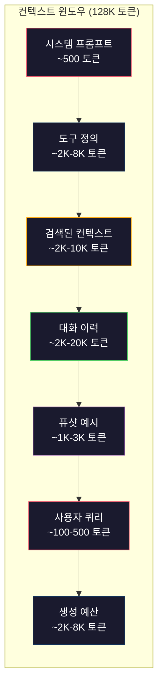
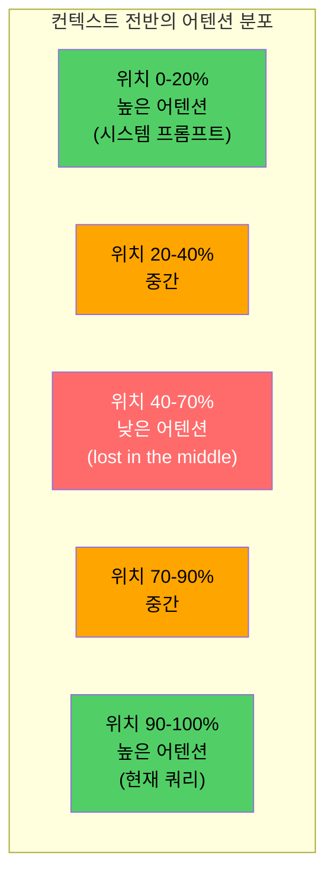
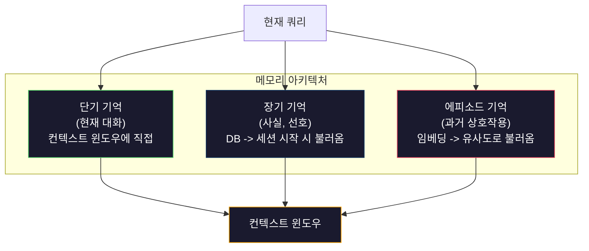

# 컨텍스트 엔지니어링: 윈도우, 예산, 메모리, 검색

> 🇰🇷 이 문서는 한국어 번역본입니다(ELI5 스타일). 원문: [en.md](en.md)

> 프롬프트 엔지니어링은 그 일부에 불과합니다. 컨텍스트 엔지니어링이 게임 전체입니다. 프롬프트는 여러분이 타이핑하는 문자열이지만, 컨텍스트는 모델의 윈도우에 들어가는 모든 것입니다. 시스템 지시문, 검색된 문서, 도구 정의, 대화 이력, 퓨샷(few-shot) 예시, 그리고 프롬프트 자체까지요. 2026년 최고의 AI 엔지니어는 컨텍스트 엔지니어입니다. 무엇을 넣고, 무엇을 뺄지, 어떤 순서로 배치할지 결정하는 사람들이죠.

**유형:** Build
**언어:** Python
**선수 지식:** 페이즈 10(LLM from Scratch), 페이즈 11 레슨 01-02
**시간:** 약 90분
**관련:** 페이즈 11 · 15(프롬프트 캐싱) — 캐시 친화적 레이아웃은 컨텍스트 엔지니어링의 확장입니다. 페이즈 5 · 28(롱 컨텍스트 평가)에서는 NIAH/RULER로 lost-in-the-middle을 측정하는 방법을 다룹니다.

## 학습 목표

- 컨텍스트 윈도우의 모든 구성 요소(시스템 프롬프트, 도구, 이력, 검색된 문서, 생성 여유분)에 걸쳐 토큰 예산을 계산할 수 있습니다
- 컨텍스트 윈도우 관리 전략, 즉 대화 이력에 대한 절단(truncation), 요약, 슬라이딩 윈도우를 구현할 수 있습니다
- 모델의 어텐션이 가장 관련성 높은 정보에 실리도록 컨텍스트 구성 요소의 우선순위를 정하고 배열할 수 있습니다
- 쿼리 유형과 사용 가능한 윈도우 공간에 따라 토큰을 동적으로 할당하는 컨텍스트 어셈블러를 만들 수 있습니다

## 문제 상황

Claude Opus 4.7은 200K 토큰 윈도우(베타에서는 1M)를 갖습니다. GPT-5는 400K, Gemini 3 Pro는 2M, Llama 4는 10M을 내세웁니다. 채워 넣기 전까지는 이 숫자들이 엄청나게 들립니다.

코딩 어시스턴트의 실제 예시를 들어 보겠습니다. 시스템 프롬프트 500토큰. 도구 50개의 정의 8,000토큰. 검색된 문서 4,000토큰. 대화 이력(10턴) 6,000토큰. 현재 사용자 쿼리 200토큰. 생성 예산(최대 출력) 4,000토큰. 합계 22,700토큰입니다. 128K 윈도우의 18%에 불과하죠.

하지만 어텐션 비용은 컨텍스트 길이에 선형으로 비례하지 않습니다. 128K 토큰 컨텍스트를 다루는 모델은 이차식 어텐션 비용을 치릅니다(기본 트랜스포머에서는 O(n^2)이지만, 대부분의 프로덕션 모델은 효율적인 어텐션 변형을 사용합니다). 더 중요한 것은 검색 정확도가 떨어진다는 점입니다. "Needle in a Haystack"(건초 더미에서 바늘 찾기) 테스트는 모델이 긴 컨텍스트 중간에 놓인 정보를 찾는 데 어려움을 겪는다는 것을 보여줍니다. Liu et al.(2023)의 연구에 따르면 LLM은 긴 컨텍스트의 시작과 끝에 있는 정보는 거의 완벽하게 찾아내지만, 중간(컨텍스트의 40-70% 지점)에 놓인 정보는 정확도가 10-20% 떨어집니다. 이 "lost-in-the-middle"(중간에서 길을 잃음) 효과는 모델마다 정도가 다르지만 현재의 모든 아키텍처에 영향을 줍니다.

실용적인 교훈은 이렇습니다. 200K 토큰을 쓸 수 있다는 것과 200K 토큰을 쓰는 것이 효과적이라는 것은 다릅니다. 신중하게 선별한 10K 토큰 컨텍스트가 그냥 쏟아부은 100K 토큰 컨텍스트를 능가하는 경우가 흔합니다. 컨텍스트 엔지니어링은 컨텍스트 윈도우 안에서 신호 대 잡음비를 최대화하는 기술입니다.

윈도우에 넣는 모든 토큰은 더 관련성 높은 정보를 실을 수 있었던 토큰 자리를 대신 차지합니다. 쓸모없는 도구 정의 하나하나, 낡은 대화 턴 하나하나, 질문에 답하지 않는 검색 텍스트 조각 하나하나가 모델을 조금씩 더 못하게 만듭니다.

## 개념

### 컨텍스트 윈도우는 희소 자원입니다

컨텍스트 윈도우를 디스크가 아니라 RAM이라고 생각하세요. 빠르고 직접 접근할 수 있지만 용량이 제한적입니다. 모든 것을 담을 수는 없고, 선택해야 합니다.



각 구성 요소는 공간을 두고 경쟁합니다. 도구 정의를 더 넣으면 대화 이력 자리가 줄어듭니다. 검색된 컨텍스트를 더 넣으면 퓨샷 예시 자리가 줄어듭니다. 컨텍스트 엔지니어링은 이 예산을 배분해 작업 성능을 최대화하는 기술입니다.

### Lost-in-the-Middle (중간을 놓치는 현상)

컨텍스트 엔지니어링에서 가장 중요한 실증적 발견입니다. 모델은 컨텍스트의 시작과 끝에 있는 정보에 더 잘 주의를 기울입니다. 중간에 있는 정보는 어텐션 점수가 낮아져 무시되기 쉽습니다.

Liu et al.(2023)이 이를 체계적으로 실험했습니다. 관련 문서 한 장을 관련 없는 문서 20장 사이의 다양한 위치에 놓고 답변 정확도를 측정했습니다. 관련 문서가 맨 앞이나 맨 뒤에 있을 때 정확도는 85-90%였습니다. 중간(20개 중 10번째)에 있을 때는 60-70%로 떨어졌습니다.

엔지니어링에 주는 직접적인 시사점은 다음과 같습니다:

- 가장 중요한 정보를 맨 앞에 둡니다(시스템 프롬프트, 핵심 지시문)
- 현재 쿼리와 가장 관련성 높은 컨텍스트를 맨 뒤에 둡니다(최근성 편향이 도움이 됩니다)
- 컨텍스트의 중간은 우선순위가 가장 낮은 구역으로 취급합니다
- 중간에 넣을 수밖에 없는 정보라면 핵심 요점을 끝에 한 번 더 반복합니다



### 컨텍스트 구성 요소

**시스템 프롬프트**: 페르소나, 제약 조건, 행동 규칙을 정합니다. 맨 앞에 오며 턴이 바뀌어도 유지됩니다. Claude Code는 도구 정의와 행동 지침을 포함한 시스템 프롬프트에 약 6,000토큰을 씁니다. 간결하게 유지하세요. 시스템 프롬프트의 모든 단어는 API 호출 때마다 반복됩니다.

**도구 정의**: 도구 하나당 50-200토큰이 추가됩니다(이름, 설명, 파라미터 스키마). 도구 50개가 각 150토큰이면 대화가 시작되기도 전에 7,500토큰입니다. 동적 도구 선택, 즉 현재 쿼리와 관련 있는 도구만 포함하면 이 비용을 60-80% 줄일 수 있습니다.

**검색된 컨텍스트**: 벡터 데이터베이스에서 가져온 문서, 검색 결과, 파일 내용입니다. 검색 품질이 응답 품질을 직접 좌우합니다. 나쁜 검색은 검색을 안 하는 것보다 나쁩니다. 잡음으로 윈도우를 채우고 모델을 적극적으로 잘못된 길로 이끌기 때문입니다.

**대화 이력**: 지금까지의 모든 사용자 메시지와 어시스턴트 응답입니다. 대화 길이에 선형적으로 늘어납니다. 턴당 200토큰이면 50턴 대화의 이력은 10,000토큰입니다. 그 대부분은 현재 쿼리와 무관합니다.

**퓨샷 예시**: 원하는 동작을 보여주는 입력/출력 쌍입니다. 잘 고른 예시 2-3개가 수천 토크나 되는 지시문보다 출력 품질을 더 끌어올릴 때가 많습니다. 다만 공간을 차지합니다.

**생성 예산**: 모델의 응답을 위해 남겨두는 토큰입니다. 윈도우를 가득 채우면 모델이 답변할 공간이 없어집니다. 생성용으로 최소 2,000-4,000토큰은 남겨두세요.

### 컨텍스트 압축 전략

**이력 요약**: 이전 턴을 전부 그대로 두는 대신, 주기적으로 대화를 요약합니다. "우리는 X를 논의했고, Y로 결정했으며, 사용자는 Z를 원합니다"라는 100토큰짜리 요약이 2,000토큰을 차지하던 10턴을 대체합니다. 이력이 임계값(예: 5,000토큰)을 넘으면 요약을 실행하세요.

**관련성 필터링**: 검색된 문서 각각을 현재 쿼리와 비교해 점수를 매기고, 임계값 아래 문서는 버립니다. 10개 청크를 검색했는데 3개만 관련 있다면 나머지 7개는 버리세요. 무난한 청크 10개보다 매우 관련성 높은 청크 3개가 낫습니다.

**도구 가지치기**: 사용자 쿼리의 의도를 분류하고 그 의도와 관련 있는 도구만 포함합니다. 코드 질문에 캘린더 도구는 필요 없습니다. 일정 잡기 질문에 파일 시스템 도구는 필요 없습니다. 이렇게 하면 도구 정의를 8,000토큰에서 1,000토큰으로 줄일 수 있습니다.

**재귀적 요약**: 아주 긴 문서는 단계적으로 요약합니다. 먼저 섹션별로 요약하고, 그 요약들을 다시 요약합니다. 50페이지짜리 문서가 핵심 요점을 담은 500토큰 요약본이 됩니다.

### 메모리 시스템

컨텍스트 엔지니어링은 세 가지 시간 범위를 다룹니다.

**단기 기억**: 현재 대화입니다. 컨텍스트 윈도우에 직접 저장되고 턴마다 늘어납니다. 요약과 절단으로 관리합니다.

**장기 기억**: 대화를 넘어 유지되는 사실과 선호입니다. "사용자는 TypeScript를 선호한다", "프로젝트는 PostgreSQL을 사용한다" 같은 것들이죠. 데이터베이스에 저장하고 세션 시작 때 불러옵니다. Claude Code는 CLAUDE.md 파일에 저장하고, ChatGPT는 메모리 기능에 저장합니다.

**에피소드 기억**: 관련이 있을 수 있는 구체적인 과거 상호작용입니다. "지난 화요일에 auth 모듈의 비슷한 문제를 디버깅했다" 같은 것이죠. 임베딩으로 저장하고, 현재 대화가 과거 에피소드와 맞아떨어질 때 불러옵니다.



### 동적 컨텍스트 조립

핵심 통찰은 이것입니다. 쿼리마다 필요한 컨텍스트가 다릅니다. 고정된 시스템 프롬프트 + 고정된 도구 + 고정된 이력은 낭비입니다. 최고의 시스템은 쿼리마다 컨텍스트를 동적으로 조립합니다.

1. 쿼리 의도를 분류합니다
2. 관련 있는 도구를 고릅니다(모든 도구가 아니라)
3. 관련 있는 문서를 검색합니다(고정된 목록이 아니라)
4. 관련 있는 이력 턴을 포함합니다(전체 이력이 아니라)
5. 작업 유형에 맞는 퓨샷 예시를 추가합니다
6. 중요도 순으로 배열합니다. 결정적인 것은 맨 앞, 중요한 것은 맨 뒤, 선택적인 것은 중간에

이것이 그저 좋은 AI 애플리케이션과 훌륭한 AI 애플리케이션을 가르는 차이입니다. 모델은 같습니다. 컨텍스트가 승부를 가릅니다.

```figure
lost-in-the-middle
```

## 만들어 보기

### 단계 1: 토큰 카운터

측정할 수 없는 것은 예산을 세울 수 없습니다. 간단한 토큰 카운터를 만듭니다(정확한 수치는 토크나이저에 따라 달라지므로 공백 분할로 근사합니다).

```python
import json
import numpy as np
from collections import OrderedDict

def count_tokens(text):
    if not text:
        return 0
    return int(len(text.split()) * 1.3)

def count_tokens_json(obj):
    return count_tokens(json.dumps(obj))
```

### 단계 2: 컨텍스트 예산 관리자

핵심 추상화입니다. 예산 관리자는 각 구성 요소가 몇 토큰을 쓰는지 추적하고 한도를 강제합니다.

```python
class ContextBudget:
    def __init__(self, max_tokens=128000, generation_reserve=4000):
        self.max_tokens = max_tokens
        self.generation_reserve = generation_reserve
        self.available = max_tokens - generation_reserve
        self.allocations = OrderedDict()

    def allocate(self, component, content, max_tokens=None):
        tokens = count_tokens(content)
        if max_tokens and tokens > max_tokens:
            words = content.split()
            target_words = int(max_tokens / 1.3)
            content = " ".join(words[:target_words])
            tokens = count_tokens(content)

        used = sum(self.allocations.values())
        if used + tokens > self.available:
            allowed = self.available - used
            if allowed <= 0:
                return None, 0
            words = content.split()
            target_words = int(allowed / 1.3)
            content = " ".join(words[:target_words])
            tokens = count_tokens(content)

        self.allocations[component] = tokens
        return content, tokens

    def remaining(self):
        used = sum(self.allocations.values())
        return self.available - used

    def utilization(self):
        used = sum(self.allocations.values())
        return used / self.max_tokens

    def report(self):
        total_used = sum(self.allocations.values())
        lines = []
        lines.append(f"Context Budget Report ({self.max_tokens:,} token window)")
        lines.append("-" * 50)
        for component, tokens in self.allocations.items():
            pct = tokens / self.max_tokens * 100
            bar = "#" * int(pct / 2)
            lines.append(f"  {component:<25} {tokens:>6} tokens ({pct:>5.1f}%) {bar}")
        lines.append("-" * 50)
        lines.append(f"  {'Used':<25} {total_used:>6} tokens ({total_used/self.max_tokens*100:.1f}%)")
        lines.append(f"  {'Generation reserve':<25} {self.generation_reserve:>6} tokens")
        lines.append(f"  {'Remaining':<25} {self.remaining():>6} tokens")
        return "\n".join(lines)
```

### 단계 3: Lost-in-the-Middle 재배치

재배치 전략을 구현합니다. 가장 중요한 항목은 맨 앞과 맨 뒤로, 가장 덜 중요한 항목은 중간으로 보냅니다.

```python
def reorder_lost_in_middle(items, scores):
    paired = sorted(zip(scores, items), reverse=True)
    sorted_items = [item for _, item in paired]

    if len(sorted_items) <= 2:
        return sorted_items

    first_half = sorted_items[::2]
    second_half = sorted_items[1::2]
    second_half.reverse()

    return first_half + second_half

def score_relevance(query, documents):
    query_words = set(query.lower().split())
    scores = []
    for doc in documents:
        doc_words = set(doc.lower().split())
        if not query_words:
            scores.append(0.0)
            continue
        overlap = len(query_words & doc_words) / len(query_words)
        scores.append(round(overlap, 3))
    return scores
```

### 단계 4: 대화 이력 압축기

오래된 대화 턴을 요약해 토큰 예산을 되찾습니다.

```python
class ConversationManager:
    def __init__(self, max_history_tokens=5000):
        self.turns = []
        self.summaries = []
        self.max_history_tokens = max_history_tokens

    def add_turn(self, role, content):
        self.turns.append({"role": role, "content": content})
        self._compress_if_needed()

    def _compress_if_needed(self):
        total = sum(count_tokens(t["content"]) for t in self.turns)
        if total <= self.max_history_tokens:
            return

        while total > self.max_history_tokens and len(self.turns) > 4:
            old_turns = self.turns[:2]
            summary = self._summarize_turns(old_turns)
            self.summaries.append(summary)
            self.turns = self.turns[2:]
            total = sum(count_tokens(t["content"]) for t in self.turns)

    def _summarize_turns(self, turns):
        parts = []
        for t in turns:
            content = t["content"]
            if len(content) > 100:
                content = content[:100] + "..."
            parts.append(f"{t['role']}: {content}")
        return "Previous: " + " | ".join(parts)

    def get_context(self):
        parts = []
        if self.summaries:
            parts.append("[Conversation Summary]")
            for s in self.summaries:
                parts.append(s)
        parts.append("[Recent Conversation]")
        for t in self.turns:
            parts.append(f"{t['role']}: {t['content']}")
        return "\n".join(parts)

    def token_count(self):
        return count_tokens(self.get_context())
```

### 단계 5: 동적 도구 선택기

현재 쿼리와 관련 있는 도구만 포함합니다. 의도를 분류한 다음 걸러냅니다.

```python
TOOL_REGISTRY = {
    "read_file": {
        "description": "Read contents of a file",
        "tokens": 120,
        "categories": ["code", "files"],
    },
    "write_file": {
        "description": "Write content to a file",
        "tokens": 150,
        "categories": ["code", "files"],
    },
    "search_code": {
        "description": "Search for patterns in codebase",
        "tokens": 130,
        "categories": ["code"],
    },
    "run_command": {
        "description": "Execute a shell command",
        "tokens": 140,
        "categories": ["code", "system"],
    },
    "create_calendar_event": {
        "description": "Create a new calendar event",
        "tokens": 180,
        "categories": ["calendar"],
    },
    "list_emails": {
        "description": "List recent emails",
        "tokens": 160,
        "categories": ["email"],
    },
    "send_email": {
        "description": "Send an email message",
        "tokens": 200,
        "categories": ["email"],
    },
    "web_search": {
        "description": "Search the web for information",
        "tokens": 140,
        "categories": ["research"],
    },
    "query_database": {
        "description": "Run a SQL query on the database",
        "tokens": 170,
        "categories": ["code", "data"],
    },
    "generate_chart": {
        "description": "Generate a chart from data",
        "tokens": 190,
        "categories": ["data", "visualization"],
    },
}

def classify_intent(query):
    query_lower = query.lower()

    intent_keywords = {
        "code": ["code", "function", "bug", "error", "file", "implement", "refactor", "debug", "test"],
        "calendar": ["meeting", "schedule", "calendar", "appointment", "event"],
        "email": ["email", "mail", "send", "inbox", "message"],
        "research": ["search", "find", "what is", "how does", "explain", "look up"],
        "data": ["data", "query", "database", "chart", "graph", "analytics", "sql"],
    }

    scores = {}
    for intent, keywords in intent_keywords.items():
        score = sum(1 for kw in keywords if kw in query_lower)
        if score > 0:
            scores[intent] = score

    if not scores:
        return ["code"]

    max_score = max(scores.values())
    return [intent for intent, score in scores.items() if score >= max_score * 0.5]

def select_tools(query, token_budget=2000):
    intents = classify_intent(query)
    relevant = {}
    total_tokens = 0

    for name, tool in TOOL_REGISTRY.items():
        if any(cat in intents for cat in tool["categories"]):
            if total_tokens + tool["tokens"] <= token_budget:
                relevant[name] = tool
                total_tokens += tool["tokens"]

    return relevant, total_tokens
```

### 단계 6: 전체 컨텍스트 조립 파이프라인

모든 것을 연결합니다. 쿼리가 주어지면 최적의 컨텍스트를 동적으로 조립합니다.

```python
class ContextEngine:
    def __init__(self, max_tokens=128000, generation_reserve=4000):
        self.budget = ContextBudget(max_tokens, generation_reserve)
        self.conversation = ConversationManager(max_history_tokens=5000)
        self.system_prompt = (
            "You are a helpful AI assistant. You have access to tools for "
            "code editing, file management, web search, and data analysis. "
            "Use the appropriate tools for each task. Be concise and accurate."
        )
        self.knowledge_base = [
            "Python 3.12 introduced type parameter syntax for generic classes using bracket notation.",
            "The project uses PostgreSQL 16 with pgvector for embedding storage.",
            "Authentication is handled by Supabase Auth with JWT tokens.",
            "The frontend is built with Next.js 15 using the App Router.",
            "API rate limits are set to 100 requests per minute per user.",
            "The deployment pipeline uses GitHub Actions with Docker multi-stage builds.",
            "Test coverage must be above 80% for all new modules.",
            "The codebase follows the repository pattern for data access.",
        ]

    def assemble(self, query):
        self.budget = ContextBudget(self.budget.max_tokens, self.budget.generation_reserve)

        system_content, _ = self.budget.allocate("system_prompt", self.system_prompt, max_tokens=1000)

        tools, tool_tokens = select_tools(query, token_budget=2000)
        tool_text = json.dumps(list(tools.keys()))
        tool_content, _ = self.budget.allocate("tools", tool_text, max_tokens=2000)

        relevance = score_relevance(query, self.knowledge_base)
        threshold = 0.1
        relevant_docs = [
            doc for doc, score in zip(self.knowledge_base, relevance)
            if score >= threshold
        ]

        if relevant_docs:
            doc_scores = [s for s in relevance if s >= threshold]
            reordered = reorder_lost_in_middle(relevant_docs, doc_scores)
            doc_text = "\n".join(reordered)
            doc_content, _ = self.budget.allocate("retrieved_context", doc_text, max_tokens=3000)

        history_text = self.conversation.get_context()
        if history_text.strip():
            history_content, _ = self.budget.allocate("conversation_history", history_text, max_tokens=5000)

        query_content, _ = self.budget.allocate("user_query", query, max_tokens=500)

        return self.budget

    def chat(self, query):
        self.conversation.add_turn("user", query)
        budget = self.assemble(query)
        response = f"[Response to: {query[:50]}...]"
        self.conversation.add_turn("assistant", response)
        return budget


def run_demo():
    print("=" * 60)
    print("  Context Engineering Pipeline Demo")
    print("=" * 60)

    engine = ContextEngine(max_tokens=128000, generation_reserve=4000)

    print("\n--- Query 1: Code task ---")
    budget = engine.chat("Fix the bug in the authentication module where JWT tokens expire too early")
    print(budget.report())

    print("\n--- Query 2: Research task ---")
    budget = engine.chat("What is the best approach for implementing vector search in PostgreSQL?")
    print(budget.report())

    print("\n--- Query 3: After conversation history builds up ---")
    for i in range(8):
        engine.conversation.add_turn("user", f"Follow-up question number {i+1} about the implementation details of the system")
        engine.conversation.add_turn("assistant", f"Here is the response to follow-up {i+1} with technical details about the architecture")

    budget = engine.chat("Now implement the changes we discussed")
    print(budget.report())

    print("\n--- Tool Selection Examples ---")
    test_queries = [
        "Fix the bug in auth.py",
        "Schedule a meeting with the team for Tuesday",
        "Show me the database query performance stats",
        "Search for best practices on error handling",
    ]

    for q in test_queries:
        tools, tokens = select_tools(q)
        intents = classify_intent(q)
        print(f"\n  Query: {q}")
        print(f"  Intents: {intents}")
        print(f"  Tools: {list(tools.keys())} ({tokens} tokens)")

    print("\n--- Lost-in-the-Middle Reordering ---")
    docs = ["Doc A (most relevant)", "Doc B (somewhat relevant)", "Doc C (least relevant)",
            "Doc D (relevant)", "Doc E (moderately relevant)"]
    scores = [0.95, 0.60, 0.20, 0.80, 0.50]
    reordered = reorder_lost_in_middle(docs, scores)
    print(f"  Original order: {docs}")
    print(f"  Scores:         {scores}")
    print(f"  Reordered:      {reordered}")
    print(f"  (Most relevant at start and end, least relevant in middle)")
```

## 활용하기

### 하네스가 관리하는 컨텍스트

Claude Code는 계층화된 방식으로 컨텍스트를 관리합니다. 시스템 프롬프트에는 행동 규칙과 도구 정의(약 6K 토큰)가 들어 있습니다. 파일을 열면 그 내용이 컨텍스트로 주입됩니다. 검색하면 결과가 추가됩니다. 오래된 대화 턴은 요약됩니다. CLAUDE.md는 세션을 넘어 유지되는 장기 기억을 제공합니다.

핵심 엔지니어링 결정은 이것입니다. Claude Code는 여러분의 코드베이스 전체를 컨텍스트에 쏟아 넣지 않습니다. 필요할 때 관련 파일을 불러옵니다. 이것이 실전에서의 컨텍스트 엔지니어링입니다.

### 동적 컨텍스트 로딩

Cursor는 코드베이스 전체를 임베딩으로 인덱싱합니다. 쿼리를 입력하면 벡터 유사도로 가장 관련성 높은 파일과 코드 블록을 찾아냅니다. 컨텍스트 윈도우에는 그 조각들만 들어갑니다. 50만 줄짜리 코드베이스가 가장 관련성 높은 5-10개 코드 블록으로 압축되는 것입니다.

패턴은 이렇습니다. 전부 임베딩하고, 필요할 때 검색하고, 중요한 것만 포함합니다.

### 어시스턴트의 장기 기억

ChatGPT는 사용자의 선호와 사실을 장기 기억으로 저장합니다. 대화가 시작될 때마다 관련 기억을 찾아 시스템 프롬프트에 넣습니다. "사용자는 Python을 선호한다"는 5토큰이면 충분하지만, 대화마다 반복해야 하는 수백 토크의 지시문을 아껴 줍니다.

### 컨텍스트 엔지니어링으로서의 RAG

RAG(검색 증강 생성)는 형식화된 컨텍스트 엔지니어링입니다. 지식을 모델의 가중치(학습)나 시스템 프롬프트(정적 컨텍스트)에 우겨 넣는 대신, 쿼리 시점에 관련 문서를 찾아 컨텍스트 윈도우에 주입합니다. 청킹, 임베딩, 검색, 리랭킹을 아우르는 RAG 파이프라인 전체가 단 하나의 문제를 풀기 위해 존재합니다. 올바른 정보를 컨텍스트 윈도우에 넣는 문제입니다.

## 산출물

이 레슨은 `outputs/prompt-context-optimizer.md`를 만들어 냅니다. 컨텍스트 조립 전략을 점검하고 최적화를 제안하는 재사용 가능한 프롬프트입니다. 시스템 프롬프트, 도구 개수, 평균 이력 길이, 검색 전략을 넣어 주면 토큰 낭비를 찾아내고 개선점을 제안합니다.

또한 `outputs/skill-context-engineering.md`도 만듭니다. 작업 유형, 컨텍스트 윈도우 크기, 지연 시간 예산을 바탕으로 컨텍스트 조립 파이프라인을 설계하는 의사결정 프레임워크입니다.

## 연습 문제

1. ContextBudget 클래스에 "토큰 낭비 탐지기"를 추가하세요. 예산의 30%를 넘게 쓰는 구성 요소를 표시하고, 구성 요소 유형별로 맞춤 압축 전략(이력 요약, 도구 가지치기, 문서 리랭킹)을 제안해야 합니다.

2. 검색된 컨텍스트에 시맨틱 중복 제거를 구현하세요. 검색된 두 문서가 80% 이상 비슷하면(단어 겹침 또는 임베딩의 코사인 유사도 기준) 점수가 높은 쪽만 남깁니다. 이렇게 해서 얼마나 토큰 예산을 회수할 수 있는지 측정해 보세요.

3. "컨텍스트 리플레이" 도구를 만들어 보세요. 대화 기록이 주어지면 ContextEngine으로 재생하면서 예산 배분이 턴마다 어떻게 바뀌는지 시각화합니다. 구성 요소별 토큰 사용량을 시간 순으로 그래프로 그리고, 컨텍스트 압축이 시작되는 턴을 찾아보세요.

4. 우선순위 기반 도구 선택기를 구현하세요. 포함/제외 이분법 대신 각 도구에 현재 쿼리에 대한 관련도 점수를 매기고, 도구 예산이 바닥날 때까지 관련도 내림차순으로 도구를 포함합니다. 도구 5, 10, 20, 50개를 포함했을 때 작업 성능을 비교해 보세요.

5. 다중 전략 컨텍스트 압축기를 만들어 보세요. 세 가지 압축 전략(절단, 요약, 핵심 문장 추출)을 구현해 20개 문서 세트로 벤치마크합니다. 압축률과 정보 보존 사이의 트레이드오프를 측정하세요(압축본에 여전히 쿼리의 답이 들어 있나요?).

## 핵심 용어

| 용어 | 사람들이 말하는 표현 | 실제 의미 |
|------|----------------|----------------------|
| 컨텍스트 윈도우 | "모델이 얼마나 읽을 수 있나" | 모델이 한 번의 순전파에서 처리하는 최대 토큰 수(입력 + 출력). GPT-5는 400K, Claude Opus 4.7은 200K(베타 1M), Gemini 3 Pro는 2M |
| 컨텍스트 엔지니어링 | "고급 프롬프트 엔지니어링" | 무엇을 컨텍스트 윈도우에 넣을지, 어떤 순서로, 어떤 우선순위로 넣을지 결정하는 기술. 검색, 압축, 도구 선택, 메모리 관리를 모두 포괄합니다 |
| Lost-in-the-middle | "모델이 중간 내용을 잊어버린다" | LLM은 컨텍스트의 시작과 끝에 더 잘 주의를 기울이고, 중간에 놓인 정보는 정확도가 10-20% 떨어진다는 실증적 발견 |
| 토큰 예산 | "남은 토큰이 얼마인가" | 컨텍스트 윈도우 용량을 구성 요소별(시스템 프롬프트, 도구, 이력, 검색, 생성) 한도로 명시적으로 배분한 것 |
| 동적 컨텍스트 | "그때그때 불러오기" | 의도 분류, 관련 도구 선택, 검색 결과에 따라 쿼리마다 컨텍스트 윈도우를 다르게 조립하는 것 |
| 이력 요약 | "대화 압축하기" | 오래된 대화 턴을 그대로 두지 않고 간결한 요약으로 바꿔 핵심 정보는 지키면서 토큰 비용을 줄이는 것 |
| 도구 가지치기 | "관련 있는 도구만 포함하기" | 쿼리 의도를 분류해 맞는 도구 정의만 포함해 도구 토큰 비용을 60-80% 줄이는 것 |
| 장기 기억 | "세션을 넘어 기억하기" | 데이터베이스에 저장했다가 세션 시작 때 불러오는 사실과 선호. CLAUDE.md, ChatGPT 메모리 같은 시스템 |
| 에피소드 기억 | "특정 과거 사건 기억하기" | 과거 상호작용을 임베딩으로 저장하고, 현재 쿼리가 과거 대화와 비슷할 때 불러오는 것 |
| 생성 예산 | "답변을 위한 공간" | 모델의 출력을 위해 남겨두는 토큰. 컨텍스트가 윈도우를 가득 채우면 모델이 응답할 공간이 없어집니다 |

## 더 읽을거리

- [Liu et al., 2023 -- "Lost in the Middle: How Language Models Use Long Contexts"](https://arxiv.org/abs/2307.03172) -- 위치별 어텐션 차이에 관한 결정적 연구. 모델이 긴 컨텍스트 중간의 정보를 다루는 데 어려움을 겪음을 보여줍니다
- [Anthropic의 Contextual Retrieval 블로그 글](https://www.anthropic.com/news/contextual-retrieval) -- Anthropic이 컨텍스트 인식 청크 검색에 접근하는 방법. 검색 실패를 49% 줄였습니다
- [Simon Willison의 "Context Engineering"](https://simonwillison.net/2025/Jun/27/context-engineering/) -- 이 분야에 이름을 붙이고 프롬프트 엔지니어링과 구분한 블로그 글
- [LangChain RAG 문서](https://python.langchain.com/docs/tutorials/rag/) -- 컨텍스트 엔지니어링 패턴으로서의 RAG(검색 증강 생성) 실전 구현
- [Greg Kamradt의 Needle in a Haystack 테스트](https://github.com/gkamradt/LLMTest_NeedleInAHaystack) -- 주요 모델 전반에서 위치별 검색 실패를 드러낸 벤치마크
- [Pope et al., "Efficiently Scaling Transformer Inference" (2022)](https://arxiv.org/abs/2211.05102) -- 컨텍스트 길이가 메모리와 지연 시간을 좌우하는 이유, 그리고 KV 캐시, MQA, GQA가 예산 계산을 어떻게 바꾸는지 설명합니다.
- [Agrawal et al., "SARATHI: Efficient LLM Inference by Piggybacking Decodes with Chunked Prefills" (2023)](https://arxiv.org/abs/2308.16369) -- 추론의 두 단계가 긴 프롬프트에서 TTFT 비용은 높이고 TPOT은 낮게 만드는 방식. 컨텍스트 패킹 트레이드오프의 실체입니다.
- [Ainslie et al., "GQA: Training Generalized Multi-Query Transformer Models from Multi-Head Checkpoints" (EMNLP 2023)](https://arxiv.org/abs/2305.13245) -- 그룹화 쿼리 어텐션 논문. 품질 손실 없이 프로덕션 디코더의 KV 메모리를 8배 줄였습니다.
