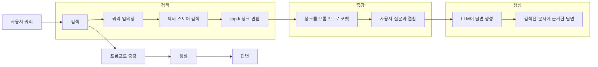
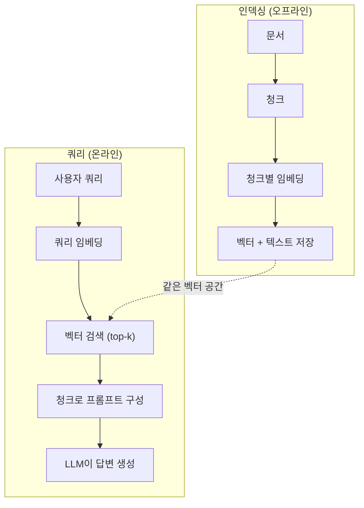

# RAG(검색 증강 생성)

> 🇰🇷 이 문서는 한국어 번역본입니다(ELI5 스타일). 원문: [en.md](en.md)

> LLM은 학습 컷오프 시점까지의 지식만 갖고 있습니다. 여러분 회사의 문서, 여러분의 코드베이스, 지난주 회의 노트에 대해서는 아무것도 모릅니다. RAG는 관련 문서를 찾아 프롬프트에 채워 넣는 방식으로 이 문제를 해결합니다. 프로덕션 AI에서 가장 널리 배치된 패턴입니다. 이 과정에서 단 하나의 것을 만든다면, RAG 파이프라인을 만드세요.

**유형:** Build
**언어:** Python
**선수 지식:** 페이즈 10(LLM from Scratch), 페이즈 11 레슨 01-05
**시간:** 약 90분
**관련:** 페이즈 5 · 23(RAG를 위한 청킹 전략)은 여섯 가지 청킹 알고리즘과 각각이 유리한 상황을 다룹니다. 페이즈 5 · 22(임베딩 모델 심층 탐구)는 임베더 선택용입니다. 페이즈 11 · 07(고급 RAG)은 하이브리드 검색, 리랭킹, 쿼리 변환을 다룹니다.

## 학습 목표

- 문서 로딩, 청킹, 임베딩, 벡터 저장, 검색, 생성으로 이어지는 완전한 RAG 파이프라인을 만들 수 있습니다
- 벡터 데이터베이스(ChromaDB, FAISS, Pinecone)를 올바르게 인덱싱해 시맨틱 검색을 구현할 수 있습니다
- 지식 기반 애플리케이션에서 파인튜닝보다 RAG가 선호되는 이유(비용, 최신성, 출처 추적)를 설명할 수 있습니다
- 검색 지표(정밀도, 재현율)와 생성 지표(충실도, 관련성)로 RAG 품질을 평가할 수 있습니다

## 문제 상황

회사 챗봇을 만들었습니다. 고객이 "엔터프라이즈 플랜의 환불 정책이 어떻게 되나요?"라고 묻습니다. LLM은 전형적인 SaaS 환불 정책에 대한 일반적인 답을 내놓습니다. 하지만 200페이지짜리 사내 위키 깊숙이 묻힌 실제 정책은 엔터프라이즈 고객에게 60일 환불 기간과 일할 계산된 환불을 보장합니다. LLM은 이 문서를 본 적이 없습니다. 학습하지 않은 것을 알 수는 없는 것입니다.

파인튜닝이 한 가지 해법입니다. LLM을 가져와 사내 문서로 훈련하고 업데이트된 모델을 배포합니다. 동작은 하지만 심각한 문제가 있습니다. 파인튜닝은 컴퓨팅 비용이 수천 달러 들어갑니다. 문서가 바뀌는 순간 모델은 낡아집니다. 모델이 어떤 출처에서 답을 가져왔는지 알 방법이 없습니다. 그리고 회사가 다음 달에 다른 제품 라인을 인수하면 또 파인튜닝해야 합니다.

RAG가 다른 해법입니다. 모델은 그대로 둡니다. 질문이 들어오면 문서 저장소에서 관련 단락을 찾고, 질문 앞에 프롬프트로 붙여 넣은 다음, 그 단락들을 컨텍스트로 삼아 답하게 합니다. 문서 저장소는 몇 분 만에 업데이트할 수 있습니다. 어떤 문서가 검색됐는지 정확히 볼 수 있습니다. 모델 자체는 절대 바뀌지 않습니다. 이것이 RAG가 프로덕션의 지배적 패턴인 이유입니다. 더 저렴하고, 더 최신이며, 감사하기 쉽고, 어떤 LLM과도 동작합니다.

## 개념

### RAG 패턴

패턴 전체가 네 단계에 담깁니다:



쿼리 -> 검색 -> 프롬프트 증강 -> 생성입니다. 모든 RAG 시스템이 이 패턴을 따릅니다. 프로덕션 RAG 시스템 사이의 차이는 각 단계의 디테일에 있습니다. 어떻게 청크하고, 어떻게 임베딩하고, 어떻게 검색하고, 어떻게 프롬프트를 만드느냐죠.

### RAG가 파인튜닝을 이기는 이유

| 항목 | 파인튜닝 | RAG |
|---------|------------|-----|
| 비용 | 훈련 1회당 $1,000-$100,000+ | 쿼리당 $0.01-$0.10(임베딩 + LLM) |
| 최신성 | 재훈련 전까지 낡음 | 문서 재인덱싱으로 몇 분 만에 업데이트 |
| 감사 가능성 | 답변을 출처로 추적 불가 | 검색된 단락을 정확히 보여줄 수 있음 |
| 환각 | 여전히 자유롭게 환각함 | 검색된 문서에 근거함 |
| 데이터 프라이버시 | 훈련 데이터가 가중치에 내장됨 | 문서가 여러분의 벡터 스토어에 머묾 |

파인튜닝은 모델의 가중치를 영구적으로 바꿉니다. RAG는 모델의 컨텍스트를 일시적으로 바꿉니다. 대부분의 애플리케이션에서 원하는 것은 일시적인 컨텍스트입니다.

파인튜닝이 이기는 유일한 경우는 이것입니다. 프롬프트만으로는 만들 수 없는 특정한 스타일, 어조, 추론 패턴을 모델에 갖게 해야 할 때죠. 사실 지식 검색에는 RAG가 항상 이깁니다.

### 임베딩 모델

임베딩 모델은 텍스트를 밀집 벡터로 바꿉니다. 비슷한 텍스트는 이 고차원 공간에서 가까운 벡터를 만들어 냅니다. "How do I reset my password?"와 "I need to change my password"는 겹치는 단어가 거의 없는데도 거의 동일한 벡터를 만듭니다. "The cat sat on the mat"은 아주 다른 벡터를 만들고요.

주요 임베딩 모델(2026년 라인업 — 전체 분석은 페이즈 5 · 22 참조):

| 모델 | 차원 | 제공사 | 비고 |
|-------|-----------|----------|-------|
| text-embedding-3-small | 1536 (마트료시카) | OpenAI | 대부분의 사용 사례에서 최고의 가성비 |
| text-embedding-3-large | 3072 (마트료시카) | OpenAI | 더 높은 정확도, 256/512/1024로 절단 가능 |
| Gemini Embedding 2 | 3072 (마트료시카) | Google | 최상위 MTEB 검색 성능, 8K 컨텍스트 |
| voyage-4 | 1024/2048 (마트료시카) | Voyage AI | 도메인 변형(코드, 금융, 법률) |
| Cohere embed-v4 | 1024 (마트료시카) | Cohere | 강력한 다국어, 128K 컨텍스트 |
| BGE-M3 | 1024 (dense + sparse + ColBERT) | BAAI (오픈 웨이트) | 하나의 모델로 세 가지 뷰 |
| Qwen3-Embedding | 4096 (마트료시카) | Alibaba (오픈 웨이트) | 오픈 웨이트 중 최고 검색 점수 |
| all-MiniLM-L6-v2 | 384 | 오픈 웨이트 (Sentence Transformers) | 프로토타이핑 베이스라인 |

이 레슨에서는 TF-IDF로 간단한 임베딩을 직접 만듭니다. 프로덕션 시스템이 TF-IDF를 쓰기 때문이 아니라, 개념을 구체적으로 만들어 주기 때문입니다. 텍스트가 들어가고 벡터가 나오며, 비슷한 텍스트는 비슷한 벡터를 만듭니다.

### 벡터 유사도

벡터가 두 개 주어졌을 때 유사도는 어떻게 측정할까요? 세 가지 옵션이 있습니다:

**코사인 유사도**: 두 벡터 사이 각도의 코사인입니다. -1(정반대)에서 1(동일)까지의 값을 가집니다. 크기는 무시하고 방향만 봅니다. RAG의 기본 선택입니다.

```
cosine_sim(a, b) = dot(a, b) / (||a|| * ||b||)
```

**내적(dot product)**: 날 내적 값입니다. 벡터가 클수록 점수가 높아집니다. 크기가 정보를 담고 있을 때(긴 문서가 더 관련성 높을 수 있을 때) 유용합니다.

```
dot(a, b) = sum(a_i * b_i)
```

**L2(유클리드) 거리**: 벡터 공간에서의 직선 거리입니다. 거리가 작을수록 더 비슷합니다. 크기 차이에 민감합니다.

```
L2(a, b) = sqrt(sum((a_i - b_i)^2))
```

코사인 유사도가 표준입니다. 크기로 정규화하기 때문에 길이가 다른 문서도 잘 처리합니다. 누군가 "벡터 검색"이라고 하면 거의 항상 코사인 유사도를 의미합니다.

### 청킹 전략

문서는 단일 벡터로 임베딩하기에는 너무 깁니다. 50페이지짜리 PDF는 수십 가지 주제를 담고 있어서 형편없는 임베딩이 나올 수 있습니다. 대신 문서를 청크로 나누고 각 청크를 따로 임베딩합니다.

**고정 크기 청킹**: N토큰마다 자릅니다. 단순하고 예측 가능합니다. 50토큰 겹침을 둔 512토큰 청크라면 청크 1은 토큰 0-511, 청크 2는 토큰 462-973이 되는 식입니다. 겹침 덕분에 운 나쁜 경계에서 문장을 자르는 일을 막을 수 있습니다.

**시맨틱 청킹**: 자연스러운 경계에서 자릅니다. 단락, 섹션, 마크다운 헤더 등이죠. 각 청크가 하나의 응집된 의미 단위가 됩니다. 구현은 더 복잡하지만 더 나은 검색을 만들어 냅니다.

**재귀적 청킹**: 가장 큰 경계(섹션 헤더)부터 자르기를 시도합니다. 섹션이 여전히 너무 크면 단락 경계에서 자릅니다. 단락도 여전히 크면 문장 경계에서 자릅니다. LangChain의 RecursiveCharacterTextSplitter 방식이며 실전에서 잘 동작합니다.

청크 크기는 사람들이 생각하는 것보다 중요합니다:

- 너무 작으면(64-128토큰): 각 청크에 문맥이 없습니다. "it"이 무엇을 가리키는지 모르면 "지난 분기에 15% 증가했다"는 말은 아무 의미가 없습니다.
- 너무 크면(2048토큰 이상): 각 청크가 여러 주제를 다뤄 관련성이 희석됩니다. 매출 데이터를 검색했는데 매출이 10%뿐이고 인원이 90%인 청크가 나올 수 있습니다.
- 최적점(256-512토큰): 스스로 완결될 만큼 충분한 문맥을 갖추면서도 관련성 있게 집중되어 있습니다.

대부분의 프로덕션 RAG 시스템은 50토큰 겹침을 둔 256-512토큰 청크를 사용합니다. Anthropic의 RAG 가이드라인도 이 범위를 권장합니다.

### 벡터 데이터베이스

임베딩을 만들었다면 저장하고 검색할 곳이 필요합니다. 옵션은 다음과 같습니다:

| 데이터베이스 | 유형 | 적합한 용도 |
|----------|------|----------|
| FAISS | 라이브러리(인프로세스) | 프로토타이핑, 중소 규모 데이터셋 |
| Chroma | 경량 DB | 로컬 개발, 소규모 배포 |
| Pinecone | 관리형 서비스 | 운영 부담 없는 프로덕션 |
| Weaviate | 오픈소스 DB | 셀프 호스팅 프로덕션 |
| pgvector | Postgres 확장 | 이미 Postgres를 쓰는 경우 |
| Qdrant | 오픈소스 DB | 고성능 셀프 호스팅 |

이 레슨에서는 간단한 인메모리 벡터 스토어를 만듭니다. 벡터를 리스트에 저장하고 브루트 포스 코사인 유사도 검색을 수행합니다. FAISS의 flat 인덱스와 동등한 것입니다. 느려지기 전까지 대략 10만 벡터까지 버틸 수 있습니다. 프로덕션 시스템은 HNSW 같은 근사 최근접 이웃(ANN) 알고리즘을 사용해 수백만 벡터를 밀리초 만에 검색합니다.

### 전체 파이프라인



인덱싱 단계는 문서당 한 번(또는 문서가 업데이트될 때) 실행됩니다. 쿼리 단계는 모든 사용자 요청마다 실행됩니다. 프로덕션에서 인덱싱은 수백만 문서를 몇 시간에 걸쳐 처리할 수 있습니다. 쿼리는 1초 안에 응답해야 합니다.

### 실제 수치

대부분의 프로덕션 RAG 시스템은 이 파라미터를 사용합니다:

- **k = 5~10**: 쿼리당 검색되는 청크 수
- **청크 크기 = 256~512토큰**, 50토큰 겹침
- **컨텍스트 예산**: 쿼리당 검색된 내용 2,500-5,000토큰
- **전체 프롬프트**: 약 8,000-16,000토큰(시스템 프롬프트 + 검색된 청크 + 대화 이력 + 사용자 쿼리)
- **임베딩 차원**: 모델에 따라 384-3072
- **인덱싱 처리량**: API 임베딩 기준 초당 100-1,000문서
- **쿼리 지연 시간**: 검색 50-200ms, 생성 500-3000ms

```figure
rag-chunking
```

## 만들어 보기

### 단계 1: 문서 청킹

```python
def chunk_text(text, chunk_size=200, overlap=50):
    words = text.split()
    chunks = []
    start = 0
    while start < len(words):
        end = start + chunk_size
        chunk = " ".join(words[start:end])
        chunks.append(chunk)
        start += chunk_size - overlap
    return chunks
```

### 단계 2: TF-IDF 임베딩

간단한 임베딩 함수를 만듭니다. TF-IDF(Term Frequency-Inverse Document Frequency, 단어 빈도-역문서 빈도)는 신경망 임베딩은 아니지만 단어의 중요도를 담아 텍스트를 벡터로 바꿉니다. 문서에서 자주 등장하는 단어는 TF가 높고, 코퍼스 전체에서 드문 단어는 IDF가 높습니다. 그 곱으로 만든 벡터에서는 중요하고 특징적인 단어가 높은 값을 갖습니다.

```python
import math
from collections import Counter

def build_vocabulary(documents):
    vocab = set()
    for doc in documents:
        vocab.update(doc.lower().split())
    return sorted(vocab)

def compute_tf(text, vocab):
    words = text.lower().split()
    count = Counter(words)
    total = len(words)
    return [count.get(word, 0) / total for word in vocab]

def compute_idf(documents, vocab):
    n = len(documents)
    idf = []
    for word in vocab:
        doc_count = sum(1 for doc in documents if word in doc.lower().split())
        idf.append(math.log((n + 1) / (doc_count + 1)) + 1)
    return idf

def tfidf_embed(text, vocab, idf):
    tf = compute_tf(text, vocab)
    return [t * i for t, i in zip(tf, idf)]
```

### 단계 3: 코사인 유사도 검색

```python
def cosine_similarity(a, b):
    dot = sum(x * y for x, y in zip(a, b))
    norm_a = math.sqrt(sum(x * x for x in a))
    norm_b = math.sqrt(sum(x * x for x in b))
    if norm_a == 0 or norm_b == 0:
        return 0.0
    return dot / (norm_a * norm_b)

def search(query_embedding, stored_embeddings, top_k=5):
    scores = []
    for i, emb in enumerate(stored_embeddings):
        sim = cosine_similarity(query_embedding, emb)
        scores.append((i, sim))
    scores.sort(key=lambda x: x[1], reverse=True)
    return scores[:top_k]
```

### 단계 4: 프롬프트 구성

바로 여기서 RAG의 "증강"이 일어납니다. 검색된 청크를 가져와 프롬프트로 만들고, 제공된 컨텍스트를 바탕으로 답하라고 LLM에 요청합니다.

```python
def build_rag_prompt(query, retrieved_chunks):
    context = "\n\n---\n\n".join(
        f"[Source {i+1}]\n{chunk}"
        for i, chunk in enumerate(retrieved_chunks)
    )
    return f"""Answer the question based ONLY on the following context.
If the context doesn't contain enough information, say "I don't have enough information to answer that."

Context:
{context}

Question: {query}

Answer:"""
```

### 단계 5: 완전한 RAG 파이프라인

```python
class RAGPipeline:
    def __init__(self):
        self.chunks = []
        self.embeddings = []
        self.vocab = []
        self.idf = []

    def index(self, documents):
        all_chunks = []
        for doc in documents:
            all_chunks.extend(chunk_text(doc))
        self.chunks = all_chunks
        self.vocab = build_vocabulary(all_chunks)
        self.idf = compute_idf(all_chunks, self.vocab)
        self.embeddings = [
            tfidf_embed(chunk, self.vocab, self.idf)
            for chunk in all_chunks
        ]

    def query(self, question, top_k=5):
        query_emb = tfidf_embed(question, self.vocab, self.idf)
        results = search(query_emb, self.embeddings, top_k)
        retrieved = [(self.chunks[i], score) for i, score in results]
        prompt = build_rag_prompt(
            question, [chunk for chunk, _ in retrieved]
        )
        return prompt, retrieved
```

### 단계 6: 생성(시뮬레이션)

프로덕션에서는 바로 여기서 LLM API를 호출합니다. 이 레슨에서는 검색된 컨텍스트에서 가장 관련성 높은 문장을 뽑아내는 방식으로 생성을 흉내 냅니다.

```python
def simple_generate(prompt, retrieved_chunks):
    query_words = set(prompt.lower().split("question:")[-1].split())
    best_sentence = ""
    best_score = 0
    for chunk in retrieved_chunks:
        for sentence in chunk.split("."):
            sentence = sentence.strip()
            if not sentence:
                continue
            words = set(sentence.lower().split())
            overlap = len(query_words & words)
            if overlap > best_score:
                best_score = overlap
                best_sentence = sentence
    return best_sentence if best_sentence else "I don't have enough information."
```

## 활용하기

실제 임베딩 모델과 LLM을 쓰면 코드는 거의 안 바뀝니다:

```python
from openai import OpenAI

client = OpenAI()

def embed(text):
    response = client.embeddings.create(
        model="text-embedding-3-small",
        input=text
    )
    return response.data[0].embedding

def generate(prompt):
    response = client.chat.completions.create(
        model="gpt-4o-mini",
        messages=[{"role": "user", "content": prompt}],
        temperature=0
    )
    return response.choices[0].message.content
```

Anthropic으로 하면:

```python
import anthropic

client = anthropic.Anthropic()

def generate(prompt):
    response = client.messages.create(
        model="claude-sonnet-5",
        max_tokens=1024,
        messages=[{"role": "user", "content": prompt}]
    )
    return response.content[0].text
```

파이프라인은 같습니다. 임베딩 함수를 바꾸고, 생성 함수를 바꾸면 됩니다. 검색 로직, 청킹, 프롬프트 구성은 어떤 모델을 쓰든 완전히 동일합니다.

대규모 벡터 저장에는 브루트 포스 검색을 제대로 된 벡터 데이터베이스로 교체하세요:

```python
import chromadb

client = chromadb.Client()
collection = client.create_collection("my_docs")

collection.add(
    documents=chunks,
    ids=[f"chunk_{i}" for i in range(len(chunks))]
)

results = collection.query(
    query_texts=["What is the refund policy?"],
    n_results=5
)
```

Chroma는 임베딩을 내부적으로 처리하고(기본값으로 all-MiniLM-L6-v2 사용) 벡터를 로컬 데이터베이스에 저장합니다. 같은 패턴, 다른 배관입니다.

## 산출물

이 레슨은 다음을 만들어 냅니다:
- `outputs/prompt-rag-architect.md` -- 특정 사용 사례를 위한 RAG 시스템을 설계하는 프롬프트
- `outputs/skill-rag-pipeline.md` -- 에이전트에게 RAG 파이프라인 구축과 디버깅을 가르치는 스킬

## 연습 문제

1. TF-IDF 임베딩을 간단한 단어 가방(bag-of-words) 방식으로 바꿔 보세요(이진값: 단어가 있으면 1, 없으면 0). 샘플 문서에서 검색 품질을 비교하세요. TF-IDF가 희귀 단어에 더 높은 가중치를 주기 때문에 더 좋은 성능을 낼 것입니다.

2. 청크 크기 실험: 같은 문서 세트에서 50, 100, 200, 500 단어를 시도해 보세요. 각 크기마다 같은 5개 쿼리를 실행해 상위 3개 안에 관련 청크가 몇 개나 들어오는지 세어 보세요. 검색 품질이 정점에 달하는 최적점을 찾아보세요.

3. 각 청크에 메타데이터(출처 문서 이름, 청크 위치)를 추가하세요. 프롬프트 템플릿에 출처 표기를 넣어 LLM이 출처를 인용하게 만들어 보세요.

4. 간단한 평가를 구현해 보세요. 질문-답변 쌍 10개가 주어지면 각 질문을 RAG 파이프라인에 통과시키고, 검색된 청크 중 답을 포함하는 비율을 측정합니다. 이것이 k에서의 검색 재현율입니다.

5. 대화를 인식하는 RAG 파이프라인을 만들어 보세요. 마지막 3번의 교환 이력을 유지하고 검색된 청크와 함께 프롬프트에 넣습니다. 가격을 물어본 뒤 "엔터프라이즈는요?" 같은 후속 질문으로 테스트해 보세요.

## 핵심 용어

| 용어 | 사람들이 말하는 표현 | 실제 의미 |
|------|----------------|----------------------|
| RAG | "여러분의 문서를 읽는 AI" | 관련 문서를 검색하고 프롬프트에 붙여 넣은 다음, 그 문서에 근거한 답변을 생성합니다 |
| 임베딩 | "텍스트를 숫자로 변환" | 비슷한 의미가 비슷한 벡터를 만드는 텍스트의 밀집 벡터 표현 |
| 벡터 데이터베이스 | "AI를 위한 검색 엔진" | 벡터 저장과 유사도 기반 최근접 이웃 탐색에 최적화된 데이터 저장소 |
| 청킹 | "문서를 조각내기" | 문서를 더 작은 조각(보통 256-512토큰)으로 나눠 각각 독립적으로 임베딩하고 검색할 수 있게 하는 것 |
| 코사인 유사도 | "두 벡터가 얼마나 비슷한가" | 두 벡터 사이 각도의 코사인. 1 = 같은 방향, 0 = 직교, -1 = 정반대 |
| Top-k 검색 | "가장 잘 맞는 k개 가져오기" | 벡터 스토어에서 쿼리와 가장 비슷한 k개 청크를 반환합니다 |
| 컨텍스트 윈도우 | "LLM이 볼 수 있는 텍스트의 양" | LLM이 단일 요청에서 처리할 수 있는 최대 토큰 수. 검색된 청크는 이 안에 들어가야 합니다 |
| 증강 생성 | "주어진 컨텍스트로 답하기" | 학습된 지식에만 의존하지 않고 검색된 문서를 컨텍스트로 삼아 응답을 생성하는 것 |
| TF-IDF | "단어 중요도 점수" | 단어 빈도 곱 역문서 빈도. 코퍼스 안에서 단어가 얼마나 특징적인지에 따라 가중치를 줍니다 |
| 인덱싱 | "검색을 위해 문서 준비하기" | 쿼리 시점에 검색할 수 있도록 문서를 청크하고 임베딩해 저장하는 오프라인 과정 |

## 더 읽을거리

- Lewis et al., "Retrieval-Augmented Generation for Knowledge-Intensive NLP Tasks" (2020) -- Facebook AI Research의 원조 RAG 논문. 검색 후 생성 패턴을 형식화했습니다
- Anthropic의 RAG 문서 (docs.anthropic.com) -- 청크 크기, 프롬프트 구성, 평가에 관한 실전 가이드라인
- Pinecone Learning Center, "What is RAG?" -- 프로덕션 고려사항과 함께 RAG 파이프라인을 그림으로 명쾌하게 설명합니다
- Sentence-BERT: Reimers & Gurevych (2019) -- all-MiniLM 임베딩 모델의 근간 논문. 시맨틱 유사도를 위한 바이 인코더 훈련법을 보여줍니다
- [Karpukhin et al., "Dense Passage Retrieval for Open-Domain Question Answering" (EMNLP 2020)](https://arxiv.org/abs/2004.04906) -- DPR 논문. 밀집 바이 인코더 검색이 오픈 도메인 QA에서 BM25를 이김을 증명하고 현대 RAG 검색기의 패턴을 정했습니다.
- [LlamaIndex 핵심 개념](https://docs.llamaindex.ai/en/stable/getting_started/concepts.html) -- RAG 파이프라인을 만들 때 알아야 할 핵심 개념. 데이터 로더, 노드 파서, 인덱스, 검색기, 응답 합성기입니다.
- [LangChain RAG 튜토리얼](https://python.langchain.com/docs/tutorials/rag/) -- 정반대 성향의 오케스트레이터. 같은 검색 후 생성 패턴을 runnables 체인 관점에서 봅니다.
