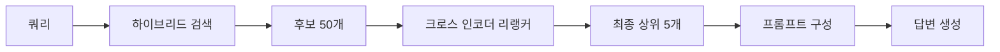
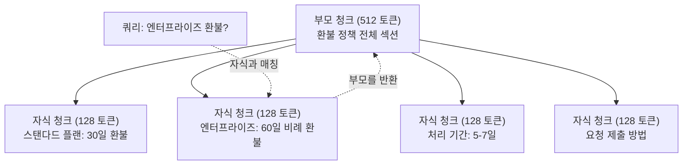
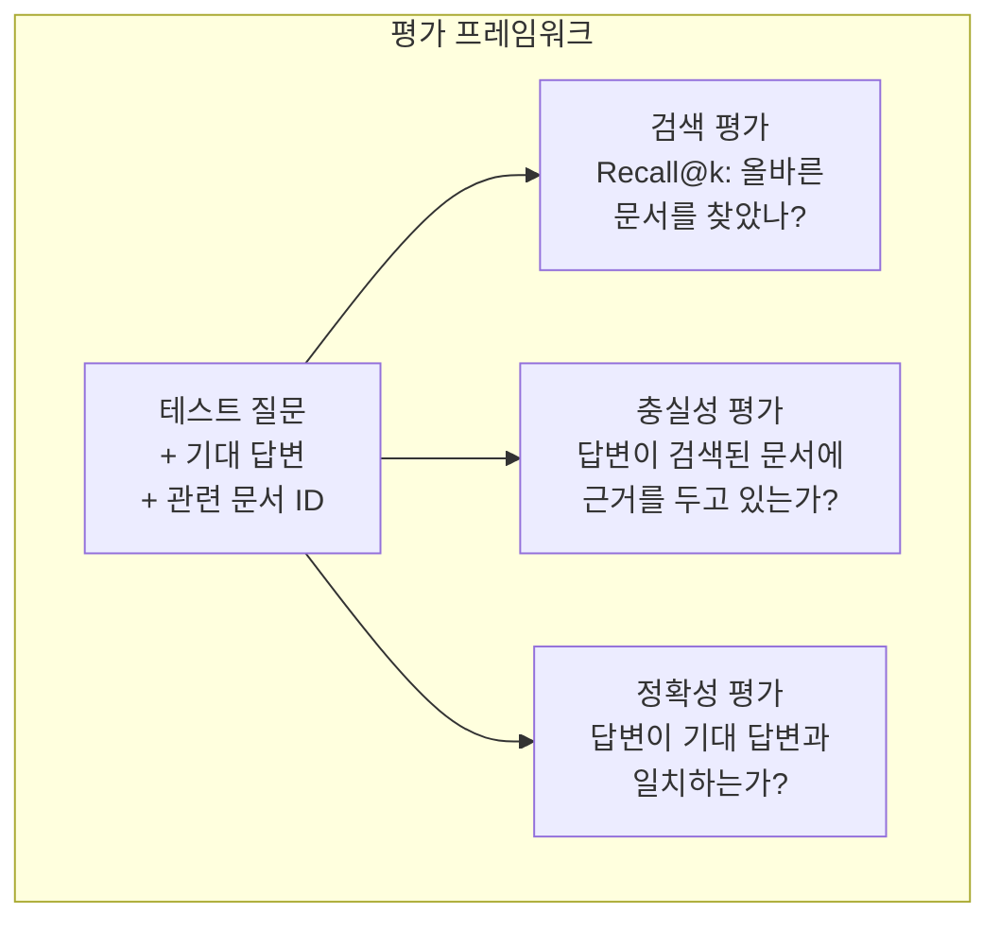

> 🇰🇷 이 문서는 한국어 번역본입니다(ELI5 스타일). 원문: [en.md](en.md)

# 고급 RAG(청킹, 리랭킹, 하이브리드 검색)

> 기본 RAG(검색 증강 생성)는 가장 비슷한 청크 상위 k개를 가져옵니다. 간단한 질문에는 잘 동작하지만, 여러 단계를 거쳐 답을 찾아야 하는 추론(multi-hop reasoning), 모호한 질의, 대규모 문서 집합에서는 금방 무너집니다. 고급 RAG의 필요성은 10개 문서에서만 되는 데모와 1,000만 개에서도 되는 시스템의 차이에 있습니다.

**유형:** 빌드
**언어:** Python
**선수 지식:** 페이즈 11, 레슨 06 (RAG)
**시간:** 약 90분
**관련:** 페이즈 5 · 23(RAG를 위한 청킹 전략)에서는 재귀적, 시맨틱, 문장 단위, 부모-문서, late chunking, 문맥 기반 검색(contextual retrieval) 등 6가지 청킹 알고리즘을 모두 다루고 Vectara/Anthropic 벤치마크도 함께 제시합니다. 이 레슨은 그 위에 하이브리드 검색, 리랭킹, 쿼리 변환을 얹습니다.

## 학습 목표

- 문서 구조와 문맥을 보존하는 고급 청킹 전략(시맨틱, 재귀, 부모-자식)을 구현합니다
- BM25 키워드 매칭과 시맨틱 벡터 검색, 크로스 인코더(cross-encoder) 리랭커를 결합한 하이브리드 검색 파이프라인을 구축합니다
- 모호하거나 복잡한 질문에서 검색 품질을 높이는 쿼리 변환 기법(HyDE, 멀티 쿼리, 스텝백)을 적용합니다
- 흔한 RAG 실패 사례(엉뚱한 청크 검색, 컨텍스트에 정답이 없음, 멀티홉 추론 붕괴)를 진단하고 고칩니다

## 문제 상황

레슨 06에서 기본 RAG 파이프라인을 만들었습니다. 작은 코퍼스(문서 집합)의 단순한 질문에는 잘 동작하죠. 이제 이런 질문들을 넣어 보세요.

**모호한 질의**: "지난 분기 매출이 얼마였나요?" 시맨틱 검색은 매출 전략, 매출 전망, CFO의 매출 성장 견해에 관한 청크들을 돌려줍니다. 모두 "매출(revenue)"이라는 단어와 의미상 비슷하지만, 어느 것도 실제 숫자는 담고 있지 않습니다. 정답 청크에는 "2025년 3분기 실적 4,720만 달러"라고 적혀 있는데 "매출(revenue)" 대신 "실적(earnings)"이라는 단어를 씁니다. 임베딩 모델은 "3분기 실적은 4,720만 달러였습니다"보다 "매출 전략"이 질의에 더 가깝다고 판단하는 거죠.

**멀티홉 질문**: "고객 만족도 점수가 가장 많이 오른 팀은 어디인가요?" 이 질문은 각 팀의 만족도 점수를 찾고, 비교하고, 최댓값을 골라야 합니다. 정답 전체를 담은 청크는 하나도 없습니다. 정보가 팀 보고서 여기저기에 흩어져 있어요.

**대규모 코퍼스 문제**: 청크가 200만 개 있다고 합시다. 정답은 1,847,293번 청크에 들어 있습니다. top-5 검색은 14번, 89,201번, 1,200,000번, 44번, 901,333번 청크를 가져옵니다. 임베딩 공간에서는 가까워 보이지만 어느 것도 정답을 담고 있지 않습니다. 이 정도 규모에서는 근사 최근접 이웃 검색(approximate nearest neighbor search)의 오차가 커져서 관련 결과가 top-k 밖으로 밀려납니다.

기본 RAG가 실패하는 이유는 벡터 유사도가 관련성(relevance)과 같지 않기 때문입니다. 청크가 질의와 의미상 비슷해도 그 질의에 답하는 데 유용하리라는 보장은 없습니다. 고급 RAG는 네 가지 기법으로 이 문제를 다룹니다: 하이브리드 검색(키워드 매칭 추가), 리랭킹(후보를 더 정밀하게 점수화), 쿼리 변환(검색 전에 질의부터 고침), 더 나은 청킹(올바른 세밀도로 검색).

## 개념

### 하이브리드 검색: 시맨틱 + 키워드

시맨틱 검색(벡터 유사도)은 의미를 파악하는 데 강합니다. "구독을 취소하고 싶어요"라는 질의가 겹치는 단어가 하나도 없는데도 "플랜 해지 절차"와 맞물리죠. 하지만 정확한 일치는 놓칩니다. 임베딩 모델이 노이즈로 취급하면 "오류 코드 E-4021" 질의가 실제로 "E-4021"을 담고 있는 청크와 매칭되지 못할 수도 있습니다.

키워드 검색(BM25)은 정반대입니다. 정확한 일치에 탁월하죠. "E-4021"은 완벽하게 매칭됩니다. 하지만 문서가 "terminate your plan(플랜 해지)"이라고 쓰고 있다면 "cancel my subscription(구독 취소)"은 결과가 0건입니다.

하이브리드 검색은 두 방식을 모두 돌린 뒤 결과를 합칩니다.

**BM25**(Best Matching 25)는 표준 키워드 검색 알고리즘입니다. 1990년대부터 검색 엔진의 근간을 이뤄 왔습니다. 수식은 다음과 같습니다.

```
BM25(q, d) = sum over terms t in q:
    IDF(t) * (tf(t,d) * (k1 + 1)) / (tf(t,d) + k1 * (1 - b + b * |d| / avgdl))
```

여기서 tf(t,d)는 문서 d에서 용어 t가 나타난 빈도, IDF(t)는 역문서 빈도, |d|는 문서 길이, avgdl은 평균 문서 길이입니다. k1은 용어 빈도 포화 정도를(기본값 1.2), b는 길이 정규화를(기본값 0.75) 조절합니다.

쉽게 말하면: BM25는 질의 용어(특히 희귀한 용어)를 담고 있는 문서에 더 높은 점수를 주지만, 같은 용어가 반복될수록 점수 증가폭은 줄어듭니다. "매출"이라는 단어가 50번 나오는 문서가 1번 나오는 문서보다 50배 더 관련성이 높지는 않다는 뜻이죠.

### 상호 순위 융합(RRF, Reciprocal Rank Fusion)

순위 목록이 두 개 있습니다. 하나는 벡터 검색에서, 하나는 BM25에서 나왔죠. 어떻게 합칠까요? 상호 순위 융합(RRF)이 표준적인 방법입니다.

```
RRF_score(d) = sum over rankings R:
    1 / (k + rank_R(d))
```

여기서 k는 상위 결과가 점수를 독차지하지 못하도록 막는 상수입니다(보통 60).

벡터 검색 1위, BM25 5위인 문서는: 1/(60+1) + 1/(60+5) = 0.0164 + 0.0154 = 0.0318

벡터 검색 3위, BM25 2위인 문서는: 1/(60+3) + 1/(60+2) = 0.0159 + 0.0161 = 0.0320

RRF는 두 신호의 균형을 자연스럽게 맞춥니다. 두 목록에서 모두 순위가 높은 문서가 최고 점수를 받습니다. 한쪽에서 1위지만 다른 목록에는 없는 문서는 중간 정도 점수를 받죠. 점수가 아니라 순위를 사용하기 때문에 두 시스템 간 점수 분포 차이가 영향을 주지 않는, 튼튼한 방식입니다.

### 리랭킹

검색(retrieval, 벡터든 키워드든 하이브리드든)은 빠르지만 정밀하지는 않습니다. 바이인코더(bi-encoder)를 사용하는데, 질의와 각 문서를 따로따로 임베딩한 다음 비교합니다. 임베딩은 한 번만 계산해 캐시하므로 수백만 개 문서로 확장할 수 있습니다.

리랭킹은 크로스 인코더를 사용합니다. 질의와 후보 문서를 한 모델에 같이 넣고 관련성 점수를 뽑아내죠. 모델이 두 텍스트를 동시에 보기 때문에 둘 사이의 세밀한 상호작용까지 포착할 수 있습니다. 바이인코더가 놓친 "3분기 실적이 얼마였나요?"라는 질의와 "3분기 실적 4,720만 달러"라는 청크의 연결을 크로스 인코더는 알아차릴 수 있습니다.

트레이드오프도 있습니다. 크로스 인코더는 질의-문서 쌍을 함께 처리하기 때문에 바이인코더보다 100~1000배 느립니다. 백만 개 문서의 크로스 인코더 점수를 미리 계산해 둘 수는 없죠. 해결책: 더 큰 후보 집합(하이브리드 검색의 top-50)을 먼저 뽑고, 크로스 인코더로 리랭킹해서 최종 top-5를 고르는 것입니다.



흔히 쓰는 리랭킹 모델(2026년 라인업):
- Cohere Rerank 3.5: 관리형(managed) API, 다국어 지원, 섞인 코퍼스에서 리콜(recall) 향상 폭이 가장 큼
- Voyage rerank-2.5: 관리형 API, 호스티드 옵션 중 지연 시간이 가장 짧음
- Jina-Reranker-v2 Multilingual: 오픈 웨이트, 100개 이상 언어
- bge-reranker-v2-m3: 오픈 웨이트, 든든한 베이스라인
- cross-encoder/ms-marco-MiniLM-L-6-v2: 오픈 웨이트, 프로토타이핑용으로 CPU에서도 구동
- ColBERTv2 / Jina-ColBERT-v2: late-interaction 다중 벡터 리랭커 -- 점수 계산 시 O(문서 수)가 아니라 O(토큰 수)

### 쿼리 변환

문제는 검색이 아니라 쿼리 자체일 때도 있습니다. "그, 새 정책 변경 관련해서 그거 뭐였죠?" 같은 질문은 최악의 검색 쿼리입니다. 구체적인 용어가 하나도 없고 임베딩도 뭉뚱그려집니다. 이런 쿼리로는 어떤 검색 시스템도 올바른 문서를 찾을 수 없습니다.

**쿼리 재작성**: 사용자의 쿼리를 더 나은 검색 쿼리로 바꿔 씁니다. LLM으로 할 수 있습니다.

```
사용자: "그, 새 정책 변경 관련해서 그거 뭐였죠?"
재작성: "최근 정책 변경 사항과 업데이트"
```

**HyDE(Hypothetical Document Embeddings, 가상 문서 임베딩)**: 쿼리로 바로 검색하지 않고, 가상의 답변을 만들어 그것을 임베딩한 뒤 비슷한 실제 문서를 검색합니다.

```
쿼리: "엔터프라이즈 환불 정책이 어떻게 되나요?"
가상 답변: "엔터프라이즈 고객은 구매 후 60일 이내에 전액 환불을
받을 수 있습니다. 환불 금액은 남은 구독 기간에 비례해 계산되며,
영업일 기준 5~7일 내에 처리됩니다."
```

가상 답변을 임베딩하고 그와 비슷한 실제 문서를 검색합니다. 직관적인 이유는 이렇습니다. 임베딩 공간에서 가상 답변은 원래 질문보다 실제 답변에 더 가깝게 자리합니다. 질문과 답변은 언어 구조가 다르거든요. 가상 답변을 생성함으로써 임베딩 안에서 "질문 공간"과 "답변 공간" 사이의 간극을 메우는 셈입니다.

HyDE는 검색 전에 LLM 호출을 한 번 더 추가합니다. 지연 시간이 500~2000ms 늘어나요. 원시 쿼리에서 검색 품질이 나쁠 때는 그만한 값어치가 있습니다.

### 부모-자식 청킹

일반 청킹은 트레이드오프를 강요합니다. 정밀한 검색을 위해선 작은 청크, 충분한 컨텍스트를 위해선 큰 청크가 필요하죠. 부모-자식 청킹은 이 트레이드오프를 없애 버립니다.

검색용으로는 작은 청크(128 토큰)를 인덱싱합니다. 작은 청크가 검색되면 프롬프트에는 그 부모 청크(512 토큰)를 돌려주는 거죠. 작은 청크가 쿼리와 정확히 맞물리고, 부모 청크가 LLM이 좋은 답을 만들기에 충분한 컨텍스트를 제공합니다.



"엔터프라이즈 환불?" 쿼리는 자식 청크 C2와 정확히 맞습니다. 하지만 프롬프트에는 처리 기간과 제출 절차에 관한 주변 맥락까지 담긴 부모 청크 P 전체가 전달됩니다.

### 메타데이터 필터링

벡터 검색을 돌리기 전에 메타데이터로 코퍼스를 걸러 냅니다: 날짜, 출처, 카테고리, 작성자, 언어. 검색 공간이 줄어들고 관련 없는 결과도 막을 수 있습니다.

"지난달 보안 정책에서 뭐가 바뀌었나요?"라는 질문은 보안 카테고리의 최근 30일 문서만 검색해야 합니다. 메타데이터 필터링이 없으면 코퍼스 전체를 뒤지게 되고, 우연히 의미상 비슷한 2년 된 보안 문서가 검색될 수도 있습니다.

프로덕션(운영 환경) RAG 시스템은 각 청크와 함께 메타데이터(출처 문서, 생성 날짜, 카테고리, 작성자, 버전)를 저장합니다. 벡터 데이터베이스는 유사도 검색 전에 메타데이터로 사전 필터링(pre-filtering)을 지원하며, 대규모에서 성능을 내는 데 필수적입니다.

### 평가

RAG 시스템을 만들었습니다. 제대로 동작하는지 어떻게 알까요? 지표 세 가지입니다.

**검색 관련성(Recall@k)**: 관련 문서를 미리 알고 있는 테스트 질문 집합에서, 관련 문서가 top-k 결과에 등장하는 비율이 얼마인가요? 어떤 질문의 정답이 47번 청크에 있다면, top-5에 47번 청크가 나타나는지 확인하는 식입니다.

**충실성(faithfulness)**: 생성된 답변이 검색된 문서에 근거를 두고 있나요? 검색된 청크는 "60일 환불 기간"이라고 하는데 모델이 "90일 환불 기간"이라고 답했다면 충실성 실패입니다. 올바른 컨텍스트를 갖고 있었는데도 모델이 환각을 일으킨 것이죠.

**답변 정확성**: 생성된 답변이 기대했던 답변과 일치하나요? 이것이 엔드투엔드(end-to-end) 지표입니다. 검색 품질과 생성 품질을 함께 반영합니다.

간단한 충실성 검사 방법: 생성된 답변의 각 주장을 하나씩 꺼내 검색된 청크에 (내용상으로) 나타나는지 확인합니다. 검색된 어느 청크에도 없는 사실이 답변에 들어 있다면 환각일 가능성이 높습니다.



```figure
agentic-rag-loop
```

## 만들어 보기

### 단계 1: BM25 구현

```python
import math
from collections import Counter

class BM25:
    def __init__(self, k1=1.2, b=0.75):
        self.k1 = k1
        self.b = b
        self.docs = []
        self.doc_lengths = []
        self.avg_dl = 0
        self.doc_freqs = {}
        self.n_docs = 0

    def index(self, documents):
        self.docs = documents
        self.n_docs = len(documents)
        self.doc_lengths = []
        self.doc_freqs = {}

        for doc in documents:
            words = doc.lower().split()
            self.doc_lengths.append(len(words))
            unique_words = set(words)
            for word in unique_words:
                self.doc_freqs[word] = self.doc_freqs.get(word, 0) + 1

        self.avg_dl = sum(self.doc_lengths) / self.n_docs if self.n_docs else 1

    def score(self, query, doc_idx):
        query_words = query.lower().split()
        doc_words = self.docs[doc_idx].lower().split()
        doc_len = self.doc_lengths[doc_idx]
        word_counts = Counter(doc_words)
        score = 0.0

        for term in query_words:
            if term not in word_counts:
                continue
            tf = word_counts[term]
            df = self.doc_freqs.get(term, 0)
            idf = math.log((self.n_docs - df + 0.5) / (df + 0.5) + 1)
            numerator = tf * (self.k1 + 1)
            denominator = tf + self.k1 * (1 - self.b + self.b * doc_len / self.avg_dl)
            score += idf * numerator / denominator

        return score

    def search(self, query, top_k=10):
        scores = [(i, self.score(query, i)) for i in range(self.n_docs)]
        scores.sort(key=lambda x: x[1], reverse=True)
        return scores[:top_k]
```

### 단계 2: 상호 순위 융합(RRF)

```python
def reciprocal_rank_fusion(ranked_lists, k=60):
    scores = {}
    for ranked_list in ranked_lists:
        for rank, (doc_id, _) in enumerate(ranked_list):
            if doc_id not in scores:
                scores[doc_id] = 0.0
            scores[doc_id] += 1.0 / (k + rank + 1)
    fused = sorted(scores.items(), key=lambda x: x[1], reverse=True)
    return fused
```

### 단계 3: 하이브리드 검색 파이프라인

```python
def hybrid_search(query, chunks, vector_embeddings, vocab, idf, bm25_index, top_k=5, fusion_k=60):
    query_emb = tfidf_embed(query, vocab, idf)
    vector_results = search(query_emb, vector_embeddings, top_k=top_k * 3)
    bm25_results = bm25_index.search(query, top_k=top_k * 3)
    fused = reciprocal_rank_fusion([vector_results, bm25_results], k=fusion_k)
    return fused[:top_k]
```

### 단계 4: 간단한 리랭커

실전에서는 크로스 인코더 모델을 쓰겠지만, 여기서는 단어 겹침, 용어 중요도, 구(句) 매칭을 이용해 질의-문서 관련성 점수를 매기는 리랭커를 만들어 봅니다.

```python
def rerank(query, candidates, chunks):
    query_words = set(query.lower().split())
    stop_words = {"the", "a", "an", "is", "are", "was", "were", "what", "how",
                  "why", "when", "where", "do", "does", "for", "of", "in", "to",
                  "and", "or", "on", "at", "by", "it", "its", "this", "that",
                  "with", "from", "be", "has", "have", "had", "not", "but"}
    query_terms = query_words - stop_words

    scored = []
    for doc_id, initial_score in candidates:
        chunk = chunks[doc_id].lower()
        chunk_words = set(chunk.split())

        term_overlap = len(query_terms & chunk_words)

        query_bigrams = set()
        q_list = [w for w in query.lower().split() if w not in stop_words]
        for i in range(len(q_list) - 1):
            query_bigrams.add(q_list[i] + " " + q_list[i + 1])
        bigram_matches = sum(1 for bg in query_bigrams if bg in chunk)

        position_boost = 0
        for term in query_terms:
            pos = chunk.find(term)
            if pos != -1 and pos < len(chunk) // 3:
                position_boost += 0.5

        rerank_score = (
            term_overlap * 1.0
            + bigram_matches * 2.0
            + position_boost
            + initial_score * 5.0
        )
        scored.append((doc_id, rerank_score))

    scored.sort(key=lambda x: x[1], reverse=True)
    return scored
```

### 단계 5: HyDE(가상 문서 임베딩)

```python
def hyde_generate_hypothesis(query):
    templates = {
        "what": "The answer to '{query}' is as follows: Based on our documentation, {topic} involves specific policies and procedures that define how the process works.",
        "how": "To address '{query}': The process involves several steps. First, you need to initiate the request. Then, the system processes it according to the defined rules.",
        "default": "Regarding '{query}': Our records indicate specific details and policies related to this topic that provide a comprehensive answer."
    }
    query_lower = query.lower()
    if query_lower.startswith("what"):
        template = templates["what"]
    elif query_lower.startswith("how"):
        template = templates["how"]
    else:
        template = templates["default"]

    topic_words = [w for w in query.lower().split()
                   if w not in {"what", "is", "the", "how", "do", "does", "a", "an",
                                "for", "of", "to", "in", "on", "at", "by", "and", "or"}]
    topic = " ".join(topic_words) if topic_words else "this topic"

    return template.format(query=query, topic=topic)


def hyde_search(query, chunks, vector_embeddings, vocab, idf, top_k=5):
    hypothesis = hyde_generate_hypothesis(query)
    hypothesis_emb = tfidf_embed(hypothesis, vocab, idf)
    results = search(hypothesis_emb, vector_embeddings, top_k)
    return results, hypothesis
```

### 단계 6: 부모-자식 청킹

```python
def create_parent_child_chunks(text, parent_size=200, child_size=50):
    words = text.split()
    parents = []
    children = []
    child_to_parent = {}

    parent_idx = 0
    start = 0
    while start < len(words):
        parent_end = min(start + parent_size, len(words))
        parent_text = " ".join(words[start:parent_end])
        parents.append(parent_text)

        child_start = start
        while child_start < parent_end:
            child_end = min(child_start + child_size, parent_end)
            child_text = " ".join(words[child_start:child_end])
            child_idx = len(children)
            children.append(child_text)
            child_to_parent[child_idx] = parent_idx
            child_start += child_size

        parent_idx += 1
        start += parent_size

    return parents, children, child_to_parent
```

### 단계 7: 충실성 평가

```python
def evaluate_faithfulness(answer, retrieved_chunks):
    answer_sentences = [s.strip() for s in answer.split(".") if len(s.strip()) > 10]
    if not answer_sentences:
        return 1.0, []

    grounded = 0
    ungrounded = []
    context = " ".join(retrieved_chunks).lower()

    for sentence in answer_sentences:
        words = set(sentence.lower().split())
        stop_words = {"the", "a", "an", "is", "are", "was", "were", "and", "or",
                      "to", "of", "in", "for", "on", "at", "by", "it", "this", "that"}
        content_words = words - stop_words
        if not content_words:
            grounded += 1
            continue

        matched = sum(1 for w in content_words if w in context)
        ratio = matched / len(content_words) if content_words else 0

        if ratio >= 0.5:
            grounded += 1
        else:
            ungrounded.append(sentence)

    score = grounded / len(answer_sentences) if answer_sentences else 1.0
    return score, ungrounded


def evaluate_retrieval_recall(queries_with_relevant, retrieval_fn, k=5):
    total_recall = 0.0
    results = []

    for query, relevant_indices in queries_with_relevant:
        retrieved = retrieval_fn(query, k)
        retrieved_indices = set(idx for idx, _ in retrieved)
        relevant_set = set(relevant_indices)
        hits = len(retrieved_indices & relevant_set)
        recall = hits / len(relevant_set) if relevant_set else 1.0
        total_recall += recall
        results.append({
            "query": query,
            "recall": recall,
            "hits": hits,
            "total_relevant": len(relevant_set)
        })

    avg_recall = total_recall / len(queries_with_relevant) if queries_with_relevant else 0
    return avg_recall, results
```

## 실전에서 쓰기

실제 크로스 인코더로 리랭킹하기:

```python
from sentence_transformers import CrossEncoder

reranker = CrossEncoder("cross-encoder/ms-marco-MiniLM-L-6-v2")

def rerank_with_cross_encoder(query, candidates, chunks, top_k=5):
    pairs = [(query, chunks[doc_id]) for doc_id, _ in candidates]
    scores = reranker.predict(pairs)
    scored = list(zip([doc_id for doc_id, _ in candidates], scores))
    scored.sort(key=lambda x: x[1], reverse=True)
    return scored[:top_k]
```

Cohere의 관리형 리랭커 사용하기:

```python
import cohere

co = cohere.Client()

def rerank_with_cohere(query, candidates, chunks, top_k=5):
    docs = [chunks[doc_id] for doc_id, _ in candidates]
    response = co.rerank(
        model="rerank-english-v3.0",
        query=query,
        documents=docs,
        top_n=top_k
    )
    return [(candidates[r.index][0], r.relevance_score) for r in response.results]
```

실제 LLM으로 HyDE 쓰기:

```python
import anthropic

client = anthropic.Anthropic()

def hyde_with_llm(query):
    response = client.messages.create(
        model="claude-sonnet-5",
        max_tokens=256,
        messages=[{
            "role": "user",
            "content": f"Write a short paragraph that would be a good answer to this question. Do not say you don't know. Just write what the answer would look like.\n\nQuestion: {query}"
        }]
    )
    return response.content[0].text
```

Weaviate로 프로덕션 하이브리드 검색 쓰기:

```python
import weaviate

client = weaviate.connect_to_local()

collection = client.collections.get("Documents")
response = collection.query.hybrid(
    query="enterprise refund policy",
    alpha=0.5,
    limit=10
)
```

alpha 파라미터가 균형을 조절합니다: 0.0은 순수 키워드(BM25), 1.0은 순수 벡터, 0.5는 동일 가중치입니다. 대부분의 프로덕션 시스템은 0.3~0.7 사이의 alpha를 사용합니다.

## 출시하기

이 레슨에서 만드는 산출물:
- `outputs/prompt-advanced-rag-debugger.md` -- RAG 품질 문제를 진단하고 고치는 프롬프트
- `outputs/skill-advanced-rag.md` -- 하이브리드 검색과 리랭킹을 갖춘 프로덕션급 RAG를 구축하기 위한 스킬

## 연습 문제

1. 샘플 문서에서 BM25, 벡터 검색, 하이브리드 검색을 비교해 보세요. 5개 테스트 쿼리 각각에 대해 어떤 방식이 1위 자리에 가장 관련성 높은 청크를 놓았는지 기록합니다. 하이브리드 검색은 5번 중 3번 이상 이겨야 합니다.

2. 메타데이터 필터를 구현해 보세요. 각 문서에 "category" 필드를 추가합니다(security, billing, api, product). 벡터 검색 전에 해당 카테고리 청크만 남도록 걸러 주세요. "What encryption is used?"로 테스트해 보고, 보안 카테고리 청크만 검색하는지 확인합니다.

3. 레슨 06의 간단한 생성 함수를 써서 완전한 HyDE 파이프라인을 만들어 보세요. 5개 테스트 쿼리 전부에서 직접 쿼리 검색과 HyDE 검색의 검색 품질(top-3 관련성)을 비교합니다. 모호한 쿼리에서는 HyDE가 결과를 개선해야 합니다.

4. 샘플 문서에 부모-자식 청킹 전략을 적용해 보세요. child_size=30, parent_size=100을 사용합니다. 자식 청크로 검색하되 프롬프트에는 부모 청크를 돌려주세요. chunk_size=50 표준 청킹과 생성된 답변을 비교합니다.

5. 평가 데이터셋을 만들어 보세요. 정답 청크를 알고 있는 질문 10개로 구성합니다. (a) 벡터 검색만, (b) BM25만, (c) 하이브리드 검색, (d) 하이브리드 + 리랭킹에 대해 Recall@3, Recall@5, Recall@10을 측정합니다. 결과를 그래프로 그리고 리랭킹이 가장 크게 도움이 되는 지점을 찾아 보세요.

## 핵심 용어

| 용어 | 흔히 부르는 말 | 실제 의미 |
|------|----------------|----------------------|
| BM25 | "키워드 검색" | 용어 빈도, 역문서 빈도, 문서 길이 정규화로 문서에 점수를 매기는 확률적 랭킹 알고리즘 |
| 하이브리드 검색 | "두 세계의 장점" | 시맨틱(벡터) 검색과 키워드(BM25) 검색을 병렬로 돌린 뒤 순위 융합으로 결과를 합치는 것 |
| 상호 순위 융합(RRF) | "순위 목록 합치기" | 여러 순위 목록에 걸쳐 문서마다 1/(k + 순위)를 더해 목록을 합치는 것 |
| 리랭킹 | "2차 점수 매기기" | 더 비싼 크로스 인코더 모델로 초기 검색의 후보 집합을 다시 점수화하는 것 |
| 크로스 인코더 | "질의-문서 동시 입력 모델" | 질의와 문서를 하나의 입력으로 받아 관련성 점수를 내는 모델; 바이인코더보다 정확하지만 전체 코퍼스 검색에는 너무 느림 |
| 바이인코더 | "독립 임베딩 모델" | 질의와 문서를 각각 독립적으로 임베딩하는 모델; 임베딩을 미리 계산해 두므로 빠르지만 크로스 인코더보다 정확도가 낮음 |
| HyDE | "가짜 답으로 검색하기" | 쿼리에 대한 가상 답변을 생성해 임베딩하고, 그와 비슷한 실제 문서를 검색하는 것 |
| 부모-자식 청킹 | "작게 검색, 크게 제공" | 정밀한 검색용으로 작은 청크를 인덱싱하되, 충분한 컨텍스트를 위해 더 큰 부모 청크를 돌려주는 것 |
| 메타데이터 필터링 | "검색 전에 좁히기" | 벡터 검색 전에 속성(날짜, 출처, 카테고리)으로 문서를 걸러 검색 공간을 줄이는 것 |
| 충실성 | "근거를 지켰는가" | 생성된 답변이 검색된 문서에 뒷받침되는지 여부(모델의 학습 데이터에서 지어낸 환각과 반대) |

## 더 읽을 거리

- Robertson & Zaragoza, "The Probabilistic Relevance Framework: BM25 and Beyond" (2009) -- 수식 뒤에 숨은 확률론적 기반을 설명하는 BM25의 정석(reference)
- Cormack et al., "Reciprocal Rank Fusion Outperforms Condorcet and Individual Rank Learning Methods" (2009) -- RRF 원논문. 더 복잡한 융합 방법까지 이긴다는 것을 보여 줍니다
- Gao et al., "Precise Zero-Shot Dense Retrieval without Relevance Labels" (2022) -- HyDE 논문. 학습 데이터 없이도 가상 문서 임베딩이 검색을 개선함을 보입니다
- Nogueira & Cho, "Passage Re-ranking with BERT" (2019) -- BM25 위에 크로스 인코더 리랭킹을 얹으면 검색 품질이 크게 좋아짐을 보인 논문
- [Khattab et al., "DSPy: Compiling Declarative Language Model Calls into Self-Improving Pipelines" (2023)](https://arxiv.org/abs/2310.03714) -- 프롬프트 구성과 가중치 선택을 검색 파이프라인에 대한 최적화 문제로 다룹니다. "프롬프트로 LLM 다루기"가 아니라 "프로그램으로 LLM 다루기"를 원한다면 읽어 보세요.
- [Edge et al., "From Local to Global: A Graph RAG Approach to Query-Focused Summarization" (Microsoft Research 2024)](https://arxiv.org/abs/2404.16130) -- GraphRAG 논문: 질의 중심 요약을 위한 개체-관계 추출 + Leiden 커뮤니티 탐지; 전역 검색과 지역 검색의 구분.
- [Asai et al., "Self-RAG: Learning to Retrieve, Generate, and Critique through Self-Reflection" (ICLR 2024)](https://arxiv.org/abs/2310.11511) -- 리플렉션 토큰으로 스스로 평가하는 RAG; 정적인 "검색 후 생성"을 넘어선 에이전트적 최전선.
- [LangChain Query Construction blog](https://blog.langchain.dev/query-construction/) -- 자연어 쿼리를 구조화된 데이터베이스 쿼리(Text-to-SQL, Cypher)로 바꾸는 검색 전 처리 단계 소개.
