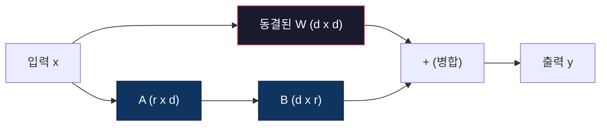
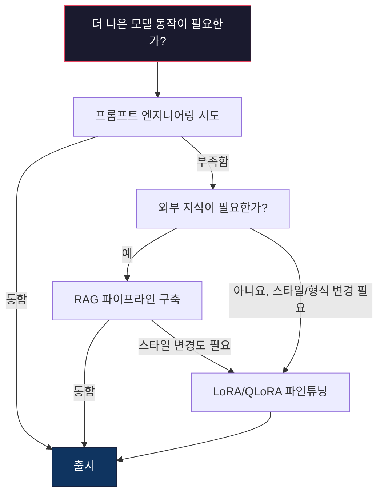

> 🇰🇷 이 문서는 한국어 번역본입니다(ELI5 스타일). 원문: [en.md](en.md)

# LoRA & QLoRA 파인튜닝

> 7B 모델을 전체 파인튜닝하려면 VRAM이 56GB 필요합니다. 여러분에겐 없고, 대부분의 회사에도 없죠. LoRA는 파라미터의 1%도 안 되는 부분만 학습해서 같은 모델을 6GB로 파인튜닝할 수 있게 해 줍니다. 이건 타협이 아닙니다 -- 대부분의 작업에서 전체 파인튜닝과 맞먹는 품질을 냅니다. 오픈소스 파인튜닝 생태계 전체가 이 한 가지 트릭 위에서 돌아가고 있어요.

**유형:** 빌드
**언어:** Python
**선수 지식:** 페이즈 10, 레슨 06 (인스트럭션 튜닝 / SFT)
**시간:** 약 75분
**관련:** 페이즈 10에서는 SFT/DPO 루프를 처음부터 다룹니다. 이 레슨은 그것을 2026년 PEFT 툴킷(PEFT, TRL, Unsloth, Axolotl, LLaMA-Factory)과 연결합니다.

## 학습 목표

- 사전 학습된 모델의 어텐션 레이어에 저랭크 어댑터 행렬(A와 B)을 주입해 LoRA를 구현합니다
- LoRA와 전체 파인튜닝의 파라미터 절감 효과를 계산합니다: d_model 차원에서 랭크 r은 d^2 대신 2*r*d개 파라미터를 학습합니다
- QLoRA(4비트 양자화 베이스 + LoRA 어댑터)를 사용해 소비자용 GPU 메모리 안에 맞추면서 모델을 파인튜닝합니다
- 배포를 위해 LoRA 가중치를 베이스 모델에 다시 병합하고, 어댑터 유무에 따른 추론 속도를 비교합니다

## 문제 상황

베이스 모델이 하나 있습니다. Llama 3 8B죠. 이 모델이 회사 말투로 고객 지원 티켓에 답하게 만들고 싶습니다. SFT가 해답입니다. 하지만 SFT에는 비용 문제가 있어요.

전체 파인튜닝은 모델의 모든 파라미터를 업데이트합니다. Llama 3 8B는 80억 개 파라미터를 가지고 있죠. fp16에서 파라미터 하나는 2바이트입니다. 가중치를 로드하는 데만 16GB가 듭니다. 학습 중에는 여기에 그래디언트(16GB), Adam 옵티마이저 상태(모멘텀 + 분산으로 32GB), 활성값(activations)까지 필요합니다. 합계: 8B 모델 하나에 대략 56GB의 VRAM입니다.

A100 80GB 한 장으로도 간신히 들어갑니다. 클라우드에서 A100 두 장은 시간당 3~4달러죠. 5만 개 예제로 3 에포크 학습하는 데 6~10시간이 걸립니다. 실험 한 번에 30~40달러예요. 하이퍼파라미터를 맞추려고 실험을 10번 돌리면, 아무것도 배포하기도 전에 400달러가 나갑니다.

이걸 Llama 3 70B로 확장하면 숫자가 터무니없어집니다. 가중치만 140GB예요. 클러스터가 필요하고 실험 한 번에 100달러 이상 듭니다.

더 깊은 문제도 있습니다. 전체 파인튜닝은 모델의 모든 가중치를 바꿉니다. 고객 지원 데이터로 파인튜닝하면 모델의 일반 능력이 떨어질 수 있어요. 이걸 파괴적 망각(catastrophic forgetting)이라고 부릅니다. 모델은 여러분의 작업은 잘하게 되는데 다른 모든 건 못하게 되는 거죠.

더 적은 파라미터를 학습하고, 메모리도 덜 쓰고, 모델의 기존 지식도 파괴하지 않는 방법이 필요합니다.

## 개념

### LoRA: 저랭크 적응(Low-Rank Adaptation)

Edward Hu와 마이크로소프트 동료들은 2021년 6월 LoRA를 발표했습니다. 논문의 통찰은 이것입니다: 파인튜닝 중의 가중치 업데이트는 본질적인 랭크가 낮다. 4096x4096 가중치 행렬의 1,677만 개 파라미터를 전부 업데이트할 필요가 없다는 거죠. 업데이트 안의 유용한 정보는 랭크 16이나 32짜리 행렬로 담아 낼 수 있습니다.

수식으로 볼까요. 표준 선형 레이어는 다음을 계산합니다:

```
y = Wx
```

여기서 W는 d_out x d_in 행렬입니다. 4096x4096 어텐션 프로젝션에는 16,777,216개 파라미터가 해당되죠.

LoRA는 W를 동결해 두고 저랭크 분해를 얹습니다:

```
y = Wx + BAx
```

여기서 B는 (d_out x r), A는 (r x d_in)입니다. 랭크 r은 d보다 훨씬 작습니다 -- 보통 8, 16, 32죠.

4096x4096 레이어에 r=16을 적용하면:
- 원래 파라미터: 4096 x 4096 = 16,777,216
- LoRA 파라미터: (4096 x 16) + (16 x 4096) = 65,536 + 65,536 = 131,072
- 절감: 131,072 / 16,777,216 = 0.78%

파라미터의 0.78%만 학습해서 품질의 95~100%를 얻는 겁니다.



A는 무작위 가우시안으로 초기화하고 B는 0으로 초기화합니다. 덕분에 LoRA의 기여는 0에서 출발합니다 -- 모델은 원래 동작에서 학습을 시작해 적응을 점차 배워 나갑니다.

### 스케일링 팩터: 알파(alpha)

LoRA는 저랭크 업데이트가 출력에 얼마나 영향을 주는지 조절하는 스케일링 팩터 alpha를 도입합니다:

```
y = Wx + (alpha / r) * BAx
```

alpha = r이면 스케일이 1배입니다. alpha = 2r(흔한 기본값)이면 2배죠. 이 하이퍼파라미터는 베이스 학습률과 독립적으로 LoRA 경로의 학습률을 조절합니다.

실전 가이드:
- alpha = 2 * rank는 커뮤니티의 흔한 관례입니다(원논문은 대부분의 실험에서 alpha = rank를 사용)
- alpha = rank는 1배 스케일로, 보수적이지만 안정적입니다
- alpha가 크면 단계당 업데이트가 커져서 수렴이 빨라질 수도, 불안정해질 수도 있습니다

### LoRA를 어디에 적용할까

트랜스포머에는 선형 레이어가 많습니다. 모두에 LoRA를 붙일 필요는 없어요. 원논문은 여러 조합을 테스트했습니다:

| 대상 레이어 | 학습 가능한 파라미터(7B) | 품질 |
|--------------|----------------------|---------|
| q_proj만 | 4.7M | 좋음 |
| q_proj + v_proj | 9.4M | 더 좋음 |
| q_proj + k_proj + v_proj + o_proj | 18.9M | 어텐션 기준 최고 |
| 모든 선형 레이어(어텐션 + MLP) | 37.7M | 미미한 이득, 파라미터 2배 |

대부분의 작업에서 최적점(sweet spot)은 q_proj + v_proj입니다. 셀프 어텐션의 쿼리·값 프로젝션을 겨냥하는데, 이게 모델이 어디에 주목하고 어떤 정보를 뽑아낼지를 결정하거든요. MLP 레이어를 추가하면 코드 생성 같은 복잡한 작업에는 도움이 되지만, 단순한 작업에서는 파라미터 수가 두 배가 되는 만큼 이득이 미미해집니다.

### 랭크 선택

랭크 r은 적응의 표현력을 조절합니다:

| 랭크 | 학습 가능한 파라미터(레이어당) | 가장 잘 맞는 용도 |
|------|---------------------------|----------|
| 4 | 32,768 | 단순 분류, 감성 분석 |
| 8 | 65,536 | 단일 도메인 Q&A, 요약 |
| 16 | 131,072 | 다중 도메인 작업, 지시 따르기 |
| 32 | 262,144 | 복잡한 추론, 코드 생성 |
| 64 | 524,288 | 대부분의 작업에서 이득 감소 |
| 128 | 1,048,576 | 정당화되기 드묾 |

Hu 등은 단순한 작업에서 r=4만으로도 적응의 대부분을 담아 낼 수 있음을 보였습니다. 실전에서 가장 흔한 선택은 r=8과 r=16이고요. r=64를 넘어서면 품질이 좋아지는 경우가 드물고 LoRA의 메모리 이점도 사라지기 시작합니다.

### QLoRA: 4비트 양자화 + LoRA

Tim Dettmers와 워싱턴대학교 동료들은 2023년 5월 QLoRA를 발표했습니다. 아이디어는 이렇습니다: 동결한 베이스 모델을 4비트 정밀도로 양자화하고, 그 위에 fp16 LoRA 어댑터를 붙인다.

이렇게 하면 메모리 방정식이 극적으로 바뀝니다:

| 방식 | 가중치 메모리(7B) | 학습 메모리(7B) | 필요한 GPU |
|--------|-------------------|---------------------|-------------|
| 전체 파인튜닝(fp16) | 14GB | ~56GB | A100 80GB 1장 |
| LoRA(fp16 베이스) | 14GB | ~18GB | A100 40GB 1장 |
| QLoRA(4비트 베이스) | 3.5GB | ~6GB | RTX 3090 24GB 1장 |

QLoRA의 기술적 기여는 세 가지입니다:

**NF4(Normal Float 4비트)**: 신경망 가중치 전용으로 설계된 새 데이터 타입입니다. 신경망 가중치는 대략 정규분포를 따르죠. NF4는 16개 양자화 단계를 표준 정규분포의 분위수(quantile)에 배치합니다. 정규분포 데이터에 대해 정보이론적으로 최적이라는 뜻입니다. 균일 4비트 양자화(INT4)나 표준 Float4보다 정보 손실이 적습니다.

**이중 양자화(double quantization)**: 양자화 상수 자체도 메모리를 차지합니다. 64개 가중치 블록마다 fp32 스케일 팩터(4바이트)가 필요하죠. 7B 모델이면 추가로 0.4GB입니다. 이중 양자화는 이 상수들을 fp8로 다시 양자화해 오버헤드를 0.1GB로 줄입니다. 작지만 모이면 큽니다.

**페이징 옵티마이저(paged optimizers)**: 학습 중에는 옵티마이저 상태(Adam의 모멘텀과 분산)가 긴 시퀀스에서 GPU 메모리를 초과할 수 있습니다. 페이징 옵티마이저는 NVIDIA 통합 메모리(unified memory)를 이용해 GPU 메모리가 바닥나면 옵티마이저 상태를 자동으로 CPU RAM으로 내리고, 필요할 때 다시 올립니다. 일부 처리량을 희생하는 대신 OOM(메모리 부족) 크래시를 막아 줍니다.

### 품질은 어떨까

파라미터를 줄이거나 베이스를 양자화하면 품질이 나빠질까요? 여러 논문의 결과입니다:

| 방식 | MMLU(5-shot) | MT-Bench | HumanEval |
|--------|--------------|----------|-----------|
| 전체 파인튜닝(Llama 2 7B) | 48.3 | 6.72 | 14.6 |
| LoRA r=16 | 47.9 | 6.68 | 14.0 |
| QLoRA r=16(NF4) | 47.5 | 6.61 | 13.4 |
| QLoRA r=64(NF4) | 48.1 | 6.70 | 14.2 |

r=16 LoRA는 대부분의 벤치마크에서 전체 파인튜닝의 1% 이내입니다. r=16 QLoRA는 거기서 또 소수점 몇 %를 더 잃죠. r=64 QLoRA는 사실상 전체 파인튜닝과 맞먹으면서 메모리를 90% 덜 씁니다.

### 실제 비용

Llama 3 8B를 5만 개 예제로 파인튜닝할 때(3 에포크):

| 방식 | GPU | 시간 | 비용 |
|--------|-----|------|------|
| 전체 파인튜닝 | A100 80GB 2장 | 8시간 | ~$32 |
| LoRA r=16 | A100 40GB 1장 | 4시간 | ~$8 |
| QLoRA r=16 | RTX 4090 24GB 1장 | 6시간 | ~$5 |
| QLoRA r=16(Unsloth) | RTX 4090 24GB 1장 | 2.5시간 | ~$2 |
| QLoRA r=16 | T4 16GB 1장 | 12시간 | ~$4 |

소비자용 GPU 한 장으로 도는 QLoRA는 점심값보다 쌉니다. 2023년에 오픈 웨이트 파인튜닝 커뮤니티가 폭발했고, 2026년에는 아래의 모든 학습 프레임워크가 기본으로 QLoRA를 탑재하는 이유죠.

### 2026년 PEFT 스택

| 프레임워크 | 정체 | 고르는 시점 |
|-----------|-----------|-----------|
| **Hugging Face PEFT** | 표준 LoRA/QLoRA/DoRA/IA3 라이브러리 | 날것 그대로의 제어가 필요하고 학습 루프가 이미 `transformers.Trainer` 기반일 때 |
| **TRL** | HF의 피드백 기반 강화 학습 트레이너 모음(SFT, DPO, GRPO, PPO, ORPO) | SFT 다음에 DPO/GRPO가 필요할 때; PEFT 위에 만들어져 있음 |
| **Unsloth** | 포워드/백워드 패스를 Triton 커널로 재작성 | 정확도 손실 없이 2~5배 속도 향상 + VRAM 절반을 원할 때; Llama/Mistral/Qwen 계열 |
| **Axolotl** | PEFT + TRL + DeepSpeed + Unsloth를 감싼 YAML 설정 래퍼 | 재현 가능하고 버전 관리되는 학습 실행을 원할 때 |
| **LLaMA-Factory** | PEFT + TRL 위의 GUI/CLI/API | 코드 없는 파인튜닝을 원할 때; 100개 이상 모델 계열 지원 |
| **torchtune** | 네이티브 PyTorch 레시피, `transformers` 의존성 없음 | 의존성을 최소화하고 싶고 조직이 이미 PyTorch로 표준화돼 있을 때 |

경험칙: 연구용이나 일회성 실험 → PEFT. 반복 가능한 프로덕션 파이프라인 → Unsloth 커널을 켠 Axolotl. 버릴 프로토타이핑 → LLaMA-Factory.

### 어댑터 병합

학습이 끝나면 두 가지가 남습니다. 동결한 베이스 모델과 작은 LoRA 어댑터(보통 10~100MB)죠. 선택지는 둘입니다:

1. **따로 보관**: 베이스 모델을 로드하고 그 위에 어댑터를 얹습니다. 작업마다 어댑터를 갈아 끼우죠. 베이스 모델 하나에서 파인튜닝 변형 여러 개를 서빙하는 방식입니다.

2. **영구 병합**: W' = W + (alpha/r) * BA를 계산해 결과를 새 전체 모델로 저장합니다. 병합된 모델은 원본과 크기가 같고, 추론 오버헤드도, 관리할 어댑터도 없습니다.

여러 작업을 서빙할 거면(고객 지원 어댑터, 코드 어댑터, 번역 어댑터) 따로 보관하세요. 특화된 모델 하나를 배포할 거면 병합합니다.

여러 어댑터를 합치는 고급 병합 기법:

- **TIES-Merging**(Yadav et al. 2023): 작은 크기의 파라미터를 잘라내고 부호 충돌을 해소한 뒤 병합합니다. 어댑터 간 간섭을 줄입니다.
- **DARE**(Yu et al. 2023): 병합 전에 어댑터 파라미터를 무작위로 떨어뜨리고 나머지를 다시 스케일합니다. 능력을 합치는 데 놀랍도록 효과적입니다.
- **태스크 산술(task arithmetic)**: 어댑터 가중치를 단순히 더하거나 뺍니다. "코드" 어댑터와 "수학" 어댑터를 더하면 둘 다 잘하는 모델이 나오는 경우가 많습니다.

### 파인튜닝하면 안 되는 때

파인튜닝은 첫 번째 선택지가 아니라 세 번째 선택지입니다.

**첫 번째: 프롬프트 엔지니어링.** 더 나은 시스템 프롬프트를 쓰고, few-shot 예시를 넣고, 생각의 사슬(chain-of-thought)을 써 보세요. 비용도 안 들고 몇 분이면 됩니다. 프롬프트만으로 목표의 80%에 도달했다면 파인튜닝이 필요 없을 겁니다.

**두 번째: RAG.** 모델이 여러분의 특정 데이터(문서, 지식 베이스, 제품 카탈로그)를 알아야 한다면, 가중치에 구워 넣는 것보다 검색이 더 싸고 관리도 쉽습니다. 레슨 06을 참고하세요.

**세 번째: 파인튜닝.** 프롬프트로는 만들 수 없는 특정 스타일, 형식, 추론 패턴을 모델에 입혀야 할 때 사용합니다. 일관된 구조화 출력이 필요할 때. 큰 모델을 작은 모델로 증류해야 할 때. 지연 시간이 중요해서 few-shot 프롬프팅의 추가 토큰을 감당할 수 없을 때.



```figure
lora-params
```

## 만들어 보기

순수 PyTorch로 LoRA를 처음부터 구현합니다. 라이브러리도, 마법도 없어요. LoRA 레이어를 만들고, 모델에 주입하고, 학습시키고, 가중치를 다시 병합할 겁니다.

### 단계 1: LoRA 레이어

```python
import torch
import torch.nn as nn
import math

class LoRALayer(nn.Module):
    def __init__(self, in_features, out_features, rank=8, alpha=16):
        super().__init__()
        self.rank = rank
        self.alpha = alpha
        self.scaling = alpha / rank

        self.A = nn.Parameter(torch.randn(in_features, rank) * (1 / math.sqrt(rank)))
        self.B = nn.Parameter(torch.zeros(rank, out_features))

    def forward(self, x):
        return (x @ self.A @ self.B) * self.scaling
```

A는 스케일링된 무작위 값으로 초기화하고 B는 0으로 초기화합니다. 곱 BA가 0에서 시작하므로 모델은 원래 동작에서 출발합니다.

### 단계 2: LoRA로 감싼 선형 레이어

```python
class LinearWithLoRA(nn.Module):
    def __init__(self, linear, rank=8, alpha=16):
        super().__init__()
        self.linear = linear
        self.lora = LoRALayer(
            linear.in_features, linear.out_features, rank, alpha
        )

        for param in self.linear.parameters():
            param.requires_grad = False

    def forward(self, x):
        return self.linear(x) + self.lora(x)
```

원래 선형 레이어는 동결됩니다. 학습되는 것은 LoRA 파라미터(A와 B)뿐이죠.

### 단계 3: 모델에 LoRA 주입

```python
def inject_lora(model, target_modules, rank=8, alpha=16):
    for param in model.parameters():
        param.requires_grad = False

    lora_layers = {}
    for name, module in model.named_modules():
        if isinstance(module, nn.Linear):
            if any(t in name for t in target_modules):
                parent_name = ".".join(name.split(".")[:-1])
                child_name = name.split(".")[-1]
                parent = dict(model.named_modules())[parent_name]
                lora_linear = LinearWithLoRA(module, rank, alpha)
                setattr(parent, child_name, lora_linear)
                lora_layers[name] = lora_linear
    return lora_layers
```

먼저 모델의 모든 파라미터를 동결합니다. 그다음 모델 트리를 돌며 대상 이름에 맞는 선형 레이어를 찾아 LoRA로 감싼 버전으로 갈아끼웁니다. LoRA A, B 행렬이 모델 전체에서 유일한 학습 가능 파라미터입니다.

### 단계 4: 파라미터 세기

```python
def count_parameters(model):
    total = sum(p.numel() for p in model.parameters())
    trainable = sum(p.numel() for p in model.parameters() if p.requires_grad)
    frozen = total - trainable
    return {
        "total": total,
        "trainable": trainable,
        "frozen": frozen,
        "trainable_pct": 100 * trainable / total if total > 0 else 0
    }
```

### 단계 5: 가중치 다시 병합

```python
def merge_lora_weights(model):
    for name, module in model.named_modules():
        if isinstance(module, LinearWithLoRA):
            with torch.no_grad():
                merged = (
                    module.lora.A @ module.lora.B
                ) * module.lora.scaling
                module.linear.weight.data += merged.T
            parent_name = ".".join(name.split(".")[:-1])
            child_name = name.split(".")[-1]
            if parent_name:
                parent = dict(model.named_modules())[parent_name]
            else:
                parent = model
            setattr(parent, child_name, module.linear)
```

병합 후에는 LoRA 레이어가 사라집니다. 적응 내용이 가중치에 구워진 채 모델 크기는 원본과 같고, 추론 오버헤드도 없습니다.

### 단계 6: QLoRA 양자화 시뮬레이션

```python
def quantize_to_nf4(tensor, block_size=64):
    blocks = tensor.reshape(-1, block_size)
    scales = blocks.abs().max(dim=1, keepdim=True).values / 7.0
    scales = torch.clamp(scales, min=1e-8)
    quantized = torch.round(blocks / scales).clamp(-8, 7).to(torch.int8)
    return quantized, scales

def dequantize_from_nf4(quantized, scales, original_shape):
    dequantized = quantized.float() * scales
    return dequantized.reshape(original_shape)
```

이 코드는 64개짜리 블록 안에서 가중치를 16개 이산 단계로 매핑해 4비트 양자화를 흉내 냅니다. 실전 QLoRA는 bitsandbytes 라이브러리로 GPU에서 진짜 NF4를 사용합니다.

### 단계 7: 학습 루프

```python
def train_lora(model, data, epochs=5, lr=1e-3, batch_size=4):
    optimizer = torch.optim.AdamW(
        [p for p in model.parameters() if p.requires_grad], lr=lr
    )
    criterion = nn.MSELoss()

    losses = []
    for epoch in range(epochs):
        epoch_loss = 0.0
        n_batches = 0
        indices = torch.randperm(len(data["inputs"]))

        for i in range(0, len(indices), batch_size):
            batch_idx = indices[i:i + batch_size]
            x = data["inputs"][batch_idx]
            y = data["targets"][batch_idx]

            output = model(x)
            loss = criterion(output, y)

            optimizer.zero_grad()
            loss.backward()
            optimizer.step()

            epoch_loss += loss.item()
            n_batches += 1

        avg_loss = epoch_loss / n_batches
        losses.append(avg_loss)

    return losses
```

### 단계 8: 전체 데모

```python
def demo():
    torch.manual_seed(42)
    d_model = 256
    n_classes = 10

    model = nn.Sequential(
        nn.Linear(d_model, 512),
        nn.ReLU(),
        nn.Linear(512, 512),
        nn.ReLU(),
        nn.Linear(512, n_classes),
    )

    n_samples = 500
    x = torch.randn(n_samples, d_model)
    y = torch.randint(0, n_classes, (n_samples,))
    y_onehot = torch.zeros(n_samples, n_classes).scatter_(1, y.unsqueeze(1), 1.0)

    data = {"inputs": x, "targets": y_onehot}

    params_before = count_parameters(model)

    lora_layers = inject_lora(
        model, target_modules=["0", "2"], rank=8, alpha=16
    )

    params_after = count_parameters(model)

    losses = train_lora(model, data, epochs=20, lr=1e-3)

    merge_lora_weights(model)
    params_merged = count_parameters(model)

    return {
        "params_before": params_before,
        "params_after": params_after,
        "params_merged": params_merged,
        "losses": losses,
    }
```

데모는 작은 모델을 만들고 두 레이어에 LoRA를 주입한 뒤 학습시키고, 가중치를 다시 병합합니다. 파라미터 수는 LoRA 학습 중에는 전체 학습 가능에서 약 1% 학습 가능으로 떨어졌다가, 병합 후에는 원래 아키텍처로 돌아갑니다.

## 실전에서 쓰기

Hugging Face 생태계에서는 실제 모델에 LoRA를 적용하는 데 약 20줄이면 됩니다:

```python
from transformers import AutoModelForCausalLM, AutoTokenizer
from peft import LoraConfig, get_peft_model, TaskType

model = AutoModelForCausalLM.from_pretrained("meta-llama/Llama-3.1-8B")
tokenizer = AutoTokenizer.from_pretrained("meta-llama/Llama-3.1-8B")

lora_config = LoraConfig(
    task_type=TaskType.CAUSAL_LM,
    r=16,
    lora_alpha=32,
    lora_dropout=0.05,
    target_modules=["q_proj", "v_proj"],
)

model = get_peft_model(model, lora_config)
model.print_trainable_parameters()
```

QLoRA에는 bitsandbytes 양자화를 추가합니다:

```python
from transformers import BitsAndBytesConfig

bnb_config = BitsAndBytesConfig(
    load_in_4bit=True,
    bnb_4bit_quant_type="nf4",
    bnb_4bit_compute_dtype=torch.bfloat16,
    bnb_4bit_use_double_quant=True,
)

model = AutoModelForCausalLM.from_pretrained(
    "meta-llama/Llama-3.1-8B",
    quantization_config=bnb_config,
    device_map="auto",
)

model = get_peft_model(model, lora_config)
```

끝입니다. 같은 학습 루프, 같은 데이터 파이프라인. 베이스 모델은 4비트로 살고, LoRA 어댑터는 fp16으로 학습되고, 전체가 6GB에 들어갑니다.

Hugging Face Trainer로 학습할 때:

```python
from transformers import TrainingArguments, Trainer
from datasets import load_dataset

dataset = load_dataset("tatsu-lab/alpaca", split="train[:5000]")

training_args = TrainingArguments(
    output_dir="./lora-llama",
    num_train_epochs=3,
    per_device_train_batch_size=4,
    gradient_accumulation_steps=4,
    learning_rate=2e-4,
    fp16=True,
    logging_steps=10,
    save_strategy="epoch",
    optim="paged_adamw_8bit",
)

trainer = Trainer(
    model=model,
    args=training_args,
    train_dataset=dataset,
)

trainer.train()

model.save_pretrained("./lora-adapter")
```

저장된 어댑터는 10~100MB입니다. 베이스 모델은 그대로고요. 전체 모델을 재배포하지 않고도 Hugging Face Hub에서 어댑터를 공유할 수 있습니다.

## 출시하기

이 레슨에서 만드는 산출물:
- `outputs/prompt-lora-advisor.md` -- 주어진 작업에 맞는 LoRA 랭크, 대상 모듈, 하이퍼파라미터를 정하도록 돕는 프롬프트
- `outputs/skill-fine-tuning-guide.md` -- 언제, 어떻게 파인튜닝할지의 의사결정 트리를 에이전트에게 알려 주는 스킬

## 연습 문제

1. **랭크 소거 실험(ablation).** 랭크 2, 4, 8, 16, 32, 64로 데모를 돌려 보세요. 최종 손실과 랭크의 관계를 그래프로 그립니다. 랭크를 두 배로 늘려도 손실이 절반으로 줄지 않는 이득 감소 지점을 찾으세요. 256차원 특성(feature)을 쓰는 단순 분류 작업이라면 대략 r=8~16 근처일 겁니다.

2. **대상 모듈 비교.** inject_lora가 레이어 "0"만, "2"만, "4"만, 그리고 셋 모두를 대상으로 삼도록 바꿔 보세요. 각 변형을 20 에포크씩 학습하고 수렴 속도와 최종 손실을 비교합니다. 이건 q_proj vs v_proj vs 모든 선형 레이어 중 무엇을 겨냥할지의 실전 의사결정을 그대로 재현한 겁니다.

3. **양자화 오차 분석.** 학습된 모델의 가중치 행렬을 quantize_to_nf4 / dequantize_from_nf4 전후로 꺼내 보세요. 평균 제곱 오차, 최대 절대 오차, 원본 가중치와 재구성된 가중치 사이의 상관관계를 계산합니다. block_size 값 32, 64, 128, 256으로 실험해 보세요.

4. **멀티 어댑터 서빙.** 서로 다른 데이터 부분집합(짝수 인덱스 vs 홀수 인덱스)으로 LoRA 어댑터 두 개를 학습하세요. 어댑터 둘 다 저장하고, 베이스 모델은 한 번만 로드한 뒤 어댑터를 갈아 끼우며 같은 입력에 서로 다른 출력을 내는지 확인합니다. 프로덕션 시스템이 베이스 하나에서 파인튜닝 모델 여러 개를 서빙하는 방식이죠.

5. **병합 vs 미병합 추론.** 같은 입력 100개에 대해 merge_lora_weights 전후의 LoRA 모델 출력을 비교하세요. 출력이 동일한지(부동소수점 허용 오차 1e-5 이내) 확인합니다. 그다음 둘의 추론 속도를 벤치마크하세요 -- 병합 버전은 행렬 곱을 두 번이 아니라 한 번 하므로 약간 더 빨라야 합니다.

## 핵심 용어

| 용어 | 흔히 부르는 말 | 실제 의미 |
|------|----------------|----------------------|
| LoRA | "효율적인 파인튜닝" | 저랭크 적응: 베이스 가중치를 동결하고, 전체 가중치 업데이트를 근사하는 두 개의 작은 행렬 A와 B를 학습하는 방법 |
| QLoRA | "노트북에서 파인튜닝" | 양자화된 LoRA: 베이스 모델을 4비트 NF4로 로드하고 그 위에서 fp16 LoRA 어댑터를 학습해, 6GB VRAM으로 7B 파인튜닝을 가능하게 함 |
| Rank (r) | "모델이 배울 수 있는 양" | A와 B 행렬의 내부 차원; 표현력과 파라미터 수 사이의 균형을 조절함 |
| Alpha | "LoRA 학습률" | LoRA 출력에 곱해지는 스케일링 팩터; alpha/r가 적응의 최종 출력 기여도를 조절함 |
| NF4 | "4비트 양자화" | Normal Float 4: 양자화 단계를 정규분포 분위수에 배치한 4비트 데이터 타입으로, 신경망 가중치에 최적 |
| Adapter | "학습된 작은 부분" | LoRA A, B 행렬을 별도 파일(10~100MB)로 저장한 것; 베이스 모델 사본 위에 얹어 로드할 수 있음 |
| Target modules | "LoRA를 붙일 레이어" | LoRA 어댑터가 주입되는 특정 선형 레이어(q_proj, v_proj 등) |
| Merging | "구워 넣기" | W + (alpha/r) * BA를 계산해 원래 가중치를 대체하는 것; 추론 시 어댑터 오버헤드를 없앰 |
| Paged optimizers | "학습 중 OOM 방지" | GPU 메모리가 바닥나면 옵티마이저 상태(Adam 모멘텀, 분산)를 CPU로 내보내는 것 |
| Catastrophic forgetting | "파인튜닝이 나머지를 망가뜨림" | 모든 가중치를 업데이트하다가 모델이 이전에 배운 능력을 잃는 현상 |

## 더 읽을 거리

- Hu et al., "LoRA: Low-Rank Adaptation of Large Language Models" (2021) -- 저랭크 분해 방법을 소개한 원논문. GPT-3 175B에서 랭크 4까지 테스트했습니다
- Dettmers et al., "QLoRA: Efficient Finetuning of Quantized Language Models" (2023) -- NF4, 이중 양자화, 페이징 옵티마이저를 도입해 48GB GPU 한 장에서 65B 파인튜닝을 가능하게 만든 논문
- PEFT library documentation (huggingface.co/docs/peft) -- Hugging Face 생태계에서 LoRA, QLoRA 등 파라미터 효율적 방법을 다루는 표준 라이브러리
- Yadav et al., "TIES-Merging: Resolving Interference When Merging Models" (2023) -- 품질 저하 없이 여러 LoRA 어댑터를 결합하는 기법
- [Rafailov et al., "Direct Preference Optimization: Your Language Model is Secretly a Reward Model" (NeurIPS 2023)](https://arxiv.org/abs/2305.18290) -- DPO 유도 과정; SFT 다음에 오는 선호 튜닝 단계로, 보상 모델이 필요 없습니다.
- [TRL documentation](https://huggingface.co/docs/trl/) -- `SFTTrainer`, `DPOTrainer`, `KTOTrainer`의 공식 레퍼런스이자 PEFT/bitsandbytes/Unsloth와의 통합 면.
- [Unsloth documentation](https://docs.unsloth.ai/) -- 파인튜닝 처리량을 두 배로, 메모리를 절반으로 만드는 퓨전 커널; TRL 아래의 성능 레이어.
- [Axolotl documentation](https://axolotl-ai-cloud.github.io/axolotl/) -- YAML로 설정하는 멀티 GPU SFT/DPO/QLoRA 트레이너; 손으로 쓴 스크립트를 대신하는 config-as-code 방식.
