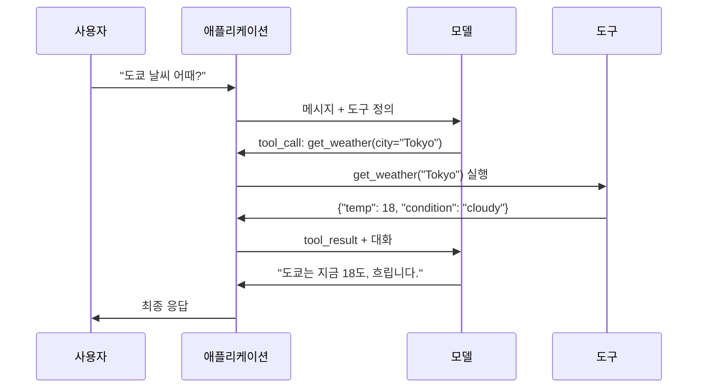

> 🇰🇷 이 문서는 한국어 번역본입니다(ELI5 스타일). 원문: [en.md](en.md)

# 함수 호출과 도구 사용

> LLM은 뭘 할 수 있는 게 아닙니다. 텍스트를 생성할 뿐이죠. 능력의 전부가 그거입니다. 날씨를 확인할 수도, 데이터베이스를 조회할 수도, 이메일을 보낼 수도, 코드를 실행할 수도, 파일을 읽을 수도 없습니다. 여러분이 본 모든 "AI 에이전트"는 어떤 함수를 호출할지 말해 주는 JSON을 만드는 LLM이고, 실제 호출은 여러분의 코드가 하는 겁니다. 모델은 뇌고, 도구는 손이며, 함수 호출은 둘을 잇는 신경계입니다.

**유형:** 빌드
**언어:** Python
**선수 지식:** 페이즈 11 레슨 03 (구조화 출력)
**시간:** 약 75분
**관련:** 페이즈 11 · 14 (Model Context Protocol) -- 도구를 여러 호스트가 공유할 때는 인라인 함수 호출에서 MCP 서버로 갈아타야 합니다. 이 레슨은 인라인 방식을, MCP는 프로토콜 방식을 다룹니다.

## 학습 목표

- 함수 호출 루프를 구현합니다: 도구 스키마 정의, 모델의 도구 호출 JSON 파싱, 함수 실행, 결과 반환
- 모델이 안정적으로 호출할 수 있도록 명확한 설명과 타입이 지정된 파라미터로 도구 스키마를 설계합니다
- 여러 함수 호출을 사슬처럼 엮어 복잡한 질의에 답하는 멀티턴 에이전트 루프를 만듭니다
- 함수 호출의 엣지 케이스를 다룹니다: 병렬 도구 호출, 오류 전파, 무한 도구 루프 방지

## 문제 상황

챗봇을 만들었습니다. 사용자가 묻습니다: "지금 도쿄 날씨 어때요?"

모델이 답합니다: "실시간 날씨 데이터에는 접근할 수 없지만, 계절로 볼 때 도쿄는 대략 섭씨 15도 정도일 것입니다..."

이건 고지 문구를 걸친 환각입니다. 모델은 날씨를 모릅니다. 앞으로도 못 알아요. 날씨는 한 시간마다 바뀌는데 모델의 학습 데이터는 몇 달 전 것이니까요.

올바른 답을 내려면 OpenWeatherMap API를 호출해 현재 기온을 받아 실제 숫자를 돌려줘야 합니다. 모델은 API를 호출할 수 없지만 여러분의 코드는 호출할 수 있죠. 빠진 조각은 이것입니다: 모델이 "이 인자들로 날씨 API를 호출해야 합니다"라고 말하고, 코드가 그걸 실행해 결과를 다시 먹여 주는 구조화된 프로토콜.

이게 함수 호출입니다. 모델은 어떤 함수를 어떤 인자로 호출할지 설명하는 구조화된 JSON을 출력하고, 여러분의 애플리케이션이 함수를 실행하며, 결과가 대화에 다시 들어가고, 모델은 그 결과로 최종 답변을 만듭니다.

함수 호출이 없으면 LLM은 백과사전입니다. 있으면 에이전트가 됩니다.

## 개념

### 함수 호출 루프

모든 도구 사용 상호작용은 같은 5단계 루프를 따릅니다.



단계 1: 사용자가 메시지를 보냅니다. 단계 2: 모델이 메시지와 도구 정의(사용 가능한 함수를 설명하는 JSON Schema)를 받습니다. 단계 3: 모델은 텍스트로 답하는 대신 도구 호출을 출력합니다 -- 함수 이름과 인자를 담은 구조화된 JSON 객체죠. 단계 4: 여러분의 코드가 함수를 실행하고 결과를 받아 둡니다. 단계 5: 결과가 모델로 돌아가고, 모델은 이제 실제 데이터를 갖고 최종 답변을 만듭니다.

모델은 아무것도 실행하지 않습니다. 무엇을 어떤 인자로 호출할지만 결정하죠. 실행자는 여러분의 코드입니다.

### 도구 정의: JSON Schema 계약

각 도구는 JSON Schema로 정의됩니다. 함수가 무엇을 하는지, 어떤 인자를 받는지, 인자의 타입은 무엇인지 모델에게 알려 주는 거죠.

```json
{
  "type": "function",
  "function": {
    "name": "get_weather",
    "description": "Get current weather for a city. Returns temperature in Celsius and conditions.",
    "parameters": {
      "type": "object",
      "properties": {
        "city": {
          "type": "string",
          "description": "City name, e.g. 'Tokyo' or 'San Francisco'"
        },
        "units": {
          "type": "string",
          "enum": ["celsius", "fahrenheit"],
          "description": "Temperature units"
        }
      },
      "required": ["city"]
    }
  }
}
```

`description` 필드가 결정적입니다. 모델은 이걸 읽고 도구를 언제, 어떻게 쓸지 판단합니다. "날씨를 구함" 같은 뭉뚱그린 설명은 "도시의 현재 날씨를 조회합니다. 섭씨 온도와 날씨 상태를 반환합니다" 같은 설명보다 도구 선택이 나빠집니다. 설명은 곧 도구 선택을 위한 프롬프트입니다.

### 공급자 비교

주요 공급자는 모두 함수 호출을 지원하지만 API 면모는 제각각입니다.

| 공급자 | API 파라미터 | 도구 호출 형식 | 병렬 호출 | 강제 호출 |
|----------|--------------|-----------------|---------------|----------------|
| OpenAI (GPT-5, o4) | `tools` | `tool_calls[].function` | 예(턴당 여러 개) | `tool_choice="required"` |
| Anthropic (Claude 4.6/4.7) | `tools` | `content[].type="tool_use"` | 예(블록 여러 개) | `tool_choice={"type":"any"}` |
| Google (Gemini 3) | `function_declarations` | `functionCall` | 예 | `function_calling_config` |
| 오픈 웨이트(Llama 4, Qwen3, DeepSeek-V3) | Llama 4는 네이티브 `tools`; 그 외는 Hermes 또는 ChatML | 제각각 | 모델 의존 | 프롬프트 기반 또는 지원 시 `tool_choice` |

2026년까지 세 폐쇄형 공급자는 거의 동일한 JSON Schema 기반 형식으로 수렴했습니다. Llama 4는 OpenAI 모양과 맞는 네이티브 `tools` 필드를 기본 탑재하고요. 오픈 웨이트 파인튜닝 모델은 아직 제각각입니다 -- 서드파티 파인튜닝에서는 Hermes 형식(NousResearch)이 가장 흔합니다. 호스트 여러 곳이 도구를 공유할 때는 인라인 함수 호출보다 MCP(페이즈 11 · 14)를 권합니다 -- 서버 하나면 전부 통합니다.

### 도구 선택: auto, required, 특정 함수

모델이 도구를 쓰는 시점은 여러분이 통제합니다.

**Auto**(기본값): 모델이 도구를 호출할지 곧바로 답할지 스스로 정합니다. "2+2는?" -- 직접 답합니다. "날씨는?" -- 도구를 호출하죠.

**Required**: 모델이 최소 한 개의 도구를 호출해야 합니다. 사용자 의도에 도구가 필요하다는 걸 이미 알고 있을 때 사용하세요. 실제 데이터를 찾아보지 않고 지어내는 것을 막아 줍니다.

**특정 함수**: 모델이 특정 함수를 호출하도록 강제합니다. `tool_choice={"type":"function", "function": {"name": "get_weather"}}`는 쿼리가 뭐든 날씨 도구 호출을 보장하죠. 라우팅에 씁니다 -- 상위 로직이 이미 어떤 도구가 필요한지 정해 뒀을 때요.

### 병렬 함수 호출

GPT-4o와 Claude는 한 턴에 여러 함수를 호출할 수 있습니다. 사용자가 묻죠: "도쿄랑 뉴욕 날씨 어때요?" 모델은 도구 호출 두 개를 동시에 출력합니다:

```json
[
  {"name": "get_weather", "arguments": {"city": "Tokyo"}},
  {"name": "get_weather", "arguments": {"city": "New York"}}
]
```

여러분의 코드는 둘 다 실행하고(가능하면 동시에), 두 결과를 돌려주고, 모델이 하나의 응답으로 종합합니다. 왕복 횟수가 2회에서 1회로 줄어드는 거죠. 쿼리당 도구 호출이 5~10번인 에이전트라면 병렬 호출로 지연 시간이 60~80% 줄어듭니다.

### 구조화 출력 vs 함수 호출

레슨 03에서 구조화 출력을 다뤘습니다. 함수 호출은 같은 JSON Schema 장치를 쓰지만 목적이 다릅니다.

**구조화 출력**: 모델이 특정 모양의 데이터를 내놓도록 강제합니다. 출력이 곧 최종 산출물이죠. 예: 텍스트에서 제품 정보를 `{name, price, in_stock}` 형태로 추출.

**함수 호출**: 모델이 어떤 동작을 실행하려는 의도를 선언합니다. 출력은 중간 단계죠. 예: `get_weather(city="Tokyo")` -- 모델은 최종 답변이 아니라 동작을 요청하는 중입니다.

데이터 추출이 목적이면 구조화 출력을, 외부 시스템과의 상호작용이 목적이면 함수 호출을 사용하세요.

### 보안: 양보 불가능한 규칙

함수 호출은 LLM에게 줄 수 있는 가장 위험한 능력입니다. 무엇을 실행할지 모델이 고르니까요. 도구 집합에 데이터베이스 쿼리가 있으면 쿼리를 짜는 건 모델이고, 셸 명령이 있으면 명령을 쓰는 것도 모델입니다.

**규칙 1: 모델이 만든 SQL을 데이터베이스에 그대로 넘기지 마세요.** 모델은 DROP TABLE, UNION 인젝션, 모든 행을 돌려주는 쿼리를 만들 수도 있고 실제로 만듭니다. 항상 파라미터화하고. 항상 검증하고. 항상 허용 연산 목록(allowlist)을 쓰세요.

**규칙 2: 함수는 allowlist로 관리하세요.** 모델은 여러분이 명시적으로 정의한 함수만 호출할 수 있습니다. "이름으로 아무 함수나 실행"하는 범용 도구는 절대 만들지 마세요. 내부 함수가 50개라도 사용자가 필요로 하는 5개만 노출하세요.

**규칙 3: 인자를 검증하세요.** 모델이 `"; DROP TABLE users; --"` 같은 도시 이름을 넘길 수도 있습니다. 실행 전에 모든 인자를 기대 타입, 범위, 형식과 대조해 검증하세요.

**규칙 4: 도구 결과를 정제하세요.** 도구가 민감한 데이터(API 키, 개인정보(PII), 내부 오류 메시지)를 돌려주면 모델에 보내기 전에 걸러 냅니다. 모델은 도구 결과를 그대로 답변에 옮겨 담습니다.

**규칙 5: 도구 호출에 속도 제한을 거세요.** 루프에 빠진 모델은 도구를 수백 번 호출할 수 있습니다. 최대치를 정하세요(대화당 10~20회가 무난합니다). 무한 루프를 끊어야 하니까요.

### 오류 처리

도구는 실패합니다. API는 시간 초과되고, 데이터베이스는 죽고, 파일은 존재하지 않을 수 있죠. 모델은 도구가 언제, 왜 실패했는지 알아야 합니다.

예외가 아니라 구조화된 도구 결과로 오류를 돌려주세요:

```json
{
  "error": true,
  "message": "City 'Toky' not found. Did you mean 'Tokyo'?",
  "code": "CITY_NOT_FOUND"
}
```

모델은 이걸 읽고 인자를 고쳐 다시 시도합니다. 구조화된 오류 메시지로부터 스스로 교정하는 건 모델이 잘하는 일이에요. 빈 응답이나 "뭔가 잘못됐습니다" 같은 두루뭉술한 오류에서 회복하는 건 잘 못합니다.

### MCP: Model Context Protocol

MCP는 도구 상호운용성을 위한 Anthropic의 오픈 표준입니다. 애플리케이션마다 제각각 도구를 정의하는 대신, MCP는 범용 프로토콜을 제공합니다: 도구는 MCP 서버가 제공하고 MCP 클라이언트(Claude Code, Cursor, 여러분의 애플리케이션 등)가 소비합니다.

MCP 서버 하나면 호환되는 모든 클라이언트에 도구를 노출할 수 있습니다. Postgres MCP 서버는 MCP 호환 에이전트 어디에나 데이터베이스 접근을 주고, GitHub MCP 서버는 어떤 에이전트에든 저장소 접근을 주죠. 도구는 한 번 정의해서 어디서든 씁니다.

MCP가 함수 호출에서 차지하는 위치는 네트워킹에서 HTTP와 같습니다. 전송 계층을 표준화해서 도구가 휴대 가능해지죠.

```figure
mx-tool-call-loop
```

## 만들어 보기

### 단계 1: 도구 레지스트리 정의

도구 정의와 구현을 저장하는 레지스트리를 만듭니다. 각 도구는 JSON Schema 정의(모델이 보는 것)와 Python 함수(여러분의 코드가 실행하는 것)를 하나씩 갖습니다.

```python
import ast
import json
import math
import time
import hashlib


TOOL_REGISTRY = {}


def register_tool(name, description, parameters, function):
    TOOL_REGISTRY[name] = {
        "definition": {
            "type": "function",
            "function": {
                "name": name,
                "description": description,
                "parameters": parameters,
            },
        },
        "function": function,
    }
```

### 단계 2: 도구 5개 구현

계산기, 날씨 조회, 웹 검색 시뮬레이터, 파일 읽기, 코드 실행기를 만듭니다.

```python
def calculator(expression, precision=2):
    allowed = set("0123456789+-*/.() ")
    if not all(c in allowed for c in expression):
        return {"error": True, "message": f"Invalid characters in expression: {expression}"}
    try:
        result = eval(expression, {"__builtins__": {}}, {"math": math})
        return {"result": round(float(result), precision), "expression": expression}
    except Exception as e:
        return {"error": True, "message": str(e)}


WEATHER_DB = {
    "tokyo": {"temp_c": 18, "condition": "cloudy", "humidity": 72, "wind_kph": 14},
    "new york": {"temp_c": 22, "condition": "sunny", "humidity": 45, "wind_kph": 8},
    "london": {"temp_c": 12, "condition": "rainy", "humidity": 88, "wind_kph": 22},
    "san francisco": {"temp_c": 16, "condition": "foggy", "humidity": 80, "wind_kph": 18},
    "sydney": {"temp_c": 25, "condition": "sunny", "humidity": 55, "wind_kph": 10},
}


def get_weather(city, units="celsius"):
    key = city.lower().strip()
    if key not in WEATHER_DB:
        suggestions = [c for c in WEATHER_DB if c.startswith(key[:3])]
        return {
            "error": True,
            "message": f"City '{city}' not found.",
            "suggestions": suggestions,
            "code": "CITY_NOT_FOUND",
        }
    data = WEATHER_DB[key].copy()
    if units == "fahrenheit":
        data["temp_f"] = round(data["temp_c"] * 9 / 5 + 32, 1)
        del data["temp_c"]
    data["city"] = city
    return data


SEARCH_DB = {
    "python function calling": [
        {"title": "OpenAI Function Calling Guide", "url": "https://platform.openai.com/docs/guides/function-calling", "snippet": "Learn how to connect LLMs to external tools."},
        {"title": "Anthropic Tool Use", "url": "https://docs.anthropic.com/en/docs/tool-use", "snippet": "Claude can interact with external tools and APIs."},
    ],
    "MCP protocol": [
        {"title": "Model Context Protocol", "url": "https://modelcontextprotocol.io", "snippet": "An open standard for connecting AI models to data sources."},
    ],
    "weather API": [
        {"title": "OpenWeatherMap API", "url": "https://openweathermap.org/api", "snippet": "Free weather API with current, forecast, and historical data."},
    ],
}


def web_search(query, max_results=3):
    key = query.lower().strip()
    for db_key, results in SEARCH_DB.items():
        if db_key in key or key in db_key:
            return {"query": query, "results": results[:max_results], "total": len(results)}
    return {"query": query, "results": [], "total": 0}


FILE_SYSTEM = {
    "data/config.json": '{"model": "gpt-4o", "temperature": 0.7, "max_tokens": 4096}',
    "data/users.csv": "name,email,role\nAlice,alice@example.com,admin\nBob,bob@example.com,user",
    "README.md": "# My Project\nA tool-use agent built from scratch.",
}


def read_file(path):
    if ".." in path or path.startswith("/"):
        return {"error": True, "message": "Path traversal not allowed.", "code": "FORBIDDEN"}
    if path not in FILE_SYSTEM:
        available = list(FILE_SYSTEM.keys())
        return {"error": True, "message": f"File '{path}' not found.", "available_files": available, "code": "NOT_FOUND"}
    content = FILE_SYSTEM[path]
    return {"path": path, "content": content, "size_bytes": len(content), "lines": content.count("\n") + 1}


def run_code(code, language="python"):
    if language != "python":
        return {"error": True, "message": f"Language '{language}' not supported. Only 'python' is available."}
    try:
        tree = ast.parse(code)
    except SyntaxError as e:
        return {"error": True, "message": f"SyntaxError: {e}", "code": "SYNTAX_ERROR"}
    unsafe_names = {"exec", "eval", "compile", "__import__", "open", "globals", "locals", "vars", "getattr", "setattr", "delattr"}
    for node in ast.walk(tree):
        if isinstance(node, (ast.Import, ast.ImportFrom)):
            return {"error": True, "message": "Forbidden operation: import is not allowed", "code": "SECURITY_VIOLATION"}
        if isinstance(node, ast.Attribute) and node.attr.startswith("__") and node.attr.endswith("__"):
            return {"error": True, "message": "Forbidden operation: dunder attribute access is not allowed", "code": "SECURITY_VIOLATION"}
        if isinstance(node, ast.Name) and node.id in unsafe_names:
            return {"error": True, "message": f"Forbidden operation: {node.id} is not allowed", "code": "SECURITY_VIOLATION"}
    try:
        local_vars = {}
        exec(code, {"__builtins__": {"print": print, "range": range, "len": len, "str": str, "int": int, "float": float, "list": list, "dict": dict, "sum": sum, "min": min, "max": max, "abs": abs, "round": round, "sorted": sorted, "enumerate": enumerate, "zip": zip, "map": map, "filter": filter, "math": math}}, local_vars)
        result = local_vars.get("result", None)
        return {"success": True, "result": result, "variables": {k: str(v) for k, v in local_vars.items() if not k.startswith("_")}}
    except Exception as e:
        return {"error": True, "message": f"{type(e).__name__}: {e}"}
```

단순 문자열 블랙리스트는 코드를 텍스트로만 읽기 때문에 문자열 매칭이 정확히 겹치지 않는 것은 다 놓칩니다. 코드를 구문 트리로 파싱하고 그 트리를 순회하면 가드가 `import` 문, dunder 어트리뷰트 접근(실제 인터프리터로 거슬러 올라가는 `__class__`와 `__globals__` 사슬), 위험한 빌트인 이름을 철자가 아니라 구조 기준으로 막을 수 있습니다. 그래도 이건 진짜 경계가 아니라 학습용 필터로 취급하세요. 프로세스 안에서 도는 가드는 자신이 실행하는 코드와 인터프리터를 공유하므로, 단단한 의지를 가진 호출자는 여전히 접근 가능한 객체를 찾아낼 수 있습니다. 프로덕션 시스템은 신뢰할 수 없는 코드를 별도 프로세스나 컨테이너(권한을 떼어 낸 subprocess, gVisor, Firecracker, 호스티드 코드 러너)에서 실행합니다. 그래야 탈출이 발생해도 공격자가 여러분의 서비스가 아니라 일회용 상자에 떨어지니까요.

### 단계 3: 모든 도구 등록

```python
def register_all_tools():
    register_tool(
        "calculator", "Evaluate a mathematical expression. Supports +, -, *, /, parentheses, and decimals. Returns the numeric result.",
        {"type": "object", "properties": {"expression": {"type": "string", "description": "Math expression, e.g. '(10 + 5) * 3'"}, "precision": {"type": "integer", "description": "Decimal places in result", "default": 2}}, "required": ["expression"]},
        calculator,
    )
    register_tool(
        "get_weather", "Get current weather for a city. Returns temperature, condition, humidity, and wind speed.",
        {"type": "object", "properties": {"city": {"type": "string", "description": "City name, e.g. 'Tokyo' or 'San Francisco'"}, "units": {"type": "string", "enum": ["celsius", "fahrenheit"], "description": "Temperature units, defaults to celsius"}}, "required": ["city"]},
        get_weather,
    )
    register_tool(
        "web_search", "Search the web for information. Returns a list of results with title, URL, and snippet.",
        {"type": "object", "properties": {"query": {"type": "string", "description": "Search query"}, "max_results": {"type": "integer", "description": "Maximum results to return", "default": 3}}, "required": ["query"]},
        web_search,
    )
    register_tool(
        "read_file", "Read the contents of a file. Returns the file content, size, and line count.",
        {"type": "object", "properties": {"path": {"type": "string", "description": "Relative file path, e.g. 'data/config.json'"}}, "required": ["path"]},
        read_file,
    )
    register_tool(
        "run_code", "Run a small Python snippet behind a static-analysis guard and a restricted interpreter. This is a teaching filter, not real isolation. Set a 'result' variable to return output.",
        {"type": "object", "properties": {"code": {"type": "string", "description": "Python code to execute"}, "language": {"type": "string", "enum": ["python"], "description": "Programming language"}}, "required": ["code"]},
        run_code,
    )
```

### 단계 4: 함수 호출 루프 만들기

이게 핵심 엔진입니다. 모델이 어떤 도구를 호출할지 결정하는 것을 시뮬레이션하고, 도구를 실행하고, 결과를 다시 먹여 줍니다.

```python
def simulate_model_decision(user_message, tools, conversation_history):
    msg = user_message.lower()

    if any(word in msg for word in ["weather", "temperature", "forecast"]):
        cities = []
        for city in WEATHER_DB:
            if city in msg:
                cities.append(city)
        if not cities:
            for word in msg.split():
                if word.capitalize() in [c.title() for c in WEATHER_DB]:
                    cities.append(word)
        if not cities:
            cities = ["tokyo"]
        calls = []
        for city in cities:
            calls.append({"name": "get_weather", "arguments": {"city": city.title()}})
        return calls

    if any(word in msg for word in ["calculate", "compute", "math", "what is", "how much"]):
        for token in msg.split():
            if any(c in token for c in "+-*/"):
                return [{"name": "calculator", "arguments": {"expression": token}}]
        if "+" in msg or "-" in msg or "*" in msg or "/" in msg:
            expr = "".join(c for c in msg if c in "0123456789+-*/.() ")
            if expr.strip():
                return [{"name": "calculator", "arguments": {"expression": expr.strip()}}]
        return [{"name": "calculator", "arguments": {"expression": "0"}}]

    if any(word in msg for word in ["search", "find", "look up", "google"]):
        query = msg.replace("search for", "").replace("look up", "").replace("find", "").strip()
        return [{"name": "web_search", "arguments": {"query": query}}]

    if any(word in msg for word in ["read", "file", "open", "cat", "show"]):
        for path in FILE_SYSTEM:
            if path.split("/")[-1].split(".")[0] in msg:
                return [{"name": "read_file", "arguments": {"path": path}}]
        return [{"name": "read_file", "arguments": {"path": "README.md"}}]

    if any(word in msg for word in ["run", "execute", "code", "python"]):
        return [{"name": "run_code", "arguments": {"code": "result = 'Hello from the sandbox!'", "language": "python"}}]

    return []


def execute_tool_call(tool_call):
    name = tool_call["name"]
    args = tool_call["arguments"]

    if name not in TOOL_REGISTRY:
        return {"error": True, "message": f"Unknown tool: {name}", "code": "UNKNOWN_TOOL"}

    tool = TOOL_REGISTRY[name]
    func = tool["function"]
    start = time.time()

    try:
        result = func(**args)
    except TypeError as e:
        result = {"error": True, "message": f"Invalid arguments: {e}"}

    elapsed_ms = round((time.time() - start) * 1000, 2)
    return {"tool": name, "result": result, "execution_time_ms": elapsed_ms}


def run_function_calling_loop(user_message, max_iterations=5):
    conversation = [{"role": "user", "content": user_message}]
    tool_definitions = [t["definition"] for t in TOOL_REGISTRY.values()]
    all_tool_results = []

    for iteration in range(max_iterations):
        tool_calls = simulate_model_decision(user_message, tool_definitions, conversation)

        if not tool_calls:
            break

        results = []
        for call in tool_calls:
            result = execute_tool_call(call)
            results.append(result)

        conversation.append({"role": "assistant", "content": None, "tool_calls": tool_calls})

        for result in results:
            conversation.append({"role": "tool", "content": json.dumps(result["result"]), "tool_name": result["tool"]})

        all_tool_results.extend(results)
        break

    return {"conversation": conversation, "tool_results": all_tool_results, "iterations": iteration + 1 if tool_calls else 0}
```

### 단계 5: 인자 검증

실행 전에 도구 호출 인자를 JSON Schema와 대조해 검사하는 검증기를 만듭니다.

```python
def validate_tool_arguments(tool_name, arguments):
    if tool_name not in TOOL_REGISTRY:
        return [f"Unknown tool: {tool_name}"]

    schema = TOOL_REGISTRY[tool_name]["definition"]["function"]["parameters"]
    errors = []

    if not isinstance(arguments, dict):
        return [f"Arguments must be an object, got {type(arguments).__name__}"]

    for required_field in schema.get("required", []):
        if required_field not in arguments:
            errors.append(f"Missing required argument: {required_field}")

    properties = schema.get("properties", {})
    for arg_name, arg_value in arguments.items():
        if arg_name not in properties:
            errors.append(f"Unknown argument: {arg_name}")
            continue

        prop_schema = properties[arg_name]
        expected_type = prop_schema.get("type")

        type_checks = {"string": str, "integer": int, "number": (int, float), "boolean": bool, "array": list, "object": dict}
        if expected_type in type_checks:
            if not isinstance(arg_value, type_checks[expected_type]):
                errors.append(f"Argument '{arg_name}': expected {expected_type}, got {type(arg_value).__name__}")

        if "enum" in prop_schema and arg_value not in prop_schema["enum"]:
            errors.append(f"Argument '{arg_name}': '{arg_value}' not in {prop_schema['enum']}")

    return errors
```

### 단계 6: 데모 실행

```python
def run_demo():
    register_all_tools()

    print("=" * 60)
    print("  Function Calling & Tool Use Demo")
    print("=" * 60)

    print("\n--- Registered Tools ---")
    for name, tool in TOOL_REGISTRY.items():
        desc = tool["definition"]["function"]["description"][:60]
        params = list(tool["definition"]["function"]["parameters"].get("properties", {}).keys())
        print(f"  {name}: {desc}...")
        print(f"    params: {params}")

    print(f"\n--- Argument Validation ---")
    validation_tests = [
        ("get_weather", {"city": "Tokyo"}, "Valid call"),
        ("get_weather", {}, "Missing required arg"),
        ("get_weather", {"city": "Tokyo", "units": "kelvin"}, "Invalid enum value"),
        ("calculator", {"expression": 123}, "Wrong type (int for string)"),
        ("unknown_tool", {"x": 1}, "Unknown tool"),
    ]
    for tool_name, args, label in validation_tests:
        errors = validate_tool_arguments(tool_name, args)
        status = "VALID" if not errors else f"ERRORS: {errors}"
        print(f"  {label}: {status}")

    print(f"\n--- Tool Execution ---")
    direct_tests = [
        {"name": "calculator", "arguments": {"expression": "(10 + 5) * 3 / 2"}},
        {"name": "get_weather", "arguments": {"city": "Tokyo"}},
        {"name": "get_weather", "arguments": {"city": "Mars"}},
        {"name": "web_search", "arguments": {"query": "python function calling"}},
        {"name": "read_file", "arguments": {"path": "data/config.json"}},
        {"name": "read_file", "arguments": {"path": "../etc/passwd"}},
        {"name": "run_code", "arguments": {"code": "result = sum(range(1, 101))"}},
        {"name": "run_code", "arguments": {"code": "import os; os.system('rm -rf /')"}},
    ]
    for call in direct_tests:
        result = execute_tool_call(call)
        print(f"\n  {call['name']}({json.dumps(call['arguments'])})")
        print(f"    -> {json.dumps(result['result'], indent=None)[:100]}")
        print(f"    time: {result['execution_time_ms']}ms")

    print(f"\n--- Full Function Calling Loop ---")
    test_queries = [
        "What's the weather in Tokyo?",
        "Calculate (100 + 250) * 0.15",
        "Search for MCP protocol",
        "Read the config file",
        "Run some Python code",
        "Tell me a joke",
    ]
    for query in test_queries:
        print(f"\n  User: {query}")
        result = run_function_calling_loop(query)
        if result["tool_results"]:
            for tr in result["tool_results"]:
                print(f"    Tool: {tr['tool']} ({tr['execution_time_ms']}ms)")
                print(f"    Result: {json.dumps(tr['result'], indent=None)[:90]}")
        else:
            print(f"    [No tool called -- direct response]")
        print(f"    Iterations: {result['iterations']}")

    print(f"\n--- Parallel Tool Calls ---")
    multi_city_query = "What's the weather in tokyo and london?"
    print(f"  User: {multi_city_query}")
    result = run_function_calling_loop(multi_city_query)
    print(f"  Tool calls made: {len(result['tool_results'])}")
    for tr in result["tool_results"]:
        city = tr["result"].get("city", "unknown")
        temp = tr["result"].get("temp_c", "N/A")
        print(f"    {city}: {temp}C, {tr['result'].get('condition', 'N/A')}")

    print(f"\n--- Security Checks ---")
    security_tests = [
        ("read_file", {"path": "../../etc/passwd"}),
        ("run_code", {"code": "import subprocess; subprocess.run(['ls'])"}),
        ("calculator", {"expression": "__import__('os').system('ls')"}),
    ]
    for tool_name, args in security_tests:
        result = execute_tool_call({"name": tool_name, "arguments": args})
        blocked = result["result"].get("error", False)
        print(f"  {tool_name}({list(args.values())[0][:40]}): {'BLOCKED' if blocked else 'ALLOWED'}")
```

## 실전에서 쓰기

### OpenAI 함수 호출

```python
# from openai import OpenAI
#
# client = OpenAI()
#
# tools = [{
#     "type": "function",
#     "function": {
#         "name": "get_weather",
#         "description": "Get current weather for a city",
#         "parameters": {
#             "type": "object",
#             "properties": {
#                 "city": {"type": "string"},
#                 "units": {"type": "string", "enum": ["celsius", "fahrenheit"]}
#             },
#             "required": ["city"]
#         }
#     }
# }]
#
# response = client.chat.completions.create(
#     model="gpt-4o",
#     messages=[{"role": "user", "content": "Weather in Tokyo?"}],
#     tools=tools,
#     tool_choice="auto",
# )
#
# tool_call = response.choices[0].message.tool_calls[0]
# args = json.loads(tool_call.function.arguments)
# result = get_weather(**args)
#
# final = client.chat.completions.create(
#     model="gpt-4o",
#     messages=[
#         {"role": "user", "content": "Weather in Tokyo?"},
#         response.choices[0].message,
#         {"role": "tool", "tool_call_id": tool_call.id, "content": json.dumps(result)},
#     ],
# )
# print(final.choices[0].message.content)
```

OpenAI는 도구 호출을 `response.choices[0].message.tool_calls`로 돌려줍니다. 각 호출에는 `id`가 있고, 결과를 돌려줄 때 이 ID를 반드시 포함해야 합니다. 모델은 이 ID로 결과와 호출을 짝지으며, GPT-4o는 한 응답에 도구 호출 여러 개를 돌려줄 수 있으니 순회하면서 전부 실행하세요.

### Anthropic 도구 사용

```python
# import anthropic
#
# client = anthropic.Anthropic()
#
# response = client.messages.create(
#     model="claude-sonnet-5",
#     max_tokens=1024,
#     tools=[{
#         "name": "get_weather",
#         "description": "Get current weather for a city",
#         "input_schema": {
#             "type": "object",
#             "properties": {
#                 "city": {"type": "string"},
#                 "units": {"type": "string", "enum": ["celsius", "fahrenheit"]}
#             },
#             "required": ["city"]
#         }
#     }],
#     messages=[{"role": "user", "content": "Weather in Tokyo?"}],
# )
#
# tool_block = next(b for b in response.content if b.type == "tool_use")
# result = get_weather(**tool_block.input)
#
# final = client.messages.create(
#     model="claude-sonnet-5",
#     max_tokens=1024,
#     tools=[...],
#     messages=[
#         {"role": "user", "content": "Weather in Tokyo?"},
#         {"role": "assistant", "content": response.content},
#         {"role": "user", "content": [{"type": "tool_result", "tool_use_id": tool_block.id, "content": json.dumps(result)}]},
#     ],
# )
```

Anthropic은 도구 호출을 `type: "tool_use"` 콘텐츠 블록으로 돌려줍니다. 도구 결과는 `type: "tool_result"`인 사용자 메시지로 들어가죠. 핵심 차이 하나: 도구 파라미터 정의에 Anthropic은 `input_schema`를 쓰고 OpenAI는 `parameters`를 씁니다.

### MCP 통합

```python
# MCP 서버는 표준화된 프로토콜로 도구를 노출합니다.
# MCP 호환 클라이언트라면 무엇이든 이 도구들을 찾아 호출할 수 있습니다.
#
# 예: Postgres MCP 서버에 연결하기
#
# from mcp import ClientSession, StdioServerParameters
# from mcp.client.stdio import stdio_client
#
# server_params = StdioServerParameters(
#     command="npx",
#     args=["-y", "@modelcontextprotocol/server-postgres", "postgresql://localhost/mydb"],
# )
#
# async with stdio_client(server_params) as (read, write):
#     async with ClientSession(read, write) as session:
#         await session.initialize()
#         tools = await session.list_tools()
#         result = await session.call_tool("query", {"sql": "SELECT count(*) FROM users"})
```

MCP는 도구 구현과 도구 소비를 분리합니다. Postgres 서버는 SQL을 알고, GitHub 서버는 API를 알죠. 여러분의 에이전트는 도구를 발견하고 호출하기만 하면 됩니다 -- 통합마다 공급자별 코드를 짤 필요가 없어요.

## 출시하기

이 레슨은 `outputs/prompt-tool-designer.md` -- 도구 정의를 설계하기 위한 재사용 가능한 프롬프트 템플릿 -- 을 만듭니다. 도구가 뭘 하길 원하는지 설명을 넣어 주면 설명, 타입, 제약이 갖춰진 완전한 JSON Schema 정의를 뱉어 내죠.

`outputs/skill-function-calling-patterns.md` -- 프로덕션에서 함수 호출을 구현하기 위한 의사결정 프레임워크로, 도구 설계, 오류 처리, 보안, 공급자별 패턴을 다룹니다 -- 도 함께 만듭니다.

## 연습 문제

1. **여섯 번째 도구 추가: 데이터베이스 쿼리.** 메모리 테이블로 흉내 낸 SQL 도구를 구현해 보세요. 도구는 테이블 이름과 필터 조건을 받습니다(날 SQL은 받지 않음). 테이블 이름이 allowlist에 있는지, 필터 연산자가 `=`, `>`, `<`, `>=`, `<=`로 제한되는지 검증하고, 조건에 맞는 행을 JSON으로 돌려줍니다.

2. **오류 피드백을 곁들인 재시도 구현.** 도구 호출이 실패하면(예: 도시를 못 찾음) 오류 메시지를 모델 의사결정 함수에 다시 넣어 인자를 고치게 해 보세요. 호출마다 재시도가 몇 번 걸리는지 추적하고, 도구 호출당 최대 3회로 제한합니다.

3. **멀티스텝 에이전트 만들기.** 어떤 쿼리는 도구 호출을 사슬처럼 엮어야 합니다: "설정 파일을 읽고 어떤 모델이 설정돼 있는지 알려 준 다음, 그 모델 가격을 웹에서 검색해 줘." 모델이 더 이상 도구가 필요 없다고 판단할 때까지 돌아가는 루프를 구현하고, 누적된 결과를 각 의사결정 단계에 넘겨 주세요. 무한 루프를 막으려고 반복은 10회로 제한합니다.

4. **도구 선택 정확도 측정.** 기대 도구 이름과 함께 테스트 쿼리 30개를 만드세요. 의사결정 함수를 30개 전부에 돌려 올바른 도구를 고른 비율을 측정합니다. 도구 간 혼란을 가장 많이 일으키는 쿼리가 어떤 것인지 찾아 보세요.

5. **도구 호출 캐싱 구현.** 같은 도구가 60초 안에 동일한 인자로 호출되면 재실행 대신 캐시된 결과를 돌려주세요. `(tool_name, frozenset(args.items()))`을 키로 하는 딕셔너리를 쓰면 됩니다. 쿼리 20개짜리 대화에서 캐시 적중률을 측정해 보세요.

## 핵심 용어

| 용어 | 흔히 부르는 말 | 실제 의미 |
|------|----------------|----------------------|
| 함수 호출 | "도구 사용" | 모델이 어떤 함수를 어떤 인자로 호출할지 설명하는 구조화된 JSON을 출력하는 것 -- 실행은 모델이 아니라 여러분의 코드가 함 |
| 도구 정의 | "함수 스키마" | 도구의 이름, 목적, 파라미터, 타입을 설명하는 JSON Schema 객체 -- 모델이 이걸 읽고 도구를 언제 어떻게 쓸지 판단함 |
| 도구 선택 | "호출 모드" | 모델이 반드시 도구를 호출해야 하는지(required), 호출해도 되는지(auto), 특정 도구를 호출해야 하는지(named)를 통제함 |
| 병렬 호출 | "멀티 도구" | 모델이 한 턴에 여러 도구 호출을 출력해 왕복을 줄이는 것 -- GPT-4o와 Claude 모두 지원 |
| 도구 결과 | "함수 출력" | 도구를 실행한 반환값; 모델이 실제 데이터를 답변에 쓸 수 있도록 메시지 형태로 모델에 돌려보냄 |
| 인자 검증 | "입력 검사" | 도구 실행 전에 모델이 만든 인자가 기대 타입, 범위, 제약과 맞는지 확인하는 것 |
| MCP | "도구 프로토콜" | Model Context Protocol -- 호환 클라이언트라면 무엇이든 발견해 호출할 수 있도록 서버를 통해 도구를 노출하는 Anthropic의 오픈 표준 |
| 에이전트 루프 | "ReAct 루프" | 모델이 도구를 정하고 코드가 실행하고 결과가 다시 들어가는 순환; 모델이 답할 정보가 충분해질 때까지 반복 |
| 도구 오염(tool poisoning) | "도구를 통한 프롬프트 인젝션" | 도구 결과에 모델 동작을 조종하는 지시를 숨겨 넣는 공격 -- 도구 출력은 전부 정제할 것 |
| 속도 제한 | "호출 예산" | 무한 루프와 폭주하는 API 비용을 막으려고 대화당 도구 호출 최대 횟수를 정하는 것 |

## 더 읽을 거리

- [OpenAI Function Calling Guide](https://platform.openai.com/docs/guides/function-calling) -- GPT-4o 도구 사용의 정석 문서. 병렬 호출, 강제 호출, 구조화된 인자를 다룹니다
- [Anthropic Tool Use Guide](https://docs.anthropic.com/en/docs/tool-use) -- Claude의 도구 사용 구현. input_schema, 멀티 도구 응답, tool_choice 설정을 다룹니다
- [Model Context Protocol Specification](https://modelcontextprotocol.io) -- AI 애플리케이션에 걸친 도구 상호운용성 오픈 표준. 서버/클라이언트 아키텍처 포함
- [Schick et al., 2023 -- "Toolformer: Language Models Can Teach Themselves to Use Tools"](https://arxiv.org/abs/2302.04761) -- LLM에게 외부 도구를 언제, 어떻게 호출할지 학습시키는 기초 논문
- [Patil et al., 2023 -- "Gorilla: Large Language Model Connected with Massive APIs"](https://arxiv.org/abs/2305.15334) -- 1,645개 API에 걸쳐 정확한 API 호출을 하도록 LLM을 파인튜닝하고 환각을 줄인 연구
- [Berkeley Function Calling Leaderboard](https://gorilla.cs.berkeley.edu/leaderboard.html) -- GPT-4o, Claude, Gemini, 오픈 모델의 함수 호출 정확도를 실시간으로 비교하는 벤치마크
- [Yao et al., "ReAct: Synergizing Reasoning and Acting in Language Models" (ICLR 2023)](https://arxiv.org/abs/2210.03629) -- 생각-행동-관찰 루프. 모든 도구 호출을 감싸는 바깥 에이전트 루프입니다; 이 레슨이 끝나는 지점에서 페이즈 14가 이어받습니다.
- [Anthropic — Building effective agents (Dec 2024)](https://www.anthropic.com/research/building-effective-agents) -- 단일 도구 사용 프리미티브에서 조립한 다섯 가지 패턴(프롬프트 체이닝, 라우팅, 병렬화, 오케스트레이터-워커, 평가자-최적화자).
