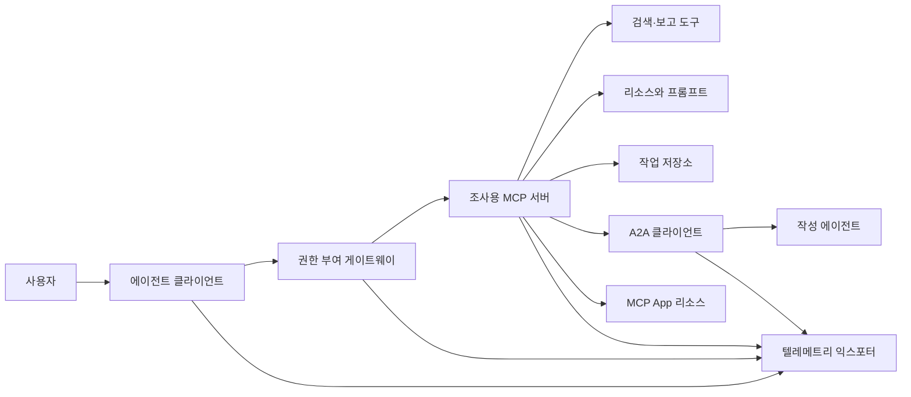
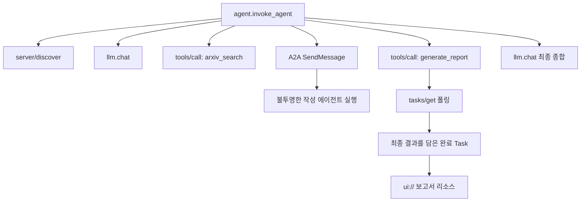
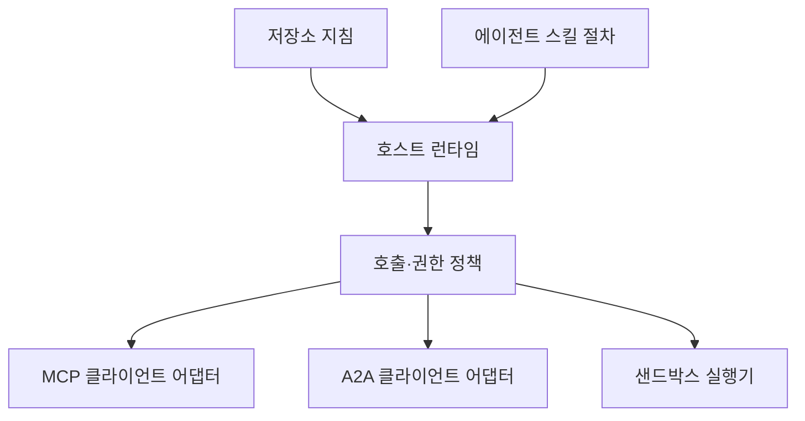

> 🇰🇷 이 문서는 한국어 번역본입니다(ELI5 스타일). 원문: [en.md](en.md)

# 캡스톤: 상태 없는(stateless) 도구 생태계

> 프로덕션(운영 환경) 에이전트 시스템은 기능 더미가 아니라 경계들의 집합입니다. 이 캡스톤은 읽기 쉬운 프로세스 내(in-process) 시뮬레이션과, 실제 배포에서 여전히 필요한 프로토콜 클라이언트·권한 부여 서버·샌드박스·텔레메트리 익스포터를 분리합니다.

**유형:** 빌드(Build)
**언어:** Python(표준 라이브러리, 프로세스 내 시뮬레이션)
**선수 지식:** 페이즈 13 · 01~22, MCP 개정판 `2026-07-28` 기준
**시간:** 약 120분

## 학습 목표

- 도구 호출, task 형태의 결과, 위임된 작업, UI 리소스, 권한 부여 정책, 트레이스 레코드를 하나의 흐름으로 엮습니다.
- 연결 세션에 의존하는 대신, 모든 MCP 요청에 프로토콜 버전, 클라이언트 신원, 기능(capabilities)을 실어 보냅니다.
- 사용 전에 서버를 발견(discover)하고, 긴 작업은 공식 Tasks 확장으로 진행합니다.
- 프로토콜 모양을 한 시뮬레이션과 실제 MCP, A2A, OAuth, OpenTelemetry 구현을 구분합니다.
- 각 시뮬레이션된 경계를, 그것을 대체해야 할 프로덕션 구성 요소와 짝지어 봅니다.
- `AGENTS.md`, 에이전트 스킬, 런타임 어댑터, 도구, 보안 정책을 제 역할에 맞게 유지합니다.
- 어떤 주장이 로컬 출력으로 검증 가능하고, 어떤 주장이 실제 통합 테스트를 필요로 하는지 설명합니다.

## 문제 상황

조사-보고(research-and-report) 시스템을 설계해 봅시다. 사용자가 에이전트 프로토콜 관련 논문을 요청합니다. 시스템은 논문 카탈로그를 검색하고, 요약을 위임하고, 보고서를 생성하고, UI 리소스를 돌려주고, 시스템을 거친 경로를 기록합니다.

이 한 문장 속에 여러 독립적인 계약이 숨어 있습니다:

- 모델을 향한 도구 스키마
- 상태 없는 요청 봉투(envelope)와 서버 발견 계약
- 행위자, 스코프, 도구 신원에 대한 게이트웨이 판단
- 오래 실행되는 작업(long-running operation) 계약
- 위임 프로토콜
- 호스트-앱 브리지
- 트레이스 전파와 내보내기
- 재사용 가능한 운영 절차

`code/main.py`는 평범한 Python 함수와 딕셔너리로 이 경계들을 눈에 보이게 유지합니다. 트랜스포트를 열거나, arXiv에 접속하거나, OAuth를 수행하거나, A2A 서버를 호출하거나, MCP App을 렌더링하거나, 텔레메트리를 내보내지는 않습니다. 덕분에 시뮬레이션을 규격 준수 서비스인 것처럼 보이게 하지 않으면서도 제어 흐름을 쉽게 들여다볼 수 있습니다.

## 개념

### 목표 아키텍처



이 아키텍처는 공개된 프로토콜 패턴을 개념적으로 조합한 것입니다. 특정 제품의 내부 구현에 대한 주장이 아닙니다.

### 목표 트레이스



실제 구현에서는 모든 홉(hop)이 트레이스 컨텍스트를 전파합니다. 스팬 이름과 속성은 선택한 계측 버전이 지원하는 OpenTelemetry 시맨틱 컨벤션을 따라야 합니다. 트레이스 식별자를 공유하는 것만으로는 올바른 부모-자식 관계, 내보내기, 백엔드 수집이 증명되지 않습니다.

### 현재 프로토콜 표면

오래된 초안에서 기억해 낸 이름이 아니라 현재 프로토콜이 정의한 메서드 이름을 사용하세요:

| 경계 | 현재 표면 | 캡스톤이 시뮬레이션하는 것 |
|---|---|---|
| MCP 발견 | 필수인 `server/discover` | 버전, 기능, 서버 신원을 돌려주는 직접 함수 |
| MCP 요청 컨텍스트 | 모든 `params._meta`에 담긴 버전·기능·클라이언트 신원 | 시뮬레이션된 호출마다 전달되는 새 요청 메타데이터 |
| MCP 도구 호출 | `tools/call` | Python 함수 직접 디스패치 |
| MCP 작업 폴링 | `tasks/get`을 갖춘 `io.modelcontextprotocol/tasks` | 작업 핸들, 그 뒤에 최종 결과를 담은 완료 작업 |
| A2A 위임 | gRPC와 JSON-RPC의 `SendMessage`, HTTP+JSON의 `POST /message:send` | 원격 호출이나 인위적 지연 없는 중첩 스팬 하나 |
| MCP App이 서버 도구 호출 | `app.callServerTool({ name, arguments })` | 실제 브리지 없는 HTML 문자열 |
| OAuth 권한 부여 | 권한 부여 서버, 보호 리소스 메타데이터, 오디언스·스코프 검증 | 정적 토큰 조회와 스코프 멤버십 |
| OpenTelemetry | SDK, 전파자(propagator), 익스포터, 컬렉터 또는 백엔드 | 메모리 안의 스팬 딕셔너리 |

프로토콜 이름은 첫 번째 계층일 뿐입니다. 프로덕션 테스트는 직렬화, 인증 실패, 취소, 타임아웃, 재시도, 버전 호환성을 실제 와이어(wire)를 넘어서 시험해야 합니다.

### 상태 없는 MCP가 바꾸는 통합 경계

개정판 `2026-07-28`은 프로토콜 세션과 `initialize` / `notifications/initialized` 핸드셰이크를 제거했습니다. `Mcp-Session-Id`도 사라졌습니다. 모든 요청은 다음 네임스페이스가 붙은 `_meta` 필드를 실어 보냅니다:

```json
{
  "io.modelcontextprotocol/protocolVersion": "2026-07-28",
  "io.modelcontextprotocol/clientCapabilities": {
    "extensions": {
      "io.modelcontextprotocol/tasks": {}
    }
  },
  "io.modelcontextprotocol/clientInfo": {
    "name": "capstone-client",
    "version": "1.0.0"
  }
}
```

서버는 `server/discover`를 구현해야 합니다. 일반 결과는 `resultType: "complete"`를 쓰고, 작업 핸들은 `resultType: "task"`를 씁니다. 각 결과는 `_meta.io.modelcontextprotocol/serverInfo`에서 서버를 식별해야 합니다.

작업 확장에는 `tasks/get`, `tasks/update`, `tasks/cancel`이 있습니다. 도구는 처음에 `resultType: "task"`를 돌려줄 수 있고, `tasks/get` 자체는 `resultType: "complete"`를 돌려주며, 완료된 `Task`가 최종 결과를 담고 있습니다. 예전의 `tasks/result`와 `tasks/list` 메서드는 현재 확장에 속하지 않습니다. 클라이언트는 작업 핸들을 받을 수 있는 요청에 `io.modelcontextprotocol/tasks`를 광고(advertise)해야 합니다. 그렇지 않으면 서버는 `-32021`과 함께, `extensions.io.modelcontextprotocol/tasks`를 포함해 누락된 클라이언트 기능 객체 형태의 `requiredCapabilities`를 돌려줍니다.

### 보안 자세

의도된 배포는 다중 방어(defense in depth)를 사용합니다:

- 클라이언트 유형이 요구하는 경우 PKCE를 적용한 OAuth 권한 부여
- 발급된 액세스 토큰에 리소스·오디언스 결합
- 요청된 도구와 스코프를 검사하는 게이트웨이 RBAC
- 모델이 보이는 컨텍스트 밖에 보관하는 업스트림 자격 증명
- 고정(pinning)되거나 검토된 도구 설명 매니페스트
- 신뢰할 수 없는 입력, 민감한 데이터, 결과가 큰 행동에 대한 '두 가지 규칙(Rule of Two)' 검토
- 파일시스템, 프로세스, 네트워크, 자격 증명, 리소스 한도를 스킬 바깥에서 강제하는 실행 샌드박스

데모는 정적 토큰, 스코프 검사, 설명 해시만 구현합니다. 정책 흐름을 이해하는 데는 유용하지만 보안 검증으로 삼으면 안 됩니다.

### 스킬은 절차일 뿐, 전송 수단이 아니다

에이전트 스킬은 런타임에게 조사 워크플로를 어떻게 수행할지, 어떤 도구 계약을 예상해야 하는지, 어떤 증거를 저장할지, 언제 멈춰야 하는지를 알려 줄 수 있습니다. 하지만 MCP 서버를 존재하게 하거나, A2A 호환성을 확보하거나, 스코프를 부여하거나, 샌드박스를 만들지는 못합니다.



절차가 동반 파일을 참조한다면 스킬 디렉터리 전체를 출시하세요. 이 구버전 캡스톤의 단일 파일 산출물은 코스용 청사진일 뿐, 호스트가 이식 가능한 번들을 보존한다는 증거가 아닙니다. 레슨 24~27이 전체 번들 생명주기를 만들고 테스트합니다.

### 코스 산출물 메타데이터는 로컬 어댑터다

코스 카탈로그와 설치 프로그램은 `skill-*.md`라는 이름의 단일 파일을 인식하지만, 이것은 이식 가능한 Agent Skills 패키지 계약이 아니라 저장소 관례입니다. 이 코스의 최소 프론트매터 파서는 최상위 키만 읽습니다. 그래서 이 레슨은 이식 가능한 식별 필드와 코스 카탈로그 필드를 같은 수준에 둡니다:

```yaml
---
name: ecosystem-blueprint
description: Produce a full Phase 13 ecosystem architecture for a product need.
version: "1.0.0"
phase: "13"
lesson: "23"
tags: [mcp, capstone, ecosystem, architecture, a2a, otel]
---
```

`name`과 `description`이 이식 가능한 식별 필드입니다. `version`, `phase`, `lesson`, `tags`는 코스 전용 카탈로그 확장입니다. 코스 파서는 `--tag capstone`으로 매칭할 수 있도록 `tags`를 인라인 목록으로 요구합니다.

이식 가능한 디렉터리 스킬은 문자열 값 확장 데이터를 담을 때 선택적인 `metadata` 맵을 쓸 수 있습니다. 하지만 그렇다고 `metadata`가 이 저장소의 카탈로그 스키마와 호환되는 것은 아닙니다. 이 단일 파일에서 `version`이나 `tags`를 `metadata` 아래에 중첩하면, 최소 파서는 들여쓰기된 그 키들을 건너뛰고, 카탈로그는 빈 버전을 기록하며, 태그 필터링이 산출물을 찾지 못합니다. 프로덕션 호스트는 안전한 YAML 파서를 쓰고 자신이 문서화한 스키마를 검증해야 합니다.

### 시뮬레이션 대 프로덕션

| 계층 | `code/main.py` | 프로덕션 대체물 | 필요한 증거 |
|---|---|---|---|
| 발견 | `server_discover()`와 정적 `TOOLS` | `server/discover`, 그 뒤의 캐시 인식 `tools/list` | 와이어 전송 기록, 결정론적 순서, 스키마 검증 |
| 인증 | 토큰 키 딕셔너리 | OAuth 권한 부여와 리소스 서버 검증 | 발급자, 오디언스, 스코프, 만료, 실패 테스트 |
| 권한 부여 | 스코프 멤버십 | 행위자·도구·대상·테넌트에 묶인 게이트웨이 정책 | 허용·거부 감사 사례 |
| 검색 | 정적 논문 픽스처 | 검색 API 또는 MCP 서버 | 출처 추적(provenance), 순위 매기기, 오류 테스트 |
| 작업 | 로컬 핸들과 즉시 `tasks/get` | `tasks/get`, `tasks/update`, `tasks/cancel`, TTL을 갖춘 영속적인 `io.modelcontextprotocol/tasks` 저장소 | 상태 전이, 입력, 취소, 복구 테스트 |
| 위임 | sleep과 중첩 스팬 | A2A 클라이언트와 원격 Agent Card | 계약, 타임아웃, 재시도, 불투명성 테스트 |
| 앱 | HTML 문자열과 URI | MCP Apps 리소스와 `App` 브리지 | CSP, 권한, 도구 호출, 브라우저 테스트 |
| 텔레메트리 | 메모리 안의 리스트 | OTel SDK와 익스포터 | 컬렉터 수신 확인과 trace-parent 검증 |
| 샌드박스 | 없음 | 호스트가 강제하는 격리 실행기 | 탈출, 외부 전송(egress), 시크릿, 리소스 한도 테스트 |

이 표가 인계 경계입니다. 로컬 실행이 초록불이라도, 그것은 시뮬레이션만 검증한 것입니다.

### 페이즈 13 지도

| 레슨 | 기여 |
|---|---|
| 01-05 | 도구 인터페이스, 호출, 스키마, 구조화된 결과, 결정론적 검증 |
| 06-14 | 상태 없는 MCP 요청 봉투, 발견, 트랜스포트, 리소스, 프롬프트, 확장, 앱 |
| 15-18 | 오염(poisoning) 방어, OAuth, 게이트웨이, 레지스트리, 프로덕션 인증 |
| 19 | A2A 메시지와 작업 위임 |
| 20 | OpenTelemetry GenAI 트레이스 설계 |
| 21 | 모델 제공자 라우팅 |
| 22 | 이식 가능한 스킬 계약과 런타임 경계 |

```figure
t3-capstone-chain
```

## 만들어 보기

프로세스 내 테스트 하네스를 실행합니다:

```bash
cd phases/13-tools-and-protocols/23-capstone-tool-ecosystem
python3 code/main.py
```

다섯 가지를 살펴보세요:

1. `server/discover`가 개정판 `2026-07-28`과 Tasks 확장을 광고합니다.
2. Alice는 읽기와 보고서 생성이 가능하지만, Bob의 쓰기 스코프 호출은 거부됩니다.
3. 오케스트레이터 실행 한 번에서 생긴 모든 로컬 스팬은 하나의 트레이스 식별자를 공유하고 부모 스팬 식별자를 기록합니다.
4. 보고서는 작업 핸들로 시작합니다. `tasks/get`은 완료된 작업을 돌려주고, 그 최종 결과에는 텍스트와 `ui://` 참조가 들어 있습니다.
5. 위임된 작성 에이전트는 불투명하게 남습니다. 오케스트레이터는 경계 스팬만 기록하기 때문입니다.
6. 어떤 출력도 네트워크 연결, OAuth 교환, 컬렉터 내보내기, 브라우저 렌더링, 샌드박스 실행이 일어났다고 주장하지 않습니다.

스크립트는 두 번 실행되므로 루트 트레이스 두 개가 만들어집니다. 감사 항목은 프로세스 로컬이며 다음 실행 때 초기화됩니다.

## 사용해 보기

한 번에 한 계층씩 승격시키세요:

1. `server_discover()`와 정적 도구 목록을 실제 `server/discover`와 `tools/list` 호출로 바꿉니다. 모든 요청에 버전, 신원, 기능을 실어 보내세요.
2. 정적 토큰을 권한 부여 서버와 보호 리소스 검증으로 바꿉니다.
3. `io.modelcontextprotocol/tasks` 확장을 구현하고 `tasks/get`, `tasks/update`, `tasks/cancel`, 타임아웃, TTL, 재시작 복구를 테스트합니다. `tasks/result`나 `tasks/list`는 추가하지 마세요.
4. 위임 스텁(stub)을 Agent Card를 해석하고 메시지를 보내는 A2A 클라이언트로 바꿉니다.
5. 공식 SDK로 앱을 만들고 `app.callServerTool`로 서버 도구를 호출합니다.
6. 스팬을 테스트 컬렉터로 내보내고 수신 측에서 부모-자식 관계를 검증합니다.
7. 도구와 스크립트 실행은 레슨 26의 샌드박스 계약 안에서 돌립니다.
8. 절차를 완전한 디렉터리 번들로 패키징하고 레슨 27의 릴리스 게이트를 통과합니다.

승격 단계마다 새 경계를 넘는 통합 테스트가 필요합니다. 실제 와이어가 연결됐다고 해서 하위 정책 테스트를 지우면 안 됩니다.

## 출시하기

이 레슨은 `outputs/skill-ecosystem-blueprint.md`, 즉 레거시 단일 파일 코스 산출물을 만듭니다. 이 산출물은 프리미티브, 보안, 위임, 텔레메트리, 패키징, 가장 어려운 운영 리스크를 다루는 한 페이지짜리 아키텍처를 요구합니다. 최상위 카탈로그 필드는 저장소의 실제 카탈로그·설치 프로그램 파서가 읽어 검증합니다.

디렉터리 번들이 아니기 때문에 references, scripts, assets, 평가용 픽스처를 담을 수 없습니다. 이 코스 밖에서 재사용 가능한 스킬을 출시할 때는 레슨 22와 24~27의 패키지 형식을 사용하세요.

## 연습 문제

1. `code/main.py`를 실행하세요. 출력이 증명한 사실과, 아직 통합 증거가 필요한 프로덕션 주장을 분리하세요.
2. 두 번째 정적 백엔드를 추가하고, 이름이 같은 두 도구의 충돌 규칙을 정의하세요. 그다음 두 목록을 실제 `tools/list` 호출로 바꾸세요.
3. 작성기 스텁을 A2A 테스트 서버로 바꾸세요. Agent Card, 메시지 요청, 타임아웃 경로, 반환된 산출물을 기록하세요.
4. 프로세스를 재시작해도 살아남는 작업 저장소를 추가하세요. 클라이언트가 `tasks/get`으로 재개하고, `pollIntervalMs`를 존중하며, `tasks/result` 없이도 완료된 작업의 최종 결과를 읽을 수 있음을 증명하세요.
5. 최소한의 MCP App을 만들고, 제한적인 CSP와 명시적 권한을 둔 브라우저에서 `app.callServerTool`을 검증하세요.
6. 시뮬레이션된 스팬을 OTel SDK로 로컬 컬렉터에 내보내세요. 수신 확인, 트레이스 식별자, 부모-자식 관계, 오류 상태를 검증하세요.
7. 저장소 전체 유지 보수 규칙을 위한 `AGENTS.md`와, 재사용 가능한 조사 절차를 위한 별도의 스킬 번들을 작성하세요. 어느 쪽도 도구 권한을 부여하지 않는 이유를 설명하세요.

## 핵심 용어

| 용어 | 사람들이 말하는 표현 | 실제 의미 |
|---|---|---|
| 캡스톤 | "모든 걸 다 연결했다" | 시뮬레이션 경계와 실제 경계가 명확히 구분된 단계적 통합 |
| 프로토콜 모양 시뮬레이션 | "사실상 MCP다" | 와이어 계약을 구현하지 않고 프로토콜을 닮은 로컬 데이터와 호출 |
| Tasks 확장 | "오래 걸리는 도구 호출" | 영속적인 식별자, 폴링, 클라이언트 입력, 최종 결과, 취소 의미론을 갖춘 선택적 `io.modelcontextprotocol/tasks` 생명주기 |
| 불투명 경계 | "상대 에이전트가 알아서 한다" | 호출자는 선언된 인터페이스와 산출물만 보고, 내부 추론이나 내부 상태는 보지 못함 |
| 런타임 어댑터 | "스킬 통합" | 이식 가능한 절차를 발견, 호출, 도구, 정책, 컨텍스트에 연결하는 호스트 코드 |
| 통합 증거 | "통과했다" | 실제 경계를 넘었음을 증명하는 전송 기록, 산출물, 수신 측 관측 |

## 더 읽을거리

- [MCP 규격 2026-07-28](https://modelcontextprotocol.io/specification/2026-07-28): 상태 없는 요청, 발견, 도구, 권한 부여, 트랜스포트 동작.
- [MCP 2026-07-28 주요 변경 사항](https://modelcontextprotocol.io/specification/2026-07-28/changelog): 세션 제거, 요청별 메타데이터, MRTR, 확장, 지원 중단(deprecation).
- [MCP Tasks 확장](https://tasks.extensions.modelcontextprotocol.io/specification/draft/tasks): `tasks/get`, `tasks/update`, `tasks/cancel`, 그리고 종료된 작업이 실어 오는 최종 결과.
- [MCP Apps SDK](https://github.com/modelcontextprotocol/ext-apps/blob/main/docs/overview.md): `App`과 `app.callServerTool`.
- [A2A 프로토콜](https://a2a-protocol.org/latest/): Agent Card, 메시지 전달, 작업, 산출물, 트랜스포트 바인딩.
- [OpenTelemetry GenAI 시맨틱 컨벤션](https://opentelemetry.io/docs/specs/semconv/gen-ai/): 트레이스와 속성 컨벤션.
- [Agent Skills 규격](https://agentskills.io/specification): 절차 계층이 쓰는 이식 가능한 패키지 계약.
