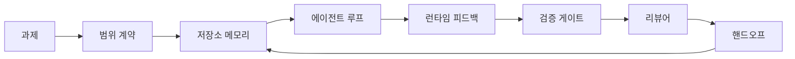

> 🇰🇷 이 문서는 한국어 번역본입니다(ELI5 스타일). 원문: [en.md](en.md)

# 에이전트 워크벤치 엔지니어링: 유능한 모델도 왜 실패하는가

> 유능한 모델만으로는 부족합니다. 신뢰할 수 있는 에이전트에는 워크벤치가 필요합니다. 지시, 상태, 범위, 피드백, 검증, 리뷰, 핸드오프. 이것들을 걷어 내면 프론티어 모델조차 출시하기에 위험한 결과물을 만들어 냅니다.

**유형:** Learn + Build(학습 + 구축)
**언어:** Python (표준 라이브러리)
**선수 지식:** 페이즈 14 · 01(에이전트 루프), 페이즈 14 · 26(실패 모드)
**시간:** 약 45분

## 학습 목표

- 모델 능력과 실행 신뢰성을 구분할 수 있습니다.
- 에이전트의 출시 여부를 결정하는 일곱 가지 워크벤치 표면(surface)을 말할 수 있습니다.
- 작은 저장소 과제에서 프롬프트만 쓴 실행과 워크벤치 안내를 받은 실행을 비교할 수 있습니다.
- 놓친 표면 각각을 그것이 유발한 증상에 매핑한 실패 모드 보고서를 만들 수 있습니다.

## 문제 상황

프론티어 모델을 실제 저장소에 넣고 입력 검증을 추가하라고 요청합니다. 모델은 파일 네 개를 열고, 그럴듯한 코드를 쓰고, 성공을 선언하고, 멈춥니다. 테스트를 돌려 봅니다. 두 개가 실패합니다. 검증과는 아무 상관 없는 파일 하나가 건드려져 있습니다. 에이전트가 무엇을 가정했는지, 무엇을 먼저 시도했는지, 무엇이 남았는지에 대한 기록도 없습니다.

모델은 Python을 틀리게 알지 못했습니다. 일(work)을 틀리게 이해한 것입니다. 무엇이 '완료'로 치환되는지, 어디에 쓰는 것이 허용되는지, 어떤 테스트가 권위 있는지, 다음 세션이 어떻게 이어받아야 하는지 전혀 몰랐던 것입니다.

이것은 모델 버그가 아닙니다. 워크벤치 버그입니다. 에이전트를 둘러싼 표면에, 한 번의 생성을 신뢰할 수 있고 이어받을 수 있는 엔지니어링으로 바꿔 주는 부품이 빠져 있는 것입니다.

## 핵심 개념

워크벤치는 과제 수행 중 모델을 감싸는 실행 환경입니다. 일곱 가지 표면을 가집니다.

| 표면 | 담는 것 | 없을 때의 실패 |
|---------|-----------------|----------------------|
| 지시(Instructions) | 시작 규칙, 금지 행동, 완료 정의 | 에이전트가 출시의 의미를 추측함 |
| 상태(State) | 현재 과제, 건드린 파일, 막힌 지점, 다음 행동 | 세션마다 제로에서 재시작 |
| 범위(Scope) | 허용 파일, 금지 파일, 수용 기준 | 편집이 무관한 코드로 샘 |
| 피드백(Feedback) | 실제 명령 출력이 루프 안으로 수집됨 | 에이전트가 400 위에서 성공을 선언 |
| 검증(Verification) | 테스트, 린트, 스모크 실행, 범위 검사 | "괜찮아 보임"이 main에 도달 |
| 리뷰(Review) | 다른 역할로 하는 두 번째 점검 | 작성자가 자기 숙제를 채점 |
| 핸드오프(Handoff) | 무엇이 바뀌었나, 왜, 무엇이 남았나 | 다음 세션이 모든 것을 재발견 |

워크벤치는 모델과 독립적입니다. 모델을 바꿔도 표면은 유지됩니다. 표면을 바꿔치기하면서 신뢰성을 유지할 수는 없습니다.



루프는 채팅 기록이 아니라 상태 파일에서 닫힙니다. 채팅은 휘발성입니다. 저장소가 기록의 시스템(system of record)입니다.

### 워크벤치 vs 프롬프트 엔지니어링

프롬프팅은 이번 턴에 모델이 원하는 것을 말해 줍니다. 워크벤치는 모델에게 턴과 세션을 넘어 일을 어떻게 수행할지 알려 줍니다. 대부분의 에이전트 실패 사례는 프롬프트 엔지니어링 옷을 입은 워크벤치 실패입니다.

### 워크벤치 vs 프레임워크

프레임워크는 런타임을 줍니다(LangGraph, AutoGen, Agents SDK). 워크벤치는 그 런타임 안에서 에이전트가 일할 자리를 줍니다. 둘 다 필요합니다. 이 미니 트랙은 두 번째 것에 관한 것입니다.

### 벤더 분류가 아니라 원시 요소(primitive)에서 추론하기

요즘 "하네스 엔지니어링"에 관한 글이 넘쳐납니다. Addy Osmani, OpenAI, Anthropic, LangChain, Martin Fowler, MongoDB, HumanLayer, Augment Code, Thoughtworks, walkinglabs awesome 목록, 그리고 Medium과 Hacker News 글들이 쉼 없이 쏟아집니다. 하네스의 경계가 무엇인지, 범위에 무엇이 들어가는지, 어떤 어휘를 쓸지 서로 의견이 분분합니다. 우리는 편을 가를 필요가 없습니다. 일곱 표면은 UX 계층이고, 모든 워크벤치 밑동에는 신뢰할 수 있는 백엔드라면 무엇이든 떠받치는 같은 분산 시스템 원시 요소들이 놓여 있습니다.

잠시 에이전트라는 라벨을 떼어 봅시다. 에이전트 실행은 시간과 프로세스와 기계를 넘나드는 연산입니다. 이것을 신뢰할 수 있게 만들려면 모든 프로덕션 시스템이 필요로 하는 것과 같은 원시 요소들이 필요합니다.

| 원시 요소 | 정의 | 에이전트에게 담당하는 것 |
|-----------|------------|------------------------------|
| 함수(Function) | 타입이 정해진 처리기. 가능하면 순수. 입력과 출력을 소유. | 도구 호출, 규칙 검사, 검증 단계, 모델 호출 |
| 워커(Worker) | 하나 이상의 함수와 생명주기를 소유하는 장수 프로세스 | 빌더, 리뷰어, 검증자, MCP 서버 |
| 트리거(Trigger) | 함수를 호출하는 이벤트 원천 | 에이전트 루프 틱, HTTP 요청, 큐 메시지, 크론, 파일 변경, 훅 |
| 런타임(Runtime) | 무엇을 어디서, 어떤 타임아웃과 자원으로 돌릴지 결정하는 경계 | Claude Code의 프로세스, LangGraph의 런타임, 워커 컨테이너 |
| HTTP / RPC | 호출자와 워커 사이의 회선 | 도구 호출 프로토콜, MCP 요청, 모델 API |
| 큐(Queue) | 트리거와 워커 사이의 내구성 버퍼. 백프레셔, 재시도, 멱등성 | 작업 보드, 피드백 로그, 리뷰 수신함 |
| 세션 영속성(Session persistence) | 크래시, 재시작, 모델 교체를 견디는 상태 | `agent_state.json`, 체크포인트, KV 저장소, 저장소 자체 |
| 인가 정책(Authorization policy) | 누가 어떤 범위로 어떤 함수를 호출할 수 있는가 | 허용/금지 파일, 승인 경계, MCP 기능 목록 |

이제 일곱 워크벤치 표면을 이 원시 요소들에 대응시켜 봅시다.

- **지시** — 정책 + 함수 메타데이터. 규칙은 검사(함수)입니다. 라우터(`AGENTS.md`)는 런타임 시작에 붙는 정책입니다.
- **상태** — 세션 영속성. 런타임이 매 단계 읽는 키 기반 저장소입니다. 파일이든 KV든 DB든, 영속성 의미론이 중요하지 저장소 백엔드는 중요하지 않습니다.
- **범위** — 과제별 인가 정책. 허용/금지 글롭(glob)은 ACL입니다. 승인 요구는 권한 격자(lattice)입니다.
- **피드백** — 큐에 기록되는 호출 로그. 모든 셸 호출은 기록으로, 내구성 있고 재생 가능합니다.
- **검증** — 하나의 함수. 입력에 대해 결정론적. 과제 종료 시 발동. 실패 시 닫힘(fails closed).
- **리뷰** — 빌더 산출물에 읽기 전용 권한, 리뷰 보고서에 쓰기 전용 권한을 가진 별도의 워커.
- **핸드오프** — 세션 종료 트리거가 내놓는 내구성 기록. 다음 세션의 시작 트리거가 그것을 읽습니다.

에이전트 루프 자체는 이벤트(사용자 메시지, 도구 결과, 타이머 틱)를 소비하고, 함수(모델, 그다음 모델이 고른 도구들)를 호출하고, 기록(상태, 피드백)을 쓰고, 트리거(검증, 리뷰, 핸드오프)를 내보내는 워커입니다. 신비가 아닙니다. 작업 처리기(job processor)와 같은 모양입니다.

### 유통 중인 패턴들, 원시 요소로 번역하면

유명한 하네스 패턴은 모두 여덟 원시 요소로 환원됩니다. 번역표입니다.

| 벤더 또는 커뮤니티 패턴 | 실제 정체 |
|------------------------------|--------------------|
| Ralph Loop (Claude Code, Codex, agentic_harness 책) — 에이전트가 조기 종료하려 하면 원래 의도를 새 컨텍스트 윈도우에 재주입 | 깨끗한 컨텍스트로 과제를 다시 큐에 넣는 트리거. 세션 영속성이 목표를 앞으로 운반 |
| Plan / Execute / Verify (PEV) | 역할당 하나씩 세 워커가 상태와 단계 간 큐로 통신 |
| 하네스-연산 분리(OpenAI Agents SDK, 2026년 4월) — 컨트롤 플레인을 실행 플레인에서 분리 | 컨트롤 플레인 / 데이터 플레인의 재진술. 에이전트 라벨보다 수십 년 앞선 아이디어 |
| Open Agent Passport (OAP, 2026년 3월) — 실행 전에 선언적 정책으로 모든 도구 호출에 서명하고 감사 | 사전 행동 워커가 강제하는 인가 정책 + 서명된 감사 큐 |
| 가이드와 센서(Birgitta Böckeler / Thoughtworks) — 순방향 피드 규칙 + 피드백 관측 가능성 | 인가 정책 + 검증 함수 + 관측 가능성 트레이스 |
| 5단계 점진적 압축(Claude Code 리버스 엔지니어링, 2026년 4월) | 세션 영속성 위를 크론처럼 돌며 예산 안에 유지하는 상태 관리 워커 |
| 훅 / 미들웨어(LangChain, Claude Code) — 모델과 도구 호출을 가로챔 | 런타임 호출 경로를 감싼 트리거 + 함수 |
| 점진적 공개가 있는 Markdown 스킬(Anthropic, Flue) | 함수 메타데이터를 필요할 때(just-in-time) 컨텍스트로 싣는 함수 레지스트리 |
| 샌드박스 에이전트(Codex, Sandcastle, Vercel Sandbox) | 연산 플레인: 격리된 파일시스템, 네트워크, 생명주기를 가진 런타임 |
| MCP 서버 | 안정적인 RPC 위로 함수를 노출하고 기능 목록을 인가로 쓰는 워커 |

이 표의 모든 항목은, 분산 시스템에 이미 이름이 있던 원시 요소에 에이전트 커뮤니티가 새 이름을 붙여 준 것입니다. 마케팅용 라벨로는 유용하지만, 엔지니어링 어휘로는 쓸모가 없습니다.

### 근거 자료가 실제로 말하는 것

하네스가 모델을 이긴다는 주장에는 이제 숫자가 뒷받침됩니다. 알아 둘 가치가 있습니다. 왜냐하면 이 숫자들이 "더 똑똑한 모델만 기다리자"는 주장에 대한 유일하게 정직한 반박이기도 하기 때문입니다.

- Terminal Bench 2.0 — 같은 모델에서 하네스만 바꿨더니 코딩 에이전트가 30위권 밖에서 5위로 올라왔습니다(LangChain, *Anatomy of an Agent Harness*).
- Vercel — 에이전트의 도구 80%를 삭제하자 성공률이 80%에서 100%로 뛰었습니다(MongoDB).
- Harvey — 법률 에이전트의 정확도가 하네스 최적화만으로 두 배 이상 올라갔습니다(MongoDB).
- 기업 AI 에이전트 프로젝트의 88%가 프로덕션에 도달하지 못합니다. 실패는 추론이 아니라 런타임 주변에 몰려 있습니다(preprints.org, *Harness Engineering for Language Agents*, 2026년 3월).
- 2025년의 한 벤치마크 연구는 인기 오픈 소스 프레임워크 세 개에서 약 50%의 과제 완수율을 보고했고, long-context WebAgent는 장문 컨텍스트 조건에서 40~50%에서 10% 미만으로 무너졌습니다. 대부분 무한 루프와 목표 상실 때문이었습니다(2026년 초 글들에서 널리 다룸).

교훈은 "하네스가 영원히 이긴다"가 아닙니다. 모델은 시간이 지나면 하네스 트릭을 흡수합니다. 교훈은 이렇습니다. 오늘날 하중을 떠받치는 엔지니어링은 모델 안이 아니라 모델 주변에 있고, 그 하중을 떠받치는 원시 요소들은 모든 프로덕션 시스템이 늘 필요해 온 바로 그것들입니다.

### 벤더 글이 멈추는 지점

여기부터는 예의를 차릴 필요가 없습니다.

- LangChain의 *Anatomy of an Agent Harness*는 열한 가지 구성 요소(프롬프트, 도구, 훅, 샌드박스, 오케스트레이션, 메모리, 스킬, 서브에이전트, 그리고 "멍청한 루프" 런타임)를 나열합니다. 하지만 큐, 배포 단위로서의 워커, 트리거 의미론, 별도 관심사로서의 세션 영속성, 인가 정책은 이름조차 하지 않습니다. 하네스를 설정하는 객체로 취급하지, 배포하는 시스템으로 취급하지 않습니다.
- Addy Osmani의 *Agent Harness Engineering*은 `Agent = Model + Harness` 프레임과 래칫 패턴을 제시하지만, 하네스가 무엇으로 만들어지는지 말하기 직전에 멈춥니다. 스펙이 아니라 태도로 읽힙니다.
- Anthropic과 OpenAI는 표면에 대해서는 가장 깊이 들어가지만 자기들 런타임 안에 머뭅니다. 2026년 4월 Agents SDK의 "하네스-연산 분리" 발표는 컨트롤 플레인 / 데이터 플레인 분리를 명시적으로 지지한 최초의 벤더 글입니다. 그것은 원시 요소적 아이디어지, 새로운 것이 아닙니다.
- agentic_harness 책은 하네스를 설정 객체로 취급하고(Jaymin West의 *Agentic Engineering*, 6장), 그 안에서 가장 강한 문장은 "하네스는 에이전트 시스템의 제1 보안 경계다"입니다. 그것은 그저 인가 정책을 다시 말한 것입니다.
- Hacker News 스레드들은 같은 결론에 반복해서 도착합니다. 2026년 4월 스레드 *The agent harness belongs outside the sandbox*는 하네스가 "모든 것 바깥에 앉아 컨텍스트와 사용자에 따라 접근을 허가하는 하이퍼바이저처럼" 있어야 한다고 주장합니다. 이것 역시 별개 플레인으로서의 인가 정책입니다.

이 글들 어느 것에도 반박할 필요 없이 틈을 알아차릴 수 있습니다. 그들은 이미 존재하는 시스템의 UX 설명을 쓰고 있습니다. 우리는 시스템 자체를 씁니다. 시스템이 올바르게 만들어지면 일곱 표면은 원시 요소들에서 저절로 나옵니다. 잘못 만들어지면 `AGENTS.md`를 아무리 다듬어도 빠진 큐는 고쳐지지 않습니다.

그러니 다른 곳에서 "하네스 엔지니어링"을 들으면 원시 요소로 번역하세요. 프롬프트와 규칙은 정책과 함수입니다. 스캐폴딩은 런타임입니다. 가드레일은 인가 + 검증입니다. 훅은 트리거입니다. 메모리는 세션 영속성입니다. Ralph Loop는 재큐잉입니다. 서브에이전트는 워커입니다. 샌드박스는 연산 플레인입니다. 어휘는 바뀌지만 엔지니어링은 바뀌지 않습니다. 워크벤치는 에이전트가 보는 UX이고, 다음 벤더 리프레임 이후에도 살아남는 의미의 하네스는, 올바르게 연결된 함수와 워커와 트리거와 런타임과 큐와 영속성과 정책입니다.

```figure
wb-seven-surfaces
```

## 만들어 보기

`code/main.py`는 아주 작은 저장소 과제를 두 번 실행합니다. 처음엔 프롬프트만으로, 그다음엔 일곱 표면을 연결한 채로. 같은 모델, 같은 과제. 스크립트는 실패한 실행에서 어떤 표면이 빠졌는지 세어 실패 모드 보고서를 출력합니다.

저장소 과제는 의도적으로 작습니다. 파일 하나짜리 FastAPI 스타일 핸들러에 입력 검증을 추가하고 통과하는 테스트를 작성하는 것입니다.

실행 방법:

```
python3 code/main.py
```

출력: 두 실행의 나란히 놓인 로그, 프롬프트 전용 실행을 요약한 `failure_modes.json`, 그리고 워크벤치 실행에 대한 한 줄 판정.

에이전트는 작은 규칙 기반 스텁입니다. 요점은 모델이 아니라 표면입니다. 이 미니 트랙의 나머지에서는 각 표면을 실제로 재사용 가능한 산출물로 다시 만들게 됩니다.

## 활용하기

워크벤치 표면이 이미 존재하는 세 곳입니다. 아무도 그렇게 부르지 않을 뿐입니다.

- **Claude Code, Codex, Cursor.** `AGENTS.md`와 `CLAUDE.md`가 지시 표면입니다. 슬래시 명령이 범위입니다. 훅이 검증입니다.
- **LangGraph, OpenAI Agents SDK.** 체크포인트와 세션 저장소가 상태 표면입니다. 핸드오프가 핸드오프 표면입니다.
- **실제 저장소의 CI.** 테스트, 린트, 타입 검사가 검증입니다. PR 템플릿이 핸드오프입니다. CODEOWNERS가 리뷰입니다.

워크벤치 엔지니어링은 이 표면들을 명시적이고 재사용 가능하게 만드는 학문입니다. 팀마다 다시 발견하게 두는 대신에요.

## 출시하기

`outputs/skill-workbench-audit.md`는 기존 저장소를 일곱 워크벤치 표면 기준으로 감사하고, 무엇이 빠졌고 무엇이 부분적이고 무엇이 건강한지 보고하는 휴대용 스킬입니다. 어떤 에이전트 설정 옆에든 놓으면 무엇을 먼저 고쳐야 하는지 알려 줍니다.

## 연습 문제

1. 이미 에이전트를 돌리는 저장소를 하나 고르세요. 일곱 표면을 0(없음)부터 2(건강)까지 채점해 보세요. 가장 약한 표면은 무엇인가요?
2. `main.py`를 확장해 프롬프트 전용 실행도 가짜 "성공" 주장을 내놓게 해 보세요. 검증 게이트가 그것을 잡았을지 확인합니다.
3. 여러분의 제품에 여덟 번째 표면을 추가해 보세요. 기존 일곱 개 중 하나로 환원되지 않는 이유를 정당화하세요.
4. 없는 파일 쓰기를 환각하는 다른 스텁 에이전트로 스크립트를 다시 실행해 보세요. 어떤 표면이 가장 먼저 잡아 내나요?
5. 페이즈 14 · 26의 업계 반복 실패 모드 다섯 가지를 일곱 표면에 매핑해 보세요. 각 표면은 어떤 모드를 흡수하도록 설계되었나요?

## 핵심 용어

| 용어 | 사람들이 말하는 표현 | 실제 의미 |
|------|----------------|------------------------|
| 워크벤치 | "그 설정" | 일을 신뢰할 수 있게 만드는, 모델 주변의 설계된 표면들 |
| 표면 | "문서" 또는 "스크립트" | 에이전트가 매 턴 읽거나 쓰는 이름 붙은 기계 판독 가능 입력 |
| 기록의 시스템 | "그 메모들" | 채팅 기록이 사라졌을 때 에이전트가 진실로 취급하는 파일 |
| 완료 정의 | "수용 기준" | 에이전트가 조작할 수 없는 객관적이고 파일에 근거한 체크리스트 |
| 워크벤치 감사 | "저장소 준비도 점검" | 작업 시작 전에 빠진 부분을 표시하는 일곱 표면 점검 |

## 더 읽을거리

이것들을 권위가 아니라 데이터 포인트로 읽으세요. 각각은 부분적인 분류 체계입니다. 채택 여부를 결정하기 전에 모든 개념을 원시 요소(함수, 워커, 트리거, 런타임, HTTP/RPC, 큐, 영속성, 정책)로 되번역하세요.

벤더 프레이밍:

- [Addy Osmani, Agent Harness Engineering](https://addyosmani.com/blog/agent-harness-engineering/) — `Agent = Model + Harness`와 래칫 패턴. 인프라가 얕음
- [LangChain, The Anatomy of an Agent Harness](https://blog.langchain.com/the-anatomy-of-an-agent-harness/) — 열한 구성 요소: 프롬프트, 도구, 훅, 오케스트레이션, 샌드박스, 메모리, 스킬, 서브에이전트, 런타임. 큐, 배포, 인가가 빠짐
- [OpenAI, Harness engineering: leveraging Codex in an agent-first world](https://openai.com/index/harness-engineering/) — Codex 팀이 보는 자기 런타임 주변의 표면
- [OpenAI, Unrolling the Codex agent loop](https://openai.com/index/unrolling-the-codex-agent-loop/) — 함수 호출 위의 `while`로 환원된 에이전트 루프
- [Anthropic, Effective harnesses for long-running agents](https://www.anthropic.com/engineering/effective-harnesses-for-long-running-agents) — 특정 런타임 안의 장기 표면
- [Anthropic, Harness design for long-running application development](https://www.anthropic.com/engineering/harness-design-long-running-apps) — 적용 설계 노트
- [LangChain Deep Agents harness capabilities](https://docs.langchain.com/oss/python/deepagents/harness) — 런타임 설정 표면

쓸 만한 세부 사항이 있는 실무자 글:

- [Martin Fowler / Birgitta Böckeler, Harness engineering for coding agent users](https://martinfowler.com/articles/harness-engineering.html) — 가이드(순방향 피드) + 센서(피드백). 가장 깔끔한 제어 이론 프레임
- [HumanLayer, Skill Issue: Harness Engineering for Coding Agents](https://www.humanlayer.dev/blog/skill-issue-harness-engineering-for-coding-agents) — "모델 문제가 아니라 설정 문제다"
- [MongoDB, The Agent Harness: Why the LLM Is the Smallest Part of Your Agent System](https://www.mongodb.com/company/blog/technical/agent-harness-why-llm-is-smallest-part-of-your-agent-system) — 근거 자료: Vercel 80%→100%, Harvey 정확도 2배, Terminal Bench 30위권 밖→5위
- [Augment Code, Harness Engineering for AI Coding Agents](https://www.augmentcode.com/guides/harness-engineering-ai-coding-agents) — 제약 우선 워크스루
- [Sequoia 팟캐스트, Harrison Chase on Context Engineering Long-Horizon Agents](https://sequoiacap.com/podcast/context-engineering-our-way-to-long-horizon-agents-langchains-harrison-chase/) — 모델 관심사보다 런타임 관심사

책, 논문, 참조 구현:

- [Jaymin West, Agentic Engineering — Chapter 6: Harnesses](https://www.jayminwest.com/agentic-engineering-book/6-harnesses) — 책 한 권 분량의 다룸. 하네스를 제1 보안 경계로 취급
- [preprints.org, Harness Engineering for Language Agents (2026년 3월)](https://www.preprints.org/manuscript/202603.1756) — 제어 / 에이전시 / 런타임으로 프레임한 학술적 접근
- [walkinglabs/awesome-harness-engineering](https://github.com/walkinglabs/awesome-harness-engineering) — 컨텍스트, 평가, 관측 가능성, 오케스트레이션을 아우르는 큐레이션 목록
- [ai-boost/awesome-harness-engineering](https://github.com/ai-boost/awesome-harness-engineering) — 대안 큐레이션 목록(도구, 평가, 메모리, MCP, 권한)
- [andrewgarst/agentic_harness](https://github.com/andrewgarst/agentic_harness) — Redis 기반 메모리와 평가 스위트를 갖춘 프로덕션 수준 참조 구현
- [HKUDS/OpenHarness](https://github.com/HKUDS/OpenHarness) — 개인 에이전트가 내장된 오픈 에이전트 하네스

Hacker News 스레드 — 합의보다는 논쟁을 위해 읽을 만한 것들:

- [HN: Effective harnesses for long-running agents](https://news.ycombinator.com/item?id=46081704)
- [HN: Improving 15 LLMs at Coding in One Afternoon. Only the Harness Changed](https://news.ycombinator.com/item?id=46988596)
- [HN: The agent harness belongs outside the sandbox](https://news.ycombinator.com/item?id=47990675) — 별개 플레인으로서의 인가를 주장

이 커리큘럼 내부의 교차 참조:

- 페이즈 14 · 23 — OpenTelemetry GenAI 컨벤션: 센서 문헌이 가리키는 관측 가능성 계층
- 페이즈 14 · 26 — 일곱 표면이 흡수하도록 설계된 실패 모드 목록
- 페이즈 14 · 27 — 인가 정책 원시 요소에 자리하는 프롬프트 인젝션 방어
- 페이즈 14 · 29 — 프로덕션 런타임(큐, 이벤트, 크론): 이 레슨의 원시 요소들이 배포에서 사는 곳
