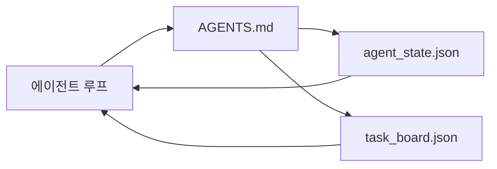

> 🇰🇷 이 문서는 한국어 번역본입니다(ELI5 스타일). 원문: [en.md](en.md)

# 최소 에이전트 워크벤치

> 가장 작으면서도 쓸모 있는 워크벤치는 세 파일입니다. 루트 지시 라우터, 상태 파일, 작업 보드. 나머지는 전부 그 위에 얹습니다. 이 세 가지를 담지 못하는 저장소는 어떤 모델도 구원하지 못합니다.

**유형:** Build(구축)
**언어:** Python (표준 라이브러리)
**선수 지식:** 페이즈 14 · 31(유능한 모델도 왜 실패하는가)
**시간:** 약 45분

## 학습 목표

- 최소 실행 가능 워크벤치를 이루는 세 파일을 정의할 수 있습니다.
- 긴 모놀리식 `AGENTS.md`보다 짧은 루트 라우터가 나은 이유를 설명할 수 있습니다.
- 에이전트가 매 턴 읽고 마지막에 쓰는 상태 파일을 만들 수 있습니다.
- 채팅 기록 없이도 다중 세션 작업을 견디는 작업 보드를 만들 수 있습니다.

## 문제 상황

많은 팀은 3000줄짜리 `AGENTS.md`를 쓰고 "끝났다"고 선언하며 워크벤치를 시작합니다. 모델은 그것을 읽어 들인 뒤 요약할 수 없는 부분을 무시하고, 늘 실패하던 바로 그 표면에서 또 실패합니다.

반대가 필요합니다. 관련 있을 때만 에이전트를 더 깊은 파일로 안내하는 아주 작은 루트 파일. 행동 전에 읽고 행동 후에 쓰는 내구성 있는 상태. 무엇이 진행 중이고 무엇이 막혔고 무엇이 다음인지 말해 주는 작업 보드.

세 개의 파일. 각각에 맡은 일이 있습니다. 각각은 나중에 진짜 시스템으로 진화할 만큼 기계 판독 가능합니다.

## 핵심 개념



### AGENTS.md는 설명서가 아니라 라우터다

좋은 `AGENTS.md`는 짧습니다. 에이전트가 다음을 가리키게 합니다.

- 상태 파일(지금 어디에 있는가).
- 작업 보드(무엇이 남았는가).
- 더 깊은 규칙(`docs/agent-rules.md` 아래).
- 검증 명령(동작한다는 것을 어떻게 아는가).

그보다 긴 내용은 더 깊은 문서로 가고, 필요할 때만 읽힙니다. 긴 설명서는 무시됩니다. 짧은 라우터는 지켜집니다.

### agent_state.json은 기록의 시스템이다

상태가 담는 것: 활성 과제 id, 건드린 파일, 세운 가정, 막힌 지점, 다음 행동. 에이전트는 매 턴 이것을 읽습니다. 다음 세션은 채팅을 재생하는 대신 이것을 읽습니다.

상태가 파일에 사는 이유는 채팅 기록이 불안정하기 때문입니다. 세션은 죽고, 대화는 잘려 나갑니다. 파일은 그렇지 않습니다.

### task_board.json은 큐다

작업 보드는 상태가 `todo | in_progress | done | blocked`인 모든 과제를 담습니다. 상태가 비었을 때 에이전트가 꺼내 쓰는 큐이자, 에이전트가 순조로운지 알고 싶을 때 여러분이 읽는 큐입니다.

보드 위의 과제에는 id, 목표, 소유자(`builder`, `reviewer`, 또는 `human`), 수용 기준이 있습니다. 보드는 의도적으로 작게 유지합니다. 한 화면을 넘어 커지면 보드 문제가 아니라 계획 문제입니다.

### 세 파일은 바닥이지 천장이 아니다

이후 레슨들은 범위 계약, 피드백 러너, 검증 게이트, 리뷰어 체크리스트, 핸드오프 패킷을 추가합니다. 여기의 세 파일은 그 모든 것이 전제하는 기반입니다.

```figure
wb-three-files
```

## 만들어 보기

`code/main.py`는 빈 저장소에 최소 워크벤치를 쓰고, 다음을 수행하는 에이전트 턴 하나를 시연합니다.

1. `agent_state.json`을 읽습니다.
2. 상태가 비었으면 `task_board.json`에서 다음 과제를 꺼냅니다.
3. 범위 안의 파일 하나만 건드립니다.
4. 갱신된 상태를 다시 씁니다.

실행 방법:

```
python3 code/main.py
```

스크립트는 자기 자신 옆에 `workdir/`를 만들고, 세 파일을 깔고, 턴 하나를 돌리고, diff를 출력합니다. 다시 실행하면 두 번째 턴이 첫 번째 턴이 끝난 지점에서 이어받는 것을 볼 수 있습니다.

## 활용하기

프로덕션 에이전트 제품 안에서 같은 세 파일이 다른 이름으로 나타납니다.

- **Claude Code:** 라우터는 `AGENTS.md`나 `CLAUDE.md`, 상태는 `.claude/state.json` 스타일 저장소, 보드는 훅.
- **Codex / Cursor:** 라우터는 워크스페이스 규칙, 상태는 세션 메모리, 보드는 채팅 사이드바의 대기 중 과제.
- **커스텀 Python 에이전트:** 방금 여러분이 쓴 그 파일들.

이름은 바뀌어도 모양은 바뀌지 않습니다.

## 실전에서 쓰이는 패턴

최소 워크벤치는 위에 세 가지 패턴을 얹으면 실제 모노레포와의 접촉에서도 살아남습니다. 패턴들은 서로 독립적이므로, 저장소에 실제로 필요한 것만 고르세요.

**가장 가까운 파일이 이기는 우선순위의 중첩 `AGENTS.md`.** OpenAI는 자사 메인 저장소에 하위 구성 요소당 하나씩, 총 88개의 `AGENTS.md`를 배포합니다. Codex, Cursor, Claude Code, Copilot 모두 작업 파일에서 저장소 루트 방향으로 올라가며 만나는 모든 `AGENTS.md`를 이어 붙입니다. 하위 디렉터리 파일은 루트 파일을 확장합니다. Codex는 확장이 아니라 교체를 위한 `AGENTS.override.md`를 추가합니다. 이 오버라이드 방식은 Codex 전용이므로 크로스 도구 작업에서는 피하세요. Augment Code의 측정이 핵심 문장입니다. 좋은 `AGENTS.md`는 Haiku에서 Opus로 업그레이드하는 것에 버금가는 품질 점프를 주고, 나쁜 `AGENTS.md`는 파일이 아예 없을 때보다 출력을 나쁘게 만듭니다.

**커버리지처럼 보여도 거절해야 할 안티패턴.** 서로 충돌하는 지시는 에이전트를 조용히 인터랙티브 모드에서 탐욕(greedy) 모드로 떨어뜨립니다(ICLR 2026 AMBIG-SWE: 해결률 48.8% → 28%). 우선순위를 평평하게 쌓지 말고 숫자로 매기세요. 강제 명령 없는 검증 불가능한 스타일 규칙("Google Python Style Guide를 따르세요")은 에이전트가 준수를 지어내게 합니다. 스타일 규칙마다 정확한 린트 명령을 붙이세요. 명령 대신 스타일로 시작하면 검증 경로가 묻힙니다. 명령이 먼저, 스타일은 마지막에. 인간을 위해 쓴 글은 컨텍스트 예산을 낭비합니다. 간결함은 기능입니다.

**크로스 도구 심볼릭 링크.** 심볼릭 링크가 붙은 루트 파일 하나(`ln -s AGENTS.md CLAUDE.md`, `ln -s AGENTS.md .github/copilot-instructions.md`, `ln -s AGENTS.md .cursorrules`)면 모든 코딩 에이전트가 같은 진실 원천을 보게 됩니다. Nx의 `nx ai-setup`은 단일 설정에서 Claude Code, Cursor, Copilot, Gemini, Codex, OpenCode 전반에 이를 자동화합니다.

## 출시하기

`outputs/skill-minimal-workbench.md`는 새 저장소에 세 파일 워크벤치를 만들어 줍니다. 프로젝트에 맞춰 조율된 `AGENTS.md` 라우터, 올바른 키를 가진 `agent_state.json`, 현재 백로그로 채워진 `task_board.json`.

## 연습 문제

1. `agent_state.json`에 `last_run` 타임스탬프를 추가해 보세요. 파일이 24시간보다 오래되면 운영자가 확인하지 않는 한 실행을 거절합니다.
2. 작업 보드에 `priority` 필드를 추가하고, 꺼내는 쪽이 항상 최고 우선순위의 `todo`를 고르게 바꿔 보세요.
3. `task_board.json`을 JSON Lines로 옮겨 보세요. 과제마다 한 줄이 되어 버전 관리에서 diff가 깔끔해집니다.
4. `AGENTS.md`가 80줄을 넘거나 존재하지 않는 파일을 참조하면 실패하는 `lint_workbench.py`를 작성해 보세요.
5. 세 파일 중 하나를 잃었을 때 가장 아플 것은 어느 것인지 정해 보세요. 근거를 대세요.

## 핵심 용어

| 용어 | 사람들이 말하는 표현 | 실제 의미 |
|------|----------------|------------------------|
| 라우터 | `AGENTS.md` | 에이전트를 더 깊은 문서와 파일로 안내하는 짧은 루트 파일 |
| 상태 파일 | "그 메모들" | 에이전트가 어디에 있는지 매 턴 기록하는 기계 판독 가능 기록 |
| 작업 보드 | "백로그" | 상태, 소유자, 수용 기준을 갖춘 JSON 큐 |
| 기록의 시스템 | "진실 원천" | 채팅이 사라졌을 때 워크벤치가 권위로 취급하는 파일 |

## 더 읽을거리

- [agents.md — 오픈 스펙](https://agents.md/) — Cursor, Codex, Claude Code, Copilot, Gemini, OpenCode가 채택
- [Augment Code, A good AGENTS.md is a model upgrade. A bad one is worse than no docs at all](https://www.augmentcode.com/blog/how-to-write-good-agents-dot-md-files) — 측정된 품질 점프
- [Blake Crosley, AGENTS.md Patterns: What Actually Changes Agent Behavior](https://blakecrosley.com/blog/agents-md-patterns) — 경험적으로 무엇이 통하고 무엇이 안 통하는가
- [Datadog Frontend, Steering AI Agents in Monorepos with AGENTS.md](https://dev.to/datadog-frontend-dev/steering-ai-agents-in-monorepos-with-agentsmd-13g0) — 실전의 중첩 우선순위
- [Nx Blog, Teach Your AI Agent How to Work in a Monorepo](https://nx.dev/blog/nx-ai-agent-skills) — 여섯 도구를 아우르는 단일 원천 생성
- [The Prompt Shelf, AGENTS.md Best Practices: Structure, Scope, and Real Examples](https://thepromptshelf.dev/blog/agents-md-best-practices/) — 리뷰를 견디는 섹션 순서
- [Anthropic, Claude Code subagents](https://code.claude.com/docs/en/sub-agents)
- 페이즈 14 · 31 — 이 최소 구성이 흡수하는 실패 모드
- 페이즈 14 · 34 — 이 레슨이 미리 보여 주는 내구성 상태 스키마
