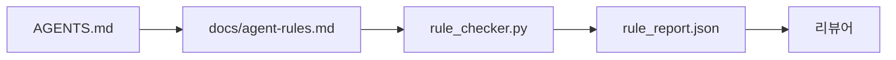

> 🇰🇷 이 문서는 한국어 번역본입니다(ELI5 스타일). 원문: [en.md](en.md)

# 실행 가능한 제약으로서의 에이전트 지시

> 산문으로 쓰인 지시는 소원입니다. 제약으로 쓰인 지시는 테스트입니다. 워크벤치는 각 규칙을, 에이전트가 런타임에 점검할 수 있고 리뷰어가 사후에 검증할 수 있는 무언가로 바꿉니다.

**유형:** Build(구축)
**언어:** Python (표준 라이브러리)
**선수 지식:** 페이즈 14 · 32(최소 워크벤치)
**시간:** 약 50분

## 학습 목표

- 안내용 산문과 운영 규칙을 구분할 수 있습니다.
- 시작 규칙, 금지 행동, 완료 정의, 불확실성 처리, 승인 경계를 기계 검증 가능한 제약으로 표현할 수 있습니다.
- 실행 결과를 규칙 집합 기준으로 채점하는 규칙 검사기를 구현할 수 있습니다.
- 규칙 집합을 diff에 친화적으로 만들어 리뷰에서 무엇이 바뀌었는지 볼 수 있게 합니다.

## 문제 상황

전형적인 `AGENTS.md`는 온보딩 문서처럼 읽힙니다. 에이전트에게 "조심하라", "철저히 테스트하라", "확실하지 않으면 물어라"고 말합니다. 사흘 뒤, 에이전트는 테스트 없는 변경을 출시하고, 금지된 디렉터리에 쓰고, 선이 어디인지 몰랐기 때문에 한 번도 묻지 않습니다.

지시는 운영적일 때 강하고, 포부적일 때 약합니다. 해법은 워크벤치가 해석할 수 있고 리뷰어가 채점할 수 있는 규칙을 쓰는 것입니다.

## 핵심 개념

규칙은 짧은 루트 라우터에서 떨어진 `docs/agent-rules.md`에 삽니다. 각 규칙에는 이름, 카테고리, 검사(check)가 있습니다.



### 대부분의 규칙을 커버하는 다섯 카테고리

| 카테고리 | 규칙이 답하는 질문 | 예 |
|----------|---------------------------|---------|
| 시작(Startup) | 작업 시작 전에 참이어야 하는 것은? | "상태 파일이 존재하고 최신임" |
| 금지(Forbidden) | 절대 일어나면 안 되는 것은? | "`scripts/release.sh` 편집 금지" |
| 완료 정의 | 무엇이 과제 완료를 증명하는가? | "pytest 종료 코드 0, 수용 항목 통과" |
| 불확실성 | 확신이 없을 때 에이전트는 무엇을 하는가? | "추측 대신 질문 노트를 열어라" |
| 승인(Approval) | 무엇이 인간 승인을 요구하는가? | "모든 새 의존성, 모든 프로덕션 쓰기" |

이 다섯 가지에 맞지 않는 규칙은 보통 두 규칙이 되길 원하는 것입니다. 분할을 강제하세요.

### 규칙은 기계 판독 가능하다

각 규칙에는 슬러그, 카테고리, 한 줄 설명, 그리고 `rule_checker.py`의 함수 이름을 가리키는 `check` 필드가 있습니다. 규칙을 추가한다는 것은 검사를 추가한다는 뜻이고, 검사기는 워크벤치와 함께 자랍니다.

### 규칙은 diff에 친화적이다

규칙은 단일 마크다운 파일에 제목 하나당 하나씩 삽니다. 이름 변경은 diff에 드러납니다. 새 규칙은 자기 카테고리의 맨 위에 놓입니다. 낡은 규칙은 주석 처리하지 말고 삭제합니다. 워크벤치가 진실 원천이지, 지난 분기 팀 분위기를 기록한 채팅 로그가 아니기 때문입니다.

### 규칙 vs 프레임워크 가드레일

프레임워크 가드레일(OpenAI Agents SDK 가드레일, LangGraph 인터럽트)은 런타임 수준에서 규칙을 강제합니다. 이 레슨의 규칙 집합은 그런 가드레일이 구현하는, 사람이 읽고 검토할 수 있는 계약입니다. 둘 다 필요합니다. 런타임은 턴 도중 위반을 잡고, 규칙 집합은 런타임이 올바른 일을 하고 있음을 증명합니다.

### 점진적 공개: 백과사전이 아니라 지도

`AGENTS.md`가 계속 커지는 이유는 모든 사건이 규칙을 하나 추가하지만 어떤 사건도 규칙을 제거하지 않기 때문입니다. 일 년 뒤 그 파일은 2000줄이 되고, 에이전트는 첫 화면을 읽고 어텐션 예산이 바닥나 들은 내용의 일부만 가지고 행동합니다. 거대한 지시 파일이 실패하는 이유는 마흔 페이지짜리 온보딩 문서가 실패하는 이유와 같습니다. 읽는 사람이 한 번 훑고 정작 중요한 부분으로 돌아오지 않는 것입니다.

해법은 더 짧은 파일이 아닙니다. 계층화된 파일입니다. 루트 라우터는 매 세션 읽을 만큼 작게 유지되고 포인터 외에 아무것도 담지 않습니다. 깊이는 주제 파일에 삽니다. 과제가 그 주제를 건드릴 때만 에이전트가 읽어 들입니다. 에이전트에게 백과사전 전체가 아니라 지도를 주고, 필요한 페이지로 걸어가게 하세요.

```
AGENTS.md                  # 라우터, 50줄 미만: 이 저장소가 무엇인지, 어디를 봐야 하는지, 5가지 강규칙
docs/
  agent-rules.md           # 전체 규칙 집합 (이 레슨)
  architecture.md          # 과제가 모듈 경계를 건드릴 때 읽음
  testing.md               # 과제가 테스트를 쓰거나 돌릴 때 읽음
  deploy.md                # 릴리스 작업에서만 읽음, 승인 규칙 뒤에 게이트됨
feature_list.json          # 백로그 (페이즈 14 · 36)
```

| 계층 | 위치 | 읽는 시점 | 크기 예산 |
|------|----------|-----------|-------------|
| 라우터 | `AGENTS.md` | 매 세션, 항상 | 약 50줄 미만 |
| 규칙 | `docs/agent-rules.md` | 매 세션, 시작 시 | 카테고리당 한 화면 |
| 주제 문서 | `docs/<topic>.md` | 과제가 그 주제를 건드릴 때만 | 필요한 만큼 깊게 |

계층화를 정직하게 유지하는 두 가지 테스트가 있습니다. 도달 가능성 테스트: 에이전트는 라우터에서 최대 두 홉 안에 어떤 규칙에든 도달할 수 있어야 하므로, 라우터는 모든 주제 문서를 산문으로 묘사하지 말고 경로로 링크해야 합니다. 신선도 테스트: 라우터는 리뷰어가 모든 PR에서 다시 읽을 만큼 짧아야 하며, 이것만이 라우터가 조용히 원래 대체했던 백과사전으로 되자라는 것을 막습니다. 더 이상 가리키지 않는 포인터는 없는 규칙보다 나쁜 실패이므로, 라우터의 깨진 링크는 그 자체로 시작 점검 위반입니다.

```figure
wb-rule-checkoff
```

## 만들어 보기

`code/main.py`는 다음을 함께 제공합니다.

- 규칙을 데이터클래스로 읽어 들이는 `agent-rules.md` 파서.
- `check` 참조마다 하나씩 있는 `rule_checker.py` 스타일 검사 함수.
- 두 규칙을 의도적으로 위반하는 데모 에이전트 실행과, 그것들을 잡아 내는 검사 패스.

실행 방법:

```
python3 code/main.py
```

출력: 파싱된 규칙 집합, 실행 트레이스, 규칙별 통과/실패, 그리고 스크립트 옆에 저장되는 `rule_report.json`.

## 실전에서 쓰이는 패턴

세 가지 패턴이 한 분기를 버티는 규칙 집합과 일주일에 썩어버리는 규칙 집합을 가릅니다.

**작성 시점의 심각도 태깅.** 모든 규칙은 `severity`를 가집니다. `block`, `warn`, 또는 `info`. 검사기는 셋 모두를 보고하지만, 런타임은 `block`에서만 거부합니다. 많은 팀이 초기에 심각도를 과장해 두고 마감 압박 속에서 조용히 약화시킵니다. 작성 시점의 태깅은 보정을 앞당깁니다. 검증 게이트(페이즈 14 · 38)와 짝지으세요. 검증 게이트는 `block` 규칙의 모든 오버라이드를 `overrides.jsonl` 감사 로그에 서명해 기록합니다.

**강제 장치로서의 규칙 만료.** 모든 규칙은 `expires_at` 날짜를 가집니다(기본값은 작성 후 90일). 검사기는 만료되지 않은 규칙이 60일 연속 위반 0건이면 경고를 내고, 다음 분기 리뷰에서 유지 근거를 대거나 `info`로 약화하거나 삭제합니다. Cloudflare의 프로덕션 AI 코드 리뷰 데이터(2026년 4월, 30일간 5,169개 저장소에서 131,246회 리뷰 실행)에 따르면 명시적 만료가 있는 규칙 집합은 저장소당 30개 이하를 유지했고, 없는 집합은 대부분 한 번도 발동되지 않은 채 80개 이상으로 자랐습니다.

**Markdown이 원본, JSON이 캐시.** `agent-rules.md`는 사람이 쓰는 파일이고, `agent-rules.lock.json`은 검사기가 핫 경로에서 읽는 캐시입니다. 잠금 파일은 pre-commit 훅이 재생성합니다. 마크다운 diff는 검토 가능하고, JSON 파싱은 매 턴에서 벗어납니다. `package.json` / `package-lock.json` 및 `Cargo.toml` / `Cargo.lock`과 같은 모양입니다.

## 활용하기

프로덕션에서는:

- Claude Code, Codex, Cursor는 세션 시작 시 규칙을 읽고 행동을 거부할 때 그것을 인용합니다. 검사기는 조용한 드리프트를 잡으려 CI에서 규칙을 다시 돌립니다.
- OpenAI Agents SDK 가드레일은 같은 검사들을 입력/출력 가드레일로 등록합니다. 마크다운이 문서 표면이고, SDK가 런타임 표면입니다.
- LangGraph 인터럽트는 진행 중인 노드가 규칙을 위반하면 발동합니다. 인터럽트 핸들러는 규칙을 읽고, 인간에게 묻고, 재개합니다.

규칙 집합은 마크다운과 함수 이름만 있으면 되기 때문에 셋 모두에서 이식 가능합니다.

## 출시하기

`outputs/skill-rule-set-builder.md`는 프로젝트 소유자와 인터뷰하고, 기존 산문 지시를 다섯 카테고리로 분류하며, 버전 관리되는 `agent-rules.md`와 검사기 스텁을 내놓습니다.

## 연습 문제

1. 제품이 정말 필요로 한다면 여섯 번째 카테고리를 추가해 보세요. 다섯 개 중 하나로 환원되지 않는 이유를 정당화하세요.
2. 검사기를 확장해 규칙이 심각도(`block`, `warn`, `info`)를 가질 수 있게 하고, 보고서가 이에 따라 집계하게 만들어 보세요.
3. 검사기를 CI에 연결해 보세요. 최신 에이전트 실행에서 block 심각도 규칙이 실패하면 빌드를 실패시킵니다.
4. 규칙마다 "만료" 필드를 추가해 보세요. 90일간 검사 실패가 없으면 규칙이 재검토 대상이 됩니다.
5. 실제 `AGENTS.md`를 찾아 다섯 카테고리 규칙으로 다시 써 보세요. 그 줄들 중 몇 줄이 운영적이었나요? 몇 줄이 포부적이었나요?

## 핵심 용어

| 용어 | 사람들이 말하는 표현 | 실제 의미 |
|------|----------------|------------------------|
| 운영 규칙 | "진짜 지시" | 워크벤치가 런타임에 점검할 수 있는 규칙 |
| 포부적 규칙 | "조심해" | 검사가 없는 규칙. 삭제하거나 업그레이드해야 함 |
| 완료 정의 | "수용 기준" | 과제 완료를 증명하는 객관적이고 파일에 근거한 증거 |
| block 심각도 | "강규칙" | 위반 시 실행이 중단됨. 운영자 없이는 침묵시킬 수 없음 |
| 규칙 만료 | "낡은 규칙 걷어내기" | N일간 실패가 없는 규칙은 은퇴 대상 |

## 더 읽을거리

- [OpenAI Agents SDK 가드레일](https://openai.github.io/openai-agents-python/guardrails/)
- [LangGraph 인터럽트](https://langchain-ai.github.io/langgraph/how-tos/human_in_the_loop/breakpoints/)
- [Anthropic, Building Effective Agents](https://www.anthropic.com/research/building-effective-agents)
- [Rick Hightower, Agent RuleZ: A Deterministic Policy Engine](https://medium.com/@richardhightower/agent-rulez-a-deterministic-policy-engine-for-ai-coding-agents-9489e0561edf) — 프로덕션의 block/warn/info 심각도
- [Cloudflare, Orchestrating AI Code Review at Scale](https://blog.cloudflare.com/ai-code-review/) — 13.1만 회 리뷰 실행, 규칙 조합 교훈
- [microservices.io, GenAI development platform — part 1: guardrails](https://microservices.io/post/architecture/2026/03/09/genai-development-platform-part-1-development-guardrails.html) — 규칙과 CI 사이의 심층 방어
- [Type-Checked Compliance: Deterministic Guardrails (arXiv 2604.01483)](https://arxiv.org/pdf/2604.01483) — 규칙=검사의 상한선으로서의 Lean 4
- [logi-cmd/agent-guardrails](https://github.com/logi-cmd/agent-guardrails) — 병합 게이트 구현: 범위, 변이 테스트, 위반 예산
- 페이즈 14 · 32 — 이 규칙 집합이 들어가는 최소 워크벤치
- 페이즈 14 · 38 — 규칙 보고서를 소비하는 검증 게이트
- 페이즈 14 · 39 — 규칙 준수를 채점하는 리뷰어 에이전트
