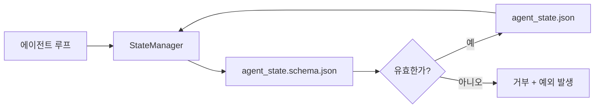

> 🇰🇷 이 문서는 한국어 번역본입니다(ELI5 스타일). 원문: [en.md](en.md)

# 저장소 메모리와 영속 상태(Repo Memory and Durable State)

> 대화 기록은 휘발성입니다. 저장소는 영속적입니다. 워크벤치는 에이전트 상태를 버전 관리되는 파일에 저장해서, 다음 세션·다음 에이전트·다음 리뷰어가 모두 같은 단일 진실 공급원(source of truth)을 읽게 만듭니다.

**유형:** 빌드
**언어:** Python (표준 라이브러리 + `jsonschema` 선택)
**선수 지식:** Phase 14 · 32 (미니멀 워크벤치)
**시간:** 약 60분

## 학습 목표

- 무엇이 저장소 메모리에 속하고, 무엇이 대화 기록에 속하는지 정의합니다.
- `agent_state.json`과 `task_board.json`을 위한 JSON 스키마를 작성합니다.
- 상태를 읽고, 검증하고, 변경하고, 원자적으로(atomic) 저장하는 상태 관리자를 만듭니다.
- 스키마를 사용해 잘못된 쓰기가 워크벤치를 망가뜨리기 전에 거부합니다.

## 문제 상황

에이전트가 세션을 끝냅니다. 채팅 창이 닫힙니다. 다음 세션이 열리고 "어디서부터 시작할까요?"라고 묻습니다. 모델은 "파일을 확인해 볼게요"라고 말한 뒤 오래된(stale) 노트를 읽고, 이미 끝난 작업을 다시 합니다. 더 나쁜 경우에는, 누구도 "그 파일은 끝났다"고 알려주지 않았기 때문에 완성된 파일을 통째로 다시 써버립니다.

워크벤치의 해법은 저장소 메모리입니다. 상태는 저장소 안의 JSON 파일에 살고, 스키마에 따라 작성되고, 원자적으로 저장되며, 코드 리뷰에서 diff로 확인하기 좋습니다. 채팅은 일시적인 피드일 뿐이고, 저장소가 시스템 오브 레코드(system of record, 공식 기록 저장소)입니다.

## 개념



### 저장소 메모리에 속하는 것

| 속함 | 속하지 않음 |
|---------|-----------------|
| 현재 작업 중인 태스크 ID | 원본 채팅 전사(transcript) 전문 |
| 이번 세션에서 건드린 파일 | 토큰 단위 추론 과정 기록 |
| 에이전트가 세운 가정 | "사용자가 짜증 난 것 같았다" 같은 인상 |
| 열려 있는 방해 요소(blocker) | 샘플로 뽑아본 완성문들 |
| 다음 행동 | 벤더 고유의 모델 ID |

판단 기준은 영속성입니다. "3개월 뒤 CI 재실행에서 이 정보가 쓸모 있을까?" 예라고 하면 저장소로, 아니오라고 하면 텔레메트리(원격 로그)로 보내면 됩니다.

### 스키마 우선(Schema-first) 상태

JSON 스키마가 곧 계약입니다. 스키마가 없으면 에이전트마다 새 필드를 발명하고, 리뷰어마다 새로운 구조를 배워야 하고, CI 스크립트마다 과거 버전을 특별 처리해야 합니다. 스키마가 있으면 나쁜 쓰기는 곧바로 거부된 쓰기가 됩니다.

스키마가 다루는 것:

- 필수 키.
- 허용되는 `status` 값.
- 금지된 값 (예: 배열이 와야 할 자리의 `null`).
- 패턴 제약 (태스크 ID는 `T-\d{3,}` 형태).
- 마이그레이션을 위한 버전 필드.

### 원자적 쓰기(Atomic Writes)

상태 쓰기는 부분 실패를 견뎌야 합니다. 임시 파일(tempfile)에 쓰고, fsync로 디스크에 확실히 기록한 뒤, 대상 파일 위로 이름을 바꿔 덮어쓰는(rename) 방식입니다. 상태 파일이 단일 진실 공급원이므로, 절반만 쓰인 파일은 파일이 아예 없는 것보다 나쁩니다.

### 마이그레이션

스키마가 바뀔 때는 스키마 버전 올림과 함께 마이그레이션 스크립트를 배포합니다. 상태 파일에는 `schema_version` 필드가 들어 있고, 관리자는 자신이 마이그레이션할 수 없는 버전의 파일을 읽기를 거부합니다.

```figure
wb-state-persist
```

## 만들어 보기

`code/main.py`는 다음을 구현합니다:

- `agent_state.schema.json`과 `task_board.schema.json`.
- 표준 라이브러리만 쓰는 검증기(validator) (JSON 스키마의 일부: required, type, enum, pattern, items).
- 원자적인 "임시 파일 + 이름 바꾸기" 쓰기를 갖춘 `StateManager.load`, `StateManager.update`, `StateManager.commit`.
- 상태를 변경하고, 저장하고, 다시 읽어 왕복(round-trip)이 잘 되는지 증명하는 데모.

실행 방법:

```
python3 code/main.py
```

스크립트는 `workdir/agent_state.json`과 `workdir/task_board.json`을 쓰고, 두 차례에 걸쳐 상태를 변경하며, 각 단계마다 검증된 상태를 출력합니다.

## 실무에서 쓰이는 프로덕션 패턴

네 가지 패턴은 이 레슨의 최소 구현을 여러 에이전트가 돌아가는 모노레포도 버틸 수 있는 수준으로 끌어올립니다.

**원자적인 임시 파일 + 이름 바꾸기는 선택이 아닙니다.** 2026년 3월 Hive 프로젝트 버그 리포트는 이 실패 양상을 깔끔하게 기록해 두었습니다. `state.json`이 `write_text()`로 작성됐고, 예외는 잡아서 조용히 무시됐습니다. 부분적으로만 쓰인 파일 때문에 여러 세션이 깨진 상태를 기준으로 재개됐고 아무 신호도 없었습니다. 해법은 늘 같습니다. 대상과 같은 디렉터리에서 `tempfile.mkstemp`로 임시 파일을 만들고, 쓰고, `fsync`하고, `os.replace`(POSIX와 Windows 모두에서 원자적인 이름 바꾸기)를 합니다. 이 레슨의 `atomic_write`가 정확히 그렇게 합니다.

**멱등성(idempotency) 키를 모든 비멱등 도구 호출에 붙입니다.** 에이전트가 도구를 호출한 뒤 결과를 체크포인트하기 전에 죽는다면, 복구 과정은 그 도구 호출을 재시도합니다. 읽기는 안전하지만, 이메일 발송·DB 삽입·파일 업로드는 위험합니다. 패턴은 이렇습니다. 실행 전에 모든 도구 호출 ID를 `pending_calls.jsonl`에 기록합니다. 재시도할 때 ID가 있는지 확인하고, 있으면 호출을 건너뛰고 캐시된 결과를 사용합니다. Anthropic과 LangChain 모두 2026년 가이드에서 이 점을 강조하고, LangGraph의 체크포인터도 같은 이유로 대기 중 쓰기를 영속화합니다.

**큰 산출물은 상태와 분리합니다.** CSV, 긴 전사(transcript) 문서, 생성된 파일을 `agent_state.json`에 저장하지 마세요. 산출물은 별도 파일로 저장(또는 오브젝트 스토리지에 업로드)하고 상태에는 경로만 남깁니다. 체크포인트는 작고 빠르게 유지되고, 산출물은 독립적으로 커집니다.

**감사(audit)용 이벤트 소싱, 재개용 스냅샷.** 모든 변경 때마다 이벤트 로그(`state.events.jsonl`)에 덧붙이고, 주기적으로 `state.json`으로 스냅샷을 찍습니다. 재개할 때는 스냅샷을 읽은 뒤 스냅샷 시각 이후의 이벤트를 재생(replay)합니다. 디스크는 더 쓰지만 에이전트의 결정을 그대로 재현할 수 있어서, 긴 실행을 디버깅할 때 필수입니다. Postgres가 내부적으로 WAL을 다루는 방식과 같은 구조입니다.

**스키마 마이그레이션, 아니면 읽기를 거부.** `schema_version` 정수가 곧 계약입니다. 관리자가 알 수 없는 버전의 파일을 읽어야 하면 읽기를 거부합니다. 스키마 버전 올림과 함께 마이그레이션 스크립트를 배포하고, `tools/migrate_state.py`를 매 시작 때 멱등하게(idempotently) 실행합니다.

## 실무 사례

프로덕션(운영 환경)에서는:

- **LangGraph 체크포인터.** 같은 아이디어, 다른 저장소입니다. 체크포인터는 그래프 상태를 SQLite, Postgres, 또는 커스텀 백엔드에 저장합니다. 이 레슨이 가르치는 스키마는 체크포인터가 죽었을 때 상태를 손으로 직접 읽어야 할 때 꺼내 쓰는 것입니다.
- **Letta 메모리 블록.** 구조화된 스키마를 가진 영속 블록 (Phase 14 · 08). 같은 규율을 오래 살아가는 페르소나에 적용한 것입니다.
- **OpenAI Agents SDK 세션 스토어.** 교체 가능한 백엔드, 스키마 인식. 이 레슨의 상태 파일은 로컬 파일 백엔드에 해당합니다.

## 활용하기

`outputs/skill-state-schema.md`는 프로젝트 전용 JSON 스키마 쌍(상태 + 보드), 원자적 쓰기에 연결된 Python `StateManager`, 그리고 다음 스키마 버전 올림 때 워크벤치가 깨지지 않도록 하는 마이그레이션 스캐폴드를 생성합니다.

## 연습 문제

1. `last_human_touch` 타임스탬프를 추가하세요. 사람이 편집한 지 5초 이내의 에이전트 쓰기는 거부합니다.
2. 검증기에 `oneOf` 지원을 추가해서, 태스크가 빌드 태스크이거나 필수 필드가 다른 리뷰 태스크 중 하나가 되도록 하세요.
3. `schema_version` 필드를 추가하고 v1에서 v2로 가는 마이그레이션을 작성하세요 (`blockers`를 `risks`로 이름 바꾸기).
4. 저장 백엔드를 로컬 파일에서 SQLite로 옮기세요. `StateManager` API는 그대로 유지합니다.
5. 두 에이전트가 같은 상태 파일에 50 ms 간격의 쓰기 경쟁을 벌이게 해 보세요. 무엇이 잘못되고, 원자적 이름 바꾸기가 어떻게 당신을 구해주는지 설명해 보세요.

## 핵심 용어

| 용어 | 사람들이 말하는 것 | 실제 의미 |
|------|----------------|------------------------|
| 저장소 메모리 | "노트 파일" | 스키마에 따라 저장소의 버전 관리되는 파일에 저장된 상태 |
| 스키마 우선 | "입력 검증해" | 쓰는 코드보다 계약을 먼저 정의하고, 이탈(drift)은 거부 |
| 원자적 쓰기 | "이름 바꾸기만 하면 되지" | 임시 파일에 쓰고, fsync하고, 이름을 바꿔서 부분 실패가 파일을 망가뜨리지 못하게 함 |
| 마이그레이션 | "스키마 버전 올리기" | vN 상태를 v(N+1) 상태로 바꾸는 스크립트 |
| 시스템 오브 레코드 | "단일 진실 공급원" | 워크벤치가 정본으로 취급하는 산출물 |

## 더 읽기

- [JSON Schema specification](https://json-schema.org/specification.html)
- [LangGraph checkpointers](https://langchain-ai.github.io/langgraph/concepts/persistence/)
- [Letta memory blocks](https://docs.letta.com/concepts/memory)
- [Fast.io, AI Agent State Checkpointing: A Practical Guide](https://fast.io/resources/ai-agent-state-checkpointing/) — 멱등성을 갖춘 스키마 우선 체크포인팅
- [Fast.io, AI Agent Workflow State Persistence: Best Practices 2026](https://fast.io/resources/ai-agent-workflow-state-persistence/) — 동시성 제어, TTL, 이벤트 소싱
- [Hive Issue #6263 — non-atomic state.json writes silently ignored](https://github.com/aden-hive/hive/issues/6263) — 실제 프로젝트에서 벌어진 실패 양상
- [eunomia, Checkpoint/Restore Systems: Evolution, Techniques, Applications](https://eunomia.dev/blog/2025/05/11/checkpointrestore-systems-evolution-techniques-and-applications-in-ai-agents/) — OS 역사의 체크포인트/복원 원리를 에이전트에 적용
- [Indium, 7 State Persistence Strategies for Long-Running AI Agents in 2026](https://www.indium.tech/blog/7-state-persistence-strategies-ai-agents-2026/)
- [Microsoft Agent Framework, Compaction](https://learn.microsoft.com/en-us/agent-framework/agents/conversations/compaction) — 벤더 체크포인트 관리자
- Phase 14 · 08 — 메모리 블록과 수면 시간 컴퓨팅
- Phase 14 · 32 — 이 레슨이 스키마로 만들어 준 세 파일 최소 구성
- Phase 14 · 40 — 같은 스키마에서 읽어 가는 핸드오프 패킷
