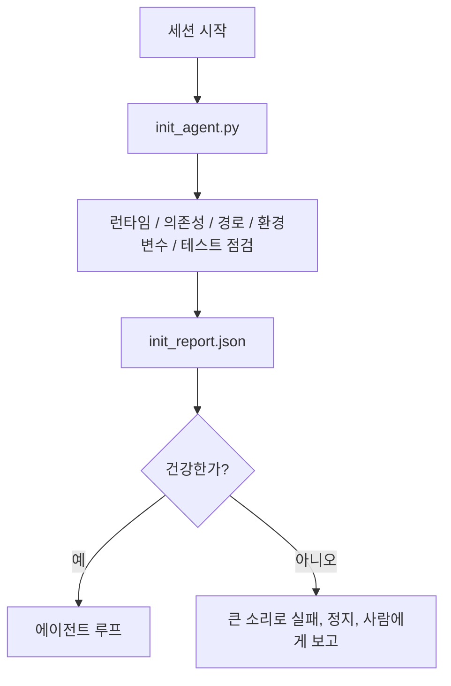

> 🇰🇷 이 문서는 한국어 번역본입니다(ELI5 스타일). 원문: [en.md](en.md)

# 에이전트를 위한 초기화 스크립트

> 차가운 상태로 시작하는 세션은 매번 세금을 냅니다. 에이전트는 같은 파일을 읽고, 같은 점검을 재시도하고, 같은 경로를 다시 찾아냅니다. 초기화(init) 스크립트는 이 세금을 한 번만 내고 그 답을 상태에 기록해 둡니다.

**유형:** 빌드
**언어:** Python (표준 라이브러리)
**선수 지식:** Phase 14 · 32 (미니멀 워크벤치), Phase 14 · 34 (저장소 메모리)
**시간:** 약 45분

## 학습 목표

- 에이전트가 세션마다 다시 해서는 안 되는 작업을 식별합니다.
- 런타임, 의존성, 저장소 상태를 점검(probe)하는 결정론적 초기화 스크립트를 만듭니다.
- 점검 결과를 저장해 둬서, 에이전트가 검사를 다시 돌리는 대신 그 결과를 읽게 만듭니다.
- 초기화가 실패하면 큰 소리로, 빠르게, 그리고 한 곳에서만 원인을 찾으면 되게 만듭니다.

## 문제 상황

세션을 엽니다. 에이전트는 Python 버전을 추측합니다. 테스트 명령을 추측합니다. 진입점을 찾으려고 저장소 루트를 다섯 번이나 나열합니다. 설치되지 않은 패키지를 임포트하려 합니다. 설정 파일이 어디 있는지 사용자에게 묻습니다. 실제 편집을 시작할 때쯤이면, 스크립트 한 장이면 끝났을 설정 작업에 이미 만 토큰이 사라졌습니다.

해법은 에이전트가 무엇보다 먼저 실행하는 초기화 스크립트 하나이고, 이 스크립트가 에이전트가 시작 때 읽을 `init_report.json`을 써 두는 것입니다.

## 개념



### 초기화 스크립트가 점검하는 것

| 점검 항목 | 왜 중요한가 |
|-------|----------------|
| 런타임 버전 | Python이나 Node 버전이 틀리면 조용한 버전 불일치 버그가 된다 |
| 의존성 가용 여부 | 빠진 패키지는 나중에 발견하면 지금 잡는 것의 열 배 비용이 든다 |
| 테스트 명령 | 에이전트는 검증 방법을 알아야 한다. 명령이 없으면 워크벤치가 망가진 것이다 |
| 저장소 경로 | 하드코딩된 경로는 어긋나기 마련이다. 한 번 해석해서 고정하자 |
| 환경 변수 | 빠진 `OPENAI_API_KEY`는 런타임 미스터리가 아니라 명확한 실패 지점이다 |
| 상태 + 보드 신선도 | 비정상 종료된 세션이 남긴 오래된 상태는 지뢰다 |
| 마지막 정상 커밋 | 세션 끝의 핸드오프 diff가 붙잡을 기준점 |

### 큰 소리로, 빠르게, 한 곳에서 실패

점검 실패는 정지하고 사람에게 보고한다는 뜻입니다. "에이전트가 알아서 하겠죠"는 없습니다. 초기화의 존재 이유는 워크벤치가 망가졌을 때 시작을 거부하는 것입니다.

### 멱등성(Idempotency)

연달아 두 번 실행해 보세요. 두 번째 실행은 타임스탬프가 새로 갱신되는 것 외에는 아무 일도 일어나지 않아야 합니다. 이 멱등성 덕분에 스크립트를 CI, 훅(hook), 작업 전 슬래시 명령에 붙일 수 있습니다.

### 초기화와 시작 규칙의 관계

규칙(Phase 14 · 33)은 "행동하려면 이것이 참이어야 한다"를 말합니다. 초기화는 그 규칙들이 실제로 검사 가능하다는 사실을 확립하는 스크립트입니다. 초기화 없는 규칙은 "조심하세요"로 전락하고, 규칙 없는 초기화는 잘 포장된 실패에 불과합니다.

```figure
wb-init-probes
```

## 만들어 보기

`code/main.py`는 `init_agent.py`를 구현합니다:

- 다섯 가지 점검: Python 버전, `importlib.util.find_spec`으로 나열된 의존성, 테스트 명령 해석 가능 여부, 필수 환경 변수, 상태 파일 신선도.
- 각 점검은 `(name, status, detail)`을 반환합니다.
- 스크립트는 전체 점검 결과를 담은 `init_report.json`을 쓰고, 차단(block) 심각도 점검이 하나라도 실패하면 0이 아닌 종료 코드로 끝납니다.

실행 방법:

```
python3 code/main.py
```

스크립트는 점검 결과 표를 출력하고 `init_report.json`을 씁니다. 정상 경로면 종료 코드 0, 실패가 있으면 실패한 점검 목록과 함께 0이 아닌 코드로 끝납니다.

## 실무에서 쓰이는 프로덕션 패턴

세 가지 패턴이 쓸모 있는 초기화 스크립트와 형식적인 의식(ceremony)을 가릅니다.

**마지막 정상 커밋(last-known-good) 앵커링.** 현재 커밋을, 마지막 성공한 병합 때 기록해 둔 `LKG` 파일과 비교합니다. diff가 예산(기본 50개 파일)을 넘으면 시작을 거부하고 사람이 새 기준선을 승인하도록 요구합니다. Cloudflare의 AI Code Review가 리뷰어 에이전트의 범위를 정하는 방식이 바로 이것입니다. 모든 리뷰 세션이 같은 마지막 정상 지점에 앵커를 박아 세션 간에 어긋남(drift)이 누적되지 않게 합니다.

**TTL이 있는 잠금 파일.** 첫 성공적인 점검 통과 후 `prereqs.lock`을 기록합니다. 이후 실행은 N시간(기본 24시간) 동안 이 잠금 파일을 신뢰하고 비싼 점검을 건너뜁니다. 초기화 스크립트는 먼저 잠금 파일을 읽고, 잠금이 신선하고 의존성 매니페스트 해시가 일치하면 빠른 길(short-circuit)로 통과합니다. Docker가 레이어 캐시에 쓰는 것과 같은 패턴입니다. 멱등 점검 + 콘텐츠 해시 = 건너뛰기.

**핫 패스(hot path)에 네트워크 없음, LLM 없음, 놀라움 없음.** 초기화 점검은 결정론적인 배관 작업입니다. 실패를 분류하려고 LLM을 부르거나, 라이선스를 확인하려고 외부 서비스를 두드리는 것은 점검이 아니라 워크플로입니다. 드라이 런에서 어떤 점검이 3초 넘게 걸린다면 그것은 워크벤치 악취(smell)로 취급해서, 초기화 밖으로 옮기거나 결과를 캐싱하세요.

## 실무 사례

프로덕션(운영 환경)에서는:

- **Claude Code 훅.** `pre-task` 훅이 초기화 스크립트를 호출하고, 실패하면 에이전트 실행을 거부합니다.
- **GitHub Actions.** `setup-agent` 잡이 초기화 스크립트를 실행하고, 에이전트 잡이 그것에 의존합니다.
- **Docker 엔트리포인트.** 에이전트 컨테이너는 에이전트 런타임을 exec하기 전에 초기화 스크립트를 실행하고, 실패 시 로그가 밖으로 드러납니다.

초기화 스크립트는 특정 프레임워크를 전혀 호출하지 않기 때문에 이식 가능합니다. Bash, Make, 태스크 파일 모두 그것을 감쌀 수 있습니다.

## 활용하기

`outputs/skill-init-script.md`는 프로젝트를 인터뷰하고, 설정 작업을 점검 항목으로 분류한 뒤, 프로젝트 전용 `init_agent.py`와 모든 에이전트 단계 전에 그것을 실행하는 CI 워크플로를 내놓습니다.

## 연습 문제

1. 현재 커밋을 마지막 정상 커밋과 diff해서, 바뀐 파일이 50개를 넘으면 시작을 거부하는 점검을 추가하세요.
2. 스크립트가 `prereqs.lock` 파일을 쓰고, 잠금이 7일보다 오래됐으면 시작을 거부하게 연결하세요.
3. `--fix` 플래그를 추가해서 빠진 개발 의존성은 자동 설치하되, 런타임 의존성은 승인 없이는 절대 수정하지 않게 하세요.
4. 점검을 하드코딩된 함수에서 YAML 레지스트리로 옮겨 보세요. 그 트레이드오프를 정당화해 보세요.
5. 점검별 시간 예산을 추가하세요. 3초보다 오래 걸리는 점검은 워크벤치 악취입니다.

## 핵심 용어

| 용어 | 사람들이 말하는 것 | 실제 의미 |
|------|----------------|------------------------|
| 점검(probe) | "검사 하나" | `(name, status, detail)`을 반환하는 결정론적 함수 |
| 초기화 리포트 | "설정 출력물" | 점검 결과를 상태 파일 옆에 기록한 JSON |
| 멱등(Idempotent) | "다시 돌려도 안전" | 타임스탬프를 빼면 연달아 두 번 실행한 리포트가 동일함 |
| 큰 소리로 실패(Fail loud) | "조용히 넘기지 마" | 정지하고 사람에게 보고함. 조용한 폴백 없음 |
| 설정 세금 | "부트스트랩 비용" | 에이전트가 세션마다 뻔한 것을 다시 찾느라 쓰는 토큰 |

## 더 읽기

- [Anthropic, Effective harnesses for long-running agents](https://www.anthropic.com/engineering/effective-harnesses-for-long-running-agents)
- [GitHub Actions, composite actions for setup](https://docs.github.com/en/actions/sharing-automations/creating-actions/creating-a-composite-action)
- [microservices.io, GenAI dev platform: guardrails](https://microservices.io/post/architecture/2026/03/09/genai-development-platform-part-1-development-guardrails.html) — 초기화로서의 pre-commit + CI 검사
- [Augment Code, How to Build Your AGENTS.md (2026)](https://www.augmentcode.com/guides/how-to-build-agents-md) — 초기화 기대치
- [Codex Blog, Codex CLI Context Compaction](https://codex.danielvaughan.com/2026/03/31/codex-cli-context-compaction-architecture/) — 컴팩션을 인식하는 세션 시작 초기화
- Phase 14 · 33 — 이 스크립트가 작동하게 만드는 규칙 집합
- Phase 14 · 34 — 이 스크립트가 시드하는 상태 파일
- Phase 14 · 38 — 초기화 스크립트가 결과를 넘겨주는 검증 게이트
- Phase 14 · 40 — 초기화 리포트의 마지막 정상 커밋을 소비하는 핸드오프
