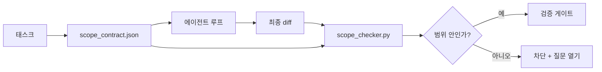

> 🇰🇷 이 문서는 한국어 번역본입니다(ELI5 스타일). 원문: [en.md](en.md)

# 범위 계약과 태스크 경계

> 모델은 작업이 어디서 끝나는지 모릅니다. 범위 계약(scope contract)은 태스크별 파일로, 작업이 어디서 시작하고 어디서 끝나며, 범위를 넘어섰을 때 어떻게 되돌릴지 말해 줍니다. 계약은 "범위 안에 머물러라"라는 소원을 검사 항목으로 바꿔 줍니다.

**유형:** 빌드
**언어:** Python (표준 라이브러리)
**선수 지식:** Phase 14 · 32 (미니멀 워크벤치), Phase 14 · 33 (제약으로서의 규칙)
**시간:** 약 50분

## 학습 목표

- 에이전트가 태스크 시작 때 읽고 검증자(verifier)가 태스크 끝에서 읽는 범위 계약을 작성합니다.
- 허용 파일, 금지 파일, 수용 기준, 롤백 계획, 승인 경계를 명시합니다.
- diff를 계약과 비교해 위반을 표시하는 범위 검사기를 구현합니다.
- 범위 확산(scope creep)을 눈에 보이고, 자동이고, 검토 가능하게 만듭니다.

## 문제 상황

에이전트는 범위를 넘습니다. 태스크는 "로그인 버그 수정"이었습니다. 그런데 diff에는 로그인 라우트, 이메일 헬퍼, 데이터베이스 드라이버, README, 릴리스 스크립트가 다 건드려져 있습니다. 각각의 건드림에는 그 순간엔 그럴듯한 이유가 있었습니다. 하지만 모두 합치면 리뷰받으려 했던 변경과는 전혀 다른 변경이 됩니다.

범위 확산은 에이전트 작업에서 가장 잘 감시되지 않는 실패 양상입니다. 에이전트가 각 단계를 선의로 설명해 주기 때문입니다. 해법은 더 엄격한 프롬프트가 아닙니다. 무엇을 약속했는지 디스크 위의 계약에 적어 두고, 결과를 그 약속과 비교하는 검사를 도는 것입니다.

## 개념



### 범위 계약에 들어가는 것

| 필드 | 목적 |
|-------|---------|
| `task_id` | 보드의 태스크와 연결 |
| `goal` | 리뷰어가 검증할 수 있는 한 문장 |
| `allowed_files` | 에이전트가 쓸 수 있는 글롭(glob) 패턴 |
| `forbidden_files` | 실수로라도 건드려서는 안 되는 글롭 패턴 |
| `acceptance_criteria` | 완료를 증명하는 테스트 명령이나 단언문 |
| `rollback_plan` | 정지가 필요할 때 운영자가 실행할 한 단락짜리 절차 |
| `approvals_required` | 명시적인 사람의 서명이 필요한 범위 밖 행동 |

`forbidden_files`가 없는 계약은 불완전합니다. 부정 공간(금지 목록)이 계약의 절반입니다.

### 날경로가 아니라 글롭으로

실제 저장소는 파일을 옮깁니다. 계약은 글롭(`app/**/*.py`, `tests/test_signup*.py`)으로 묶어 두세요. 그래야 세션 사이의 리팩토링이 계약을 무효로 만들지 않습니다.

### 롤백은 범위의 일부

되돌리는 방법을 적게 만들면 계약 작성자가 "무엇이 잘못될 수 있는가"를 생각하게 됩니다. 롤백할 수 없는 계약은 승인받아서도 안 되는 계약입니다.

### 범위 검사는 diff 검사

에이전트가 diff를 만들면, 검사기는 diff와 허용 글롭, 금지 글롭, 그리고 실행된 수용 명령 목록을 읽습니다. 각 위반은 태그가 붙은 발견 항목(finding)이 되어 검증 게이트가 거부할 수 있습니다.

### 범위의 두 층위: 피처 목록과 태스크 계약

범위 계약은 태스크 하나를 묶습니다. 프로젝트 전체를 묶지 않습니다. 에이전트는 로그인 수정 계약 안에 완벽하게 머물면서도, 다음 차례에는 "프로젝트에 설정 페이지, 다크 모드 토글, 라우터 재작성도 필요하겠는데"라고 결정할 수 있습니다. 계약은 "프로젝트에서 어떤 작업이 범위 안인가"를 묻지 않았고, "태스크에서 어떤 파일이 범위 안인가"만 물었으니까요.

두 번째 층위에는 자체 원시 장치가 필요합니다. 세션 시작 때 에이전트가 읽는 `feature_list.json`입니다. 이것은 프로젝트 백로그를 기계가 읽을 수 있고 순서가 있는 파일로 만든 것입니다. 에이전트는 `status`가 `todo`인 피처를 정확히 하나 고르고, 그 `id`를 활성 범위 계약에 적고, 같은 세션에서 두 번째 피처를 시작하는 것이 금지됩니다. "한 번에 하나의 피처"는 에이전트가 얼버무릴 수 있는 프롬프트의 한 줄에서 벗어나, 디스크에서 직접 읽는 값이 되고 게이트가 강제하는 검사가 됩니다.

```json
{
  "project": "knowledge-base",
  "active": "import-pdf",
  "features": [
    { "id": "import-pdf",   "status": "in_progress", "goal": "import a PDF into the library",        "done_when": "pytest tests/test_import.py && a sample PDF appears in the library view" },
    { "id": "full-text-search", "status": "todo",     "goal": "search document text and rank hits",   "done_when": "query returns ranked results with snippets" },
    { "id": "cite-answers", "status": "todo",         "goal": "answers carry source citations",        "done_when": "every answer renders at least one clickable citation" }
  ]
}
```

| 필드 | 목적 |
|-------|---------|
| `active` | 현재 세션이 건드릴 수 있는 유일한 피처. 비어 있으면 하나를 골라 설정 |
| `features[].id` | 범위 계약의 `task_id`가 가리키는 안정적인 슬러그 |
| `features[].status` | `todo`, `in_progress`, `done`, `blocked`. 한 번에 `in_progress`는 하나만 |
| `features[].goal` | 리뷰어가 검증할 수 있는 한 문장 |
| `features[].done_when` | `in_progress`를 `done`으로 바꾸는 수용 조건 |

두 규칙이 이 목록을 장식이 아니라 하중을 지는 기둥으로 만듭니다. 첫째, "`in_progress`는 최대 하나"라는 불변 조건 자체가 시작 검사입니다(Phase 14 · 33). 목록에 둘이 보이면 사람이 해결할 때까지 세션은 시작을 거부합니다. 둘째, 피처 목록은 채팅 메시지가 아니라 파일입니다. 채팅은 컨텍스트에서 흘러가지만 파일은 세션과 에이전트를 넘어 남습니다. 핸드오프(Phase 14 · 40)는 끝낸 피처의 상태를 `done`으로 되돌려 써서, 다음 세션이 남은 일을 다시 유추하는 대신 정확한 보드를 보고 열리게 합니다.

계약과 목록은 아래에서 설명하는 것과 같은 최소 권한 원칙으로 결합합니다. 태스크 계약의 `allowed_files`는 활성 피처가 건드리는 범위 안에 있어야 하고, 그 밖에 있으면 안 됩니다.

```figure
wb-scope-bounce
```

## 만들어 보기

`code/main.py`는 다음을 구현합니다:

- `scope_contract.json` 스키마 (JSON 스키마의 일부, 글롭 배열).
- 건드린 파일 목록과 실행된 명령 목록을 `RunSummary`로 바꾸는 diff 파서.
- 계약에 대해 `(violations, in_scope, off_scope)`를 반환하는 `scope_check`.
- 두 개의 데모 실행: 하나는 범위 안에 머물고, 하나는 범위를 넘습니다. 검사기는 정확한 파일과 이유를 들어 범위 확산을 표시합니다.

실행 방법:

```
python3 code/main.py
```

출력: 계약, 두 번의 실행, 실행별 판정, 그리고 저장된 `scope_report.json`.

## 실무에서 쓰이는 프로덕션 패턴

"스펙스맥싱(specsmaxxing)"(에이전트를 부르기 전에 YAML로 범위 계약을 작성하는 방식)을 실전에 돌린 한 실무자는, 에이전트는 그대로 둔 채 3주 만에 깊은 굴(rabbit hole) 빠지는 비율이 52%에서 21%로 떨어졌다고 보고했습니다. 일을 한 것은 계약이지 모델이 아니었습니다. 이 성과를 지속시키는 세 가지 패턴이 있습니다.

**이진 실패가 아니라 위반 예산.** `agent-guardrails`(Claude Code, Cursor, Windsurf, Codex가 MCP로 쓰는 오픈소스 병합 게이트)는 태스크별 `violationBudget`을 제공합니다. 예산 안의 사소한 범위 이탈은 경고로 표시되고, 예산을 초과해야 병합 게이트가 거부합니다. `violationSeverity: "error" | "warning"`와 짝지어 쓰세요. 이 예산이 있는 것과 없는 것의 차이는, 팀이 계속 쓰는 게이트와 그 게이트를 싫어한 팀이 곧바로 꺼버리는 게이트의 차이입니다.

**경로 계열별 심각도 비대칭.** `docs/**` 밖의 범위 이탈 쓰기는 보통 `warn`이지만, `scripts/**`, `migrations/**`, `config/prod/**`에 대한 범위 이탈 쓰기는 언제나 `block`입니다. 이 비대칭은 런타임이 아니라 계약 안에 살아야 합니다. 프로젝트 고유의 것이고 태스크마다 달라지기 때문입니다.

**파일 예산 옆에 시간과 네트워크 예산.** `time_budget_minutes` 필드가 실제 소요 시간을 묶고, 런타임은 재승인 없이는 그 한도를 넘어 진행을 거부합니다. 호스트명에 대한 `network_egress` 허용 목록은 태스크와 무관한 외부 API를 에이전트가 조용히 두드리는 일을 막습니다. 이것들도 범위의 차원입니다. 파일 글롭은 필요 조건이지 충분 조건이 아닙니다.

**다중 계약 병합 의미론(최소 권한).** 두 개의 범위 계약이 적용될 때(예: 프로젝트 전체 계약 + 태스크 전용 계약) 병합 규칙은 이렇습니다. `allowed_files`는 **교집합**(두 계약 모두 경로를 허용해야 함), `forbidden_files`는 **합집합**(어느 한쪽만 금지해도 금지), `time_budget_minutes`는 가장 엄격한 값(min), `approvals_required`는 누적. `network_egress`는 강제하지 않으면 `None`, 전면 거부면 `[]`, 허용 목록이면 `[...]`입니다. 병합 시 `None`은 상대 계약에 따르고, 두 목록은 교집합이 되며, 전면 거부는 전면 거부로 유지됩니다. 병합이 기계적이고 검토 가능하도록 이 내용을 계약 스키마에 명시하세요.

## 실무 사례

프로덕션 패턴:

- **Claude Code 슬래시 명령.** `/scope` 명령이 계약을 작성해 세션 컨텍스트로 고정합니다. 서브에이전트는 행동 전에 계약을 읽습니다.
- **GitHub PR.** 계약을 PR 본문의 JSON 파일이나 커밋된 산출물로 밀어 넣습니다. CI가 병합 diff에 대해 범위 검사기를 돌립니다.
- **LangGraph 인터럽트.** 범위 위반이 인터럽트를 일으키고, 핸들러는 사람에게 계약을 넓혀야 하는지 에이전트가 물러나야 하는지 묻습니다.

계약은 태스크와 함께 다닙니다. 태스크가 닫히면 계약은 `outputs/scope/closed/` 아래에 보관됩니다.

## 활용하기

`outputs/skill-scope-contract.md`는 태스크 설명으로 범위 계약을 생성하고, 모든 에이전트 diff에 대해 CI에서 도는 글롭 인식 검사기를 만들어 냅니다.

## 연습 문제

1. 허용된 외부 호스트를 나열하는 `network_egress` 필드를 추가하세요. 다른 호스트를 건드리는 실행은 거부합니다.
2. 검사기가 `docs/**`에는 소프트하게, `scripts/**`에는 하드하게 실패하게 확장하세요. 그 비대칭을 정당화해 보세요.
3. 계약이 `goal` 필드에서 정적 규칙 집합만으로(LLM 없이) `allowed_files`를 도출하게 만들어 보세요. 첫 예외 사례에서 무엇이 잘못될까요?
4. `time_budget_minutes`를 추가하고 실제 시간이 그것을 넘으면 진행을 거부하세요.
5. 같은 diff에 두 계약을 적용해 보세요. 둘 다 적용될 때 올바른 병합 의미론은 무엇일까요?

## 핵심 용어

| 용어 | 사람들이 말하는 것 | 실제 의미 |
|------|----------------|------------------------|
| 범위 계약 | "태스크 브리핑" | 허용/금지 파일, 수용 기준, 롤백을 나열한 태스크별 JSON |
| 범위 확산 | "그것도 건드렸네..." | 같은 태스크에서 계약 밖 파일이 변경된 것 |
| 롤백 계획 | "되돌리면 되지" | 정지를 위한 한 단락짜리 운영자 런북 |
| 승인 경계 | "서명 필요" | 계약에 명시적 사람 승인 요구로 적힌 행동 |
| diff 검사 | "경로 감사" | 건드린 파일을 계약 글롭과 비교하는 것 |

## 더 읽기

- [LangGraph human-in-the-loop interrupts](https://langchain-ai.github.io/langgraph/concepts/human_in_the_loop/)
- [OpenAI Agents SDK tool approval policies](https://platform.openai.com/docs/guides/agents-sdk)
- [logi-cmd/agent-guardrails — merge gates and scope validation](https://github.com/logi-cmd/agent-guardrails) — 위반 예산, 심각도 등급
- [Dev|Journal, Preventing AI Agent Configuration Drift with Agent Contract Testing](https://earezki.com/ai-news/2026-05-05-i-built-a-tiny-ci-tool-to-keep-ai-agent-configs-from-drifting-in-my-repo/) — 외부 의존성 없는 `--strict` 모드
- [Agentic Coding Is Not a Trap (production logs)](https://dev.to/jtorchia/agentic-coding-is-not-a-trap-i-answered-the-viral-hn-post-with-my-own-production-logs-33d9) — 스펙스맥싱의 증거: 52% → 21%
- [OpenCode permission globs](https://opencode.ai/docs/agents/) — 권한별 세밀한 범위
- [Knostic, AI Coding Agent Security: Threat Models and Protection Strategies](https://www.knostic.ai/blog/ai-coding-agent-security) — 최소 권한의 일부로서의 범위
- [Augment Code, AI Spec Template](https://www.augmentcode.com/guides/ai-spec-template) — 3단계 경계 시스템(must/ask/never)
- Phase 14 · 27 — 범위 잠금과 짝을 이루는 프롬프트 인젝션 방어
- Phase 14 · 33 — 이 계약이 태스크별로 특수화하는 규칙 집합
- Phase 14 · 38 — 검사기가 결과를 보고하는 검증 게이트
