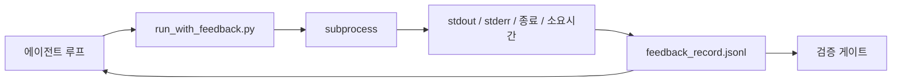

> 🇰🇷 이 문서는 한국어 번역본입니다(ELI5 스타일). 원문: [en.md](en.md)

# 런타임 피드백 루프

> 실제 명령 출력을 보지 못하는 에이전트는 추측합니다. 피드백 러너(runner)는 stdout, stderr, 종료 코드, 소요 시간을 구조화된 기록으로 포착해서 다음 차례가 읽을 수 있게 합니다. 그러면 에이전트는 자신이 상상한 사실이 아니라 진짜 사실에 반응합니다.

**유형:** 빌드
**언어:** Python (표준 라이브러리)
**선수 지식:** Phase 14 · 32 (미니멀 워크벤치), Phase 14 · 35 (초기화 스크립트)
**시간:** 약 50분

## 학습 목표

- 런타임 피드백과 관측 가능성(옵저버빌리티) 텔레메트리를 구분합니다.
- 셸 명령을 감싸고 구조화된 기록을 저장하는 피드백 러너를 만듭니다.
- 큰 출력을 결정론적으로 잘라내서 루프가 토큰 예산 안에 머물게 합니다.
- 피드백이 없으면 루프가 진행하지 않도록 만듭니다.

## 문제 상황

에이전트가 "지금 테스트를 돌립니다"라고 말합니다. 다음 메시지는 "모든 테스트가 통과했습니다"입니다. 실제로는 아무 테스트도 돌지 않았습니다. 에이전트가 출력을 상상했거나, 명령을 돌렸지만 결과를 읽지 않았거나, 결과를 읽었지만 실패 줄을 조용히 잘라냈을 것입니다.

피드백 러너가 이 간극을 없앱니다. 모든 명령은 러너를 통과합니다. 모든 기록에는 명령, 포착된 stdout과 stderr, 종료 코드, 실제 소요 시간, 그리고 에이전트가 적은 한 줄 메모가 담깁니다. 에이전트는 다음 차례에 그 기록을 읽고, 검증 게이트는 태스크 끝에서 그 기록들을 읽습니다.

## 개념



### 피드백 기록에 들어가는 것

| 필드 | 왜 중요한가 |
|-------|----------------|
| `command` | 정확한 argv. 셸 확장의 놀라움 없음 |
| `stdout_tail` | 마지막 N줄. 결정론적 잘라내기 |
| `stderr_tail` | 마지막 N줄. stdout과 분리 |
| `exit_code` | 모호하지 않은 성공 신호 |
| `duration_ms` | 느린 점검과 폭주하는 프로세스를 드러냄 |
| `started_at` | 재생(replay)을 위한 타임스탬프 |
| `agent_note` | 에이전트가 기대했던 것에 대해 적는 한 줄 |

### 잘라내기는 결정론적이어야 합니다

50 MB 로그는 루프를 파괴합니다. 러너는 `...truncated N lines...` 표식과 함께 머리와 꼬리를 잘라내는데, 결정론적이어서 같은 출력은 항상 같은 기록을 만듭니다. 샘플링은 없습니다. 에이전트가 봐야 하는 부분(마지막 에러, 마지막 요약)은 꼬리에 있으니까요.

### 피드백 대 텔레메트리

텔레메트리(Phase 14 · 23, OTel GenAI 관례)는 시간에 걸쳐 실행을 리뷰하는 사람 운영자를 위한 것입니다. 피드백은 이 실행의 다음 차례를 위한 것입니다. 필드는 일부 공유하지만, 서로 다른 파일에 살고 보존 기간(retention)도 다릅니다.

### 피드백 없이는 진행 거부

러너가 종료 코드를 포착하기 전에 에러가 나면, 기록에는 `exit_code: null`과 `error: <reason>`이 담깁니다. 에이전트 루프는 `null` 종료 코드로 성공을 주장하는 것을 거부해야 합니다. 종료 코드가 없으면 진행도 없습니다.

```figure
wb-feedback-loop
```

## 만들어 보기

`code/main.py`는 다음을 구현합니다:

- `run_with_feedback(command, agent_note)` — `subprocess.run`을 감싸 stdout/stderr/종료/소요 시간을 포착하고, 결정론적으로 잘라내며, `feedback_record.jsonl`에 덧붙입니다.
- JSONL을 스트리밍해서 Python 리스트로 만드는 작은 로더.
- 세 개의 명령(성공, 실패, 느림)을 실행하고 명령별 마지막 기록을 출력하는 데모.

실행 방법:

```
python3 code/main.py
```

출력: `feedback_record.jsonl`에 덧붙여진 세 개의 피드백 기록, 그리고 각각의 마지막 기록이 인라인으로 출력됩니다. 재실행할 때마다 파일을 tail하면 루프가 쌓이는 걸 볼 수 있습니다.

## 실무에서 쓰이는 프로덕션 패턴

세 가지 패턴이 러너를 출시할 수 있을 만큼 단단하게 만듭니다.

**읽을 때가 아니라 쓸 때 마스킹(redact).** stdout이나 stderr를 건드리는 기록은 비밀 값을 새어 나을 수 있습니다. 러너는 JSONL에 덧붙이기 전에 마스킹 단계를 거칩니다. `^Bearer `, `password=`, `api[_-]?key=`, `AKIA[0-9A-Z]{16}`(AWS), `xox[baprs]-`(Slack) 패턴의 줄을 제거합니다. 읽을 때 마스킹은 위험한 함정입니다. 공격자가 닿는 것은 디스크 위의 파일입니다. 마스킹 패턴은 분기마다 프로덕션 런타임에서 관측되는 비밀 형식과 대조해 감사하세요.

**단일 파일이 아니라 로테이션 정책.** `feedback_record.jsonl`을 파일당 1 MB로 제한합니다. 넘치면 `.1`, `.2`로 돌리고(rotate), `.5`는 버립니다. 에이전트 루프는 현재 파일만 읽으므로 런타임 비용이 한계 안에 묶입니다. CI 산출물 저장소에는 돌려진 전체 세트가 들어갑니다. 로테이션이 없으면 파일이 모든 로더 호출의 병목이 됩니다.

**재시도 사슬을 위한 부모 명령 ID.** 모든 기록에는 `command_id`가 있고, 재시도는 이전 시도를 가리키는 `parent_command_id`를 가집니다. 리뷰어의 "실패한 시도" 목록(Phase 14 · 40)과 검증 게이트의 감사가 모두 이 사슬을 따라갑니다. 이 연결이 없으면 재시도가 독립적인 성공처럼 보이고 감사가 실패 이력을 숨겨 버립니다.

## 실무 사례

프로덕션 패턴:

- **Claude Code Bash 도구.** 그 도구는 이미 stdout, stderr, 종료, 소요 시간을 포착합니다. 이 레슨의 러너는 어떤 에이전트 제품에도 쓸 수 있는 프레임워크 불가지론적 동급품입니다.
- **LangGraph 노드.** 셸을 다루는 노드는 러너로 감싸서, 기록이 그래프 상태 밖에 저장되게 하세요.
- **CI 로그.** JSONL을 CI 산출물 저장소로 파이프하세요. 리뷰어는 세션을 다시 돌리지 않고도 어떤 명령이든 재생할 수 있습니다.

러너는 기록의 모양(shape)을 소유하기 때문에 모든 프레임워크 마이그레이션을 살아남는 얇은 래퍼입니다.

## 활용하기

`outputs/skill-feedback-runner.md`는 올바른 잘라내기 예산을 갖춘 프로젝트 전용 `run_with_feedback.py`, 워크벤치에 연결된 JSONL 기록기, 그리고 에이전트가 매 차례 읽는 로더를 생성합니다.

## 연습 문제

1. 기록마다 `cwd` 필드를 추가해서, 다른 디렉터리에서 실행된 같은 명령을 구분할 수 있게 하세요.
2. `^Bearer `나 `password=` 패턴의 줄을 제거하는 `redaction` 단계를 추가하세요. 고정된(fixture) 테스트 기록으로 검증하세요.
3. `.1`, `.2` 파일로 돌려서 `feedback_record.jsonl` 전체 크기를 1 MB로 제한하세요. 그 로테이션 정책을 정당화해 보세요.
4. `parent_command_id`를 추가해서 재시도 사슬이 보이게 하세요. 어떤 명령이 만든 입력을 다음 명령이 소비했는지 말입니다.
5. JSONL을 최신 0이 아닌 종료 코드를 강조하는 작은 TUI로 파이프하세요. 리뷰에서 쓸모 있으려면 TUI가 보여줘야 하는 8가지 핵심 기능을 나열해 보세요.

## 핵심 용어

| 용어 | 사람들이 말하는 것 | 실제 의미 |
|------|----------------|------------------------|
| 피드백 기록 | "실행 로그" | 명령, 출력, 종료, 소요 시간이 담긴 구조화 JSONL 항목 |
| 꼬리 잘라내기 | "로그 자르기" | 기록이 토큰 예산에 맞도록 결정론적으로 머리+꼬리만 포착 |
| null 거부 | "데이터 없으면 차단" | `exit_code`가 null이면 루프는 진행하지 않음 |
| 에이전트 메모 | "기대치 태그" | 에이전트가 결과를 읽기 전에 적는 한 줄 예측 |
| 텔레메트리 분리 | "로그 파일 두 개" | 피드백은 다음 차례용, 텔레메트리는 운영자용 |

## 더 읽기

- [OpenTelemetry GenAI semantic conventions](https://opentelemetry.io/docs/specs/semconv/gen-ai/)
- [Anthropic, Effective harnesses for long-running agents](https://www.anthropic.com/engineering/effective-harnesses-for-long-running-agents)
- [Guardrails AI x MLflow — deterministic safety, PII, quality validators](https://guardrailsai.com/blog/guardrails-mlflow) — 회귀 테스트로서의 마스킹 패턴
- [Aport.io, Best AI Agent Guardrails 2026: Pre-Action Authorization Compared](https://aport.io/blog/best-ai-agent-guardrails-2026-pre-action-authorization-compared/) — 도구 전/후 포착
- [Andrii Furmanets, AI Agents in 2026: Practical Architecture for Tools, Memory, Evals, Guardrails](https://andriifurmanets.com/blogs/ai-agents-2026-practical-architecture-tools-memory-evals-guardrails) — 관측 가능성 표면
- Phase 14 · 23 — 텔레메트리 쪽을 위한 OTel GenAI 관례
- Phase 14 · 24 — 에이전트 관측 가능성 플랫폼 (Langfuse, Phoenix, Opik)
- Phase 14 · 33 — 완료 선언 전에 피드백을 요구하는 규칙
- Phase 14 · 38 — JSONL을 읽는 검증 게이트
