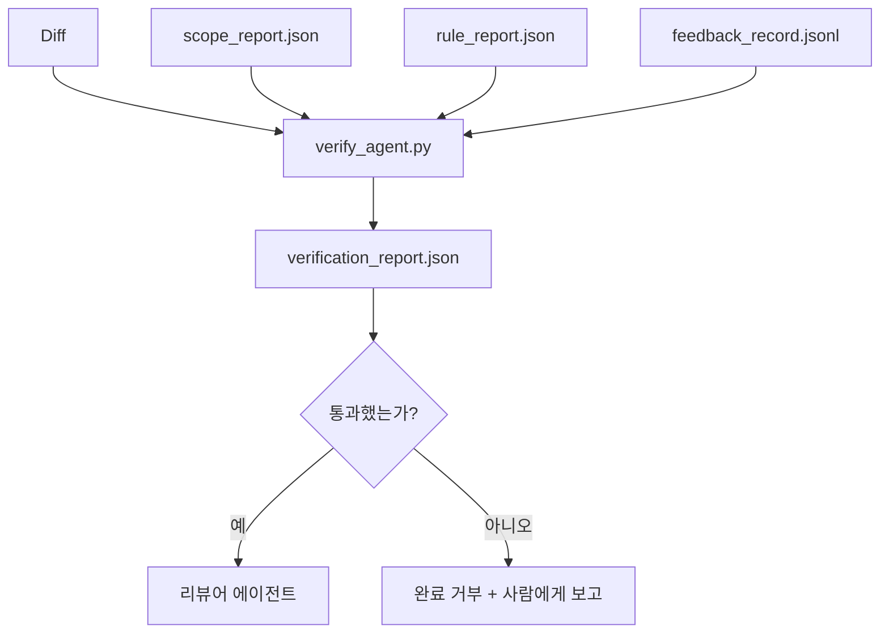

> 🇰🇷 이 문서는 한국어 번역본입니다(ELI5 스타일). 원문: [en.md](en.md)

# 검증 게이트

> 에이전트가 자기 작업을 스스로 완료로 표시해서는 안 됩니다. 검증 게이트는 범위 계약, 피드백 로그, 규칙 리포트, diff를 읽고 딱 한 가지 질문에 답합니다. 이 태스크는 정말로 끝났는가? 게이트가 "아니오"라고 하면, 채팅에서 뭐라고 하든 태스크는 끝나지 않은 것입니다.

**유형:** 빌드
**언어:** Python (표준 라이브러리)
**선수 지식:** Phase 14 · 33 (규칙), Phase 14 · 36 (범위), Phase 14 · 37 (피드백)
**시간:** 약 55분

## 학습 목표

- 검증 게이트를 워크벤치 산출물 위의 결정론적 함수로 정의합니다.
- 규칙 리포트, 범위 리포트, 피드백 기록, diff를 하나의 판정으로 결합합니다.
- 리뷰어 에이전트와 CI가 모두 읽을 수 있는 `verification_report.json`을 내보냅니다.
- 차단(block) 심각도 실패가 있으면 예외 없이 태스크 진행을 거부합니다.

## 문제 상황

에이전트는 성공을 너무 쉽게 선언합니다. 세 가지 실패 형태가 지배적입니다:

- "괜찮아 보이네요." 모델이 자기 diff를 읽고 스스로 맞다고 결정한 것.
- "테스트를 통과했습니다." 자신만만하게 말했지만, 테스트가 실제로 돌았다는 기록은 없음.
- "수용 기준을 충족했습니다." 수용 기준을 "끝난 것 같기만 하면 됨"으로 느슨하게 해석한 것.

워크벤치의 해법은 하나의 검증 게이트입니다. 에이전트가 이미 만들어 낸 산출물을 읽고 최종 판단을 내립니다. 게이트는 결정론적입니다. 게이트는 버전 관리 안에 있습니다. 게이트는 CI에 연결되어 있습니다. 에이전트는 그것을 뇌수할 수 없습니다.

## 개념



### 게이트가 검사하는 것

| 검사 | 원본 산출물 | 심각도 |
|-------|-----------------|----------|
| 모든 수용 명령이 실행됐는가 | `feedback_record.jsonl` | block |
| 모든 수용 명령이 종료 코드 0으로 끝났는가 | `feedback_record.jsonl` | block |
| 범위 검사에 금지된 쓰기가 없는가 | `scope_report.json` | block |
| 범위 검사에 범위 밖 쓰기가 없는가 | `scope_report.json` | block 또는 warn |
| 모든 차단 심각도 규칙을 통과하는가 | `rule_report.json` | block |
| 피드백에 `null` 종료 코드가 없는가 | `feedback_record.jsonl` | block |
| 건드린 파일이 `scope.allowed_files`와 일치하는가 | 양쪽 모두 | warn |

`warn` 발견 항목은 판정에 주석을 다는 것이고, `block` 발견 항목은 `passed: true`를 막습니다.

### 확률적이지 않고 결정론적으로

게이트는 같은 산출물 집합에 대해 항상 같은 판정을 내려야 합니다. LLM 심판은 없습니다. LLM 심판은 정성적 평가가 목적인 리뷰어 쪽(Phase 14 · 39)에 속합니다. 상태 판정이 아니니까요.

### 하나의 리포트, 하나의 경로

게이트는 태스크 종료(close-out)마다 `outputs/verification/<task_id>.json` 아래에 `verification_report.json`을 하나 내보냅니다. CI도 같은 경로를 소비합니다. 경로가 다른 여러 게이트는 단일 진실 공급원을 갈라 놓습니다.

### 예외 없는 거부

차단 심각도 발견 항목은 에이전트가 재정의할 수 없습니다. 사람만이 재정의할 수 있고, 그때 기록으로 남는 `override_reason`(재정의 사유)과 `overridden_by` 사용자 ID가 필요합니다. 재정의는 서명된 변경이지 에이전트의 결정이 아닙니다.

```figure
wb-gate-sequence
```

## 만들어 보기

`code/main.py`는 다음을 구현합니다:

- 입력 산출물마다 로더. 모두 로컬 스텁으로 제공되어 레슨이 자족적입니다.
- `verify(task_id, artifacts) -> VerdictReport` 순수 함수.
- 검사별 결과와 최종 통과/실패를 보여주는 프린터.
- 세 가지 태스크 시나리오 데모: 깨끗한 통과, 범위 확산, 수용 누락.

실행 방법:

```
python3 code/main.py
```

출력: 세 개의 판정 리포트, 각각 스크립트 옆에 저장됩니다.

## 실무에서 쓰이는 프로덕션 패턴

네 가지 패턴이 게이트를 "또 하나의 린트 작업"에서 "최종 결정선"으로 끌어올립니다.

**단일 게이트가 아니라 다층 방어(defense-in-depth).** pre-commit 훅 → CI 상태 검사 → 도구 실행 전 인가(authorization) 훅 → 병합 전 게이트. 각 층은 결정론적이라서 한 층의 실패를 다음 층이 잡습니다. microservices.io의 2026년 3월 플레이북이 명확히 말합니다. pre-commit 훅은 우회 불가능합니다. 모델 쪽 스킬과 달리 에이전트가 지시를 따르는 것에 의존하지 않기 때문입니다. 검증 게이트는 CI / 병합 전 층에 위치합니다.

**결정론적 검사로 방어하고, 모델 심판은 뉘앙스에만.** Anthropic의 2026년 하이브리드 노름 짝: 검증 가능한 보상(단위 테스트, 스키마 검사, 종료 코드)은 "코드가 문제를 해결했는가?"에 답하고, LLM 루브릭은 "코드가 읽기 쉽고, 안전하고, 스타일에 맞는가?"에 답합니다. 게이트는 전자를 돌리고, 리뷰어(Phase 14 · 39)는 후자를 돌립니다. 둘을 섞으면 신호가 무너집니다.

**Slack 스레드가 아니라 서명된 재정의 로그.** 모든 재정의는 `outputs/verification/overrides.jsonl`에 한 행을 남깁니다. 타임스탬프, 발견 항목 코드, 사유, 서명한 사용자, 현재 HEAD 커밋이 담깁니다. 런타임은 서명 없는 재정의를 거부하고, 감사 추적은 git으로 관리됩니다. 이것이 재정의 정책과 재정의 쇼를 가르는 선입니다.

**1급 검사로서의 커버리지 하한.** `coverage_report.json`이 `coverage_floor`(기본 80%) 검사를 먹입니다. 측정된 커버리지가 하한 아래로 떨어지거나, 이전 병합의 하한보다 1퍼센트포인트 이상 낮아지면 게이트가 실패합니다. 이 검사가 없으면 에이전트가 실패하는 테스트를 조용히 삭제해도 검증 리포트는 계속 초록불입니다.

**`--strict` 모드는 warn을 block으로 승격.** 릴리스 브랜치, 출시를 막는 PR, 사고 후 분석(triage)에는 `--strict`가 모든 경고를 하드 실패로 만듭니다. 플래그는 브랜치별 옵트인입니다. 전역 기본은 아닙니다. 모든 것에 엄격하면 일상 흐름이 침식되기 때문입니다.

## 실무 사례

프로덕션 패턴:

- **CI 단계.** `verify_agent` 잡이 에이전트의 최종 산출물에 대해 게이트를 돌립니다. 브랜치 보호는 `passed: true` 없이는 병합을 거부합니다.
- **핸드오프 전 훅.** 에이전트 런타임은 핸드오프 문서를 생성하기 전에 게이트를 호출합니다. 초록 판정이 없으면 핸드오프도 없습니다.
- **수동 분석.** 에이전트가 성공을 주장하는데 사람이 의심할 때, 운영자가 리포트를 읽습니다.

게이트는 워크벤치 흐름의 최종 결정선입니다. 다른 모든 표면은 그것의 상류에 있습니다.

## 활용하기

`outputs/skill-verification-gate.md`는 게이트를 특정 프로젝트에 연결합니다. 어떤 수용 명령이 게이트에 들어가는지, 어떤 규칙이 차단 심각도인지, 어떤 범위 밖 쓰기가 허용되는지, 재정의 감사 로그를 어떻게 저장하는지입니다.

## 연습 문제

1. `coverage_floor` 검사를 추가하세요. 테스트 명령이 최소 80%의 커버리지 리포트를 만들어야 합니다. 하한을 어떤 산출물이 담을지 결정하세요.
2. 모든 `warn`을 `block`으로 승격하는 `--strict` 모드를 지원하세요. strict 모드가 옳은 기본값인 사례를 문서화하세요.
3. 게이트가 JSON 외에 Markdown 요약도 만들게 하세요. 요약에 어떤 필드가 속하는지 정당화하세요.
4. `time_since_last_human_touch` 검사를 추가하세요. 사람의 키 입력 60초 이내에 편집된 파일은 범위 밖 표시에서 면제합니다.
5. 당신 제품의 실제 에이전트 diff에 게이트를 돌려 보세요. 발견 항목 중 몇 개가 진짜이고 몇 개가 잡음인가요? 게이트는 어디서 성장해야 할까요?

## 핵심 용어

| 용어 | 사람들이 말하는 것 | 실제 의미 |
|------|----------------|------------------------|
| 검증 게이트 | "막는 그 검사" | 워크벤치 산출물 위에서 통과/실패 판정을 내리는 결정론적 함수 |
| 차단 심각도 | "하드 실패" | `passed: true`를 막고 서명된 재정의를 요구하는 발견 항목 |
| 재정의 로그 | "왜 통과시켰는가" | 사유와 사용자 ID가 담긴 서명 항목. 리뷰에서 감사함 |
| 수용 명령 | "그 증거" | 종료 코드 0이 곧 `done`의 의미인 셸 명령 |
| 단일 리포트 경로 | "단일 진실 공급원" | CI와 사람 모두가 소비하는 `outputs/verification/<task_id>.json` |

## 더 읽기

- [Anthropic, Harness design for long-running application development](https://www.anthropic.com/engineering/harness-design-long-running-apps)
- [OpenAI Agents SDK guardrails](https://openai.github.io/openai-agents-python/guardrails/)
- [microservices.io, GenAI dev platform: guardrails](https://microservices.io/post/architecture/2026/03/09/genai-development-platform-part-1-development-guardrails.html) — pre-commit과 CI 사이의 다층 방어
- [ICMD, The 2026 Playbook for Agentic AI Ops](https://icmd.app/article/the-2026-playbook-for-agentic-ai-ops-guardrails-costs-and-reliability-at-scale-1776661990431) — 승인 게이트 사다리 (초안 → 승인 → 임계값 이하 자동)
- [Type-Checked Compliance: Deterministic Guardrails (arXiv 2604.01483)](https://arxiv.org/pdf/2604.01483) — 결정론적 게이팅의 상한으로서의 Lean 4
- [logi-cmd/agent-guardrails — merge gate spec](https://github.com/logi-cmd/agent-guardrails) — 범위 + 변이 테스트 게이트
- [Guardrails AI x MLflow](https://guardrailsai.com/blog/guardrails-mlflow) — CI 채점자로서의 결정론적 검증기
- [Akira, Real-Time Guardrails for Agentic Systems](https://www.akira.ai/blog/real-time-guardrails-agentic-systems) — 도구 전/후 게이트
- Phase 14 · 27 — 프롬프트 인젝션 방어 (게이트의 적대적 짝)
- Phase 14 · 36 — 이 게이트가 강제하는 범위 계약
- Phase 14 · 37 — 이 게이트가 채점하는 피드백 로그
- Phase 14 · 39 — 게이트가 넘겨주는 리뷰어 에이전트
