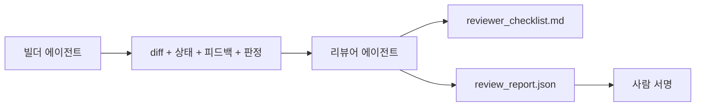

> 🇰🇷 이 문서는 한국어 번역본입니다(ELI5 스타일). 원문: [en.md](en.md)

# 리뷰어 에이전트: 만드는 자와 매기는 자를 분리하라

> 코드를 쓴 에이전트는 그 코드를 채점할 수 없습니다. 리뷰어는 시스템 프롬프트도 다르고 목표도 다른, 두 번째 루프이며, 빌더가 만든 모든 것에 읽기 전용으로 접근합니다. 빌더와 리뷰어 사이의 간극이 바로 신뢰성이 사는 곳입니다.

**유형:** 빌드
**언어:** Python (표준 라이브러리)
**선수 지식:** Phase 14 · 38 (검증 게이트)
**시간:** 약 55분

## 학습 목표

- 같은 에이전트가 자기 작업을 신뢰하게 리뷰할 수 없는 이유를 말할 수 있습니다.
- 빌더의 산출물을 소비해 구조화된 리뷰 리포트를 내놓는 리뷰어 에이전트 루프를 만듭니다.
- 분위기(vibes)가 아니라 구체적 차원을 채점하는 리뷰어 루브릭을 작성합니다.
- 리뷰어를 워크벤치에 연결해서, 사람의 리뷰 단계가 진짜 산출물에서 시작되게 만듭니다.

## 문제 상황

에이전트에게 버그 수정을 부탁했습니다. 네 개의 파일을 고치고, 테스트를 돌리고, 완료라고 보고합니다. 검증 게이트(Phase 14 · 38)는 수용 명령이 실행됐고 범위가 지켜졌음을 확인해 `passed: true`라고 말합니다. 병합합니다. 이틀 뒤에야 그 수정이 버그의 엉뚱한 절반을 고쳤다는 걸 발견합니다.

수용 검증은 필요 조건이지 충분 조건이 아닙니다. 리뷰어는 수용 검증이 물을 수 없는 질문을 합니다. 이것이 맞는 문제를 해결했는가? 범위를 넓히면서도 그걸 표시하지 않았는가? 의심받아야 했던 가정을 그대로 문서화해 두었는가? 다음 세션이 이어받을 수 있는 상태로 워크벤치를 남겼는가?

## 개념



### 리뷰어 루브릭

다섯 차원, 각각 0에서 2점.

| 차원 | 질문 |
|-----------|----------|
| 문제 부합 | 이 변경이 말해진 태스크를 해결했는가, 아니면 근처의 다른 태스크를 해결했는가? |
| 범위 규율 | 편집이 계약 안에 갇혀 있었는가, 아니면 계약을 의도적으로 넓혔는가? |
| 가정 | 숨겨진 가정이 모두 검토 가능한 곳에 기록되어 있는가? |
| 검증 품질 | 수용 명령이 실제로 목표를 증명하는가, 아니면 더 약한 버전을 증명했는가? |
| 핸드오프 준비도 | 다음 세션이 현재 상태에서 깔끔하게 이어받을 수 있는가? |

총점은 10점 만점입니다. 7점 미만은 소프트 실패, 5점 미만은 하드 실패입니다.

### 리뷰어는 별개 역할이지 별개 모델이 아닙니다

리뷰어를 빌더와 같은 모델로 돌려도 됩니다. 규율은 역할 분리에 있습니다. 다른 시스템 프롬프트, 다른 입력, diff에 대한 쓰기 권한 없음. 태세가 바뀌는 것이 곧 신호가 바뀌는 것입니다.

### 리뷰어는 diff를 수정할 수 없습니다

리뷰어는 diff, 상태, 피드백, 판정을 읽습니다. 그리고 리포트를 씁니다. diff를 고치지 않습니다. 리포트가 "이걸 고쳐라"라고 하면, 다음 빌더 차례가 그 수정을 하고, 리뷰어는 다시 리뷰로 돌아갑니다. 역할을 섞으면 그 간극이 무너집니다.

### 리뷰어 루브릭 대 검증 게이트

게이트(Phase 14 · 38)는 결정론적 사실을 검사합니다. 수용 명령이 실행됐는지, 규칙이 통과했는지, 범위가 지켜졌는지. 리뷰어는 정성적 판단을 합니다. 이것이 맞는 작업이었는지, 문서화됐는지, 핸드오프가 쓸 만한지. 둘 다 필요합니다.

```figure
wb-builder-marker
```

## 만들어 보기

`code/main.py`는 다음을 구현합니다:

- 리뷰어가 읽을 산출물을 묶는 `ReviewerInputs` 데이터클래스.
- 차원마다 하나의 함수를 가진 루브릭 채점기. 각 함수는 결정론적이고 이 레슨용 스텁 수준입니다. 실제 구현은 LLM을 호출할 것입니다.
- 다섯 점수, 총점, 판정(`pass`, `soft_fail`, `hard_fail`)을 담는 `review_report.json` 기록기.
- 두 개의 데모 케이스: 깨끗한 변경, 그리고 "테스트는 맞는데 문제가 틀린" 변경.

실행 방법:

```
python3 code/main.py
```

출력: 디스크에 쓰인 두 개의 리뷰 리포트와 차원별 점수 콘솔 표.

## 실무에서 쓰이는 프로덕션 패턴

증거 자료부터. Cloudflare의 2026년 4월 AI Code Review 시스템은 30일간 5,169개 저장소의 48,095개 병합 요청에서 131,246회의 리뷰 실행을 처리했습니다. 리뷰 중간값은 3분 39초였습니다. 최대 7명의 전문 리뷰어(보안, 성능, 코드 품질, 문서, 릴리스 관리, 컴플라이언스, Engineering Codex)가 Review Coordinator 아래에서 병렬로 돌았고, 코디네이터가 발견 항목의 중복을 제거하고 심각도를 판단했습니다. 최상위 모델은 코디네이터 전용으로 남겨두고, 전문가들은 더 싼 등급에서 돌았습니다.

이것을 규모 있게 작동하게 만드는 네 가지 패턴이 있습니다.

**큰 리뷰어 하나가 아니라 전문가 풀.** 5차원 루브릭의 리뷰어 한 명은 개인 저장소에는 충분합니다. 코드베이스에 보안 중요, 성능 중요, 문서 표면이 생기면, 더 작은 프롬프트를 가진 전문가들로 나누세요. 코디네이터가 중복 제거를 하고, 전문가들은 전체 루브릭을 돌리지 않습니다. 모델 등급 분리도 자연스럽게 따라옵니다. 싼 전문가들, 비싼 코디네이터.

**최적화 대상이 아니라 설계 요건으로서의 편향 완화.** LLM 심판은 네 가지 고질적 편향을 보입니다(Adnan Masood, 2026년 4월). 위치 편향(GPT-4는 (A,B) vs (B,A) 순서에서 약 40% 불일치), 장광성 편향(긴 출력에 약 15% 점수 인플레이션), 자기 선호(같은 모델 계열의 출력 선호), 권위 편향(저명한 저자의 참조를 과대평가). 완화책: 두 순서를 모두 평가해 일관된 승자만 인정, 간결함을 명시적으로 보상하는 1-4 척도, 모델 계열을 넘나드는 심판 교대, 채점 전 저자 이름 제거.

**분위기가 아니라 보정 집합(calibration set).** 정답 판정이 알려진 10~20개 태스크의 과거 집합입니다. 프롬프트를 바꿀 때마다 리뷰어를 그 집합 위에서 돌립니다. 과거 기록과의 일치율이 80% 아래로 떨어지면, 리뷰어를 출시하기 전에 루브릭을 고쳐야 합니다. 모든 팀이 결국 재발견하는 것이니, 처음부터 갖추고 시작하는 편이 낫습니다.

**게이트와의 하이브리드 노름.** 검증 게이트(Phase 14 · 38)는 결정론적 검사를 담당합니다(수용 명령 실행 여부, 테스트 통과 여부, 범위 준수 여부). 리뷰어는 의미론적 검사를 담당합니다(맞는 작업이었는지, 가정이 문서화됐는지, 핸드오프가 쓸 만한지). Anthropic의 2026년 가이드는 이 분리에 대해 명확합니다. 게이트가 이미 증명한 것을 리뷰어에게 다시 시키지 마세요.

## 실무 사례

프로덕션 패턴:

- **Claude Code 서브에이전트.** 빌더가 태스크를 닫으면 리뷰어 서브에이전트가 돌고, 루브릭 점수를 PR 코멘트로 달아 줍니다.
- **OpenAI Agents SDK 핸드오프.** 태스크 완료 시 빌더가 리뷰어에게 넘깁니다. 리뷰어는 발견 항목 목록을 들고 되돌려주거나 사람에게 넘길 수 있습니다.
- **두 모델 짝짓기.** 빌더는 빠르고 싼 모델에서 돕니다. 리뷰어는 더 강한 모델에서, 더 작은 컨텍스트로, 판단에 집중해서 돕니다.

리뷰어는 사람이 모든 리뷰를 직접 할 수 없을 때 워크벤치가 기르는 두 번째 눈입니다.

## 활용하기

`outputs/skill-reviewer-agent.md`는 프로젝트 전용 리뷰어 루브릭, 빌더의 산출물에 연결된 리뷰어 에이전트 스텁, 그리고 검증 게이트와의 통합을 생성해서, 사람의 리뷰가 백지가 아니라 쓰인 리포트에서 시작되게 합니다.

## 연습 문제

1. 당신 제품 도메인에 특화된 여섯 번째 차원을 추가하세요. 기존 다섯 차원에 흡수되지 않는 이유를 정당화하세요.
2. 리뷰어를 서로 다른 두 시스템 프롬프트(간결한 것, 장황한 것)로 돌려 보세요. 어느 쪽이 사람이 더 읽을 법한 리포트를 만드나요?
3. 차원마다 `confidence` 필드를 추가하세요. 최저 신뢰도 차원이 0.6 미만이면 리포트 출시를 거부합니다.
4. 보정 집합을 만드세요. 정답이 알려진 10개의 과거 태스크 종료 기록. 리뷰어를 그 위에서 돌려 보세요. 과거 기록과 어디서 불일치하나요?
5. "추가 증거 요청" 기능을 추가하세요. 리뷰어가 채점 전에 빌더에게 특정 테스트 실행을 요구할 수 있게 합니다. 이것이 루프에 빠지지 않으려면 어떤 물러남(back-off)이 옳을까요?

## 핵심 용어

| 용어 | 사람들이 말하는 것 | 실제 의미 |
|------|----------------|------------------------|
| 리뷰어 루브릭 | "체크리스트" | 차원마다 서면 질문이 있는 5차원 0-2점 채점 |
| 소프트 실패 | "수정 필요" | 총점 7 미만. 빌더가 처리할 발견 항목을 받음 |
| 하드 실패 | "거부" | 총점 5 미만 또는 한 차원이라도 0점. 정지하고 사람에게 보고 |
| 역할 분리 | "프롬프트가 다름" | 같은 모델이 두 역할을 해도 됨. 규율은 입력과 태세에 있음 |
| 신뢰도 하한 | "신호 약한 리포트는 내보내지 마" | 루브릭이 불확실하면 판정 발행을 거부 |

## 더 읽기

- [OpenAI Agents SDK handoffs](https://openai.github.io/openai-agents-python/handoffs/)
- [Anthropic Claude Code subagents](https://code.claude.com/docs/en/sub-agents)
- [Cloudflare, Orchestrating AI Code Review at Scale](https://blog.cloudflare.com/ai-code-review/) — 7 전문가 + 코디네이터 아키텍처, 30일간 13.1만 회 실행
- [Agent-as-a-Judge: Evaluating Agents with Agents (OpenReview / ICLR)](https://openreview.net/forum?id=DeVm3YUnpj) — DevAI 벤치마크, 366개 계층적 해결 요건
- [Adnan Masood, Rubric-Based Evaluations and LLM-as-a-Judge: Methodologies, Biases, Empirical Validation](https://medium.com/@adnanmasood/rubric-based-evals-llm-as-a-judge-methodologies-and-empirical-validation-in-domain-context-71936b989e80) — 4가지 편향과 완화책
- [MLflow, LLM-as-a-Judge Evaluation](https://mlflow.org/llm-as-a-judge) — 분리된 빌더/평가자를 위한 프로덕션 도구
- [LangChain, How to Calibrate LLM-as-a-Judge with Human Corrections](https://www.langchain.com/articles/llm-as-a-judge) — 보정 집합 워크플로
- [Evidently AI, LLM-as-a-judge: a complete guide](https://www.evidentlyai.com/llm-guide/llm-as-a-judge)
- [Arize, LLM as a Judge — Primer and Pre-Built Evaluators](https://arize.com/llm-as-a-judge/)
- Phase 14 · 05 — Self-Refine과 CRITIC (단일 에이전트 자기 리뷰 베이스라인)
- Phase 14 · 30 — 평가 주도 에이전트 개발 (보정 집합 생성기)
- Phase 14 · 38 — 리뷰어가 읽는 검증 게이트
- Phase 14 · 40 — 리뷰어 리포트가 먹이가 되는 핸드오프 패킷
