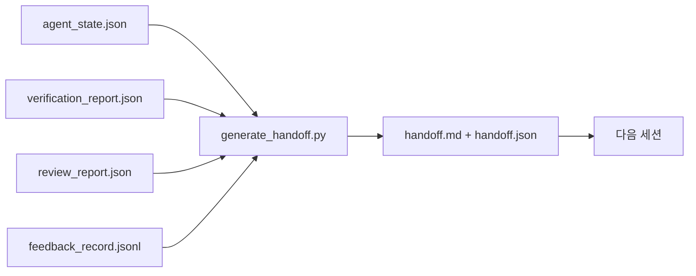

> 🇰🇷 이 문서는 한국어 번역본입니다(ELI5 스타일). 원문: [en.md](en.md)

# 멀티 세션 핸드오프

> 세션은 언젠가 끝납니다. 그래도 작업은 끝나지 않습니다. 핸드오프 패킷은 "에이전트가 한 시간 일했다"를 "다음 세션이 첫 1분 안에 생산적이다"로 바꿔 주는 산출물입니다. 뒷수습이 아니라 의도적으로 만드세요.

**유형:** 빌드
**언어:** Python (표준 라이브러리)
**선수 지식:** Phase 14 · 34 (저장소 메모리), Phase 14 · 38 (검증), Phase 14 · 39 (리뷰어)
**시간:** 약 50분

## 학습 목표

- 모든 핸드오프 패킷에 필요한 일곱 필드를 식별합니다.
- 산문을 손으로 쓰지 않고 워크벤치 산출물에서 핸드오프를 생성합니다.
- 큰 피드백 로그를 핸드오프 크기의 요약으로 잘라냅니다.
- 다음 세션의 첫 행동을 결정론적으로 만듭니다.

## 문제 상황

세션이 끝납니다. 에이전트는 "좋아요, 진전이 있었습니다"라고 말합니다. 다음 세션이 열립니다. 다음 에이전트가 "우리 어디까지 했죠?"라고 묻습니다. 첫 에이전트의 대답은 사라졌습니다. 다음 에이전트는 다시 발견하고, 같은 명령을 다시 돌리고, 사람에게 같은 질문을 다시 하면서, 이전 세션의 마지막 30초를 복구하는 데 30분을 태웁니다.

나쁜 핸드오프의 비용은 태스크가 살아 있는 동안 매 세션마다 지불됩니다. 해법은 세션 끝에 자동으로 생성되는 패킷입니다. 무엇이 바뀌었는지, 왜 바뀌었는지, 무엇을 시도했는지, 무엇이 실패했는지, 무엇이 남았는지, 다음엔 무엇부터 할지.

## 개념



### 모든 핸드오프가 실어 나르는 일곱 필드

| 필드 | 답하는 질문 |
|-------|---------------------|
| `summary` | 무엇을 했는지 한 단락 |
| `changed_files` | 한눈에 보는 diff |
| `commands_run` | 실제로 실행된 것 |
| `failed_attempts` | 무엇을 시도했고 왜 안 됐는지 |
| `open_risks` | 다음 세션을 물 수 있는 것, 심각도와 함께 |
| `next_action` | 다음 세션이 취할 첫 구체적 단계 |
| `verdict_pointer` | 검증 + 리뷰 리포트의 경로 |

하중을 지는 필드는 `next_action`입니다. 나머지가 다 있어도 `next_action`만 없다면 그것은 핸드오프가 아니라 상태 보고서입니다.

### 핸드오프는 쓰는 것이 아니라 생성하는 것입니다

손으로 쓴 핸드오프는 바쁜 날에 건너뛰어지는 핸드오프입니다. 생성기가 워크벤치 산출물을 읽고 패킷을 내놓습니다. 에이전트의 일은 요약을 쓰는 것이 아니라, 생성기가 요약할 수 있는 상태로 워크벤치를 남겨 두는 것입니다.

### 두 가지 형태: 사람이 읽는 것과 기계가 읽는 것

`handoff.md`는 사람이 읽는 것이고, `handoff.json`은 다음 에이전트가 읽어 들이는 것입니다. 둘 다 같은 원본 산출물에서 나옵니다. 서로 어긋나면 JSON이 이깁니다.

### 피드백 로그 잘라내기

전체 `feedback_record.jsonl`은 수백 개 항목일 수 있습니다. 핸드오프는 마지막 K개와 종료 코드가 0이 아닌 모든 항목만 실어 나릅니다. 다음 세션이 필요하면 전체 로그를 읽으면 되지만, 패킷은 작게 유지됩니다.

### 깨끗한 상태를 남기기

핸드오프는 작업을 설명합니다. 깨끗한 상태는 작업을 재개 가능하게 만듭니다. 둘은 같은 것이 아닙니다. 다음 세션이 절반만 적용된 diff, 에이전트가 잊은 임시 파일, 어딘가 헤매는 브랜치, 실행조차 되기 전에 에러 나는 테스트와 함께 열린다면, 완벽한 `handoff.md`는 무가치합니다. 다음 에이전트는 만드는 대신 처음 10분을 이전 에이전트 뒷수습에 쓰게 되고, 그 비용은 태스크가 살아 있는 동안 매 세션 복리로 쌓입니다.

그래서 세션은 피처가 동작할 때 끝나는 게 아닙니다. 워크벤치가 생성기가 요약할 수 있고 다음 세션이 신뢰할 수 있는 상태가 되었을 때 끝납니다. 청소(cleanup)는 그 자체로 하나의 페이즈이고 핸드오프 전에 돌아가며, 습관이 아니라 검사입니다. 습관이란 바쁜 날에 건너뛰어지는 것이니까요.

| 검사 | 깨끗하다는 것 | 지저분하면 막히는 이유 |
|-------|-------------|----------------------|
| 작업 트리 | 모든 변경이 커밋됐거나, 메모와 함께 명시적으로 stash됨 | 절반만 적용된 diff는 다음 에이전트 눈에 의도된 작업처럼 보인다 |
| 임시 산출물 | `*.tmp`, 스크래치 디렉터리, 디버그 출력, 주석 처리된 코드 블록이 남아 있지 않음 | 어긋난 파일들이 diff와 다음 에이전트의 멘탈 모델을 오염시킨다 |
| 테스트 | 초록이거나, 빨간 실패가 `open_risks`에 이름 적혀 있음 | 조용한 빨간 테스트는 다음 세션이 밟는 함정이다 |
| 피처 보드 | `feature_list.json` 상태가 실제를 반영함 (Phase 14 · 36) | 오래된 보드는 다음 세션을 이미 끝난 작업으로 보낸다 |
| 브랜치 | 기대한 브랜치 위, detached HEAD 없음, 고아 브랜치 없음 | 잘못된 브랜치는 다음 세션의 첫 커밋을 엉뚱한 곳에 박는다 |

청소 페이즈는 차단 이슈의 `clean_state.json`을 내놓습니다. 빈 목록이 곧, 핸드오프 생성기가 패킷을 쓰기 전에 단언(assert)하는 전제 조건입니다. 지저분한 트리 위에 지은 핸드오프는 핸드오프가 아니라 전달된 엉망입니다. 두 산출물은 짝을 이룹니다. 청소가 워크벤치를 떠나도 안전함을 증명하고, 핸드오프가 다음 세션이 어디서 시작할지 안다는 것을 증명합니다.

```figure
wb-handoff-packet
```

## 만들어 보기

`code/main.py`는 다음을 구현합니다:

- 상태, 판정, 리뷰, 피드백을 하나의 `WorkbenchSnapshot`으로 모으는 로더.
- `generate_handoff(snapshot) -> (markdown, payload)` 함수.
- 마지막 K개 피드백 항목과 0이 아닌 종료 전체를 고르는 필터.
- 스크립트 옆에 `handoff.md`와 `handoff.json`을 쓰는 데모 실행.

실행 방법:

```
python3 code/main.py
```

출력: 출력된 핸드오프 본문과 디스크에 쓰인 두 파일.

## 실무에서 쓰이는 프로덕션 패턴

Codex CLI, Claude Code, OpenCode는 각자 다른 컴팩션(compaction) 이야기를 실어 나르고, 구조화된 핸드오프 패킷은 그 세 가지 모두 위에 얹힙니다.

**컴팩션 전략은 다양하지만, 패킷 스키마는 아닙니다.** Codex CLI의 POST /v1/responses/compact는 서버 쪽 불투명한 AES 블롭이고(OpenAI 모델용 빠른 경로), 폴백은 `_summary` 사용자 역할 메시지로 덧붙이는 로컬 "핸드오프 요약"입니다. Claude Code는 컨텍스트의 95%에서 5단계 점진 컴팩션을 돌립니다. OpenCode는 타임스탬프 기반 메시지 숨김에 5개 제목의 LLM 요약을 더합니다. 세 가지 다른 메커니즘, 같은 필요: 압축을 살아남는 것을 이동 가능한 산출물로 직렬화하는 것. 그 패킷이 바로 그 산출물입니다.

**새 세션 핸드오프는 컴팩션이 아닙니다.** 컴팩션은 세션을 연장하고, 핸드오프는 세션을 깔끔하게 닫고 다음을 시작합니다. Hermes Issue #20372의 정리(2026년 4월)가 옳습니다. 제자리 압축이 품질을 해치기 시작하면, 에이전트는 간결한 핸드오프를 쓰고, 세션을 끝내고, 새 컨텍스트에서 재개해야 합니다. 그 전환을 싸게 만드는 것이 패킷입니다. 실수는 품질이 무너질 때까지 계속 압축하는 것이고, 해법은 이르고 깔끔한 핸드오프에 예산을 배정하는 것입니다.

**브랜치와 토픽당 하나의 활성 핸드오프.** 멀티 에이전트 협업은 나쁜 모델 출력보다 오래된 핸드오프에서 무너집니다. 항상 `branch`, `last_known_good_commit`, 그리고 `active | superseded | archived` 중 하나의 `status`를 포함하세요. 오래된 핸드오프는 보관(archive)하고, 활성 것만 다음 세션을 움직입니다. 이것이 "노트로서의 핸드오프"와 "상태로서의 핸드오프"의 차이입니다.

**컨텍스트의 50~75%에서 마무리, 벽에 부딪혀서가 아니라.** 손작성 패턴 플레이북(CLAUDE.md + HANDOVER.md)은 세션이 95%가 아니라 50~75% 컨텍스트 예산에서 끝날 때 가장 좋은 결과를 낸다고 보고합니다. 압축 잔재가 원본 상태를 오염시키기 전에 패킷 생성기가 깨끗하게 돌아갑니다. 컨텍스트가 온전할 때 쓰는 것은 싸고, 모델이 이미 자기 위치를 잃어가는 때는 비쌉니다.

## 실무 사례

프로덕션 패턴:

- **세션 종료 훅.** 사용자가 채팅을 닫으면 런타임이 생성기를 발화시킵니다. 패킷은 `outputs/handoff/<session_id>/`로 들어갑니다.
- **PR 템플릿.** 생성기의 마크다운은 PR 본문이 되기도 합니다. 리뷰어는 다른 파일 다섯 개를 열 필요 없이 읽습니다.
- **크로스 에이전트 핸드오프.** 한 제품(Claude Code)으로 만들고 다른 제품(Codex)으로 이어갑니다. 패킷이 공용어(lingua franca)입니다.

패킷은 작고, 규칙적이고, 만들기 쌉니다. 비용 절감은 매 세션 복리로 쌓입니다.

## 활용하기

`outputs/skill-handoff-generator.md`는 프로젝트의 산출물 경로에 맞춰진 생성기, 그것을 실행하는 세션 종료 훅, 그리고 다음 에이전트가 시작 때 읽는 `handoff.json` 스키마를 만들어 냅니다.

## 연습 문제

1. `assumptions_to_validate` 필드를 추가하세요. 빌더가 기록했지만 리뷰어가 1점을 넘게 주지 않은 모든 가정을 드러냅니다.
2. 실패하는 실행과 통과하는 실행에 대해 피드백 요약을 다르게 잘라보세요. 그 비대칭을 정당화하세요.
3. "사람에게 묻는 질문" 목록을 포함하세요. 어떤 질문이 채팅 메시지가 아니라 패킷에 들어가는 임계값은 무엇일까요?
4. 생성기를 멱등하게 만드세요. 두 번 실행하면 같은 패킷이 나옵니다. 그렇게 되려면 무엇이 안정적이어야 할까요?
5. "다음 세션 사전 준비물" 섹션을 추가하세요. 다음 세션이 행동 전에 읽어 들여야 하는 산출물을 정확히 나열합니다.

## 핵심 용어

| 용어 | 사람들이 말하는 것 | 실제 의미 |
|------|----------------|------------------------|
| 핸드오프 패킷 | "세션 요약" | 일곱 필드를 실은 생성된 산출물. 마크다운과 JSON 둘 다 |
| 다음 행동 | "뭐부터 할지" | 다음 세션을 시작하는 하나의 구체적 단계 |
| 피드백 잘라내기 | "로그 요약" | 마지막 K개 기록 + 0이 아닌 종료 전부 |
| 상태 보고서 | "우리가 한 일" | `next_action`이 빠진 문서. 쓸모는 있지만 핸드오프는 아님 |
| 판정 포인터 | "증거서" | 추적성을 위한 검증 + 리뷰 리포트 경로 |

## 더 읽기

- [Anthropic, Effective harnesses for long-running agents](https://www.anthropic.com/engineering/effective-harnesses-for-long-running-agents)
- [OpenAI Agents SDK handoffs](https://openai.github.io/openai-agents-python/handoffs/)
- [Codex Blog, Codex CLI Context Compaction: Architecture, Configuration, Managing Long Sessions](https://codex.danielvaughan.com/2026/03/31/codex-cli-context-compaction-architecture/) — POST /v1/responses/compact와 로컬 폴백
- [Justin3go, Shedding Heavy Memories: Context Compaction in Codex, Claude Code, OpenCode](https://justin3go.com/en/posts/2026/04/09-context-compaction-in-codex-claude-code-and-opencode) — 3벤더 컴팩션 비교
- [JD Hodges, Claude Handoff Prompt: How to Keep Context Across Sessions (2026)](https://www.jdhodges.com/blog/ai-session-handoffs-keep-context-across-conversations/) — CLAUDE.md + HANDOVER.md, 50~75% 컨텍스트 예산
- [Mervin Praison, Managing Handoffs in Multi-Agent Coding Sessions: Fresh Context Without Losing Continuity](https://mer.vin/2026/04/managing-handoffs-in-multi-agent-coding-sessions-fresh-context-without-losing-continuity/) — 분산 시스템 관점
- [Hermes Issue #20372 — automatic fresh-session handoff when compression becomes risky](https://github.com/NousResearch/hermes-agent/issues/20372)
- [Hermes Issue #499 — Context Compaction Quality Overhaul](https://github.com/NousResearch/hermes-agent/issues/499) — Codex CLI의 핸드오프 지향 프롬프트
- [Microsoft Agent Framework, Compaction](https://learn.microsoft.com/en-us/agent-framework/agents/conversations/compaction)
- [OpenCode, Context Management and Compaction](https://deepwiki.com/sst/opencode/2.4-context-management-and-compaction)
- [LangChain, Context Engineering for Agents](https://www.langchain.com/blog/context-engineering-for-agents)
- Phase 14 · 34 — 생성기가 읽는 상태 파일
- Phase 14 · 38 — 패킷이 가리키는 검증 판정
- Phase 14 · 39 — 패킷에 묶이는 리뷰어 리포트
