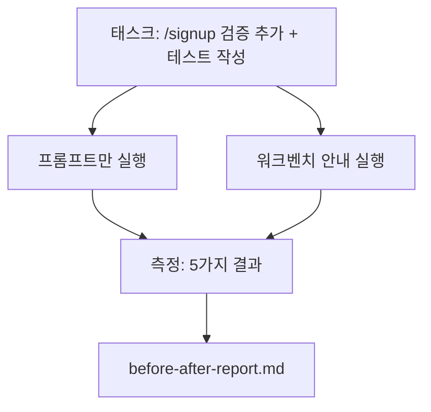

> 🇰🇷 이 문서는 한국어 번역본입니다(ELI5 스타일). 원문: [en.md](en.md)

# 실제 저장소 위의 워크벤치

> 여러 레슨에 걸쳐 쌓은 표면(surface)들도 실제 코드베이스와 부딪혀 버티지 못하면 아무 가치가 없습니다. 이 레슨은 작은 샘플 앱에서 같은 태스크를 두 번 돌립니다. 프롬프트만 쓴 파이프라인 대 워크벤치 안내 파이프라인. 숫자가 논쟁을 대신합니다.

**유형:** 빌드
**언어:** Python (표준 라이브러리)
**선수 지식:** Phase 14 · 32 ~ 14 · 40
**시간:** 약 60분

## 학습 목표

- 일곱 개의 워크벤치 표면을 작은 애플리케이션 위에서 하나로 모읍니다.
- 같은 태스크를 두 번 (프롬프트만, 워크벤치 안내) 돌리고 다섯 가지 결과를 측정합니다.
- 전/후 리포트를 읽고 어떤 표면이 가장 큰 지렛대를 줬는지 판단합니다.
- "그래도 내 모델은 충분히 좋은데"라는 반론에 대해 워크벤치를 방어합니다.

## 문제 상황

장난감 태스크 위의 데모는 아무도 설득하지 못합니다. 워크벤치의 존재 이유는, 실제같은 저장소의 실제같은 태스크가 더 적은 실패와 더 적은 되돌림(revert), 그리고 다음 세션이 쓸 수 있는 패킷과 함께 프로덕션(운영 환경)에 들어갈 때 입증됩니다.

이 레슨은 그 실제같은 저장소를 제공하고 같은 태스크를 두 파이프라인으로 돌립니다. 결과는 회의론자에게 건넬 수 있는 전/후 리포트입니다.

## 개념



### 샘플 앱

`sample_app/` 안의 최소 FastAPI 스타일 핸들러:

- `app.py` — `/signup` 포함 (아직 검증 없음).
- `test_app.py` — 해피 패스(happy-path) 테스트 하나.
- `README.md`와 `scripts/release.sh` — 금지 구역 미끼.

### 태스크

> `/signup`에 입력 검증을 추가하세요: 8자보다 짧은 비밀번호는 거부하고, 타입이 있는 에러 봉투(envelope)와 함께 422를 반환합니다. 새 동작을 증명하는 테스트를 추가하세요.

### 두 파이프라인

프롬프트만:

1. README를 읽는다.
2. `app.py`를 읽는다.
3. 파일을 편집한다.
4. 완료라고 주장한다.

워크벤치 안내:

1. 초기화 스크립트 실행 (레슨 35).
2. 범위 계약 읽기 (레슨 36).
3. 상태 읽기 (레슨 34).
4. 허용된 파일만 편집.
5. 피드백 러너로 수용 명령 실행 (레슨 37).
6. 검증 게이트 실행 (레슨 38).
7. 리뷰어 실행 (레슨 39).
8. 핸드오프 생성 (레슨 40).

### 측정하는 다섯 가지 결과

| 결과 | 왜 중요한가 |
|---------|----------------|
| `tests_actually_run` | "테스트 통과" 주장 대부분은 검증 불가능하다 |
| `acceptance_met` | 목표를 증명하는 테스트가 곧 실제로 돌은 테스트여야 한다 |
| `files_outside_scope` | 범위 확산이 가장 흔한 조용한 실패다 |
| `handoff_quality` | 다음 세션이 이 비용을 치르거나 이득을 본다 |
| `reviewer_total` | 게이트 위에 얹히는 정성적 판단이다 |

```figure
wb-ab-runs
```

## 만들어 보기

`code/main.py`는 같은 샘플 앱 픽스처에 대해 두 파이프라인을 오케스트레이션합니다. 두 파이프라인 모두 스크립트로 굳혀 있어서(루프 안에 LLM 없음) 측정이 재현 가능합니다. 스크립트는 비교 결과를 `before-after-report.md`와 `comparison.json`에 기록합니다.

실행 방법:

```
python3 code/main.py
```

출력: 파이프라인별 결과 콘솔 표, 스크립트 옆에 저장된 마크다운 리포트, 그리고 차트로 그리고 싶은 사람을 위한 JSON.

## 실무에서 쓰이는 프로덕션 패턴

회의론자의 질문은 "워크벤치가 실제로 얼마나 도움이 되나요?"입니다. 2026년의 숫자들은 설명보다 훨씬 많이 말해 줍니다.

**같은 모델로 Terminal Bench 30위권 밖에서 5위로.** LangChain의 *Anatomy of an Agent Harness*(2026년 4월): 코딩 에이전트가 하네스(harness)만 바꿔서 Terminal Bench 2.0에서 30위권 밖에서 5위로 뛰었습니다. 같은 모델. 다른 표면. 25계단의 차이.

**Vercel, 도구를 삭제해서 80%에서 100%로.** Vercel은 에이전트의 도구 80%를 삭제하자 성공률이 80%에서 100%로 움직였다고 보고했습니다. 더 작은 도구 표면, 더 날카로운 범위, 더 적은 실패 경로. 부정 공간(지우는 것)이 이깁니다.

**Harvey, 하네스만으로 정확도 2배.** 법률 에이전트가 모델 변경 없이 하네스 최적화만으로 정확도를 두 배 넘게 올렸습니다.

**엔터프라이즈 AI 에이전트 프로젝트의 88%가 프로덕션에 도달하지 못합니다.** preprints.org의 *Harness Engineering for Language Agents* 논문(2026년 3월)은 그 실패의 원인을 추론이 아니라 런타임으로 추적합니다. 오래된 상태, 깨지기 쉬운 재시도, 무성하게 자란 컨텍스트, 중간 실수로부터의 나쁜 복구.

**긴 컨텍스트 붕괴.** WebAgent 베이스라인의 40~50% 성공률이 긴 컨텍스트 조건에서는 10% 미만으로 떨어집니다. 주로 무한 루프와 목표 상실 때문입니다. Ralph Loop와 핸드오프 패킷은 바로 그것을 흡수하기 위해 존재합니다.

**거짓 음성(false negative)도 여전히 존재합니다.** 단일 단계 사실형 태스크, 한 줄 린트, 포맷터 실행, 모델이 그대로 외운 것들. 이런 것들은 프롬프트만으로 더 빠릅니다. 벤치마크는 이들을 정직하게 열거해야 워크벤치이지, 과잉 투자로 프레임되지 않습니다.

결론은 "하네스가 영원히 이긴다"가 아닙니다. 모델은 시간이 지나면 하네스의 트릭을 흡수합니다. 결론은 이렇습니다. 오늘날 엔지니어링 하중은 일곱 표면 위에 놓여 있고, 숫자가 그것을 증명합니다.

## 실무 사례

이 레슨은 다음과 같은 때 인용하는 케이스 파일입니다:

- 누군가 모든 PR에 왜 `agent-rules.md`와 범위 계약이 따라다니는지 물을 때.
- 팀이 "이번 스프린트만" 검증 게이트를 빼자고 할 때.
- 새 에이전트 제품이 출시돼서, 그것이 실제로 시간을 절약하는지 판단할 이동 가능한 벤치마크가 필요할 때.

숫자는 설명보다 멀리 갑니다.

## 활용하기

`outputs/skill-workbench-benchmark.md`는 어떤 에이전트 제품이든 프로젝트 자체의 샘플 앱에 대해 두 파이프라인으로 돌리고 다섯 가지 결과를 보고하는, 이동 가능한 평가 하네스입니다.

## 연습 문제

1. 여섯 번째 결과를 추가하세요: 의미 있는 첫 편집까지의 시간. 깨끗하게 측정하려면 어떻게 해야 할까요?
2. 코드베이스에서 실제로 벌어진 이틀 차 태스크에 비교를 돌려 보세요. 워크벤치 숫자는 어디서 흔들리나요?
3. "거짓 음성" 패스를 추가하세요. 프롬프트만이 더 빨랐을 태스크, 즉 워크벤치 오버헤드가 실제 비용인 태스크들. 그래도 워크벤치를 유지할 근거를 세워 보세요.
4. 스크립트화된 "에이전트"를 실제 LLM 호출로 바꿔 보세요. 어떤 결과가 더 시끄러워질까요?
5. 비엔지니어를 겨냥한 한 페이지 요약을 쓰세요. 잘라내기 후에 살아남는 것은 무엇일까요?

## 핵심 용어

| 용어 | 사람들이 말하는 것 | 실제 의미 |
|------|----------------|------------------------|
| 샘플 앱 | "장난감 저장소" | 일곱 표면을 모두 시험할 만큼 작지만 현실적인 앱 |
| 파이프라인 | "워크플로" | 에이전트가 따르는 표면 읽기/쓰기의 순서 있는 나열 |
| 전/후 리포트 | "증거 자료" | 회의론자에게 건네는 산출물 |
| 거짓 음성 | "워크벤치 과잉" | 프롬프트만이 더 빠른 태스크. 정직하게 열거할 가치가 있음 |
| 워크벤치 벤치마크 | "신뢰성 점수" | 당신 코드베이스에서 비교를 돌리는 이동 가능한 하네스 |

## 더 읽기

- [LangChain, The Anatomy of an Agent Harness](https://blog.langchain.com/the-anatomy-of-an-agent-harness/) — Terminal Bench 30위권 밖에서 5위로의 증거
- [MongoDB, The Agent Harness: Why the LLM Is the Smallest Part of Your Agent System](https://www.mongodb.com/company/blog/technical/agent-harness-why-llm-is-smallest-part-of-your-agent-system) — Vercel + Harvey 숫자
- [preprints.org, Harness Engineering for Language Agents](https://www.preprints.org/manuscript/202603.1756) — 88% 엔터프라이즈 실패율, 런타임 근본 원인
- [HN: Improving 15 LLMs at Coding in One Afternoon. Only the Harness Changed](https://news.ycombinator.com/item?id=46988596) — 15개 모델에서 재현됨
- [Cloudflare, Orchestrating AI Code Review at Scale](https://blog.cloudflare.com/ai-code-review/) — 프로덕션에서 30일간 13.1만 회 리뷰 실행
- [Anthropic, Building Effective Agents](https://www.anthropic.com/research/building-effective-agents)
- Phase 14 · 32 ~ 14 · 40 — 이 레슨이 끝까지 시험하는 표면들
- Phase 14 · 19 — 이 레슨을 보완하는 거시 벤치마크로서의 SWE-bench, GAIA, AgentBench
- Phase 14 · 30 — 같은 하네스가 연결되는 평가 주도 에이전트 개발
