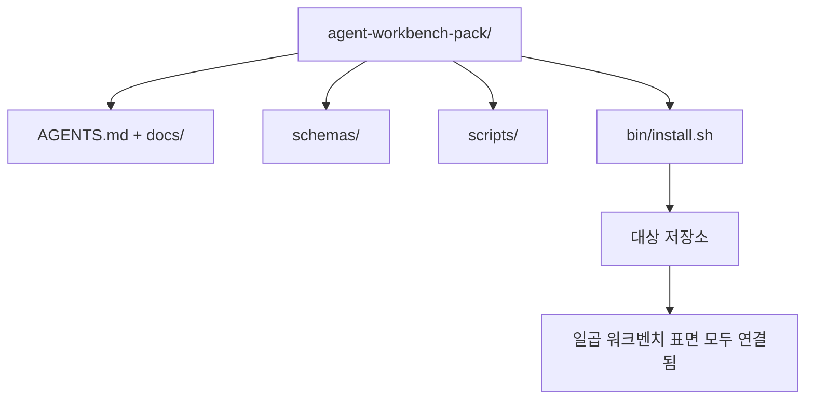

> 🇰🇷 이 문서는 한국어 번역본입니다(ELI5 스타일). 원문: [en.md](en.md)

# 캡스톤: 재사용 가능한 에이전트 워크벤치 팩 출시하기

> 미니 트랙은 어떤 저장소에도 바로 넣을 수 있는 팩(pack)으로 끝납니다. 열한 레슨의 표면들이 `cp -r` 한 번으로 옮길 수 있는 디렉터리로 압축되고, 다음 날 아침이면 에이전트가 안정적으로 일합니다. 캡스톤은 이 커리큘럼이 내세우는 산출물입니다.

**유형:** 빌드
**언어:** Python (표준 라이브러리)
**선수 지식:** Phase 14 · 31 ~ 14 · 41
**시간:** 약 75분

## 학습 목표

- 일곱 개의 워크벤치 표면을 하나의 드롭인(drop-in) 디렉터리로 묶습니다.
- 스키마, 스크립트, 템플릿을 고정(pin)해서 새 저장소가 검증된 기준선(baseline)을 받게 만듭니다.
- 팩을 멱등하게 깔아 주는 설치 스크립트 하나를 추가합니다.
- 무엇이 팩에 남고 무엇이 남지 않는지 결정하며, 각 잘라내기를 정당화합니다.

## 문제 상황

구글 문서, 채팅 기록, 어렴풋이 기억나는 스크립트 세 개에 흩어져 사는 워크벤치는 분기마다 다시 만들어지는 워크벤치입니다. 처방약은 버전 관리되는 팩입니다. 표면과 스키마와 스크립트, 그리고 한 줄 명령 설치기를 갖춘 저장소 또는 디렉터리입니다.

이 레슨을 끝내면 `outputs/agent-workbench-pack/`이 디스크에 출시되고, 어떤 대상 저장소에든 그것을 내려놓는 `bin/install.sh`를 갖게 됩니다.

## 개념



### 팩 구성

```
outputs/agent-workbench-pack/
├── AGENTS.md
├── docs/
│   ├── agent-rules.md
│   ├── reliability-policy.md
│   ├── handoff-protocol.md
│   └── reviewer-rubric.md
├── schemas/
│   ├── agent_state.schema.json
│   ├── task_board.schema.json
│   └── scope_contract.schema.json
├── scripts/
│   ├── init_agent.py
│   ├── run_with_feedback.py
│   ├── verify_agent.py
│   └── generate_handoff.py
├── bin/
│   └── install.sh
└── README.md
```

### 무엇이 들어가고 무엇이 안 들어가는가

들어가는 것:

- 표면 스키마. 그것이 계약입니다.
- 위의 네 스크립트. 그것이 런타임입니다.
- 네 개의 문서. 그것이 규칙과 루브릭입니다.

안 들어가는 것:

- 프로젝트 고유의 태스크. 태스크는 대상 저장소의 보드에 있어야지 팩 안에 있으면 안 됩니다.
- 벤더 SDK 호출. 팩은 프레임워크 불가지론적입니다.
- 온보딩 산문. 팩은 팀의 기존 온보딩 안쪽이 아니라 그 옆에 삽니다.

### 설치기

짧은 `bin/install.sh` (또는 `bin/install.py`):

1. `--force` 없이 기존 팩 위에 설치하는 것을 거부합니다.
2. 팩을 대상 저장소로 복사합니다.
3. `.github/workflows/`가 존재하면 CI를 연결합니다.
4. 다음 단계를 출력합니다. 보드 채우기, 수용 명령 설정, 초기화 스크립트 실행.

### 버저닝

팩은 `VERSION` 파일을 실어 나릅니다. 마이그레이션이 필요한 스키마 변경과 스크립트 변경은 메이저를 올립니다. 문서만 바뀌면 패치를 올립니다. 대상 저장소의 `agent_state.json`은 자신이 어떤 팩 버전으로 초기화됐는지 기록합니다.

```figure
wb-pack-install
```

## 만들어 보기

`code/main.py`는 이 미니 트랙의 이전 레슨들에서 온 스키마와 스크립트, 그리고 여러분이 이미 작성한 문서들로 시드된 팩을 레슨 옆의 `outputs/agent-workbench-pack/`으로 조립합니다.

실행 방법:

```
python3 code/main.py
```

스크립트는 표면들을 복사하고 고정하고, README를 쓰고, 팩 트리를 출력하고, 종료 코드 0으로 끝납니다. 다시 실행해도 멱등합니다.

## 실무에서 쓰이는 프로덕션 패턴

팩은 포크, 업데이트, 불친절한 업스트림을 살아남아야 가치가 있습니다. 그렇게 만드는 네 가지 패턴이 있습니다.

**`VERSION`은 마케팅이 아니라 계약입니다.** 메이저 올림에는 상태 마이그레이션이 필요하고, 마이너 올림에는 검사기 재실행이 필요하며, 패치 올림은 문서 전용입니다. 설치기는 매 설치 때 대상 저장소에 `.workbench-version`을 기록하고, `lint_pack.py`는 대상의 잠금(lock)이 팩의 `VERSION`과 어긋나면 출시를 거부합니다. `npm`, `Cargo`, `pyproject.toml`이 10년의 격변을 살아남은 방식이 바로 이것이고, 에이전트라서 규칙이 달라지는 것은 없습니다.

**크로스 도구 배포를 위한 단일 소스.** Nx는 하나의 설정에서 `AGENTS.md`, `CLAUDE.md`, `.cursor/rules/`, `.github/copilot-instructions.md`, MCP 서버를 한 번에 내려놓는 `nx ai-setup` 하나를 제공합니다. 팩도 같은 일을 해야 합니다. 설치기가 심볼릭 링크(`ln -s AGENTS.md CLAUDE.md`)를 만들어서 단일 진실 공급원이 모든 코딩 에이전트로 뻗어 나가게 합니다. 한 도구를 다른 도구보다 지원하려고 팩을 포크하는 것 자체가 실패 양상입니다.

**사소하지 않은 상태를 만나면 거부하는 `uninstall.sh`.** 팩을 제거한다고 사용자의 `agent_state.json`, `task_board.json`, `outputs/`를 지워서는 안 됩니다. 제거기는 스키마, 스크립트, 문서, `AGENTS.md`(옵트아웃 `--keep-agents-md` 제공)를 지우고, 상태 파일에 커밋되지 않은 변경이 있으면 진행을 거부합니다. 상태는 사용자의 것이지, 팩이 소유하는 것이 아닙니다.

**출판 가능한 스킬, SkillKit 스타일 배포.** 팩은 SkillKit 스킬로 출시됩니다. `skillkit install agent-workbench-pack`이 단일 소스에서 32개 AI 에이전트에 걸쳐 그것을 내려놓습니다. 팩 저장소가 단일 진실 공급원이고, SkillKit은 배포 채널입니다. 벤더 종속은 무너지고, 일곱 표면은 그대로입니다.

## 실무 사례

팩이 출시되는 세 가지 형태:

- **저장소에 넣는 디렉터리로.** `cp -r outputs/agent-workbench-pack /path/to/repo`.
- **공개 템플릿 저장소로.** 포크해서 커스터마이즈하고, `VERSION`이 어긋남(drift)을 통제합니다.
- **SkillKit 스킬로.** 에이전트 제품에 연결해서 한 줄 명령으로 내려놓습니다.

팩은 레시피입니다. 각 설치는 한 접시입니다.

## 활용하기

`outputs/skill-workbench-pack.md`는 프로젝트에 맞춰진 팩을 생성합니다. 팀의 이력에 맞게 갈아 세운 규칙, 저장소에 맞춘 범위 글롭, 도메인 고유 항목 하나로 확장된 루브릭 차원.

## 연습 문제

1. 선택적인 다섯 번째 문서 중 정준 팩에 승격시킬 만한 것을 고르세요. 그 잘라내기를 정당화하세요.
2. 설치기를 `--dry-run` 플래그가 있는 Python으로 다시 쓰세요. Bash와의 사용성을 비교하세요.
3. 팩을 안전하게 제거하되 상태 파일에 사소하지 않은 이력이 있으면 거부하는 `bin/uninstall.sh`를 추가하세요. 무엇이 사소하지 않은 이력일까요?
4. 팩이 `VERSION`에서 어긋나면 실패하는 `lint_pack.py`를 추가하세요. 팩 자체 저장소의 CI에 연결하세요.
5. 손수 만든 워크벤치에서 이 팩으로 가는 마이그레이션 런북을 작성하세요. 가동 중단 시간을 최소화하는 작업 순서는 무엇일까요?

## 핵심 용어

| 용어 | 사람들이 말하는 것 | 실제 의미 |
|------|----------------|------------------------|
| 워크벤치 팩 | "스타터 키트" | 일곱 표면 전부를 실은 버전 관리되는 디렉터리 |
| 설치기 | "설정 스크립트" | 팩을 멱등하게 내려놓는 `bin/install.sh` |
| 팩 버전 | "VERSION" | 스키마/스크립트 변경은 메이저, 문서 전용은 패치 |
| 드롭인 팩 | "cp -r 하면 끝" | 첫날 저장소별 커스터마이징 없이 동작하는 팩 |
| 포크 가능한 템플릿 | "GitHub 템플릿" | GitHub의 "Use this template"으로 복제할 수 있는 공개 저장소 |

## 더 읽기

- Phase 14 · 31 ~ 14 · 41 — 이 팩이 묶는 모든 표면
- [SkillKit](https://github.com/rohitg00/skillkit) — 이 스킬을 32개 AI 에이전트에 설치
- [Nx Blog, Teach Your AI Agent How to Work in a Monorepo](https://nx.dev/blog/nx-ai-agent-skills) — 6개 도구를 아우르는 단일 소스 생성기
- [agents.md — the open spec](https://agents.md/) — 팩의 라우터가 구현해야 할 것
- [HKUDS/OpenHarness](https://github.com/HKUDS/OpenHarness) — 팩과 동급의 참조 구현
- [andrewgarst/agentic_harness](https://github.com/andrewgarst/agentic_harness) — 평가 모음이 붙은 Redis 기반 참조 구현
- [Augment Code, A good AGENTS.md is a model upgrade](https://www.augmentcode.com/blog/how-to-write-good-agents-dot-md-files) — 팩 문서의 품질 기준
- [Anthropic, Effective harnesses for long-running agents](https://www.anthropic.com/engineering/effective-harnesses-for-long-running-agents)
- [Anthropic, Harness design for long-running application development](https://www.anthropic.com/engineering/harness-design-long-running-apps)
- Phase 14 · 30 — 팩의 검증 게이트를 소비하는 평가 주도 에이전트 개발
- Phase 14 · 41 — 이 팩이 개선하는 전/후 벤치마크
