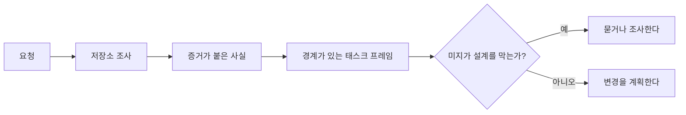

> 🇰🇷 이 문서는 한국어 번역본입니다(ELI5 스타일). 원문: [en.md](en.md)

# 에이전트가 코드를 쓰기 전에 태스크를 프레임하라

> 코딩 에이전트는 명확한 태스크를 빠르게 구현합니다. 불명확한 태스크도 빠르게 구현합니다. 속도는 같습니다. 하지만 비용은 다릅니다.

**유형:** 학습 + 빌드
**언어:** Python (표준 라이브러리)
**선수 지식:** Phase 14 레슨 31, 36
**시간:** 약 60분

## 비싼 실패

"중복 이메일 방지를 추가해 줘"는 구체적으로 들립니다. 그러나 아닙니다. 고유성(unique) 제약은 API, 도메인 서비스, 데이터베이스 중 어디에 들어가나요? 비교는 대소문자를 구분하나요? 어떤 에러 형태가 이미 공개 계약인가요? 마이그레이션이 허용되나요? 어떤 테스트가 그 동작을 증명하나요?

능력 있는 에이전트는 그 공백을 그럴듯한 선택으로 채워 넣습니다. 그게 바로 위험한 경우입니다. 구현이 깔끔하고, 테스트도 통과하는데도, 시스템과는 맞지 않을 수 있기 때문입니다.

따라서 코딩 에이전트 작업의 첫 번째 단위는 편집이 아닙니다. 저장소 증거에 뒷받침된 태스크 프레임입니다.

## 태스크 프레임

쓸모 있는 프레임은 여섯 필드를 갖습니다:

| 필드 | 질문 |
|---|---|
| 목표 | 어떤 관찰 가능한 동작이 바뀌어야 하는가? |
| 저장소 사실 | 코드, 테스트, 설정, 이력에서 무엇을 검증했는가? |
| 허용 경로 | 변경이 어디에 놓일 수 있는가? |
| 금지 경로 | 무엇은 건드리면 안 되는가? |
| 수용 증거 | 어떤 명령이나 관찰이 목표를 증명하는가? |
| 미지(unknown) | 어떤 결정이 아직 증거나 사람의 판단을 필요로 하는가? |

사실에는 증거서(receipt)가 필요합니다. "API는 중복에 409를 쓴다"는 말은, 기존 테스트나 핸들러를 가리킬 수 있기 전까지는 사실이 아닙니다. 파일 경로와 줄 번호면 충분하고, 동작이 중요하다면 명령 실행 결과가 더 좋습니다.



## 정찰(reconnaissance)은 제약을 찾는 일입니다

저장소 전체를 읽지 마세요. 변경을 구속하는 표면만 찾으세요:

1. 현재 동작과 그 호출자.
2. 가장 가까운 기존 테스트.
3. 공개 계약 또는 직렬화되는 형태.
4. 그 경로를 다스리는 프로젝트 지침.
5. 빌드와 검증 명령.
6. 지역 관례를 드러내주는 비슷한 완료된 변경들.

모든 예정된 결정이 증거로 뒷받침되거나, 명시적으로 위임됐거나, 미지로 목록화되었을 때 멈추세요. 그 지점 이후의 추가 읽기는 대개 회피입니다.

## 미지(unknown)는 실패가 아닙니다

미지는 통제된 공백입니다. 가정은 그 공백에 대한 통제되지 않은 대답입니다.

각 미지를 분류하세요:

- **발견 가능(Discoverable):** 저장소나 실행 중인 시스템이 답할 수 있다.
- **위임 가능(Decidable):** 태스크 계약이 에이전트에게 선택 권한을 준다.
- **사람(Human):** 그 선택이 제품 동작, 비용, 위험, 공개 호환성을 바꾼다.
- **연기(Deferred):** 그 선택은 이 슬라이스 밖이며 비목표(non-goals)에 속한다.

에이전트는 발견 가능한 미지와 위임된 미지는 통과해 나가야 합니다. 사람의 미지 앞에서는, 그 선택이 코드 속에 묻히기 전에 멈춰야 합니다.

## 구현 전에 수용 증거를 쓴다

패치보다 증명을 먼저 쓰세요. 증명은 이럴 수 있습니다:

- 집중된 단위 또는 통합 테스트 명령;
- 이름 붙은 뷰포트와 기대 상태가 있는 브라우저 여정;
- 와이어 요청과 정확한 응답 계약;
- 임계값이 있는 성능 측정;
- 무관한 파일이 바뀌지 않았음을 확인하는 범위 검사.

"테스트 통과"는 증명 계획이 아닙니다. 권위 있는 테스트와 그것이 뒷받침하는 주장을 이름으로 적으세요.

## 만들어 보기

랩 코드는 `TaskFrame`을 만들고, 경계와 증거를 검증하고, `outputs/task-frame.md`에 씁니다.

이 레슨 디렉터리에서 실행하세요:

```bash
python3 code/main.py
python3 -m unittest discover code/tests -v
```

예제를 네 가지 방식으로 망가뜨려 보세요. 목표 제거, 사실 증거서 제거, 허용 경로와 금지 경로 겹치기, 수용 명령 제거. 검증기는 각각 다른 이유로 그 프레임을 거부해야 합니다.

## 실제 저장소에서 활용하기

에이전트에게 편집을 시키기 전에:

1. 목표를 파일 변경이 아니라 동작으로 적으세요.
2. 정확한 증거와 함께 사실 둘이나 셋을 기록하세요.
3. 가장 작은 허용 경로 집합을 이름 짓세요.
4. 부정 공간(금지 영역)을 명시적으로 적으세요.
5. 태스크를 닫는 명령이나 관찰을 적으세요.
6. 아직 얻지 못한 결정들을 목록화하세요.

프레임은 한 화면에 들어가야 합니다. 들어가지 않는다면 그 태스크에는 독립적으로 검증 가능한 변경이 여러 개 섞여 있을지도 모릅니다.

## 연습 문제

1. 당신 저장소 중 하나의 실제 버그를, 해법을 제안하지 않고 프레임해 보세요.
2. 프레임에서 실제로는 가정인 주장을 하나 찾으세요. 증거로 바꾸세요.
3. 대답이 공개 계약을 바꾸게 될 사람의 미지를 하나 추가하세요.
4. 넓은 허용 경로 하나를 가장 작은 안전한 집합으로 쪼개세요.
5. 수용 증거에 범위 증거서(scope receipt)를 추가하세요.

## 더 읽기

- [Nuseibeh and Easterbrook, Requirements Engineering: A Roadmap](https://www.cs.toronto.edu/~sme/papers/2000/ICSE2000.pdf) — 구현을 실세계의 목표와 변화하는 제약에 고정하기.
- [Yang et al., SWE-agent: Agent-Computer Interfaces Enable Automated Software Engineering](https://arxiv.org/abs/2405.15793) — 코딩 에이전트를 둘러싼 인터페이스가 효과를 바꾼다는 증거.

## 남기는 것

`outputs/task-frame.md`를 남기세요. 다음 레슨의 입력이며, 그 레슨에서 프레임이 증거에 뒷받침된 실행 계획이 됩니다.
