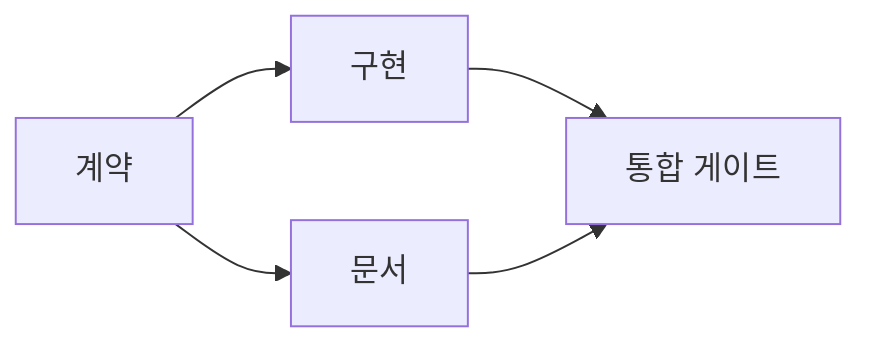

> 🇰🇷 이 문서는 한국어 번역본입니다(ELI5 스타일). 원문: [en.md](en.md)

# 근거에 기반한 실행 계획 세우기

> 계획은 그저 좀 더 예쁜 할 일 목록이 아닙니다. 모든 변경에는 이유가 붙고, 모든 끝 노드(마지막 작업)에는 증거가 붙는 의존성 그래프입니다.

**유형:** 학습 + 빌드
**언어:** Python (표준 라이브러리)
**선수 지식:** 페이즈 14 레슨 43
**시간:** 약 65분

## 학습 목표

- 태스크 프레임을 근거와 증거가 붙은 작업 항목으로 변환합니다.
- 순서를 장황한 설명 대신 의존성으로 모델링합니다.
- 코드를 고치기 전에 빠진 사실, 알 수 없는 의존성, 순환 구조를 찾아냅니다.
- 함께 실행할 수 있는 단계와 기다려야 하는 단계를 구분합니다.

## 에이전트 계획이 실패하는 이유

허약한 계획은 요청 내용을 미래형으로 되풀이할 뿐입니다:

1. API를 업데이트한다.
2. 테스트를 추가한다.
3. 문서를 업데이트한다.

이 목록에는 무엇을 발견했는지, 왜 그 파일들이 맞는지, 어떤 계약(컨트랙트)을 먼저 바꿔야 하는지, 무엇을 동시에 진행할 수 있는지가 하나도 없습니다. 에이전트는 모든 단계를 그대로 따라가도 결국 똑같은 일을 다시 해야 할 수 있습니다.

강한 계획은 각 작업 항목마다 다섯 가지를 약속합니다:

| 약속 | 목적 |
|---|---|
| 식별자 | 의존성 표현과 작업 인계를 위한 안정적인 참조 |
| 변경 | 가장 작은 동작 또는 계약 변경 |
| 근거 | 변경을 정당화하는 저장소 사실 |
| 의존성 | 먼저 참이 되어야 하는 작업 |
| 증거 | 항목을 완료로 닫는 정확한 검사 |

## 구현보다 계약을 먼저 계획하기

여러 접점(화면, API 등)이 같은 동작에 의존할 때는 그 동작을 먼저 정의합니다. 그러면 테스트, 구현, 문서, 통합이 각자 네 가지 버전을 만드는 대신 하나의 계약을 공유할 수 있습니다.



이 그래프는 안전하게 동시 진행할 수 있는 부분을 보여 줍니다. 계약이 확정되면 구현과 문서는 함께 진행할 수 있고, 통합은 둘 다 끝날 때까지 기다립니다.

## 근거는 계획을 바꾼다

저장소에서 뽑아낸 근거는 장식이 아닙니다. 근거는 작업 자체를 바꿀 수 있어야 합니다:

- 이미 있는 헬퍼 함수를 발견하면, 예정됐던 새 추상화가 필요 없어집니다.
- 호환성 테스트 때문에 마이그레이션 단계를 추가해야 할 수 있습니다.
- 배포 제약 조건 때문에 스키마 변경을 다른 작업으로 옮겨야 할 수 있습니다.
- 공개 응답 타입 때문에 구현과 문서의 순서가 바뀌어야 할 수 있습니다.

어떤 정보가 계획을 바꾸지 못한다면, 그것은 그 결정을 위한 근거가 아닐 가능성이 높습니다.

## 중단을 대비한 설계

코딩 에이전트 세션은 예고 없이 끝나곤 합니다. 이어서 진행할 수 있는 계획이란, 작업 항목이 충분히 작아서 다른 세션이 다음을 알아낼 수 있는 계획입니다:

- 어떤 항목이 완료됐는지
- 어떤 증거(검사)가 실행됐는지
- 어떤 산출물이 바뀌었는지
- 어떤 의존성이 이제 풀렸는지
- 다음으로 안전하게 진행할 항목이 무엇인지

상태를 채팅 안의 체크박스에만 저장하지 마세요. 계획은 작업물 바로 옆에 함께 보관해야 합니다.

## 계획 검증

다음 경우에는 실행 전에 계획을 거부하세요:

- 식별자가 중복됐을 때
- 작업 항목에 근거가 없을 때
- 작업 항목에 증거가 없을 때
- 의존성이 존재하지 않는 항목을 가리킬 때
- 그래프에 순환이 있을 때
- 관련된 불확실성이 해소되기 전에 되돌릴 수 없는 첫 행동이 실행될 때

처음 다섯 가지 검사는 기계적으로 수행할 수 있습니다. 마지막 하나는 판단이 필요하므로 명시적으로 짚어 줘야 합니다.

## 직접 만들어 보기

`code/main.py`는 작업 항목을 모델링하고, 항목별 근거(영수증)를 검증하고, 위상 정렬(topological sort)로 실행 웨이브를 계산한 뒤, `outputs/evidence-plan.json`에 기록합니다.

실행:

```bash
python3 code/main.py
python3 -m unittest discover code/tests -v
```

이 예제는 세 개의 웨이브를 만듭니다. 계약 정의가 먼저 실행되고, 구현과 문서가 함께 실행되며, 통합 게이트가 마지막에 실행됩니다.

## 코딩 에이전트와 함께 사용하기

에이전트에게 파일을 바꾸기 전에 계획을 먼저 만들도록 요청하세요. 그리고 계획에서 세 가지를 확인하세요:

1. 모든 경로와 동작 주장에 저장소 근거(영수증)가 붙어 있는가?
2. 모든 항목에 완료를 증명하는 명확한 검사가 하나씩 있는가?
3. 그래프가 비용이 크거나 되돌릴 수 없는 작업을, 그 작업이 의존하는 불확실성이 해소될 때까지 미루고 있는가?

승인해야 할 대상은 "조심히 하겠다"는 막연한 약속이 아니라 계획 그 자체입니다.

## 연습 문제

1. 사람의 명시적 승인이 필요한 마이그레이션 항목을 추가해 보세요.
2. 순환을 만들어 보고, 그 이면에 숨어 있는 제품 방향에 대한 의견 차이를 설명해 보세요.
3. 증거(검사) 명령이 두 개인 항목 하나를 쪼개 보세요.
4. 기존 어느 쪽 가지도 건드리지 않으면서 두 번째 웨이브에서 실행할 수 있는 작업 항목을 추가해 보세요.
5. JSON을 원본(source of truth)으로 유지하면서 계획을 마크다운으로 렌더링해 보세요.

## 더 읽을거리

- [Nuseibah and Easterbrook, Requirements Engineering: A Roadmap](https://www.cs.toronto.edu/~sme/papers/2000/ICSE2000.pdf) — 목표, 명세, 합의, 진화 사이의 반복적인 관계를 다룹니다.
- [Barry Boehm, A Spiral Model of Software Development and Enhancement](https://dl.acm.org/doi/10.1145/12944.12948) — 고정된 직선 순서가 아니라 리스크 해소를 중심으로 개발 순서를 잡는 방법을 다룹니다.

## 남는 산출물

`outputs/evidence-plan.json`을 남겨 두세요. 이 파일은 다음 레슨에서 위임(delegation) 계약으로 쓰입니다.
