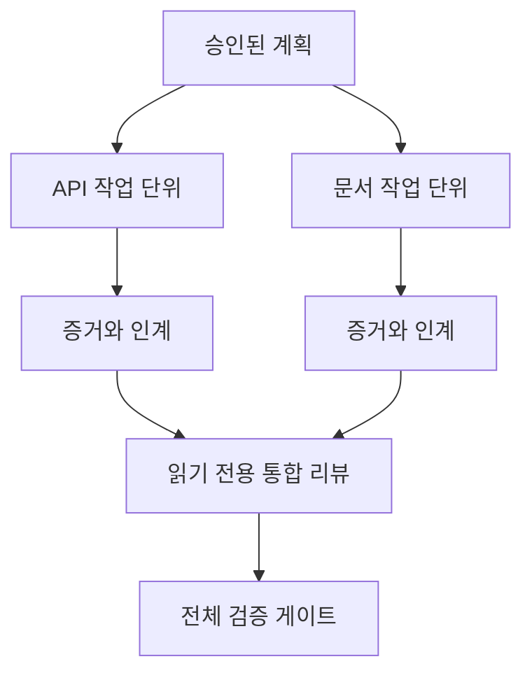

> 🇰🇷 이 문서는 한국어 번역본입니다(ELI5 스타일). 원문: [en.md](en.md)

# 격리와 병합 계약으로 에이전트 작업 위임하기

> 병렬 에이전트는 작업이 서로 독립적일 때만 실제 시간을 아껴 줍니다. 그렇지 않으면 하나의 명확한 작업을, 더 빨리 실패하는 조율 문제로 바꿔 버립니다.

**유형:** 학습 + 빌드
**언어:** Python (표준 라이브러리)
**선수 지식:** 페이즈 14 레슨 39와 44
**시간:** 약 70분

## 학습 목표

- 진짜 독립성이 있을 때만 위임이 정당하다고 판단합니다.
- 각 작업자에게 파일에 대한 배타적 소유권과 명시적인 증거를 부여합니다.
- 의존성으로부터 실행 웨이브를 계산합니다.
- 에이전트 작업을 안전하게 합치기 위한 병합 계약을 설계합니다.

## 병렬화 판정법

사용할 수 있는 에이전트가 더 많다는 이유만으로 위임하지 마세요. 다음 중 하나라도 참일 때 위임하세요:

- 두 조사가 서로 다른 미지의 문제를 독립적으로 답할 수 있을 때
- 두 구현이 서로 겹치지 않는 파일과 계약을 각자 소유할 때
- 리뷰어가 완성된 산출물을 바꾸지 않고 검토할 수 있을 때
- 느린 외부 검사가 진행되는 동안 로컬 작업을 계속할 수 있을 때

에이전트들이 같은 파일, 같은 미해결 결정, 같은 변경 가능한 환경을 필요로 한다면 작업은 직렬로 유지하세요.

## 작업 단위는 곧 계약이다

위임되는 각 단위에는 다음이 필요합니다:

| 필드 | 의미 |
|---|---|
| 목표 | 관찰 가능한 결과 하나 |
| 소유자 | 책임지는 작업자 한 명 |
| 경로 | 배타적인 쓰기 소유권 |
| 의존성 | 시작 전에 완료되어야 하는 단위 |
| 증거 | 통합자에게 돌려보낼 정확한 근거 |
| 인계 | 바뀐 파일, 내린 결정, 남은 리스크 |

"백엔드를 맡아 줘"는 작업 단위가 아닙니다. "`app/accounts.py`에 중복 검사를 구현하고, 집중된 계정 테스트로 증명해라"가 작업 단위입니다.

## 격리에는 세 층이 있다

1. **파일시스템 격리:** 별도의 워크트리(worktree)나 샌드박스는 실수로 같은 파일을 고치는 사고를 막아 줍니다.
2. **소유권 격리:** 계약은 두 작업자가 의도적으로 같은 경로를 고치는 일을 막아 줍니다.
3. **상태 격리:** 별도의 로그와 출력은 한 작업자가 다른 작업자의 증거를 덮어쓰는 일을 막아 줍니다.

파일시스템 격리만으로는 소유권 문제가 해결되지 않습니다. 깨끗한 워크트리 두 개라도 서로 충돌하는 설계를 내놓을 수 있습니다. 병합 계약은 작업이 시작되기 전에 공유 인터페이스를 먼저 정리해야 합니다.



## 통합자는 작업을 다시 만들지 않는다

통합자가 해야 할 일은 다음과 같습니다:

1. 각 인계가 할당된 범위와 일치하는지 확인한다;
2. 작업자의 요약이 아니라 증거 출력을 직접 읽는다;
3. 의존성 순서대로 변경을 합친다;
4. 단위를 넘는 전체 검증 게이트를 실행한다;
5. 몰래 범위를 넓힌 경우를 거부한다;
6. 충돌은 조용히 고쳐 쓰지 않고 새로운 결정으로 기록한다.

통합하려다 보니 작업자의 결과물 대부분을 다시 써야 한다면, 애초에 작업 쪼개기가 잘못된 것입니다.

## 사람과 에이전트의 역할

위임한다고 해서 사람의 판단이 사라지는 것은 아닙니다. 공개 동작, 리스크, 권한, 되돌릴 수 없는 비용을 바꾸는 선택은 여전히 사람이 책임집니다. 에이전트는 범위가 정해진 조사, 구현, 검증, 리뷰를 맡을 수 있습니다.

이것이 바로 조정된 자율성(calibrated autonomy)입니다. 시스템은 근거와 되돌리기(롤백)가 튼튼한 곳에서는 자유를 주고, 결과가 큰 곳에서는 체크포인트를 요구합니다.

## 직접 만들어 보기

이 실습은 경로 겹침을 검사하고, 의존성을 검증하고, 안전한 실행 웨이브를 계산한 뒤, `outputs/delegation-plan.json`에 기록합니다.

실행:

```bash
python3 code/main.py
python3 -m unittest discover code/tests -v
```

문서 단위가 `app/`을 소유하도록 바꿔 보세요. 그 상위 경로가 API 단위와 겹치기 때문에 계획이 막혀야(block) 합니다.

## 연습 문제

1. 실제 변경 하나를 독립적인 작업 단위 두 개와 통합자 한 명으로 쪼개 보세요.
2. 겉보기에만 독립적으로 보이는 병렬 분할 예를 찾아 보세요. 공유되는 결정이 무엇인지 밝히세요.
3. 산출물이 사실 표(fact table)인 읽기 전용 조사 작업자를 추가해 보세요.
4. 최종 변경 파일 집합을 모든 단위 계약과 대조하는 병합 게이트를 추가해 보세요.
5. 의존성이 무효가 된 작업자를 위한 취소 규칙을 정의해 보세요.

## 더 읽을거리

- [Reid Smith, The Contract Net Protocol](https://doi.org/10.1109/TC.1980.1675516) — 분산 작업 할당과 결과 보고를 일찍이 형식화한 논문입니다.
- [Eric Horvitz, Principles of Mixed-Initiative User Interfaces](https://dl.acm.org/doi/10.1145/302979.303030) — 자동화가 언제 스스로 움직이고 언제 사람에게 제어를 돌려줄지 판단하는 원칙을 다룹니다.

## 남는 산출물

`outputs/delegation-plan.json`을 남겨 두세요. 이 파일에는 분할이 왜 안전한지, 각 경로를 누가 소유하는지, 통합이 어떤 증거를 받아야 하는지가 기록됩니다.
