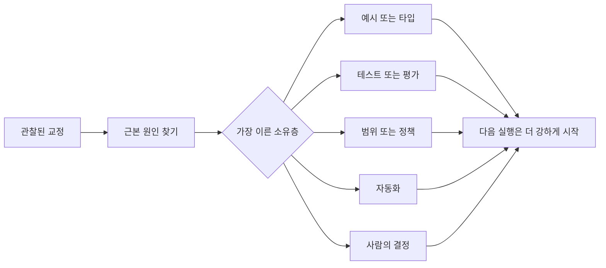

> 🇰🇷 이 문서는 한국어 번역본입니다(ELI5 스타일). 원문: [en.md](en.md)

# 모든 에이전트 교정을 시스템 개선으로 바꾸기

> 채팅에만 존재하는 교정은 딱 한 번의 실행만 고칩니다. 교정을 테스트, 경계, 예시, 도구로 끌어올리면 그 이후의 모든 실행이 좋아집니다.

**유형:** 학습 + 빌드
**언어:** Python (표준 라이브러리)
**선수 지식:** 페이즈 14 레슨 37~41
**시간:** 약 65분

## 학습 목표

- 에이전트 교정을 오래 남는 제어 장치로 바꿉니다.
- 각 제어를, 재발을 막을 수 있는 가장 이른(앞단의) 층에 배치합니다.
- 반복되는 교훈을 안정적인 지문(fingerprint)으로 중복 제거합니다.
- 더 이상 실제 리스크를 지키지 못하는 제어는 은퇴시킵니다.

## 교정은 곧 증거다

에이전트에게 "그 파일을 고치지 마"라고 말했다면, 범위 경계가 실행 가능한 형태가 아니었다는 사실을 배운 것입니다. "이 출력 형태가 틀렸어"라고 말했다면, 예시나 테스트가 빠져 있었다는 사실을 배운 것입니다. 환경 설정이 또 실패했다면, 환경 지식이 자동화 안에 있어야 한다는 사실을 배운 것입니다.

교정을 "프롬프트를 잘 못 쓴 실패"가 아니라 작업 시스템에 대한 관찰로 다루세요.

## 가장 이른 유효 층으로 끌어올리기

다음 순서를 사용하세요:

| 반복되는 실패 | 오래 남는 목적지 |
|---|---|
| 잘못된 결과 또는 회귀(regression) | 테스트 또는 평가 |
| 범위를 벗어나거나 안전하지 않은 행동 | 범위 또는 권한 정책 |
| 반복되는 설정 또는 명령 실수 | 자동화 또는 도구 |
| 반복되는 출력 형식 실수 | 표준 예시 + 검증기 |
| 모호한 로컬 관례 | 시나리오 검사가 붙은 지침 |
| 제품 방향에 대한 의견 차이 | 사람의 결정 기록 |

앞단의 제어일수록 비용이 쌉니다. 잘못된 상태를 애초에 만들지 못하게 막는 타입(type)은, 나중에 잡아 주는 리뷰 코멘트보다 강합니다. "기억해 달라"고 부탁하는 문단보다 집중된 테스트 하나가 강합니다.



## 래칫(ratchet) 기록

다음을 기록하세요:

- 증상;
- 근본 원인;
- 결과(피해);
- 재발 횟수;
- 선택한 제어 장치;
- 그 제어에 대한 검증;
- 소유자;
- 검토 또는 은퇴 날짜.

일회성 취향까지 전부 끌어올리지는 마세요. 재발 횟수나 결과의 심각성이 "영구적인 복잡도 추가"를 정당할 때만 교정을 끌어올리세요.

## 원인과 증상을 구분하기

"에이전트가 README를 고쳤다"는 증상일 뿐입니다. 가능한 원인은 다음과 같습니다:

- 작업이 저장소 루트를 허용했음
- 문서가 암묵적으로 안전하다고 여겨졌음
- 계획이 구현과 문서 작업을 한 덩어리로 묶었음
- 두 작업자의 소유권이 겹쳤음

원인마다 알맞은 제어가 다릅니다. 증상을 그대로 반복하는 규칙은 다음에 조금만 달라져도 실패합니다.

## 제어도 낡는다

오래된 제어는 서로 충돌하고, 컨텍스트를 부풀리고, 이미 사라진 시스템을 반영하는 낡은 지도가 될 수 있습니다. 끌어올린 모든 규칙에는 은퇴 검사가 필요합니다. 다음 경우에는 제거하거나 다시 쓰세요:

- 기반이 되는 아키텍처가 바뀌었을 때
- 더 강한 실행 가능한 제어로 대체됐을 때
- 의미 있을 만큼 긴 기간 동안 그 실패가 재발하지 않았을 때
- 그 제어가 막는 리스크보다 만들어내는 마찰이 더 클 때

목표는 가장 긴 지침 파일이 아닙니다. 소중히 얻은 판단을 지키는 가장 작은 시스템입니다.

## 직접 만들어 보기

이 실습은 교정을 분류하고, 제어로 끌어올리고, 중복을 지문으로 걸러낸 뒤, `outputs/feedback-ratchet.json`에 기록합니다.

실행:

```bash
python3 code/main.py
python3 -m unittest discover code/tests -v
```

원인은 같지만 표현이 다른 교정 두 개를 추가해 보세요. 서로 관련 없는 실패는 하나로 합치지 않으면서, 두 교정이 하나의 제어로 합쳐지도록 정규화를 개선해 보세요.

## 연습 문제

1. 최근 코딩 세션에서 교정 다섯 개를 골라, 각각의 진짜 소유층을 분류해 보세요.
2. 문장으로 된 규칙 하나를 실행 가능한 테스트로 바꿔 보세요.
3. 결과의 심각도 가중치를 추가해서, 첫 발생이 심각하면 바로 끌어올릴 수 있게 해 보세요.
4. 실습 출력에 소유자와 은퇴 날짜를 추가해 보세요.
5. 기존 에이전트 지침 하나를 검토하고, 더 강한 제어가 존재함을 증명한 뒤에만 삭제해 보세요.

## 더 읽을거리

- [Basili, Caldiera, and Rombach, The Goal Question Metric Approach](https://www.cs.toronto.edu/~sme/CSC444F/handouts/GQM-paper.pdf) — 목표를 질문으로, 질문을 측정 가능한 지표로 바꾸는 방법을 다룹니다.
- [Shinn et al., Reflexion](https://arxiv.org/abs/2303.11366) — 모델 가중치를 바꾸지 않으면서 피드백 흔적으로 이후 결정을 개선하는 방법을 다룹니다.
- [Madaan et al., Self-Refine](https://arxiv.org/abs/2303.17651) — 작업 루프 안에서 피드백과 수정을 반복하는 방법을 다룹니다.

## 남는 산출물

`outputs/feedback-ratchet.json`을 남겨 두세요. 이 파일은 에이전트 협업 엔지니어링(Agent-Assisted Engineering) 경로의 오래 남는 마무리 산출물이자, 앞으로 워크벤치를 바꿀 때의 입력입니다.
