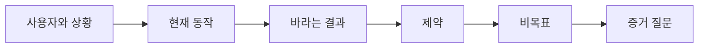

> 🇰🇷 이 문서는 한국어 번역본입니다(ELI5 스타일). 원문: [en.md](en.md)

# 산출물을 고르기 전에 결과부터 정의하기

> 구현이 빨라질수록, 잘못된 문제를 골랐을 때의 벌칙도 커집니다. 결과(성과)의 모양을 먼저 잡아야 속도가 올바른 방향을 향합니다.

**유형:** 학습 + 빌드
**언어:** Python (표준 라이브러리)
**선수 지식:** 없음
**시간:** 약 60분

## 학습 목표

- 해결책 이름을 대지 않고 결과 프레임을 작성합니다.
- 사용자, 상황, 현재 동작, 바라는 변화를 식별합니다.
- 제약 조건과 비목표(non-goals)를 명시합니다.
- 해결책이 범위로 굳어지기 전에 새어 나온 것을 잡아냅니다.

## 산출물은 결과가 아니다

"장애 대응 어시스턴트를 만들어 줘"는 산출물의 이름을 말할 뿐입니다. 누가 필요로 하는지, 무엇이 나아지는지, 무엇이 안전하게 유지되어야 하는지는 말해 주지 않습니다.

결과 프레임은 이렇게 말합니다:

> 운영 환경(프로덕션)에서 알림이 도착했을 때, 당직 엔지니어는 2분 안에 장애가 발생한 서비스와 안전한 다음 행동을 파악한다. 이때 진단은 읽기 전용으로 유지되고 감사(기록)가 가능해야 한다.

이 문장은 소프트웨어로도, 런북(runbook)으로도, 데이터 복구로도, 더 작은 인터페이스 변경으로도 충족될 수 있습니다. 덕분에 팀은 "누군가 먼저 상상한 산출물"이 아니라 결과에 계속 매달리게 됩니다.

## 여섯 부분으로 이루어진 프레임

| 부분 | 질문 |
|---|---|
| 사용자 | 문제를 직접 겪는 사람은 누구인가? |
| 상황 | 언제, 어디서 발생하는가? |
| 현재 동작 | 지금은 무슨 일이 벌어지는가? (임시 편법 포함) |
| 바라는 결과 | 관찰 가능한 어떤 상태가 나아져야 하는가? |
| 제약 | 안전, 정책, 비용, 호환성 한계 중 고정된 것은 무엇인가? |
| 비목표 | 끌리지만 옆가지에 해당하는 작업 중 제외되는 것은 무엇인가? |



## 해결책 누출 찾기

결과 선언문 안에, 증거로 정당화되지 않은 제품 형태, 인터페이스, 모델 선택, 프레임워크, 아키텍처가 들어 있다면 해결책이 새어 나온 것입니다.

- "사용자가 주간 AI 요약을 받는다" — 요약이라는 형태와 주간이라는 주기가 새어 나왔습니다.
- "사용자가 승인 전에 계정 변경을 이해한다" — 결과만 말하고 있습니다.
- "벡터 데이터베이스를 도입한다" — 인프라가 새어 나왔습니다.
- "검토 중에 관련 정책 근거를 볼 수 있다" — 능력(capability)을 말하고 있습니다.

호환성이 정말로 기술을 고정하는 경우라면 제약에 기술 이름을 적어도 됩니다. 왜 고정된 것인지 이유를 기록하세요.

## 제약은 결과를 지킨다

제약은 구현 디테일이 아니라 현실 세계의 목표 일부입니다:

- 진단 중에는 프로덕션(운영 환경)에 쓰기(write) 금지;
- 장애 대응 시간 예산 안에 응답;
- 기존 감사(audit) 이벤트가 계속 정본(source of truth)으로 유지;
- 새 런타임 의존성 추가 금지;
- 접근성 동작 유지.

제약을 어기고 결과에 도달한 결과물은, 결과에 도달한 것이 아닙니다.

## 비목표가 경계를 만든다

비목표는 쓸모 있는 조각(slice)이 플랫폼으로 부풀어 오르는 것을 막아 줍니다. 좋은 비목표는 작업을 거부할 수 있을 만큼 구체적이어야 합니다:

- 자동 복구(remediation) 없음;
- 새로운 알림 라우팅 시스템 없음;
- 장애 사령관(incident commander) 대체 없음;
- 이 조각에서 과거 데이터 분석은 없음.

## 직접 만들어 보기

이 실습은 `OutcomeFrame`을 검증하고 `outputs/outcome-frame.json`에 기록합니다.

```bash
python3 code/main.py
python3 -m unittest discover code/tests -v
```

바라는 결과를 "장애 대응 어시스턴트를 사용한다"로 바꿔 보세요. 검증기가 제안된 산출물이 결과 안으로 새어 들어왔다고 지적해야 합니다.

## 연습 문제

1. 백로그에 있던 기능 요청 하나를 결과 프레임으로 다시 써 보세요.
2. 남은 해결책 후보를 줄여 버리는 제약 하나를 추가해 보세요.
3. 첫 조각을 작게 유지하는 비목표 두 개를 추가해 보세요.
4. 바라는 결과를 반증할 수 있는 가장 이른 관찰을 찾아 보세요.
5. 같은 결과를 충족할 수 있는 서로 다른 산출물 세 가지를 적어 보세요.

## 더 읽을거리

- [Nuseibah and Easterbrook, Requirements Engineering: A Roadmap](https://www.cs.toronto.edu/~sme/papers/2000/ICSE2000.pdf) — 현실 세계의 목표를 소프트웨어 작업의 닻으로 삼는 관점을 다룹니다.
- [Dardenne, van Lamsweerde, and Fickas, Goal-Directed Requirements Acquisition](https://doi.org/10.1016/0167-6423(93)90021-G) — 상위 목표를 제약과 실행 가능한 요구사항으로 다듬는 방법을 다룹니다.

## 남는 산출물

`outputs/outcome-frame.json`을 남겨 두세요. 다음 레슨에서 이 프레임을 사람들이 실제로 수행하는 워크플로와 대조해 봅니다.
