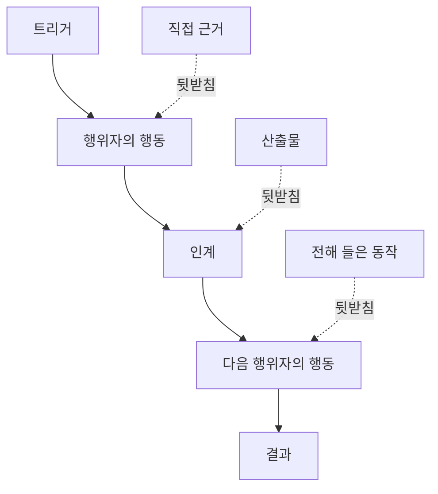

> 🇰🇷 이 문서는 한국어 번역본입니다(ELI5 스타일). 원문: [en.md](en.md)

# 사람들이 실제로 수행하는 워크플로 발견하기

> 요구사항은 회의실에 모여 있는 것이 아닙니다. 행동, 임시 편법, 기록, 의견 차이 곳곳에 흩어져 있습니다.

**유형:** 학습 + 빌드
**언어:** Python (표준 라이브러리)
**선수 지식:** 페이즈 14 레슨 47
**시간:** 약 70분

## 학습 목표

- 현재 워크플로를 근거가 붙은 순서 있는 행동으로 모델링합니다.
- 직접 관찰한 동작과, 전해 들은 동작, 추론한 동작을 구분합니다.
- 마찰 지점, 작업 인계, 권한, 숨은 상태의 위치를 찾아냅니다.
- 불확실한 주장을 요구사항으로 바꿔 버리지 않고, 불확실한 채로 드러나게 유지합니다.

## 현재 시스템에서 시작하기

사람들에게 어떤 기능을 원하는지 묻는 것부터 시작하지 마세요. 지금 무슨 일이 벌어지는지 재구성하는 것부터 시작하세요.

각 단계마다 다음을 기록합니다:

| 필드 | 예시 |
|---|---|
| 행위자 | 당직 엔지니어 |
| 트리거(방아쇠) | 운영 환경 알림 도착 |
| 행동 | 알림을 열고, 대시보드를 검색 |
| 입력 | 알림 페이로드와 배포 기록 |
| 출력 | 용의 서비스 후보와 담당자 |
| 마찰 | 세 가지 도구 사이를 오가는 컨텍스트 전환 |
| 권한 | 장애 사령관이 쓰기(write)를 승인 |
| 근거 | 화면 녹화, 장애 로그, 런북 |

워크플로는 화면에 보이는 것보다 큽니다. 기다림, 복사-붙여넣기, 몰래 쓰는 옆 채널, 승인, 오류 복구, 그리고 사람들이 이미 눈에도 띄지 않게 된 단계까지 모두 포함됩니다.

## 근거에는 강도가 있다

간단한 근거 사다리를 사용하세요:

1. **직접 관찰된 동작:** 관찰, 트레이스, 녹화, 시스템 이벤트.
2. **산출물(아티팩트):** 티켓, 런북, 로그, 서식, 완성된 결과물.
3. **전해 들은 동작:** 어떤 사람이 자기가 하는 일을 말로 설명함.
4. **추론:** 팀이 "아마 이렇게 되겠지"라고 결론 내림.

네 가지 모두 쓸모가 있습니다. 하지만 현재 동작을 직접 증명하는 것은 앞의 두 가지뿐입니다. 나머지에는 등급을 표시해 두어야, 확신이 아무도 모르게 부풀어 오르는 일을 막을 수 있습니다.



## 네 가지를 찾아라

- **마찰:** 반복되는 수고, 지연, 재진입, 복구.
- **숨은 상태:** 머릿속, 채팅, 개인 메모에만 존재하는 사실.
- **권한:** 중요한 변경을 할 수 있는 사람 또는 시스템.
- **예외:** 정상적인 워크플로가 더 이상 정상이 아니게 되는 사례.

AI 기능은 인계 지점과 예외 상황에서 자주 실패합니다. 행복 경로(happy path)만 설계해 두었기 때문입니다.

## 의견 차이를 평균으로 지워 버리지 마라

두 사용자가 그럴 만한 이유가 있어서 서로 다른 워크플로를 수행할 수 있습니다. 변형(variant)이 다음 중 무엇을 의미하는지 이해할 때까지는 그 변형을 보존하세요:

- 역할이 다름;
- 리스크 수준이 다름;
- 구식 절차와 현재 절차가 공존함;
- 숙련도 차이;
- 진짜 정책상 의견 차이.

평균 내버린 워크플로는 아무도 설명하지 못하는 워크플로가 될 수 있습니다.

## 직접 만들어 보기

이 실습은 모든 워크플로 단계에 근거를 저장하고, 순서와 신뢰도를 검증하고, 직접 근거 비율을 계산한 뒤, `outputs/workflow-evidence.json`에 기록합니다.

```bash
python3 code/main.py
python3 -m unittest discover code/tests -v
```

배포 기록이 없는 예외 경로를 추가해 보세요. 기본 순서는 그대로 유지하고, 갈라져 나오는 지점을 기록하세요.

## 연습 문제

1. 아무도 인터뷰하지 않고 로그만으로 하나의 워크플로를 재구성해 보세요.
2. 사용자 한 명을 인터뷰하면서, 아직 직접 근거가 없는 주장에 모두 표시해 보세요.
3. 권한 경계 하나와 실패 복구 단계 하나를 추가해 보세요.
4. 워크플로 변형 두 개를 합치지 않고 모델링해 보세요.
5. 눈에 보이는 단계는 없애지만 숨은 작업은 그대로 두는 제안된 기능 하나를 찾아 보세요.

## 더 읽을거리

- [Nuseibah and Easterbrook, Requirements Engineering: A Roadmap](https://www.cs.toronto.edu/~sme/papers/2000/ICSE2000.pdf) — 특히 요구사항 도출을 단순 수집이 아니라 해석, 모델링, 검증으로 다루는 부분을 읽어 보세요.
- [Gotel and Finkelstein, An Analysis of the Requirements Traceability Problem](https://doi.org/10.1109/ICRE.1994.292398) — 요구사항과 그 출처 사이의 관계를 유지하기가 왜 어려운지 다룹니다.

## 남는 산출물

`outputs/workflow-evidence.json`을 남겨 두세요. 다음 레슨에서 이 파일이 관찰된 마찰과 불확실성을 가정 지도로 바꿔 줍니다.
