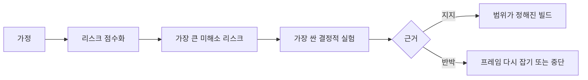

> 🇰🇷 이 문서는 한국어 번역본입니다(ELI5 스타일). 원문: [en.md](en.md)

# 가정을 지도화하고 가장 위험한 가정부터 해소하기

> 로드맵은 불확실성을 기능 안에 숨겨 버립니다. 가정 지도는 "이 기능들이 존재할 자격이 생기려면 무엇이 참이어야 하는가"를 드러냅니다.

**유형:** 학습 + 빌드
**언어:** Python (표준 라이브러리)
**선수 지식:** 페이즈 14 레슨 48
**시간:** 약 65분

## 학습 목표

- 제안된 작업을 명시적인 가정으로 바꿉니다.
- 영향력, 불확실성, 되돌릴 수 없음을 각각 따로 점수화합니다.
- 열정이 아니라 리스크를 기준으로 다음 실험을 고릅니다.
- 검증된 가정은 근거와 결정으로 대체합니다.

## 모든 결과물에는 베팅이 숨어 있다

장애 대응 도구는 다음이 모두 참이라는 전제 위에 서 있습니다:

- 알림 컨텍스트에 서비스를 식별할 만한 정보가 충분히 담겨 있다;
- 엔지니어는 스스로 도출하지 않은 추천도 믿어 준다;
- 목표한 응답 시간이 운영상 의미가 있다;
- 필요한 데이터를 위험한 권한 없이 접근할 수 있다;
- 그 워크플로가 유지보수할 가치가 있을 만큼 자주 발생한다.

이것들은 구현 작업이 아닙니다. 그 결과물이 가치 있고, 쓸 수 있고, 만들 수 있고, 안전하기 위한 조건들입니다.

## 가정의 분류

| 분류 | 질문 |
|---|---|
| 가치(Value) | 그 결과가 충분히 중요할 것인가? |
| 사용성(Usability) | 사용자가 이해하고 행동에 옮길 수 있는가? |
| 실현 가능성(Feasibility) | 가진 데이터와 제약 안에서 시스템이 만들어 낼 수 있는가? |
| 지속 가능성(Viability) | 조직이 비용, 소유권, 운영을 계속 감당할 수 있는가? |
| 안전(Safety) | 감당 못할 결과 없이 실패할 수 있는가? |

가정은 반증 가능한 문장으로 쓰세요. "이 기능은 유용하다"는 검증할 수 없습니다. "당직 엔지니어 10명 중 8명이 읽기 전용 결과를 보면 더 빨리 올바른 서비스를 식별한다"는 검증할 수 있습니다.

## 리스크는 숫자 하나가 아니다

이 실습은 1부터 5까지의 세 차원을 사용합니다:

- **영향력(Impact):** 가정이 틀렸을 때의 피해.
- **불확실성(Uncertainty):** 현재 가진 근거가 약한 정도.
- **되돌릴 수 없음(Irreversibility):** 결정을 내린 뒤에 배우는 비용.

예제 점수는 영향력과 불확실성을 곱한 뒤 되돌릴 수 없음을 더합니다. 이 공식이 만능은 아닙니다. 목적은 "어떤 미지를 다른 미지보다 먼저 해소해야 하는지 이유를 말하게 만드는 것"입니다.



## 확인 의식이 아니라 실험을 설계하라

쓸모 있는 테스트에는 다음이 있습니다:

- 거짓일 가능성이 있는 주장;
- 모집단 또는 현실적인 표본;
- 관찰 가능한 결과;
- 결과를 보기 전에 정해 둔 기준선(임계값);
- 통과, 실패, 애매한 근거 각각에 대한 다음 결정.

"팀이 그 아이디어를 만들 수 있다는 것"만 보여 주는 테스트는 피하세요.

## 되돌릴 수 있느냐가 순서를 바꾼다

결과가 크고 되돌릴 수 없는 선택일수록 근거를 먼저 확보해야 합니다. 읽기 전용 리플레이(replay)는 프로덕션(운영 환경) 통합보다 앞설 수 있습니다. 임시 어댑터는 데이터 마이그레이션보다 앞설 수 있습니다. 사람이 승인하는 추천은 자동 실행보다 앞설 수 있습니다.

빌드의 모양은 불확실성의 모양을 따라야 합니다.

## 직접 만들어 보기

이 실습은 가정의 순위를 매기고, 검증된 주장과 열린 주장을 구분하고, 가장 큰 열린 리스크를 고른 뒤, `outputs/assumption-map.json`에 기록합니다.

```bash
python3 code/main.py
python3 -m unittest discover code/tests -v
```

가장 리스크가 큰 가정의 근거를 바꿔 보고, 다음 실험이 어떻게 달라지는지 관찰하세요.

## 연습 문제

1. 만들고 싶은 기능에 대한 가정 다섯 개를 적어 보세요.
2. 기능 목록에서 빠뜨린 안전 가정 하나를 추가해 보세요.
3. 빌드를 중단하게 만들 기준선을 정의해 보세요.
4. 큰 실험 하나를 더 싼 결정적 테스트로 바꿔 보세요.
5. 리스크 순위와 로드맵 우선순위를 비교하고, 그 불일치를 설명해 보세요.

## 더 읽을거리

- [Barry Boehm, A Spiral Model of Software Development and Enhancement](https://dl.acm.org/doi/10.1145/12944.12948) — 더 깊이 헌신하기 전에 불확실성을 해소하는 리스크 주도 개발 주기를 다룹니다.
- [Dardenne, van Lamsweerde, and Fickas, Goal-Directed Requirements Acquisition](https://doi.org/10.1016/0167-6423(93)90021-G) — 장애물과 제약을 드러내면서 목표를 다듬는 방법을 다룹니다.

## 남는 산출물

`outputs/assumption-map.json`을 남겨 두세요. 다음 레슨에서 이 지도를 이용해 결정적인 근거를 만들어 낼 수 있는 가장 작은 조각을 고릅니다.
